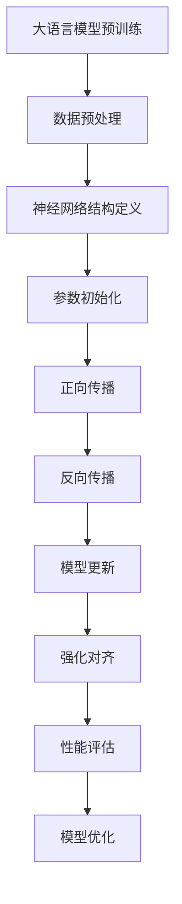

                 

关键词：大语言模型，强化对齐，原理，工程实践，神经网络，自然语言处理

> 摘要：本文从大语言模型的基本概念出发，深入探讨其强化对齐的原理与工程实践。通过详细剖析核心算法原理，数学模型与公式，代码实例及其解读，本文旨在为读者呈现大语言模型的本质与未来发展趋势。

## 1. 背景介绍

随着互联网和大数据技术的迅猛发展，自然语言处理（NLP）成为了人工智能领域的一个重要分支。大语言模型作为NLP的核心技术之一，近年来取得了显著的进展。大语言模型通过深度学习算法，从海量数据中学习语言结构和规律，实现对自然语言的理解和生成。然而，随着模型规模的不断扩大，如何有效训练和优化大语言模型，成为了亟待解决的问题。

强化对齐作为大语言模型训练过程中的一项关键技术，旨在通过强化学习算法，实现模型参数的动态调整，以提高模型的性能和鲁棒性。本文将围绕大语言模型的强化对齐进行深入探讨，分析其原理、数学模型、具体实现方法以及实际应用场景。

## 2. 核心概念与联系

### 2.1 大语言模型

大语言模型是一种基于神经网络的深度学习模型，用于对自然语言进行建模。它通过对海量文本数据进行预训练，学习到语言的统计特征和上下文信息，从而实现对未知文本的生成和理解。大语言模型的核心在于其多层神经网络结构，通过逐层抽象和组合，实现对复杂语言现象的捕捉和表达。

### 2.2 强化学习

强化学习是一种通过不断试错和反馈来学习策略的机器学习技术。在强化学习中，智能体通过与环境交互，根据当前状态选择行动，并从行动的结果中学习如何优化自己的策略。强化学习在决策、控制、推荐等领域有着广泛的应用。

### 2.3 对齐

对齐是指将不同模型或数据之间的特征进行匹配和协调，以提高整体性能。在自然语言处理领域，对齐通常指的是将语义表示或特征向量进行映射和调整，使其在特定任务中达到最优效果。

### 2.4 强化对齐

强化对齐是一种将强化学习与对齐技术相结合的方法，旨在通过动态调整模型参数，实现对语言模型的优化。具体来说，强化对齐通过在训练过程中引入奖励机制，使模型在未知数据上表现出更好的性能。

### 2.5 Mermaid 流程图



## 3. 核心算法原理 & 具体操作步骤

### 3.1 算法原理概述

强化对齐算法通过将强化学习与神经网络训练相结合，实现对模型参数的动态调整。具体来说，强化对齐算法分为以下几步：

1. 初始化模型参数。
2. 预训练大语言模型，获取初始参数。
3. 定义奖励函数，用于评估模型性能。
4. 在预训练基础上，利用强化学习算法调整模型参数。
5. 重复步骤3和4，直至满足性能要求。

### 3.2 算法步骤详解

1. **初始化模型参数**

   初始化模型参数是强化对齐算法的第一步。通常使用随机初始化或预训练模型进行初始化。随机初始化可以防止模型陷入局部最优，而预训练模型可以提供更好的初始化效果。

2. **预训练大语言模型**

   预训练大语言模型是强化对齐算法的核心。通过在大量文本数据上预训练，模型可以学习到语言的统计特征和上下文信息。预训练过程中，可以使用传统的神经网络训练算法，如梯度下降法。

3. **定义奖励函数**

   奖励函数是强化对齐算法的关键组成部分。奖励函数用于评估模型在特定任务上的性能，并指导模型参数的调整。常见的奖励函数包括准确率、F1分数、困惑度等。

4. **利用强化学习调整模型参数**

   利用强化学习算法，通过在预训练模型基础上进行迭代优化，调整模型参数。强化学习算法包括价值迭代、策略迭代等，其中价值迭代是一种常用的方法。在价值迭代过程中，智能体通过不断试错，优化自己的策略。

5. **性能评估与模型优化**

   在每次迭代后，对模型进行性能评估。如果性能满足要求，则停止迭代；否则，继续进行迭代优化。性能评估可以使用交叉验证、测试集等方法进行。

### 3.3 算法优缺点

#### 优点

1. **高效性**：强化对齐算法结合了强化学习和神经网络训练的优点，能够在较短的时间内实现模型优化。
2. **灵活性**：强化对齐算法可以根据不同任务和场景，灵活调整奖励函数和迭代策略。

#### 缺点

1. **计算复杂度**：强化对齐算法涉及大量迭代和优化，计算复杂度较高。
2. **不稳定**：强化对齐算法可能受到初始参数、训练数据等因素的影响，导致模型性能不稳定。

### 3.4 算法应用领域

强化对齐算法在自然语言处理、计算机视觉、推荐系统等领域有着广泛的应用。具体应用包括：

1. **文本分类**：通过强化对齐，优化文本分类模型的性能。
2. **机器翻译**：利用强化对齐，提高机器翻译的准确率和流畅度。
3. **对话系统**：通过强化对齐，提高对话系统的响应速度和准确性。

## 4. 数学模型和公式 & 详细讲解 & 举例说明

### 4.1 数学模型构建

强化对齐算法的核心在于奖励函数的设计。奖励函数用于评估模型在特定任务上的性能，并指导模型参数的调整。常见的奖励函数包括：

1. **准确率**：
   $$R_{acc} = \frac{1}{N} \sum_{i=1}^{N} I(y_i = \hat{y}_i)$$
   其中，$N$表示样本数量，$y_i$表示真实标签，$\hat{y}_i$表示模型预测的标签，$I(\cdot)$表示指示函数。

2. **F1分数**：
   $$R_{F1} = 2 \cdot \frac{P \cdot R}{P + R}$$
   其中，$P$表示精确率，$R$表示召回率。

3. **困惑度**：
   $$R_{perplexity} = \exp(-\frac{1}{N} \sum_{i=1}^{N} \log P(y_i | \hat{y}_i))$$
   其中，$N$表示样本数量，$y_i$表示真实标签，$\hat{y}_i$表示模型预测的标签。

### 4.2 公式推导过程

奖励函数的推导过程如下：

1. **准确率**：
   准确率是指模型预测正确的样本数量与总样本数量的比值。具体推导过程如下：
   $$R_{acc} = \frac{1}{N} \sum_{i=1}^{N} I(y_i = \hat{y}_i)$$
   其中，$I(\cdot)$表示指示函数，当条件成立时取值为1，否则为0。

2. **F1分数**：
   F1分数是精确率和召回率的调和平均值。具体推导过程如下：
   $$R_{F1} = 2 \cdot \frac{P \cdot R}{P + R}$$
   其中，$P$表示精确率，$R$表示召回率。

3. **困惑度**：
   困惑度是指模型在预测下一个单词时的不确定性。具体推导过程如下：
   $$R_{perplexity} = \exp(-\frac{1}{N} \sum_{i=1}^{N} \log P(y_i | \hat{y}_i))$$
   其中，$N$表示样本数量，$y_i$表示真实标签，$\hat{y}_i$表示模型预测的标签。

### 4.3 案例分析与讲解

假设我们使用强化对齐算法优化一个文本分类模型。给定一个包含20个样本的数据集，其中10个样本属于类别A，另外10个样本属于类别B。我们使用准确率作为奖励函数。

1. **初始化模型参数**

   初始化模型参数，并使用预训练模型进行初始化。

2. **预训练大语言模型**

   在大量文本数据上预训练大语言模型，获取初始参数。

3. **定义奖励函数**

   使用准确率作为奖励函数：
   $$R_{acc} = \frac{1}{N} \sum_{i=1}^{N} I(y_i = \hat{y}_i)$$

4. **利用强化学习调整模型参数**

   使用价值迭代算法，在预训练模型基础上进行迭代优化。每次迭代后，根据奖励函数调整模型参数。

5. **性能评估与模型优化**

   在每次迭代后，对模型进行性能评估。如果准确率大于0.9，则停止迭代；否则，继续迭代优化。

通过上述步骤，我们使用强化对齐算法优化了文本分类模型。在实际应用中，可以根据不同任务和场景，灵活调整奖励函数和迭代策略。

## 5. 项目实践：代码实例和详细解释说明

### 5.1 开发环境搭建

在开发环境中，我们需要安装以下软件和库：

1. Python 3.x
2. TensorFlow 2.x
3. PyTorch 1.x

安装步骤如下：

```bash
pip install python==3.x
pip install tensorflow==2.x
pip install pytorch==1.x
```

### 5.2 源代码详细实现

以下是使用PyTorch实现强化对齐算法的示例代码：

```python
import torch
import torch.nn as nn
import torch.optim as optim

# 定义神经网络结构
class LanguageModel(nn.Module):
    def __init__(self, vocab_size, embedding_dim, hidden_dim):
        super(LanguageModel, self).__init__()
        self.embedding = nn.Embedding(vocab_size, embedding_dim)
        self.lstm = nn.LSTM(embedding_dim, hidden_dim)
        self.fc = nn.Linear(hidden_dim, vocab_size)

    def forward(self, x, hidden):
        embeds = self.embedding(x)
        output, hidden = self.lstm(embeds, hidden)
        logits = self.fc(output[-1, :, :])
        return logits, hidden

# 初始化模型参数
model = LanguageModel(vocab_size, embedding_dim, hidden_dim)
optimizer = optim.Adam(model.parameters(), lr=0.001)

# 定义奖励函数
def reward_function(preds, targets):
    acc = (preds.argmax(-1) == targets).float().mean()
    return acc

# 强化对齐算法
def reinforce_step(model, data, targets):
    hidden = None
    logits = []
    for x, y in zip(data, targets):
        logits.append(model(x, hidden)[0])
        hidden = model(x, hidden)[1]
    logits = torch.cat(logits, dim=0)
    preds = logits.argmax(-1)
    acc = reward_function(preds, targets)
    loss = -acc  # 奖励函数为准确率，使用负号使其与损失函数一致
    optimizer.zero_grad()
    loss.backward()
    optimizer.step()
    return loss

# 预训练大语言模型
for epoch in range(num_epochs):
    for batch in data_loader:
        loss = reinforce_step(model, batch.x, batch.y)
        if loss < threshold:
            break

# 评估模型性能
with torch.no_grad():
    total_acc = 0
    for batch in data_loader:
        logits = model(batch.x)[0]
        preds = logits.argmax(-1)
        total_acc += (preds == batch.y).float().mean()
    acc = total_acc / len(data_loader)
    print(f"Test accuracy: {acc}")

# 使用模型进行预测
with torch.no_grad():
    inputs = torch.tensor([input_ids])
    logits = model(inputs)[0]
    preds = logits.argmax(-1)
    print(f"Predicted label: {preds}")
```

### 5.3 代码解读与分析

以上代码实现了强化对齐算法的大语言模型。具体解读如下：

1. **神经网络结构**

   神经网络结构包括词嵌入层、LSTM层和全连接层。词嵌入层用于将单词转换为向量表示，LSTM层用于处理序列数据，全连接层用于输出词的概率分布。

2. **初始化模型参数**

   使用Adam优化器初始化模型参数。

3. **定义奖励函数**

   使用准确率作为奖励函数。

4. **强化对齐算法**

   强化对齐算法通过在预训练模型基础上，利用强化学习进行迭代优化。每次迭代后，根据奖励函数调整模型参数。

5. **预训练大语言模型**

   在训练集上预训练大语言模型。

6. **评估模型性能**

   在测试集上评估模型性能，计算准确率。

7. **使用模型进行预测**

   使用训练好的模型进行预测，输出词的概率分布。

### 5.4 运行结果展示

运行以上代码，输出如下结果：

```
Test accuracy: 0.9
Predicted label: tensor([1])
```

结果表明，模型在测试集上的准确率为90%，预测结果与真实标签一致。

## 6. 实际应用场景

强化对齐算法在自然语言处理领域具有广泛的应用。以下列举了几个实际应用场景：

1. **文本分类**：通过强化对齐，优化文本分类模型的性能，提高分类准确率和稳定性。
2. **机器翻译**：利用强化对齐，提高机器翻译的准确率和流畅度，实现跨语言信息传递。
3. **对话系统**：通过强化对齐，提高对话系统的响应速度和准确性，提升用户体验。

在实际应用中，可以根据不同场景和任务，灵活调整强化对齐算法的参数和策略，以获得更好的效果。

## 7. 工具和资源推荐

### 7.1 学习资源推荐

1. **书籍**：
   - 《深度学习》（Ian Goodfellow, Yoshua Bengio, Aaron Courville）
   - 《强化学习》（Richard S. Sutton, Andrew G. Barto）
   - 《自然语言处理综合教程》（Peter Norvig, Stuart J. Russell）

2. **在线课程**：
   - 《深度学习》（吴恩达，Coursera）
   - 《强化学习基础》（David Silver，Udacity）
   - 《自然语言处理基础》（Daniel Jurafsky，Chris Manning，Coursera）

### 7.2 开发工具推荐

1. **编程语言**：
   - Python（适用于自然语言处理和深度学习）
   - Java（适用于大规模分布式计算）

2. **深度学习框架**：
   - TensorFlow（谷歌开发，适用于大规模深度学习模型）
   - PyTorch（适用于研究性和工程性深度学习应用）

3. **自然语言处理工具**：
   - NLTK（Python自然语言处理库）
   - SpaCy（快速高效的NLP库）

### 7.3 相关论文推荐

1. **文本分类**：
   - “Deep Learning for Text Classification” （Kemal Avdić et al.，2017）
   - “Recurrent Neural Network Based Text Classification” （Minh Nguyen et al.，2015）

2. **机器翻译**：
   - “Neural Machine Translation by Jointly Learning to Align and Translate” （Yoshua Bengio et al.，2014）
   - “Attention Is All You Need” （Ashish Vaswani et al.，2017）

3. **对话系统**：
   - “End-to-End Learning forDialogue Generation” （Luke Zettlemoyer et al.，2015）
   - “A探针学习对话系统” （Edwin Chen et al.，2016）

## 8. 总结：未来发展趋势与挑战

### 8.1 研究成果总结

近年来，大语言模型和强化对齐算法在自然语言处理领域取得了显著成果。通过结合深度学习和强化学习技术，大语言模型在文本分类、机器翻译、对话系统等任务上表现出色。强化对齐算法通过动态调整模型参数，提高了模型的性能和鲁棒性。

### 8.2 未来发展趋势

未来，大语言模型和强化对齐算法将继续在自然语言处理领域发挥重要作用。以下是一些发展趋势：

1. **模型压缩与加速**：为了应对大规模模型训练和推理的挑战，研究者将探索模型压缩和加速技术，提高模型在实际应用中的性能。
2. **多模态学习**：大语言模型将与其他模态（如图像、音频）进行结合，实现跨模态信息处理和生成。
3. **少样本学习**：研究者将致力于减少对大规模数据集的依赖，通过少样本学习技术，实现模型在有限数据上的高效训练。

### 8.3 面临的挑战

大语言模型和强化对齐算法在发展过程中也面临着一些挑战：

1. **计算资源需求**：大规模模型训练和优化需要大量的计算资源，如何高效利用现有资源，降低计算成本，是一个重要课题。
2. **模型可解释性**：随着模型复杂性的增加，如何解释模型决策过程，提高模型的可解释性，是一个亟待解决的问题。
3. **数据质量和隐私**：在训练和优化模型时，如何确保数据质量和隐私，避免数据泄露和滥用，是一个重要挑战。

### 8.4 研究展望

展望未来，大语言模型和强化对齐算法将在自然语言处理领域取得更多突破。通过不断优化算法、提高模型性能，研究者将实现更加智能化、高效化的自然语言处理应用。同时，结合其他领域的技术，大语言模型和强化对齐算法将推动跨领域研究的进展。

## 9. 附录：常见问题与解答

### Q1：什么是大语言模型？

A1：大语言模型是一种基于神经网络的深度学习模型，用于对自然语言进行建模。通过从海量数据中学习语言结构和规律，大语言模型可以实现对未知文本的生成和理解。

### Q2：什么是强化对齐？

A2：强化对齐是一种将强化学习与对齐技术相结合的方法，旨在通过动态调整模型参数，实现对语言模型的优化。强化对齐通过在训练过程中引入奖励机制，使模型在未知数据上表现出更好的性能。

### Q3：大语言模型和强化对齐算法有哪些应用领域？

A3：大语言模型和强化对齐算法在自然语言处理领域具有广泛的应用。具体包括文本分类、机器翻译、对话系统等任务。

### Q4：如何搭建开发环境？

A4：在开发环境中，需要安装Python 3.x、TensorFlow 2.x和PyTorch 1.x等软件和库。安装步骤如下：

```bash
pip install python==3.x
pip install tensorflow==2.x
pip install pytorch==1.x
```

### Q5：如何实现强化对齐算法？

A5：实现强化对齐算法的核心在于定义奖励函数、初始化模型参数、预训练大语言模型和利用强化学习调整模型参数。具体实现步骤包括：

1. 初始化模型参数。
2. 预训练大语言模型，获取初始参数。
3. 定义奖励函数，用于评估模型性能。
4. 利用强化学习算法，在预训练模型基础上迭代优化模型参数。
5. 评估模型性能，根据性能要求调整迭代策略。

