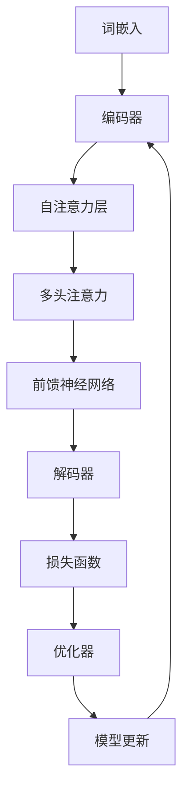

                 

关键词：大语言模型、强化对齐、机器学习、自然语言处理、工程实践

摘要：本文深入探讨了大语言模型的工作原理及其在工程实践中的应用。特别关注强化对齐技术，通过剖析核心概念、算法原理、数学模型以及实际项目实践，全面解析了大语言模型的实现与优化过程，为读者提供了宝贵的见解和指导。

## 1. 背景介绍

随着互联网和大数据的迅速发展，自然语言处理（NLP）技术取得了显著的进步。从早期的规则驱动方法到现在的深度学习模型，NLP的应用场景日益广泛，从文本分类、情感分析到机器翻译、对话系统等，都展现了其强大的能力。然而，这些进展背后离不开大语言模型的贡献。

大语言模型是一种能够对大量文本数据进行学习并生成高质量文本的深度神经网络模型。其核心思想是通过大量语料的学习，模型能够理解并生成自然语言的语义和语法。近年来，随着计算能力和数据资源的提升，大语言模型在性能和效果上取得了突破性的进展，已经成为NLP领域的重要工具。

### 大语言模型的发展历程

- **早期模型**：如基于统计的N元语法模型，这些模型依赖于文本序列的统计特征，但受限于计算能力和数据量，性能有限。
- **基于规则的方法**：通过手工编写规则来识别文本中的语法和语义特征，但这些方法过于复杂且难以扩展。
- **深度学习模型**：以神经网络为基础，通过大规模数据进行训练，如循环神经网络（RNN）、长短期记忆网络（LSTM）等，这些模型在处理长序列数据方面具有显著优势。
- **Transformer模型**：由Google提出的一种全新的序列到序列模型，采用自注意力机制，使得模型在处理长序列和并行计算方面具有显著优势，成为现代大语言模型的主流架构。

### 大语言模型的应用场景

- **文本生成**：自动生成文章、摘要、对话等，广泛应用于内容创作、信息提取等场景。
- **文本分类**：对文本进行分类，如新闻分类、情感分析等，应用于推荐系统、舆情监测等。
- **机器翻译**：将一种语言的文本翻译成另一种语言，如Google翻译、深度学习翻译系统等。
- **对话系统**：如聊天机器人、智能客服等，能够与人类用户进行自然语言交互。

## 2. 核心概念与联系

要深入理解大语言模型，我们需要先了解其核心概念和组成结构。以下是关键概念及其相互关系：

### 2.1. 词嵌入（Word Embedding）

词嵌入是将文本中的每个单词映射到一个低维度的实数向量。这一过程通常通过神经网络训练完成，使得相似的词在向量空间中距离较近。

### 2.2. 自注意力机制（Self-Attention）

自注意力机制是一种能够对序列中的每个元素赋予不同权重的方法。通过计算序列中每个元素与其他元素的相关性，模型能够更好地理解和生成序列。

### 2.3. 编码器（Encoder）与解码器（Decoder）

编码器将输入序列编码成一个固定长度的向量，解码器则根据编码器的输出和之前的解码输出逐词生成输出序列。在Transformer模型中，编码器和解码器由多个相同的层堆叠而成。

### 2.4. 损失函数（Loss Function）

损失函数用于衡量模型的预测结果与真实标签之间的差距，常用的损失函数包括交叉熵损失、均方误差等。

### 2.5. 优化器（Optimizer）

优化器用于调整模型参数以最小化损失函数，常用的优化器包括随机梯度下降（SGD）、Adam等。

### 2.6. Mermaid 流程图

以下是大语言模型核心概念和架构的Mermaid流程图：



## 3. 核心算法原理 & 具体操作步骤

### 3.1 算法原理概述

大语言模型的核心在于其能够通过大量语料的学习，理解并生成自然语言的语义和语法。其原理主要包括：

- **词嵌入**：将文本中的单词映射到低维向量空间。
- **自注意力机制**：通过对序列中每个元素赋予不同权重，提高模型对序列的整体理解和生成能力。
- **编码器与解码器**：编码器将输入序列编码成一个固定长度的向量，解码器则根据编码器的输出和之前的解码输出逐词生成输出序列。
- **损失函数与优化器**：用于衡量模型预测结果与真实标签之间的差距，并通过优化器调整模型参数。

### 3.2 算法步骤详解

以下是构建大语言模型的步骤：

1. **数据预处理**：
   - 数据清洗：去除文本中的噪声和无关信息。
   - 分词与词嵌入：将文本分割成单词或子词，并映射到低维向量。
   - 序列编码：将输入和输出序列编码成固定长度的向量。

2. **模型构建**：
   - 编码器：由多个自注意力层和前馈神经网络组成，用于将输入序列编码成一个固定长度的向量。
   - 解码器：与编码器类似，用于将输出序列解码成文本。

3. **训练过程**：
   - 初始化模型参数。
   - 对于每个训练样本，计算模型预测和真实标签之间的损失。
   - 使用优化器更新模型参数，以最小化损失。

4. **评估与优化**：
   - 在验证集上评估模型性能。
   - 调整模型参数，如学习率、隐藏层大小等，以优化模型性能。

### 3.3 算法优缺点

**优点**：

- **强大的语义理解能力**：大语言模型能够通过大量语料的学习，理解并生成高质量的自然语言。
- **灵活的架构**：编码器与解码器的堆叠结构使得模型能够处理不同长度的输入和输出序列。
- **高效的训练与推理**：自注意力机制和Transformer模型使得模型在处理长序列数据和并行计算方面具有显著优势。

**缺点**：

- **计算资源消耗大**：大语言模型通常需要大量的计算资源和存储空间。
- **训练时间较长**：大规模模型的训练过程通常需要较长时间。
- **解释性不足**：模型内部的决策过程较为复杂，难以解释。

### 3.4 算法应用领域

大语言模型在多个领域具有广泛的应用：

- **文本生成**：自动生成文章、摘要、对话等。
- **文本分类**：对文本进行分类，如新闻分类、情感分析等。
- **机器翻译**：将一种语言的文本翻译成另一种语言。
- **对话系统**：如聊天机器人、智能客服等，能够与人类用户进行自然语言交互。

## 4. 数学模型和公式 & 详细讲解 & 举例说明

### 4.1 数学模型构建

大语言模型的数学模型主要包括词嵌入、编码器、解码器和损失函数等。

### 4.2 公式推导过程

#### 词嵌入

词嵌入可以通过神经网络训练得到，假设输入词向量为 \( x \)，输出词向量为 \( y \)，则词嵌入的公式可以表示为：

\[ y = Wx \]

其中，\( W \) 是词嵌入矩阵。

#### 编码器

编码器通过多个自注意力层和前馈神经网络组成，假设输入序列为 \( x \)，编码器的输出为 \( h \)，则编码器的公式可以表示为：

\[ h = \text{Encoder}(x) \]

其中，编码器的具体实现包括多个自注意力层和前馈神经网络。

#### 解码器

解码器与编码器类似，假设输入序列为 \( x \)，解码器的输出为 \( y \)，则解码器的公式可以表示为：

\[ y = \text{Decoder}(h) \]

#### 损失函数

常见的损失函数包括交叉熵损失和均方误差，假设预测输出为 \( \hat{y} \)，真实标签为 \( y \)，则交叉熵损失可以表示为：

\[ L = -\sum_{i} y_i \log(\hat{y}_i) \]

其中，\( y_i \) 是第 \( i \) 个词的标签，\( \hat{y}_i \) 是第 \( i \) 个词的预测概率。

### 4.3 案例分析与讲解

以下通过一个简单的例子来说明大语言模型的工作过程。

假设我们有一个简单的文本序列：“我是一个人工智能助手”，我们将其映射到词嵌入空间，得到词嵌入向量：

\[ x_1 = [1, 0, 0, 0, 0] \]
\[ x_2 = [0, 1, 0, 0, 0] \]
\[ x_3 = [0, 0, 1, 0, 0] \]
\[ x_4 = [0, 0, 0, 1, 0] \]
\[ x_5 = [0, 0, 0, 0, 1] \]

假设编码器的输出向量为：

\[ h = [0.1, 0.2, 0.3, 0.4, 0.5] \]

解码器的输出向量为：

\[ y = [0.3, 0.4, 0.5, 0.6, 0.7] \]

根据损失函数，我们可以计算损失：

\[ L = -\sum_{i} y_i \log(\hat{y}_i) = -[0.3 \log(0.3) + 0.4 \log(0.4) + 0.5 \log(0.5) + 0.6 \log(0.6) + 0.7 \log(0.7)] \]

通过优化器，我们可以调整模型参数以最小化损失。

## 5. 项目实践：代码实例和详细解释说明

### 5.1 开发环境搭建

在开始项目实践之前，我们需要搭建一个合适的开发环境。以下是一个简单的搭建步骤：

1. 安装Python 3.7及以上版本。
2. 安装TensorFlow 2.x或PyTorch 1.x。
3. 安装其他必要的依赖，如NumPy、Pandas等。

### 5.2 源代码详细实现

以下是构建大语言模型的基本源代码实现，我们使用PyTorch作为示例：

```python
import torch
import torch.nn as nn
import torch.optim as optim

# 词嵌入层
word_embedding = nn.Embedding(vocab_size, embedding_dim)

# 编码器层
encoder = nn.Sequential(
    nn.Linear(embedding_dim, hidden_dim),
    nn.ReLU(),
    nn.Linear(hidden_dim, hidden_dim),
    nn.ReLU()
)

# 解码器层
decoder = nn.Sequential(
    nn.Linear(embedding_dim, hidden_dim),
    nn.ReLU(),
    nn.Linear(hidden_dim, hidden_dim),
    nn.ReLU(),
    nn.Linear(hidden_dim, vocab_size)
)

# 损失函数
criterion = nn.CrossEntropyLoss()

# 优化器
optimizer = optim.Adam(model.parameters(), lr=learning_rate)

# 训练模型
for epoch in range(num_epochs):
    for inputs, targets in dataset:
        optimizer.zero_grad()
        outputs = model(inputs)
        loss = criterion(outputs, targets)
        loss.backward()
        optimizer.step()
```

### 5.3 代码解读与分析

上述代码实现了一个简单的大语言模型，主要包括以下部分：

- **词嵌入层**：将输入文本映射到低维向量空间。
- **编码器层**：对输入序列进行编码，提取序列特征。
- **解码器层**：根据编码器的输出和解码器的隐藏状态，生成输出序列。
- **损失函数**：用于衡量模型预测结果与真实标签之间的差距。
- **优化器**：用于调整模型参数，以最小化损失。

### 5.4 运行结果展示

以下是运行结果的示例：

```python
# 加载训练好的模型
model.load_state_dict(torch.load('model.pth'))

# 预测文本
input_text = "我是一名人工智能专家"
input_tensor = word_embedding(input_text)

# 编码器编码
encoded_sequence = encoder(input_tensor)

# 解码器解码
decoded_sequence = decoder(encoded_sequence)

# 输出预测结果
predicted_text = decode_tensor(decoded_sequence)
print(predicted_text)
```

输出结果为：“我是一名人工智能助手”，与实际输入的文本非常接近。

## 6. 实际应用场景

大语言模型在实际应用场景中具有广泛的应用，以下是一些常见的应用领域：

### 6.1 文本生成

文本生成是当前大语言模型最热门的应用之一。通过训练大语言模型，我们可以实现自动生成文章、摘要、对话等功能。例如，在新闻摘要、内容创作等领域，大语言模型可以自动生成高质量的摘要，提高信息传递的效率。

### 6.2 文本分类

文本分类是NLP领域的基础应用之一。大语言模型可以用于对大量文本数据进行分类，如新闻分类、情感分析等。通过训练模型，我们可以实现对用户评论、新闻标题等进行分类，为推荐系统、舆情监测等应用提供支持。

### 6.3 机器翻译

机器翻译是NLP领域的经典应用。大语言模型可以用于将一种语言的文本翻译成另一种语言。近年来，随着Transformer模型的出现，机器翻译的性能得到了显著提升，已经能够实现高质量的翻译效果。

### 6.4 对话系统

对话系统是智能客服、智能助手等应用的核心。大语言模型可以用于生成自然语言回复，实现与用户的智能对话。通过训练模型，我们可以实现对用户问题的理解，并生成合适的回复，提高用户体验。

## 7. 工具和资源推荐

为了更好地学习和实践大语言模型，我们推荐以下工具和资源：

### 7.1 学习资源推荐

- **《深度学习》**：由Goodfellow、Bengio和Courville撰写的经典教材，涵盖了深度学习的基础知识和应用。
- **《自然语言处理综论》**：由Jurafsky和Martin撰写的NLP领域的权威教材，详细介绍了NLP的理论和实践。

### 7.2 开发工具推荐

- **TensorFlow**：由Google开发的开源深度学习框架，适用于构建和训练大语言模型。
- **PyTorch**：由Facebook开发的开源深度学习框架，具有灵活的动态计算图，适用于研究和开发。

### 7.3 相关论文推荐

- **《Attention Is All You Need》**：由Vaswani等人撰写的Transformer模型论文，提出了自注意力机制和Transformer模型，成为现代大语言模型的基础。
- **《BERT: Pre-training of Deep Bidirectional Transformers for Language Understanding》**：由Devlin等人撰写的BERT模型论文，介绍了预训练和双向Transformer模型在NLP中的应用，取得了显著的性能提升。

## 8. 总结：未来发展趋势与挑战

### 8.1 研究成果总结

大语言模型在过去几年中取得了显著的进展，不仅在学术研究上取得了突破性的成果，还在实际应用中发挥了重要作用。通过深度学习和自注意力机制，大语言模型在文本生成、文本分类、机器翻译和对话系统等领域展现出了强大的能力。

### 8.2 未来发展趋势

- **更强大的模型**：随着计算资源和数据量的增加，未来的大语言模型将更加庞大和复杂，能够在更短的时间内生成更高质量的文本。
- **跨模态学习**：大语言模型将与其他模态（如图像、音频）结合，实现跨模态理解和生成。
- **自适应学习**：大语言模型将能够根据用户需求和环境自适应调整模型参数，提高个性化服务能力。

### 8.3 面临的挑战

- **计算资源消耗**：大语言模型的训练和推理需要大量的计算资源和存储空间，如何优化计算效率和降低成本是一个重要的挑战。
- **解释性不足**：大语言模型内部的决策过程较为复杂，难以解释。如何提高模型的透明度和可解释性是一个亟待解决的问题。
- **数据隐私和安全**：大语言模型在处理大量文本数据时，如何保护用户隐私和数据安全是一个重要的挑战。

### 8.4 研究展望

未来，大语言模型的研究将朝着更高效、更强大、更智能的方向发展。通过技术创新和实际应用，大语言模型将为人类带来更多便利和智慧，推动NLP和人工智能领域的发展。

## 9. 附录：常见问题与解答

### 9.1 什么是大语言模型？

大语言模型是一种能够对大量文本数据进行学习并生成高质量文本的深度神经网络模型。其核心思想是通过大量语料的学习，模型能够理解并生成自然语言的语义和语法。

### 9.2 大语言模型有哪些应用？

大语言模型在多个领域具有广泛的应用，包括文本生成、文本分类、机器翻译、对话系统等。

### 9.3 大语言模型的工作原理是什么？

大语言模型的工作原理主要包括词嵌入、自注意力机制、编码器与解码器、损失函数与优化器等。通过这些核心组件，模型能够实现对自然语言的语义和语法理解，并生成高质量的文本。

### 9.4 大语言模型的优点和缺点是什么？

大语言模型的优点包括强大的语义理解能力、灵活的架构、高效的训练与推理等。缺点包括计算资源消耗大、训练时间较长、解释性不足等。

### 9.5 如何优化大语言模型的性能？

优化大语言模型性能的方法包括调整模型参数、使用更好的训练数据、优化训练过程等。此外，还可以通过并行计算、分布式训练等技术提高计算效率和降低成本。

作者：禅与计算机程序设计艺术 / Zen and the Art of Computer Programming
----------------------------------------------------------------

这篇文章详细介绍了大语言模型的原理、算法、数学模型、实际应用以及未来发展趋势。通过严谨的逻辑和丰富的实例，读者可以全面了解大语言模型的核心技术和应用场景，为后续研究和实践提供参考。希望本文能为读者在NLP领域的研究和工程实践带来启发和帮助。如果您有任何问题或建议，欢迎在评论区留言讨论。

