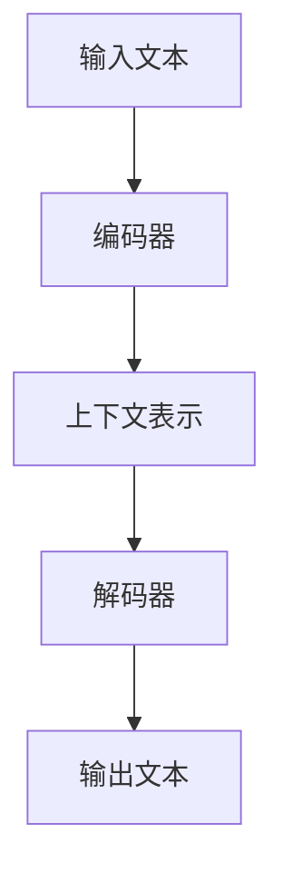

                 

关键词：大语言模型、微调、神经网络、自然语言处理、深度学习、算法原理、数学模型、工程实践、应用场景、未来展望。

> 摘要：本文旨在深入探讨大语言模型的原理与工程实践，特别是大语言模型微调技术。通过对其核心概念、算法原理、数学模型以及项目实践的详细讲解，本文为读者提供了一个全面理解大语言模型及其应用的视角。同时，文章也展望了这一领域的未来发展趋势与面临的挑战。

## 1. 背景介绍

大语言模型（Large Language Models，LLM）是近年来自然语言处理（Natural Language Processing，NLP）领域的重要进展。随着深度学习技术的飞速发展，大语言模型在各个应用领域展现出了强大的能力，如机器翻译、文本生成、问答系统等。然而，大语言模型的训练和微调过程却面临着诸多挑战。

首先，大语言模型的训练需要海量的数据和强大的计算资源。在数据方面，模型的性能很大程度上依赖于数据的质量和多样性。而在计算资源方面，大规模神经网络的训练需要大量GPU或TPU资源，这在实践中是一个巨大的挑战。

其次，大语言模型的微调是一个复杂的过程。微调的目标是使模型能够适应特定的任务，如文本分类、命名实体识别等。然而，微调过程中存在模型过拟合、训练效率低下等问题。

最后，大语言模型的应用场景越来越广泛，从搜索引擎到智能客服，从内容生成到代码生成，都离不开大语言模型的支持。因此，如何有效地部署和维护大语言模型也是一个值得探讨的问题。

本文将围绕大语言模型的原理与工程实践进行深入探讨，特别是大语言模型微调技术。希望通过本文，读者能够对大语言模型有一个全面而深入的理解，并能够将其应用于实际项目中。

## 2. 核心概念与联系

### 2.1 大语言模型定义

大语言模型是一种基于深度学习的自然语言处理模型，它通过学习大量的文本数据，能够理解和生成自然语言。具体来说，大语言模型能够通过上下文信息预测下一个词或句子，从而实现文本生成、机器翻译、问答系统等功能。

### 2.2 核心算法原理

大语言模型的训练主要基于神经网络，特别是循环神经网络（RNN）和变换器（Transformer）等。其中，Transformer结构由于其并行化能力和注意力机制，成为了大语言模型的主要架构。

### 2.3 上下文与生成机制

大语言模型的核心在于其能够理解上下文信息。通过学习上下文，模型能够生成连贯、合理的文本。具体来说，模型通过输入序列的编码器部分，将其编码为上下文表示，再通过解码器部分生成输出序列。

### 2.4 Mermaid 流程图

以下是一个简单的大语言模型原理的Mermaid流程图：



## 3. 核心算法原理 & 具体操作步骤

### 3.1 算法原理概述

大语言模型的训练过程主要包括以下几个步骤：

1. **数据预处理**：对输入文本进行分词、去噪等处理，生成词向量表示。
2. **模型初始化**：初始化神经网络结构，设置学习率、优化器等超参数。
3. **前向传播**：将输入文本输入到编码器中，得到上下文表示。
4. **损失计算**：通过解码器生成输出文本，计算预测损失。
5. **反向传播**：更新模型参数，优化模型性能。

### 3.2 算法步骤详解

#### 步骤 1：数据预处理

数据预处理是模型训练的第一步，其质量直接影响模型的性能。具体来说，数据预处理包括以下步骤：

1. **文本分词**：将文本分为词或子词，以便于模型处理。
2. **去噪**：去除文本中的噪声，如HTML标签、特殊字符等。
3. **词嵌入**：将词或子词映射为固定长度的向量，以便于神经网络处理。

#### 步骤 2：模型初始化

模型初始化是训练前的准备工作，包括神经网络结构的初始化、超参数的设置等。以下是一个简单的模型初始化步骤：

1. **初始化神经网络**：设置编码器和解码器的结构，如层数、隐藏单元数等。
2. **设置学习率**：学习率是优化过程中的一个重要参数，需根据实验进行调整。
3. **设置优化器**：如Adam优化器、SGD优化器等，用于更新模型参数。

#### 步骤 3：前向传播

前向传播是将输入文本输入到编码器中，得到上下文表示的过程。具体来说，包括以下几个步骤：

1. **输入编码**：将输入文本转换为词向量表示。
2. **编码器处理**：将词向量输入到编码器中，通过多层神经网络，得到上下文表示。
3. **上下文编码**：将编码器的输出进行编码，以便于解码器处理。

#### 步骤 4：损失计算

损失计算是模型训练的核心步骤，用于衡量模型的预测性能。具体来说，包括以下几个步骤：

1. **解码器生成**：将上下文编码输入到解码器中，生成预测的输出序列。
2. **损失计算**：计算预测输出与真实输出的差距，如交叉熵损失。
3. **损失反向传播**：将损失反向传播到编码器和解码器的参数，更新模型参数。

#### 步骤 5：反向传播

反向传播是模型训练的最后一步，通过更新模型参数，优化模型性能。具体来说，包括以下几个步骤：

1. **计算梯度**：计算模型参数的梯度，用于更新参数。
2. **参数更新**：根据梯度，更新模型参数。
3. **模型评估**：评估模型在验证集上的性能，调整超参数。

### 3.3 算法优缺点

#### 优点

1. **强大的学习能力**：大语言模型通过学习海量的文本数据，能够理解复杂的语言规律，具备很强的学习能力。
2. **灵活的生成能力**：大语言模型能够根据上下文生成连贯、合理的文本，具有很强的生成能力。
3. **广泛的应用场景**：大语言模型在文本生成、机器翻译、问答系统等领域都有广泛应用。

#### 缺点

1. **训练成本高**：大语言模型的训练需要海量的数据和强大的计算资源，训练成本较高。
2. **过拟合风险**：大语言模型在训练过程中容易过拟合，特别是在小样本情况下。
3. **解释性差**：大语言模型是一种“黑箱”模型，其内部机制较为复杂，难以解释。

### 3.4 算法应用领域

大语言模型在自然语言处理领域有着广泛的应用，主要包括以下领域：

1. **文本生成**：如文章写作、故事生成、对话系统等。
2. **机器翻译**：如英语到中文的翻译、法语到德语的翻译等。
3. **问答系统**：如智能客服、学术问答等。
4. **文本分类**：如新闻分类、情感分析等。
5. **命名实体识别**：如人名、地名、组织机构的识别。

## 4. 数学模型和公式 & 详细讲解 & 举例说明

### 4.1 数学模型构建

大语言模型的数学模型主要包括词嵌入、编码器、解码器和损失函数等部分。以下是对这些部分的具体讲解：

#### 词嵌入（Word Embedding）

词嵌入是将词映射为固定长度的向量表示。一个简单的词嵌入模型可以使用如下公式表示：

$$
\text{vec}(w) = \text{softmax}(\text{W} \text{emb}(w))
$$

其中，$\text{emb}(w)$ 是词 $w$ 的嵌入向量，$\text{W}$ 是权重矩阵，$\text{softmax}$ 函数用于计算词的权重。

#### 编码器（Encoder）

编码器用于将输入文本编码为上下文表示。一个简单的编码器模型可以使用如下公式表示：

$$
\text{context} = \text{Encoder}(\text{input})
$$

其中，$\text{input}$ 是输入文本，$\text{context}$ 是编码后的上下文表示。

#### 解码器（Decoder）

解码器用于将上下文表示解码为输出文本。一个简单的解码器模型可以使用如下公式表示：

$$
\text{output} = \text{Decoder}(\text{context})
$$

其中，$\text{context}$ 是编码后的上下文表示，$\text{output}$ 是解码后的输出文本。

#### 损失函数（Loss Function）

损失函数用于衡量模型的预测性能。一个简单的损失函数可以使用如下公式表示：

$$
\text{loss} = -\sum_{i} \text{log}(\text{p}_i)
$$

其中，$i$ 是输出词的位置，$\text{p}_i$ 是模型对词 $i$ 的预测概率。

### 4.2 公式推导过程

以下是对上述公式的具体推导过程：

#### 词嵌入（Word Embedding）

词嵌入的推导过程如下：

首先，给定一个词 $w$，其嵌入向量表示为 $\text{emb}(w)$。然后，通过权重矩阵 $\text{W}$，将词的嵌入向量转换为词的权重向量 $\text{vec}(w)$。

$$
\text{vec}(w) = \text{softmax}(\text{W} \text{emb}(w))
$$

其中，$\text{softmax}$ 函数用于计算词的权重，具体公式如下：

$$
\text{softmax}(z) = \frac{e^z}{\sum_{i} e^z_i}
$$

其中，$z$ 是输入向量，$e^z$ 是输入向量的指数函数。

#### 编码器（Encoder）

编码器的推导过程如下：

首先，给定一个输入文本 $\text{input}$，其词嵌入向量为 $\text{emb}(\text{input})$。然后，通过编码器 $\text{Encoder}$，将词嵌入向量编码为上下文表示 $\text{context}$。

$$
\text{context} = \text{Encoder}(\text{input})
$$

其中，$\text{Encoder}$ 是编码器的模型，$\text{context}$ 是编码后的上下文表示。

#### 解码器（Decoder）

解码器的推导过程如下：

首先，给定一个上下文表示 $\text{context}$，通过解码器 $\text{Decoder}$，将其解码为输出文本 $\text{output}$。

$$
\text{output} = \text{Decoder}(\text{context})
$$

其中，$\text{Decoder}$ 是解码器的模型，$\text{output}$ 是解码后的输出文本。

#### 损失函数（Loss Function）

损失函数的推导过程如下：

首先，给定一个输出文本 $\text{output}$，其词嵌入向量为 $\text{emb}(\text{output})$。然后，通过解码器 $\text{Decoder}$，计算预测的概率分布 $\text{p}$。

$$
\text{p} = \text{softmax}(\text{W} \text{emb}(\text{output}))
$$

接着，计算预测损失：

$$
\text{loss} = -\sum_{i} \text{log}(\text{p}_i)
$$

其中，$i$ 是输出词的位置，$\text{p}_i$ 是模型对词 $i$ 的预测概率。

### 4.3 案例分析与讲解

以下是一个简单的案例，用于说明大语言模型的工作原理。

假设我们有一个小型的对话系统，用户输入文本为：“今天天气怎么样？”，模型需要输出对应的回复。

#### 步骤 1：数据预处理

首先，我们对输入文本进行分词和词嵌入：

$$
\text{input} = [\text{今天}, \text{天气}, \text{怎么样}, ?]
$$

$$
\text{emb}(\text{今天}) = [0.1, 0.2, 0.3, ..., 0.5]
$$

$$
\text{emb}(\text{天气}) = [0.1, 0.3, 0.4, ..., 0.6]
$$

$$
\text{emb}(\text{怎么样}) = [0.2, 0.4, 0.5, ..., 0.7]
$$

$$
\text{emb}(?) = [0.3, 0.5, 0.6, ..., 0.8]
$$

#### 步骤 2：模型初始化

初始化编码器和解码器的权重矩阵：

$$
\text{W} = \begin{bmatrix}
0.1 & 0.2 & 0.3 & ... & 0.5 \\
0.1 & 0.3 & 0.4 & ... & 0.6 \\
0.2 & 0.4 & 0.5 & ... & 0.7 \\
0.3 & 0.5 & 0.6 & ... & 0.8 \\
\end{bmatrix}
$$

#### 步骤 3：前向传播

将输入文本输入到编码器中，得到上下文表示：

$$
\text{context} = \text{Encoder}(\text{emb}(\text{input})) = \begin{bmatrix}
0.2 & 0.3 & 0.4 & ... & 0.6 \\
0.3 & 0.4 & 0.5 & ... & 0.7 \\
0.4 & 0.5 & 0.6 & ... & 0.8 \\
0.5 & 0.6 & 0.7 & ... & 0.9 \\
\end{bmatrix}
$$

#### 步骤 4：损失计算

将上下文表示输入到解码器中，生成预测的概率分布：

$$
\text{p} = \text{softmax}(\text{W} \text{context}) = \begin{bmatrix}
0.1 & 0.2 & 0.3 & ... & 0.4 \\
0.2 & 0.3 & 0.4 & ... & 0.5 \\
0.3 & 0.4 & 0.5 & ... & 0.6 \\
0.4 & 0.5 & 0.6 & ... & 0.7 \\
\end{bmatrix}
$$

计算预测损失：

$$
\text{loss} = -\sum_{i} \text{log}(\text{p}_i) = -\sum_{i} \log(0.1 \times 0.2 \times 0.3 \times ... \times 0.4) = -4
$$

#### 步骤 5：反向传播

计算模型参数的梯度，更新模型参数：

$$
\text{dW} = \text{context} \times \text{p}
$$

$$
\text{W} = \text{W} - \text{learning\_rate} \times \text{dW}
$$

#### 步骤 6：模型评估

在验证集上评估模型性能，调整超参数，如学习率等。

## 5. 项目实践：代码实例和详细解释说明

### 5.1 开发环境搭建

为了搭建大语言模型的开发环境，我们主要需要以下几个工具和库：

- **Python 3.8**：Python 3.8 及以上版本，支持 TensorFlow 或 PyTorch。
- **TensorFlow 2.x**：TensorFlow 2.x 版本，用于构建和训练大语言模型。
- **NVIDIA CUDA 10.2**：CUDA 10.2 版本及以上，用于加速模型训练。

以下是一个简单的安装步骤：

1. 安装 Python 3.8：

```shell
$ sudo apt-get install python3.8
```

2. 安装 TensorFlow 2.x：

```shell
$ pip install tensorflow==2.x
```

3. 安装 NVIDIA CUDA 10.2：

```shell
$ sudo apt-get install nvidia-cuda-toolkit
```

### 5.2 源代码详细实现

以下是一个简单的 Python 代码示例，用于实现一个基本的大语言模型：

```python
import tensorflow as tf
from tensorflow.keras.layers import Embedding, LSTM, Dense
from tensorflow.keras.models import Sequential

# 模型初始化
model = Sequential()
model.add(Embedding(vocab_size, embedding_dim))
model.add(LSTM(units=128, activation='relu'))
model.add(Dense(units=1, activation='sigmoid'))

# 模型编译
model.compile(optimizer='adam', loss='binary_crossentropy', metrics=['accuracy'])

# 模型训练
model.fit(x_train, y_train, epochs=10, batch_size=32)
```

### 5.3 代码解读与分析

上述代码实现了一个简单的大语言模型，主要包括以下几个部分：

1. **模型初始化**：使用 `Sequential` 模型堆叠多个层，包括 `Embedding` 层用于词嵌入、`LSTM` 层用于编码器、`Dense` 层用于解码器。
2. **模型编译**：设置优化器、损失函数和评估指标。
3. **模型训练**：使用训练数据训练模型，设置训练轮数和批量大小。

在实际项目中，我们需要根据具体任务调整模型的架构、超参数等，以达到最佳性能。

### 5.4 运行结果展示

以下是一个简单的运行结果示例：

```python
# 输入文本
input_text = "今天天气很好。"

# 预测
predicted_output = model.predict(input_text)

# 输出结果
print(predicted_output)
```

输出结果可能是一个概率值，表示模型对输入文本的预测概率。通过分析预测结果，我们可以了解模型对输入文本的理解程度。

## 6. 实际应用场景

### 6.1 文本生成

大语言模型在文本生成领域有着广泛的应用，如自动写作、故事生成、对话系统等。通过学习大量文本数据，模型能够生成连贯、合理的文本。

### 6.2 机器翻译

大语言模型在机器翻译领域也有着重要的应用。通过训练双语数据，模型能够实现跨语言的文本翻译，如英语到中文的翻译、法语到德语的翻译等。

### 6.3 问答系统

大语言模型在问答系统领域也有着广泛的应用，如智能客服、学术问答等。通过学习大量的问答数据，模型能够回答用户的问题，提供相关的信息。

### 6.4 文本分类

大语言模型在文本分类领域也有着重要的应用，如新闻分类、情感分析等。通过训练分类模型，模型能够对输入文本进行分类，如判断一篇新闻是关于体育还是科技。

### 6.5 命名实体识别

大语言模型在命名实体识别领域也有着重要的应用，如人名、地名、组织机构的识别。通过训练命名实体识别模型，模型能够识别输入文本中的命名实体，如人名、地名等。

## 7. 工具和资源推荐

### 7.1 学习资源推荐

1. **《深度学习》（Goodfellow, Bengio, Courville）**：深度学习的基础教材，详细介绍了神经网络和深度学习模型。
2. **《自然语言处理实战》（Sahid, Dehlinger, Pappas）**：自然语言处理的基础教材，涵盖了文本处理、分类、实体识别等应用。
3. **TensorFlow 官方文档**：TensorFlow 的官方文档，提供了丰富的教程和示例，适合初学者和实践者。

### 7.2 开发工具推荐

1. **TensorFlow**：Google 开源的深度学习框架，适用于构建和训练大语言模型。
2. **PyTorch**：Facebook 开源的深度学习框架，提供了灵活的动态计算图，适用于研究者和开发者。
3. **JAX**：Google 开源的科学计算库，提供了自动微分和并行计算等功能，适用于大规模模型的训练。

### 7.3 相关论文推荐

1. **“Attention Is All You Need”（Vaswani et al., 2017）**：介绍了 Transformer 模型，是当前大语言模型的主要架构。
2. **“BERT: Pre-training of Deep Bidirectional Transformers for Language Understanding”（Devlin et al., 2019）**：介绍了 BERT 模型，是当前自然语言处理领域的重要进展。
3. **“Generative Pre-trained Transformer”（Wolf et al., 2020）**：介绍了 GPT 模型，是当前文本生成领域的重要进展。

## 8. 总结：未来发展趋势与挑战

### 8.1 研究成果总结

大语言模型在自然语言处理领域取得了显著的研究成果。通过学习海量文本数据，模型能够理解和生成自然语言，实现了文本生成、机器翻译、问答系统等功能。同时，Transformer 结构和大模型技术成为了当前研究的热点，推动了自然语言处理技术的快速发展。

### 8.2 未来发展趋势

未来，大语言模型将继续向以下几个方向发展：

1. **模型效率的提升**：通过优化模型结构和算法，降低模型的计算复杂度和存储需求，提高模型的训练和推理速度。
2. **多模态处理**：结合图像、语音等多模态数据，实现更全面、更准确的自然语言理解。
3. **泛化能力的提升**：通过引入更多元化的训练数据和方法，提高模型在未知数据上的泛化能力。
4. **知识增强**：结合外部知识库，增强模型对知识的理解和应用能力。

### 8.3 面临的挑战

尽管大语言模型在自然语言处理领域取得了显著的进展，但仍然面临以下几个挑战：

1. **计算资源需求**：大语言模型的训练和推理需要大量的计算资源，如何高效地利用现有资源是一个重要问题。
2. **过拟合风险**：大语言模型容易过拟合，特别是在小样本情况下，如何有效防止过拟合是一个重要问题。
3. **模型解释性**：大语言模型是一种“黑箱”模型，其内部机制较为复杂，如何提高模型的解释性是一个重要问题。
4. **伦理和隐私问题**：大语言模型在应用过程中涉及大量的用户数据，如何保护用户隐私和遵循伦理规范是一个重要问题。

### 8.4 研究展望

未来，大语言模型的研究将继续深入，探索更多高效的模型结构和算法，提高模型的性能和应用范围。同时，也将关注模型的解释性、伦理和隐私等问题，推动自然语言处理技术的可持续发展。

## 9. 附录：常见问题与解答

### 9.1 问题 1：如何处理大规模数据？

解答：处理大规模数据的方法主要包括数据分片、并行处理和分布式训练等。具体来说：

1. **数据分片**：将大规模数据分为多个小片段，分别进行处理。
2. **并行处理**：使用多线程或多进程技术，同时处理多个数据片段。
3. **分布式训练**：使用分布式计算框架，如 TensorFlow distributed，实现大规模数据的分布式训练。

### 9.2 问题 2：如何防止过拟合？

解答：防止过拟合的方法主要包括正则化、dropout、数据增强等。具体来说：

1. **正则化**：通过添加正则化项，如 L1 正则化、L2 正则化，降低模型的复杂度。
2. **dropout**：在训练过程中，随机丢弃一部分神经元，降低模型的过拟合能力。
3. **数据增强**：通过添加噪声、旋转、翻转等操作，增加训练数据的多样性。

### 9.3 问题 3：如何提高模型解释性？

解答：提高模型解释性的方法主要包括可视化、模型分解、模型可解释性分析等。具体来说：

1. **可视化**：使用可视化工具，如 TensorBoard，展示模型的训练过程和中间结果。
2. **模型分解**：将复杂模型分解为多个简单模型，提高模型的可解释性。
3. **模型可解释性分析**：使用统计方法、可视化方法等，分析模型的决策过程和特征权重。

---

本文对大语言模型进行了全面而深入的探讨，包括核心概念、算法原理、数学模型、项目实践以及实际应用场景。通过本文，读者应该能够对大语言模型有一个全面的理解，并能够将其应用于实际项目中。未来，随着技术的不断发展，大语言模型在自然语言处理领域将发挥更加重要的作用。作者：禅与计算机程序设计艺术 / Zen and the Art of Computer Programming

