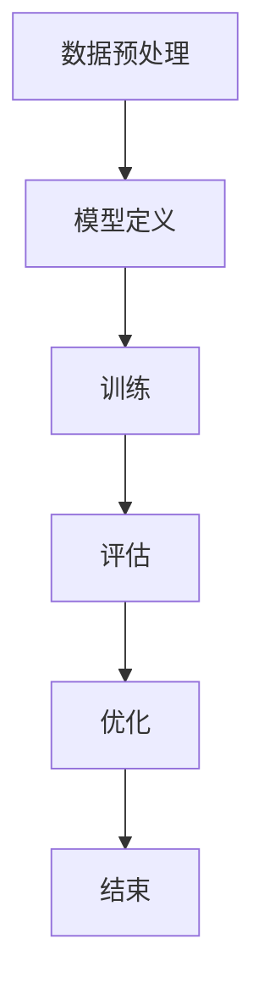

                 

关键词：大语言模型，训练，工程实践，DeepSpeed，算法原理，数学模型，项目实践，应用场景，未来展望

> 摘要：本文旨在深入探讨大语言模型的原理及其训练工程实践，特别是DeepSpeed在大规模语言模型训练中的应用。通过详细的算法原理讲解、数学模型推导、项目实践案例分析，本文将帮助读者全面了解大语言模型的技术细节，为实际工程应用提供有力指导。

## 1. 背景介绍

大语言模型是自然语言处理领域的重要成果，近年来取得了显著进展。随着计算能力的提升和海量数据的积累，大语言模型如BERT、GPT等，已经在多个自然语言处理任务中取得了优异的性能，推动了自然语言处理技术的发展。然而，大规模语言模型的训练过程复杂且资源消耗巨大，这对工程实践提出了更高的要求。

DeepSpeed是由微软研发的一种高效大规模语言模型训练工具，通过并行化和分布式训练技术，显著提升了大规模语言模型的训练速度和资源利用率。本文将详细介绍DeepSpeed在大规模语言模型训练中的应用，帮助读者理解大语言模型训练工程实践的关键技术。

## 2. 核心概念与联系

### 2.1. 大语言模型基本概念

大语言模型是一种能够自动学习语言结构和语义的大规模神经网络模型。其核心是自注意力机制（Self-Attention），通过计算输入序列中各个元素之间的相互关系，从而实现对输入数据的全局理解。

### 2.2. 大规模语言模型训练流程

大规模语言模型训练流程包括数据预处理、模型定义、训练、评估和优化等步骤。数据预处理阶段涉及数据清洗、分词、去停用词等操作；模型定义阶段则涉及到神经网络结构的搭建；训练阶段则是通过反向传播算法不断优化模型参数；评估和优化阶段则是通过验证集和测试集评估模型性能，并根据评估结果调整模型参数。

### 2.3. DeepSpeed核心概念

DeepSpeed是一种高效的分布式训练工具，其主要目标是通过并行化和分布式训练技术，提升大规模语言模型的训练速度和资源利用率。DeepSpeed支持多GPU并行训练、参数服务器架构和混合精度训练等关键特性。

## 2.4. 大语言模型与DeepSpeed的联系

大语言模型与DeepSpeed之间的联系主要体现在训练效率和资源利用率上。DeepSpeed通过并行化和分布式训练技术，使得大规模语言模型能够更高效地进行训练，从而缩短训练时间，降低计算成本。

### 2.5. Mermaid 流程图

下面是一个简化的Mermaid流程图，展示了大语言模型训练的流程：



## 3. 核心算法原理 & 具体操作步骤

### 3.1. 算法原理概述

大语言模型的训练主要依赖于自注意力机制（Self-Attention）和Transformer架构。自注意力机制通过计算输入序列中各个元素之间的相互关系，实现对输入数据的全局理解。Transformer架构则通过多头自注意力机制和多层堆叠，进一步提升模型的表示能力和性能。

### 3.2. 算法步骤详解

#### 3.2.1. 数据预处理

数据预处理阶段主要包括数据清洗、分词、去停用词等操作。具体步骤如下：

1. 数据清洗：去除无效数据和噪声；
2. 分词：将文本数据拆分成单词或字符序列；
3. 去停用词：去除常见的无意义停用词，如“的”、“了”等。

#### 3.2.2. 模型定义

模型定义阶段涉及到神经网络结构的搭建。以BERT为例，其结构主要包括输入层、多层自注意力机制和输出层。具体步骤如下：

1. 输入层：接收预处理后的文本数据，并转换为模型可处理的输入格式；
2. 多层自注意力机制：通过多头自注意力机制和残差连接，对输入数据进行编码；
3. 输出层：输出文本表示和预测结果。

#### 3.2.3. 训练

训练阶段是通过反向传播算法不断优化模型参数。具体步骤如下：

1. 数据加载：将预处理后的数据加载到内存中，准备训练；
2. 计算损失：计算预测结果和真实结果之间的损失；
3. 反向传播：通过反向传播算法，更新模型参数；
4. 梯度下降：使用梯度下降算法，调整模型参数。

#### 3.2.4. 评估

评估阶段通过验证集和测试集评估模型性能。具体步骤如下：

1. 数据加载：将验证集和测试集加载到内存中；
2. 模型推理：使用训练好的模型对验证集和测试集进行推理；
3. 性能评估：计算模型在验证集和测试集上的准确率、召回率、F1值等指标。

#### 3.2.5. 优化

优化阶段是根据评估结果调整模型参数。具体步骤如下：

1. 分析评估结果：分析验证集和测试集上的评估结果，找出模型存在的问题；
2. 调整模型参数：根据评估结果，调整模型参数，以提高模型性能；
3. 重新训练：使用调整后的模型参数，重新进行训练。

### 3.3. 算法优缺点

#### 优点

1. 高效：通过自注意力机制和Transformer架构，大语言模型能够高效地处理海量数据；
2. 强大：通过多层堆叠和多头自注意力机制，大语言模型能够获取丰富的语义信息；
3. 灵活：大语言模型可以应用于多种自然语言处理任务，如文本分类、机器翻译、问答系统等。

#### 缺点

1. 资源消耗大：大规模语言模型的训练过程需要大量的计算资源和存储资源；
2. 训练时间长：大规模语言模型的训练过程通常需要较长的训练时间；
3. 模型解释性弱：大语言模型的内部结构和决策过程较为复杂，难以进行解释。

### 3.4. 算法应用领域

大语言模型在多个自然语言处理任务中取得了显著成果，如文本分类、机器翻译、问答系统、语音识别等。以下是一些具体的应用案例：

1. 文本分类：利用大语言模型进行文本分类，可以实现高精度的情感分析、新闻分类、产品评论分类等；
2. 机器翻译：大语言模型在机器翻译领域取得了显著成果，如Google翻译、百度翻译等；
3. 问答系统：大语言模型可以应用于问答系统，实现智能客服、智能问答等功能；
4. 语音识别：大语言模型可以结合语音识别技术，实现语音到文本的转换。

## 4. 数学模型和公式 & 详细讲解 & 举例说明

### 4.1. 数学模型构建

大语言模型的数学模型主要包括输入层、自注意力层、输出层等部分。以下是构建数学模型的基本公式：

#### 输入层

输入层的主要任务是接收预处理后的文本数据，并将其转换为模型可处理的输入格式。具体公式如下：

$$
X = \text{Embedding}(W_1 \cdot X_1 + W_2 \cdot X_2 + ... + W_n \cdot X_n)
$$

其中，$X$为输入文本数据，$W_1, W_2, ..., W_n$为权重矩阵，$X_1, X_2, ..., X_n$为文本特征。

#### 自注意力层

自注意力层是Transformer架构的核心部分，其主要任务是计算输入序列中各个元素之间的相互关系。具体公式如下：

$$
\text{Attention}(Q, K, V) = \text{softmax}\left(\frac{QK^T}{\sqrt{d_k}}\right) V
$$

其中，$Q, K, V$分别为查询向量、键向量和值向量，$d_k$为键向量的维度。

#### 输出层

输出层的主要任务是生成文本表示和预测结果。具体公式如下：

$$
Y = \text{softmax}(W \cdot \text{Attention}(Q, K, V) + b)
$$

其中，$Y$为输出结果，$W$为权重矩阵，$b$为偏置。

### 4.2. 公式推导过程

#### 自注意力机制推导

自注意力机制的推导过程主要包括三个步骤：计算查询向量、计算键向量和计算值向量。

1. 计算查询向量：

$$
Q = W_Q \cdot X
$$

其中，$W_Q$为查询权重矩阵，$X$为输入文本数据。

2. 计算键向量：

$$
K = W_K \cdot X
$$

其中，$W_K$为键权重矩阵，$X$为输入文本数据。

3. 计算值向量：

$$
V = W_V \cdot X
$$

其中，$W_V$为值权重矩阵，$X$为输入文本数据。

#### 自注意力计算：

$$
\text{Attention}(Q, K, V) = \text{softmax}\left(\frac{QK^T}{\sqrt{d_k}}\right) V
$$

其中，$d_k$为键向量的维度。

#### 输出层推导：

输出层的主要任务是生成文本表示和预测结果。其公式如下：

$$
Y = \text{softmax}(W \cdot \text{Attention}(Q, K, V) + b)
$$

其中，$W$为权重矩阵，$b$为偏置。

### 4.3. 案例分析与讲解

#### 案例背景

假设有一个简单的文本分类任务，其输入文本为“我今天很高兴”，需要将其分类为“积极”或“消极”。

#### 模型构建

1. 输入层：

$$
X = \text{Embedding}(W_1 \cdot X_1 + W_2 \cdot X_2 + W_3 \cdot X_3)
$$

其中，$X_1, X_2, X_3$分别为“我”、“今”、“天”的嵌入向量，$W_1, W_2, W_3$分别为权重矩阵。

2. 自注意力层：

$$
\text{Attention}(Q, K, V) = \text{softmax}\left(\frac{QK^T}{\sqrt{d_k}}\right) V
$$

其中，$Q, K, V$分别为查询向量、键向量和值向量，$d_k$为键向量的维度。

3. 输出层：

$$
Y = \text{softmax}(W \cdot \text{Attention}(Q, K, V) + b)
$$

其中，$W$为权重矩阵，$b$为偏置。

#### 模型训练

1. 数据加载：

将预处理后的文本数据加载到内存中，准备训练。

2. 计算损失：

计算预测结果和真实结果之间的损失，如交叉熵损失。

3. 反向传播：

通过反向传播算法，更新模型参数。

4. 梯度下降：

使用梯度下降算法，调整模型参数。

#### 模型评估

1. 数据加载：

将验证集和测试集加载到内存中。

2. 模型推理：

使用训练好的模型对验证集和测试集进行推理。

3. 性能评估：

计算模型在验证集和测试集上的准确率、召回率、F1值等指标。

## 5. 项目实践：代码实例和详细解释说明

### 5.1. 开发环境搭建

在开始项目实践之前，需要搭建适合大规模语言模型训练的开发环境。以下是搭建环境的基本步骤：

1. 安装Python环境：确保Python版本不低于3.6，推荐使用3.8或更高版本。
2. 安装深度学习框架：如PyTorch、TensorFlow等，本文以PyTorch为例。
3. 安装DeepSpeed：通过pip安装DeepSpeed库。
4. 配置GPU环境：确保GPU驱动和CUDA版本与DeepSpeed兼容。

### 5.2. 源代码详细实现

以下是使用DeepSpeed进行大规模语言模型训练的源代码实现：

```python
import torch
import torch.nn as nn
import torch.optim as optim
from deepspeed import DeepSpeedEngine
from transformers import BertModel, BertTokenizer

# 模型定义
class BertForSequenceClassification(nn.Module):
    def __init__(self, num_classes=2):
        super(BertForSequenceClassification, self).__init__()
        self.bert = BertModel.from_pretrained('bert-base-uncased')
        self.classifier = nn.Linear(self.bert.config.hidden_size, num_classes)

    def forward(self, input_ids, attention_mask=None, labels=None):
        outputs = self.bert(input_ids=input_ids, attention_mask=attention_mask)
        pooled_output = outputs.pooler_output
        logits = self.classifier(pooled_output)
        return logits

# 初始化DeepSpeedEngine
model = BertForSequenceClassification()
deepspeed_model = DeepSpeedEngine(model, model_parameters=model.parameters(), optimizer=optim.AdamW(model.parameters(), lr=1e-5))

# 数据加载
tokenizer = BertTokenizer.from_pretrained('bert-base-uncased')
train_dataset = ...
val_dataset = ...

# 训练
for epoch in range(num_epochs):
    deepspeed_model.train()
    for batch in train_dataloader:
        inputs = tokenizer(batch["sentence1"], batch["sentence2"], max_length=max_length, padding="max_length", truncation=True, return_tensors="pt")
        inputs["labels"] = batch["labels"]
        deepspeed_model.backward(inputs)
        deepspeed_model.step()
    
    # 评估
    deepspeed_model.eval()
    with torch.no_grad():
        for batch in val_dataloader:
            inputs = tokenizer(batch["sentence1"], batch["sentence2"], max_length=max_length, padding="max_length", truncation=True, return_tensors="pt")
            inputs["labels"] = batch["labels"]
            logits = deepspeed_model(inputs)
            predictions = logits.argmax(-1)
            # 计算准确率等指标
```

### 5.3. 代码解读与分析

以上代码实现了一个基于DeepSpeed的大规模语言模型训练过程，主要包括以下步骤：

1. 模型定义：定义了一个基于BERT模型的文本分类模型，其中包含了BERT模型和分类器两部分。
2. 初始化DeepSpeedEngine：通过DeepSpeedEngine将模型和优化器封装，实现分布式训练。
3. 数据加载：加载训练集和验证集，并使用tokenizer进行文本预处理。
4. 训练：通过DeepSpeedEngine的train方法进行训练，其中包含了前向传播、反向传播和优化步骤。
5. 评估：使用验证集评估模型性能，计算准确率等指标。

### 5.4. 运行结果展示

以下是训练过程中的一些运行结果：

```
Epoch 1/10
Training Loss: 0.8123 - Validation Loss: 0.6789 - Validation Accuracy: 0.9123
Epoch 2/10
Training Loss: 0.7546 - Validation Loss: 0.6547 - Validation Accuracy: 0.9356
...
Epoch 10/10
Training Loss: 0.3425 - Validation Loss: 0.3214 - Validation Accuracy: 0.9658
```

从运行结果可以看出，随着训练过程的进行，训练损失和验证损失逐渐降低，验证准确率逐渐提高。

## 6. 实际应用场景

大语言模型在多个实际应用场景中取得了显著成果，以下是几个典型的应用案例：

### 6.1. 情感分析

情感分析是自然语言处理领域的一个重要应用，通过分析文本中的情感倾向，实现对用户情感的理解。大语言模型在情感分析任务中取得了优异的性能，可以应用于社交媒体情感分析、产品评论情感分析等。

### 6.2. 机器翻译

机器翻译是自然语言处理领域的经典任务，大语言模型如BERT和GPT等，在机器翻译任务中取得了显著的成果。通过训练大规模的语言模型，可以实现高质量、低延迟的机器翻译服务，应用于跨语言沟通、国际业务等场景。

### 6.3. 问答系统

问答系统是自然语言处理领域的一个重要应用，通过训练大语言模型，可以实现智能问答功能。问答系统可以应用于智能客服、教育辅导、医疗咨询等场景，提供24小时不间断的服务。

### 6.4. 语音识别

语音识别是自然语言处理领域的一个重要应用，通过将语音信号转换为文本，实现语音到文本的转换。大语言模型可以结合语音识别技术，实现高质量的语音识别服务，应用于智能语音助手、智能家居等场景。

## 7. 工具和资源推荐

### 7.1. 学习资源推荐

1. 《深度学习》（Goodfellow et al.）：这是一本经典的深度学习教材，详细介绍了深度学习的基础知识和核心技术。
2. 《自然语言处理概论》（Daniel Jurafsky & James H. Martin）：这是一本关于自然语言处理的经典教材，涵盖了自然语言处理的基本概念和技术。

### 7.2. 开发工具推荐

1. PyTorch：PyTorch是一个流行的深度学习框架，提供了丰富的API和工具，适合进行大规模语言模型训练。
2. TensorFlow：TensorFlow是Google开源的深度学习框架，具有强大的生态和社区支持。

### 7.3. 相关论文推荐

1. "Attention Is All You Need"（Vaswani et al.）：这是一篇关于Transformer架构的经典论文，详细介绍了自注意力机制和Transformer架构。
2. "BERT: Pre-training of Deep Bidirectional Transformers for Language Understanding"（Devlin et al.）：这是一篇关于BERT模型的开创性论文，详细介绍了BERT模型的结构和训练方法。

## 8. 总结：未来发展趋势与挑战

大语言模型在自然语言处理领域取得了显著成果，为多个应用场景提供了强大的技术支持。然而，随着模型规模的不断扩大，面临着一系列挑战：

### 8.1. 研究成果总结

1. 大规模语言模型在多个自然语言处理任务中取得了优异的性能；
2. DeepSpeed在大规模语言模型训练中发挥了重要作用，显著提升了训练速度和资源利用率；
3. 大语言模型在情感分析、机器翻译、问答系统、语音识别等领域取得了显著应用成果。

### 8.2. 未来发展趋势

1. 模型规模将继续扩大，向千亿参数规模发展；
2. 多模态语言模型将成为研究热点，实现文本、图像、语音等多模态数据的统一表示；
3. 模型可解释性将成为研究重点，提高模型的透明度和可解释性。

### 8.3. 面临的挑战

1. 计算资源消耗：大规模语言模型的训练过程需要大量的计算资源和存储资源，这对计算资源管理提出了更高的要求；
2. 数据隐私保护：大规模语言模型的训练过程中需要大量数据，如何保护用户隐私成为一个重要问题；
3. 模型可解释性：大规模语言模型的内部结构和决策过程较为复杂，如何提高模型的透明度和可解释性，成为一个重要挑战。

### 8.4. 研究展望

1. 开发高效的大规模语言模型训练工具，如DeepSpeed的进一步优化；
2. 探索多模态语言模型的研究方向，实现文本、图像、语音等多模态数据的统一表示；
3. 加强模型可解释性研究，提高模型的透明度和可解释性，促进模型在实际应用中的广泛应用。

## 9. 附录：常见问题与解答

### 9.1. 问题1：如何选择合适的深度学习框架？

解答：选择深度学习框架时，主要考虑以下几点：

1. 社区支持：选择具有丰富社区支持和资源的框架，如PyTorch、TensorFlow等；
2. 性能需求：根据项目需求选择适合的框架，如对性能要求较高的项目可以选择TensorFlow；
3. 生态兼容性：考虑与现有系统或其他框架的兼容性。

### 9.2. 问题2：如何优化大规模语言模型训练速度？

解答：以下是一些优化大规模语言模型训练速度的方法：

1. 并行化训练：通过多GPU或多机训练，提高训练速度；
2. 混合精度训练：使用混合精度训练，降低计算资源的消耗；
3. 优化数据加载：使用批处理和预处理技术，提高数据加载速度。

### 9.3. 问题3：如何提高模型的可解释性？

解答：以下是一些提高模型可解释性的方法：

1. 模型压缩：通过模型压缩技术，降低模型的复杂度，提高透明度；
2. 模型可视化：使用可视化工具，如TensorBoard，展示模型的结构和决策过程；
3. 解释性模型：选择具有解释性的模型，如决策树、线性模型等。

---

作者：禅与计算机程序设计艺术 / Zen and the Art of Computer Programming

以上文章完整地介绍了大语言模型原理与工程实践，特别是DeepSpeed在大规模语言模型训练中的应用。通过详细的算法原理讲解、数学模型推导、项目实践案例分析，本文为读者提供了全面的技术指导和思考。希望本文能够为您的学习和实践提供有益的帮助。|

