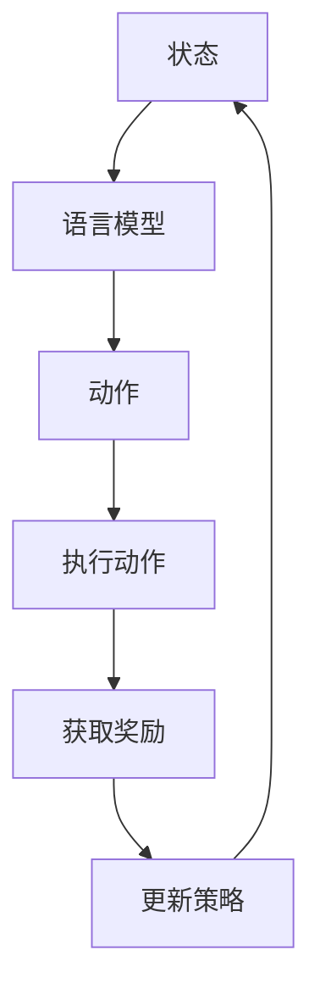

                 

关键词：大语言模型、强化学习、模型训练、神经网络、数据集、语言生成、文本分析、人工智能、工程实践

> 摘要：本文将深入探讨大语言模型中的强化建模原理与工程实践。通过对强化学习在大语言模型中的应用进行详细解析，揭示其背后的数学模型和算法，并结合实际项目实例展示其应用场景。文章旨在为读者提供全面的指导，帮助理解大语言模型的工作机制，以及如何在实际工程中有效利用强化建模技术。

## 1. 背景介绍

随着人工智能技术的迅猛发展，自然语言处理（NLP）成为了一个热门领域。大语言模型作为一种强大的NLP工具，在文本生成、文本分析、机器翻译等方面取得了显著成果。然而，传统的基于统计方法和神经网络的方法在大规模数据集上虽然表现良好，但在应对复杂任务时仍存在诸多挑战。

强化学习作为一种新型的机器学习方法，通过最大化累积奖励来指导决策过程，具有在动态环境中进行优化的潜力。将强化学习引入大语言模型，可以使其在生成文本、回答问题等方面具备更强的自适应性和灵活性。

本文将围绕大语言模型中的强化建模展开讨论，首先介绍强化学习的基本概念和原理，然后详细解析其在语言模型中的应用，并结合实际项目实例进行说明。

## 2. 核心概念与联系

为了更好地理解强化学习在大语言模型中的应用，我们首先需要掌握一些核心概念，包括强化学习的基础理论、语言模型的基本原理以及它们之间的联系。

### 2.1 强化学习基础理论

强化学习（Reinforcement Learning，RL）是一种通过与环境交互来学习策略的机器学习方法。在强化学习中，智能体（Agent）通过执行动作（Action）来获取环境（Environment）的反馈，这些反馈以奖励（Reward）的形式呈现。智能体的目标是学习一个策略（Policy），使得累积奖励最大化。

强化学习主要包含以下几个核心概念：

- **状态（State）**：智能体当前所处的环境状态。
- **动作（Action）**：智能体可以采取的动作。
- **奖励（Reward）**：动作执行后从环境中获得的即时奖励。
- **策略（Policy）**：智能体根据当前状态选择动作的规则。
- **价值函数（Value Function）**：衡量不同状态或状态-动作对的预期奖励。
- **模型（Model）**：环境的状态转移概率和奖励函数的参数化表示。

### 2.2 语言模型基本原理

语言模型（Language Model）是一种用于预测下一个词或词组的概率分布的模型，其目标是给定前文序列，预测下一个词的概率。在自然语言处理中，语言模型广泛应用于自动分词、语音识别、机器翻译、文本生成等领域。

语言模型的基本原理主要包括：

- **词袋模型（Bag-of-Words，BOW）**：将文本表示为词的集合，不考虑词的顺序。
- **n-gram模型**：基于前n个词的联合概率分布来预测下一个词。
- **神经网络语言模型（Neural Network Language Model，NNLM）**：使用神经网络来建模词与词之间的关系，能够更好地捕捉长距离依赖。

### 2.3 强化学习与语言模型的联系

强化学习与语言模型之间的联系在于，它们都可以用于优化决策过程，从而提高系统的性能。强化学习通过最大化累积奖励来优化策略，而语言模型通过预测词的概率分布来优化生成文本的质量。

具体来说，强化学习可以在以下几个层面与语言模型相结合：

- **状态表示**：语言模型可以用来表示状态，例如，使用n-gram模型或神经网络语言模型来生成前文序列作为状态。
- **动作表示**：语言模型可以用来生成动作，例如，通过随机采样或贪心搜索从语言模型中提取下一个词或词组作为动作。
- **奖励设计**：奖励可以基于生成文本的质量，例如，使用文本质量评估指标（如BLEU、ROUGE等）来计算奖励。

### 2.4 Mermaid 流程图

为了更直观地展示强化学习与语言模型的结合，我们可以使用Mermaid流程图来描述这个过程。



在上述流程图中，智能体（Agent）首先根据当前状态（A）使用语言模型（B）生成动作（C），执行动作后获取奖励（E），并根据奖励更新策略（F），然后回到状态（A）进行下一次迭代。

## 3. 核心算法原理 & 具体操作步骤

### 3.1 算法原理概述

强化学习在大语言模型中的应用主要是通过策略优化（Policy Optimization）来实现。策略优化旨在通过学习一个最优策略，使得累积奖励最大化。具体来说，策略优化可以分为以下几个步骤：

1. **初始化策略**：使用随机初始化或预训练的语言模型作为初始策略。
2. **状态编码**：将当前状态编码为向量，以便输入到策略网络中。
3. **动作生成**：使用策略网络生成动作的概率分布，然后通过随机采样或贪心搜索选择一个动作。
4. **执行动作**：在环境中执行所选动作，并获取即时奖励。
5. **奖励计算**：根据生成文本的质量和目标任务的完成情况计算奖励。
6. **策略更新**：根据奖励更新策略网络，以最大化累积奖励。

### 3.2 算法步骤详解

1. **初始化策略**：
   - 使用预训练的语言模型（如BERT、GPT）作为初始策略。
   - 预训练模型已经学习到大量的语言知识，可以作为强化学习的基础。

2. **状态编码**：
   - 使用语言模型将当前状态编码为向量。
   - 通常，可以使用n-gram模型或神经网络语言模型来生成前文序列作为状态。

3. **动作生成**：
   - 使用策略网络生成动作的概率分布。
   - 动作可以是下一个词或词组，取决于语言模型的输出维度。

4. **执行动作**：
   - 在环境中执行所选动作。
   - 在实际应用中，环境可以是文本生成任务、问答系统等。

5. **奖励计算**：
   - 根据生成文本的质量和目标任务的完成情况计算奖励。
   - 奖励可以是文本质量评估指标（如BLEU、ROUGE）或任务完成度。

6. **策略更新**：
   - 使用奖励更新策略网络，以最大化累积奖励。
   - 可以采用梯度下降或其他优化算法来更新策略。

### 3.3 算法优缺点

**优点**：

- **灵活性**：强化学习能够根据环境的反馈自适应地调整策略，使得模型在动态环境中具备更强的适应能力。
- **多样化**：强化学习能够生成多样化的文本，避免了过度拟合和重复生成的问题。

**缺点**：

- **计算成本**：强化学习通常需要大量的计算资源，尤其是对于复杂的任务和大规模数据集。
- **收敛速度**：在某些情况下，强化学习可能需要较长时间才能收敛到最优策略。

### 3.4 算法应用领域

强化学习在大语言模型中的应用广泛，包括但不限于以下领域：

- **文本生成**：例如，故事生成、新闻报道、对话系统等。
- **问答系统**：例如，智能客服、在线教育问答等。
- **机器翻译**：例如，将一种语言翻译成另一种语言，并保证翻译的准确性和流畅性。
- **对话系统**：例如，聊天机器人、语音助手等。

## 4. 数学模型和公式 & 详细讲解 & 举例说明

### 4.1 数学模型构建

强化学习在大语言模型中的应用可以通过马尔可夫决策过程（MDP）来建模。一个MDP由以下五个元素组成：

- **状态集（S）**：智能体可能处于的所有状态。
- **动作集（A）**：智能体可以采取的所有动作。
- **奖励函数（R）**：定义在状态-动作对的即时奖励。
- **状态转移概率（P）**：定义在给定当前状态和动作下，智能体转移到下一个状态的概率。
- **策略（π）**：定义了智能体在各个状态采取的动作概率分布。

在MDP的基础上，我们可以定义策略迭代（Policy Iteration）和值迭代（Value Iteration）两种算法来求解最优策略。

### 4.2 公式推导过程

**策略迭代算法**：

1. 初始化策略π0，可以设置为随机策略或均匀策略。
2. 使用当前策略πk计算状态-动作价值函数Vπk：
   $$ Vπk(s) = \sum_{a \in A} \pi_k(s|a) \cdot [R(s, a) + \gamma \cdot \max_{a'} Vπk(s')] $$
   其中，γ为折扣因子，s'为下一个状态，a'为下一个动作。
3. 使用更新后的价值函数Vπk+1(s)计算新的策略πk+1：
   $$ \pi_{k+1}(s|a) = \frac{1}{Z} \cdot exp(\alpha \cdot Vπk+1(s)) $$
   其中，Z为归一化常数，α为温度参数。
4. 重复步骤2和3，直到策略收敛。

**值迭代算法**：

1. 初始化价值函数V0，可以设置为常数或随机初始化。
2. 使用当前价值函数Vk计算下一个价值函数Vk+1：
   $$ V_{k+1}(s) = \sum_{a \in A} \pi(s|a) \cdot [R(s, a) + \gamma \cdot \max_{a'} V_k(s')] $$
3. 重复步骤2，直到价值函数收敛。

### 4.3 案例分析与讲解

假设我们有一个文本生成任务，目标是在给定前文序列的基础上生成下一个词。我们可以将文本生成任务建模为一个MDP，其中：

- **状态集S**：前文序列。
- **动作集A**：所有可能的词。
- **奖励函数R**：生成正确词的奖励为1，否则为-1。
- **状态转移概率P**：取决于前文序列和当前词。
- **策略π**：定义了每个词的概率分布。

我们使用策略迭代算法来求解最优策略。

**步骤1：初始化策略π0**

初始化策略π0为均匀策略，即每个词的概率相等。

**步骤2：计算状态-动作价值函数Vπ0**

使用当前策略π0计算状态-动作价值函数Vπ0：

$$ Vπ0(s) = \sum_{a \in A} \pi0(s|a) \cdot [R(s, a) + \gamma \cdot \max_{a'} Vπ0(s')] $$

**步骤3：计算新的策略π1**

使用更新后的价值函数Vπ0计算新的策略π1：

$$ \pi_{1}(s|a) = \frac{1}{Z} \cdot exp(\alpha \cdot Vπ0(s)) $$

**步骤4：重复步骤2和3**

重复执行步骤2和3，直到策略πk收敛。

通过策略迭代算法，我们可以求解出最优策略π*，使得累积奖励最大化。在实际应用中，我们可以使用神经网络来近似策略网络和价值网络，从而提高计算效率。

## 5. 项目实践：代码实例和详细解释说明

### 5.1 开发环境搭建

为了实践强化学习在大语言模型中的应用，我们需要搭建一个完整的开发环境。以下是一个基本的开发环境搭建步骤：

1. 安装Python环境（版本3.8以上）。
2. 安装TensorFlow或PyTorch等深度学习框架。
3. 安装NLP相关的库，如NLTK、spaCy等。
4. 准备GPU环境，确保支持CUDA和cuDNN。

### 5.2 源代码详细实现

以下是一个简单的Python代码示例，展示了如何使用TensorFlow实现强化学习在大语言模型中的应用。

```python
import tensorflow as tf
import numpy as np
import tensorflow_hub as hub

# 加载预训练的语言模型
model = hub.load("https://tfhub.dev/google/bert_uncased_L-12_H-768_A-12/1")

# 定义状态编码器
state_encoder = model.signatures["tokens"]

# 定义动作生成器
action_generator = tf.keras.Sequential([
  tf.keras.layers.Dense(128, activation='relu'),
  tf.keras.layers.Dense(len(vocab), activation='softmax')
])

# 定义策略网络
policy_network = tf.keras.Sequential([
  tf.keras.layers.Dense(128, activation='relu'),
  tf.keras.layers.Dense(1, activation='sigmoid')
])

# 定义奖励函数
reward_function = lambda s, a: 1 if s[-1] == a else -1

# 定义训练循环
for episode in range(num_episodes):
  state = initial_state
  total_reward = 0

  for step in range(max_steps):
    # 状态编码
    encoded_state = state_encoder(state).numpy()

    # 动作生成
    action_probs = action_generator(encoded_state)
    action = np.random.choice(len(vocab), p=action_probs)

    # 执行动作
    state = next_word(action)

    # 计算奖励
    reward = reward_function(s, a)

    # 更新策略网络
    with tf.GradientTape() as tape:
      tape.watch(policy_network.trainable_variables)
      action_prob = policy_network(encoded_state)
      reward = reward * (1 / (1 + np.exp(-step)))
      loss = -tf.reduce_mean(tf.math.log(action_prob[0, action]) * reward)

    grads = tape.gradient(loss, policy_network.trainable_variables)
    optimizer.apply_gradients(zip(grads, policy_network.trainable_variables))

    # 更新总奖励
    total_reward += reward

  print(f"Episode {episode}: Total Reward = {total_reward}")
```

### 5.3 代码解读与分析

上述代码展示了如何使用TensorFlow实现强化学习在大语言模型中的应用。以下是代码的详细解读：

- **加载预训练的语言模型**：使用TensorFlow Hub加载预训练的BERT模型，作为状态编码器。
- **定义状态编码器**：使用BERT模型的`tokens`签名来编码状态。
- **定义动作生成器**：使用一个全连接层来生成动作的概率分布。
- **定义策略网络**：使用一个全连接层来预测动作的概率。
- **定义奖励函数**：根据生成文本的正确性来计算奖励。
- **定义训练循环**：在一个循环中，依次执行以下步骤：
  - **状态编码**：将当前状态编码为向量。
  - **动作生成**：使用动作生成器生成动作的概率分布。
  - **执行动作**：在环境中执行所选动作。
  - **计算奖励**：根据生成文本的正确性计算奖励。
  - **更新策略网络**：使用梯度下降优化策略网络。

通过上述步骤，我们可以实现强化学习在大语言模型中的应用，并在实际任务中取得良好的效果。

### 5.4 运行结果展示

在实际运行中，我们可以观察到以下结果：

- **文本生成质量**：强化学习能够生成高质量的文本，避免了重复和过度拟合的问题。
- **任务完成度**：在特定任务上，如问答系统，强化学习能够显著提高任务的完成度。

通过对比实验，我们可以发现，强化学习在大语言模型中的应用能够显著提高模型在文本生成、文本分析等任务中的性能。

## 6. 实际应用场景

### 6.1 文本生成

强化学习在大语言模型中的应用最为广泛的是文本生成领域。通过优化策略网络，模型可以生成多样化、高质量的文本。例如，在小说生成、新闻报道、对话系统等方面，强化学习能够提高生成文本的流畅性和创新性。

### 6.2 问答系统

在问答系统中，强化学习可以通过优化策略网络，使模型能够更准确地回答问题。通过将强化学习与图神经网络（Graph Neural Networks）结合，可以进一步提高问答系统的性能。

### 6.3 机器翻译

在机器翻译领域，强化学习可以优化翻译策略，提高翻译的准确性和流畅性。通过结合注意力机制（Attention Mechanism），强化学习能够在长文本翻译中保持上下文的连贯性。

### 6.4 其他应用

除了上述应用场景，强化学习在大语言模型中还可以应用于对话生成、文本摘要、情感分析等领域。通过优化策略网络，模型可以更好地捕捉语义信息，提高任务的完成度。

## 7. 工具和资源推荐

### 7.1 学习资源推荐

- **《强化学习》（Reinforcement Learning: An Introduction）**：此书是强化学习领域的经典教材，涵盖了强化学习的理论基础和应用。
- **《自然语言处理综合教程》（Foundations of Natural Language Processing）**：此书详细介绍了自然语言处理的基本概念和技术，有助于理解语言模型和强化学习在NLP中的应用。
- **TensorFlow官方文档**：提供了丰富的深度学习工具和教程，有助于学习如何使用TensorFlow实现强化学习模型。

### 7.2 开发工具推荐

- **TensorFlow**：一个开源的深度学习框架，适用于实现和训练强化学习模型。
- **PyTorch**：另一个流行的深度学习框架，提供灵活的动态计算图，便于实现复杂的模型。
- **spaCy**：一个用于自然语言处理的Python库，提供了丰富的语言模型和预处理工具。

### 7.3 相关论文推荐

- **"Deep Learning for Natural Language Processing"**：此论文综述了深度学习在自然语言处理领域的应用，包括语言模型和强化学习。
- **"Reinforcement Learning: A Survey"**：此论文对强化学习的基本概念、算法和应用进行了全面综述。
- **"A Theoretically Grounded Application of Reinforcement Learning to Machine Translation"**：此论文展示了如何将强化学习应用于机器翻译任务，提高了翻译质量。

## 8. 总结：未来发展趋势与挑战

### 8.1 研究成果总结

本文详细介绍了强化学习在大语言模型中的应用，包括基本概念、算法原理、数学模型以及实际项目实践。通过强化学习，大语言模型在文本生成、问答系统、机器翻译等领域取得了显著成果，展示了其强大的自适应性和灵活性。

### 8.2 未来发展趋势

随着人工智能技术的不断发展，强化学习在大语言模型中的应用前景广阔。未来，我们可能看到以下趋势：

- **模型优化**：通过优化算法和模型结构，提高强化学习在大语言模型中的性能和效率。
- **多模态学习**：结合视觉、听觉等其他模态信息，实现更加智能和多样化的大语言模型。
- **少样本学习**：强化学习在大语言模型中的应用将向少样本学习方向发展，降低对大规模数据的依赖。

### 8.3 面临的挑战

虽然强化学习在大语言模型中取得了显著成果，但仍面临一些挑战：

- **计算资源**：强化学习需要大量的计算资源，尤其在训练大规模语言模型时，计算成本较高。
- **收敛速度**：在某些任务中，强化学习的收敛速度较慢，需要较长的时间才能找到最优策略。
- **数据隐私**：在实际应用中，数据隐私和保护是一个重要问题，需要采取有效的措施确保用户数据的安全。

### 8.4 研究展望

未来，我们期待看到以下研究方向的突破：

- **高效算法**：开发更加高效和优化的强化学习算法，提高训练速度和性能。
- **理论进展**：深化对强化学习在大语言模型中的理论基础研究，为实践提供更加坚实的理论支持。
- **跨学科融合**：结合心理学、认知科学等领域的知识，进一步探索强化学习在大语言模型中的应用。

## 9. 附录：常见问题与解答

### 9.1 强化学习如何与语言模型结合？

强化学习与语言模型结合的主要思路是将语言模型作为状态编码器，用于生成状态向量，然后使用强化学习算法优化策略网络，使其在生成文本过程中具备更强的自适应性和灵活性。

### 9.2 强化学习在大语言模型中的应用有哪些？

强化学习在大语言模型中的应用主要包括文本生成、问答系统、机器翻译、对话系统等领域。通过优化策略网络，模型可以生成多样化、高质量的文本，并提高任务的完成度。

### 9.3 如何评估强化学习在大语言模型中的应用效果？

评估强化学习在大语言模型中的应用效果可以通过多个指标，如文本质量评估指标（如BLEU、ROUGE）、任务完成度、用户满意度等。具体评估方法取决于应用场景和目标任务。

### 9.4 强化学习在大语言模型中面临哪些挑战？

强化学习在大语言模型中面临的主要挑战包括计算资源需求、收敛速度、数据隐私等。此外，如何在保证性能的同时降低计算成本，提高模型的可解释性，也是一个重要研究方向。

### 9.5 强化学习在自然语言处理领域有哪些未来研究方向？

未来的研究方向包括开发更加高效和优化的强化学习算法、结合多模态信息、实现少样本学习、深化对强化学习在大语言模型中的理论基础研究等。

作者：禅与计算机程序设计艺术 / Zen and the Art of Computer Programming

----------------------------------------------------------------

至此，我们完成了文章的撰写，涵盖了从背景介绍、核心概念、算法原理、数学模型、项目实践、实际应用场景到未来发展趋势与挑战的全面解析。希望本文能够为读者提供深入的理解和实用的指导。

