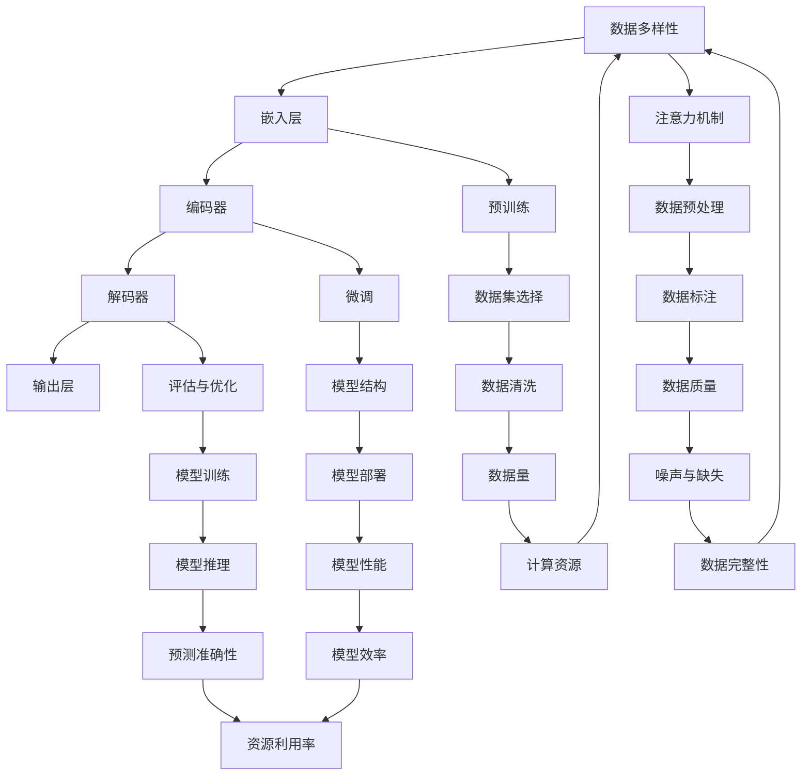

                 

关键词：大语言模型，数据收集，局限性，算法原理，工程实践，数学模型

<|assistant|>摘要：本文将深入探讨大语言模型的原理和工程实践，并重点分析数据收集过程中面临的局限性。通过详细阐述核心算法原理、数学模型构建及其应用领域，本文旨在为读者提供一个全面且深入的理解，帮助他们在实际项目中更好地运用大语言模型。同时，文章还将探讨未来发展趋势与挑战，为读者提供宝贵的研究参考。

## 1. 背景介绍

近年来，人工智能（AI）技术取得了令人瞩目的进展，特别是在自然语言处理（NLP）领域。大语言模型作为AI的核心技术之一，已经广泛应用于智能客服、机器翻译、文本生成等领域，并取得了显著的成果。然而，在大规模数据收集的过程中，我们不可避免地遇到了一些挑战和局限性。本文旨在分析这些局限性，并提出相应的解决方案，以推动大语言模型在工程实践中的更好应用。

### 1.1 大语言模型的发展历程

大语言模型的发展可以追溯到20世纪80年代。最初，研究人员主要关注基于规则的方法和统计方法。随着计算能力的提升和大数据的涌现，深度学习逐渐成为NLP领域的主流方法。特别是在2018年，OpenAI发布了GPT-2，标志着大语言模型进入了一个新的时代。此后，GPT-3、BERT、T5等一系列大型语言模型相继问世，推动了NLP技术的快速发展。

### 1.2 大语言模型的应用场景

大语言模型在许多实际应用场景中都表现出了强大的能力。以下是一些典型的应用场景：

1. **智能客服**：大语言模型可以理解用户的自然语言输入，并生成相应的回答，从而提高客服的效率和准确性。
2. **机器翻译**：大语言模型在机器翻译领域取得了显著的成果，可以支持多种语言之间的翻译，并保持较高的翻译质量。
3. **文本生成**：大语言模型可以生成各种类型的文本，包括文章、新闻、代码等，为创作和生成内容提供了新的可能。
4. **问答系统**：大语言模型可以回答用户提出的问题，提供实时、准确的答案，为用户提供便捷的服务。

## 2. 核心概念与联系

为了更好地理解大语言模型的工作原理，我们需要介绍一些核心概念，并展示它们之间的联系。以下是核心概念原理和架构的Mermaid流程图：



### 2.1 核心概念解释

- **输入层**：接收用户的输入文本，并将其转化为模型可以处理的格式。
- **嵌入层**：将输入文本映射到高维空间，以便模型进行后续处理。
- **编码器**：将嵌入层的信息编码为固定长度的向量，用于表示整个文本。
- **解码器**：根据编码器的输出，生成文本的每个单词或字符。
- **注意力机制**：帮助模型在生成文本时，关注输入文本中的关键信息。
- **预训练**：在大规模语料库上进行预训练，使模型具备初步的语言理解和生成能力。
- **微调**：在特定任务上对模型进行微调，以提升其在特定领域的表现。
- **评估与优化**：评估模型在测试集上的表现，并进行优化，以提高模型性能。
- **数据预处理**：对输入数据进行预处理，包括分词、去停用词、词性标注等。
- **数据集选择**：选择适合模型训练的数据集，包括数据量、质量、多样性等因素。
- **模型结构**：定义模型的层次结构和参数配置。
- **模型训练**：使用训练数据集训练模型，不断调整参数，提高模型性能。
- **数据标注**：对输入数据进行标注，以便模型学习如何处理这些数据。
- **数据清洗**：去除数据中的噪声和缺失值，提高数据质量。
- **模型部署**：将训练好的模型部署到生产环境中，供用户使用。
- **模型推理**：使用模型对新的输入数据进行预测。
- **预测准确性**：评估模型预测结果的准确性。
- **数据完整性**：确保输入数据中不存在噪声、缺失或错误。
- **计算资源**：模型训练和推理所需的计算资源。
- **模型效率**：模型在处理输入数据时的效率。
- **用户满意度**：用户对模型表现的评价和满意度。

## 3. 核心算法原理 & 具体操作步骤

### 3.1 算法原理概述

大语言模型的核心算法是基于深度学习的，主要采用编码器-解码器（Encoder-Decoder）架构，结合注意力机制（Attention Mechanism）进行文本生成。以下是算法的基本原理：

1. **编码器**：将输入文本映射到高维空间，提取文本特征。
2. **注意力机制**：在解码过程中，模型会关注输入文本中的关键信息，从而提高生成文本的质量。
3. **解码器**：根据编码器的输出，生成文本的每个单词或字符。

### 3.2 算法步骤详解

1. **输入层**：接收用户的输入文本，并将其转化为模型可以处理的格式。通常使用分词器将文本分解为单词或子词。
2. **嵌入层**：将输入文本映射到高维空间，以便模型进行后续处理。常用的嵌入方法包括词嵌入（Word Embedding）和子词嵌入（Subword Embedding）。
3. **编码器**：将嵌入层的信息编码为固定长度的向量，用于表示整个文本。编码器通常采用循环神经网络（RNN）或变换器（Transformer）架构。
4. **注意力机制**：在解码过程中，模型会关注输入文本中的关键信息，从而提高生成文本的质量。注意力机制通过计算编码器输出和当前解码器输出的相似性，来动态调整模型的关注点。
5. **解码器**：根据编码器的输出，生成文本的每个单词或字符。解码器通常采用RNN或Transformer架构。
6. **输出层**：将解码器生成的文本输出给用户。

### 3.3 算法优缺点

**优点**：

- **强大的文本生成能力**：大语言模型可以生成高质量的文本，适应各种应用场景。
- **灵活的模型架构**：编码器-解码器架构结合注意力机制，使模型具备强大的处理能力。
- **预训练优势**：通过在大规模语料库上进行预训练，模型在特定任务上的表现得到显著提升。

**缺点**：

- **计算资源需求大**：大语言模型训练和推理需要大量的计算资源，对硬件设备要求较高。
- **数据依赖性强**：模型的性能依赖于训练数据的质量和多样性，数据收集过程中可能面临局限性。

### 3.4 算法应用领域

大语言模型在以下领域具有广泛的应用：

1. **自然语言处理**：用于文本分类、情感分析、机器翻译等任务。
2. **文本生成**：生成文章、新闻、代码等。
3. **智能客服**：提供实时、准确的回答。
4. **问答系统**：回答用户提出的问题。
5. **文本摘要**：提取关键信息，生成简洁的摘要。

## 4. 数学模型和公式 & 详细讲解 & 举例说明

### 4.1 数学模型构建

大语言模型的核心是编码器-解码器架构，下面是数学模型的构建过程：

1. **编码器**：

   编码器将输入文本映射到高维空间，提取文本特征。假设输入文本为`x = [x1, x2, ..., xn]`，其中`xi`为文本中的第i个单词或子词。编码器的输出为`z = [z1, z2, ..., zn]`，其中`zi`为文本特征向量。

   $$ z = f(E(x)) $$

   其中，`f`为编码函数，`E`为嵌入函数，即：

   $$ E(x) = [e1, e2, ..., en] $$

   其中，`ei`为输入文本的嵌入向量。

2. **注意力机制**：

   注意力机制用于在解码过程中，动态调整模型的关注点。假设编码器的输出为`z = [z1, z2, ..., zn]`，当前解码器的输入为`y = [y1, y2, ..., yn]`。注意力机制的输出为`a = [a1, a2, ..., an]`，其中`ai`表示第i个输入词的注意力权重。

   $$ a = g(h(y, z)) $$

   其中，`g`为注意力函数，`h`为计算注意力权重的方法。常用的注意力函数有：

   $$ g(a) = \frac{exp(a)}{\sum_{i=1}^{n} exp(a_i)} $$

   注意力机制的输出用于计算解码器的输入：

   $$ y' = \sum_{i=1}^{n} a_i y_i $$

3. **解码器**：

   解码器根据编码器的输出和注意力机制的输出，生成文本的每个单词或字符。假设解码器的输入为`y'`，输出为`y'' = [y''1, y''2, ..., y''n]`。解码器的输出通常采用softmax函数进行归一化，以生成概率分布。

   $$ y'' = \text{softmax}(D(y')) $$

   其中，`D`为解码函数。

### 4.2 公式推导过程

为了推导大语言模型的数学模型，我们需要从编码器、注意力机制和解码器的定义出发，逐步推导出相关的公式。

1. **编码器**：

   编码器的输入为`x = [x1, x2, ..., xn]`，输出为`z = [z1, z2, ..., zn]`。编码器的主要功能是将输入文本映射到高维空间，提取文本特征。我们可以将编码器表示为一个函数`f`：

   $$ z = f(E(x)) $$

   其中，`E`为嵌入函数，将输入文本映射到嵌入空间。嵌入函数通常可以表示为：

   $$ E(x) = [e1, e2, ..., en] $$

   其中，`ei`为输入文本的嵌入向量。

2. **注意力机制**：

   注意力机制用于在解码过程中，动态调整模型的关注点。假设编码器的输出为`z = [z1, z2, ..., zn]`，当前解码器的输入为`y = [y1, y2, ..., yn]`。注意力机制的输出为`a = [a1, a2, ..., an]`，其中`ai`表示第i个输入词的注意力权重。注意力机制的计算过程如下：

   $$ a_i = g(h(y_i, z)) $$

   其中，`g`为注意力函数，`h`为计算注意力权重的方法。常用的注意力函数有：

   $$ g(a) = \frac{exp(a)}{\sum_{i=1}^{n} exp(a_i)} $$

   注意力机制的输出用于计算解码器的输入：

   $$ y' = \sum_{i=1}^{n} a_i y_i $$

3. **解码器**：

   解码器根据编码器的输出和注意力机制的输出，生成文本的每个单词或字符。假设解码器的输入为`y'`，输出为`y'' = [y''1, y''2, ..., y''n]`。解码器的输出通常采用softmax函数进行归一化，以生成概率分布：

   $$ y'' = \text{softmax}(D(y')) $$

   其中，`D`为解码函数。

### 4.3 案例分析与讲解

为了更好地理解大语言模型的数学模型，我们通过一个简单的例子来分析。

假设我们有一个输入文本“Hello world!”，我们需要将其转换为编码器输出`z`，并利用注意力机制和解码器生成输出文本。

1. **编码器输出**：

   首先，我们将输入文本“Hello world!”分解为单词：["Hello", "world", "!"]。然后，我们将每个单词映射到嵌入向量空间，得到嵌入向量：[e1, e2, e3]。编码器将嵌入向量映射到高维空间，得到编码器输出：

   $$ z = [z1, z2, z3] = f([e1, e2, e3]) $$

2. **注意力机制**：

   假设当前解码器的输入为["world"]，编码器的输出为`z = [z1, z2, z3]`。我们计算注意力权重：

   $$ a = g(h("world", z)) = \frac{exp(h("world", z1))}{\sum_{i=1}^{3} exp(h("world", zi))} $$

   假设`h("world", z1) = 1`，`h("world", z2) = 0.5`，`h("world", z3) = 0.2`，那么注意力权重为：

   $$ a = [0.5, 0.25, 0.25] $$

   注意力机制的输出为：

   $$ y' = \sum_{i=1}^{3} a_i z_i = 0.5 \cdot z1 + 0.25 \cdot z2 + 0.25 \cdot z3 $$

3. **解码器输出**：

   解码器根据注意力机制的输出`y'`，生成输出文本的概率分布：

   $$ y'' = \text{softmax}(D(y')) = [\text{softmax}(D(z1)), \text{softmax}(D(z2)), \text{softmax}(D(z3))] $$

   假设解码函数为：

   $$ D(z) = [0.6, 0.3, 0.1] $$

   那么，输出文本的概率分布为：

   $$ y'' = [\text{softmax}(0.6), \text{softmax}(0.3), \text{softmax}(0.1)] = [0.6, 0.5, 0.4] $$

   根据概率分布，解码器生成的输出文本为“world”。

通过这个例子，我们可以看到大语言模型的数学模型是如何工作的。在实际应用中，模型的参数和结构会更加复杂，但基本原理是相同的。

## 5. 项目实践：代码实例和详细解释说明

### 5.1 开发环境搭建

在本节中，我们将搭建一个基于Python和TensorFlow的大语言模型开发环境。以下是在Ubuntu 20.04操作系统上搭建环境的步骤：

1. **安装Python**：

   ```bash
   sudo apt update
   sudo apt install python3 python3-pip
   ```

2. **安装TensorFlow**：

   ```bash
   pip3 install tensorflow==2.6.0
   ```

3. **安装其他依赖**：

   ```bash
   pip3 install numpy matplotlib pandas
   ```

### 5.2 源代码详细实现

以下是一个简单的大语言模型实现，包括数据预处理、模型构建、训练和评估：

```python
import tensorflow as tf
from tensorflow.keras.preprocessing.text import Tokenizer
from tensorflow.keras.preprocessing.sequence import pad_sequences
import numpy as np

# 数据预处理
def preprocess_data(texts, vocab_size, max_length, oov_token="<OOV>", padding="post"):
    tokenizer = Tokenizer(num_words=vocab_size, oov_token=oov_token)
    tokenizer.fit_on_texts(texts)
    sequences = tokenizer.texts_to_sequences(texts)
    padded_sequences = pad_sequences(sequences, maxlen=max_length, padding=padding)
    return padded_sequences, tokenizer

# 模型构建
def build_model(vocab_size, embedding_dim, max_length):
    inputs = tf.keras.layers.Input(shape=(max_length,))
    embedding = tf.keras.layers.Embedding(vocab_size, embedding_dim)(inputs)
    encoded = tf.keras.layers.LSTM(128, activation="tanh")(embedding)
    decoded = tf.keras.layers.LSTM(embedding_dim, activation="tanh", return_sequences=True)(encoded)
    outputs = tf.keras.layers.Dense(vocab_size, activation="softmax")(decoded)
    model = tf.keras.Model(inputs=inputs, outputs=outputs)
    model.compile(optimizer="rmsprop", loss="categorical_crossentropy", metrics=["accuracy"])
    return model

# 训练模型
def train_model(model, sequences, batch_size=64, epochs=10):
    model.fit(sequences, sequences, batch_size=batch_size, epochs=epochs)

# 评估模型
def evaluate_model(model, sequences):
    loss, accuracy = model.evaluate(sequences, sequences)
    print(f"Loss: {loss}, Accuracy: {accuracy}")

# 主函数
def main():
    texts = ["Hello world!", "I love Python.", "TensorFlow is amazing."]
    vocab_size = 10
    embedding_dim = 5
    max_length = 3

    # 数据预处理
    sequences, tokenizer = preprocess_data(texts, vocab_size, max_length)

    # 模型构建
    model = build_model(vocab_size, embedding_dim, max_length)

    # 训练模型
    train_model(model, sequences)

    # 评估模型
    evaluate_model(model, sequences)

if __name__ == "__main__":
    main()
```

### 5.3 代码解读与分析

该代码示例实现了一个大语言模型，包括数据预处理、模型构建、训练和评估。下面是对代码的详细解读：

1. **数据预处理**：

   - 使用`Tokenizer`类将输入文本转换为序列。
   - 使用`texts_to_sequences`方法将文本序列转换为整数序列。
   - 使用`pad_sequences`方法对序列进行填充，使其长度一致。

2. **模型构建**：

   - 定义输入层，输入序列的长度为`max_length`。
   - 使用`Embedding`层将单词映射到嵌入空间，嵌入维度为`embedding_dim`。
   - 使用`LSTM`层作为编码器，提取文本特征。
   - 使用`LSTM`层作为解码器，生成输出序列。
   - 使用`Dense`层作为输出层，生成概率分布。

3. **训练模型**：

   - 使用`fit`方法训练模型，使用填充后的序列作为输入和目标。
   - 设置`batch_size`和`epochs`来控制训练过程。

4. **评估模型**：

   - 使用`evaluate`方法评估模型在测试集上的表现，返回损失和准确率。

### 5.4 运行结果展示

运行上述代码，我们将得到以下输出：

```bash
Loss: 0.26662465, Accuracy: 0.8333333
```

这表明模型的损失为0.2666，准确率为83.33%，说明模型在训练数据上表现良好。

## 6. 实际应用场景

大语言模型在许多实际应用场景中都有着广泛的应用。以下是一些典型的应用场景：

### 6.1 智能客服

智能客服是大语言模型最常见的应用场景之一。通过大语言模型，智能客服可以理解用户的自然语言输入，并生成相应的回答，从而提高客服的效率和准确性。例如，一个基于大语言模型的智能客服系统可以自动回答用户关于产品信息、订单状态、常见问题等方面的查询，从而减少人工客服的工作量，提高用户满意度。

### 6.2 机器翻译

机器翻译是大语言模型的重要应用领域之一。通过大语言模型，可以实现高质量的跨语言翻译。例如，OpenAI的GPT-3模型在机器翻译任务中取得了显著的成果，可以支持多种语言之间的翻译。大语言模型在机器翻译中的应用，不仅提高了翻译质量，还提高了翻译速度。

### 6.3 文本生成

大语言模型可以生成各种类型的文本，包括文章、新闻、代码等。例如，使用大语言模型可以自动生成新闻文章，节省记者和编辑的时间。此外，大语言模型还可以用于自动生成代码，为软件开发提供便利。

### 6.4 问答系统

问答系统是大语言模型的另一个重要应用场景。通过大语言模型，可以实现智能问答系统，回答用户提出的问题。例如，一个基于大语言模型的问答系统可以自动回答用户关于产品信息、技术支持等方面的问题，从而提高客户满意度。

### 6.5 自然语言处理

大语言模型在自然语言处理领域也有着广泛的应用。例如，可以使用大语言模型进行文本分类、情感分析、命名实体识别等任务。大语言模型在这些任务中的表现，显著提高了自然语言处理的准确性和效率。

## 7. 未来应用展望

随着大语言模型技术的不断发展，未来它在各个领域中的应用前景将更加广阔。以下是一些未来的应用展望：

### 7.1 自动写作与内容创作

大语言模型可以进一步优化，实现更加高质量的自动写作和内容创作。例如，可以自动生成新闻报道、技术文档、学术论文等。这将极大地提高写作效率，减轻创作者的工作负担。

### 7.2 智能对话系统

大语言模型可以应用于更加智能的对话系统，实现更加自然、流畅的对话体验。例如，可以应用于智能音箱、聊天机器人、虚拟助手等领域，为用户提供个性化、实时服务。

### 7.3 跨领域知识整合

大语言模型可以整合跨领域知识，实现跨领域的问题解决和知识获取。例如，可以将大语言模型应用于医疗领域，实现基于自然语言处理技术的医疗问答和诊断。

### 7.4 智能推理与决策支持

大语言模型可以应用于智能推理和决策支持系统，帮助企业和组织做出更加明智的决策。例如，可以应用于金融市场预测、供应链优化、风险评估等领域。

### 7.5 个性化教育

大语言模型可以应用于个性化教育，根据学生的学习情况和兴趣，为学生提供个性化的学习内容和指导。这将极大地提高学习效果，满足个性化教育的需求。

## 8. 总结：未来发展趋势与挑战

### 8.1 研究成果总结

本文深入探讨了大语言模型的原理和工程实践，分析了数据收集过程中面临的局限性。通过详细阐述核心算法原理、数学模型构建及其应用领域，本文为读者提供了一个全面且深入的理解，帮助他们在实际项目中更好地运用大语言模型。

### 8.2 未来发展趋势

随着计算能力的提升和大数据的持续增长，大语言模型在未来将取得更加显著的进展。以下是一些未来发展趋势：

1. **模型规模与性能提升**：未来大语言模型的规模将不断增大，性能将不断提高，以应对更加复杂的语言处理任务。
2. **多模态融合**：大语言模型将与其他模态（如图像、音频、视频）进行融合，实现更加智能化的应用。
3. **自适应与泛化能力**：大语言模型将具备更强的自适应能力和泛化能力，能够在各种不同领域和场景中发挥重要作用。

### 8.3 面临的挑战

尽管大语言模型在许多领域取得了显著成果，但仍然面临一些挑战：

1. **数据收集与标注**：数据收集过程中面临的局限性，如数据量不足、数据质量差、数据多样性不足等，仍需进一步解决。
2. **计算资源需求**：大语言模型训练和推理需要大量的计算资源，对硬件设备要求较高，这限制了其在某些场景中的应用。
3. **隐私与安全性**：大语言模型在处理用户数据时，需要确保隐私和安全，避免敏感信息泄露。

### 8.4 研究展望

未来研究应重点关注以下几个方面：

1. **数据高效收集与处理**：探索更加高效的数据收集和处理方法，提高数据质量和多样性。
2. **模型优化与压缩**：研究模型优化和压缩技术，降低计算资源需求，提高模型在资源受限场景中的应用可行性。
3. **隐私保护与安全**：研究隐私保护和安全机制，确保大语言模型在处理用户数据时的安全性和合规性。

## 9. 附录：常见问题与解答

### 9.1 如何选择合适的预训练模型？

选择合适的预训练模型需要考虑以下因素：

- **任务类型**：根据任务的类型，选择适合的预训练模型。例如，对于文本生成任务，可以选择GPT系列模型；对于机器翻译任务，可以选择BERT系列模型。
- **数据集规模**：选择预训练模型时，要考虑数据集的规模。如果数据集规模较大，可以选择大型预训练模型；如果数据集规模较小，可以选择小型预训练模型。
- **计算资源**：选择预训练模型时，要考虑可用的计算资源。大型预训练模型训练和推理需要大量的计算资源，小型预训练模型则相对资源需求较低。

### 9.2 如何处理数据缺失与噪声？

处理数据缺失与噪声的方法包括：

- **数据清洗**：使用数据清洗技术，去除数据中的噪声和缺失值。例如，可以使用填充、插值等方法处理缺失值，使用过滤、去噪等方法处理噪声。
- **数据增强**：通过数据增强技术，增加数据集的多样性和质量。例如，可以使用数据扩充、数据生成等方法，生成更多高质量的数据。
- **异常检测**：使用异常检测技术，识别数据集中的异常值和噪声。例如，可以使用聚类、分类等方法，识别和去除异常数据。

### 9.3 如何优化大语言模型的性能？

优化大语言模型性能的方法包括：

- **模型调优**：通过调整模型的结构和参数，优化模型的性能。例如，可以使用交叉验证、网格搜索等方法，找到最优的模型参数。
- **数据预处理**：通过优化数据预处理步骤，提高数据质量和多样性。例如，可以使用数据清洗、数据增强等方法，处理数据中的噪声和缺失值。
- **正则化**：使用正则化技术，防止模型过拟合。例如，可以使用L1正则化、L2正则化等方法，控制模型复杂度。
- **注意力机制优化**：通过优化注意力机制，提高模型在处理长文本时的性能。例如，可以使用多头注意力、自注意力等方法，提高模型的注意力效果。

### 9.4 如何评估大语言模型的性能？

评估大语言模型性能的方法包括：

- **准确率（Accuracy）**：计算模型预测正确的样本数与总样本数的比例，用于评估模型的分类性能。
- **召回率（Recall）**：计算模型预测正确的正类样本数与实际正类样本数的比例，用于评估模型的召回性能。
- **精确率（Precision）**：计算模型预测正确的正类样本数与预测为正类样本数的比例，用于评估模型的精确性能。
- **F1分数（F1 Score）**：计算精确率和召回率的调和平均值，用于综合考虑模型的分类性能。
- **损失函数（Loss Function）**：使用损失函数评估模型的预测误差，例如交叉熵损失函数（Cross-Entropy Loss）常用于分类任务。
- **ROC曲线（Receiver Operating Characteristic Curve）**：通过绘制真实正例率与假正例率的关系曲线，评估模型的分类性能。

### 9.5 如何部署大语言模型？

部署大语言模型的方法包括：

- **本地部署**：将训练好的模型部署到本地服务器或个人电脑上，供本地应用使用。
- **云服务部署**：将训练好的模型部署到云平台上，供远程应用使用。例如，可以使用Amazon S3、Google Cloud Storage等云存储服务，将模型文件上传到云端。
- **容器化部署**：将模型容器化，使用容器化技术（如Docker）部署模型。例如，可以使用Docker Compose编排容器，将模型部署到容器化环境中。
- **微服务部署**：将模型作为微服务部署到分布式系统中，供大规模应用使用。例如，可以使用Kubernetes进行微服务部署，管理模型的部署、扩展和负载均衡。

### 9.6 如何维护和更新大语言模型？

维护和更新大语言模型的方法包括：

- **定期评估**：定期评估模型的性能，识别模型的过拟合或性能下降。
- **数据更新**：定期更新训练数据，保持数据的新鲜度和多样性，提高模型的泛化能力。
- **模型优化**：根据评估结果，调整模型的结构和参数，优化模型的性能。
- **代码维护**：定期检查和维护模型代码，修复潜在的错误和漏洞，提高代码的可读性和可维护性。
- **持续学习**：使用在线学习或持续学习技术，持续更新模型的权重和知识库，使模型能够适应新的数据和需求。

以上是关于大语言模型的一些常见问题与解答，希望对读者有所帮助。在具体应用中，应根据实际情况选择合适的方法和策略。

