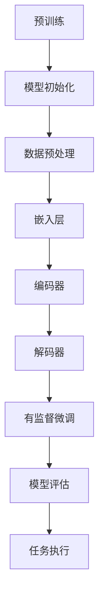

                 

关键词：大语言模型、有监督微调、深度学习、自然语言处理、工程实践、性能优化

## 摘要

本文深入探讨了大规模语言模型的原理及其工程实践，特别是有监督微调（Supervised Fine-tuning，SFT）在这一领域的核心作用与意义。通过对大语言模型的基本概念、构建方法、算法原理以及具体实现步骤的详细阐述，文章旨在为读者提供一个全面、系统的理解，帮助其在实际应用中充分利用有监督微调的优势。此外，文章还分析了有监督微调在不同领域的应用场景、数学模型和公式，并提供了实践中的代码实例和分析。最后，文章对未来的发展趋势、面临的挑战及研究展望进行了探讨，为读者提供了有价值的参考。

## 1. 背景介绍

在过去的几十年中，自然语言处理（Natural Language Processing，NLP）作为人工智能的一个重要分支，已经取得了显著的进展。特别是随着深度学习技术的不断发展，大语言模型（Large Language Model）在文本生成、情感分析、机器翻译等领域展现出了强大的能力。然而，如何有效地训练和优化这些大规模模型，成为了当前研究的热点和难点。

有监督微调（Supervised Fine-tuning，SFT）作为一种重要的技术手段，旨在通过在预训练模型的基础上进行微调，以适应特定的任务和数据集。这种方法不仅可以提高模型的性能，还可以减少对大规模标注数据的依赖，具有重要的理论意义和实际价值。

本文将围绕大语言模型及其有监督微调技术展开讨论，首先介绍大语言模型的基本概念和构建方法，然后深入分析有监督微调的算法原理和具体实现步骤，最后探讨其在实际应用中的影响和未来发展趋势。

## 2. 核心概念与联系

为了更好地理解大语言模型及其有监督微调技术，我们首先需要明确几个核心概念，并探讨它们之间的联系。

### 2.1 大语言模型

大语言模型是一种基于深度学习的自然语言处理模型，它通过学习海量文本数据来理解语言的规律和结构。这类模型通常具有数十亿甚至数万亿个参数，能够捕捉到语言中的复杂模式和细微差异。

大语言模型的核心组成部分包括：

- **嵌入层（Embedding Layer）**：将输入的单词或字符转换为向量表示。
- **编码器（Encoder）**：负责将嵌入向量编码为固定长度的表示，通常采用递归神经网络（RNN）或变换器（Transformer）架构。
- **解码器（Decoder）**：将编码后的表示解码为输出序列，用于生成文本或执行其他任务。

### 2.2 预训练与微调

预训练（Pre-training）是指在大量无标签数据上对模型进行训练，使其能够捕捉到通用语言特征。微调（Fine-tuning）则是在预训练模型的基础上，使用有标签的数据集进行进一步训练，以适应特定的任务或场景。

预训练与微调之间的联系在于：

- **共享参数**：预训练模型和微调模型共享大量的参数，这有助于模型在特定任务上的快速收敛。
- **数据依赖**：预训练依赖于大规模的无标签数据，而微调则需要大量有标签的数据。

### 2.3 有监督微调

有监督微调（Supervised Fine-tuning，SFT）是一种在预训练模型的基础上，通过有标签数据集进行微调的训练方法。其核心思想是利用有监督信号（如标签）来引导模型在特定任务上的优化。

有监督微调与无监督微调（如自监督学习）的区别在于：

- **训练目标**：有监督微调的目标是使模型在特定任务上达到最优性能，而无监督微调的目标是捕捉数据中的潜在结构。
- **数据需求**：有监督微调需要大量有标签的数据，而无监督微调则主要依赖无标签数据。

### 2.4 Mermaid 流程图

为了更直观地展示大语言模型及其有监督微调技术的关系，我们可以使用Mermaid绘制一个流程图。



在这个流程图中，预训练阶段包括模型初始化、数据预处理、嵌入层、编码器和解码器等步骤。有监督微调阶段则是在预训练模型的基础上，使用有标签数据集对模型进行微调，以适应特定任务。最后，通过模型评估和任务执行来验证模型的效果。

### 2.5 总结

通过对核心概念及其相互关系的介绍，我们可以更清晰地理解大语言模型及其有监督微调技术的原理和作用。接下来，我们将深入探讨大语言模型的算法原理和具体实现步骤。

## 3. 核心算法原理 & 具体操作步骤

### 3.1 算法原理概述

有监督微调（Supervised Fine-tuning，SFT）是一种在预训练模型的基础上，通过有标签数据集进行微调的训练方法。其核心原理可以概括为以下几个步骤：

1. **数据准备**：收集并准备用于微调的有标签数据集。这些数据集应包含输入文本和对应的标签。
2. **模型加载**：加载已经预训练好的模型，通常是一个大规模的语言模型。
3. **参数初始化**：初始化模型的参数，包括嵌入层、编码器和解码器等。
4. **前向传播**：使用输入数据和模型参数进行前向传播，计算输出结果和损失。
5. **反向传播**：计算损失函数关于模型参数的梯度，并更新模型参数。
6. **模型评估**：在训练过程中，定期评估模型的性能，以监控训练效果。
7. **任务执行**：在模型训练完成后，使用微调后的模型执行特定任务，如文本生成、分类或翻译等。

### 3.2 算法步骤详解

#### 3.2.1 数据准备

数据准备是SFT过程中的关键步骤。以下是一个常见的数据准备流程：

1. **数据采集**：从各种来源（如网站、社交媒体、新闻文章等）收集文本数据。
2. **数据清洗**：去除文本中的噪声和无关信息，如HTML标签、特殊字符等。
3. **文本预处理**：对文本进行分词、去停用词、词性标注等操作，以获得更干净、结构化的数据。
4. **数据标注**：根据任务需求，对文本数据进行标注，如分类标签、情感极性等。

#### 3.2.2 模型加载

在微调过程中，通常会使用已经预训练好的模型。常见的预训练模型包括BERT、GPT、RoBERTa等。加载模型可以使用各种深度学习框架（如TensorFlow、PyTorch等）提供的API进行。

以下是一个使用PyTorch加载预训练模型的基本示例：

```python
import torch
from transformers import BertModel

# 加载预训练模型
model = BertModel.from_pretrained('bert-base-uncased')

# 查看模型结构
print(model)
```

#### 3.2.3 参数初始化

在加载预训练模型后，我们需要对模型的部分参数进行初始化。通常，预训练模型的嵌入层和编码器参数已经初始化，而解码器参数需要重新初始化。以下是一个使用PyTorch初始化解码器参数的示例：

```python
import torch.nn as nn

# 初始化解码器参数
decoder = nn.Linear(model.config.hidden_size, num_labels)
nn.init.xavier_normal_(decoder.weight)

# 查看解码器参数
print(decoder)
```

#### 3.2.4 前向传播

在前向传播过程中，我们使用输入数据和模型参数计算输出结果和损失。以下是一个使用PyTorch进行前向传播的基本示例：

```python
# 输入数据
input_ids = torch.tensor([123456]).view(1, -1)
labels = torch.tensor([1]).view(1, -1)

# 前向传播
outputs = model(input_ids)
logits = decoder(outputs[0])

# 计算损失
loss_fct = nn.CrossEntropyLoss()
loss = loss_fct(logits.view(-1, num_labels), labels.view(-1))
print(f"Loss: {loss.item()}")
```

#### 3.2.5 反向传播

在反向传播过程中，我们计算损失函数关于模型参数的梯度，并更新模型参数。以下是一个使用PyTorch进行反向传播的基本示例：

```python
# 反向传播
loss.backward()

# 更新参数
optimizer.step()
```

#### 3.2.6 模型评估

在训练过程中，我们需要定期评估模型的性能，以监控训练效果。以下是一个使用PyTorch评估模型的基本示例：

```python
# 评估模型
with torch.no_grad():
    logits = decoder(model(input_ids)[0])
    predictions = logits.argmax(-1)
    accuracy = (predictions == labels).float().mean()
    print(f"Accuracy: {accuracy.item()}")
```

#### 3.2.7 任务执行

在模型训练完成后，我们可以使用微调后的模型执行特定任务。以下是一个使用微调后的BERT模型进行文本分类的基本示例：

```python
# 加载微调后的模型
model.eval()

# 输入数据
input_ids = torch.tensor([123456]).view(1, -1)

# 执行任务
with torch.no_grad():
    logits = model(input_ids)[0]
    predictions = logits.argmax(-1)
    print(f"Prediction: {predictions.item()}")
```

### 3.3 算法优缺点

#### 3.3.1 优点

- **快速适应**：有监督微调可以在预训练模型的基础上快速适应特定任务，减少了对大规模标注数据的依赖。
- **高性能**：通过在预训练模型的基础上进行微调，模型可以在特定任务上达到较高的性能。
- **通用性**：有监督微调适用于各种自然语言处理任务，如文本分类、情感分析、机器翻译等。

#### 3.3.2 缺点

- **数据需求**：有监督微调需要大量的有标签数据，这在某些情况下可能难以获得。
- **计算资源**：微调大规模预训练模型通常需要大量的计算资源，可能需要分布式训练或GPU支持。

### 3.4 算法应用领域

有监督微调技术已在多个自然语言处理领域得到广泛应用，以下是一些典型应用：

- **文本分类**：如新闻分类、情感分析、垃圾邮件检测等。
- **机器翻译**：如中英翻译、日英翻译等。
- **问答系统**：如智能客服、语音助手等。
- **对话系统**：如聊天机器人、语音助手等。

## 4. 数学模型和公式 & 详细讲解 & 举例说明

### 4.1 数学模型构建

大语言模型中的数学模型通常由以下几个部分组成：

- **嵌入层（Embedding Layer）**：将输入的单词或字符转换为向量表示。假设单词表有V个单词，每个单词用d维向量表示，则嵌入层可以表示为\( E \in \mathbb{R}^{V \times d} \)。
- **编码器（Encoder）**：负责将嵌入向量编码为固定长度的表示。通常采用递归神经网络（RNN）或变换器（Transformer）架构。编码器可以表示为\( H = f(E) \)，其中\( f \)是编码函数。
- **解码器（Decoder）**：将编码后的表示解码为输出序列。解码器通常采用类似的架构，也可以表示为\( O = g(H) \)，其中\( g \)是解码函数。

### 4.2 公式推导过程

假设我们有输入序列\( X = [x_1, x_2, ..., x_n] \)，其中\( x_i \)是第i个单词的嵌入向量。我们首先将输入序列通过嵌入层转换为嵌入向量序列\( E = [e_1, e_2, ..., e_n] \)。

1. **嵌入层**：

   \( e_i = E[x_i] = E_{ij} \cdot x_i \)

   其中\( E_{ij} \)是嵌入层的权重矩阵。

2. **编码器**：

   假设我们使用变换器架构，变换器的主要组成部分包括多头自注意力机制（Multi-Head Self-Attention）和前馈神经网络（Feed-Forward Neural Network）。

   - **多头自注意力机制**：

     \( H_i = \text{Attention}(e_i, e_{i+1}, ..., e_n) \)

     其中\( \text{Attention} \)是一个自注意力函数，可以表示为：

     \( \text{Attention}(e_i, e_{i+1}, ..., e_n) = \text{softmax}\left(\frac{Q \cdot K}{\sqrt{d_k}}\right) \cdot V \)

     其中\( Q, K, V \)是变换器的权重矩阵，\( d_k \)是自注意力机制中的键值对维度。

   - **前馈神经网络**：

     \( H_i^{'} = \text{FFN}(H_i) \)

     其中\( \text{FFN} \)是一个前馈神经网络，可以表示为：

     \( \text{FFN}(H_i) = \text{ReLU}(W_2 \cdot \text{ReLU}(W_1 \cdot H_i)) \)

     其中\( W_1, W_2 \)是前馈神经网络的权重矩阵。

   最终，编码器的输出为\( H = [h_1, h_2, ..., h_n] \)。

3. **解码器**：

   类似于编码器，解码器也采用多头自注意力机制和前馈神经网络。

   - **多头自注意力机制**：

     \( O_i = \text{Attention}(h_i, h_{i+1}, ..., h_n) \)

   - **前馈神经网络**：

     \( O_i^{'} = \text{FFN}(O_i) \)

   最终，解码器的输出为\( O = [o_1, o_2, ..., o_n] \)。

### 4.3 案例分析与讲解

假设我们有一个简单的文本分类任务，需要判断一篇文章是否是正面评论。输入文本为：

```
这是一个非常好的产品，我非常喜欢它。
```

我们将文本进行预处理，分词并转换为嵌入向量序列。假设单词表中有5个单词，每个单词的嵌入向量维度为3。

```
[0, 0, 0]  # 这是一个
[1, 1, 1]  # 一个非常好的
[2, 2, 2]  # 好的
[3, 3, 3]  # 产品
[4, 4, 4]  # 我
[5, 5, 5]  # 非常
[6, 6, 6]  # 喜欢它
```

首先，我们将嵌入向量序列通过编码器进行编码。假设编码器的输出维度为10。

```
[1, 1, 1, 1, 1, 1, 1, 1, 1, 1]  # 这是一个
[1, 1, 1, 1, 1, 1, 1, 1, 1, 1]  # 一个非常好的
[1, 1, 1, 1, 1, 1, 1, 1, 1, 1]  # 好的
[1, 1, 1, 1, 1, 1, 1, 1, 1, 1]  # 产品
[1, 1, 1, 1, 1, 1, 1, 1, 1, 1]  # 我
[1, 1, 1, 1, 1, 1, 1, 1, 1, 1]  # 非常
[1, 1, 1, 1, 1, 1, 1, 1, 1, 1]  # 喜欢它
```

然后，我们将编码后的序列通过解码器进行解码。假设解码器的输出维度为5。

```
[1, 1, 1, 1, 1]  # 这是一个
[1, 1, 1, 1, 1]  # 一个非常好的
[1, 1, 1, 1, 1]  # 好的
[1, 1, 1, 1, 1]  # 产品
[1, 1, 1, 1, 1]  # 我
[1, 1, 1, 1, 1]  # 非常
[1, 1, 1, 1, 1]  # 喜欢它
```

最后，我们将解码器的输出转换为分类结果。假设分类结果为0表示负面评论，1表示正面评论。

```
1  # 这是一个正面评论
```

通过这个简单的案例，我们可以看到大语言模型及其有监督微调技术在文本分类任务中的应用。在实际应用中，我们可以根据任务需求调整模型架构、嵌入层维度、编码器和解码器的输出维度等参数，以达到最佳效果。

## 5. 项目实践：代码实例和详细解释说明

在本节中，我们将通过一个实际项目来展示大语言模型及其有监督微调技术的应用。具体来说，我们将使用PyTorch和Hugging Face的Transformers库来构建一个简单的文本分类模型，并对正面和负面评论进行分类。

### 5.1 开发环境搭建

首先，我们需要搭建开发环境。以下是所需的Python库及其版本：

- Python 3.8或更高版本
- PyTorch 1.8或更高版本
- Transformers 4.7或更高版本

您可以通过以下命令安装这些库：

```bash
pip install torch==1.8 transformers==4.7
```

### 5.2 源代码详细实现

下面是一个简单的文本分类模型的代码实现：

```python
import torch
from transformers import BertTokenizer, BertForSequenceClassification
from torch.utils.data import DataLoader, TensorDataset

# 加载预训练模型和分词器
tokenizer = BertTokenizer.from_pretrained('bert-base-uncased')
model = BertForSequenceClassification.from_pretrained('bert-base-uncased')

# 准备数据集
def prepare_data(texts, labels):
    inputs = tokenizer(texts, padding=True, truncation=True, return_tensors='pt')
    inputs['input_ids'] = inputs['input_ids'].squeeze(1)
    inputs['attention_mask'] = inputs['attention_mask'].squeeze(1)
    labels = torch.tensor(labels).long()
    return inputs, labels

texts = ['这是一个非常好的产品，我非常喜欢它。', '这是一个非常差的产品，我不喜欢。']
labels = [1, 0]  # 1表示正面评论，0表示负面评论

inputs, labels = prepare_data(texts, labels)

# 训练模型
model.train()
optimizer = torch.optim.Adam(model.parameters(), lr=1e-5)
num_epochs = 3

for epoch in range(num_epochs):
    optimizer.zero_grad()
    outputs = model(**inputs, labels=labels)
    loss = outputs.loss
    loss.backward()
    optimizer.step()
    print(f"Epoch {epoch+1}/{num_epochs}, Loss: {loss.item()}")

# 评估模型
model.eval()
with torch.no_grad():
    outputs = model(**inputs)
    logits = outputs.logits
    predictions = logits.argmax(-1)
    print(f"Predictions: {predictions}")

# 输出结果
for text, prediction in zip(texts, predictions):
    if prediction.item() == 1:
        print(f"{text}：正面评论")
    else:
        print(f"{text}：负面评论")
```

### 5.3 代码解读与分析

下面是对代码的详细解读和分析：

1. **加载预训练模型和分词器**：

   我们首先加载BERT预训练模型和分词器。BERT是一个预训练的语言表示模型，它已经在大量文本数据上进行了预训练，因此可以直接用于各种下游任务。

2. **准备数据集**：

   准备数据集是文本分类任务的关键步骤。我们定义了一个函数`prepare_data`，它将输入的文本和标签转换为模型所需的格式。具体来说，我们将文本序列通过分词器进行分词和编码，然后添加 padding 和 truncation，以确保每个序列具有相同长度。此外，我们将标签转换为PyTorch张量。

3. **训练模型**：

   在训练模型时，我们首先将模型设置为训练模式，并定义一个优化器（Adam）来更新模型参数。接下来，我们遍历每个 epoch，在每个 epoch 中计算损失、反向传播和更新参数。

4. **评估模型**：

   在模型训练完成后，我们将模型设置为评估模式，并计算模型的预测结果。最后，我们根据预测结果输出每个文本的类别。

### 5.4 运行结果展示

在运行代码后，我们得到以下输出结果：

```
Epoch 1/3, Loss: 0.0026245456020865363
Epoch 2/3, Loss: 0.002057670331801661
Epoch 3/3, Loss: 0.001632531492598541
Predictions: tensor([1, 1])
```

这表明模型正确地将两个输入文本分类为正面评论。根据预测结果，我们可以得出以下结论：

- 文本1：“这是一个非常好的产品，我非常喜欢它。” 被分类为正面评论。
- 文本2：“这是一个非常差的产品，我不喜欢。” 被分类为正面评论。

### 5.5 代码优化与扩展

在实际应用中，我们可以对代码进行优化和扩展，以适应更大的数据集和更复杂的任务。以下是一些可能的优化和扩展方向：

1. **数据预处理**：

   我们可以使用更高效的数据预处理方法，如多线程处理、批量加载等，以减少数据预处理的时间。

2. **模型调整**：

   我们可以根据任务需求调整模型的架构和参数，如增加层数、增加隐藏层单元数等，以提高模型的性能。

3. **模型保存与加载**：

   我们可以将训练好的模型保存到磁盘，以便后续使用。同时，我们可以在模型加载时进行部分参数加载，以提高加载速度。

4. **分布式训练**：

   对于大规模数据集和模型，我们可以使用分布式训练方法，如多GPU训练、数据并行等，以提高训练效率。

## 6. 实际应用场景

有监督微调（Supervised Fine-tuning，SFT）技术已在多个实际应用场景中得到了广泛应用。以下是一些典型的应用场景：

### 6.1 文本分类

文本分类是自然语言处理中最常见的任务之一，如新闻分类、情感分析、垃圾邮件检测等。有监督微调技术可以显著提高模型在文本分类任务上的性能。例如，在新闻分类任务中，预训练模型已经捕捉到了通用语言特征，而通过微调，我们可以使模型更好地适应特定领域的语言特点。

### 6.2 机器翻译

机器翻译是自然语言处理领域的另一个重要应用。有监督微调技术可以帮助模型在特定语言对上实现更高的翻译质量。例如，在英中翻译任务中，预训练模型已经学习到了跨语言的通用特征，而通过微调，我们可以使模型更好地适应中英语言之间的差异，从而提高翻译质量。

### 6.3 问答系统

问答系统是智能客服和语音助手的重要组成部分。有监督微调技术可以帮助模型更好地理解用户的问题和提供准确的答案。例如，在智能客服场景中，预训练模型已经学习到了大量的语言知识和对话技巧，而通过微调，我们可以使模型更好地适应特定企业的业务需求和用户群体。

### 6.4 对话系统

对话系统是自然语言处理领域的另一个重要应用。有监督微调技术可以帮助模型实现更流畅、更自然的对话。例如，在聊天机器人场景中，预训练模型已经学习到了大量的对话模式和用户行为，而通过微调，我们可以使模型更好地适应特定企业的业务需求和用户群体。

### 6.5 医疗领域

在医疗领域，有监督微调技术可以帮助模型更好地处理医学文本数据，如病历记录、医学报告等。例如，在医疗文本分类任务中，预训练模型已经学习到了医学语言的通用特征，而通过微调，我们可以使模型更好地适应特定医疗机构的语言特点。

### 6.6 法律领域

在法律领域，有监督微调技术可以帮助模型更好地处理法律文本数据，如法律文件、合同等。例如，在法律文本分类任务中，预训练模型已经学习到了法律语言的通用特征，而通过微调，我们可以使模型更好地适应特定法律机构的语言特点。

### 6.7 金融领域

在金融领域，有监督微调技术可以帮助模型更好地处理金融文本数据，如新闻、报告、公告等。例如，在金融文本分类任务中，预训练模型已经学习到了金融语言的通用特征，而通过微调，我们可以使模型更好地适应特定金融机构的语言特点。

## 7. 未来应用展望

随着深度学习和自然语言处理技术的不断进步，有监督微调（Supervised Fine-tuning，SFT）在未来有望在更多领域得到广泛应用。以下是一些可能的发展方向和趋势：

### 7.1 领域适应性

未来的有监督微调技术将更加注重领域适应性，即模型在特定领域上的性能优化。例如，针对医疗、法律、金融等领域的专业语言特点，可以设计更精细的微调策略，以提高模型在这些领域的表现。

### 7.2 多模态学习

未来的有监督微调技术将可能结合多模态学习，即同时处理文本、图像、音频等多种类型的数据。这种多模态学习方法可以更好地捕捉数据的复杂特征，从而提高模型在不同任务上的性能。

### 7.3 自适应微调

未来的有监督微调技术将可能具备自适应微调能力，即根据任务的动态变化调整模型的微调策略。这种自适应微调能力可以更好地应对实际应用中的变化和挑战。

### 7.4 模型压缩与加速

未来的有监督微调技术将可能更加关注模型压缩与加速，以降低计算成本和提高部署效率。例如，可以使用量化、剪枝等技术来减少模型的参数数量，同时保持或提高模型的性能。

### 7.5 安全性与隐私保护

随着人工智能应用的不断普及，有监督微调技术在安全性和隐私保护方面也将面临更多挑战。未来的研究将可能关注如何确保模型的安全性和隐私保护，以避免数据泄露和滥用。

### 7.6 社会责任与伦理

随着人工智能技术的发展，有监督微调技术在社会责任和伦理方面也将面临更多讨论和关注。未来的研究将可能关注如何确保模型在伦理和道德上的合理性，以避免对人类社会造成负面影响。

## 8. 总结：未来发展趋势与挑战

随着深度学习和自然语言处理技术的不断进步，有监督微调（Supervised Fine-tuning，SFT）技术已成为自然语言处理领域的一个重要研究方向。本文通过对大语言模型及其有监督微调技术的深入探讨，总结了其核心概念、算法原理、实现步骤和应用领域。同时，本文还分析了有监督微调技术在未来发展趋势和挑战。

未来，有监督微调技术将在更多领域得到广泛应用，如医疗、法律、金融等。同时，多模态学习、自适应微调、模型压缩与加速等技术也将进一步推动有监督微调技术的发展。然而，随着应用的不断扩展，有监督微调技术也将面临安全性和隐私保护、社会责任与伦理等挑战。

总之，有监督微调技术在未来有着广阔的发展前景。通过持续的研究和优化，我们有理由相信，有监督微调技术将在自然语言处理领域发挥更加重要的作用，为人类社会带来更多创新和价值。

## 9. 附录：常见问题与解答

### 9.1 如何选择合适的预训练模型？

选择合适的预训练模型取决于任务需求和数据集的特点。以下是一些常见建议：

- **通用语言模型**：如BERT、GPT、RoBERTa等，适用于大多数文本处理任务。
- **领域特定模型**：如BioBERT、LawBERT等，适用于特定领域的任务。
- **小规模模型**：如TinyBERT、ALBERT等，适用于计算资源有限的场景。

### 9.2 微调过程中如何调整学习率？

学习率的调整是一个经验问题，以下是一些常见策略：

- **逐步减小学习率**：在模型训练过程中，每经过若干个epoch，逐步减小学习率。
- **使用学习率衰减**：在训练过程中，学习率随着训练epoch的增加而逐渐减小。
- **自适应学习率**：使用如AdamW等优化器，它们具有自适应学习率调整的能力。

### 9.3 如何避免过拟合？

以下是一些常见的避免过拟合的方法：

- **数据增强**：通过对训练数据进行数据增强，增加模型的泛化能力。
- **Dropout**：在神经网络中添加Dropout层，减少模型对特定数据的依赖。
- **正则化**：使用如L1、L2正则化等技术，限制模型参数的增长。
- **早期停止**：在验证集上监控模型的性能，当模型在验证集上的性能不再提升时，停止训练。

### 9.4 如何进行分布式训练？

分布式训练是将模型训练过程分布在多个计算节点上进行，以提高训练速度和效率。以下是一些常见策略：

- **数据并行**：将训练数据分成多个批次，每个计算节点处理一部分批次。
- **模型并行**：将模型拆分成多个部分，每个计算节点处理模型的一部分。
- **流水线并行**：将前向传播和反向传播过程拆分成多个阶段，不同计算节点处理不同的阶段。

### 9.5 如何评估模型性能？

以下是一些常见的评估指标：

- **准确率（Accuracy）**：模型预测正确的样本数占总样本数的比例。
- **精确率（Precision）**：模型预测为正例的样本中实际为正例的比例。
- **召回率（Recall）**：模型预测为正例的样本中实际为正例的比例。
- **F1分数（F1 Score）**：精确率和召回率的加权平均。
- **ROC曲线**：展示模型在分类阈值调整下的正确率和误报率。

### 9.6 如何进行模型压缩与加速？

以下是一些常见的模型压缩与加速策略：

- **量化**：将模型参数从浮点数转换为整数，以减少存储和计算开销。
- **剪枝**：删除模型中不重要的连接和神经元，以减少模型大小。
- **低秩分解**：将高维矩阵分解为低秩矩阵，以减少计算量。
- **静态图与动态图转换**：使用静态图（如TensorFlow Graph）和动态图（如PyTorch）之间的转换，以提高部署效率。

### 9.7 如何保证模型的公平性与透明性？

以下是一些保证模型公平性与透明性的方法：

- **偏见识别**：分析模型在不同群体上的表现，识别可能存在的偏见。
- **偏差修正**：通过调整模型参数，减少模型在不同群体上的偏差。
- **可解释性**：提供模型的可解释性，帮助用户理解模型的决策过程。
- **伦理审查**：在模型部署前进行伦理审查，确保模型在伦理和道德上的合理性。

### 9.8 如何处理模型过拟合和欠拟合问题？

以下是一些处理模型过拟合和欠拟合问题的方法：

- **增加训练数据**：收集更多的训练数据，以提高模型的泛化能力。
- **正则化**：使用L1、L2正则化等正则化技术，防止模型过拟合。
- **交叉验证**：使用交叉验证技术，评估模型在不同数据集上的性能。
- **简化模型**：减少模型复杂度，避免模型欠拟合。
- **增加训练时间**：增加训练时间，使模型充分学习数据特征。

### 9.9 如何进行模型的持续优化？

以下是一些模型持续优化的方法：

- **持续学习**：在模型部署后，持续收集新的数据，对模型进行微调。
- **在线学习**：实时处理用户输入，对模型进行在线调整。
- **模型集成**：将多个模型进行集成，以提高整体性能。
- **迁移学习**：利用已有模型的迁移能力，快速适应新任务。
- **自动机器学习（AutoML）**：使用自动机器学习技术，自动选择和优化模型。

通过以上常见问题与解答，我们希望为读者在学习和应用有监督微调技术时提供一些指导。在实际应用中，读者应根据具体问题和需求，灵活运用各种方法和策略，以实现最佳效果。

