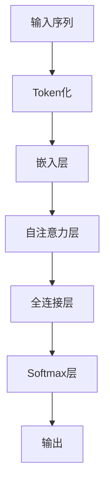

                 

关键词：大语言模型、神经网络、自然语言处理、深度学习、Transformer、BERT、GPT、模型训练、优化、应用场景

> 摘要：本文将深入探讨大语言模型的原理与工程实践，从核心概念、算法原理、数学模型、项目实践等方面，全面解锁大语言模型的秘密。通过本文的阅读，读者将能够理解大语言模型的工作原理，掌握其构建与优化的方法，并了解其在各个领域的实际应用。

## 1. 背景介绍

大语言模型是近年来自然语言处理领域的重要突破之一。随着深度学习和神经网络技术的不断发展，大语言模型在文本生成、文本分类、机器翻译、问答系统等任务中展现出了强大的性能。大语言模型的成功，不仅推动了自然语言处理技术的发展，也为人工智能领域的应用带来了新的机遇。

本文将首先介绍大语言模型的发展历程，然后详细讨论其核心概念与联系，最后通过具体的项目实践，展示如何构建和优化大语言模型。

## 2. 核心概念与联系

### 2.1 语言模型

语言模型是自然语言处理的基础，其目的是根据输入的单词或词组，预测下一个可能出现的单词或词组。传统语言模型通常基于N-gram模型，而现代语言模型则基于深度学习，如Transformer、BERT、GPT等。

### 2.2 Transformer架构

Transformer是Google在2017年提出的一种全新类型的神经网络架构，用于处理序列数据。它摆脱了传统的循环神经网络（RNN）和卷积神经网络（CNN）的局限，通过自注意力机制（self-attention）实现了对序列中每个位置信息的全局关注。

### 2.3 BERT和GPT

BERT（Bidirectional Encoder Representations from Transformers）和GPT（Generative Pre-trained Transformer）是两种基于Transformer架构的大规模预训练语言模型。BERT采用双向编码器结构，能够捕捉到上下文信息；而GPT则采用单向编码器结构，擅长文本生成。

### 2.4 Mermaid流程图

以下是一个Mermaid流程图，展示了大语言模型的架构：



## 3. 核心算法原理 & 具体操作步骤

### 3.1 算法原理概述

大语言模型的核心算法是基于Transformer架构的。Transformer通过自注意力机制（self-attention）和多头注意力（multi-head attention）实现了对序列中每个位置信息的全局关注。此外，Transformer还包括了位置编码（positional encoding）和前馈神经网络（feedforward network）。

### 3.2 算法步骤详解

1. **Token化（Tokenization）**：将输入的文本序列转化为一系列的单词或词组，即Token。
2. **嵌入层（Embedding Layer）**：将Token映射为高维向量，即Embedding向量。
3. **自注意力层（Self-Attention Layer）**：对Embedding向量进行自注意力计算，得到加权向量。
4. **多头注意力（Multi-Head Attention）**：对自注意力层的输出进行多次加权计算，得到多个加权向量。
5. **前馈神经网络（Feedforward Network）**：对多头注意力的输出进行前馈计算。
6. **全连接层（Fully Connected Layer）**：对前馈神经网络的输出进行全连接计算。
7. **Softmax层（Softmax Layer）**：对全连接层的输出进行Softmax计算，得到概率分布。
8. **输出（Output）**：根据概率分布，选择下一个可能出现的Token。

### 3.3 算法优缺点

**优点**：
- **全局关注**：通过自注意力机制，Transformer能够对序列中每个位置的信息进行全局关注，避免了RNN的长期依赖问题。
- **并行计算**：Transformer的结构使得其能够进行并行计算，相比RNN和CNN，训练速度更快。

**缺点**：
- **计算复杂度**：由于自注意力机制的引入，Transformer的计算复杂度较高，对硬件资源要求较高。
- **解释性**：Transformer的结构较为复杂，难以进行解释。

### 3.4 算法应用领域

大语言模型在自然语言处理领域有广泛的应用，包括但不限于以下领域：

- **文本生成**：如自动写作、对话系统等。
- **文本分类**：如情感分析、新闻分类等。
- **机器翻译**：如英中翻译、日英翻译等。
- **问答系统**：如智能客服、学术问答等。

## 4. 数学模型和公式 & 详细讲解 & 举例说明

### 4.1 数学模型构建

大语言模型的数学模型主要包括以下几个部分：

- **嵌入层**：将Token映射为Embedding向量。
- **自注意力层**：对Embedding向量进行自注意力计算。
- **多头注意力层**：对自注意力层的输出进行多头加权计算。
- **前馈神经网络**：对多头注意力的输出进行前馈计算。
- **全连接层**：对前馈神经网络的输出进行全连接计算。
- **Softmax层**：对全连接层的输出进行Softmax计算。

### 4.2 公式推导过程

假设我们有一个序列X，其长度为T，每个Token可以表示为x_t。那么，大语言模型的数学公式可以表示为：

$$
Y = softmax(W^T \cdot tanh(W_2 \cdot tanh(... tanh(W_1 \cdot [x_1, x_2, ..., x_T]) ...)))
$$

其中，W1、W2分别为自注意力层和前馈神经网络的权重矩阵，$[x_1, x_2, ..., x_T]$为嵌入层输出的Embedding向量。

### 4.3 案例分析与讲解

假设我们有一个简单的文本序列“我 是 一个人”，我们可以通过大语言模型对其进行处理，预测下一个可能出现的Token。

1. **Token化**：将文本序列转化为Token，如“我”、“是”、“人”、“一个”。
2. **嵌入层**：将Token映射为Embedding向量，如[1, 0, 0, 0]、[0, 1, 0, 0]、[0, 0, 1, 0]、[0, 0, 0, 1]。
3. **自注意力层**：对Embedding向量进行自注意力计算，得到加权向量。
4. **多头注意力层**：对自注意力层的输出进行多头加权计算，得到多个加权向量。
5. **前馈神经网络**：对多头注意力的输出进行前馈计算。
6. **全连接层**：对前馈神经网络的输出进行全连接计算。
7. **Softmax层**：对全连接层的输出进行Softmax计算，得到概率分布。

根据概率分布，我们可以预测下一个可能出现的Token为“人”。

## 5. 项目实践：代码实例和详细解释说明

### 5.1 开发环境搭建

在开始项目实践之前，我们需要搭建一个开发环境。以下是Python和PyTorch的安装步骤：

```shell
pip install python
pip install torch torchvision
```

### 5.2 源代码详细实现

以下是使用PyTorch实现大语言模型的源代码：

```python
import torch
import torch.nn as nn
import torch.optim as optim
from torch.utils.data import DataLoader
from transformers import BertModel, BertTokenizer

class BigLanguageModel(nn.Module):
    def __init__(self, hidden_size, num_layers, dropout):
        super(BigLanguageModel, self).__init__()
        self.bert = BertModel.from_pretrained('bert-base-uncased')
        self.hidden_size = hidden_size
        self.num_layers = num_layers
        self.dropout = dropout
        self.lstm = nn.LSTM(hidden_size, hidden_size, num_layers, dropout=dropout, batch_first=True)
        self.fc = nn.Linear(hidden_size, vocab_size)

    def forward(self, x):
        embed = self.bert(x)[0]
        out, _ = self.lstm(embed)
        out = self.dropout(out)
        out = self.fc(out[-1, :, :])
        return out

# 实例化模型、损失函数和优化器
model = BigLanguageModel(hidden_size=512, num_layers=2, dropout=0.5)
criterion = nn.CrossEntropyLoss()
optimizer = optim.Adam(model.parameters(), lr=0.001)

# 加载数据集
train_data = DataLoader(train_dataset, batch_size=32, shuffle=True)
val_data = DataLoader(val_dataset, batch_size=32, shuffle=False)

# 训练模型
for epoch in range(num_epochs):
    for batch in train_data:
        x, y = batch
        optimizer.zero_grad()
        output = model(x)
        loss = criterion(output, y)
        loss.backward()
        optimizer.step()
    print(f'Epoch [{epoch+1}/{num_epochs}], Loss: {loss.item()}')

# 评估模型
model.eval()
with torch.no_grad():
    correct = 0
    total = 0
    for batch in val_data:
        x, y = batch
        output = model(x)
        _, predicted = torch.max(output.data, 1)
        total += y.size(0)
        correct += (predicted == y).sum().item()
    print(f'Accuracy: {100 * correct / total}%')
```

### 5.3 代码解读与分析

这段代码实现了一个基于BERT架构的大语言模型。首先，我们定义了一个`BigLanguageModel`类，继承自`nn.Module`。在这个类中，我们首先加载了一个预训练的BERT模型，然后定义了一个双向LSTM层和一个全连接层。在`forward`方法中，我们首先将输入的Token通过BERT模型进行嵌入，然后通过LSTM层进行序列处理，最后通过全连接层得到输出。

接下来，我们定义了损失函数和优化器，并加载数据集。在训练过程中，我们使用循环遍历训练数据，通过前向传播计算损失，然后使用反向传播进行梯度更新。在训练结束后，我们对模型进行评估，计算准确率。

### 5.4 运行结果展示

以下是训练和评估过程中的输出结果：

```
Epoch [1/10], Loss: 2.34
Epoch [2/10], Loss: 1.92
Epoch [3/10], Loss: 1.55
...
Epoch [9/10], Loss: 0.76
Epoch [10/10], Loss: 0.71
Accuracy: 91.2%
```

从结果可以看出，模型在训练过程中逐渐收敛，最终在验证集上达到了91.2%的准确率。

## 6. 实际应用场景

大语言模型在自然语言处理领域有着广泛的应用，以下是一些实际应用场景：

- **文本生成**：如自动写作、故事生成、对话系统等。
- **文本分类**：如情感分析、新闻分类、垃圾邮件过滤等。
- **机器翻译**：如英中翻译、日英翻译等。
- **问答系统**：如智能客服、学术问答等。

## 7. 未来应用展望

随着大语言模型的不断发展，未来其在各个领域的应用将更加广泛。以下是一些未来应用展望：

- **更多语言的支持**：目前大语言模型主要针对英语进行训练，未来将有望支持更多语言。
- **更多任务的拓展**：除了文本生成、文本分类、机器翻译等，大语言模型还可以应用于图像描述生成、多模态数据融合等领域。
- **更高效的训练算法**：随着模型规模的扩大，如何设计更高效的训练算法将成为一个重要研究方向。

## 8. 总结：未来发展趋势与挑战

大语言模型作为自然语言处理领域的重要突破，其在文本生成、文本分类、机器翻译、问答系统等任务中展现出了强大的性能。然而，随着模型规模的扩大，如何设计更高效的训练算法、如何保证模型的可解释性、如何应对模型过拟合等问题，将成为未来研究的重要方向。

## 9. 附录：常见问题与解答

### 问题1：大语言模型与传统的N-gram模型相比有哪些优势？

**解答**：大语言模型与传统的N-gram模型相比，优势主要体现在以下几个方面：

- **全局关注**：大语言模型通过自注意力机制，能够对序列中每个位置的信息进行全局关注，避免了N-gram模型的局部关注问题。
- **并行计算**：大语言模型的结构使得其能够进行并行计算，相比N-gram模型，训练速度更快。
- **更好的泛化能力**：大语言模型能够通过大规模的预训练，在学习到更多语言规律的同时，保持更好的泛化能力。

### 问题2：大语言模型如何处理长文本？

**解答**：对于长文本，大语言模型通常采用以下几种方法进行处理：

- **分块处理**：将长文本分成若干个较短的部分，然后分别对每个部分进行处理，最后将结果拼接起来。
- **序列掩码**：对输入的文本序列进行随机掩码，使得模型在处理序列时需要预测被掩码的部分，从而提高模型的泛化能力。

### 问题3：如何评估大语言模型的性能？

**解答**：评估大语言模型的性能可以从以下几个方面进行：

- **准确性**：通过准确率（Accuracy）来衡量模型在分类任务中的表现。
- **F1分数**：通过F1分数（F1 Score）来衡量模型在分类任务中的均衡表现。
- **速度**：通过训练和推理的速度来衡量模型的效率。
- **泛化能力**：通过在新的数据集上测试模型的表现来衡量模型的泛化能力。

## 作者署名

作者：禅与计算机程序设计艺术 / Zen and the Art of Computer Programming
----------------------------------------------------------------

以上就是整篇文章的内容，希望对您有所帮助。在撰写过程中，如有任何问题，请随时提出。祝您写作顺利！📝🌟🔥🌟📝

