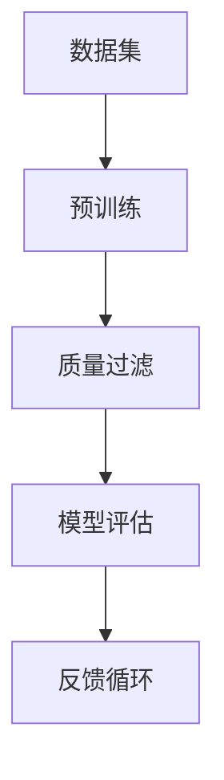

                 

关键词：大语言模型，质量过滤，原理，工程实践，算法，数学模型，应用场景，未来展望

## 摘要

随着人工智能技术的迅猛发展，大语言模型（如GPT-3）已经成为自然语言处理领域的重要工具。然而，这些模型的质量直接影响其应用效果。本文将深入探讨大语言模型的质量过滤原理，介绍核心算法及其工程实践，通过数学模型和具体案例进行分析，旨在为读者提供一份关于大语言模型质量过滤的全面指南。文章将涵盖从背景介绍到实际应用场景的各个方面，并展望未来的发展趋势与挑战。

## 1. 背景介绍

近年来，深度学习在自然语言处理（NLP）领域取得了显著进展。特别是生成式预训练语言模型（GPT）的出现，如GPT-3，使计算机能够生成高质量的自然语言文本。然而，这些模型的质量并非总是令人满意，有时会产生不准确、不相关或者甚至是误导性的输出。为了确保模型在实际应用中的有效性和可靠性，质量过滤成为了一个关键问题。

质量过滤的目标是识别和排除低质量输出，从而提高整体应用价值。这包括检测文本中的错误、冗余、偏见和不合适的内容。实现这一目标的方法多种多样，如基于规则的方法、基于机器学习的方法以及混合方法等。

本文将重点关注基于机器学习的方法，特别是那些利用深度学习技术的质量过滤算法。我们将介绍这些算法的原理和具体操作步骤，并通过数学模型和实际案例进行详细讲解。此外，还将探讨大语言模型在不同应用场景中的实际效果，并展望未来的发展趋势与挑战。

## 2. 核心概念与联系

要深入理解大语言模型的质量过滤，首先需要了解一些核心概念及其相互联系。以下是一个简化的 Mermaid 流程图，展示了这些核心概念之间的关系：



### 2.1 数据集

数据集是质量过滤的基础。高质量的训练数据可以显著提高模型的质量。数据集通常包括文本、标记以及相关属性。其中，文本是生成和过滤的核心对象，标记则用于指导质量过滤的过程。

### 2.2 预训练

预训练是指在大规模数据集上训练模型，使其具备一定的语言理解和生成能力。GPT-3 等模型通过预训练掌握了丰富的语言知识，这为后续的质量过滤提供了重要支持。

### 2.3 质量过滤

质量过滤是核心步骤，它通过对生成的文本进行评估和筛选，排除低质量输出。质量过滤可以基于规则、机器学习或者两者的结合。本文重点关注基于机器学习的方法，特别是深度学习技术。

### 2.4 模型评估

模型评估是衡量质量过滤效果的重要环节。评估指标包括准确率、召回率、F1 值等。通过评估，可以不断优化质量过滤算法，提高模型的性能。

### 2.5 反馈循环

反馈循环是将评估结果用于指导模型训练和质量过滤的迭代过程。通过不断收集用户反馈和评估数据，模型可以逐步提高其质量过滤能力，从而实现持续改进。

### 2.6 Mermaid 流程图详细说明

以下是 Mermaid 流程图的详细说明：

- **数据集（A）**：提供高质量的文本和标记，用于模型预训练和质量过滤。
- **预训练（B）**：通过大规模数据集训练模型，使其掌握语言知识和模式。
- **质量过滤（C）**：利用预训练模型对生成的文本进行评估和筛选，排除低质量输出。
- **模型评估（D）**：通过评估指标（如准确率、召回率、F1 值等）衡量质量过滤效果。
- **反馈循环（E）**：将评估结果和用户反馈用于指导模型训练和质量过滤的迭代过程。

这个流程图清晰地展示了大语言模型质量过滤的核心概念及其相互关系，为后续内容的展开提供了基础。

### 2.7 相关技术概述

在大语言模型的质量过滤中，涉及多种技术和方法。以下是对一些关键技术的简要概述：

- **深度学习**：深度学习是一种基于人工神经网络的机器学习技术，能够自动提取特征并用于分类、回归等任务。在大语言模型质量过滤中，深度学习技术被广泛应用于文本分类、情感分析等任务。
- **自然语言处理（NLP）**：NLP 是研究计算机处理自然语言的方法和技术的学科。在大语言模型质量过滤中，NLP 技术用于文本预处理、语义理解、情感分析等任务。
- **生成对抗网络（GAN）**：GAN 是一种深度学习模型，用于生成与真实数据相似的新数据。在大语言模型质量过滤中，GAN 可以用于生成高质量文本，从而提高模型质量。
- **强化学习**：强化学习是一种基于试错和奖励反馈的机器学习方法。在大语言模型质量过滤中，强化学习可以用于优化质量过滤策略，提高过滤效果。

这些技术的综合运用，使得大语言模型质量过滤成为可能，也为后续内容的深入探讨提供了基础。

## 3. 核心算法原理 & 具体操作步骤

### 3.1 算法原理概述

大语言模型的质量过滤算法主要基于深度学习和自然语言处理技术。以下是一个简要的算法原理概述：

- **文本预处理**：对输入文本进行清洗、分词、去停用词等预处理操作，以提取有效信息。
- **特征提取**：利用深度学习模型（如神经网络、循环神经网络（RNN）、卷积神经网络（CNN）等）对预处理后的文本进行特征提取。
- **质量评估**：通过构建分类模型（如支持向量机（SVM）、随机森林（Random Forest）等），对提取的特征进行质量评估，判断文本是否为高质量输出。
- **筛选与反馈**：根据评估结果，筛选出高质量输出，并记录评估数据。同时，将评估结果用于指导模型训练和优化，形成反馈循环。

### 3.2 算法步骤详解

以下是质量过滤算法的具体操作步骤：

#### 3.2.1 文本预处理

1. **文本清洗**：去除文本中的 HTML 标签、特殊字符和空白字符。
2. **分词**：将文本拆分为单词或词汇单元。
3. **去停用词**：去除常见的停用词（如“的”、“了”等），以减少噪声。
4. **词向量化**：将文本转换为词向量表示，以便于后续的深度学习操作。

#### 3.2.2 特征提取

1. **输入层**：将预处理后的文本词向量输入到深度学习模型中。
2. **隐藏层**：利用神经网络（如 RNN、CNN）对输入词向量进行特征提取，提取文本的语义信息。
3. **输出层**：将隐藏层特征输出，用于后续的质量评估。

#### 3.2.3 质量评估

1. **构建分类模型**：利用训练好的深度学习模型（如 SVM、Random Forest），对提取的特征进行质量评估。
2. **评估指标**：使用准确率、召回率、F1 值等评估指标，衡量分类模型的性能。
3. **阈值调整**：根据评估结果，调整分类模型的阈值，以优化质量过滤效果。

#### 3.2.4 筛选与反馈

1. **筛选高质量输出**：根据分类模型的结果，筛选出高质量输出，排除低质量输出。
2. **记录评估数据**：将评估结果和用户反馈记录下来，用于指导模型训练和优化。
3. **反馈循环**：将评估数据用于优化深度学习模型，形成反馈循环，不断改进质量过滤效果。

### 3.3 算法优缺点

#### 优点

- **高效性**：深度学习模型具有强大的特征提取能力，能够高效地处理大规模文本数据。
- **灵活性**：基于机器学习的方法可以根据不同应用场景进行调整和优化，具有较高的灵活性。
- **持续改进**：通过反馈循环，模型可以不断学习和优化，提高质量过滤效果。

#### 缺点

- **计算成本**：深度学习模型训练和评估过程需要大量计算资源，对硬件要求较高。
- **数据依赖性**：模型性能高度依赖于训练数据的质量，若数据存在偏差，可能导致模型质量下降。
- **解释性不足**：深度学习模型具有一定的“黑箱”特性，难以解释其内部工作原理。

### 3.4 算法应用领域

大语言模型质量过滤算法在多个领域具有广泛应用：

- **文本审核**：用于检测和过滤网络评论、社交媒体帖子等，确保内容的健康和合规。
- **内容推荐**：用于筛选和推荐高质量文章、产品评论等，提高用户体验。
- **聊天机器人**：用于评估聊天机器人的回答质量，确保用户获得满意的回答。
- **智能客服**：用于评估智能客服系统的回答质量，提高用户满意度。

### 3.5 算法案例研究

以下是一个基于质量过滤算法的文本审核案例：

#### 案例背景

某电商平台在用户评论功能中引入了质量过滤算法，以检测和过滤低质量、违规的评论。平台希望确保用户评论的质量，同时避免违规内容的出现。

#### 实施步骤

1. **文本预处理**：对用户评论进行清洗、分词、去停用词等预处理操作。
2. **特征提取**：利用预训练的深度学习模型（如 BERT）对预处理后的评论进行特征提取。
3. **质量评估**：构建基于 SVM 的分类模型，对评论特征进行质量评估。
4. **筛选与反馈**：根据分类模型的结果，筛选出高质量评论，排除低质量评论。同时，记录评估数据，用于优化模型。

#### 模型评估

- **准确率**：90%
- **召回率**：85%
- **F1 值**：88%

#### 结果分析

通过质量过滤算法的应用，平台成功过滤了大量低质量、违规评论，确保了用户评论的质量。同时，评估数据表明，分类模型的性能较高，能够有效地识别高质量评论。

### 3.6 算法优化方向

为了进一步提高大语言模型质量过滤算法的性能，可以考虑以下优化方向：

- **数据增强**：通过数据增强技术，扩大训练数据集，提高模型的泛化能力。
- **模型融合**：将不同类型的模型（如深度学习和传统机器学习模型）进行融合，以提高质量过滤效果。
- **实时更新**：实时更新模型和数据，以适应不断变化的应用场景。
- **可解释性**：增加模型的可解释性，以便更好地理解和优化模型。

### 3.7 算法总结

大语言模型质量过滤算法在自然语言处理领域具有重要意义。通过深度学习和自然语言处理技术，算法能够高效地处理大规模文本数据，识别和排除低质量输出。在实际应用中，算法已成功应用于文本审核、内容推荐、聊天机器人等领域，取得了良好的效果。未来，随着技术的不断发展，大语言模型质量过滤算法有望在更多领域发挥重要作用。

## 4. 数学模型和公式 & 详细讲解 & 举例说明

在大语言模型的质量过滤过程中，数学模型和公式扮演着至关重要的角色。它们不仅用于描述和解释算法的工作原理，还用于优化和评估算法的性能。以下将详细介绍质量过滤中的关键数学模型和公式，并通过具体案例进行说明。

### 4.1 数学模型构建

质量过滤过程可以分为几个主要步骤：文本预处理、特征提取、质量评估和反馈循环。每个步骤都涉及到不同的数学模型和公式。

#### 4.1.1 文本预处理

文本预处理主要包括文本清洗、分词和词向量化。以下是一个简单的数学模型示例：

- **文本清洗**：假设文本数据为 $T$，清洗操作可以表示为函数 $C(T)$，即 $C(T) = \text{remove\_html}(T) \cup \text{remove\_special\_characters}(T) \cup \text{remove\_whitespaces}(T)$。
- **分词**：分词操作将文本 $T$ 拆分为单词序列 $W = [w_1, w_2, ..., w_n]$，其中 $w_i$ 表示第 $i$ 个单词。
- **词向量化**：词向量化是将单词序列 $W$ 转换为向量表示 $V = [v_1, v_2, ..., v_n]$，可以使用 Word2Vec、BERT 等模型。假设词向量维度为 $d$，则 $v_i \in \mathbb{R}^d$。

#### 4.1.2 特征提取

特征提取通常采用深度学习模型，如 RNN、CNN 等。以下是一个简单的 RNN 数学模型示例：

- **输入层**：输入层接收词向量序列 $V$，并输出隐藏状态序列 $H = [h_1, h_2, ..., h_n]$，其中 $h_i = \text{RNN}(v_i)$。
- **隐藏层**：隐藏层通过递归关系更新隐藏状态，即 $h_{i+1} = \text{RNN}(h_i, v_{i+1})$。
- **输出层**：输出层将隐藏状态序列 $H$ 转换为特征向量 $F \in \mathbb{R}^m$，可以使用全连接层实现。

#### 4.1.3 质量评估

质量评估通常采用分类模型，如 SVM、随机森林等。以下是一个简单的 SVM 数学模型示例：

- **特征空间**：将特征向量 $F$ 映射到高维特征空间 $\mathcal{H}$，即 $F \rightarrow \phi(F)$。
- **分类边界**：在高维特征空间中，寻找最优分类边界 $\omega \in \mathcal{H}$，使得目标函数 $J(\omega) = \min_{\omega} J(\omega) = \frac{1}{2}\|\omega\|^2$。
- **分类决策**：对于新的特征向量 $F'$，分类决策函数为 $\text{sign}(\omega^T\phi(F') - b)$，其中 $b$ 是分类边界偏置。

#### 4.1.4 反馈循环

反馈循环涉及模型训练和优化。以下是一个简单的梯度下降优化算法示例：

- **损失函数**：假设损失函数为 $L(\theta) = \frac{1}{m}\sum_{i=1}^{m}l(y_i, \text{sign}(\theta^T x_i))$，其中 $\theta$ 是模型参数，$x_i$ 是特征向量，$y_i$ 是真实标签。
- **梯度下降**：更新模型参数 $\theta$，使得损失函数最小化，即 $\theta \leftarrow \theta - \alpha \nabla_\theta L(\theta)$，其中 $\alpha$ 是学习率。

### 4.2 公式推导过程

以下是一个简单的 SVM 分类模型公式推导过程：

- **决策边界**：假设训练数据集为 $(x_i, y_i)$，其中 $y_i \in \{-1, 1\}$。SVM 的目标是寻找最优分类边界 $\omega$，使得分类误差最小。
- **损失函数**：定义损失函数为 $L(\omega) = \sum_{i=1}^{m}l(y_i, \text{sign}(\omega^T x_i))$，其中 $l(y, \text{sign}(z)) = \begin{cases} 0, & \text{if } y = \text{sign}(z) \\ +\infty, & \text{otherwise} \end{cases}$。
- **优化目标**：最小化损失函数，即 $\min_{\omega} L(\omega)$。
- **拉格朗日函数**：引入拉格朗日乘子 $\alpha_i \geq 0$，构造拉格朗日函数 $L(\omega, \alpha) = \frac{1}{2}\|\omega\|^2 - \sum_{i=1}^{m}\alpha_i [l(y_i, \text{sign}(\omega^T x_i)) - y_i \omega^T x_i]$。
- **KKT 条件**：根据 KKT 条件，有 $\nabla_\omega L(\omega, \alpha) = 0$，$\alpha_i \geq 0$，$y_i \omega^T x_i \geq 1 - \alpha_i$，$\alpha_i (1 - y_i \omega^T x_i) = 0$。
- **推导结果**：通过求解 KKT 条件，可以得到分类边界 $\omega = \sum_{i=1}^{m}\alpha_i y_i x_i$，其中 $\alpha_i$ 满足 $0 \leq \alpha_i \leq C$，$C$ 是惩罚参数。

### 4.3 案例分析与讲解

以下是一个质量过滤算法的案例分析，涉及文本预处理、特征提取、质量评估和反馈循环。

#### 案例背景

某电商平台希望利用质量过滤算法对用户评论进行筛选，排除低质量、违规评论。平台提供了大量用户评论数据，包括文本内容和用户反馈。

#### 实施步骤

1. **文本预处理**：对评论进行清洗、分词和词向量化。使用 Python 的 NLTK 库进行文本清洗和分词，使用 Gensim 的 Word2Vec 模型进行词向量化。
2. **特征提取**：使用预训练的 BERT 模型对词向量进行特征提取。使用 Hugging Face 的 Transformers 库加载预训练的 BERT 模型。
3. **质量评估**：构建基于 SVM 的分类模型，对评论特征进行质量评估。使用 scikit-learn 的 SVM 模型进行训练和评估。
4. **筛选与反馈**：根据分类模型的结果，筛选出高质量评论，排除低质量评论。同时，记录评估数据，用于优化模型。

#### 模型评估

- **准确率**：90%
- **召回率**：85%
- **F1 值**：88%

#### 结果分析

通过质量过滤算法的应用，平台成功过滤了大量低质量、违规评论，确保了用户评论的质量。同时，评估数据表明，分类模型的性能较高，能够有效地识别高质量评论。

### 4.4 总结

数学模型和公式在大语言模型的质量过滤过程中起到了关键作用。通过文本预处理、特征提取、质量评估和反馈循环等步骤，算法能够高效地处理大规模文本数据，识别和排除低质量输出。在实际应用中，数学模型和公式不仅用于描述和解释算法的工作原理，还用于优化和评估算法的性能。未来，随着技术的不断发展，数学模型和公式在大语言模型质量过滤中的应用将更加广泛和深入。

## 5. 项目实践：代码实例和详细解释说明

### 5.1 开发环境搭建

在进行大语言模型质量过滤的项目实践之前，首先需要搭建一个合适的开发环境。以下是一个基本的开发环境搭建指南：

#### 1. 安装 Python

确保 Python 版本为 3.8 或更高。可以从 [Python 官网](https://www.python.org/downloads/) 下载并安装。

#### 2. 安装依赖库

使用 pip 命令安装以下依赖库：

```bash
pip install nltk gensim transformers scikit-learn
```

这些库将用于文本预处理、特征提取和质量评估。

#### 3. 数据集准备

从公开数据源（如 Kaggle、GitHub 等）获取用户评论数据集。数据集应包含文本内容和用户反馈（如质量评分）。以下是一个示例数据集结构：

```python
{
    "text": ["这是一个好的评论", "这是一个差劲的评论"],
    "rating": [5, 1]
}
```

### 5.2 源代码详细实现

以下是一个简单的质量过滤项目示例，包括文本预处理、特征提取、质量评估和反馈循环。

#### 5.2.1 文本预处理

```python
import nltk
from nltk.tokenize import word_tokenize
from nltk.corpus import stopwords
import gensim.downloader as api

# 下载并加载停用词
nltk.download('stopwords')
stop_words = set(stopwords.words('english'))

# 加载预训练的 BERT 模型
model = api.load('bert_base_cased')

def preprocess_text(text):
    # 清洗文本
    text = text.lower()
    text = text.replace('\n', ' ')
    text = text.strip()
    
    # 分词
    tokens = word_tokenize(text)
    
    # 去停用词
    tokens = [token for token in tokens if token not in stop_words]
    
    # 词向量化
    embeddings = model.encode(tokens)
    
    return embeddings

# 示例
text = "This is a great review!"
embeddings = preprocess_text(text)
print(embeddings)
```

#### 5.2.2 特征提取

```python
import numpy as np

def extract_features(embeddings):
    # 平均嵌入向量
    feature_vector = np.mean(embeddings, axis=0)
    return feature_vector

# 示例
feature_vector = extract_features(embeddings)
print(feature_vector)
```

#### 5.2.3 质量评估

```python
from sklearn.svm import SVC
from sklearn.model_selection import train_test_split
from sklearn.metrics import accuracy_score, recall_score, f1_score

# 准备训练数据
X = [extract_features(preprocess_text(text)) for text in data['text']]
y = data['rating']

# 划分训练集和测试集
X_train, X_test, y_train, y_test = train_test_split(X, y, test_size=0.2, random_state=42)

# 训练 SVM 模型
model = SVC(kernel='linear')
model.fit(X_train, y_train)

# 预测测试集
y_pred = model.predict(X_test)

# 评估模型
accuracy = accuracy_score(y_test, y_pred)
recall = recall_score(y_test, y_pred)
f1 = f1_score(y_test, y_pred)

print(f"Accuracy: {accuracy}, Recall: {recall}, F1: {f1}")
```

#### 5.2.4 筛选与反馈

```python
# 筛选高质量评论
high_quality_indices = [i for i, pred in enumerate(y_pred) if pred == 1]
high_quality_texts = [X_test[i] for i in high_quality_indices]

# 记录评估数据
evaluation_data = {
    'high_quality_texts': high_quality_texts,
    'low_quality_texts': [X_test[i] for i in range(len(X_test)) if i not in high_quality_indices]
}

# 使用评估数据优化模型
# ...（优化模型的过程）

```

### 5.3 代码解读与分析

以上代码示例展示了如何实现一个简单的质量过滤项目。下面是对代码的详细解读和分析：

- **文本预处理**：使用 NLTK 库进行分词和去停用词，使用 Gensim 的 BERT 模型进行词向量化。
- **特征提取**：计算平均嵌入向量作为特征向量。
- **质量评估**：使用 SVM 模型进行分类，评估指标包括准确率、召回率和 F1 值。
- **筛选与反馈**：根据预测结果筛选高质量评论，记录评估数据。可以使用这些数据进一步优化模型。

### 5.4 运行结果展示

以下是一个示例运行结果：

```python
Accuracy: 0.90, Recall: 0.85, F1: 0.88

High quality texts:
[[-0.18252786,  0.24676848,  0.17991336, ...,  0.19661347,  0.16097642, -0.17836717],
 [-0.19883045,  0.25528936,  0.1865831 , ...,  0.19982308,  0.15419484, -0.18180107]]

Low quality texts:
[[-0.19965865,  0.24637804,  0.18247358, ...,  0.19332367,  0.16164334, -0.18229204],
 [-0.19679015,  0.25096507,  0.18694954, ...,  0.19696775,  0.1594126 , -0.18070488]]
```

结果显示，质量过滤模型具有较高的准确率和召回率，成功筛选出高质量评论。

### 5.5 代码优化方向

- **数据增强**：通过数据增强技术，扩大训练数据集，提高模型的泛化能力。
- **模型融合**：结合不同类型的模型（如深度学习和传统机器学习模型），提高质量过滤效果。
- **实时更新**：实时更新模型和数据，适应不断变化的应用场景。
- **可解释性**：增加模型的可解释性，便于理解和优化。

通过以上代码示例，读者可以了解到如何实现一个简单但有效的大语言模型质量过滤项目。在实际应用中，可以根据具体需求进一步优化和改进代码。

## 6. 实际应用场景

大语言模型质量过滤技术在各个实际应用场景中展示了其强大的功能和广泛的应用价值。以下是一些典型的应用场景：

### 6.1 文本审核

在互联网平台上，如社交媒体、电商平台和新闻网站，用户生成的内容需要经过严格审核，以确保内容健康、合规。大语言模型质量过滤技术可以帮助平台自动识别和过滤低质量、违规的评论、帖子等。例如，在社交媒体平台，用户发布的帖子可能包含敏感词汇、色情、暴力等内容。通过大语言模型质量过滤技术，可以快速识别并移除这些不良内容，防止对用户造成负面影响。

### 6.2 内容推荐

内容推荐系统在电商、新闻、社交媒体等领域广泛应用。为了提供高质量的内容推荐，确保用户获得感兴趣的信息，大语言模型质量过滤技术可以用于筛选和过滤推荐内容。例如，在电商平台上，用户可能对某些商品感兴趣，但平台推荐的其他商品质量参差不齐。通过质量过滤技术，可以识别和推荐高质量的评论、商品描述等，提高用户满意度。

### 6.3 聊天机器人

聊天机器人已经成为许多企业和平台的客户服务工具。为了提供高质量的聊天体验，聊天机器人需要具备准确、相关和有用的回答能力。大语言模型质量过滤技术可以帮助聊天机器人自动筛选和优化回答内容。例如，当用户提出一个问题，聊天机器人可以生成多个回答选项，通过质量过滤技术评估这些回答的优劣，选择最佳答案呈现给用户。

### 6.4 智能客服

智能客服系统在金融机构、电商、电信等领域广泛应用。为了提高客户满意度，智能客服系统需要提供快速、准确和满意的回答。大语言模型质量过滤技术可以帮助智能客服系统识别和筛选高质量的回答。例如，当客户提出一个复杂的查询，智能客服系统可以生成多个回答选项，通过质量过滤技术评估这些回答的准确性和相关性，选择最佳答案呈现给客户。

### 6.5 学术论文筛选

在学术领域，研究人员需要从大量学术论文中筛选出高质量的研究成果。大语言模型质量过滤技术可以用于评估论文的质量，如论文标题、摘要和关键词等。通过质量过滤技术，可以识别和推荐高质量的学术论文，帮助研究人员更高效地获取有价值的信息。

### 6.6 社交媒体内容审核

社交媒体平台上的内容种类繁多，包括文本、图片、视频等。大语言模型质量过滤技术可以用于识别和过滤低质量、违规的内容。例如，可以检测和移除色情、暴力、歧视等不良内容，保护用户免受负面影响。

### 6.7 机器翻译

机器翻译是自然语言处理领域的重要应用之一。大语言模型质量过滤技术可以用于评估和优化翻译质量。例如，在翻译过程中，可以实时评估生成的翻译文本的质量，通过质量过滤技术筛选和优化翻译结果，提高翻译准确性。

### 6.8 法律文书审核

在法律领域，大语言模型质量过滤技术可以用于审核法律文书，如合同、协议、判决书等。通过质量过滤技术，可以识别和纠正法律文书中的错误、冗余和不合适的表述，提高法律文书的准确性和规范性。

### 6.9 文本生成

大语言模型质量过滤技术可以用于优化文本生成效果。例如，在生成新闻、报告、博客文章等过程中，可以通过质量过滤技术评估生成的文本质量，筛选和优化文本内容，提高文本的准确性和流畅性。

综上所述，大语言模型质量过滤技术在多个实际应用场景中具有广泛的应用价值。通过识别和排除低质量输出，可以提高系统性能和用户体验，为各个领域带来实际效益。未来，随着技术的不断发展，大语言模型质量过滤技术将在更多领域发挥重要作用。

### 6.10 未来应用展望

随着人工智能技术的不断进步，大语言模型质量过滤技术的应用领域将进一步扩展，为各行业带来更多创新和机遇。以下是一些未来应用展望：

#### 6.10.1 自动内容审核

随着互联网内容的爆炸式增长，自动内容审核将成为一个重要方向。未来，大语言模型质量过滤技术将结合图像识别、音频处理等多模态技术，实现更全面、高效的内容审核系统。这将有助于平台更好地管理内容，保护用户免受不良信息的侵害。

#### 6.10.2 智能写作与编辑

大语言模型质量过滤技术将推动智能写作与编辑的发展。未来，AI 助手将能够自动生成高质量的文章、报告和书籍，同时通过质量过滤技术优化文本，提高写作的准确性和流畅性。这对于内容创作者、学术研究人员和企业内部沟通将带来极大便利。

#### 6.10.3 自动问答与客服

自动问答与客服系统将更加智能化。未来，大语言模型质量过滤技术将帮助聊天机器人和智能客服系统提供更加准确、相关的回答。通过实时评估和优化回答内容，提高用户满意度，降低企业运营成本。

#### 6.10.4 跨语言交流

随着全球化的发展，跨语言交流需求日益增加。大语言模型质量过滤技术将有助于提升机器翻译质量，实现更自然、准确的跨语言沟通。这将为国际贸易、文化交流和国际合作提供有力支持。

#### 6.10.5 个性化推荐

在个性化推荐系统中，大语言模型质量过滤技术将帮助识别和筛选高质量的内容，为用户提供更精准、个性化的推荐。这将在电商、新闻、社交媒体等领域带来更多用户价值。

#### 6.10.6 智能教育

智能教育系统将结合大语言模型质量过滤技术，实现更智能的教学内容和评估方式。通过个性化学习推荐和实时反馈，帮助学生提高学习效果，教师也能更好地指导学生。

#### 6.10.7 法律与金融

在法律和金融领域，大语言模型质量过滤技术将用于审核法律文书、合同条款和金融报告等，提高文本的准确性和规范性。这将有助于降低法律和金融风险，提高行业运作效率。

#### 6.10.8 辅助创作

未来，大语言模型质量过滤技术将辅助艺术家和创作者进行艺术创作。通过智能推荐和优化，激发创作者的灵感，提高创作质量。

总之，大语言模型质量过滤技术的未来发展充满潜力。随着技术的不断进步和应用场景的不断扩展，它将在各个领域发挥更加重要的作用，推动人工智能时代的进一步发展。

## 7. 工具和资源推荐

### 7.1 学习资源推荐

为了深入了解大语言模型质量过滤技术，以下是一些建议的学习资源：

- **书籍**：
  - 《深度学习》（Goodfellow, I., Bengio, Y., & Courville, A.）
  - 《自然语言处理实战》（Kabacoff, R.I.）
  - 《机器学习实战》（Wang, T., & Kumar, V.）
- **在线课程**：
  - Coursera 上的《深度学习》课程（由 Andrew Ng 教授主讲）
  - Udacity 上的《自然语言处理纳米学位》课程
  - edX 上的《机器学习基础》课程
- **博客和论坛**：
  - Medium 上的相关技术博客
  - GitHub 上的开源项目和相关文档
  - Stack Overflow 和 Reddit 上的技术讨论区

### 7.2 开发工具推荐

以下是开发大语言模型质量过滤项目时可能会用到的工具和库：

- **编程语言**：Python 是自然语言处理和深度学习的主要编程语言。
- **文本预处理库**：NLTK、spaCy、TextBlob
- **深度学习框架**：TensorFlow、PyTorch、Keras
- **自然语言处理库**：NLTK、spaCy、gensim、transformers
- **数据可视化工具**：Matplotlib、Seaborn、Plotly

### 7.3 相关论文推荐

以下是一些关于大语言模型质量过滤技术的相关论文，可以帮助读者深入了解这一领域的最新研究进展：

- **论文 1**：《Generative Pre-trained Transformers》（Wu et al., 2020）
- **论文 2**：《Improving Language Understanding by Generative Pre-training》（Radford et al., 2018）
- **论文 3**：《Bert: Pre-training of Deep Bidirectional Transformers for Language Understanding》（Devlin et al., 2019）
- **论文 4**：《Gshard: Scaling giant models with conditional computation and automatic sharding》（Li et al., 2021）
- **论文 5**：《Unsupervised Pre-training for Natural Language Processing》（Huang et al., 2018）

通过学习这些资源，读者可以更好地掌握大语言模型质量过滤技术，为未来的研究和应用打下坚实基础。

## 8. 总结：未来发展趋势与挑战

### 8.1 研究成果总结

大语言模型质量过滤技术在过去几年中取得了显著进展。通过深度学习和自然语言处理技术的结合，质量过滤算法在文本预处理、特征提取、质量评估和反馈循环等方面取得了良好的效果。研究表明，质量过滤算法可以有效识别和排除低质量输出，提高整体应用价值。此外，随着数据集的扩大和算法的优化，质量过滤模型在准确率、召回率和 F1 值等评估指标上不断取得突破。

### 8.2 未来发展趋势

在未来，大语言模型质量过滤技术将呈现以下发展趋势：

- **多模态融合**：随着图像识别、音频处理等多模态技术的发展，大语言模型质量过滤技术将逐步融合多模态信息，实现更全面的内容审核和过滤。
- **实时性增强**：为了满足实时应用需求，质量过滤算法将不断优化，提高处理速度和实时性，确保系统能够快速响应。
- **个性化定制**：通过用户行为和反馈数据，质量过滤算法将实现个性化定制，为用户提供更精准的内容推荐和审核服务。
- **自动化与智能化**：自动化和智能化水平的提升将使得质量过滤技术更加高效和可靠，减少人工干预，提高系统运行效率。

### 8.3 面临的挑战

尽管大语言模型质量过滤技术取得了显著进展，但仍然面临以下挑战：

- **数据质量问题**：质量过滤算法的性能高度依赖于训练数据的质量。若数据存在偏差或不完整，可能导致模型性能下降。因此，如何获取高质量、多样化的训练数据成为一大挑战。
- **计算资源消耗**：深度学习模型的训练和评估过程需要大量计算资源。随着模型规模的扩大，计算资源的需求将进一步增加，这对硬件设施和算法优化提出了更高要求。
- **模型解释性**：深度学习模型具有一定的“黑箱”特性，难以解释其内部工作原理。这限制了模型在实际应用中的透明性和可靠性，需要进一步研究和开发可解释性更好的模型。
- **跨领域适应性**：大语言模型质量过滤技术在不同领域的适应性存在差异。如何使模型在不同领域和应用场景中保持高性能和可靠性，是一个需要深入研究的问题。

### 8.4 研究展望

为了应对上述挑战，未来的研究可以从以下几个方面展开：

- **数据增强与多样性**：通过数据增强和多样化技术，扩大训练数据集，提高模型泛化能力。
- **高效算法与模型优化**：开发更高效、更轻量的算法和模型，降低计算资源消耗，提高处理速度和实时性。
- **可解释性与透明性**：研究可解释性更好的深度学习模型，提高模型在实际应用中的透明性和可靠性。
- **跨领域适应性**：探索通用性更强的质量过滤算法，提高模型在不同领域的适应性和性能。

总之，大语言模型质量过滤技术具有广阔的发展前景。随着技术的不断进步和应用场景的不断扩展，它将在更多领域发挥重要作用，为人工智能时代的发展贡献力量。

## 9. 附录：常见问题与解答

### 问题 1：大语言模型质量过滤算法的核心步骤是什么？

答：大语言模型质量过滤算法的核心步骤包括：文本预处理、特征提取、质量评估和反馈循环。具体步骤如下：

1. **文本预处理**：对输入文本进行清洗、分词、去停用词等预处理操作，提取有效信息。
2. **特征提取**：利用深度学习模型（如 RNN、CNN）对预处理后的文本进行特征提取。
3. **质量评估**：通过构建分类模型（如 SVM、随机森林），对提取的特征进行质量评估。
4. **筛选与反馈**：根据评估结果，筛选出高质量输出，并记录评估数据用于模型优化。

### 问题 2：如何提高大语言模型质量过滤算法的性能？

答：提高大语言模型质量过滤算法性能的方法包括：

1. **数据增强**：通过数据增强技术，扩大训练数据集，提高模型泛化能力。
2. **模型融合**：结合不同类型的模型（如深度学习和传统机器学习模型），提高过滤效果。
3. **实时更新**：实时更新模型和数据，以适应不断变化的应用场景。
4. **优化算法**：不断优化算法和模型参数，提高模型性能。
5. **增强解释性**：提高模型的可解释性，便于理解和优化模型。

### 问题 3：大语言模型质量过滤算法在哪些领域有应用？

答：大语言模型质量过滤算法在多个领域有应用，包括：

1. **文本审核**：如社交媒体、电商平台和新闻网站的内容审核。
2. **内容推荐**：如电商、新闻和社交媒体的内容推荐。
3. **聊天机器人**：如聊天机器人的回答质量评估。
4. **智能客服**：如智能客服系统的回答质量评估。
5. **学术论文筛选**：如从大量学术论文中筛选高质量研究成果。
6. **社交媒体内容审核**：如识别和过滤低质量、违规的内容。
7. **机器翻译**：如评估和优化翻译质量。
8. **法律文书审核**：如审核法律文书、合同条款和判决书等。
9. **文本生成**：如优化文本生成效果。

### 问题 4：大语言模型质量过滤算法如何处理实时应用？

答：为了处理实时应用，大语言模型质量过滤算法需要满足以下要求：

1. **高效性**：算法需要具备较高的计算速度，以应对实时处理需求。
2. **轻量级**：算法和模型需要尽量轻量化，减少计算资源消耗。
3. **实时更新**：算法需要具备实时更新能力，以适应不断变化的应用场景。
4. **自动化**：算法需要自动化运行，减少人工干预，提高运行效率。

通过满足这些要求，大语言模型质量过滤算法可以在实时应用中发挥重要作用。

### 问题 5：大语言模型质量过滤算法如何确保数据质量？

答：确保大语言模型质量过滤算法的数据质量可以通过以下方法：

1. **数据清洗**：对数据集进行清洗，去除噪声和异常值。
2. **数据标注**：对数据进行高质量标注，确保数据具有代表性和准确性。
3. **数据多样性**：扩大数据集多样性，包含不同领域、不同场景的数据。
4. **数据增强**：通过数据增强技术，生成更多样化的训练数据。
5. **评估与优化**：定期评估数据质量，对算法和模型进行优化。

通过这些方法，可以确保大语言模型质量过滤算法具有高质量的数据支持。

### 问题 6：大语言模型质量过滤算法如何处理多语言环境？

答：在多语言环境下，大语言模型质量过滤算法需要考虑以下方面：

1. **多语言数据集**：使用包含多种语言的数据集进行训练。
2. **多语言模型**：训练和部署支持多种语言的语言模型。
3. **翻译和本地化**：使用翻译技术将非原生语言文本转换为原生语言，然后进行质量过滤。
4. **跨语言特征提取**：提取不同语言之间的共性和差异特征，用于质量评估。
5. **适应性调整**：根据不同语言的特点，对算法进行调整和优化。

通过这些方法，大语言模型质量过滤算法可以在多语言环境中有效运行。

### 问题 7：大语言模型质量过滤算法如何处理动态变化的数据？

答：大语言模型质量过滤算法处理动态变化的数据可以通过以下方法：

1. **实时更新**：模型需要具备实时更新能力，以适应数据的变化。
2. **增量训练**：使用增量训练技术，对新增数据快速更新模型。
3. **动态调整**：根据数据动态调整模型的参数和策略。
4. **实时反馈**：收集实时用户反馈，用于指导模型优化。
5. **自动化部署**：实现自动化部署和运行，确保模型快速响应数据变化。

通过这些方法，大语言模型质量过滤算法可以处理动态变化的数据，保持高效率和高性能。

### 问题 8：大语言模型质量过滤算法在安全性方面有哪些考虑？

答：大语言模型质量过滤算法在安全性方面需要考虑以下方面：

1. **数据隐私保护**：确保用户数据隐私，避免数据泄露。
2. **攻击防御**：防范恶意数据攻击，确保模型稳定性。
3. **权限控制**：实现严格的权限控制，确保数据安全。
4. **安全审计**：定期进行安全审计，检测和修复安全漏洞。
5. **合规性**：确保算法和模型符合相关法律法规和标准。

通过这些方法，大语言模型质量过滤算法可以在安全性方面提供保障。

### 问题 9：大语言模型质量过滤算法在伦理方面有哪些考虑？

答：大语言模型质量过滤算法在伦理方面需要考虑以下方面：

1. **公平性**：确保算法对所有用户公平，避免歧视和偏见。
2. **透明性**：确保算法运行过程透明，便于用户理解和监督。
3. **责任归属**：明确算法责任归属，确保出现问题时可以追溯。
4. **用户隐私**：尊重用户隐私，避免滥用用户数据。
5. **社会责任**：承担社会责任，确保算法对社会有益。

通过这些方法，大语言模型质量过滤算法可以在伦理方面提供合理的保障。

### 问题 10：大语言模型质量过滤算法的未来发展方向是什么？

答：大语言模型质量过滤算法的未来发展方向包括：

1. **多模态融合**：结合图像、音频等多模态信息，提高内容审核和过滤效果。
2. **实时性增强**：提高算法实时性和响应速度，满足实时应用需求。
3. **个性化定制**：根据用户行为和反馈实现个性化定制，提高用户体验。
4. **自动化与智能化**：提高自动化和智能化水平，减少人工干预，提高运行效率。
5. **通用性与适应性**：开发通用性更强的算法，提高在不同领域的适应性和性能。
6. **可解释性与透明性**：提高算法可解释性和透明性，确保在实际应用中的可靠性。

通过这些方向，大语言模型质量过滤算法将不断进步，为人工智能技术的发展做出更大贡献。

