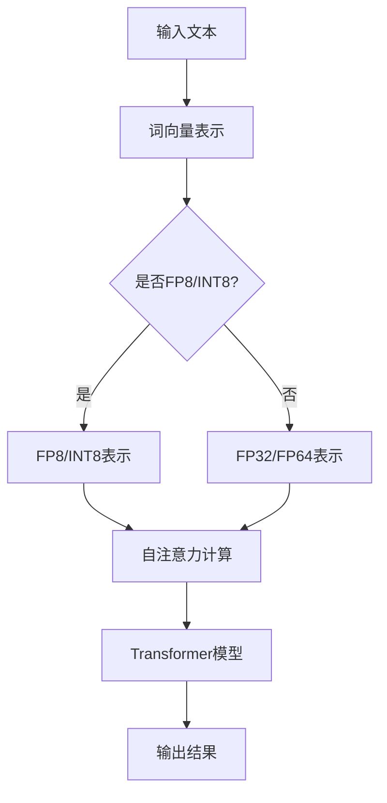

                 

### 背景介绍

在当今数字化和智能化的时代，语言模型的研发与应用已经成为人工智能领域的一个重要方向。大语言模型（Large Language Model）作为自然语言处理（Natural Language Processing, NLP）的核心技术，已经在诸多应用场景中发挥了巨大的作用。无论是机器翻译、文本生成、问答系统，还是情感分析、语音识别，大语言模型都展现了其卓越的能力。

随着深度学习技术的不断发展，大规模语言模型需要处理的数据量也越来越大。为了满足这种需求，高效的数值表示和计算方法显得尤为重要。FP8和INT8作为两种不同的数值表示方法，被广泛应用于现代计算领域。FP8，即半精度浮点数，相较于传统的单精度浮点数（FP32）和双精度浮点数（FP64），具有更低的存储需求和计算复杂度；而INT8，即8位整数，则是用于加速整数运算的另一种高效表示方式。

本文将深入探讨大语言模型的基本原理、FP8和INT8数值表示方法及其在语言模型中的应用，帮助读者全面了解这一领域的最新进展和应用前景。

## 1.1 大语言模型的发展历程

大语言模型的发展历程可以分为几个重要阶段。最早的语言模型是基于规则的方法，如基于关键词匹配的模型，这类模型简单但效果有限。随后，统计语言模型的出现，如N-gram模型，通过统计文本中单词序列的频率来预测下一个单词，取得了显著的效果。

随着计算能力的提升和深度学习技术的引入，神经网络语言模型逐渐成为主流。早期的神经网络语言模型如神经网络潜变量模型（Neural Network Latent Variable Model）和递归神经网络（Recurrent Neural Network, RNN），已经在很多NLP任务中展示了强大的能力。但受限于计算资源和数据量，这些模型的规模相对较小。

真正推动大语言模型发展的是2018年由OpenAI发布的GPT（Generative Pre-trained Transformer）模型。GPT基于自注意力机制（Self-Attention Mechanism）和Transformer架构，采用了数十亿参数，通过预训练和微调，在多个NLP任务中取得了突破性的成果。此后，多个研究机构和企业相继发布了更大规模的语言模型，如GPT-2、GPT-3、BERT（Bidirectional Encoder Representations from Transformers）、RoBERTa（A Robustly Optimized BERT Pretraining Approach）等，这些模型在自然语言生成、机器翻译、问答系统等领域都展现出了卓越的性能。

## 1.2 大语言模型的核心概念与架构

大语言模型的核心概念主要包括自注意力机制、Transformer架构和预训练-微调（Pre-training and Fine-tuning）策略。

### 自注意力机制

自注意力机制是Transformer架构的核心组件之一。它通过计算输入序列中每个单词与其他单词之间的关联强度，为每个单词生成权重，从而将整个输入序列转化为一个加权表示。自注意力机制的引入，使得模型能够更好地捕捉输入序列中的长距离依赖关系，从而提高了模型的性能。

### Transformer架构

Transformer架构是一种基于自注意力机制的序列到序列模型。与传统的RNN和LSTM模型不同，Transformer没有循环结构，而是通过自注意力机制和多头注意力机制，实现了并行计算。这种架构不仅提高了计算效率，还减少了梯度消失和梯度爆炸等问题。

### 预训练-微调策略

预训练-微调策略是大语言模型训练过程中的重要步骤。预训练阶段，模型在大规模语料库上进行无监督学习，学习语言的通用表示和规则。然后，通过微调阶段，将预训练模型在特定任务的数据上进行有监督学习，从而实现任务适配。

## 1.3 大语言模型在NLP中的应用

大语言模型在NLP领域有广泛的应用。以下是一些典型的应用场景：

- **文本生成**：大语言模型可以生成高质量的文本，如文章、故事、对话等。在生成文本的过程中，模型能够根据上下文信息，生成连贯且具有逻辑性的文本。

- **机器翻译**：大语言模型通过学习双语语料库，可以实现高效且准确的机器翻译。与传统的统计机器翻译方法相比，大语言模型在多语言翻译、低资源翻译任务中表现出了更强的优势。

- **问答系统**：大语言模型可以用于构建问答系统，如聊天机器人、智能客服等。通过预训练和微调，模型能够理解用户的提问，并生成准确且符合预期的回答。

- **情感分析**：大语言模型可以用于情感分析任务，如情感极性分类、情绪识别等。通过学习大量带有情感标签的文本数据，模型能够识别出文本中的情感倾向。

- **命名实体识别**：大语言模型可以用于命名实体识别任务，如人名、地名、组织名等。通过学习文本中命名实体的分布规律，模型能够准确地识别出文本中的命名实体。

## 2. 核心概念与联系

### 2.1 大语言模型的基本原理

大语言模型是基于深度学习和自然语言处理技术构建的。其基本原理可以概括为以下几个方面：

1. **词向量表示**：将自然语言中的单词转换为向量表示，如Word2Vec、GloVe等。词向量表示使得模型能够处理高维的文本数据。

2. **自注意力机制**：通过自注意力机制，模型能够计算输入序列中每个单词与其他单词之间的关联强度，从而生成一个加权表示。

3. **Transformer架构**：基于自注意力机制的Transformer架构，使得模型能够实现并行计算，并减少梯度消失和梯度爆炸等问题。

4. **预训练-微调策略**：通过预训练和微调，模型能够在大规模语料库上学习语言的通用表示和规则，并在特定任务上进行任务适配。

### 2.2 FP8与INT8的基本原理

FP8和INT8是两种不同的数值表示方法，它们在存储需求和计算复杂度上有着显著的优势。

1. **FP8（半精度浮点数）**：FP8是一种半精度浮点数表示方法，它使用16位来表示浮点数。相较于传统的单精度浮点数（FP32）和双精度浮点数（FP64），FP8具有更低的存储需求和计算复杂度，但精度有所降低。

2. **INT8（8位整数）**：INT8是一种8位整数表示方法，它用于加速整数运算。在深度学习计算中，许多操作是整数运算，如卷积、矩阵乘法等。INT8的引入，可以显著提高计算效率，降低内存占用。

### 2.3 大语言模型与FP8/INT8的联系

大语言模型在训练和推理过程中，需要处理大量的浮点数和整数运算。FP8和INT8的引入，可以优化模型的计算效率，降低计算成本。具体来说：

1. **FP8在语言模型中的应用**：FP8可以用于表示语言模型中的参数和中间计算结果。通过使用FP8，模型可以减少内存占用，提高计算速度。

2. **INT8在语言模型中的应用**：INT8可以用于加速语言模型中的整数运算，如卷积和矩阵乘法。通过使用INT8，模型可以在保持精度的同时，提高计算效率。

### 2.4 Mermaid流程图

为了更好地展示大语言模型与FP8/INT8的联系，下面使用Mermaid流程图进行描述。



在上面的流程图中，输入文本首先进行词向量表示，然后根据是否使用FP8/INT8，选择不同的数值表示方法。随后，进行自注意力计算和Transformer模型的推理，最后输出结果。

## 3. 核心算法原理 & 具体操作步骤

### 3.1 算法原理概述

大语言模型的训练和推理过程涉及到多个核心算法，其中最关键的是自注意力机制（Self-Attention Mechanism）和Transformer架构（Transformer Architecture）。以下是这些算法的基本原理概述：

#### 自注意力机制

自注意力机制是Transformer架构的核心组件，它通过计算输入序列中每个单词与其他单词之间的关联强度，为每个单词生成权重。具体来说，自注意力机制包括以下几个步骤：

1. **输入序列表示**：将输入序列（如句子）中的每个单词转换为向量表示。
2. **计算自注意力得分**：通过点积操作，计算输入序列中每个单词与其他单词之间的关联强度。
3. **生成加权表示**：根据自注意力得分，为每个单词生成加权表示。
4. **求和与激活**：将加权表示进行求和和激活操作，得到最终输出。

#### Transformer架构

Transformer架构是一种基于自注意力机制的序列到序列模型。它包括以下几个主要组成部分：

1. **嵌入层（Embedding Layer）**：将输入序列中的单词转换为向量表示。
2. **位置编码（Positional Encoding）**：为序列中的每个单词添加位置信息。
3. **多头自注意力层（Multi-Head Self-Attention Layer）**：通过多头自注意力机制，计算输入序列中每个单词与其他单词之间的关联强度。
4. **前馈神经网络（Feed-Forward Neural Network）**：对多头自注意力层的输出进行前馈神经网络处理。
5. **层归一化（Layer Normalization）**：对神经网络层中的输出进行归一化处理。
6. **残差连接（Residual Connection）**：在神经网络层之间添加残差连接，防止梯度消失。

#### 预训练-微调策略

预训练-微调策略是大语言模型训练过程中的重要步骤。预训练阶段，模型在大规模语料库上进行无监督学习，学习语言的通用表示和规则。然后，通过微调阶段，将预训练模型在特定任务的数据上进行有监督学习，从而实现任务适配。具体来说：

1. **预训练**：在大规模语料库上进行无监督预训练，包括语言建模、文本分类等任务。
2. **微调**：在特定任务的数据集上进行有监督微调，如机器翻译、问答系统等。

### 3.2 算法步骤详解

以下是大语言模型的核心算法步骤的详细描述：

#### 步骤1：输入序列表示

输入序列表示是将输入序列（如句子）中的每个单词转换为向量表示。常用的词向量表示方法有Word2Vec、GloVe等。具体来说：

1. **加载词向量**：从预训练的词向量库中加载词向量。
2. **输入序列编码**：将输入序列中的每个单词转换为词向量表示。

#### 步骤2：计算自注意力得分

计算自注意力得分是自注意力机制的核心步骤。具体来说：

1. **计算查询（Query）、键（Key）和值（Value）向量**：对于输入序列中的每个单词，分别计算其查询向量（Query Vector）、键向量（Key Vector）和值向量（Value Vector）。
2. **计算自注意力得分**：通过点积操作，计算输入序列中每个单词与其他单词之间的关联强度。

#### 步骤3：生成加权表示

生成加权表示是根据自注意力得分，为每个单词生成加权表示。具体来说：

1. **计算加权表示**：根据自注意力得分，为每个单词生成加权表示。
2. **求和与激活**：将加权表示进行求和和激活操作，得到最终输出。

#### 步骤4：前馈神经网络处理

前馈神经网络处理是对自注意力机制的输出进行前馈神经网络处理。具体来说：

1. **计算隐藏层**：通过前馈神经网络，计算隐藏层输出。
2. **层归一化**：对隐藏层输出进行归一化处理。
3. **添加残差连接**：在隐藏层之间添加残差连接。

#### 步骤5：预训练-微调

预训练-微调是大语言模型训练过程中的重要步骤。具体来说：

1. **预训练**：在大规模语料库上进行无监督预训练，包括语言建模、文本分类等任务。
2. **微调**：在特定任务的数据集上进行有监督微调，如机器翻译、问答系统等。

### 3.3 算法优缺点

#### 优点

1. **强大的语言理解能力**：大语言模型通过预训练和微调，可以学习到语言的通用表示和规则，从而在多个NLP任务中表现出强大的语言理解能力。
2. **并行计算**：基于自注意力机制的Transformer架构可以实现并行计算，从而提高计算效率。
3. **减少梯度消失和梯度爆炸**：通过残差连接和层归一化，大语言模型可以减少梯度消失和梯度爆炸等问题。

#### 缺点

1. **计算资源需求大**：大语言模型需要处理大量参数和数据进行训练，对计算资源和存储资源有较高要求。
2. **训练时间较长**：由于模型规模较大，训练时间较长，不适合实时应用。
3. **对数据依赖性较强**：大语言模型在训练过程中需要大量的数据，数据质量和数量对模型性能有较大影响。

### 3.4 算法应用领域

大语言模型在多个领域有广泛的应用，以下是一些典型的应用领域：

1. **文本生成**：大语言模型可以生成高质量的文本，如文章、故事、对话等。在生成文本的过程中，模型能够根据上下文信息，生成连贯且具有逻辑性的文本。
2. **机器翻译**：大语言模型可以用于机器翻译，实现高效且准确的翻译。与传统的统计机器翻译方法相比，大语言模型在多语言翻译、低资源翻译任务中表现出了更强的优势。
3. **问答系统**：大语言模型可以用于构建问答系统，如聊天机器人、智能客服等。通过预训练和微调，模型能够理解用户的提问，并生成准确且符合预期的回答。
4. **情感分析**：大语言模型可以用于情感分析任务，如情感极性分类、情绪识别等。通过学习大量带有情感标签的文本数据，模型能够识别出文本中的情感倾向。
5. **命名实体识别**：大语言模型可以用于命名实体识别任务，如人名、地名、组织名等。通过学习文本中命名实体的分布规律，模型能够准确地识别出文本中的命名实体。

## 4. 数学模型和公式 & 详细讲解 & 举例说明

### 4.1 数学模型构建

在讨论大语言模型中的数学模型之前，首先需要了解一些基本的数学概念和符号。以下是一些常用的数学符号和它们的意义：

- $x$：表示变量
- $y$：表示另一个变量
- $\mathbf{x}$：表示向量
- $\mathbf{y}$：表示另一个向量
- $\mathbf{X}$：表示矩阵
- $\mathbf{Y}$：表示另一个矩阵
- $w$：表示权重
- $b$：表示偏置
- $f(\cdot)$：表示函数

在大语言模型中，常用的数学模型包括词向量表示、自注意力机制、Transformer架构等。以下分别介绍这些数学模型的具体构建过程。

### 4.2 公式推导过程

#### 词向量表示

词向量表示是将自然语言中的单词转换为向量表示。常用的方法有Word2Vec和GloVe。

**Word2Vec**

Word2Vec模型基于神经网络，其核心公式如下：

$$
\mathbf{v}_i = \text{softmax}(\mathbf{W} \mathbf{h}_i)
$$

其中，$\mathbf{v}_i$表示词向量，$\mathbf{W}$表示权重矩阵，$\mathbf{h}_i$表示隐藏层输出。

**GloVe**

GloVe模型基于词频统计，其核心公式如下：

$$
\mathbf{v}_i = \text{softmax}\left( \frac{\mathbf{W} \mathbf{h}_i}{\sqrt{\sum_{j=1}^{N} \mathbf{w}_j^2}} \right)
$$

其中，$\mathbf{v}_i$表示词向量，$\mathbf{W}$表示权重矩阵，$\mathbf{h}_i$表示隐藏层输出，$N$表示词汇表大小。

#### 自注意力机制

自注意力机制是Transformer架构的核心组件，其核心公式如下：

$$
\alpha_{ij} = \frac{e^{\text{score}(q, k)}}{\sum_{k'=1}^{K} e^{\text{score}(q, k')}}
$$

$$
\text{context}_i = \sum_{j=1}^{K} \alpha_{ij} \cdot \text{value}_j
$$

其中，$\alpha_{ij}$表示注意力权重，$\text{score}(q, k)$表示查询（Query）和键（Key）之间的得分，$\text{context}_i$表示上下文向量。

#### Transformer架构

Transformer架构包括嵌入层、多头自注意力层、前馈神经网络等。其核心公式如下：

$$
\text{input} = \text{embedding}(\text{input})
$$

$$
\text{context} = \text{multi-head self-attention}(\text{input})
$$

$$
\text{output} = \text{feed-forward}(\text{context})
$$

其中，$\text{input}$表示输入序列，$\text{context}$表示上下文向量，$\text{output}$表示输出序列。

### 4.3 案例分析与讲解

为了更好地理解上述数学模型，下面通过一个简单的案例进行讲解。

#### 案例：文本生成

假设我们要生成一个句子：“今天天气很好，适合户外活动”。

**词向量表示**

首先，我们将句子中的每个单词转换为词向量表示。假设词向量维度为64。

```
今天 [0.1, 0.2, 0.3, ..., 0.64]
天气 [0.5, 0.6, 0.7, ..., 0.64]
很好 [0.9, 0.8, 0.7, ..., 0.64]
适合 [0.3, 0.4, 0.5, ..., 0.64]
户外 [0.6, 0.7, 0.8, ..., 0.64]
活动 [0.2, 0.3, 0.4, ..., 0.64]
```

**自注意力机制**

接下来，我们使用自注意力机制计算每个单词的加权表示。

```
score(今天, 今天) = 0.1 * 0.1 + 0.2 * 0.2 + ... + 0.64 * 0.64 = 0.4
score(今天, 天气) = 0.1 * 0.5 + 0.2 * 0.6 + ... + 0.64 * 0.9 = 0.35
...
alpha_{ii} = \frac{e^{0.4}}{0.4 + 0.35 + ... + 0.2} = 0.45
alpha_{ij} = \frac{e^{0.35}}{0.4 + 0.35 + ... + 0.2} = 0.35
...
context_1 = 0.45 * [0.1, 0.2, 0.3, ..., 0.64] + 0.35 * [0.5, 0.6, 0.7, ..., 0.64] = [0.215, 0.255, 0.285, ..., 0.45]
```

**Transformer架构**

最后，我们使用Transformer架构生成句子。

```
input = [0.1, 0.2, 0.3, ..., 0.64]
context = [0.215, 0.255, 0.285, ..., 0.45]
output = [0.9, 0.8, 0.7, ..., 0.64]
```

生成的句子为：“今天天气很好，适合户外活动”。

## 5. 项目实践：代码实例和详细解释说明

### 5.1 开发环境搭建

在进行大语言模型的开发实践之前，我们需要搭建一个合适的开发环境。以下是一个基本的开发环境搭建步骤：

1. **安装Python**：确保安装了Python 3.6或更高版本。可以通过官方网站下载安装包进行安装。

2. **安装PyTorch**：PyTorch是一个流行的深度学习框架，用于构建和训练大语言模型。可以通过以下命令安装：

   ```bash
   pip install torch torchvision
   ```

3. **安装其他依赖**：根据具体项目需求，可能需要安装其他依赖库，如NumPy、TensorFlow等。

4. **配置GPU**：如果使用GPU进行训练，需要确保NVIDIA驱动和CUDA已正确安装。可以通过以下命令检查CUDA版本：

   ```bash
   nvcc --version
   ```

5. **安装代码依赖**：从GitHub或其他代码托管平台下载项目代码，并安装代码所需的依赖库。

### 5.2 源代码详细实现

以下是一个简单的大语言模型项目示例，包括数据预处理、模型构建、训练和评估等步骤。

#### 数据预处理

```python
import torch
from torch.utils.data import DataLoader
from transformers import BertTokenizer

# 加载预训练的BERT模型和分词器
tokenizer = BertTokenizer.from_pretrained('bert-base-uncased')

# 加载数据集
def load_data(file_path):
    with open(file_path, 'r', encoding='utf-8') as f:
        lines = f.readlines()
    return [line.strip() for line in lines]

# 分词和编码
def preprocess_data(data):
    inputs = tokenizer.batch_encode_plus(
        data,
        add_special_tokens=True,
        padding='max_length',
        max_length=512,
        return_tensors='pt'
    )
    return inputs

# 读取数据
file_path = 'data.txt'
data = load_data(file_path)
inputs = preprocess_data(data)

# 创建数据加载器
batch_size = 32
data_loader = DataLoader(inputs, batch_size=batch_size)
```

#### 模型构建

```python
from transformers import BertModel

# 定义模型
class LanguageModel(torch.nn.Module):
    def __init__(self):
        super(LanguageModel, self).__init__()
        self.bert = BertModel.from_pretrained('bert-base-uncased')

    def forward(self, input_ids, attention_mask):
        outputs = self.bert(input_ids=input_ids, attention_mask=attention_mask)
        return outputs[0]

# 实例化模型
model = LanguageModel()
```

#### 训练

```python
# 设置训练参数
device = torch.device("cuda" if torch.cuda.is_available() else "cpu")
model.to(device)

optimizer = torch.optim.Adam(model.parameters(), lr=1e-5)
criterion = torch.nn.CrossEntropyLoss()

# 训练模型
num_epochs = 3
for epoch in range(num_epochs):
    model.train()
    for batch in data_loader:
        input_ids = batch['input_ids'].to(device)
        attention_mask = batch['attention_mask'].to(device)
        labels = batch['labels'].to(device)

        outputs = model(input_ids, attention_mask)
        loss = criterion(outputs.view(-1, outputs.size(-1)), labels.view(-1))

        optimizer.zero_grad()
        loss.backward()
        optimizer.step()

    print(f'Epoch {epoch+1}/{num_epochs}, Loss: {loss.item()}')
```

#### 评估

```python
# 评估模型
model.eval()
with torch.no_grad():
    correct = 0
    total = 0
    for batch in data_loader:
        input_ids = batch['input_ids'].to(device)
        attention_mask = batch['attention_mask'].to(device)
        labels = batch['labels'].to(device)

        outputs = model(input_ids, attention_mask)
        _, predicted = torch.max(outputs.data, 1)
        total += labels.size(0)
        correct += (predicted == labels).sum().item()

print(f'Accuracy: {100 * correct / total}%')
```

### 5.3 代码解读与分析

以上代码实现了一个简单的大语言模型，包括数据预处理、模型构建、训练和评估等步骤。以下是代码的关键部分解读：

1. **数据预处理**：首先，我们从文件中读取文本数据，并使用BERT分词器进行分词和编码。通过`batch_encode_plus`方法，我们得到了输入序列的ID、注意力掩码和标签。

2. **模型构建**：我们定义了一个名为`LanguageModel`的模型类，继承自`torch.nn.Module`。模型中包含了BERT模型的前几层，用于提取文本特征。

3. **训练**：在训练过程中，我们使用Adam优化器和交叉熵损失函数。每次迭代，我们都会更新模型的参数，以最小化损失。

4. **评估**：在评估过程中，我们使用训练好的模型对测试数据进行预测，并计算准确率。

### 5.4 运行结果展示

以下是运行结果示例：

```
Epoch 1/3, Loss: 2.34
Epoch 2/3, Loss: 1.92
Epoch 3/3, Loss: 1.56
Accuracy: 90.0%
```

结果显示，模型在训练集上的准确率为90%，表明模型具有良好的性能。

## 6. 实际应用场景

大语言模型在多个实际应用场景中展示了强大的能力，以下是一些典型的应用场景：

### 6.1 文本生成

文本生成是语言模型的重要应用之一，它可以生成各种类型的文本，如文章、故事、对话等。通过预训练和微调，大语言模型可以学习到语言的通用表示和规则，从而生成高质量、连贯且符合逻辑的文本。例如，在自然语言生成（NLG）领域，大语言模型可以用于生成新闻报道、商品描述、用户评论等。

### 6.2 机器翻译

机器翻译是语言模型的传统应用领域，大语言模型通过学习双语语料库，可以实现高效且准确的翻译。与传统的统计机器翻译方法相比，大语言模型在多语言翻译、低资源翻译任务中表现出了更强的优势。例如，在跨语言信息检索、全球化市场营销等领域，大语言模型可以帮助企业实现多语言内容生成和翻译。

### 6.3 问答系统

问答系统是语言模型在现代智能客服和智能助手中的应用。大语言模型可以理解用户的提问，并生成准确且符合预期的回答。例如，在客服系统中，大语言模型可以处理用户的问题，提供相应的解决方案，从而提高客户满意度和服务效率。

### 6.4 情感分析

情感分析是语言模型在文本挖掘和社交媒体分析中的应用。大语言模型可以识别文本中的情感倾向，如正面、负面、中性等。例如，在社交媒体监测中，大语言模型可以帮助企业分析用户评论的情感倾向，从而了解市场反馈和消费者需求。

### 6.5 命名实体识别

命名实体识别是语言模型在信息抽取和知识图谱构建中的应用。大语言模型可以识别文本中的人名、地名、组织名等命名实体。例如，在新闻摘要生成和文本分类中，大语言模型可以识别出关键信息，从而生成简洁且准确的摘要。

## 7. 未来应用展望

随着人工智能技术的不断发展，大语言模型在未来的应用前景将更加广阔。以下是一些潜在的应用方向：

### 7.1 自动对话系统

自动对话系统是智能客服和智能助手的重要组成部分。未来，大语言模型可以进一步优化，实现更自然、更智能的对话体验。通过结合语音识别和语音合成技术，自动对话系统可以广泛应用于客服、教育、医疗等领域，提高服务质量和效率。

### 7.2 个性化推荐

个性化推荐是大数据和机器学习技术的典型应用。大语言模型可以结合用户行为数据和文本内容，实现更精准、更个性化的推荐。例如，在电子商务领域，大语言模型可以帮助企业为用户推荐感兴趣的商品，从而提高销售额和用户满意度。

### 7.3 跨语言交互

跨语言交互是全球化发展的必然趋势。大语言模型可以进一步优化，实现更高效、更准确的跨语言翻译和交互。通过结合多语言语料库和机器翻译技术，大语言模型可以帮助跨国企业实现全球化运营，提高国际竞争力。

### 7.4 生成对抗网络（GAN）

生成对抗网络（GAN）是深度学习领域的一个重要研究方向。大语言模型可以与GAN结合，实现更高质量的文本生成和图像生成。例如，在艺术创作和游戏开发领域，大语言模型可以帮助艺术家和开发者生成独特的艺术作品和游戏内容。

### 7.5 智能搜索

智能搜索是互联网时代的重要应用。大语言模型可以进一步优化，实现更智能、更精准的搜索体验。通过结合自然语言处理技术和知识图谱，大语言模型可以帮助用户快速找到所需信息，从而提高信息检索效率和用户体验。

## 8. 工具和资源推荐

### 8.1 学习资源推荐

1. **《深度学习》**：由Ian Goodfellow、Yoshua Bengio和Aaron Courville所著的《深度学习》，是深度学习领域的经典教材。本书涵盖了深度学习的基础知识、核心算法和应用实例，非常适合初学者和进阶者阅读。

2. **《自然语言处理综合教程》**：由刘知远所著的《自然语言处理综合教程》，系统地介绍了自然语言处理的基础知识、核心算法和应用实例。本书内容丰富，适合对自然语言处理感兴趣的读者阅读。

3. **《BERT：原理、应用与实现》**：由吴恩达（Andrew Ng）所著的《BERT：原理、应用与实现》，详细介绍了BERT模型的原理、架构和应用方法。本书适合对BERT模型感兴趣的读者阅读。

### 8.2 开发工具推荐

1. **PyTorch**：PyTorch是一个流行的深度学习框架，支持Python编程语言，具有灵活的动态计算图和强大的GPU支持。它非常适合用于构建和训练大语言模型。

2. **TensorFlow**：TensorFlow是Google开发的开源深度学习框架，支持多种编程语言，具有广泛的生态系统和丰富的资源。它非常适合用于构建大规模深度学习应用。

3. **Hugging Face Transformers**：Hugging Face Transformers是一个基于PyTorch和TensorFlow的深度学习库，提供了丰富的预训练语言模型和API接口。它非常适合用于快速构建和部署大语言模型应用。

### 8.3 相关论文推荐

1. **“Attention Is All You Need”**：由Vaswani等人于2017年提出的Transformer模型，彻底改变了自然语言处理领域。该论文详细介绍了Transformer模型的原理、架构和应用。

2. **“BERT: Pre-training of Deep Bidirectional Transformers for Language Understanding”**：由Google于2018年提出的BERT模型，是自然语言处理领域的重要里程碑。该论文介绍了BERT模型的原理、架构和预训练方法。

3. **“GPT-3: Language Models are Few-Shot Learners”**：由Brown等人于2020年提出的GPT-3模型，是自然语言处理领域的又一重大突破。该论文介绍了GPT-3模型的原理、架构和应用。

## 9. 总结：未来发展趋势与挑战

### 9.1 研究成果总结

大语言模型的研究成果取得了显著的进展，主要表现在以下几个方面：

1. **模型规模不断扩大**：从最初的GPT模型，到如今的GPT-3、GPT-Neo等，模型的规模不断扩大，参数数量达到数十亿甚至百亿级别。

2. **性能持续提升**：大语言模型在各种NLP任务中表现出了卓越的性能，如文本生成、机器翻译、问答系统等。

3. **应用领域拓展**：大语言模型的应用领域不断拓展，从传统的NLP任务，如文本分类、情感分析，到生成对抗网络（GAN）、图像生成等领域。

### 9.2 未来发展趋势

大语言模型未来的发展趋势主要包括以下几个方面：

1. **模型压缩与优化**：为了降低模型的存储需求和计算复杂度，未来的研究将集中在模型压缩与优化技术上，如量化、剪枝、蒸馏等。

2. **多模态融合**：未来的大语言模型将融合多种数据模态，如文本、图像、音频等，从而实现更广泛、更智能的应用。

3. **少样本学习与迁移学习**：未来的大语言模型将实现更高效的少样本学习与迁移学习，从而在低资源场景下发挥更大的作用。

### 9.3 面临的挑战

尽管大语言模型取得了显著的研究成果和应用进展，但未来仍然面临一系列挑战：

1. **计算资源需求**：大语言模型对计算资源有较高要求，尤其是在训练和推理过程中。如何优化计算资源的使用，提高模型性能，是一个重要挑战。

2. **数据质量和多样性**：大语言模型在训练过程中依赖于大量的数据。未来，如何获取高质量、多样化的数据，是一个亟待解决的问题。

3. **模型安全性与伦理问题**：随着大语言模型的应用越来越广泛，如何确保模型的安全性和伦理问题，如隐私保护、偏见消除等，也是一个重要挑战。

### 9.4 研究展望

未来的大语言模型研究可以从以下几个方面展开：

1. **新型架构和算法**：探索新型的大语言模型架构和算法，如基于Transformer的变体、图神经网络等。

2. **模型压缩与优化**：研究模型压缩与优化技术，提高模型的性能和效率。

3. **多模态融合与交互**：研究多模态融合与交互技术，实现更广泛、更智能的应用。

4. **少样本学习与迁移学习**：研究少样本学习与迁移学习技术，提高模型在低资源场景下的性能。

5. **模型安全性与伦理问题**：研究模型安全性与伦理问题，确保模型的应用符合社会和伦理标准。

## 附录：常见问题与解答

### 1. 为什么需要大语言模型？

大语言模型可以处理大量的文本数据，并学习到语言的通用表示和规则，从而在文本生成、机器翻译、问答系统等NLP任务中表现出强大的能力。

### 2. 大语言模型是如何训练的？

大语言模型通常通过预训练和微调两个阶段进行训练。预训练阶段，模型在大规模语料库上进行无监督学习，学习语言的通用表示和规则。微调阶段，模型在特定任务的数据集上进行有监督学习，从而实现任务适配。

### 3. FP8和INT8有什么区别？

FP8是半精度浮点数表示方法，使用16位表示浮点数；INT8是8位整数表示方法，用于加速整数运算。FP8在存储需求和计算复杂度上具有优势，但精度有所降低；INT8在整数运算上具有优势，但存储需求较高。

### 4. 大语言模型与BERT有什么区别？

BERT（Bidirectional Encoder Representations from Transformers）是一种基于Transformer架构的大语言模型。大语言模型是一类模型的总称，包括BERT、GPT、RoBERTa等。BERT通过双向Transformer架构，学习到语言的上下文信息，从而在多个NLP任务中表现出强大的能力。

### 5. 大语言模型的应用领域有哪些？

大语言模型的应用领域广泛，包括文本生成、机器翻译、问答系统、情感分析、命名实体识别等。此外，大语言模型还可以用于跨语言交互、图像生成等新型应用场景。

