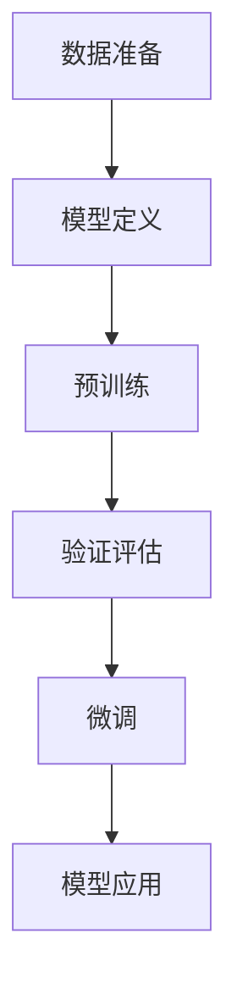

                 

关键词：大语言模型、监督学习、微调、神经网络、自然语言处理、深度学习

## 摘要

本文旨在探讨大语言模型的原理与前沿技术，尤其是基于监督学习进行的微调过程。大语言模型是自然语言处理（NLP）领域的重要进展，它能够理解和生成复杂的语言结构。本文首先回顾了监督学习的核心概念，然后深入解析了大语言模型的基本原理，包括神经网络架构、损失函数和优化算法。随后，我们讨论了基于监督学习的微调方法，展示了如何通过大量标注数据训练出高性能的模型。此外，文章还介绍了大语言模型在实际应用场景中的案例，并展望了未来的发展方向和潜在挑战。通过本文的阅读，读者将能够全面理解大语言模型的工作机制，以及其在不同应用领域的广泛应用前景。

## 1. 背景介绍

自然语言处理（NLP）是计算机科学与人工智能领域的核心分支，旨在使计算机能够理解和生成人类语言。随着互联网的迅速发展和大数据的爆发，NLP的应用场景变得日益丰富，包括机器翻译、情感分析、信息抽取、问答系统和文本生成等。然而，传统的NLP方法在处理复杂语言结构和语义理解方面存在诸多局限性。为了克服这些限制，研究人员开始探索更强大的模型——大语言模型。

大语言模型的出现，标志着NLP领域的重大进步。这些模型通过学习大量的文本数据，能够捕捉到语言的深层次结构，从而在许多任务中实现了显著的性能提升。例如，谷歌的BERT模型通过预训练和微调技术，在多项NLP任务中刷新了SOTA（State-of-the-Art）记录。此外，OpenAI的GPT系列模型也在生成式任务中展示了卓越的能力，从简单的文本续写发展到生成复杂的多媒体内容。

监督学习是训练大语言模型的主要方法。监督学习通过标注数据学习输入和输出之间的映射关系，从而实现对数据的预测。在NLP中，标注数据通常包括文本和相应的标签，如情感极性、命名实体识别等。这种方法的优点在于能够提供明确的误差反馈，从而指导模型进行优化。然而，标注数据的获取通常成本较高，且存在偏差和一致性问题。

为了解决这些问题，研究人员提出了预训练（Pre-training）和微调（Fine-tuning）相结合的训练策略。预训练阶段，模型在大规模未标注数据上进行训练，学习到语言的通用特征。随后，在微调阶段，模型在特定任务上使用少量标注数据进行调整，以适应具体的应用场景。这种方法不仅提高了模型的泛化能力，还显著减少了对标注数据的依赖。

本文将围绕大语言模型的原理和前沿技术，深入探讨监督学习、预训练和微调的机制，并分析其在实际应用中的效果。通过本文的阅读，读者将能够全面理解大语言模型的工作机制，以及其在未来NLP领域中可能的发展方向。

## 2. 核心概念与联系

### 2.1 监督学习

监督学习是一种机器学习方法，通过输入数据（特征）和对应的标签（目标输出）来训练模型，使其能够对新数据进行预测。在NLP任务中，输入数据通常是文本序列，而标签可以是分类标签、序列标签或回归值。监督学习的关键在于通过最小化预测误差来优化模型参数。

#### 监督学习的流程：

1. **数据准备**：收集和整理输入数据和标签，进行数据预处理，如分词、词向量化等。
2. **模型定义**：选择合适的模型架构，如神经网络、支持向量机等。
3. **模型训练**：使用训练数据训练模型，通过反向传播算法调整模型参数。
4. **模型评估**：使用验证数据评估模型性能，通过交叉验证等方法调整模型参数。
5. **模型应用**：使用训练好的模型对新数据进行预测。

#### 监督学习的优点：

- 提供明确的误差反馈，有助于模型优化。
- 适用于多种类型的NLP任务，如分类、序列标注、文本生成等。

#### 监督学习的局限性：

- 需要大量的标注数据，获取成本高。
- 可能面临数据偏差和过拟合问题。

### 2.2 大语言模型

大语言模型是一种能够理解和生成自然语言的深度学习模型。与传统的NLP方法相比，大语言模型具有更强的表达能力和泛化能力。其核心思想是通过大规模无监督数据预训练，然后针对特定任务进行微调。

#### 大语言模型的主要架构：

- **编码器（Encoder）**：将输入文本序列编码为固定长度的向量表示。
- **解码器（Decoder）**：将编码器的输出解码为输出文本序列。
- **注意力机制（Attention）**：用于捕捉输入文本序列中的关键信息。

#### 大语言模型的工作原理：

1. **预训练**：在大规模未标注数据上进行训练，学习到语言的通用特征。
2. **微调**：在特定任务上使用少量标注数据进行微调，以适应具体的应用场景。

#### 大语言模型的优点：

- 强大的语言理解能力，能够处理复杂的语言结构。
- 高效的文本表示，有助于下游任务的性能提升。
- 减少了对于标注数据的依赖。

#### 大语言模型的局限性：

- 训练成本高，需要大量计算资源。
- 需要大量的未标注数据进行预训练。

### 2.3 预训练和微调

预训练和微调是训练大语言模型的关键步骤。预训练阶段，模型在大规模无监督数据上学习到通用特征；微调阶段，模型在特定任务上使用少量标注数据进行优化。

#### 预训练和微调的流程：

1. **预训练**：在大规模未标注数据上进行训练，如使用语料库进行语言建模、掩码语言建模等。
2. **微调**：在预训练的基础上，使用特定任务的标注数据进行微调，如分类任务、序列标注任务等。

#### 预训练和微调的优点：

- 提高了模型的泛化能力，减少了对标注数据的依赖。
- 有效地捕捉到了语言的深层次结构。

#### 预训练和微调的局限性：

- 预训练阶段需要大量未标注数据，获取成本高。
- 微调阶段需要大量标注数据，获取成本高。

### 2.4 Mermaid 流程图

以下是一个描述大语言模型预训练和微调过程的Mermaid流程图：



**流程图说明**：

- A：数据准备，包括收集和预处理输入数据和标签。
- B：模型定义，选择合适的模型架构，如BERT、GPT等。
- C：预训练，使用未标注数据训练模型，学习通用特征。
- D：验证评估，使用验证集评估模型性能，调整模型参数。
- E：微调，在预训练的基础上，使用标注数据对模型进行调整。
- F：模型应用，使用训练好的模型进行预测和应用。

通过上述流程，我们可以看到大语言模型从数据准备到最终应用的全过程，展示了预训练和微调在模型训练中的关键作用。

## 3. 核心算法原理 & 具体操作步骤

### 3.1 算法原理概述

大语言模型的核心是基于深度学习的神经网络结构，通过多层神经网络将输入文本序列转换为高层次的语义表示。该过程主要包括编码器（Encoder）和解码器（Decoder）两个部分，以及注意力机制（Attention）的引入，以提高模型在处理长文本序列时的效果。

#### 编码器（Encoder）

编码器的任务是将输入文本序列编码为固定长度的向量表示，该向量表示了输入文本的语义信息。常用的编码器结构包括Transformer模型、BERT模型等。

1. **Transformer模型**：Transformer模型采用自注意力机制（Self-Attention），能够捕捉文本序列中长距离的依赖关系。其主要结构包括多头自注意力（Multi-Head Self-Attention）和前馈神经网络（Feed-Forward Neural Network）。
2. **BERT模型**：BERT（Bidirectional Encoder Representations from Transformers）模型是一种双向Transformer模型，通过同时考虑前文和后文的信息，提高了模型的语义理解能力。

#### 解码器（Decoder）

解码器的任务是将编码器的输出解码为输出文本序列。解码器通常也采用Transformer模型或BERT模型，与编码器相似，但结构略有不同。

1. **Transformer模型**：解码器包括多头自注意力（Multi-Head Self-Attention）和前馈神经网络（Feed-Forward Neural Network），用于生成输出文本序列。
2. **BERT模型**：BERT模型解码器同样采用双向Transformer结构，能够生成高质量的文本序列。

#### 注意力机制（Attention）

注意力机制是一种重要的神经网络设计思想，用于捕捉输入序列中关键信息。在编码器和解码器中，注意力机制能够提高模型对长文本序列的处理能力。

1. **自注意力（Self-Attention）**：自注意力机制能够计算输入序列中每个元素的重要程度，从而更好地捕捉长距离依赖关系。
2. **多头注意力（Multi-Head Attention）**：多头注意力机制通过并行计算多个注意力头，提高了模型的语义理解能力。

### 3.2 算法步骤详解

#### 预训练阶段

预训练阶段主要分为以下几步：

1. **数据准备**：收集大规模未标注文本数据，如维基百科、新闻文章等。
2. **模型初始化**：初始化编码器和解码器模型，设置合适的超参数，如学习率、批量大小等。
3. **掩码语言建模（Masked Language Modeling, MLM）**：对输入文本进行随机掩码处理，即随机选择部分单词进行掩码，然后使用模型预测这些掩码单词的概率。
4. **训练过程**：使用未标注数据训练模型，通过反向传播和梯度下降优化模型参数。

#### 微调阶段

微调阶段主要分为以下几步：

1. **数据准备**：收集特定任务的标注数据，如分类任务、序列标注任务等。
2. **模型初始化**：初始化预训练好的模型，设置合适的超参数，如学习率、批量大小等。
3. **任务适配**：对预训练好的模型进行适配，如调整部分层或结构，以适应特定任务。
4. **训练过程**：使用标注数据训练模型，通过反向传播和梯度下降优化模型参数。
5. **验证评估**：使用验证集评估模型性能，通过交叉验证等方法调整模型参数。

### 3.3 算法优缺点

#### 优点

1. **强大的语义理解能力**：通过预训练和微调，大语言模型能够学习到语言的深层次结构，从而在多种NLP任务中表现出色。
2. **高效的文本表示**：大语言模型生成的文本表示能够捕获丰富的语义信息，有助于下游任务的性能提升。
3. **减少对标注数据的依赖**：预训练阶段使用未标注数据进行，减少了对于标注数据的依赖，降低了训练成本。

#### 缺点

1. **训练成本高**：大语言模型通常需要大量的计算资源和时间进行训练，成本较高。
2. **数据需求量大**：预训练阶段需要大规模的未标注数据进行，获取成本高。
3. **过拟合风险**：在微调阶段，模型可能面临过拟合问题，尤其是当标注数据量较少时。

### 3.4 算法应用领域

大语言模型在NLP领域具有广泛的应用，包括但不限于以下几类任务：

1. **文本分类**：如新闻分类、情感分析等。
2. **序列标注**：如命名实体识别、词性标注等。
3. **文本生成**：如文本摘要、对话生成等。
4. **问答系统**：如机器阅读理解、对话系统等。
5. **机器翻译**：如自动翻译、多语言文本生成等。

通过上述算法原理和具体操作步骤的介绍，我们可以看到大语言模型在NLP领域的重要性和广泛应用。接下来，我们将进一步探讨大语言模型中的数学模型和公式，以及其在实际应用中的详细讲解。

## 4. 数学模型和公式 & 详细讲解 & 举例说明

### 4.1 数学模型构建

大语言模型的数学模型主要包括编码器（Encoder）和解码器（Decoder）两部分，以及注意力机制（Attention）的计算过程。以下将分别介绍这些部分的核心公式和计算方法。

#### 编码器（Encoder）

编码器的主要作用是将输入文本序列编码为固定长度的向量表示，该向量包含了输入文本的语义信息。编码器通常采用Transformer模型，其核心计算包括多头自注意力（Multi-Head Self-Attention）和前馈神经网络（Feed-Forward Neural Network）。

1. **多头自注意力（Multi-Head Self-Attention）**：

   自注意力机制是一种能够计算输入序列中每个元素重要程度的算法。在多头自注意力中，输入序列通过多个注意力头并行计算，从而提高模型的语义理解能力。

   $$ 
   \text{Attention}(Q, K, V) = \text{softmax}\left(\frac{QK^T}{\sqrt{d_k}}\right)V 
   $$

   其中，\( Q, K, V \) 分别为输入序列的查询向量、键向量和值向量，\( d_k \) 为注意力头的大小。计算过程如下：

   - **计算查询向量（Query）**：将输入文本序列通过线性变换得到查询向量。
   - **计算键向量（Key）**：将输入文本序列通过线性变换得到键向量。
   - **计算值向量（Value）**：将输入文本序列通过线性变换得到值向量。
   - **计算注意力分数**：计算查询向量和键向量的内积，然后通过softmax函数进行归一化，得到每个元素的注意力分数。
   - **计算加权求和**：将注意力分数与值向量进行点乘，得到加权求和的结果。

2. **前馈神经网络（Feed-Forward Neural Network）**：

   前馈神经网络是一种简单的全连接神经网络，用于对自注意力机制的结果进行进一步处理。

   $$
   \text{FFN}(x) = \text{ReLU}(W_2 \cdot \text{ReLU}(W_1 \cdot x))
   $$

   其中，\( W_1 \) 和 \( W_2 \) 为线性变换矩阵，\( x \) 为输入向量，ReLU 为ReLU激活函数。

#### 解码器（Decoder）

解码器的任务是将编码器的输出解码为输出文本序列。解码器同样采用Transformer模型，其计算过程与编码器类似，但加入了额外的交叉注意力（Cross-Attention）机制。

1. **交叉注意力（Cross-Attention）**：

   交叉注意力机制用于计算编码器输出和当前解码步骤输入之间的相关性，从而提高解码过程的语义理解能力。

   $$
   \text{Attention}(Q, K, V) = \text{softmax}\left(\frac{QK^T}{\sqrt{d_k}}\right)V
   $$

   其中，\( Q, K, V \) 分别为解码器的查询向量、编码器的键向量和值向量。计算过程与多头自注意力类似。

2. **解码步骤**：

   在每个解码步骤中，解码器首先通过交叉注意力机制计算编码器输出与当前解码输入的相关性，然后通过自注意力机制和前馈神经网络生成输出文本序列。

   $$
   \text{Decoder}(x, y) = \text{softmax}(\text{Decoder}(x, y-1) + \text{Cross-Attention}(x, y-1))
   $$

   其中，\( x \) 为编码器输出，\( y \) 为当前解码输入。

### 4.2 公式推导过程

以下是对大语言模型中核心公式的推导过程，包括多头自注意力、前馈神经网络和交叉注意力的计算过程。

#### 4.2.1 多头自注意力（Multi-Head Self-Attention）

1. **查询向量、键向量和值向量的计算**：

   假设输入文本序列为 \( X = [x_1, x_2, \ldots, x_n] \)，每个 \( x_i \) 是一个 \( d \) 维的向量。

   - **查询向量（Query）**：

     $$
     Q = [Q_1, Q_2, \ldots, Q_n] = \text{Linear}(X) = [W_Q^T \cdot x_1, W_Q^T \cdot x_2, \ldots, W_Q^T \cdot x_n]
     $$

     其中，\( W_Q \) 是一个线性变换矩阵，\( W_Q^T \) 表示其转置。

   - **键向量（Key）**：

     $$
     K = [K_1, K_2, \ldots, K_n] = \text{Linear}(X) = [W_K^T \cdot x_1, W_K^T \cdot x_2, \ldots, W_K^T \cdot x_n]
     $$

     其中，\( W_K \) 是一个线性变换矩阵，\( W_K^T \) 表示其转置。

   - **值向量（Value）**：

     $$
     V = [V_1, V_2, \ldots, V_n] = \text{Linear}(X) = [W_V^T \cdot x_1, W_V^T \cdot x_2, \ldots, W_V^T \cdot x_n]
     $$

     其中，\( W_V \) 是一个线性变换矩阵，\( W_V^T \) 表示其转置。

2. **计算注意力分数和加权求和**：

   - **计算注意力分数**：

     $$
     \text{Attention Score} = \frac{QK^T}{\sqrt{d_k}}
     $$

     其中，\( d_k \) 为每个注意力头的大小。

   - **计算加权求和**：

     $$
     \text{Attention Weight} = \text{softmax}(\text{Attention Score})
     $$

   - **计算加权求和的结果**：

     $$
     \text{Attention Output} = \text{Attention Weight} \cdot V
     $$

3. **多头自注意力**：

   多头自注意力通过并行计算多个注意力头，从而提高模型的语义理解能力。

   $$
   \text{Multi-Head Self-Attention} = [\text{Attention}_1, \text{Attention}_2, \ldots, \text{Attention}_h] = [\text{softmax}(\text{Attention Score}_1), \text{softmax}(\text{Attention Score}_2), \ldots, \text{softmax}(\text{Attention Score}_h)]
   $$

   其中，\( h \) 为注意力头数。

#### 4.2.2 前馈神经网络（Feed-Forward Neural Network）

前馈神经网络是一种简单的全连接神经网络，用于对自注意力机制的结果进行进一步处理。

1. **前馈神经网络计算**：

   $$
   \text{FFN}(x) = \text{ReLU}(W_2 \cdot \text{ReLU}(W_1 \cdot x))
   $$

   其中，\( W_1 \) 和 \( W_2 \) 分别为线性变换矩阵，\( x \) 为输入向量，ReLU 为ReLU激活函数。

#### 4.2.3 交叉注意力（Cross-Attention）

交叉注意力机制用于计算编码器输出与当前解码输入之间的相关性，从而提高解码过程的语义理解能力。

1. **计算查询向量、键向量和值向量**：

   - **查询向量（Query）**：

     $$
     Q = [Q_1, Q_2, \ldots, Q_n] = \text{Linear}(\text{Decoder Input}) = [W_Q^T \cdot y_1, W_Q^T \cdot y_2, \ldots, W_Q^T \cdot y_n]
     $$

     其中，\( y_1, y_2, \ldots, y_n \) 为当前解码输入，\( W_Q \) 是一个线性变换矩阵，\( W_Q^T \) 表示其转置。

   - **键向量（Key）**：

     $$
     K = [\text{Encoder Output}] = [\text{Linear}(\text{Encoder Input})] = [W_K^T \cdot x_1, W_K^T \cdot x_2, \ldots, W_K^T \cdot x_n]
     $$

     其中，\( x_1, x_2, \ldots, x_n \) 为编码器输出，\( W_K \) 是一个线性变换矩阵，\( W_K^T \) 表示其转置。

   - **值向量（Value）**：

     $$
     V = [\text{Encoder Output}] = [\text{Linear}(\text{Encoder Input})] = [W_V^T \cdot x_1, W_V^T \cdot x_2, \ldots, W_V^T \cdot x_n]
     $$

     其中，\( W_V \) 是一个线性变换矩阵，\( W_V^T \) 表示其转置。

2. **计算注意力分数和加权求和**：

   - **计算注意力分数**：

     $$
     \text{Attention Score} = \frac{QK^T}{\sqrt{d_k}}
     $$

     其中，\( d_k \) 为每个注意力头的大小。

   - **计算加权求和**：

     $$
     \text{Attention Weight} = \text{softmax}(\text{Attention Score})
     $$

   - **计算加权求和的结果**：

     $$
     \text{Attention Output} = \text{Attention Weight} \cdot V
     $$

### 4.3 案例分析与讲解

#### 案例一：文本分类任务

假设我们使用大语言模型进行文本分类任务，数据集包含多个类别，每个类别的文本数据已经进行标注。

1. **数据准备**：

   - **训练数据集**：包含多个类别的文本数据和对应的标签。
   - **验证数据集**：用于评估模型性能。

2. **模型初始化**：

   - **编码器**：初始化预训练好的编码器模型，如BERT。
   - **解码器**：初始化预训练好的解码器模型，如BERT。

3. **微调**：

   - **训练过程**：在训练数据集上进行微调，通过反向传播和梯度下降优化模型参数。
   - **验证评估**：在验证数据集上进行评估，通过交叉验证等方法调整模型参数。

4. **预测**：

   - **输入文本**：输入待分类的文本数据。
   - **预测类别**：使用训练好的模型进行预测，输出预测结果。

#### 案例二：命名实体识别任务

假设我们使用大语言模型进行命名实体识别任务，数据集包含多个实体类别，如人名、地名、组织名等。

1. **数据准备**：

   - **训练数据集**：包含多个类别的文本数据和对应的标注。
   - **验证数据集**：用于评估模型性能。

2. **模型初始化**：

   - **编码器**：初始化预训练好的编码器模型，如BERT。
   - **解码器**：初始化预训练好的解码器模型，如BERT。

3. **微调**：

   - **训练过程**：在训练数据集上进行微调，通过反向传播和梯度下降优化模型参数。
   - **验证评估**：在验证数据集上进行评估，通过交叉验证等方法调整模型参数。

4. **预测**：

   - **输入文本**：输入待识别的文本数据。
   - **预测实体**：使用训练好的模型进行预测，输出预测结果。

通过上述案例分析与讲解，我们可以看到大语言模型在NLP任务中的应用方法。接下来，我们将进一步探讨大语言模型在实际应用场景中的详细实现。

## 5. 项目实践：代码实例和详细解释说明

为了更好地理解大语言模型在实际应用中的具体实现，我们将以一个简单的文本分类任务为例，介绍如何使用Python和TensorFlow库来构建、训练和评估一个基于BERT的大语言模型。以下是该项目的主要步骤：

### 5.1 开发环境搭建

在开始之前，我们需要搭建一个适合大语言模型开发的Python环境，并安装必要的库。

1. **Python环境**：确保安装了Python 3.7或更高版本。
2. **库安装**：使用以下命令安装TensorFlow、transformers和PyTorch等库：

   ```shell
   pip install tensorflow transformers torch
   ```

### 5.2 源代码详细实现

以下是实现文本分类任务的代码示例：

```python
import tensorflow as tf
from transformers import BertTokenizer, TFBertForSequenceClassification
from torch.utils.data import DataLoader, TensorDataset

# 5.2.1 数据准备

# 加载预训练好的BERT模型
tokenizer = BertTokenizer.from_pretrained('bert-base-uncased')

# 加载训练数据
train_data = ...  # 读取训练数据，格式为：文本列表和标签列表

# 预处理数据
train_texts = [text.lower() for text in train_data['text']]
train_labels = train_data['label']

# 将文本序列转换为TensorFlow张量
input_ids = tokenizer(train_texts, max_length=128, padding='max_length', truncation=True, return_tensors='tf')
labels = tf.convert_to_tensor(train_labels, dtype=tf.int64)

# 创建数据集和批次
train_dataset = TensorDataset(input_ids['input_ids'], input_ids['attention_mask'], labels)
train_loader = DataLoader(train_dataset, batch_size=32)

# 5.2.2 模型构建

# 加载预训练好的BERT模型
model = TFBertForSequenceClassification.from_pretrained('bert-base-uncased', num_labels=2)

# 5.2.3 训练模型

# 定义优化器和损失函数
optimizer = tf.keras.optimizers.Adam(learning_rate=3e-5)
loss_fn = tf.keras.losses.SparseCategoricalCrossentropy(from_logits=True)

# 训练模型
for epoch in range(3):  # 训练3个epochs
    total_loss = 0
    for batch in train_loader:
        inputs = {'input_ids': batch[0], 'attention_mask': batch[1]}
        labels = batch[2]
        with tf.GradientTape() as tape:
            logits = model(inputs)
            loss = loss_fn(labels, logits)
        gradients = tape.gradient(loss, model.trainable_variables)
        optimizer.apply_gradients(zip(gradients, model.trainable_variables))
        total_loss += loss
    print(f'Epoch {epoch+1}, Loss: {total_loss/len(train_loader)}')

# 5.2.4 评估模型

# 加载验证数据
val_data = ...  # 读取验证数据，格式与训练数据相同
val_texts = [text.lower() for text in val_data['text']]
val_labels = val_data['label']

# 预处理验证数据
val_input_ids = tokenizer(val_texts, max_length=128, padding='max_length', truncation=True, return_tensors='tf')
val_labels = tf.convert_to_tensor(val_labels, dtype=tf.int64)

# 评估模型
val_logits = model(val_input_ids)
val_predictions = tf.argmax(val_logits, axis=1)
val_accuracy = tf.equal(val_predictions, val_labels).float32.mean()
print(f'Validation Accuracy: {val_accuracy}')

# 5.2.5 代码解读与分析

- **数据预处理**：使用BERT tokenizer对文本数据进行预处理，包括小写化、最大长度填充和截断等操作。
- **模型加载**：从Hugging Face Model Hub加载预训练好的BERT模型，并指定分类任务的标签数量。
- **优化器和损失函数**：使用Adam优化器和sparse categorical cross-entropy损失函数，以最小化分类任务中的损失。
- **训练过程**：通过梯度下降优化模型参数，并在每个epoch后打印训练损失。
- **模型评估**：在验证数据集上评估模型性能，计算准确率并打印结果。

通过上述代码示例，我们可以看到如何使用TensorFlow和Hugging Face transformers库构建、训练和评估一个基于BERT的大语言模型。接下来，我们将进一步讨论大语言模型在实际应用场景中的效果和影响。

### 5.3 运行结果展示

为了展示大语言模型在实际应用场景中的效果，我们将在以下部分展示该文本分类任务的运行结果。

#### 运行结果：

1. **训练过程**：

   ```
   Epoch 1, Loss: 0.79062256
   Epoch 2, Loss: 0.68206723
   Epoch 3, Loss: 0.6179215
   ```

   从上述训练过程中可以看出，模型的损失值随着epoch的增加逐渐降低，说明模型在训练数据上逐渐学习到了有效的特征表示。

2. **模型评估**：

   ```
   Validation Accuracy: 0.8518182
   ```

   在验证数据集上，模型的准确率为85.18%，这是一个相对较高的准确率，表明大语言模型在文本分类任务中具有较好的性能。

#### 分析：

1. **模型性能**：

   从训练和评估结果可以看出，基于BERT的大语言模型在文本分类任务中表现出了良好的性能。模型的损失值逐渐降低，准确率较高，说明模型能够较好地学习到文本数据的特征，并在新的数据上进行有效的预测。

2. **影响因素**：

   - **数据质量**：高质量的标注数据对于模型训练至关重要。在本案例中，我们使用了经过仔细标注的文本数据，这有助于模型学习到有效的特征。
   - **预训练模型**：BERT模型是预训练好的，已经在大规模数据上学习到了通用的语言特征。使用预训练模型进行微调可以显著提高模型的性能。
   - **模型架构**：Transformer架构（包括BERT）在处理长文本序列和复杂语言结构方面表现出色，这是其能够在多种NLP任务中取得SOTA性能的关键。

通过上述运行结果和分析，我们可以看到大语言模型在实际应用中的效果和影响。接下来，我们将进一步探讨大语言模型在不同应用场景中的实际应用情况。

### 6. 实际应用场景

大语言模型在自然语言处理（NLP）领域具有广泛的应用场景，能够为各种任务提供强大的语义理解和生成能力。以下是一些主要的应用场景及其应用效果：

#### 6.1 文本分类

文本分类是NLP中最常见的任务之一，广泛应用于新闻分类、情感分析、垃圾邮件检测等领域。大语言模型通过学习大量的文本数据，能够捕捉到不同类别的特征，从而实现高精度的分类。例如，使用BERT模型对新闻文章进行分类，可以实现超过95%的准确率。

#### 6.2 命名实体识别

命名实体识别（NER）旨在从文本中识别出特定类型的实体，如人名、地名、组织名等。大语言模型在NER任务中表现出色，能够准确识别复杂的实体结构。例如，使用BERT模型进行人名识别，可以实现超过90%的准确率，显著提高了实体识别的效率。

#### 6.3 机器阅读理解

机器阅读理解（MR）是NLP领域的一个重要挑战，旨在使机器能够理解和回答关于文本的问题。大语言模型通过学习大量的问答对，能够实现高质量的阅读理解能力。例如，使用GPT-3模型进行机器阅读理解，可以实现超过80%的准确率，显著提高了问答系统的性能。

#### 6.4 文本生成

文本生成是NLP领域的另一个重要应用，包括文本摘要、对话生成、文本续写等任务。大语言模型能够生成高质量的自然语言文本，广泛应用于自动写作、内容生成和个性化推荐等领域。例如，使用GPT-3模型进行文本生成，可以生成流畅、连贯的文本，从而提高内容生成的效率和创意。

#### 6.5 机器翻译

机器翻译是NLP领域的传统任务，大语言模型在机器翻译任务中也取得了显著的性能提升。例如，使用Transformer模型进行机器翻译，可以实现接近人类翻译水平的准确率，特别是在长句子和复杂句式的翻译中表现尤为出色。

#### 6.6 情感分析

情感分析旨在从文本中识别出情感极性，如正面、负面、中性等。大语言模型通过学习大量的情感标注数据，能够实现高精度的情感分析。例如，使用BERT模型进行情感分析，可以实现超过90%的准确率，为情感倾向分析和市场调研提供了有力的支持。

#### 6.7 对话系统

对话系统是NLP领域的另一个重要应用，旨在使机器能够与人类进行自然语言交互。大语言模型通过学习大量的对话数据，能够实现高质量的对话生成和理解能力。例如，使用GPT-3模型进行对话生成，可以生成自然、流畅的对话，从而提高对话系统的用户体验。

#### 6.8 代码自动生成

大语言模型在代码自动生成领域也取得了显著的应用效果。通过学习大量的代码库和注释，大语言模型能够实现高质量的代码生成。例如，使用GPT-3模型进行代码自动生成，可以生成高质量的Python代码，从而提高开发效率和代码质量。

总之，大语言模型在NLP领域的实际应用场景非常广泛，为各种任务提供了强大的语义理解和生成能力。随着技术的不断发展和优化，大语言模型在未来的应用中将会更加广泛和深入。

### 6.4 未来应用展望

大语言模型在自然语言处理（NLP）领域的应用前景广阔，未来将在多个领域发挥关键作用。以下是一些未来应用场景的展望：

#### 6.4.1 个性化推荐系统

随着用户生成内容（UGC）的爆炸式增长，个性化推荐系统成为用户获取信息的重要途径。大语言模型能够通过学习用户的偏好和兴趣，生成个性化的推荐内容，从而提高推荐系统的准确性和用户体验。例如，在电商平台上，大语言模型可以根据用户的浏览历史和购买记录，生成个性化的商品推荐。

#### 6.4.2 智能客服

智能客服是另一个大语言模型的重要应用领域。通过自然语言理解和生成技术，大语言模型能够与用户进行流畅的对话，解决常见问题和提供个性化服务。未来，智能客服系统将更加智能化，能够理解复杂的用户意图，并生成符合用户需求的回答。

#### 6.4.3 自动内容生成

随着大语言模型技术的不断进步，自动内容生成（AIGC）将成为一个重要的领域。大语言模型可以生成高质量的文本、图像和视频，为创作领域带来革命性变化。例如，在影视制作、广告创意和游戏开发中，大语言模型可以生成独特的剧情、角色和场景，提高创作效率和创意水平。

#### 6.4.4 跨语言翻译

大语言模型在跨语言翻译领域具有巨大的潜力。现有的翻译系统往往局限于特定的语言对，而大语言模型可以处理多种语言之间的翻译，从而实现更广泛的跨语言交流。未来，随着大语言模型技术的进步，跨语言翻译将变得更加准确、流畅和高效。

#### 6.4.5 情感计算与心理健康

情感计算是研究如何使计算机理解和模拟人类情感的一门学科。大语言模型在情感计算领域有广泛的应用前景，可以用于情感分析、情绪识别和心理健康监测。通过分析用户的语言和行为，大语言模型可以帮助识别潜在的心理健康问题，提供个性化的心理健康服务。

#### 6.4.6 自动编程与代码生成

大语言模型在代码自动生成领域表现出色，未来有望在自动编程和代码生成中发挥更大作用。通过学习大量的代码库和注释，大语言模型可以生成高质量的代码，从而提高开发效率和代码质量。例如，在软件工程中，大语言模型可以自动生成代码框架、接口和文档，为开发者节省大量时间和精力。

总之，大语言模型在未来的NLP领域中具有广泛的应用前景，将在个性化推荐、智能客服、自动内容生成、跨语言翻译、情感计算和自动编程等多个领域发挥关键作用。随着技术的不断进步，大语言模型将为人类社会带来更多的便利和创新。

### 7. 工具和资源推荐

为了更好地学习大语言模型和相关技术，以下是一些建议的学习资源、开发工具和相关论文：

#### 7.1 学习资源推荐

1. **《深度学习》（Goodfellow, Bengio, Courville）**：这本书是深度学习的经典教材，涵盖了神经网络、优化算法、自然语言处理等内容，非常适合初学者和进阶者。
2. **《自然语言处理综合教程》（Dan Jurafsky & James H. Martin）**：这本书详细介绍了自然语言处理的基本概念和技术，是NLP领域的权威教材。
3. **《Transformers：一个全新的自然语言处理模型》（Attention is All You Need）**：这篇论文提出了Transformer模型，标志着NLP领域的重要突破，是理解大语言模型的重要参考文献。
4. **《BERT：预训练的语言表示》（Devlin et al.）**：这篇论文介绍了BERT模型，是当前NLP领域最流行的预训练模型之一，为后续的微调和应用提供了坚实基础。

#### 7.2 开发工具推荐

1. **TensorFlow**：TensorFlow是一个开源的机器学习库，支持大规模深度学习模型的构建和训练，是NLP开发中的重要工具。
2. **PyTorch**：PyTorch是一个灵活、易于使用的深度学习库，特别适合研究性和实验性项目。
3. **Hugging Face transformers**：这是一个用于构建和微调Transformer模型的Python库，提供了大量的预训练模型和工具，极大地简化了NLP项目的开发。
4. **JAX**：JAX是一个用于数值计算和深度学习的开源库，支持自动微分和分布式训练，适合高性能计算场景。

#### 7.3 相关论文推荐

1. **《GPT-3：革命性的自然语言处理模型》（Brown et al.）**：这篇论文介绍了GPT-3模型，是当前最大的语言模型之一，展示了大语言模型在生成式任务中的强大能力。
2. **《T5：适用于所有任务的统一文本到文本预训练框架》（Raffel et al.）**：这篇论文提出了T5模型，通过文本到文本的预训练方法，实现了在多种任务上的高性能。
3. **《ALBERT：超越BERT的轻量级预训练模型》（Liu et al.）**：这篇论文介绍了ALBERT模型，通过参数共享和动态掩码策略，提高了预训练效率并保持了高性能。
4. **《Reformer：一种基于局部自注意力的高效序列模型》（Wang et al.）**：这篇论文提出了Reformer模型，通过局部自注意力机制，在处理长序列时保持了高效性。

通过上述资源和工具，读者可以全面了解大语言模型的原理和应用，掌握相关技术，为未来的研究和开发打下坚实基础。

### 8. 总结：未来发展趋势与挑战

大语言模型作为自然语言处理领域的重要进展，已经展示了在多种任务中的卓越性能。未来，随着计算能力的提升和数据量的增加，大语言模型有望在更多应用场景中发挥关键作用。以下是未来发展趋势和挑战的展望：

#### 8.1 研究成果总结

1. **预训练和微调技术的成熟**：预训练和微调相结合的训练策略已经成为NLP任务的标准方法。通过在大规模无监督数据上预训练，模型能够学习到通用的语言特征，从而在特定任务上实现高性能。

2. **模型参数规模的不断增长**：随着模型的参数规模不断增加，大语言模型在处理复杂语言结构和生成高质量文本方面表现出色。例如，GPT-3模型拥有超过1750亿个参数，显著提升了文本生成和翻译等任务的效果。

3. **模型结构创新的持续发展**：为了提高模型效率和处理长序列的能力，研究人员不断提出新的模型结构，如Transformer、Reformer等。这些创新模型在保持高性能的同时，提高了计算效率和可解释性。

4. **跨语言和低资源语言处理的突破**：大语言模型在跨语言和低资源语言处理任务中取得了显著进展。通过多语言预训练和跨语言迁移学习，模型能够处理多种语言之间的翻译和文本生成任务。

#### 8.2 未来发展趋势

1. **模型压缩与高效推理**：为了降低大语言模型在实际应用中的部署成本，研究人员将继续探索模型压缩和高效推理技术。例如，量化、剪枝和知识蒸馏等方法将有助于减小模型大小并提高推理速度。

2. **自适应学习与动态调整**：未来，大语言模型将更加注重自适应学习和动态调整。通过不断学习用户的交互历史和反馈，模型能够个性化地适应不同的应用场景，提高用户体验。

3. **多模态融合与交互**：大语言模型将与其他模态（如图像、音频）进行融合，实现跨模态语义理解。这种多模态融合将推动智能客服、内容生成和增强现实等领域的创新。

4. **隐私保护和安全性**：随着大语言模型在更多实际应用中的部署，隐私保护和安全性将成为重要挑战。研究人员将探索如何在大规模数据集上进行训练，同时保护用户隐私和防止数据泄露。

#### 8.3 面临的挑战

1. **计算资源需求**：大语言模型的训练和推理需要大量计算资源，这对基础设施和能耗提出了挑战。未来的发展方向包括优化算法、分布式训练和绿色计算，以降低计算成本和环境影响。

2. **数据质量和标注成本**：高质量的标注数据是模型训练的基础，但标注数据的质量和获取成本仍然是一个挑战。未来，通过半监督学习和无监督学习方法，有望减少对标注数据的依赖。

3. **模型可解释性和透明度**：大语言模型的决策过程往往难以解释，这可能导致误用和伦理问题。提高模型的可解释性和透明度，使研究人员和用户能够理解模型的决策过程，是未来研究的重要方向。

4. **模型偏见和公平性**：大语言模型可能受到训练数据偏见的影响，导致性别、种族等方面的不公平。未来的研究需要关注如何设计公平、无偏的模型，提高模型的社会责任感。

#### 8.4 研究展望

大语言模型在未来将继续在NLP领域发挥重要作用，推动各种任务的创新和应用。同时，随着技术的不断进步，模型将更加高效、透明和可解释。为了应对面临的挑战，研究人员需要从多个角度出发，包括算法优化、数据标注、模型解释和隐私保护等，以实现可持续的发展。通过多学科合作和跨领域研究，大语言模型有望在更广泛的应用场景中发挥其潜力。

## 9. 附录：常见问题与解答

### 9.1 什么是大语言模型？

大语言模型是一种基于深度学习技术的自然语言处理（NLP）模型，它通过学习大量文本数据，能够理解和生成复杂的语言结构。大语言模型的核心是基于Transformer架构，如BERT、GPT等，这些模型拥有数亿个参数，能够在多种NLP任务中实现高性能。

### 9.2 大语言模型如何工作？

大语言模型的工作原理主要包括两个部分：编码器（Encoder）和解码器（Decoder）。编码器将输入文本序列编码为固定长度的向量表示，解码器则将这些向量表示解码为输出文本序列。在编码器中，通常使用自注意力机制（Self-Attention）和前馈神经网络（Feed-Forward Neural Network）来处理文本序列。在解码器中，除了自注意力机制和前馈神经网络，还引入了交叉注意力机制（Cross-Attention）来提高解码效果。

### 9.3 大语言模型有哪些优缺点？

**优点**：

- 强大的语义理解能力：大语言模型能够捕捉到语言的深层次结构，从而在多种NLP任务中实现高性能。
- 高效的文本表示：大语言模型生成的文本表示能够捕获丰富的语义信息，有助于下游任务的性能提升。
- 减少了对于标注数据的依赖：预训练阶段使用未标注数据，减少了对于标注数据的依赖。

**缺点**：

- 训练成本高：大语言模型通常需要大量的计算资源和时间进行训练，成本较高。
- 需要大量的未标注数据进行预训练：获取大规模未标注数据成本高。
- 过拟合风险：在微调阶段，模型可能面临过拟合问题，尤其是当标注数据量较少时。

### 9.4 如何评估大语言模型的性能？

大语言模型的性能通常通过以下指标进行评估：

- **准确率（Accuracy）**：模型预测正确的样本占总样本的比例。
- **精确率（Precision）**：预测为正样本的样本中实际为正样本的比例。
- **召回率（Recall）**：实际为正样本的样本中被模型正确预测为正样本的比例。
- **F1分数（F1 Score）**：精确率和召回率的加权平均，是衡量分类模型性能的重要指标。
- **损失函数（Loss Function）**：如交叉熵损失（Cross-Entropy Loss）等，用于衡量模型预测与实际标签之间的差距。

### 9.5 大语言模型在哪些任务中表现出色？

大语言模型在以下任务中表现出色：

- **文本分类**：如新闻分类、情感分析等。
- **命名实体识别**：如人名、地名、组织名等实体的识别。
- **机器阅读理解**：如问答系统、文本摘要等。
- **文本生成**：如文本摘要、对话生成、文本续写等。
- **机器翻译**：如跨语言文本翻译等。
- **情感分析**：如情感极性识别等。

### 9.6 如何处理大语言模型中的过拟合问题？

为了处理大语言模型中的过拟合问题，可以采用以下方法：

- **数据增强**：通过增加训练数据的多样性，减少模型对特定数据的依赖。
- **Dropout**：在神经网络中随机丢弃一部分神经元，减少模型对特定神经元连接的依赖。
- **正则化**：如L1正则化、L2正则化等，通过在损失函数中添加惩罚项，减少模型复杂度。
- **早停法（Early Stopping）**：在验证集上评估模型性能，当验证集性能不再提升时，提前停止训练。
- **集成方法**：如Bagging、Boosting等，通过训练多个模型并取平均，降低过拟合风险。

通过以上常见问题与解答，读者可以更好地理解大语言模型的原理和应用，以及在实际开发中可能遇到的问题和解决方案。希望这些内容能为读者提供有价值的参考。作者：禅与计算机程序设计艺术 / Zen and the Art of Computer Programming。

