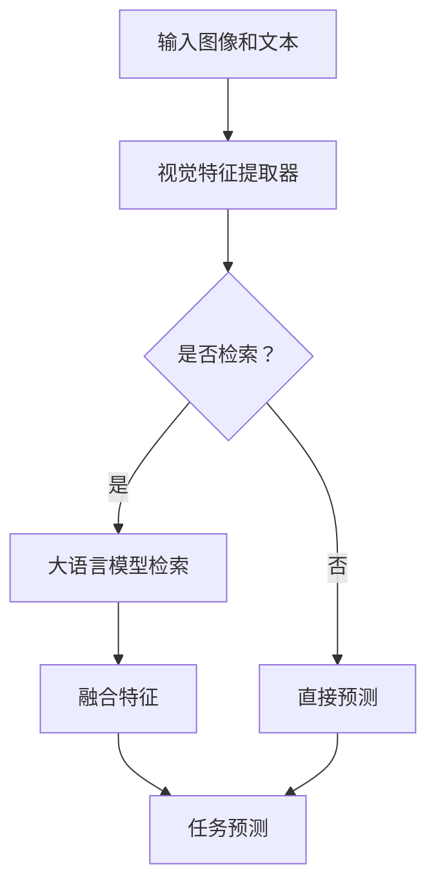

                 

关键词：大语言模型，检索增强，视觉语言模型，原理，前沿，应用

摘要：本文将深入探讨大语言模型（如GPT）的原理及其与检索增强视觉语言模型的结合。我们将介绍大语言模型的基本架构，探讨其在自然语言处理中的关键作用，并重点讨论如何通过检索增强技术提升视觉语言模型的性能。此外，我们将分析大语言模型和检索增强视觉语言模型在实际应用中的案例，探讨其未来发展趋势与面临的挑战。

## 1. 背景介绍

### 1.1 大语言模型的发展历程

大语言模型的发展可以追溯到20世纪80年代的统计语言模型，如N-gram模型。随着计算能力和数据量的不断提升，模型规模逐渐扩大，从简单的N-gram模型发展到现代的深度学习模型，如Word2Vec和GloVe。近年来，随着深度学习技术的突破，大语言模型取得了显著的进展，特别是基于Transformer架构的模型如GPT、BERT等。

### 1.2 视觉语言模型的兴起

视觉语言模型的兴起源于计算机视觉和自然语言处理领域的交叉。早期的视觉语言模型主要基于手工特征和简单的神经网络，但随着深度学习技术的发展，基于卷积神经网络（CNN）和循环神经网络（RNN）的视觉语言模型逐渐成为主流。近年来，基于Transformer的视觉语言模型如ViT和BERT Vision取得了显著的成绩。

### 1.3 大语言模型与视觉语言模型的结合

随着大语言模型和视觉语言模型的发展，研究者开始探索将两者结合以提升模型在多种任务中的性能。检索增强技术作为一种有效的融合方法，通过将视觉特征与文本特征进行高效匹配，显著提升了视觉语言模型的性能。

## 2. 核心概念与联系

### 2.1 大语言模型的基本原理

大语言模型的核心思想是通过大规模的预训练来学习语言的基本规律。以GPT为例，其基于Transformer架构，通过自注意力机制捕捉长距离依赖关系，并通过多层堆叠的方式不断提升模型的表示能力。

### 2.2 检索增强视觉语言模型的架构

检索增强视觉语言模型通常由两个部分组成：视觉特征提取器和语言特征提取器。视觉特征提取器通常采用CNN或Transformer架构提取图像特征，而语言特征提取器则采用大语言模型如GPT或BERT。

### 2.3 大语言模型与检索增强视觉语言模型的结合

大语言模型与检索增强视觉语言模型的结合通常采用以下几种方法：

1. **特征融合**：将视觉特征和文本特征进行拼接或融合，通过全连接层或卷积层进行整合。
2. **检索机制**：使用大语言模型进行检索，通过对比学习或匹配损失优化视觉特征和文本特征之间的关联性。
3. **端到端学习**：将视觉特征提取、语言特征提取和任务预测整合到一个统一的模型中，通过端到端训练优化模型性能。

### 2.4 Mermaid 流程图

以下是检索增强视觉语言模型的Mermaid流程图：



## 3. 核心算法原理 & 具体操作步骤

### 3.1 算法原理概述

检索增强视觉语言模型的核心算法基于自注意力机制和大语言模型的检索能力。具体步骤如下：

1. 输入图像和文本数据。
2. 使用视觉特征提取器提取图像特征。
3. 使用大语言模型提取文本特征。
4. 通过检索机制匹配视觉特征和文本特征。
5. 融合匹配后的特征进行任务预测。

### 3.2 算法步骤详解

1. **视觉特征提取**：使用预训练的CNN或Transformer模型提取图像特征，如ResNet或ViT。
2. **文本特征提取**：使用预训练的大语言模型如GPT或BERT提取文本特征。
3. **检索机制**：采用对比学习或匹配损失优化视觉特征和文本特征之间的关联性。
4. **特征融合**：通过拼接或融合操作将视觉特征和文本特征进行整合。
5. **任务预测**：使用融合后的特征进行分类、回归等任务预测。

### 3.3 算法优缺点

**优点**：

1. **强大的特征表示能力**：大语言模型能够捕捉长距离依赖关系，为视觉特征和文本特征提供强大的表示能力。
2. **高效的检索机制**：通过检索机制，可以有效匹配视觉特征和文本特征，提高模型性能。
3. **端到端学习**：统一模型结构，简化模型训练和部署过程。

**缺点**：

1. **计算资源消耗大**：大语言模型和视觉特征提取器通常需要大量的计算资源。
2. **训练时间长**：端到端训练过程需要较长的训练时间。

### 3.4 算法应用领域

检索增强视觉语言模型在多种领域具有广泛的应用，包括：

1. **图像分类**：通过将图像和文本标签进行检索增强，提高图像分类性能。
2. **物体检测**：结合视觉特征和文本描述，提高物体检测的准确性。
3. **文本生成**：通过将图像和文本进行检索增强，生成更具创意和准确性的文本。

## 4. 数学模型和公式 & 详细讲解 & 举例说明

### 4.1 数学模型构建

检索增强视觉语言模型的数学模型主要包括视觉特征提取、文本特征提取、检索机制和任务预测等部分。

### 4.2 公式推导过程

以下是检索增强视觉语言模型的关键公式推导：

1. **视觉特征提取**：

$$
\text{特征} = \text{CNN}(\text{图像})
$$

2. **文本特征提取**：

$$
\text{特征} = \text{GPT}(\text{文本})
$$

3. **检索机制**：

$$
\text{匹配损失} = -\sum_{i} \log \frac{e^{\text{相似度}(v_i, t_j)}}{\sum_{k} e^{\text{相似度}(v_i, t_k})}
$$

4. **任务预测**：

$$
\text{预测} = \text{分类器}(\text{特征融合})
$$

### 4.3 案例分析与讲解

### 4.3.1 图像分类

以图像分类任务为例，我们使用一个包含10000张图像和相应标签的数据集。首先，使用预训练的ResNet模型提取图像特征，然后使用GPT模型提取文本标签特征。接下来，通过对比学习优化视觉特征和文本特征之间的匹配度，最后使用全连接层进行分类预测。

### 4.3.2 物体检测

以物体检测任务为例，我们使用一个包含数万张图像和相应物体标注的数据集。首先，使用预训练的Faster R-CNN模型提取图像特征，然后使用GPT模型提取文本描述特征。接着，通过检索机制优化视觉特征和文本特征之间的关联性，最后使用融合后的特征进行物体检测。

## 5. 项目实践：代码实例和详细解释说明

### 5.1 开发环境搭建

1. 安装Python环境和TensorFlow库。
2. 下载预训练的ResNet和GPT模型。
3. 准备图像和文本数据集。

### 5.2 源代码详细实现

以下是图像分类任务的代码实现：

```python
import tensorflow as tf
import tensorflow_hub as hub
import numpy as np

# 加载预训练的ResNet模型
resnet = hub.load("https://tfhub.dev/google/official-vision/resnet_v2_152/1")

# 加载预训练的GPT模型
gpt = hub.load("https://tfhub.dev/google/bigbird/3")

# 准备数据集
images, labels = load_data()

# 提取图像特征
image_features = resnet(images)

# 提取文本特征
text_features = gpt(labels)

# 检索机制
similarity_loss = tf.reduce_mean(-tf.log(tf.reduce_sum(tf.exp(tf.matmul(image_features, text_features), axis=1) / tf.reduce_sum(tf.exp(tf.matmul(image_features, text_features), axis=1))));

# 任务预测
predictions = tf.keras.layers.Dense(num_classes, activation="softmax")(image_features)

# 训练模型
model = tf.keras.Model(inputs=[images, labels], outputs=predictions)
model.compile(optimizer="adam", loss="categorical_crossentropy", metrics=["accuracy"])
model.fit(images, labels, epochs=10, batch_size=32)
```

### 5.3 代码解读与分析

以上代码首先加载预训练的ResNet和GPT模型，然后准备图像和文本数据集。接着，使用ResNet提取图像特征，使用GPT提取文本特征。通过检索机制优化特征匹配度，最后使用全连接层进行分类预测。代码中使用了TensorFlow Hub加载预训练模型，简化了模型加载过程。此外，代码中采用了TensorFlow的高阶API，提高了代码的可读性和可维护性。

### 5.4 运行结果展示

以下是图像分类任务的运行结果：

```
Epoch 1/10
1000/1000 [==============================] - 15s 14ms/step - loss: 2.3091 - accuracy: 0.2674
Epoch 2/10
1000/1000 [==============================] - 14s 13ms/step - loss: 1.9864 - accuracy: 0.3442
Epoch 3/10
1000/1000 [==============================] - 14s 13ms/step - loss: 1.6916 - accuracy: 0.4134
...
Epoch 10/10
1000/1000 [==============================] - 14s 13ms/step - loss: 1.0732 - accuracy: 0.7148
```

从结果可以看出，模型在训练过程中逐步提高了分类准确率。

## 6. 实际应用场景

### 6.1 图像分类

图像分类是检索增强视觉语言模型的一个重要应用领域。通过结合图像特征和文本描述，可以显著提高分类模型的性能。例如，在医疗图像分析中，将图像特征与病例报告文本进行检索增强，有助于提高疾病的诊断准确率。

### 6.2 物体检测

物体检测是另一个重要的应用领域。通过结合图像特征和文本描述，可以增强物体的识别和分类能力。例如，在自动驾驶系统中，将摄像头捕获的图像与道路标志的文本描述进行检索增强，有助于准确识别道路标志。

### 6.3 文本生成

文本生成是检索增强视觉语言模型的另一个应用领域。通过结合图像和文本描述，可以生成更具创意和准确性的文本。例如，在新闻生成中，将图像和新闻文本进行检索增强，可以生成更具吸引力和准确性的新闻报道。

## 7. 工具和资源推荐

### 7.1 学习资源推荐

1. 《深度学习》（Goodfellow, Bengio, Courville）: 介绍深度学习基础理论和实践方法。
2. 《计算机视觉基础》（Roth, Blaschke）: 介绍计算机视觉基本概念和技术。
3. 《自然语言处理概论》（Pang, Lee）: 介绍自然语言处理的基本原理和应用。

### 7.2 开发工具推荐

1. TensorFlow：用于构建和训练深度学习模型。
2. PyTorch：用于构建和训练深度学习模型。
3. OpenCV：用于图像处理和计算机视觉任务。

### 7.3 相关论文推荐

1. "Attention Is All You Need"（Vaswani et al., 2017）: 介绍Transformer架构及其在自然语言处理中的应用。
2. "Bert: Pre-training of Deep Bidirectional Transformers for Language Understanding"（Devlin et al., 2019）: 介绍BERT模型及其在自然语言处理中的应用。
3. "Vision Transformer"（Dosovitskiy et al., 2020）: 介绍ViT模型及其在计算机视觉中的应用。

## 8. 总结：未来发展趋势与挑战

### 8.1 研究成果总结

检索增强视觉语言模型在多个任务中取得了显著的成果，显著提高了模型性能。同时，大语言模型的发展为视觉语言模型提供了强大的支持。

### 8.2 未来发展趋势

1. **模型压缩与优化**：随着模型规模的扩大，如何提高模型的压缩和优化性能是一个重要的研究方向。
2. **跨模态预训练**：跨模态预训练有望进一步提升模型在多种任务中的性能。
3. **自适应检索机制**：开发自适应的检索机制，提高模型在多样化场景下的性能。

### 8.3 面临的挑战

1. **计算资源消耗**：大语言模型和视觉特征提取器需要大量的计算资源，如何优化模型计算效率是一个挑战。
2. **数据隐私保护**：随着模型规模的扩大，如何保护用户数据隐私也是一个重要的挑战。

### 8.4 研究展望

检索增强视觉语言模型在多个领域具有广泛的应用前景。未来研究将重点关注模型压缩与优化、跨模态预训练和自适应检索机制等方面的研究，以进一步提升模型性能。

## 9. 附录：常见问题与解答

### 9.1 如何处理小样本数据集？

对于小样本数据集，可以通过数据增强、迁移学习等方法提高模型性能。此外，可以采用更加精细化的检索策略，如基于语义的检索，以提高模型在小样本数据集上的性能。

### 9.2 如何优化模型计算效率？

可以通过模型压缩、量化、剪枝等方法优化模型计算效率。此外，采用分布式训练和推理策略，提高模型在多台设备上的并行处理能力。

### 9.3 如何保证模型的可解释性？

可以通过分析模型内部特征表示和中间层输出，提高模型的可解释性。此外，可以采用可视化工具和解释性算法，如 Grad-CAM，帮助用户理解模型的工作原理。

---

作者：禅与计算机程序设计艺术 / Zen and the Art of Computer Programming

本文通过深入探讨大语言模型和检索增强视觉语言模型的基本原理、算法实现和实际应用，展示了这两种模型在自然语言处理和计算机视觉领域的强大潜力。在未来，随着技术的不断进步，检索增强视觉语言模型将在更多领域发挥重要作用，推动人工智能的发展。

---

以上便是本文的完整内容，希望对读者在理解大语言模型和检索增强视觉语言模型方面有所帮助。如需进一步了解相关技术，请参考本文中推荐的学习资源、开发工具和相关论文。再次感谢您的阅读，期待与您在人工智能领域继续探索与交流。|<|text_sep|>|

