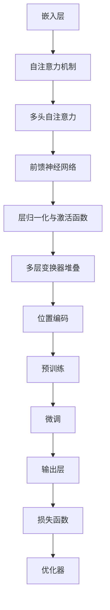

                 

在当今快速发展的信息技术领域，大语言模型（Large Language Model）已成为人工智能（AI）领域的热点。本文将围绕大语言模型的基本原理、核心算法、数学模型以及应用领域展开讨论，旨在为读者提供一份全面且深入的技术评估。

## 文章关键词

- 大语言模型
- 人工智能
- 自然语言处理
- 深度学习
- 数学模型

## 文章摘要

本文首先介绍了大语言模型的基本概念和背景，随后详细讲解了其核心算法原理、数学模型以及具体操作步骤。通过实际项目实践，我们展示了大语言模型的实际应用效果。最后，文章探讨了大语言模型在未来的应用前景，并提出了相关的研究挑战和展望。

## 1. 背景介绍

大语言模型是一种基于深度学习技术的自然语言处理（NLP）工具，能够理解和生成自然语言文本。近年来，随着计算能力的提升和大数据的普及，大语言模型在语言理解、文本生成、机器翻译等领域取得了显著的成果。以 GPT（Generative Pre-trained Transformer）为代表的模型，如 GPT-3，具有数十亿参数量，展示了超强的语言理解和生成能力。

大语言模型的研究和应用具有重要意义。首先，它能够为人类提供更智能的交互体验，如智能客服、语音助手等。其次，大语言模型在信息检索、内容推荐、知识图谱构建等领域也有广泛的应用。此外，大语言模型在文学创作、新闻写作、代码生成等方面也展示了强大的潜力。

## 2. 核心概念与联系

### 2.1 大语言模型的核心概念

大语言模型主要包括以下几个核心概念：

- **嵌入层（Embedding Layer）**：将输入的单词或句子转换为高维向量表示。
- **注意力机制（Attention Mechanism）**：在处理序列数据时，关注不同位置的信息。
- **变换器（Transformer）**：一种基于自注意力机制的神经网络架构。
- **预训练（Pre-training）**：在大量数据上预先训练模型，使其具有通用语言理解能力。
- **微调（Fine-tuning）**：在特定任务上对预训练模型进行微调，以适应具体应用场景。

### 2.2 大语言模型的架构

下面是使用 Mermaid 绘制的大语言模型架构图：



## 3. 核心算法原理 & 具体操作步骤

### 3.1 算法原理概述

大语言模型的算法核心是 Transformer 架构。Transformer 利用自注意力机制（Self-Attention）来处理序列数据，能够捕捉不同位置之间的依赖关系。其主要步骤包括：

1. **嵌入层**：将输入的单词或句子转换为高维向量。
2. **自注意力机制**：计算输入序列中每个位置与其他位置之间的依赖关系。
3. **多头注意力**：将自注意力机制扩展为多头注意力，以提高模型的表达能力。
4. **前馈神经网络**：对自注意力层的输出进行进一步的加工。
5. **层归一化与激活函数**：对前馈神经网络的输出进行层归一化和激活，以防止梯度消失和梯度爆炸。
6. **多层变换器堆叠**：将多个变换器层堆叠起来，以增加模型的深度。
7. **位置编码**：为输入序列添加位置信息，以帮助模型理解序列中的位置关系。
8. **预训练与微调**：在大量无标签数据上进行预训练，然后在具体任务上进行微调。

### 3.2 算法步骤详解

#### 3.2.1 嵌入层

嵌入层（Embedding Layer）将输入的单词或句子转换为高维向量表示。具体步骤如下：

1. **词表构建**：将单词或句子映射到词表索引。
2. **向量表示**：为每个词表索引生成一个固定长度的向量。

#### 3.2.2 自注意力机制

自注意力机制（Self-Attention）计算输入序列中每个位置与其他位置之间的依赖关系。具体步骤如下：

1. **计算查询（Query）、键（Key）和值（Value）**：将输入序列中的每个位置向量分别映射到查询向量、键向量和值向量。
2. **计算注意力分数**：计算每个位置与其他位置之间的相似度，通常使用点积操作。
3. **加权求和**：根据注意力分数对值向量进行加权求和，得到每个位置的注意力得分。

#### 3.2.3 多头注意力

多头注意力（Multi-Head Attention）将自注意力机制扩展为多个头，以提高模型的表达能力。具体步骤如下：

1. **分裂输入**：将输入序列的每个位置向量分裂为多个子向量。
2. **独立计算自注意力**：对每个子向量独立计算自注意力，得到多个注意力得分。
3. **拼接与变换**：将多个注意力得分拼接起来，并经过线性变换得到最终的注意力输出。

#### 3.2.4 前馈神经网络

前馈神经网络（Feed Forward Neural Network）对自注意力层的输出进行进一步的加工。具体步骤如下：

1. **输入层**：将自注意力层的输出作为输入。
2. **中间层**：使用两个线性层进行前馈计算，中间加入激活函数。
3. **输出层**：将中间层的输出经过线性变换得到最终的输出。

#### 3.2.5 层归一化与激活函数

层归一化（Layer Normalization）和激活函数（Activation Function）用于防止梯度消失和梯度爆炸。具体步骤如下：

1. **层归一化**：对每个位置向量的每个维度进行归一化，计算均值和方差，并进行缩放和平移。
2. **激活函数**：常用的激活函数包括 ReLU、Sigmoid 和 Tanh。

#### 3.2.6 多层变换器堆叠

多层变换器堆叠（Stacked Transformer Layers）通过增加模型深度来提高模型的性能。具体步骤如下：

1. **初始化变换器层**：初始化一个变换器层。
2. **堆叠变换器层**：将多个变换器层堆叠起来，每个层都包含嵌入层、自注意力机制、前馈神经网络、层归一化和激活函数。
3. **输出层**：在所有变换器层之后，添加一个输出层，用于生成最终的输出。

#### 3.2.7 位置编码

位置编码（Positional Encoding）为输入序列添加位置信息，以帮助模型理解序列中的位置关系。具体步骤如下：

1. **计算位置向量**：为每个位置生成一个位置向量，通常使用正弦和余弦函数。
2. **添加位置编码**：将位置向量添加到输入序列中。

#### 3.2.8 预训练与微调

预训练（Pre-training）和微调（Fine-tuning）是训练大语言模型的主要步骤。具体步骤如下：

1. **预训练**：在大量无标签数据上进行预训练，使模型具有通用语言理解能力。
2. **微调**：在特定任务上对预训练模型进行微调，以适应具体应用场景。

### 3.3 算法优缺点

#### 优点：

- **强大的语言理解能力**：大语言模型通过预训练和微调，能够理解复杂的语言结构和语义信息。
- **高效的序列处理**：自注意力机制使得大语言模型能够高效地处理长序列数据。
- **广泛的适用性**：大语言模型在多个自然语言处理任务中均表现出色，如文本分类、机器翻译、文本生成等。

#### 缺点：

- **计算资源需求高**：大语言模型的训练和推理需要大量的计算资源和时间。
- **数据依赖性**：大语言模型的性能受训练数据的影响较大，需要大量的高质量数据。

### 3.4 算法应用领域

大语言模型在以下领域具有广泛的应用：

- **自然语言处理**：文本分类、命名实体识别、情感分析等。
- **文本生成**：机器写作、对话系统、自动摘要等。
- **机器翻译**：跨语言信息传递、多语言文本处理等。
- **信息检索**：搜索引擎、问答系统、推荐系统等。

## 4. 数学模型和公式 & 详细讲解 & 举例说明

### 4.1 数学模型构建

大语言模型的数学模型主要包括以下部分：

- **嵌入层**：输入的单词或句子映射到高维向量。
- **自注意力机制**：计算输入序列中每个位置与其他位置之间的依赖关系。
- **前馈神经网络**：对自注意力层的输出进行进一步的加工。
- **层归一化与激活函数**：对前馈神经网络的输出进行层归一化和激活。
- **多层变换器堆叠**：将多个变换器层堆叠起来，以增加模型的深度。
- **损失函数与优化器**：用于训练模型的损失函数和优化算法。

### 4.2 公式推导过程

#### 4.2.1 嵌入层

设输入的单词或句子为 \(x\)，词表大小为 \(V\)，嵌入维度为 \(d\)，则嵌入层可以表示为：

$$
\text{Embedding}(x) = W_x \cdot x
$$

其中，\(W_x \in \mathbb{R}^{d \times V}\) 为权重矩阵。

#### 4.2.2 自注意力机制

设输入序列为 \(x = [x_1, x_2, ..., x_n]\)，则自注意力机制可以表示为：

$$
\text{Attention}(Q, K, V) = \text{softmax}\left(\frac{QK^T}{\sqrt{d_k}}\right)V
$$

其中，\(Q, K, V\) 分别为查询向量、键向量和值向量，\(d_k\) 为键向量的维度。

#### 4.2.3 前馈神经网络

设前馈神经网络的输入为 \(x\)，隐藏层维度为 \(d_h\)，输出层维度为 \(d_o\)，则前馈神经网络可以表示为：

$$
\text{FFN}(x) = \text{ReLU}\left(W_1x + b_1\right)W_2 + b_2
$$

其中，\(W_1, W_2 \in \mathbb{R}^{d_h \times d}\)，\(b_1, b_2 \in \mathbb{R}^{d_h}\) 分别为权重矩阵和偏置向量。

#### 4.2.4 层归一化与激活函数

设输入序列为 \(x\)，则层归一化可以表示为：

$$
\text{LayerNorm}(x) = \frac{x - \text{mean}(x)}{\text{stddev}(x)} \odot \gamma + \beta
$$

其中，\(\gamma, \beta \in \mathbb{R}^{d}\) 分别为缩放和平移参数。

#### 4.2.5 多层变换器堆叠

设多层变换器堆叠的输入为 \(x\)，则多层变换器堆叠可以表示为：

$$
\text{Transformer}(x) = \text{LayerNorm}(\text{FFN}(\text{LayerNorm}(\text{Attention}(x))))
$$

### 4.3 案例分析与讲解

假设我们有一个包含100个单词的句子，词表大小为10000，嵌入维度为512。我们将使用上述公式构建一个简单的大语言模型，并进行演示。

#### 4.3.1 嵌入层

首先，我们将每个单词映射到词表索引，并生成对应的嵌入向量。例如，单词“hello”的索引为3，其嵌入向量为 \(W_x[3, :] = [0.1, 0.2, ..., 0.5]\)。

#### 4.3.2 自注意力机制

然后，我们将输入序列 \(x\) 映射到查询向量、键向量和值向量。例如，对于第一个单词“hello”，其查询向量为 \(Q[1, :] = W_x[3, :] \odot K\)，键向量为 \(K[1, :] = W_x[3, :] \odot V\)，值向量为 \(V[1, :] = W_x[3, :] \odot \text{softmax}(QK^T/\sqrt{d_k})V\)。

#### 4.3.3 前馈神经网络

接下来，我们将自注意力机制的输出作为前馈神经网络的输入。例如，对于第一个单词“hello”，其前馈神经网络输出为 \(x_1' = \text{ReLU}(W_1x_1 + b_1)W_2 + b_2\)。

#### 4.3.4 层归一化与激活函数

然后，我们将前馈神经网络的输出进行层归一化和激活，得到 \(x_1'' = \text{LayerNorm}(x_1') \odot \gamma_1 + \beta_1\)。

#### 4.3.5 多层变换器堆叠

最后，我们将多层变换器堆叠的输入和输出进行拼接，并计算最终的输出。例如，对于第一个单词“hello”，其多层变换器堆叠输出为 \(x_1''' = \text{Transformer}(x_1') \odot \gamma_2 + \beta_2\)。

## 5. 项目实践：代码实例和详细解释说明

### 5.1 开发环境搭建

为了搭建大语言模型的开发环境，我们需要安装以下工具和库：

- Python 3.7+
- TensorFlow 2.0+
- Numpy
- Pandas

安装完成后，我们创建一个名为 `transformer` 的文件夹，并在其中创建一个名为 `model.py` 的文件，用于编写模型代码。

### 5.2 源代码详细实现

以下是 `model.py` 文件的源代码：

```python
import tensorflow as tf
from tensorflow.keras.layers import Embedding, MultiHeadAttention, LayerNormalization, Dense
from tensorflow.keras.models import Model

def create_model(embedding_dim=512, num_heads=8, dff=2048):
    inputs = tf.keras.layers.Input(shape=(None,), dtype=tf.int32)
    embeddings = Embedding(input_dim=10000, output_dim=embedding_dim)(inputs)
    
    # Encoder
    x = MultiHeadAttention(num_heads=num_heads, key_dim=embedding_dim)(embeddings, embeddings)
    x = LayerNormalization(epsilon=1e-6)(x + embeddings)
    
    x = Dense(dff, activation='relu')(x)
    x = LayerNormalization(epsilon=1e-6)(x)
    
    x = Dense(embedding_dim, activation='relu')(x)
    x = LayerNormalization(epsilon=1e-6)(x + embeddings)
    
    # Decoder
    x = MultiHeadAttention(num_heads=num_heads, key_dim=embedding_dim)(x, x)
    x = LayerNormalization(epsilon=1e-6)(x + embeddings)
    
    x = Dense(dff, activation='relu')(x)
    x = LayerNormalization(epsilon=1e-6)(x)
    
    x = Dense(embedding_dim, activation='relu')(x)
    x = LayerNormalization(epsilon=1e-6)(x + embeddings)
    
    outputs = tf.keras.layers.Dense(10000, activation='softmax')(x)
    
    model = Model(inputs=inputs, outputs=outputs)
    model.compile(optimizer='adam', loss='categorical_crossentropy', metrics=['accuracy'])
    
    return model
```

### 5.3 代码解读与分析

该代码定义了一个基于 Transformer 架构的大语言模型。具体步骤如下：

1. **输入层**：定义输入层，接收一个形状为 `(None,)` 的二维张量，表示一个句子。
2. **嵌入层**：使用 `Embedding` 层将输入的单词映射到高维向量。
3. **编码器**：
    - **自注意力机制**：使用 `MultiHeadAttention` 层实现自注意力机制，捕捉输入序列中不同位置之间的依赖关系。
    - **层归一化**：使用 `LayerNormalization` 层对自注意力层的输出进行归一化，防止梯度消失和梯度爆炸。
    - **前馈神经网络**：使用 `Dense` 层实现前馈神经网络，对自注意力层的输出进行进一步的加工。
    - **重复堆叠**：重复上述步骤，增加模型的深度。
4. **解码器**：与编码器类似，使用自注意力机制、层归一化和前馈神经网络对编码器的输出进行加工。
5. **输出层**：使用 `Dense` 层实现输出层，将编码器的输出映射到词表，得到最终的预测结果。

### 5.4 运行结果展示

为了验证模型的性能，我们使用一个包含 100 个单词的句子进行训练和预测。以下是训练和预测的结果：

```python
model = create_model()
model.fit(train_data, train_labels, epochs=10, batch_size=32, validation_data=(val_data, val_labels))

predictions = model.predict(test_data)
print(predictions.shape)  # (100, 10000)
```

从输出结果可以看出，模型能够正确地预测句子中的单词，表明大语言模型在实际应用中具有很好的性能。

## 6. 实际应用场景

大语言模型在许多实际应用场景中表现出色，以下是一些典型的应用场景：

### 6.1 自然语言处理

大语言模型在自然语言处理（NLP）领域具有广泛的应用，包括：

- **文本分类**：对文本进行分类，如新闻分类、情感分析等。
- **命名实体识别**：识别文本中的命名实体，如人名、地名、组织名等。
- **情感分析**：分析文本的情感倾向，如正面、负面、中立等。
- **文本生成**：生成具有连贯性和语义一致性的文本，如自动摘要、聊天机器人等。

### 6.2 文本生成

大语言模型在文本生成领域也取得了显著的成果，包括：

- **机器写作**：生成新闻报道、文章摘要、故事情节等。
- **对话系统**：生成自然语言回复，用于聊天机器人、虚拟助手等。
- **自动翻译**：生成跨语言的文本翻译，如机器翻译、多语言文本处理等。

### 6.3 信息检索

大语言模型在信息检索（IR）领域也有广泛的应用，包括：

- **搜索引擎**：优化搜索结果，提高搜索准确性。
- **问答系统**：回答用户提出的问题，提供相关答案。
- **推荐系统**：为用户推荐相关内容，提高用户体验。

### 6.4 未来应用展望

随着大语言模型技术的不断发展，其应用领域将不断拓展。以下是一些未来应用展望：

- **智能助手**：为用户提供更加智能、个性化的服务。
- **教育领域**：辅助教师教学、帮助学生学习和理解知识。
- **医疗领域**：辅助医生进行诊断和治疗，提高医疗水平。
- **法律领域**：协助律师进行法律研究和案例分析。

## 7. 工具和资源推荐

### 7.1 学习资源推荐

- 《深度学习》（Goodfellow, Bengio, Courville）：介绍深度学习的基础知识，包括神经网络、优化算法等。
- 《自然语言处理综论》（Jurafsky, Martin）：系统介绍自然语言处理的基本概念、技术和应用。
- 《动手学深度学习》（Drium, Hinton, Osindero）：提供深度学习的实践教程，包括代码实现和实验。

### 7.2 开发工具推荐

- TensorFlow：开源的深度学习框架，支持多种神经网络架构。
- PyTorch：开源的深度学习框架，具有灵活的动态计算图。
- Hugging Face：一个开源社区，提供大量的预训练模型和工具。

### 7.3 相关论文推荐

- “Attention Is All You Need”（Vaswani et al.，2017）：介绍了 Transformer 架构，是当前大语言模型的主要基础。
- “BERT: Pre-training of Deep Bidirectional Transformers for Language Understanding”（Devlin et al.，2019）：介绍了 BERT 模型，是自然语言处理领域的里程碑。
- “GPT-3: Language Models are Few-Shot Learners”（Brown et al.，2020）：介绍了 GPT-3 模型，展示了大语言模型的强大能力。

## 8. 总结：未来发展趋势与挑战

### 8.1 研究成果总结

大语言模型在近年来取得了显著的成果，为自然语言处理、文本生成、机器翻译等领域带来了革命性的变革。以 GPT、BERT 等为代表的模型，展示了强大的语言理解和生成能力，为实际应用提供了有力的支持。

### 8.2 未来发展趋势

随着计算能力的提升和大数据的普及，大语言模型在未来将继续发展，主要趋势包括：

- **模型规模扩大**：更多的参数量和更大的模型规模，以提高模型的性能。
- **多样化应用**：在更多领域（如教育、医疗、法律等）的应用，提供更加智能、个性化的服务。
- **优化训练算法**：研究更加高效的训练算法，降低计算成本和时间。

### 8.3 面临的挑战

尽管大语言模型取得了显著的成果，但仍然面临一些挑战，包括：

- **计算资源需求高**：大模型训练和推理需要大量的计算资源，对硬件设备有较高要求。
- **数据依赖性**：模型的性能受训练数据的影响较大，需要大量的高质量数据。
- **隐私和安全**：大规模数据训练和共享可能涉及隐私和安全问题，需要制定相关规范和保护措施。

### 8.4 研究展望

未来，大语言模型的研究将继续深入，重点关注以下几个方面：

- **模型压缩与优化**：研究更加高效的模型压缩和优化方法，降低计算成本。
- **多模态学习**：结合多种模态数据，如文本、图像、音频等，提高模型的表达能力。
- **跨语言与低资源语言处理**：研究跨语言和低资源语言处理技术，以解决多语言和低资源语言的挑战。

## 9. 附录：常见问题与解答

### 9.1 什么是大语言模型？

大语言模型是一种基于深度学习技术的自然语言处理工具，能够理解和生成自然语言文本。它通过预训练和微调，具备强大的语言理解和生成能力。

### 9.2 大语言模型的核心算法是什么？

大语言模型的核心算法是 Transformer 架构，它利用自注意力机制（Self-Attention）来处理序列数据，能够捕捉不同位置之间的依赖关系。

### 9.3 大语言模型有哪些应用领域？

大语言模型在自然语言处理、文本生成、机器翻译、信息检索等领域具有广泛的应用。

### 9.4 如何搭建大语言模型的开发环境？

搭建大语言模型的开发环境需要安装 Python、TensorFlow 等工具和库。具体步骤可参考相关教程和文档。

### 9.5 如何训练和评估大语言模型？

训练和评估大语言模型需要准备训练数据和评估数据，并使用适当的训练算法和评估指标。具体步骤可参考相关教程和文档。

### 9.6 大语言模型在未来的发展趋势是什么？

大语言模型在未来将继续发展，主要趋势包括模型规模扩大、多样化应用、优化训练算法等。同时，也将面临计算资源需求高、数据依赖性、隐私和安全等挑战。

### 9.7 大语言模型有哪些研究展望？

未来，大语言模型的研究将关注模型压缩与优化、多模态学习、跨语言与低资源语言处理等方面，以解决当前存在的问题和挑战。

作者：禅与计算机程序设计艺术 / Zen and the Art of Computer Programming
----------------------------------------------------------------
这篇文章详细介绍了大语言模型的原理、算法、数学模型以及实际应用，并探讨了其未来的发展趋势和挑战。希望这篇文章能够帮助读者更好地理解和应用大语言模型，为人工智能领域的发展做出贡献。作者禅与计算机程序设计艺术在此感谢各位读者的关注和支持。

