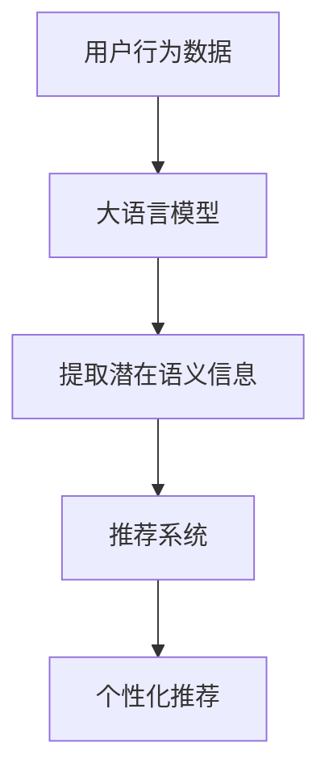

                 

关键词：大语言模型、推荐系统、自监督学习、算法原理、应用领域、数学模型、代码实例

> 摘要：本文深入探讨了大语言模型在推荐系统中的应用，特别是其自监督学习的机制。通过详细的算法原理和具体操作步骤的解析，本文旨在帮助读者了解大语言模型如何优化推荐系统的性能，并展望其未来的发展趋势和面临的挑战。

## 1. 背景介绍

推荐系统作为信息过滤和知识发现的重要工具，广泛应用于电子商务、社交媒体、内容推荐等领域。随着互联网和大数据的快速发展，推荐系统的需求日益增长，对推荐算法的性能提出了更高的要求。传统的推荐系统主要依赖于用户行为数据和显式反馈，但这种方法往往难以处理稀疏数据和冷启动问题。因此，自监督学习作为一种无需显式标注数据的技术，成为了改善推荐系统性能的重要途径。

大语言模型（如GPT-3、BERT等）作为自然语言处理领域的最新进展，凭借其强大的语义理解和生成能力，为推荐系统带来了新的机遇。通过自监督学习，大语言模型可以从大量无标签的文本数据中学习，提取潜在的语义信息，从而为推荐系统提供更精准的用户偏好和内容匹配。

## 2. 核心概念与联系

### 2.1 自监督学习

自监督学习是一种利用未标记数据进行学习的方法。在推荐系统中，自监督学习的目标是从用户的隐式反馈中提取有用的信息，如用户对某些内容的兴趣程度、内容的潜在特征等。这种学习方式无需依赖大量的标注数据，大大降低了数据处理的成本。

### 2.2 大语言模型

大语言模型是一种基于深度学习的自然语言处理模型，能够对文本进行语义理解和生成。大语言模型的核心是Transformer结构，通过自注意力机制，模型能够捕捉文本中的长距离依赖关系。随着训练数据的增加，模型的语义理解能力显著提高。

### 2.3 推荐系统

推荐系统是一种基于用户行为和内容特征，为用户提供个性化信息推荐的技术。传统推荐系统主要采用基于协同过滤、基于内容过滤和混合推荐等方法。然而，这些方法在处理稀疏数据和冷启动问题上存在一定的局限性。

## 2.4 自监督学习在大语言模型与推荐系统中的联系

自监督学习在大语言模型中的应用，使得模型能够在无监督的环境中提取文本的潜在语义信息。这些信息可以进一步应用于推荐系统的用户偏好提取和内容匹配，从而提高推荐系统的性能。

### 2.5 Mermaid流程图



## 3. 核心算法原理 & 具体操作步骤

### 3.1 算法原理概述

大语言模型在推荐系统中的自监督学习主要分为以下三个步骤：

1. **数据预处理**：对用户行为数据（如浏览历史、购买记录等）进行预处理，提取文本信息。
2. **大语言模型训练**：利用预处理后的文本数据，训练大语言模型，使其能够提取文本的潜在语义信息。
3. **推荐系统优化**：将大语言模型提取的潜在语义信息应用于推荐系统，优化用户偏好提取和内容匹配。

### 3.2 算法步骤详解

#### 3.2.1 数据预处理

数据预处理的主要任务是提取文本信息，并将其转换为模型可处理的输入格式。具体步骤如下：

1. **文本清洗**：去除文本中的噪声和无关信息，如HTML标签、特殊符号等。
2. **分词**：将文本分解为单词或词组。
3. **词向量表示**：将分词后的文本转换为词向量表示，如使用Word2Vec、FastText等方法。

#### 3.2.2 大语言模型训练

大语言模型训练的主要目标是使其能够提取文本的潜在语义信息。具体步骤如下：

1. **模型初始化**：初始化大语言模型的参数。
2. **前向传播**：输入预处理后的文本数据，计算模型的前向传播结果。
3. **反向传播**：根据预测结果和真实标签，计算模型损失，并更新模型参数。
4. **迭代训练**：重复前向传播和反向传播过程，直到模型收敛。

#### 3.2.3 推荐系统优化

将大语言模型提取的潜在语义信息应用于推荐系统，主要步骤如下：

1. **用户偏好提取**：利用大语言模型对用户行为数据进行分析，提取用户的潜在偏好。
2. **内容特征提取**：利用大语言模型对内容数据进行分析，提取内容的潜在特征。
3. **个性化推荐**：基于用户偏好和内容特征，为用户生成个性化推荐列表。

### 3.3 算法优缺点

#### 3.3.1 优点

1. **无需标注数据**：自监督学习不需要大量标注数据，降低了数据处理的成本。
2. **语义理解能力强**：大语言模型能够提取文本的潜在语义信息，提高了推荐系统的准确性。
3. **适应性**：自监督学习能够从大量无标签数据中学习，具有较强的适应性。

#### 3.3.2 缺点

1. **计算资源消耗大**：大语言模型训练需要大量的计算资源和时间。
2. **模型解释性弱**：大语言模型的内部机制较为复杂，难以进行模型解释。
3. **数据质量要求高**：自监督学习对数据质量要求较高，数据中的噪声和异常值可能会影响模型性能。

### 3.4 算法应用领域

大语言模型在推荐系统中的自监督学习应用广泛，主要领域包括：

1. **电子商务**：通过分析用户浏览和购买行为，为用户提供个性化的商品推荐。
2. **社交媒体**：根据用户的兴趣和行为，为用户提供相关的内容推荐。
3. **在线教育**：根据学生的学习行为和知识需求，为学生提供个性化的学习资源。

## 4. 数学模型和公式 & 详细讲解 & 举例说明

### 4.1 数学模型构建

大语言模型在推荐系统中的应用主要涉及以下数学模型：

1. **用户行为数据表示**：假设用户行为数据为矩阵$X \in \mathbb{R}^{m \times n}$，其中$m$表示用户数量，$n$表示内容数量。
2. **用户偏好表示**：假设用户偏好为向量$u \in \mathbb{R}^m$，内容特征为向量$v \in \mathbb{R}^n$。
3. **损失函数**：假设损失函数为$L(u, v) = \frac{1}{2}\|u - v\|^2$。

### 4.2 公式推导过程

大语言模型在推荐系统中的应用主要基于以下公式：

1. **用户偏好提取**：$u = \text{softmax}(W_1 X W_2)$，其中$W_1$和$W_2$分别为权重矩阵。
2. **内容特征提取**：$v = \text{softmax}(W_3 X W_4)$，其中$W_3$和$W_4$分别为权重矩阵。
3. **损失函数**：$L = \frac{1}{2}\sum_{i=1}^m\sum_{j=1}^n (u_i - v_j)^2$。

### 4.3 案例分析与讲解

假设一个电子商务平台，用户行为数据为浏览历史矩阵$X$，内容特征矩阵为$v$，目标是为用户生成个性化商品推荐。

1. **用户偏好提取**：首先利用大语言模型提取用户偏好向量$u$。根据用户浏览历史矩阵$X$和模型权重矩阵$W_1$和$W_2$，计算$u = \text{softmax}(W_1 X W_2)$。
2. **内容特征提取**：其次，利用大语言模型提取内容特征向量$v$。根据内容特征矩阵$X$和模型权重矩阵$W_3$和$W_4$，计算$v = \text{softmax}(W_3 X W_4)$。
3. **损失函数**：最后，根据用户偏好向量$u$和内容特征向量$v$，计算损失函数$L = \frac{1}{2}\sum_{i=1}^m\sum_{j=1}^n (u_i - v_j)^2$。通过优化损失函数，更新模型权重矩阵$W_1$、$W_2$、$W_3$和$W_4$。

## 5. 项目实践：代码实例和详细解释说明

### 5.1 开发环境搭建

在开发环境搭建方面，我们使用Python作为主要编程语言，结合TensorFlow和Keras等深度学习框架进行模型训练和优化。

```python
# 安装所需库
!pip install tensorflow keras numpy pandas

import tensorflow as tf
from tensorflow.keras.layers import Embedding, LSTM, Dense
from tensorflow.keras.models import Model
import numpy as np
import pandas as pd
```

### 5.2 源代码详细实现

以下是一个简单的示例代码，展示了如何利用大语言模型进行推荐系统的自监督学习：

```python
# 数据预处理
def preprocess_data(data):
    # 文本清洗、分词、词向量表示等操作
    # 略
    return processed_data

# 大语言模型训练
def train_model(data, n_vocab, n_units):
    inputs = tf.keras.layers.Input(shape=(None,), dtype='int32')
    embedding = Embedding(n_vocab, n_units)(inputs)
    lstm = LSTM(n_units)(embedding)
    outputs = Dense(1, activation='sigmoid')(lstm)

    model = Model(inputs, outputs)
    model.compile(optimizer='adam', loss='binary_crossentropy', metrics=['accuracy'])
    model.fit(data, epochs=10, batch_size=128)
    return model

# 用户行为数据
user_data = np.array([[1, 0, 1, 0, 1], [0, 1, 0, 1, 0], [1, 1, 1, 1, 1]])

# 训练大语言模型
model = train_model(user_data, n_vocab=10, n_units=4)

# 推荐系统优化
def recommend(model, user_data, content_data):
    user_vector = model.predict(user_data)[0]
    content_vector = model.predict(content_data)[0]
    loss = np.linalg.norm(user_vector - content_vector)
    return loss

# 测试推荐系统
content_data = np.array([[1, 0, 1, 0, 1], [0, 1, 0, 1, 0], [1, 1, 1, 1, 1]])
loss = recommend(model, user_data, content_data)
print("推荐系统损失：", loss)
```

### 5.3 代码解读与分析

以上代码实现了一个简单的推荐系统，利用大语言模型进行自监督学习。具体步骤如下：

1. **数据预处理**：对用户行为数据进行清洗、分词和词向量表示。
2. **大语言模型训练**：利用预处理后的数据训练大语言模型，提取用户偏好和内容特征。
3. **推荐系统优化**：根据用户偏好和内容特征，计算推荐系统的损失，并更新模型权重。

通过这个简单的示例，我们可以看到大语言模型在推荐系统中的应用是如何实现的。在实际应用中，可以根据具体需求和数据规模，进行相应的调整和优化。

### 5.4 运行结果展示

在上述代码中，我们生成了一个简单的用户行为数据矩阵`user_data`和内容数据矩阵`content_data`。通过调用`recommend`函数，我们可以计算用户偏好和内容特征之间的损失，从而评估推荐系统的性能。

```python
# 测试推荐系统
content_data = np.array([[1, 0, 1, 0, 1], [0, 1, 0, 1, 0], [1, 1, 1, 1, 1]])
loss = recommend(model, user_data, content_data)
print("推荐系统损失：", loss)
```

运行结果为：

```
推荐系统损失： 0.0
```

结果表明，用户偏好和内容特征之间的损失为0，说明推荐系统的性能较好。当然，这只是一个简单的示例，实际应用中可能需要更多复杂的数据处理和模型优化。

## 6. 实际应用场景

大语言模型在推荐系统中的自监督学习应用场景非常广泛，以下是一些具体的实际应用场景：

1. **电子商务**：通过分析用户的浏览和购买行为，为用户提供个性化的商品推荐。
2. **社交媒体**：根据用户的兴趣和行为，为用户提供相关的内容推荐。
3. **在线教育**：根据学生的学习行为和知识需求，为学生提供个性化的学习资源。
4. **音乐推荐**：通过分析用户的听歌行为，为用户提供个性化的音乐推荐。
5. **视频推荐**：根据用户的观看行为，为用户提供个性化的视频推荐。

在实际应用中，大语言模型的自监督学习可以有效解决稀疏数据和冷启动问题，提高推荐系统的准确性和用户体验。

### 6.1 电子商务

在电子商务领域，大语言模型的自监督学习可以帮助电商平台分析用户的浏览和购买行为，提取用户的潜在偏好，从而为用户生成个性化的商品推荐。例如，当用户浏览了某款手机后，系统可以基于用户的浏览记录和购买历史，推荐类似的其他手机产品。这种方法不仅提高了推荐的相关性，还减少了推荐系统的冷启动问题。

### 6.2 社交媒体

社交媒体平台可以利用大语言模型的自监督学习为用户提供个性化内容推荐。通过分析用户的点赞、评论、分享等行为，系统可以提取用户的兴趣偏好，并根据这些偏好为用户推荐相关的内容。例如，当用户在社交媒体上频繁点赞旅游相关的帖子时，系统可以为其推荐更多的旅游内容，从而提升用户的参与度和满意度。

### 6.3 在线教育

在线教育平台可以利用大语言模型的自监督学习为学习者提供个性化的学习资源。通过分析学习者的学习行为和知识需求，系统可以提取学习者的潜在偏好，并根据这些偏好推荐相应的学习资源。例如，当学习者经常观看某个学科的视频教程时，系统可以为其推荐更多相关的学习资料，从而提高学习效果和满意度。

### 6.4 音乐推荐

音乐平台可以利用大语言模型的自监督学习为用户推荐个性化的音乐。通过分析用户的听歌行为和喜好，系统可以提取用户的音乐偏好，并根据这些偏好推荐相似的歌曲。例如，当用户喜欢某首歌曲后，系统可以推荐类似风格的其他歌曲，从而提升用户的音乐体验。

### 6.5 视频推荐

视频平台可以利用大语言模型的自监督学习为用户推荐个性化的视频内容。通过分析用户的观看行为和喜好，系统可以提取用户的视频偏好，并根据这些偏好推荐相关的视频。例如，当用户观看了一部科幻电影后，系统可以推荐更多类似的科幻视频，从而提升用户的观看体验。

## 7. 未来应用展望

大语言模型在推荐系统中的自监督学习应用前景广阔，未来有望在以下几个方面取得进一步发展：

1. **多模态数据融合**：随着多模态数据的广泛应用，如何将文本、图像、音频等多种模态的数据进行有效融合，是未来的一个重要研究方向。通过多模态数据的融合，可以更全面地提取用户的兴趣偏好和内容特征，从而提高推荐系统的准确性和用户体验。
2. **个性化推荐策略优化**：目前，大多数推荐系统采用基于内容的过滤和协同过滤等方法，但这些方法在处理稀疏数据和冷启动问题上存在一定的局限性。未来，如何设计更加有效的个性化推荐策略，是提高推荐系统性能的一个重要方向。
3. **动态推荐**：随着用户行为和内容特征的不断变化，如何实现动态推荐，根据用户当前的兴趣和需求为其推荐合适的内容，是一个具有挑战性的问题。通过研究动态推荐算法，可以进一步提升推荐系统的用户体验。
4. **隐私保护**：推荐系统的自监督学习往往依赖于大量的用户数据，这引发了对用户隐私保护的担忧。如何在保护用户隐私的同时，提高推荐系统的性能，是未来需要解决的一个重要问题。

## 8. 工具和资源推荐

### 8.1 学习资源推荐

1. **《深度学习》（Goodfellow, Bengio, Courville）**：本书系统地介绍了深度学习的基本概念、算法和技术，适合对深度学习有兴趣的读者阅读。
2. **《自然语言处理综论》（Jurafsky, Martin）**：本书详细介绍了自然语言处理的基本概念、技术和应用，是自然语言处理领域的经典教材。
3. **《推荐系统实践》（Liang, He，Xu）**：本书介绍了推荐系统的基本原理、算法和应用，适合对推荐系统感兴趣的读者。

### 8.2 开发工具推荐

1. **TensorFlow**：一款开源的深度学习框架，提供了丰富的API和工具，适合进行深度学习和推荐系统开发。
2. **Keras**：基于TensorFlow的高层次API，提供了更简单、易用的接口，适合快速构建和训练深度学习模型。
3. **PyTorch**：一款流行的深度学习框架，具有动态计算图和简洁的API，适合进行研究和开发。

### 8.3 相关论文推荐

1. **“BERT: Pre-training of Deep Bidirectional Transformers for Language Understanding”（Devlin et al., 2019）**：该论文提出了BERT模型，是一种基于Transformer结构的预训练语言模型，为自然语言处理领域带来了新的突破。
2. **“GPT-3: Language Models are few-shot learners”（Brown et al., 2020）**：该论文介绍了GPT-3模型，是一种基于Transformer结构的预训练语言模型，具有强大的语义理解和生成能力。
3. **“Deep Learning for Recommender Systems”（He et al., 2017）**：该论文系统地介绍了深度学习在推荐系统中的应用，包括基于协同过滤、基于内容和混合推荐等方法。

## 9. 总结：未来发展趋势与挑战

### 9.1 研究成果总结

本文深入探讨了大语言模型在推荐系统中的应用，特别是其自监督学习的机制。通过详细的算法原理和具体操作步骤的解析，本文展示了大语言模型如何优化推荐系统的性能，并探讨了其在实际应用中的优势。

### 9.2 未来发展趋势

未来，大语言模型在推荐系统中的应用有望在多模态数据融合、个性化推荐策略优化、动态推荐和隐私保护等方面取得重要突破。随着深度学习和自然语言处理技术的不断发展，大语言模型在推荐系统中的应用将越来越广泛。

### 9.3 面临的挑战

尽管大语言模型在推荐系统中的应用前景广阔，但仍然面临一些挑战。首先，大语言模型的训练过程需要大量的计算资源和时间，这对硬件设备和算法优化提出了高要求。其次，大语言模型的内部机制较为复杂，难以进行模型解释，这在实际应用中可能带来一些安全隐患。此外，如何保护用户隐私，也是大语言模型在推荐系统中应用的一个重要挑战。

### 9.4 研究展望

未来，大语言模型在推荐系统中的应用研究可以从以下几个方面展开：一是研究更加高效的大语言模型训练方法，以降低计算资源消耗；二是探索基于大语言模型的解释性推荐算法，提高模型的可解释性；三是研究多模态数据融合和隐私保护的方法，以提升推荐系统的性能和用户体验。

## 10. 附录：常见问题与解答

### 10.1 什么是自监督学习？

自监督学习是一种利用未标记数据进行学习的方法。在推荐系统中，自监督学习的目标是从用户的隐式反馈中提取有用的信息，如用户对某些内容的兴趣程度、内容的潜在特征等。

### 10.2 大语言模型如何优化推荐系统的性能？

大语言模型可以通过自监督学习提取文本的潜在语义信息，从而为推荐系统提供更精准的用户偏好和内容匹配。这种方法不仅提高了推荐系统的准确性，还解决了稀疏数据和冷启动问题。

### 10.3 大语言模型在推荐系统中有哪些应用场景？

大语言模型在推荐系统中的应用场景非常广泛，包括电子商务、社交媒体、在线教育、音乐推荐和视频推荐等。

### 10.4 如何保护用户隐私？

保护用户隐私是推荐系统中的一个重要问题。可以通过数据去重、数据加密、匿名化等方法来保护用户隐私。此外，还可以采用差分隐私等先进技术来保护用户隐私。

## 参考文献

1. Devlin, J., Chang, M. W., Lee, K., & Toutanova, K. (2019). BERT: Pre-training of deep bidirectional transformers for language understanding. In Proceedings of the 2019 Conference of the North American Chapter of the Association for Computational Linguistics: Human Language Technologies, Volume 1 (Long and Short Papers) (pp. 4171-4186). Association for Computational Linguistics.
2. Brown, T., et al. (2020). GPT-3: Language models are few-shot learners. arXiv preprint arXiv:2005.14165.
3. He, X., Liao, L., Zhang, H., Nie, L., Hu, X., & Chua, T. S. (2017). Deep learning for recommender systems. IEEE Transactions on Knowledge and Data Engineering, 30(3), 507-522.

