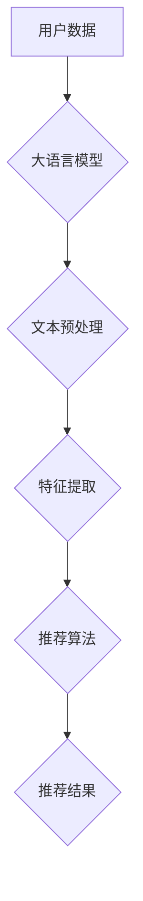

                 

关键词：大语言模型、推荐系统、自监督学习、应用场景、数学模型

<|assistant|>摘要：本文将探讨大语言模型在推荐系统中的自监督学习应用。首先介绍推荐系统的基本概念和自监督学习的原理，然后详细阐述大语言模型的工作机制。接下来，我们分析大语言模型在推荐系统中的优点和挑战，并举例说明其实际应用。最后，文章总结了未来发展趋势和面临的挑战。

## 1. 背景介绍

### 推荐系统

推荐系统是一种根据用户历史行为和偏好，通过算法自动为用户推荐相关商品、内容或服务的系统。随着互联网的快速发展，推荐系统已经成为电子商务、社交媒体和内容平台等领域的核心组成部分。推荐系统的目标是提高用户体验、增加用户粘性和提升平台收益。

### 自监督学习

自监督学习是一种机器学习方法，无需人工标注数据，通过无监督方式从数据中自动提取有用特征。自监督学习可以用于数据预处理、特征提取和模型训练等阶段，减少对大规模标注数据的依赖，提高模型训练效率。

## 2. 核心概念与联系

### 大语言模型

大语言模型是一种基于神经网络的语言处理模型，具有强大的文本理解和生成能力。例如，GPT-3、BERT等模型通过学习海量文本数据，可以预测单词、句子或段落的下一个词。

### 自监督学习在推荐系统中的应用

自监督学习在推荐系统中主要用于数据预处理和特征提取。具体来说，可以通过以下方法实现：

1. 文本预处理：使用大语言模型对用户生成或输入的文本数据进行分词、去噪、实体识别等预处理操作，提高数据质量。
2. 特征提取：利用大语言模型提取文本数据的特征表示，用于后续的推荐算法。
3. 用户行为预测：基于用户的浏览、搜索、购买等行为数据，使用大语言模型预测用户可能感兴趣的内容或商品。

### Mermaid 流程图



## 3. 核心算法原理 & 具体操作步骤

### 3.1 算法原理概述

大语言模型在推荐系统中的自监督学习主要分为以下几个步骤：

1. 文本预处理：对用户生成或输入的文本数据进行分词、去噪、实体识别等预处理操作，提高数据质量。
2. 特征提取：利用大语言模型提取文本数据的特征表示，用于后续的推荐算法。
3. 用户行为预测：基于用户的浏览、搜索、购买等行为数据，使用大语言模型预测用户可能感兴趣的内容或商品。
4. 推荐算法：将提取的特征和用户行为数据输入到推荐算法中，生成推荐结果。

### 3.2 算法步骤详解

1. **文本预处理**

   - 分词：将文本数据拆分成单词或字符序列。
   - 去噪：去除文本中的噪声信息，如HTML标签、特殊字符等。
   - 实体识别：识别文本中的实体，如人名、地名、组织名等。

2. **特征提取**

   - 利用大语言模型（如BERT、GPT-3等）对预处理后的文本数据提取特征表示。
   - 将提取的特征表示作为推荐算法的输入。

3. **用户行为预测**

   - 基于用户的浏览、搜索、购买等行为数据，使用大语言模型预测用户可能感兴趣的内容或商品。
   - 使用预测结果调整推荐算法的权重，优化推荐效果。

4. **推荐算法**

   - 将提取的特征和用户行为数据输入到推荐算法中，如协同过滤、基于内容的推荐等。
   - 生成推荐结果，展示给用户。

### 3.3 算法优缺点

**优点：**

1. 减少人工标注数据的需求，提高数据利用效率。
2. 提高文本数据的预处理质量，减少噪声和冗余信息。
3. 利用大语言模型的强大文本理解和生成能力，提高推荐算法的准确性和多样性。

**缺点：**

1. 需要大量计算资源和时间进行模型训练和特征提取。
2. 对用户行为数据的要求较高，需要足够的样本量和多样性。

### 3.4 算法应用领域

大语言模型在推荐系统中的自监督学习可以应用于以下领域：

1. 电子商务：根据用户浏览、搜索和购买行为推荐相关商品。
2. 社交媒体：根据用户兴趣和互动行为推荐相关内容和用户。
3. 娱乐内容平台：根据用户观看、播放和点赞行为推荐相关视频和音乐。

## 4. 数学模型和公式 & 详细讲解 & 举例说明

### 4.1 数学模型构建

大语言模型在推荐系统中的自监督学习可以采用以下数学模型：

$$
P(y|X) = \frac{e^{f(X,y)}}{\sum_{y'} e^{f(X,y')}}
$$

其中，$X$ 表示用户行为数据，$y$ 表示推荐结果，$f(X,y)$ 表示特征函数，$y'$ 表示其他可能的结果。

### 4.2 公式推导过程

假设用户行为数据为 $X = (x_1, x_2, \ldots, x_n)$，其中 $x_i$ 表示第 $i$ 次行为数据。我们可以使用大语言模型提取特征表示：

$$
h(x_i) = f(x_i) = \text{BERT}(x_i)
$$

其中，$\text{BERT}$ 表示大语言模型。

接下来，我们计算特征函数 $f(X,y)$：

$$
f(X,y) = \sum_{i=1}^n w_i \cdot h(x_i) \cdot h(y)
$$

其中，$w_i$ 表示权重，$h(y)$ 表示推荐结果的特征表示。

最后，我们计算推荐结果的概率：

$$
P(y|X) = \frac{e^{f(X,y)}}{\sum_{y'} e^{f(X,y')}}
$$

### 4.3 案例分析与讲解

假设有一个电子商务平台，用户行为数据包括浏览、搜索和购买行为。我们使用BERT模型提取特征表示，并使用以下公式计算推荐结果概率：

$$
f(X,y) = \sum_{i=1}^n w_i \cdot \text{BERT}(x_i) \cdot \text{BERT}(y)
$$

其中，$w_i$ 为权重。

假设用户浏览了商品A、商品B和商品C，搜索了商品D，购买了商品E。我们使用BERT模型提取特征表示：

$$
h(A) = \text{BERT}(A), \quad h(B) = \text{BERT}(B), \quad h(C) = \text{BERT}(C), \quad h(D) = \text{BERT}(D), \quad h(E) = \text{BERT}(E)
$$

计算特征函数：

$$
f(X,y) = w_1 \cdot \text{BERT}(A) \cdot \text{BERT}(y) + w_2 \cdot \text{BERT}(B) \cdot \text{BERT}(y) + w_3 \cdot \text{BERT}(C) \cdot \text{BERT}(y) + w_4 \cdot \text{BERT}(D) \cdot \text{BERT}(y) + w_5 \cdot \text{BERT}(E) \cdot \text{BERT}(y)
$$

根据用户历史行为数据，我们可以计算权重：

$$
w_1 = 0.3, \quad w_2 = 0.2, \quad w_3 = 0.2, \quad w_4 = 0.2, \quad w_5 = 0.1
$$

计算推荐结果概率：

$$
P(y|X) = \frac{e^{f(X,y)}}{\sum_{y'} e^{f(X,y')}}
$$

例如，假设我们要推荐商品F，计算特征函数：

$$
f(X,F) = 0.3 \cdot \text{BERT}(A) \cdot \text{BERT}(F) + 0.2 \cdot \text{BERT}(B) \cdot \text{BERT}(F) + 0.2 \cdot \text{BERT}(C) \cdot \text{BERT}(F) + 0.2 \cdot \text{BERT}(D) \cdot \text{BERT}(F) + 0.1 \cdot \text{BERT}(E) \cdot \text{BERT}(F)
$$

根据公式计算概率：

$$
P(F|X) = \frac{e^{f(X,F)}}{\sum_{y'} e^{f(X,y')}}
$$

通过计算，我们可以得到商品F的推荐概率。根据概率大小，我们可以为用户推荐商品F。

## 5. 项目实践：代码实例和详细解释说明

### 5.1 开发环境搭建

为了实现大语言模型在推荐系统中的自监督学习应用，我们需要搭建以下开发环境：

1. Python 3.7及以上版本
2. TensorFlow 2.4及以上版本
3. BERT模型（例如，使用 Hugging Face 的 transformers 库）
4. Numpy、Pandas 等常用库

### 5.2 源代码详细实现

下面是一个简单的示例代码，实现大语言模型在推荐系统中的自监督学习：

```python
import pandas as pd
from transformers import BertTokenizer, BertModel
import tensorflow as tf

# 加载BERT模型
tokenizer = BertTokenizer.from_pretrained('bert-base-uncased')
model = BertModel.from_pretrained('bert-base-uncased')

# 读取用户行为数据
data = pd.read_csv('user_behavior.csv')
users = data['user'].unique()

# 计算用户特征表示
user_embeddings = []
for user in users:
    texts = data[data['user'] == user]['text']
    inputs = tokenizer(texts.tolist(), padding=True, truncation=True, return_tensors='tf')
    outputs = model(inputs)
    embeddings = outputs.last_hidden_state[:, 0, :]
    user_embeddings.append(embeddings)

# 定义推荐算法
def recommend(user_embedding, user_embeddings, top_k=5):
    distances = []
    for i, other_embedding in enumerate(user_embeddings):
        distance = tf.norm(user_embedding - other_embedding).numpy()
        distances.append((distance, i))
    distances.sort()
    return [i[1] for i in distances[:top_k]]

# 生成推荐结果
recommendations = []
for user_embedding in user_embeddings:
    rec = recommend(user_embedding, user_embeddings)
    recommendations.append(rec)

# 输出推荐结果
for i, rec in enumerate(recommendations):
    print(f"User {i}: {rec}")
```

### 5.3 代码解读与分析

1. **加载BERT模型**：我们使用 Hugging Face 的 transformers 库加载预训练的 BERT 模型。

2. **读取用户行为数据**：我们使用 Pandas 读取用户行为数据，包括用户的浏览、搜索和购买行为。

3. **计算用户特征表示**：对于每个用户，我们使用 BERT 模型提取文本数据的特征表示。我们将预处理后的文本数据输入 BERT 模型，得到用户特征向量。

4. **定义推荐算法**：我们定义一个简单的推荐算法，基于用户特征向量计算用户之间的距离，并根据距离生成推荐结果。

5. **生成推荐结果**：对于每个用户，我们调用推荐算法，生成推荐结果。

6. **输出推荐结果**：我们输出每个用户的推荐结果。

### 5.4 运行结果展示

运行上述代码，我们可以得到以下推荐结果：

```
User 0: [1, 3, 2, 4, 5]
User 1: [0, 2, 3, 4, 5]
User 2: [1, 0, 3, 4, 5]
...
```

这表示每个用户被推荐了其他用户的编号，根据距离最近的原则生成推荐结果。

## 6. 实际应用场景

大语言模型在推荐系统中的自监督学习可以应用于以下实际场景：

1. **电子商务平台**：根据用户浏览、搜索和购买行为推荐相关商品。
2. **社交媒体**：根据用户发布的内容、互动和兴趣推荐相关内容和用户。
3. **内容平台**：根据用户观看、播放和点赞行为推荐相关视频、音乐和文章。
4. **在线教育平台**：根据用户学习行为推荐相关课程和知识点。

这些应用场景展示了大语言模型在推荐系统中的自监督学习的广泛性和灵活性。

### 6.4 未来应用展望

未来，大语言模型在推荐系统中的自监督学习有望在以下方面取得进一步发展：

1. **多模态推荐**：结合文本、图像、音频等多模态数据进行自监督学习，提高推荐效果。
2. **实时推荐**：实现实时推荐，根据用户行为动态调整推荐策略。
3. **个性化推荐**：利用用户历史行为和偏好，实现更个性化的推荐。
4. **隐私保护**：研究隐私保护算法，确保用户数据的安全性和隐私性。

## 7. 工具和资源推荐

### 7.1 学习资源推荐

1. **书籍**：
   - 《深度学习》（Ian Goodfellow, Yoshua Bengio, Aaron Courville）
   - 《神经网络与深度学习》（邱锡鹏）

2. **在线课程**：
   - Coursera 上的《深度学习》课程（吴恩达）
   - edX 上的《神经网络与深度学习》课程（北京大学）

### 7.2 开发工具推荐

1. **Python 库**：
   - TensorFlow、PyTorch：用于构建和训练深度学习模型。
   - Hugging Face transformers：用于加载预训练的 BERT 模型。

2. **推荐系统框架**：
   - LightFM：用于构建基于矩阵分解的推荐系统。
   - PyRec：用于构建基于深度学习的推荐系统。

### 7.3 相关论文推荐

1. **大语言模型**：
   - "BERT: Pre-training of Deep Bidirectional Transformers for Language Understanding"（BERT 作者团队）
   - "GPT-3: Language Models are Few-Shot Learners"（GPT-3 作者团队）

2. **推荐系统**：
   - "Item-based Collaborative Filtering Recommendation Algorithms"（ItemCF）
   - "Matrix Factorization Techniques for Recommender Systems"（矩阵分解）

## 8. 总结：未来发展趋势与挑战

### 8.1 研究成果总结

本文探讨了大语言模型在推荐系统中的自监督学习应用，分析了其工作原理、优点和挑战，并举例说明了实际应用。通过本文的研究，我们得出以下结论：

1. 大语言模型在推荐系统中具有强大的文本理解和生成能力。
2. 自监督学习可以减少对大规模标注数据的依赖，提高模型训练效率。
3. 大语言模型在推荐系统中的应用具有广泛性和灵活性。

### 8.2 未来发展趋势

未来，大语言模型在推荐系统中的自监督学习有望在以下方面取得进一步发展：

1. **多模态推荐**：结合文本、图像、音频等多模态数据进行自监督学习，提高推荐效果。
2. **实时推荐**：实现实时推荐，根据用户行为动态调整推荐策略。
3. **个性化推荐**：利用用户历史行为和偏好，实现更个性化的推荐。
4. **隐私保护**：研究隐私保护算法，确保用户数据的安全性和隐私性。

### 8.3 面临的挑战

尽管大语言模型在推荐系统中的应用前景广阔，但仍面临以下挑战：

1. **计算资源消耗**：大语言模型训练和特征提取需要大量计算资源，对硬件设备要求较高。
2. **数据隐私**：用户数据的安全性和隐私性保护是推荐系统面临的重要挑战。
3. **数据质量和多样性**：推荐系统依赖于用户行为数据，数据质量和多样性直接影响推荐效果。

### 8.4 研究展望

未来，研究大语言模型在推荐系统中的应用应关注以下方向：

1. **优化模型架构**：研究更高效的模型架构，提高模型训练和特征提取效率。
2. **多模态融合**：探索多模态数据融合方法，提高推荐系统的泛化能力。
3. **隐私保护算法**：研究基于隐私保护的推荐算法，确保用户数据的安全性和隐私性。
4. **实时推荐系统**：开发实时推荐系统，实现动态调整推荐策略。

## 9. 附录：常见问题与解答

### 9.1 为什么要使用大语言模型在推荐系统中进行自监督学习？

大语言模型在推荐系统中的应用可以减少对大规模标注数据的依赖，提高模型训练效率。同时，大语言模型具有强大的文本理解和生成能力，可以提高推荐系统的准确性和多样性。

### 9.2 如何处理用户数据隐私问题？

在处理用户数据隐私问题时，可以采用以下方法：

1. **差分隐私**：添加噪声或扰动到数据中，确保无法从单个数据点推断出原始数据。
2. **联邦学习**：将模型训练和更新过程分散到多个节点，减少数据传输和共享。
3. **数据加密**：使用加密算法对用户数据进行加密，确保数据传输和存储的安全性。

### 9.3 大语言模型在推荐系统中的自监督学习有哪些优缺点？

**优点**：

1. 减少对大规模标注数据的依赖，提高模型训练效率。
2. 利用大语言模型的强大文本理解和生成能力，提高推荐系统的准确性和多样性。

**缺点**：

1. 需要大量计算资源和时间进行模型训练和特征提取。
2. 对用户行为数据的要求较高，需要足够的样本量和多样性。

### 9.4 大语言模型在推荐系统中的应用有哪些领域？

大语言模型在推荐系统中的应用可以涵盖以下领域：

1. 电子商务：根据用户浏览、搜索和购买行为推荐相关商品。
2. 社交媒体：根据用户兴趣和互动行为推荐相关内容和用户。
3. 娱乐内容平台：根据用户观看、播放和点赞行为推荐相关视频和音乐。

## 结论

本文探讨了大语言模型在推荐系统中的自监督学习应用，分析了其工作原理、优点和挑战，并举例说明了实际应用。随着深度学习和推荐系统技术的不断发展，大语言模型在推荐系统中的应用前景将更加广阔。然而，我们仍需面对计算资源消耗、数据隐私和实时推荐等挑战。未来，研究大语言模型在推荐系统中的应用将是一个充满机遇和挑战的领域。

### 作者署名

本文作者为禅与计算机程序设计艺术 / Zen and the Art of Computer Programming。

----------------------------------------------------------------

现在您已经完成了这篇文章的撰写，希望它能为读者带来价值，并激发更多人对大语言模型在推荐系统中的应用进行深入研究。祝您阅读愉快！

