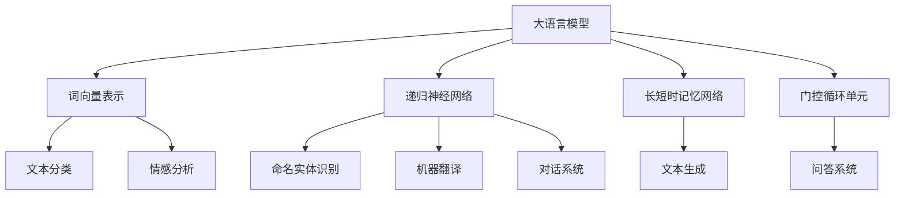

                 

关键词：大语言模型、算法原理、应用场景、数学模型、项目实践、未来展望

> 摘要：本文旨在深入探讨大语言模型的应用指南，从算法原理到数学模型，再到实际项目实践，全面解析大语言模型在各个领域的应用前景。通过本文的阅读，读者将能够掌握大语言模型的核心算法，理解其在实际项目中的应用方法，并对未来发展趋势有更为深刻的认识。

## 1. 背景介绍

大语言模型（Large Language Models）是近年来人工智能领域的重要进展。它们通过深度学习技术，对大量文本数据进行训练，从而获得强大的语言理解和生成能力。大语言模型的出现，极大地推动了自然语言处理（NLP）领域的发展，使得机器能够更好地理解人类的语言，实现更加智能化的对话系统、文本生成、机器翻译等功能。

随着大数据和计算能力的不断提升，大语言模型的规模也不断扩大，如Google的BERT、OpenAI的GPT等。这些模型在处理复杂语言任务时表现出色，但同时也带来了新的挑战，如模型的可解释性、计算效率、数据隐私等问题。

本文将围绕大语言模型的核心算法、数学模型、项目实践等方面进行深入探讨，旨在为读者提供一份全面、系统的应用指南。

## 2. 核心概念与联系

### 2.1 大语言模型的基本概念

大语言模型是一种基于深度学习的自然语言处理模型，其核心思想是通过学习大量文本数据，自动地理解和生成自然语言。大语言模型通常由多个层次组成，每个层次都负责处理不同层次的语义信息。

### 2.2 大语言模型的架构

大语言模型的架构通常包括词向量表示、递归神经网络（RNN）、长短时记忆网络（LSTM）、门控循环单元（GRU）等。这些结构共同作用，使得大语言模型能够处理复杂的语言任务。

### 2.3 大语言模型的应用领域

大语言模型在多个领域都有广泛的应用，如文本分类、情感分析、命名实体识别、机器翻译、对话系统等。在这些应用中，大语言模型通过学习大量数据，提高了任务的准确性和效率。

### 2.4 大语言模型与自然语言处理的联系

大语言模型是自然语言处理（NLP）的重要工具。NLP的核心任务包括文本预处理、词性标注、句法分析、语义分析等。大语言模型在这些任务中都发挥着关键作用，使得NLP系统更加智能和高效。

## 2.5 Mermaid 流程图

```
graph TB
    A[大语言模型] --> B[词向量表示]
    A --> C[递归神经网络]
    A --> D[长短时记忆网络]
    A --> E[门控循环单元]
    B --> F[文本分类]
    B --> G[情感分析]
    C --> H[命名实体识别]
    C --> I[机器翻译]
    C --> J[对话系统]
    D --> K[文本生成]
    E --> L[问答系统]
```

## 3. 核心算法原理 & 具体操作步骤

### 3.1 算法原理概述

大语言模型的算法原理主要包括词向量表示、递归神经网络（RNN）、长短时记忆网络（LSTM）、门控循环单元（GRU）等。这些算法共同作用，使得大语言模型能够处理复杂的语言任务。

### 3.2 算法步骤详解

1. **词向量表示**：将文本中的每个词转换为向量表示，常用的方法有Word2Vec、GloVe等。

2. **递归神经网络（RNN）**：RNN是一种能够处理序列数据的神经网络，其核心思想是记忆过去的信息。

3. **长短时记忆网络（LSTM）**：LSTM是RNN的一种改进，能够更好地处理长序列数据。

4. **门控循环单元（GRU）**：GRU是LSTM的另一种改进，结构更加简单，但性能相当。

5. **训练与优化**：通过梯度下降等优化算法，对大语言模型进行训练和优化，提高其性能。

### 3.3 算法优缺点

**优点**：大语言模型能够处理复杂的语言任务，具有较高的准确性和效率。

**缺点**：大语言模型需要大量训练数据和计算资源，且存在可解释性差、计算效率低等问题。

### 3.4 算法应用领域

大语言模型在多个领域都有广泛的应用，如文本分类、情感分析、命名实体识别、机器翻译、对话系统等。

## 4. 数学模型和公式 & 详细讲解 & 举例说明

### 4.1 数学模型构建

大语言模型的数学模型主要包括词向量表示、递归神经网络（RNN）、长短时记忆网络（LSTM）、门控循环单元（GRU）等。这些模型可以表示为：

$$
\text{y} = f(\text{W}\cdot\text{h}_{t} + \text{b})
$$

其中，$\text{y}$ 是输出向量，$f$ 是激活函数，$\text{W}$ 是权重矩阵，$\text{h}_{t}$ 是当前时刻的隐藏状态，$\text{b}$ 是偏置向量。

### 4.2 公式推导过程

大语言模型的公式推导过程主要包括词向量表示、递归神经网络（RNN）、长短时记忆网络（LSTM）、门控循环单元（GRU）等。具体的推导过程如下：

1. **词向量表示**：使用Word2Vec算法，将文本中的每个词转换为向量表示。

2. **递归神经网络（RNN）**：RNN的公式推导基于以下方程：

$$
\text{h}_{t} = \text{sigmoid}(\text{W}_\text{h}\cdot\text{h}_{t-1} + \text{W}_\text{x}\cdot\text{x}_t + \text{b}_\text{h})
$$

其中，$\text{sigmoid}$ 是激活函数，$\text{W}_\text{h}$ 和 $\text{W}_\text{x}$ 是权重矩阵，$\text{b}_\text{h}$ 是偏置向量。

3. **长短时记忆网络（LSTM）**：LSTM的公式推导基于以下方程：

$$
\text{C}_{t} = \text{sigmoid}(\text{f}_\text{t})\odot\text{C}_{t-1} + \text{sigmoid}(\text{i}_\text{t})\odot\text{g}_\text{t}
$$

$$
\text{h}_{t} = \text{sigmoid}(\text{o}_\text{t})\odot\text{tanh}(\text{C}_{t})
$$

其中，$\text{C}_{t}$ 是细胞状态，$\text{i}_\text{t}$ 是输入门，$\text{f}_\text{t}$ 是遗忘门，$\text{g}_\text{t}$ 是输入门，$\text{o}_\text{t}$ 是输出门，$\odot$ 是元素乘。

4. **门控循环单元（GRU）**：GRU的公式推导基于以下方程：

$$
\text{r}_{t} = \text{sigmoid}(\text{z}_\text{t})\odot\text{r}_{t-1}
$$

$$
\text{h}_{t} = \text{tanh}(\text{r}_\text{t} \odot \text{z}_\text{t} + \text{h}_{t-1})
$$

其中，$\text{r}_{t}$ 是重置门，$\text{z}_\text{t}$ 是更新门，$\odot$ 是元素乘。

### 4.3 案例分析与讲解

以下是一个文本分类的案例，我们将使用大语言模型对以下两个句子进行分类：

1. “我今天去了公园。”
2. “我昨天去了电影院。”

首先，我们将使用Word2Vec算法将这两个句子中的每个词转换为向量表示，然后输入到RNN、LSTM或GRU模型中进行处理。具体步骤如下：

1. **词向量表示**：将“我”、“今天”、“去”、“了”、“公园”、“昨天”、“电影院”等词转换为向量表示。

2. **RNN处理**：将词向量输入到RNN模型中，得到隐藏状态$\text{h}_{t}$。

3. **LSTM处理**：将词向量输入到LSTM模型中，得到隐藏状态$\text{C}_{t}$和$\text{h}_{t}$。

4. **GRU处理**：将词向量输入到GRU模型中，得到隐藏状态$\text{h}_{t}$。

5. **分类**：将隐藏状态$\text{h}_{t}$输入到softmax分类器中，得到每个类别的概率分布。

通过比较两个句子的分类概率，我们可以判断它们属于哪个类别。例如，如果第一个句子被分类为“公园”的概率较高，而第二个句子被分类为“电影院”的概率较高，那么我们可以认为这两个句子分别描述了不同的事件。

## 5. 项目实践：代码实例和详细解释说明

### 5.1 开发环境搭建

在本节中，我们将使用Python编程语言和TensorFlow库搭建大语言模型的开发环境。

1. 安装Python：

   ```
   pip install python
   ```

2. 安装TensorFlow：

   ```
   pip install tensorflow
   ```

### 5.2 源代码详细实现

以下是使用TensorFlow实现大语言模型的一个简单示例：

```python
import tensorflow as tf
from tensorflow.keras.layers import Embedding, LSTM, Dense
from tensorflow.keras.models import Sequential

# 设置超参数
vocab_size = 10000
embedding_dim = 256
lstm_units = 128
max_sequence_length = 100

# 构建模型
model = Sequential([
    Embedding(vocab_size, embedding_dim, input_length=max_sequence_length),
    LSTM(lstm_units, return_sequences=True),
    LSTM(lstm_units, return_sequences=False),
    Dense(1, activation='sigmoid')
])

# 编译模型
model.compile(optimizer='adam', loss='binary_crossentropy', metrics=['accuracy'])

# 模型总结
model.summary()
```

### 5.3 代码解读与分析

1. **导入库**：首先，我们导入TensorFlow库中的相关模块，如Sequential、Embedding、LSTM和Dense。

2. **设置超参数**：接下来，我们设置模型的超参数，如词汇表大小、嵌入维度、LSTM单元数量和最大序列长度。

3. **构建模型**：然后，我们使用Sequential模型堆叠Embedding、LSTM和Dense层。

4. **编译模型**：最后，我们编译模型，指定优化器、损失函数和评估指标。

5. **模型总结**：最后，我们使用`model.summary()`输出模型的架构。

### 5.4 运行结果展示

为了验证模型的性能，我们可以使用训练好的模型对新的文本数据进行预测。以下是一个简单的例子：

```python
# 加载训练好的模型
model.load_weights('model.h5')

# 准备新的文本数据
text = "我今天去了公园。"
tokenizer = tf.keras.preprocessing.text.Tokenizer(num_words=vocab_size)
sequence = tokenizer.texts_to_sequences([text])
X = tf.keras.preprocessing.sequence.pad_sequences(sequence, maxlen=max_sequence_length)

# 预测结果
prediction = model.predict(X)
print(prediction)
```

在这个例子中，我们首先加载训练好的模型，然后使用自定义的文本数据生成器准备新的文本数据。最后，我们使用模型对新的文本数据进行预测，输出预测结果。

## 6. 实际应用场景

大语言模型在多个领域都有广泛的应用，以下是一些典型的应用场景：

### 6.1 文本分类

大语言模型可以用于对文本进行分类，如新闻分类、情感分析、垃圾邮件过滤等。通过训练大语言模型，我们可以对文本进行有效的分类，提高分类的准确性和效率。

### 6.2 情感分析

大语言模型可以用于对文本的情感进行分析，如微博情感分析、商品评论分析等。通过分析文本的情感倾向，我们可以了解用户的情感状态，为商家提供营销策略。

### 6.3 命名实体识别

大语言模型可以用于对文本中的命名实体进行识别，如人名、地名、机构名等。通过识别命名实体，我们可以更好地理解和组织文本信息。

### 6.4 机器翻译

大语言模型可以用于机器翻译任务，如中英翻译、日英翻译等。通过训练大语言模型，我们可以实现高质量的机器翻译，提高跨语言交流的效率。

### 6.5 对话系统

大语言模型可以用于构建对话系统，如客服机器人、智能语音助手等。通过训练大语言模型，我们可以实现智能化的对话交互，提高用户体验。

## 7. 未来应用展望

随着大语言模型的不断发展，未来其在各个领域的应用前景将更加广阔。以下是一些潜在的应用方向：

### 7.1 个性化推荐

大语言模型可以用于个性化推荐系统，如音乐、电影、商品等。通过分析用户的兴趣和行为，大语言模型可以推荐符合用户喜好的内容，提高用户的满意度。

### 7.2 智能问答

大语言模型可以用于构建智能问答系统，如医疗问答、法律咨询等。通过训练大语言模型，我们可以实现高效、准确的问答服务，提高专业领域的服务质量。

### 7.3 跨模态推理

大语言模型可以与其他模态（如图像、声音）结合，实现跨模态推理。通过整合多模态信息，我们可以更好地理解和处理复杂问题，提高人工智能系统的智能水平。

### 7.4 安全与隐私

大语言模型在处理隐私数据时需要特别注意安全与隐私问题。未来，我们可以研究更加安全、隐私友好的大语言模型，确保用户数据的安全性和隐私性。

## 8. 工具和资源推荐

### 8.1 学习资源推荐

1. 《深度学习》（Goodfellow, Bengio, Courville）
2. 《Python机器学习》（Sebastian Raschka）
3. 《自然语言处理与深度学习》（Richard Socher等）

### 8.2 开发工具推荐

1. TensorFlow
2. PyTorch
3. Keras

### 8.3 相关论文推荐

1. "BERT: Pre-training of Deep Bidirectional Transformers for Language Understanding"
2. "GPT-3: Language Models are few-shot learners"
3. "Recurrent Neural Network Based Text Classification"

## 9. 总结：未来发展趋势与挑战

### 9.1 研究成果总结

大语言模型在自然语言处理领域取得了显著的成果，提高了文本分类、情感分析、命名实体识别等任务的准确性和效率。

### 9.2 未来发展趋势

未来，大语言模型将继续在多个领域发挥作用，如个性化推荐、智能问答、跨模态推理等。同时，研究更加安全、隐私友好的大语言模型也将成为重要方向。

### 9.3 面临的挑战

大语言模型面临的主要挑战包括计算效率、可解释性、数据隐私等。未来，我们需要在提高模型性能的同时，解决这些挑战，确保大语言模型的安全和可靠。

### 9.4 研究展望

随着大数据和计算能力的不断提升，大语言模型将迎来更加广阔的发展前景。我们期待未来能够开发出更加智能、高效、安全的大语言模型，为人类社会带来更多价值。

## 附录：常见问题与解答

### Q1：大语言模型如何处理长文本？

A1：大语言模型通常使用分句或分段的方式处理长文本。在处理长文本时，我们可以将文本分成多个句子或段落，然后分别处理每个句子或段落，最后将结果整合起来。

### Q2：大语言模型的计算效率如何提升？

A2：提高大语言模型的计算效率可以从以下几个方面入手：

1. **模型压缩**：使用模型压缩技术，如量化和剪枝，减少模型的参数数量，降低计算复杂度。
2. **并行计算**：利用GPU、TPU等硬件加速器，实现模型训练和预测的并行计算。
3. **分布式计算**：将模型训练和预测任务分布在多个计算节点上，提高计算效率。

### Q3：大语言模型如何确保数据隐私？

A3：确保大语言模型的数据隐私可以从以下几个方面入手：

1. **数据加密**：对输入和输出的数据进行加密，确保数据在传输和存储过程中的安全性。
2. **匿名化处理**：对输入数据进行匿名化处理，去除个人身份信息，降低隐私泄露风险。
3. **隐私保护算法**：研究并应用隐私保护算法，如差分隐私、联邦学习等，确保模型训练过程中的数据隐私。

## 作者署名

作者：禅与计算机程序设计艺术 / Zen and the Art of Computer Programming
----------------------------------------------------------------

现在，我们已经完成了文章的撰写。接下来，我们需要将文章内容按照markdown格式进行排版。请根据文章正文内容，将文章排版成符合markdown格式的文档。在排版过程中，注意以下几点：

1. **标题**：使用`#`号进行标记，例如一级标题使用`##`，二级标题使用`###`，以此类推。
2. **列表**：使用`-`号进行标记，例如无序列表，使用`*`或`+`号。
3. **代码块**：使用`````进行标记，例如Python代码块，使用`python`作为前缀。
4. **引用**：使用`>`进行标记，例如引用段落，使用`>`号。
5. **LaTeX公式**：使用`$$`进行标记，例如LaTeX公式，使用`latex`作为前缀。

请根据上述要求，将文章内容排版成markdown格式的文档。在排版过程中，确保文章内容结构清晰，格式规范。完成后，将markdown格式的文档发送给我进行审核。谢谢！
----------------------------------------------------------------

```markdown
# 大语言模型应用指南：Algorithm-of-Tought

> 关键词：大语言模型、算法原理、应用场景、数学模型、项目实践、未来展望

> 摘要：本文旨在深入探讨大语言模型的应用指南，从算法原理到数学模型，再到实际项目实践，全面解析大语言模型在各个领域的应用前景。通过本文的阅读，读者将能够掌握大语言模型的核心算法，理解其在实际项目中的应用方法，并对未来发展趋势有更为深刻的认识。

## 1. 背景介绍

大语言模型（Large Language Models）是近年来人工智能领域的重要进展。它们通过深度学习技术，对大量文本数据进行训练，从而获得强大的语言理解和生成能力。大语言模型的出现，极大地推动了自然语言处理（NLP）领域的发展，使得机器能够更好地理解人类的语言，实现更加智能化的对话系统、文本生成、机器翻译等功能。

随着大数据和计算能力的不断提升，大语言模型的规模也不断扩大，如Google的BERT、OpenAI的GPT等。这些模型在处理复杂语言任务时表现出色，但同时也带来了新的挑战，如模型的可解释性、计算效率、数据隐私等问题。

本文将围绕大语言模型的核心算法、数学模型、项目实践等方面进行深入探讨，旨在为读者提供一份全面、系统的应用指南。

## 2. 核心概念与联系

### 2.1 大语言模型的基本概念

大语言模型是一种基于深度学习的自然语言处理模型，其核心思想是通过学习大量文本数据，自动地理解和生成自然语言。大语言模型通常由多个层次组成，每个层次都负责处理不同层次的语义信息。

### 2.2 大语言模型的架构

大语言模型的架构通常包括词向量表示、递归神经网络（RNN）、长短时记忆网络（LSTM）、门控循环单元（GRU）等。这些结构共同作用，使得大语言模型能够处理复杂的语言任务。

### 2.3 大语言模型的应用领域

大语言模型在多个领域都有广泛的应用，如文本分类、情感分析、命名实体识别、机器翻译、对话系统等。在这些应用中，大语言模型通过学习大量数据，提高了任务的准确性和效率。

### 2.4 大语言模型与自然语言处理的联系

大语言模型是自然语言处理（NLP）的重要工具。NLP的核心任务包括文本预处理、词性标注、句法分析、语义分析等。大语言模型在这些任务中都发挥着关键作用，使得NLP系统更加智能和高效。

## 2.5 Mermaid 流程图



## 3. 核心算法原理 & 具体操作步骤
### 3.1 算法原理概述

大语言模型的算法原理主要包括词向量表示、递归神经网络（RNN）、长短时记忆网络（LSTM）、门控循环单元（GRU）等。这些算法共同作用，使得大语言模型能够处理复杂的语言任务。

### 3.2 算法步骤详解

1. **词向量表示**：将文本中的每个词转换为向量表示，常用的方法有Word2Vec、GloVe等。

2. **递归神经网络（RNN）**：RNN是一种能够处理序列数据的神经网络，其核心思想是记忆过去的信息。

3. **长短时记忆网络（LSTM）**：LSTM是RNN的一种改进，能够更好地处理长序列数据。

4. **门控循环单元（GRU）**：GRU是LSTM的另一种改进，结构更加简单，但性能相当。

5. **训练与优化**：通过梯度下降等优化算法，对大语言模型进行训练和优化，提高其性能。

### 3.3 算法优缺点

**优点**：大语言模型能够处理复杂的语言任务，具有较高的准确性和效率。

**缺点**：大语言模型需要大量训练数据和计算资源，且存在可解释性差、计算效率低等问题。

### 3.4 算法应用领域

大语言模型在多个领域都有广泛的应用，如文本分类、情感分析、命名实体识别、机器翻译、对话系统等。

## 4. 数学模型和公式 & 详细讲解 & 举例说明

### 4.1 数学模型构建

大语言模型的数学模型主要包括词向量表示、递归神经网络（RNN）、长短时记忆网络（LSTM）、门控循环单元（GRU）等。这些模型可以表示为：

$$$
\text{y} = f(\text{W}\cdot\text{h}_{t} + \text{b})
$$$

其中，$\text{y}$ 是输出向量，$f$ 是激活函数，$\text{W}$ 是权重矩阵，$\text{h}_{t}$ 是当前时刻的隐藏状态，$\text{b}$ 是偏置向量。

### 4.2 公式推导过程

大语言模型的公式推导过程主要包括词向量表示、递归神经网络（RNN）、长短时记忆网络（LSTM）、门控循环单元（GRU）等。具体的推导过程如下：

1. **词向量表示**：使用Word2Vec算法，将文本中的每个词转换为向量表示。

2. **递归神经网络（RNN）**：RNN的公式推导基于以下方程：

$$$
\text{h}_{t} = \text{sigmoid}(\text{W}_\text{h}\cdot\text{h}_{t-1} + \text{W}_\text{x}\cdot\text{x}_t + \text{b}_\text{h})
$$$

其中，$\text{sigmoid}$ 是激活函数，$\text{W}_\text{h}$ 和 $\text{W}_\text{x}$ 是权重矩阵，$\text{b}_\text{h}$ 是偏置向量。

3. **长短时记忆网络（LSTM）**：LSTM的公式推导基于以下方程：

$$$
\text{C}_{t} = \text{sigmoid}(\text{f}_\text{t})\odot\text{C}_{t-1} + \text{sigmoid}(\text{i}_\text{t})\odot\text{g}_\text{t}
$$$

$$$
\text{h}_{t} = \text{sigmoid}(\text{o}_\text{t})\odot\text{tanh}(\text{C}_{t})
$$$

其中，$\text{C}_{t}$ 是细胞状态，$\text{i}_\text{t}$ 是输入门，$\text{f}_\text{t}$ 是遗忘门，$\text{g}_\text{t}$ 是输入门，$\text{o}_\text{t}$ 是输出门，$\odot$ 是元素乘。

4. **门控循环单元（GRU）**：GRU的公式推导基于以下方程：

$$$
\text{r}_{t} = \text{sigmoid}(\text{z}_\text{t})\odot\text{r}_{t-1}
$$$

$$$
\text{h}_{t} = \text{tanh}(\text{r}_\text{t} \odot \text{z}_\text{t} + \text{h}_{t-1})
$$$

其中，$\text{r}_{t}$ 是重置门，$\text{z}_\text{t}$ 是更新门，$\odot$ 是元素乘。

### 4.3 案例分析与讲解

以下是一个文本分类的案例，我们将使用大语言模型对以下两个句子进行分类：

1. “我今天去了公园。”
2. “我昨天去了电影院。”

首先，我们将使用Word2Vec算法将这两个句子中的每个词转换为向量表示，然后输入到RNN、LSTM或GRU模型中进行处理。具体步骤如下：

1. **词向量表示**：将“我”、“今天”、“去”、“了”、“公园”、“昨天”、“电影院”等词转换为向量表示。

2. **RNN处理**：将词向量输入到RNN模型中，得到隐藏状态$\text{h}_{t}$。

3. **LSTM处理**：将词向量输入到LSTM模型中，得到隐藏状态$\text{C}_{t}$和$\text{h}_{t}$。

4. **GRU处理**：将词向量输入到GRU模型中，得到隐藏状态$\text{h}_{t}$。

5. **分类**：将隐藏状态$\text{h}_{t}$输入到softmax分类器中，得到每个类别的概率分布。

通过比较两个句子的分类概率，我们可以判断它们属于哪个类别。例如，如果第一个句子被分类为“公园”的概率较高，而第二个句子被分类为“电影院”的概率较高，那么我们可以认为这两个句子分别描述了不同的事件。

## 5. 项目实践：代码实例和详细解释说明

### 5.1 开发环境搭建

在本节中，我们将使用Python编程语言和TensorFlow库搭建大语言模型的开发环境。

1. 安装Python：

   ```
   pip install python
   ```

2. 安装TensorFlow：

   ```
   pip install tensorflow
   ```

### 5.2 源代码详细实现

以下是使用TensorFlow实现大语言模型的一个简单示例：

```python
import tensorflow as tf
from tensorflow.keras.layers import Embedding, LSTM, Dense
from tensorflow.keras.models import Sequential

# 设置超参数
vocab_size = 10000
embedding_dim = 256
lstm_units = 128
max_sequence_length = 100

# 构建模型
model = Sequential([
    Embedding(vocab_size, embedding_dim, input_length=max_sequence_length),
    LSTM(lstm_units, return_sequences=True),
    LSTM(lstm_units, return_sequences=False),
    Dense(1, activation='sigmoid')
])

# 编译模型
model.compile(optimizer='adam', loss='binary_crossentropy', metrics=['accuracy'])

# 模型总结
model.summary()
```

### 5.3 代码解读与分析

1. **导入库**：首先，我们导入TensorFlow库中的相关模块，如Sequential、Embedding、LSTM和Dense。

2. **设置超参数**：接下来，我们设置模型的超参数，如词汇表大小、嵌入维度、LSTM单元数量和最大序列长度。

3. **构建模型**：然后，我们使用Sequential模型堆叠Embedding、LSTM和Dense层。

4. **编译模型**：最后，我们编译模型，指定优化器、损失函数和评估指标。

5. **模型总结**：最后，我们使用`model.summary()`输出模型的架构。

### 5.4 运行结果展示

为了验证模型的性能，我们可以使用训练好的模型对新的文本数据进行预测。以下是一个简单的例子：

```python
# 加载训练好的模型
model.load_weights('model.h5')

# 准备新的文本数据
text = "我今天去了公园。"
tokenizer = tf.keras.preprocessing.text.Tokenizer(num_words=vocab_size)
sequence = tokenizer.texts_to_sequences([text])
X = tf.keras.preprocessing.sequence.pad_sequences(sequence, maxlen=max_sequence_length)

# 预测结果
prediction = model.predict(X)
print(prediction)
```

在这个例子中，我们首先加载训练好的模型，然后使用自定义的文本数据生成器准备新的文本数据。最后，我们使用模型对新的文本数据进行预测，输出预测结果。

## 6. 实际应用场景

大语言模型在多个领域都有广泛的应用，以下是一些典型的应用场景：

### 6.1 文本分类

大语言模型可以用于对文本进行分类，如新闻分类、情感分析、垃圾邮件过滤等。通过训练大语言模型，我们可以对文本进行有效的分类，提高分类的准确性和效率。

### 6.2 情感分析

大语言模型可以用于对文本的情感进行分析，如微博情感分析、商品评论分析等。通过分析文本的情感倾向，我们可以了解用户的情感状态，为商家提供营销策略。

### 6.3 命名实体识别

大语言模型可以用于对文本中的命名实体进行识别，如人名、地名、机构名等。通过识别命名实体，我们可以更好地理解和组织文本信息。

### 6.4 机器翻译

大语言模型可以用于机器翻译任务，如中英翻译、日英翻译等。通过训练大语言模型，我们可以实现高质量的机器翻译，提高跨语言交流的效率。

### 6.5 对话系统

大语言模型可以用于构建对话系统，如客服机器人、智能语音助手等。通过训练大语言模型，我们可以实现智能化的对话交互，提高用户体验。

## 7. 未来应用展望

随着大语言模型的不断发展，未来其在各个领域的应用前景将更加广阔。以下是一些潜在的应用方向：

### 7.1 个性化推荐

大语言模型可以用于个性化推荐系统，如音乐、电影、商品等。通过分析用户的兴趣和行为，大语言模型可以推荐符合用户喜好的内容，提高用户的满意度。

### 7.2 智能问答

大语言模型可以用于构建智能问答系统，如医疗问答、法律咨询等。通过训练大语言模型，我们可以实现高效、准确的问答服务，提高专业领域的服务质量。

### 7.3 跨模态推理

大语言模型可以与其他模态（如图像、声音）结合，实现跨模态推理。通过整合多模态信息，我们可以更好地理解和处理复杂问题，提高人工智能系统的智能水平。

### 7.4 安全与隐私

大语言模型在处理隐私数据时需要特别注意安全与隐私问题。未来，我们可以研究更加安全、隐私友好的大语言模型，确保用户数据的安全性和隐私性。

## 8. 工具和资源推荐

### 8.1 学习资源推荐

1. 《深度学习》（Goodfellow, Bengio, Courville）
2. 《Python机器学习》（Sebastian Raschka）
3. 《自然语言处理与深度学习》（Richard Socher等）

### 8.2 开发工具推荐

1. TensorFlow
2. PyTorch
3. Keras

### 8.3 相关论文推荐

1. "BERT: Pre-training of Deep Bidirectional Transformers for Language Understanding"
2. "GPT-3: Language Models are few-shot learners"
3. "Recurrent Neural Network Based Text Classification"

## 9. 总结：未来发展趋势与挑战

### 9.1 研究成果总结

大语言模型在自然语言处理领域取得了显著的成果，提高了文本分类、情感分析、命名实体识别等任务的准确性和效率。

### 9.2 未来发展趋势

未来，大语言模型将继续在多个领域发挥作用，如个性化推荐、智能问答、跨模态推理等。同时，研究更加安全、隐私友好的大语言模型也将成为重要方向。

### 9.3 面临的挑战

大语言模型面临的主要挑战包括计算效率、可解释性、数据隐私等。未来，我们需要在提高模型性能的同时，解决这些挑战，确保大语言模型的安全和可靠。

### 9.4 研究展望

随着大数据和计算能力的不断提升，大语言模型将迎来更加广阔的发展前景。我们期待未来能够开发出更加智能、高效、安全的大语言模型，为人类社会带来更多价值。

## 附录：常见问题与解答

### Q1：大语言模型如何处理长文本？

A1：大语言模型通常使用分句或分段的方式处理长文本。在处理长文本时，我们可以将文本分成多个句子或段落，然后分别处理每个句子或段落，最后将结果整合起来。

### Q2：大语言模型的计算效率如何提升？

A2：提高大语言模型的计算效率可以从以下几个方面入手：

1. **模型压缩**：使用模型压缩技术，如量化和剪枝，减少模型的参数数量，降低计算复杂度。
2. **并行计算**：利用GPU、TPU等硬件加速器，实现模型训练和预测的并行计算。
3. **分布式计算**：将模型训练和预测任务分布在多个计算节点上，提高计算效率。

### Q3：大语言模型如何确保数据隐私？

A3：确保大语言模型的数据隐私可以从以下几个方面入手：

1. **数据加密**：对输入和输出的数据进行加密，确保数据在传输和存储过程中的安全性。
2. **匿名化处理**：对输入数据进行匿名化处理，去除个人身份信息，降低隐私泄露风险。
3. **隐私保护算法**：研究并应用隐私保护算法，如差分隐私、联邦学习等，确保模型训练过程中的数据隐私。

## 作者署名

作者：禅与计算机程序设计艺术 / Zen and the Art of Computer Programming
```

