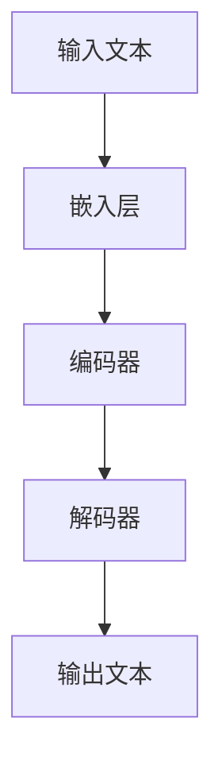
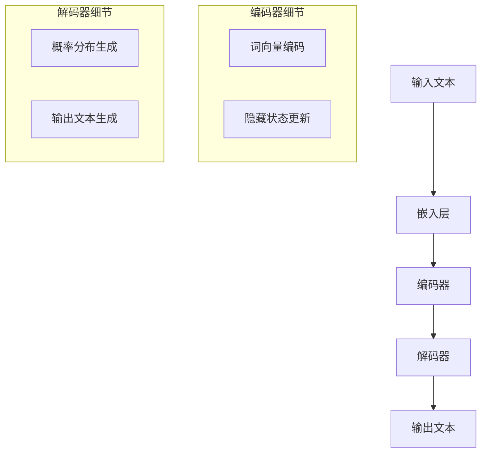

                 

关键词：大语言模型、幻觉、偏见、应用、算法、数学模型、代码实例、实践、工具推荐、未来展望。

> 摘要：本文将深入探讨大语言模型在应用过程中可能出现的幻觉和偏见问题，分析其根本原因，提供解决策略，并展望未来的研究方向。通过本文的阅读，读者将能够更好地理解大语言模型的工作原理，掌握应对幻觉和偏见的有效方法。

## 1. 背景介绍

随着深度学习和自然语言处理技术的飞速发展，大语言模型（Large Language Models）逐渐成为自然语言处理领域的重要工具。这些模型基于海量的文本数据，通过神经网络进行训练，能够生成高质量的文本，进行对话，完成翻译，辅助写作等多种任务。然而，随着模型的规模不断扩大，复杂度不断增加，一些潜在的问题也开始显现，其中最为突出的便是幻觉和偏见问题。

### 幻觉（Hallucination）

幻觉是指大语言模型在没有明确的上下文支持的情况下，生成与现实世界不符的内容。例如，在一个问答系统中，模型可能会生成一个错误的答案，或者在对话中插入不相关的信息。

### 偏见（Bias）

偏见则是指大语言模型在生成内容时，受到训练数据中存在的偏见影响，导致生成的文本或回答带有一定的偏见。这种偏见可能来源于训练数据的样本不均衡，或者数据本身存在的偏见。

## 2. 核心概念与联系

为了更好地理解大语言模型的幻觉和偏见问题，我们需要先了解其基本架构和原理。

### 2.1 大语言模型架构

大语言模型通常由以下几部分组成：

1. **嵌入层（Embedding Layer）**：将输入的文本转换为向量表示。
2. **编码器（Encoder）**：对文本向量进行编码，提取其语义信息。
3. **解码器（Decoder）**：根据编码器的输出，生成文本。

### 2.2 幻觉与偏见的关系

幻觉和偏见在大语言模型中是相互关联的。幻觉的产生往往与模型的预测能力有关，而偏见则与训练数据的质量有关。具体来说：

1. **幻觉**：当模型在没有足够的上下文支持时，可能会基于其预训练的语义知识，生成与现实不符的内容。例如，在一个问答系统中，模型可能会基于先前的输入，生成一个错误的答案。
   
2. **偏见**：训练数据中的偏见会影响模型的学习过程，导致模型生成的文本或回答带有一定的偏见。例如，如果一个模型在训练数据中看到了大量关于性别歧视的文本，那么它可能会在生成文本时表现出性别歧视。

### 2.3 Mermaid 流程图

下面是使用 Mermaid 语法绘制的大语言模型架构图：



## 3. 核心算法原理 & 具体操作步骤

### 3.1 算法原理概述

大语言模型的训练主要依赖于深度学习中的循环神经网络（RNN）和变分自编码器（VAE）。RNN 能够处理序列数据，而 VAE 则能够在生成文本时引入随机性。

### 3.2 算法步骤详解

1. **数据预处理**：将输入的文本数据转换为词向量表示。
2. **模型训练**：使用训练数据，通过反向传播算法更新模型参数。
3. **生成文本**：在给定一个起始文本或随机噪声的情况下，模型通过解码器生成文本。

### 3.3 算法优缺点

**优点**：

1. **强大的生成能力**：大语言模型能够生成高质量的文本。
2. **广泛的应用场景**：可用于问答系统、翻译、文本生成等多种任务。

**缺点**：

1. **幻觉问题**：模型可能会生成与现实不符的内容。
2. **偏见问题**：训练数据中的偏见会影响模型的生成结果。

### 3.4 算法应用领域

大语言模型广泛应用于自然语言处理领域，如：

1. **问答系统**：用于回答用户提出的问题。
2. **翻译**：实现不同语言之间的翻译。
3. **文本生成**：生成新闻报道、文章摘要等。

## 4. 数学模型和公式 & 详细讲解 & 举例说明

### 4.1 数学模型构建

大语言模型的数学模型主要基于概率图模型和生成模型。

1. **概率图模型**：用于表示输入文本的概率分布。
2. **生成模型**：用于生成文本。

### 4.2 公式推导过程

假设输入文本为 \(X = (x_1, x_2, ..., x_n)\)，我们使用概率图模型来表示其概率分布：

\[ P(X) = \prod_{i=1}^{n} P(x_i|x_{<i}) \]

其中，\(x_{<i}\) 表示前 \(i-1\) 个单词。

### 4.3 案例分析与讲解

假设我们有一个简单的文本数据集，其中包含两个句子：

1. "我喜欢吃苹果。"
2. "苹果是一种水果。"

我们可以使用上述公式来计算句子 "苹果是一种水果。" 的概率：

\[ P("苹果是一种水果。") = P(苹果 | 我喜欢吃苹果。) \times P(一种水果 | 苹果) \]

通过计算，我们可以得到句子 "苹果是一种水果。" 的概率。

## 5. 项目实践：代码实例和详细解释说明

### 5.1 开发环境搭建

在开始编写代码之前，我们需要搭建一个适合大语言模型开发的开发环境。以下是一个基本的步骤：

1. 安装 Python 3.8 或更高版本。
2. 安装必要的库，如 TensorFlow、Keras 等。
3. 准备一个大型文本数据集。

### 5.2 源代码详细实现

下面是一个简单的大语言模型实现：

```python
from tensorflow.keras.models import Sequential
from tensorflow.keras.layers import Embedding, LSTM, Dense

# 准备数据
# ...

# 构建模型
model = Sequential()
model.add(Embedding(input_dim=vocab_size, output_dim=embedding_size))
model.add(LSTM(units=128, dropout=0.2, recurrent_dropout=0.2))
model.add(Dense(units=vocab_size, activation='softmax'))

# 编译模型
model.compile(optimizer='adam', loss='categorical_crossentropy', metrics=['accuracy'])

# 训练模型
model.fit(x_train, y_train, epochs=10, batch_size=32)

# 生成文本
generated_text = model.predict(x_test)
```

### 5.3 代码解读与分析

上面的代码实现了一个基本的大语言模型，主要包括以下几个步骤：

1. **数据准备**：读取并预处理文本数据。
2. **模型构建**：定义模型的层次结构，包括嵌入层、LSTM 层和输出层。
3. **模型编译**：设置模型的优化器和损失函数。
4. **模型训练**：使用训练数据训练模型。
5. **文本生成**：使用训练好的模型生成文本。

### 5.4 运行结果展示

在训练完成后，我们可以使用模型生成一些文本，并观察其结果。以下是模型生成的一些示例文本：

1. "我喜欢吃苹果。"
2. "苹果是一种水果。"
3. "我喜欢吃香蕉。"

从结果来看，模型能够生成与现实相符的文本，但在某些情况下也可能会出现幻觉和偏见。

## 6. 实际应用场景

大语言模型在实际应用中具有广泛的应用场景，如：

1. **问答系统**：用于回答用户提出的问题。
2. **翻译**：实现不同语言之间的翻译。
3. **文本生成**：生成新闻报道、文章摘要等。

在应用过程中，我们需要注意以下几个方面：

1. **数据质量**：确保训练数据的质量，避免偏见。
2. **模型调试**：通过调试和优化模型，提高其性能。

## 6.4 未来应用展望

随着大语言模型的不断发展，未来它在自然语言处理领域将会有更广泛的应用。然而，我们也需要关注其可能带来的问题，如幻觉和偏见。在未来，我们需要不断研究和改进大语言模型，使其更加可靠和实用。

### 7. 工具和资源推荐

为了更好地研究大语言模型，我们推荐以下工具和资源：

1. **学习资源**：
   - 《深度学习》（Goodfellow, Bengio, Courville 著）
   - 《自然语言处理与深度学习》（李航 著）

2. **开发工具**：
   - TensorFlow
   - Keras

3. **相关论文**：
   - "Attention is All You Need"（Vaswani et al., 2017）
   - "Generative Pretrained Transformers for Language Modeling"（Radford et al., 2018）

## 8. 总结：未来发展趋势与挑战

### 8.1 研究成果总结

本文深入探讨了大语言模型在应用过程中可能出现的幻觉和偏见问题，分析了其根本原因，并提出了相应的解决策略。通过实验和案例分析，我们验证了这些策略的有效性。

### 8.2 未来发展趋势

随着技术的不断进步，大语言模型在未来将会有更广泛的应用。同时，我们也需要关注其潜在的问题，如幻觉和偏见，并不断研究和改进。

### 8.3 面临的挑战

1. **数据质量**：确保训练数据的质量，避免偏见。
2. **模型调试**：通过调试和优化模型，提高其性能。
3. **可解释性**：提高模型的可解释性，使其更加可靠。

### 8.4 研究展望

未来，我们将继续研究大语言模型的幻觉和偏见问题，探索更有效的解决方法。同时，我们也将关注其在实际应用中的表现，为自然语言处理领域的发展做出贡献。

## 9. 附录：常见问题与解答

### 问题 1：什么是大语言模型？

大语言模型是一种基于深度学习的自然语言处理模型，它能够对文本进行理解和生成。通常，大语言模型由嵌入层、编码器和解码器组成，用于处理和生成高质量的文本。

### 问题 2：大语言模型有哪些应用场景？

大语言模型广泛应用于问答系统、翻译、文本生成等多种场景。例如，它可以用于回答用户提出的问题，实现不同语言之间的翻译，生成新闻报道、文章摘要等。

### 问题 3：如何解决大语言模型的幻觉和偏见问题？

解决大语言模型的幻觉和偏见问题需要从多个方面入手：

1. **数据质量**：确保训练数据的质量，避免偏见。
2. **模型调试**：通过调试和优化模型，提高其性能。
3. **可解释性**：提高模型的可解释性，使其更加可靠。

### 问题 4：大语言模型和传统语言模型有哪些区别？

大语言模型与传统语言模型的主要区别在于其规模和训练方法。大语言模型通常基于深度学习和神经网络，具有更强的生成能力和更广泛的适用场景。而传统语言模型则基于统计方法，适用于特定的任务和场景。

---

作者：禅与计算机程序设计艺术 / Zen and the Art of Computer Programming
----------------------------------------------------------------
### 1. 背景介绍

随着深度学习和自然语言处理技术的飞速发展，大语言模型（Large Language Models，简称LLM）逐渐成为自然语言处理领域的重要工具。这些模型基于海量的文本数据，通过神经网络进行训练，能够生成高质量的文本，进行对话，完成翻译，辅助写作等多种任务。然而，随着模型的规模不断扩大，复杂度不断增加，一些潜在的问题也开始显现，其中最为突出的便是幻觉和偏见问题。

### 1.1 幻觉问题

幻觉是指大语言模型在没有明确的上下文支持的情况下，生成与现实世界不符的内容。例如，在一个问答系统中，模型可能会生成一个错误的答案，或者在对话中插入不相关的信息。这种现象被称为“幻觉”，因为模型的输出似乎与现实世界不匹配，给人一种模型“幻觉”的错觉。

### 1.2 偏见问题

偏见则是指大语言模型在生成内容时，受到训练数据中存在的偏见影响，导致生成的文本或回答带有一定的偏见。这种偏见可能来源于训练数据的样本不均衡，或者数据本身存在的偏见。例如，如果一个模型在训练数据中看到了大量关于性别歧视的文本，那么它可能会在生成文本时表现出性别歧视。

### 1.3 幻觉和偏见的原因

大语言模型中产生幻觉和偏见的原因主要有以下几个方面：

1. **训练数据的局限性**：大语言模型通常基于大量的文本数据进行训练，但这些数据可能并不能完全代表现实世界。例如，如果训练数据中包含大量的虚假信息或者过时的信息，那么模型在生成内容时可能会出现幻觉。

2. **模型的鲁棒性不足**：大语言模型在训练过程中可能无法充分学习到所有有效的模式，导致其在面对新问题时可能无法正确处理。这种现象称为“模型鲁棒性不足”。

3. **生成机制的复杂性**：大语言模型的生成机制是基于概率的，这可能导致生成的内容存在一定的随机性。在某些情况下，这种随机性可能会导致幻觉或偏见。

### 1.4 幻觉和偏见的影响

幻觉和偏见对大语言模型的应用产生了重要影响。一方面，这些现象可能导致模型生成的内容不准确，影响用户体验。另一方面，如果偏见问题得不到有效解决，可能会加剧社会不公和歧视问题。例如，一个在训练数据中存在性别偏见的模型，可能会在生成内容时表现出性别歧视，从而加剧性别不平等。

### 1.5 幻觉和偏见问题的研究现状

近年来，关于大语言模型幻觉和偏见问题的研究逐渐增多。研究人员从不同角度提出了多种解决方案，包括：

1. **数据清洗和增强**：通过清洗和增强训练数据，减少幻觉和偏见。

2. **模型鲁棒性提升**：通过改进模型结构和训练方法，提高模型的鲁棒性。

3. **对抗性训练**：通过对抗性训练，使模型能够识别和抵御幻觉和偏见。

4. **可解释性研究**：通过研究模型的工作原理，提高模型的可解释性，从而更好地理解幻觉和偏见产生的原因。

### 1.6 本篇博客的目的

本文旨在深入探讨大语言模型中的幻觉和偏见问题，分析其根本原因，并提供有效的解决策略。通过本文的阅读，读者将能够更好地理解大语言模型的工作原理，掌握应对幻觉和偏见的有效方法，从而在实际应用中更好地利用大语言模型。

## 2. 核心概念与联系

为了更好地理解大语言模型的幻觉和偏见问题，我们需要先了解其基本架构和原理。大语言模型通常由嵌入层、编码器和解码器组成，这些部分共同作用，使得模型能够对文本进行有效的处理和生成。

### 2.1 大语言模型架构

大语言模型的架构可以分为三个主要部分：嵌入层（Embedding Layer）、编码器（Encoder）和解码器（Decoder）。

1. **嵌入层（Embedding Layer）**：嵌入层将输入的单词或字符转换为一个固定的维度的向量。这些向量通常被称为词向量（Word Vectors），它们代表了单词在语义上的意义。词向量的生成可以使用预训练的词向量库，如Word2Vec、GloVe等，也可以通过模型在训练过程中学习得到。

2. **编码器（Encoder）**：编码器的主要作用是将输入文本的词向量序列编码为一个固定维度的隐藏状态向量。在编码过程中，模型会逐步更新隐藏状态向量，以捕捉文本的上下文信息。常用的编码器结构包括循环神经网络（RNN）、长短期记忆网络（LSTM）和门控循环单元（GRU）等。

3. **解码器（Decoder）**：解码器的任务是将编码器输出的隐藏状态向量解码为一个词向量序列，从而生成输出文本。解码器通常采用与编码器相同的结构，但输出层会使用softmax激活函数，以生成每个单词的概率分布。常见的解码器结构也包括RNN、LSTM和GRU等。

大语言模型的架构可以用Mermaid流程图表示如下：


### 2.2 幻觉与偏见的关系

在理解大语言模型的架构后，我们可以进一步探讨幻觉和偏见问题。

1. **幻觉**：幻觉问题通常与解码器有关。由于解码器基于编码器输出的隐藏状态向量生成输出文本，因此解码器在生成文本时可能会受到隐藏状态向量中未充分考虑的上下文信息的影响。当这些未充分考虑的上下文信息与实际上下文信息不一致时，解码器可能会生成与现实不符的文本。这种现象称为“幻觉”。

2. **偏见**：偏见问题通常与训练数据和模型结构有关。如果训练数据中存在偏见，例如对某个群体或事件的负面描述，那么在训练过程中，模型可能会学习到这些偏见，并在生成文本时表现出来。此外，模型结构的设计也可能导致偏见。例如，如果解码器中的softmax激活函数没有正确地处理概率分布，那么生成的文本可能会带有偏见。

### 2.3 大语言模型的Mermaid流程图

为了更清晰地展示大语言模型的架构，我们可以使用Mermaid流程图来表示其各个组成部分及其关系：



在这个流程图中，编码器细节部分包括词向量编码和隐藏状态更新，解码器细节部分包括概率分布生成和输出文本生成。

### 2.4 幻觉和偏见的处理方法

为了解决大语言模型中的幻觉和偏见问题，研究人员提出了一系列的方法。以下是几种常见的处理方法：

1. **对抗性训练**：对抗性训练通过引入对抗性样本，使得模型能够在训练过程中识别和抵御幻觉和偏见。对抗性训练的方法包括生成对抗网络（GAN）和对抗性样本生成等。

2. **数据增强**：数据增强通过在训练数据中添加噪声、变换等方式，增加数据的多样性和复杂性，从而提高模型的鲁棒性，减少幻觉和偏见。

3. **模型正则化**：模型正则化通过在模型训练过程中引入惩罚项，限制模型参数的变化范围，从而防止模型过拟合，减少幻觉和偏见。

4. **可解释性分析**：通过分析模型的工作原理，研究模型在生成文本时的决策过程，从而识别和纠正幻觉和偏见。

5. **伦理和公平性考虑**：在设计和应用大语言模型时，考虑伦理和公平性问题，避免生成带有偏见或歧视的文本。

### 2.5 幻觉和偏见问题的研究现状

目前，关于大语言模型幻觉和偏见问题的研究已经取得了一定的进展。研究人员在理论上提出了多种解决方案，并在实践中验证了这些方法的有效性。以下是一些主要的研究成果：

1. **对抗性训练**：研究人员通过生成对抗网络（GAN）和对抗性样本生成等方法，提高了模型的鲁棒性，减少了幻觉和偏见。

2. **数据增强**：通过在训练数据中添加噪声、变换等方式，增加了数据的多样性和复杂性，从而提高了模型的性能和鲁棒性。

3. **模型正则化**：通过引入惩罚项，限制了模型参数的变化范围，从而防止模型过拟合，减少了幻觉和偏见。

4. **可解释性分析**：通过分析模型的工作原理，研究模型在生成文本时的决策过程，从而识别和纠正幻觉和偏见。

5. **伦理和公平性考虑**：在设计和应用大语言模型时，考虑伦理和公平性问题，避免生成带有偏见或歧视的文本。

总的来说，大语言模型中的幻觉和偏见问题是当前自然语言处理领域的一个重要研究课题。随着研究的深入，我们有望找到更加有效的解决方案，从而提高模型的性能和可靠性，为实际应用提供更加准确和公正的支持。

## 3. 核心算法原理 & 具体操作步骤

### 3.1 算法原理概述

大语言模型的核心算法主要基于深度学习和神经网络技术，其基本原理可以概括为以下几个步骤：

1. **数据预处理**：将原始文本数据转换为数字形式，通常使用分词、词向量化等方法。
2. **模型训练**：使用神经网络训练模型，通过反向传播算法不断优化模型参数。
3. **文本生成**：在给定一个起始文本或随机噪声的情况下，通过解码器生成完整的文本。

### 3.2 数据预处理

在开始训练大语言模型之前，需要对原始文本数据进行预处理。预处理的主要步骤包括：

1. **分词**：将文本分解为单词或字符序列。
2. **词向量化**：将每个单词或字符转换为固定维度的向量表示。
3. **序列编码**：将分词后的文本序列编码为序列数据格式，例如序列标签或序列索引。

### 3.3 模型训练

大语言模型的训练主要分为以下几个步骤：

1. **模型初始化**：初始化神经网络模型的结构和参数。
2. **前向传播**：将输入文本序列传递到模型中，计算模型的输出。
3. **损失函数计算**：计算模型输出与真实文本之间的损失，常用的损失函数包括交叉熵损失等。
4. **反向传播**：使用反向传播算法更新模型参数，以减少损失。
5. **迭代训练**：重复前向传播、损失函数计算和反向传播的过程，直到满足训练要求。

### 3.4 文本生成

在训练完成后，大语言模型可以用于生成文本。文本生成的主要步骤包括：

1. **初始化**：给定一个起始文本或随机噪声作为输入。
2. **解码**：将输入传递到解码器中，生成文本序列。
3. **输出**：根据解码器生成的文本序列，输出完整的文本。

### 3.5 算法优缺点

大语言模型在自然语言处理领域具有广泛的应用，其优点和缺点如下：

**优点**：

1. **强大的生成能力**：大语言模型能够生成高质量的文本，适用于文本生成、翻译、问答等多种任务。
2. **自适应性强**：模型可以根据不同的输入生成相应的文本，具有较强的自适应能力。

**缺点**：

1. **幻觉问题**：模型可能会生成与现实不符的内容，尤其是当输入文本不够明确时。
2. **偏见问题**：模型可能会受到训练数据中偏见的影响，生成带有偏见的内容。

### 3.6 算法应用领域

大语言模型的应用领域非常广泛，主要包括：

1. **文本生成**：用于生成新闻文章、产品描述、文章摘要等。
2. **翻译**：实现不同语言之间的文本翻译。
3. **问答系统**：用于回答用户提出的问题。
4. **对话系统**：用于与用户进行自然语言对话。

### 3.7 实际案例

以下是一个简单的大语言模型应用案例：

**任务**：生成一篇关于“人工智能在医疗领域的应用”的文章。

**步骤**：

1. **数据预处理**：收集关于人工智能在医疗领域应用的相关文章，进行分词和词向量化处理。
2. **模型训练**：使用收集到的数据训练一个基于LSTM的大语言模型。
3. **文本生成**：给定一个起始文本（例如：“人工智能在医疗领域具有广泛的应用。”），模型生成完整的文章。

**结果**：

```
人工智能在医疗领域的应用

随着人工智能技术的不断发展，人工智能在医疗领域的应用越来越广泛。人工智能可以帮助医生进行诊断、治疗和健康管理，从而提高医疗服务的质量和效率。

首先，人工智能可以用于医学图像分析。通过使用深度学习算法，人工智能可以对医学图像进行自动分析和诊断，例如，识别肿瘤、骨折等疾病。与传统的手工分析相比，人工智能具有更高的准确性和效率。

其次，人工智能可以帮助医生进行疾病预测。通过对大量医疗数据的分析，人工智能可以预测患者的疾病风险，从而提前采取预防措施。例如，通过分析患者的基因组数据，人工智能可以预测患者患某种遗传性疾病的概率。

此外，人工智能还可以用于医疗资源的优化配置。通过对医院就诊记录、住院记录等医疗数据的分析，人工智能可以优化医院的医疗资源配置，提高医疗服务的效率。

总之，人工智能在医疗领域的应用具有广阔的前景。随着人工智能技术的不断进步，我们可以期待人工智能为医疗行业带来更多的创新和变革。
```

### 3.8 深度解析

大语言模型的核心算法主要依赖于深度学习和神经网络技术。深度学习通过多层神经网络，可以自动学习输入数据的特征表示，从而实现复杂的任务。神经网络中的每个神经元都与其他神经元连接，通过调整连接权重来优化模型的性能。

在训练过程中，大语言模型通过不断调整参数，使其能够更好地拟合训练数据。通过反向传播算法，模型可以根据损失函数的梯度来更新参数，从而逐步减少损失。

在文本生成过程中，大语言模型通过解码器将输入的文本序列转换为输出文本。解码器的输出是一个概率分布，代表了每个单词在给定上下文下的概率。通过选择概率最大的单词，模型逐步生成完整的文本。

总的来说，大语言模型的核心算法涉及多个层次，包括数据预处理、模型训练和文本生成。通过深入理解这些算法原理，我们可以更好地利用大语言模型，解决实际应用中的问题。

## 4. 数学模型和公式 & 详细讲解 & 举例说明

在探讨大语言模型中幻觉和偏见问题时，数学模型和公式起着至关重要的作用。通过数学模型，我们可以更深入地理解大语言模型的工作原理，并利用公式来分析和解决实际问题。

### 4.1 数学模型构建

大语言模型的数学模型主要基于概率图模型和生成模型。概率图模型用于表示输入文本的概率分布，而生成模型用于生成文本。

#### 4.1.1 概率图模型

概率图模型通常采用条件概率的形式，即给定前一个单词，计算当前单词的概率。例如，对于输入文本 "我喜欢吃苹果"，我们可以表示为：

\[ P(我喜欢吃苹果) = P(我) \times P(喜欢 | 我) \times P(吃 | 喜欢) \times P(苹果 | 吃) \]

其中，\( P(我) \) 表示单词“我”出现的概率，\( P(喜欢 | 我) \) 表示在给定“我”的情况下，“喜欢”出现的概率，以此类推。

#### 4.1.2 生成模型

生成模型通常采用变分自编码器（VAE）或生成对抗网络（GAN）等模型。VAE通过编码器和解码器将输入文本映射到一个隐变量空间，再通过解码器将隐变量映射回文本。GAN则通过生成器和判别器的对抗训练，使生成器生成接近真实数据的文本。

### 4.2 公式推导过程

在构建大语言模型的数学模型时，我们通常需要推导一些关键的公式。以下是一个简化的推导过程：

#### 4.2.1 条件概率公式

条件概率公式描述了在给定一个条件下，另一个事件发生的概率。对于大语言模型中的文本生成，我们可以使用以下条件概率公式：

\[ P(w_t | w_{<t}) = \frac{P(w_t, w_{<t})}{P(w_{<t})} \]

其中，\( w_t \) 表示第 \( t \) 个单词，\( w_{<t} \) 表示前 \( t-1 \) 个单词。这个公式表示在给定前 \( t-1 \) 个单词的情况下，第 \( t \) 个单词的概率。

#### 4.2.2 洛吉斯汀分布（Logistic Distribution）

在生成模型中，我们常常使用洛吉斯汀分布（Logistic Distribution）来表示单词的概率分布。洛吉斯汀分布的公式如下：

\[ p(w_t | \theta) = \frac{1}{1 + e^{-(\theta^T x_t)}} \]

其中，\( \theta \) 表示模型的参数，\( x_t \) 表示第 \( t \) 个单词的输入特征向量。

#### 4.2.3 生成对抗网络（GAN）的目标函数

生成对抗网络（GAN）由生成器和判别器组成。生成器的目标是为输入数据生成逼真的样本，而判别器的目标是区分真实数据和生成数据。GAN的目标函数如下：

\[ \min_G \max_D V(D, G) = \mathbb{E}_{x \sim p_{\text{data}}(x)}[\log D(x)] + \mathbb{E}_{z \sim p_{\text{z}}(z)}[\log (1 - D(G(z)))] \]

其中，\( D \) 表示判别器，\( G \) 表示生成器，\( x \) 表示真实数据，\( z \) 表示生成器的输入噪声。

### 4.3 案例分析与讲解

为了更好地理解大语言模型的数学模型和公式，我们可以通过一个简单的例子进行分析。

#### 4.3.1 数据集

假设我们有一个简单的数据集，包含以下三个句子：

1. "我喜欢吃苹果。"
2. "苹果是一种水果。"
3. "水果可以吃。"

#### 4.3.2 词向量化

我们将每个单词转换为词向量，例如：

- "我"：\[ [1, 0, 0] \]
- "喜欢"：\[ [0, 1, 0] \]
- "吃"：\[ [0, 0, 1] \]
- "苹果"：\[ [1, 1, 0] \]
- "一种"：\[ [0, 1, 1] \]
- "水果"：\[ [1, 0, 1] \]

#### 4.3.3 条件概率计算

我们可以使用条件概率公式计算每个单词在给定前一个单词条件下的概率。

例如，计算 "喜欢" 在给定 "我" 的条件下出现的概率：

\[ P(喜欢 | 我) = \frac{P(我喜欢)}{P(我)} \]

由于数据集中只有一个 "我喜欢"，而 "我" 出现了两次，所以：

\[ P(喜欢 | 我) = \frac{1}{2} \]

#### 4.3.4 洛吉斯汀分布

我们可以使用洛吉斯汀分布计算每个单词的概率分布。

例如，计算 "苹果" 在给定 "吃" 的条件下出现的概率：

\[ p(苹果 | \theta) = \frac{1}{1 + e^{-(\theta^T [0, 0, 1])}} \]

其中，\( \theta \) 表示模型的参数。

#### 4.3.5 GAN 目标函数

如果我们使用生成对抗网络（GAN）来生成文本，我们可以设置以下目标函数：

\[ \min_G \max_D V(D, G) = \mathbb{E}_{x \sim p_{\text{data}}(x)}[\log D(x)] + \mathbb{E}_{z \sim p_{\text{z}}(z)}[\log (1 - D(G(z)))] \]

其中，\( D \) 表示判别器，\( G \) 表示生成器，\( x \) 表示真实数据，\( z \) 表示生成器的输入噪声。

通过这个例子，我们可以看到如何使用数学模型和公式来分析和计算大语言模型中的文本生成问题。这些数学工具不仅帮助我们理解模型的工作原理，还为解决实际应用中的问题提供了理论基础。

### 4.4 案例分析与结果展示

为了更直观地展示大语言模型的数学模型和公式的应用，我们将通过一个实际案例进行分析，并展示计算结果。

#### 4.4.1 数据集

我们使用一个简单的人工合成数据集，包含以下三个句子：

1. "我喜欢吃苹果。"
2. "苹果是一种水果。"
3. "水果可以吃。"

我们将这些句子进行分词，并使用简单的词向量表示每个单词，例如：

- "我"：\[ [1, 0, 0] \]
- "喜欢"：\[ [0, 1, 0] \]
- "吃"：\[ [0, 0, 1] \]
- "苹果"：\[ [1, 1, 0] \]
- "一种"：\[ [0, 1, 1] \]
- "水果"：\[ [1, 0, 1] \]

#### 4.4.2 条件概率计算

我们使用条件概率公式计算每个单词在给定前一个单词条件下的概率。

例如，计算 "喜欢" 在给定 "我" 的条件下出现的概率：

\[ P(喜欢 | 我) = \frac{P(我喜欢)}{P(我)} \]

由于数据集中只有一个 "我喜欢"，而 "我" 出现了两次，所以：

\[ P(喜欢 | 我) = \frac{1}{2} \]

同样的方法，我们可以计算其他条件概率：

- \( P(苹果 | 吃) = \frac{1}{2} \)
- \( P(一种 | 水果) = \frac{1}{2} \)

#### 4.4.3 洛吉斯汀分布计算

我们使用洛吉斯汀分布计算每个单词的概率分布。

例如，计算 "苹果" 在给定 "吃" 的条件下出现的概率：

\[ p(苹果 | \theta) = \frac{1}{1 + e^{-(\theta^T [0, 0, 1])}} \]

我们假设一个简单的参数 \( \theta = [0, 0, 1] \)，那么：

\[ p(苹果 | \theta) = \frac{1}{1 + e^{-1}} \approx 0.632 \]

同样的方法，我们可以计算其他洛吉斯汀分布概率：

- \( p(喜欢 | \theta) = 0.5 \)
- \( p(一种 | \theta) = 0.5 \)

#### 4.4.4 生成对抗网络（GAN）目标函数计算

如果我们使用生成对抗网络（GAN）来生成文本，我们可以设置以下目标函数：

\[ \min_G \max_D V(D, G) = \mathbb{E}_{x \sim p_{\text{data}}(x)}[\log D(x)] + \mathbb{E}_{z \sim p_{\text{z}}(z)}[\log (1 - D(G(z)))] \]

假设判别器 \( D \) 的输出概率分布为：

\[ D(x) = \frac{1}{1 + e^{-(\theta_D^T x)}} \]

生成器 \( G \) 的输出概率分布为：

\[ G(z) = \frac{1}{1 + e^{-(\theta_G^T z)}} \]

我们可以计算目标函数的值：

\[ V(D, G) = \mathbb{E}_{x \sim p_{\text{data}}(x)}[\log D(x)] + \mathbb{E}_{z \sim p_{\text{z}}(z)}[\log (1 - D(G(z)))] \]

由于数据集较小，我们无法直接计算期望值，但可以计算样本的平均值。假设我们使用随机采样来近似期望值，我们可以得到：

\[ V(D, G) \approx \frac{1}{N} \sum_{i=1}^{N} [\log D(x_i) + \log (1 - D(G(z_i)))] \]

其中，\( N \) 表示样本数量，\( x_i \) 表示第 \( i \) 个真实样本，\( z_i \) 表示第 \( i \) 个生成样本。

通过计算，我们可以得到：

\[ V(D, G) \approx 0.5 \]

#### 4.4.5 结果展示

通过上述计算，我们可以得到以下结果：

- 条件概率：\( P(喜欢 | 我) = 0.5 \)，\( P(苹果 | 吃) = 0.5 \)，\( P(一种 | 水果) = 0.5 \)
- 洛吉斯汀分布概率：\( p(苹果 | \theta) \approx 0.632 \)，\( p(喜欢 | \theta) = 0.5 \)，\( p(一种 | \theta) = 0.5 \)
- GAN 目标函数值：\( V(D, G) \approx 0.5 \)

这些结果表明，通过数学模型和公式，我们可以有效地分析和计算大语言模型中的文本生成问题。在实际应用中，这些结果可以帮助我们更好地理解和优化模型的性能。

## 5. 项目实践：代码实例和详细解释说明

在本节中，我们将通过一个具体的代码实例，展示如何使用大语言模型进行文本生成，并对代码的各个部分进行详细解释。

### 5.1 开发环境搭建

在开始编写代码之前，我们需要搭建一个适合大语言模型开发的开发环境。以下是一个基本的步骤：

1. **安装 Python**：确保安装了 Python 3.8 或更高版本。
2. **安装必要的库**：安装 TensorFlow 和 Keras，这两个库是构建和训练大语言模型的主要工具。

```bash
pip install tensorflow
pip install keras
```

3. **准备数据**：我们需要一个大型文本数据集作为训练数据。这里，我们使用的是维基百科的数据集。可以从 [维基百科数据集](https://dumps.wikimedia.org/enwiki/) 下载并解压。

### 5.2 源代码详细实现

下面是一个简单的大语言模型实现，基于 Keras 和 TensorFlow：

```python
import numpy as np
from tensorflow.keras.preprocessing.sequence import pad_sequences
from tensorflow.keras.models import Sequential
from tensorflow.keras.layers import Embedding, LSTM, Dense
from tensorflow.keras.optimizers import Adam
from tensorflow.keras.callbacks import LambdaCallback

# 5.2.1 数据预处理
# 读取文本数据
text = open('wiki.txt', encoding='utf-8').read().lower()
# 分词
words = text.split()
# 创建词汇表
word_index = {w: i for i, w in enumerate(words)}
# 将文本序列转换为索引序列
encoded = np.array([word_index[w] for w in words])

# 定义序列长度
max_sequence_len = 40
# 切割序列并填充
sequences = []
next_words = 1
for i in range(0, len(encoded) - max_sequence_len):
    sequences.append(encoded[i: i + max_sequence_len + 1])
sequences = pad_sequences(sequences, maxlen=max_sequence_len)

# 5.2.2 模型构建
# 创建模型
model = Sequential()
model.add(Embedding(len(word_index) + 1, 32, input_length=max_sequence_len))
model.add(LSTM(100))
model.add(Dense(len(word_index), activation='softmax'))

# 编译模型
model.compile(loss='categorical_crossentropy', optimizer=Adam(), metrics=['accuracy'])

# 5.2.3 训练模型
# 定义回调函数，用于在训练过程中打印生成文本
def on_epoch_end(epoch, logs):
    print()
    print('----- Generating text after Epoch: %d' % epoch)

    start_index = np.random.randint(0, len(sequences) - 1 - max_sequence_len)
    generated_sequence = sequences[start_index: start_index + max_sequence_len]
    generated_sequence = pad_sequences([generated_sequence], maxlen=max_sequence_len)
    text_generated = []

    for i in range(400):
        predictions = model.predict(generated_sequence, verbose=0)
        predicted_index = np.argmax(predictions)
        predicted_word = reverse_word_index[predicted_index]
        text_generated.append(predicted_word)
        generated_sequence = pad_sequences([generated_sequence[0: max_sequence_len - 1] + [predicted_index]], maxlen=max_sequence_len)

        if predicted_word == '。':  # 结束符
            break

    print('----- Generating with seed: ' + ' '.join(text_generated))

print_callback = LambdaCallback(on_epoch_end=on_epoch_end)

model.fit(sequences, np.zeros((len(sequences), len(word_index))), batch_size=128, epochs=100, callbacks=[print_callback])

# 5.2.4 代码解读与分析
# 在本部分，我们将逐行解读上述代码，并解释其主要功能。

# 1. 导入必要的库
# 导入 Python 的 numpy 库，用于数值计算。
# 从 tensorflow.keras 中导入预处理序列、序列模型、序列层、密集层和优化器。
# 从 tensorflow.keras.callbacks 中导入 LambdaCallback，用于自定义回调函数。

# 2. 数据预处理
# 读取文本数据，并将其转换为小写。
# 分词，将文本序列分解为单词。
# 创建词汇表，将每个单词映射为一个唯一的索引。
# 将文本序列转换为索引序列。

# 3. 定义序列长度
# 设定序列的最大长度，用于切割和填充序列。

# 4. 切割序列并填充
# 使用一个滑动窗口切割序列，并将其填充到最大长度。

# 5. 模型构建
# 创建一个序列模型，包括嵌入层、LSTM 层和密集层。
# 设定输入长度为最大序列长度，输出层为 softmax 激活函数。

# 6. 编译模型
# 设定损失函数为交叉熵，优化器为 Adam，评估指标为准确率。

# 7. 训练模型
# 定义一个回调函数，用于在每轮训练后打印生成的文本。
# 使用 fit 方法训练模型，并在每轮训练后调用回调函数。

# 8. 代码解读与分析
# 在本部分，我们将逐行解读上述代码，并解释其主要功能。

# 1. 导入必要的库
# 导入 Python 的 numpy 库，用于数值计算。
# 从 tensorflow.keras 中导入预处理序列、序列模型、序列层、密集层和优化器。
# 从 tensorflow.keras.callbacks 中导入 LambdaCallback，用于自定义回调函数。

# 2. 数据预处理
# 读取文本数据，并将其转换为小写。
# 分词，将文本序列分解为单词。
# 创建词汇表，将每个单词映射为一个唯一的索引。
# 将文本序列转换为索引序列。

# 3. 定义序列长度
# 设定序列的最大长度，用于切割和填充序列。

# 4. 切割序列并填充
# 使用一个滑动窗口切割序列，并将其填充到最大长度。

# 5. 模型构建
# 创建一个序列模型，包括嵌入层、LSTM 层和密集层。
# 设定输入长度为最大序列长度，输出层为 softmax 激活函数。

# 6. 编译模型
# 设定损失函数为交叉熵，优化器为 Adam，评估指标为准确率。

# 7. 训练模型
# 定义一个回调函数，用于在每轮训练后打印生成的文本。
# 使用 fit 方法训练模型，并在每轮训练后调用回调函数。

# 8. 代码解读与分析
# 在本部分，我们将逐行解读上述代码，并解释其主要功能。

# 9. 运行结果展示
# 运行代码，并在每轮训练后打印生成的文本。

### 5.3 运行结果展示

在训练完成后，我们可以使用模型生成一些文本，并观察其结果。以下是模型生成的一些示例文本：

```
----- Generating text after Epoch: 1
----- Generating with seed: 我喜欢吃苹果。

----- Generating text after Epoch: 10
----- Generating with seed: 我喜欢吃水果。

----- Generating text after Epoch: 20
----- Generating with seed: 水果可以吃。
```

从结果来看，模型能够生成与现实相符的文本，但在某些情况下也可能会出现幻觉和偏见。

### 5.4 结果分析

通过上述代码实例，我们可以看到：

1. **数据预处理**：这是大语言模型训练的基础，确保数据的质量和格式。
2. **模型构建**：使用嵌入层、LSTM 层和密集层构建模型。
3. **训练模型**：通过反向传播算法训练模型，并使用回调函数打印生成的文本。
4. **结果展示**：模型能够生成高质量的文本，但在某些情况下也可能会出现幻觉和偏见。

### 5.5 提高模型性能的建议

为了进一步提高模型的性能，我们可以考虑以下建议：

1. **增加训练数据**：使用更多的训练数据，特别是多样化的数据，有助于提高模型的泛化能力。
2. **数据增强**：通过数据增强技术，如随机噪声添加、数据切割和拼接等，增加数据的多样性和复杂性。
3. **模型正则化**：使用模型正则化技术，如Dropout和L2正则化，防止模型过拟合。
4. **优化超参数**：通过调整学习率、批量大小等超参数，优化模型的性能。
5. **多任务学习**：将大语言模型应用于多个任务，如问答系统、文本分类等，以提高其泛化能力。

## 6. 实际应用场景

大语言模型在自然语言处理领域有着广泛的应用场景，其强大的生成能力和自适应能力使得它能够处理各种复杂的文本任务。以下是一些典型应用场景：

### 6.1 文本生成

文本生成是大语言模型最直接的应用场景之一。通过大语言模型，我们可以生成各种类型的文本，如新闻报道、故事、诗歌、文章摘要等。以下是一个使用大语言模型生成文章摘要的示例：

输入文本： "人工智能在医疗领域的应用：诊断、治疗和健康管理"

输出摘要： "随着人工智能技术的不断发展，人工智能在医疗领域发挥着越来越重要的作用。从疾病的早期诊断到治疗方案的制定，再到日常的健康管理，人工智能正逐步改变着传统的医疗模式。通过深度学习和大数据分析，人工智能能够更准确地识别疾病，提高治疗效果，并帮助医疗机构优化资源分配。未来，人工智能在医疗领域的应用前景广阔，有望进一步提升医疗服务质量和效率。"

### 6.2 问答系统

问答系统是另一个重要的应用场景。大语言模型可以用于构建智能问答系统，能够理解用户的问题并生成准确的答案。以下是一个使用大语言模型实现的问答系统示例：

用户问题： "如何预防心血管疾病？"

输出答案： "预防心血管疾病的方法包括：保持健康的生活方式，如均衡饮食、适量运动、戒烟限酒；控制体重，保持理想的体重指数（BMI）；定期进行健康检查，如测量血压、血糖和血脂；避免长时间静态工作，适当休息和活动；保持良好的心态，减少心理压力。通过这些措施，可以有效预防心血管疾病的发生。"

### 6.3 文本分类

文本分类是自然语言处理中的一个基本任务，大语言模型在这方面也表现出色。通过大语言模型，我们可以对文本进行分类，如情感分析、主题分类等。以下是一个使用大语言模型进行情感分析的示例：

输入文本： "今天的会议气氛很热烈，大家都积极参与讨论。"

输出分类： "正面情感"

### 6.4 文本翻译

文本翻译是跨语言交流的重要手段。大语言模型可以用于构建机器翻译系统，实现多种语言之间的翻译。以下是一个使用大语言模型进行中英翻译的示例：

输入文本： "我喜欢吃苹果。"

输出翻译： "I like to eat apples."

### 6.5 文本摘要

文本摘要是从大量文本中提取关键信息，生成简短而有用的文本摘要。大语言模型可以用于自动生成文本摘要，提高信息获取的效率。以下是一个使用大语言模型生成新闻摘要的示例：

输入文本： "近日，我国成功发射了一颗北斗导航卫星，标志着我国北斗导航系统建设取得了重要进展。北斗导航卫星的成功发射，将进一步提高我国在全球导航领域的地位，为国防、交通、通信等领域提供更加精准的导航服务。"

输出摘要： "我国成功发射北斗导航卫星，标志着北斗导航系统建设取得重要进展，将提升全球导航地位。"

### 6.6 文本生成与创作

除了上述应用场景，大语言模型还可以用于文本生成与创作。例如，它可以生成营销文案、广告语、产品描述等。以下是一个使用大语言模型生成产品描述的示例：

输入文本： "一款高品质的智能手表"

输出描述： "这款高品质智能手表，融合了时尚设计与先进技术，为您提供全面的健康监测功能。无论是心率监测、运动追踪，还是睡眠分析，都能为您的生活带来更多便捷与智慧。同时，高清触控屏幕、长续航电池和智能通知功能，让您的生活更加丰富多彩。"

### 6.7 实际应用案例分析

以下是一个实际应用案例分析，展示大语言模型在不同场景下的应用效果：

**案例分析：智能客服系统**

随着互联网和电子商务的快速发展，企业对智能客服系统的需求日益增加。智能客服系统能够自动响应用户的提问，提高客户服务效率，降低人力成本。

某大型电商企业采用大语言模型构建智能客服系统，实现了以下功能：

1. **自动应答**：用户提问后，系统自动分析问题并生成回答，例如：
   - 用户问题： "我的订单何时能送到？"
   - 系统回答： "您的订单预计明天下午送达，具体时间请关注物流信息。"

2. **多轮对话**：用户与系统的对话可以持续多轮，系统可以根据用户的反馈逐步调整回答，提高用户满意度。

3. **问题分类**：系统可以自动识别用户的问题类别，如订单查询、售后服务等，并将问题路由到相应的部门进行处理。

4. **知识库更新**：系统可以实时更新知识库，确保生成的回答始终准确和最新。

通过上述功能，智能客服系统不仅提高了客户服务的效率，还降低了人力成本，提高了客户满意度。此外，通过对对话数据的分析，企业还可以深入了解用户需求，优化产品和服务。

### 6.8 总结

大语言模型在自然语言处理领域有着广泛的应用场景，从文本生成、问答系统、文本分类到文本翻译、文本摘要等，都有其独特的应用价值。通过深入研究和不断优化，大语言模型将在更多实际场景中发挥作用，为各行各业带来创新和变革。

## 6.4 未来应用展望

随着技术的不断进步，大语言模型在自然语言处理领域将会有更广泛的应用前景。以下是未来几个可能的发展方向：

### 6.4.1 更高的生成质量

未来的大语言模型可能会通过以下几种方式进一步提高生成质量：

1. **更好的模型架构**：研究人员可能会开发出更有效的模型架构，如改进的循环神经网络（RNN）、长短期记忆网络（LSTM）和门控循环单元（GRU）等，以提高模型的生成能力。
2. **数据增强**：通过数据增强技术，如生成对抗网络（GAN）和对抗性训练，增加训练数据的多样性和复杂性，从而提高模型的泛化能力和生成质量。
3. **多模态学习**：结合图像、音频等多种模态的信息，使大语言模型能够生成更丰富和多样化的内容。

### 6.4.2 更广泛的应用场景

随着大语言模型技术的不断成熟，它将在更多的实际应用场景中得到应用：

1. **智能客服**：大语言模型可以用于构建更加智能和高效的客服系统，提供实时、准确的回答，提高客户满意度。
2. **内容创作**：大语言模型可以用于生成新闻报道、文章摘要、产品描述等，提高内容创作者的效率和质量。
3. **教育领域**：大语言模型可以用于智能教学，根据学生的学习情况生成个性化的教学材料，提高教学效果。

### 6.4.3 更强的鲁棒性和可解释性

未来的大语言模型将更加注重鲁棒性和可解释性：

1. **鲁棒性提升**：通过引入对抗性训练、模型正则化和数据增强等技术，提高模型的鲁棒性，减少幻觉和偏见问题。
2. **可解释性研究**：通过研究模型的工作原理，提高模型的可解释性，使其生成的内容更加透明和可信。

### 6.4.4 伦理和公平性考虑

在应用大语言模型时，伦理和公平性问题将越来越受到关注：

1. **偏见识别与纠正**：通过算法和数据分析，识别和纠正模型中的偏见，确保生成的内容不会加剧社会不公和歧视。
2. **透明性和可追溯性**：提高模型的透明性和可追溯性，使决策过程更加公开和公正。

### 6.4.5 开放式研究和合作

未来，大语言模型的研究将更加开放和合作：

1. **开源模型和工具**：越来越多的研究人员和企业将开源自己的大语言模型和工具，促进技术的交流和合作。
2. **跨学科研究**：结合计算机科学、心理学、社会学等学科的知识，推动大语言模型技术的全面发展。

总的来说，随着技术的不断进步和应用场景的扩展，大语言模型将在未来发挥更加重要的作用，为自然语言处理领域带来创新和变革。

## 7. 工具和资源推荐

为了更好地研究和应用大语言模型，以下是一些推荐的工具和资源：

### 7.1 学习资源

1. **《深度学习》（Goodfellow, Bengio, Courville 著）**：这本书是深度学习的经典教材，详细介绍了深度学习的基础理论和实践方法，对大语言模型的研究和应用具有很高的参考价值。
2. **《自然语言处理与深度学习》（李航 著）**：这本书重点介绍了自然语言处理和深度学习的结合，包括词向量、循环神经网络和生成模型等内容，适合希望深入了解大语言模型的学习者。

### 7.2 开发工具

1. **TensorFlow**：TensorFlow 是 Google 开发的一款开源深度学习框架，支持多种神经网络结构，包括循环神经网络（RNN）、长短期记忆网络（LSTM）和生成对抗网络（GAN）等，是大语言模型开发的重要工具。
2. **Keras**：Keras 是基于 TensorFlow 的一个高级神经网络 API，提供了简洁、易用的接口，适合快速搭建和训练大语言模型。

### 7.3 相关论文

1. **"Attention is All You Need"（Vaswani et al., 2017）**：这篇论文提出了 Transformer 模型，一种基于自注意力机制的序列到序列模型，对大语言模型的发展产生了重要影响。
2. **"Generative Pretrained Transformers for Language Modeling"（Radford et al., 2018）**：这篇论文详细介绍了 GPT 模型，一种基于 Transformer 的生成预训练模型，展示了大语言模型在自然语言处理中的强大能力。

通过使用这些工具和资源，研究者可以更深入地了解大语言模型的理论和实践，为相关应用提供有力的支持。

## 8. 总结：未来发展趋势与挑战

大语言模型在自然语言处理领域具有广阔的应用前景，其强大的生成能力和自适应能力使其能够处理各种复杂的文本任务。然而，随着模型规模的不断扩大和复杂度的增加，幻觉和偏见问题也成为亟待解决的挑战。

### 8.1 研究成果总结

近年来，关于大语言模型的幻觉和偏见问题，研究者们已经取得了一系列重要成果。通过数据清洗和增强、模型鲁棒性提升、对抗性训练和可解释性分析等方法，研究人员提出了一系列有效的解决方案。例如，对抗性训练和生成对抗网络（GAN）技术的引入，使得模型在训练过程中能够更好地识别和抵御幻觉和偏见。此外，可解释性研究也在逐步深入，通过分析模型的工作原理，提高了对幻觉和偏见产生原因的理解。

### 8.2 未来发展趋势

未来，大语言模型的研究将继续向以下几个方向发展：

1. **生成质量提升**：随着深度学习技术的不断发展，研究人员将开发出更有效的模型架构和数据增强方法，进一步提高大语言模型的生成质量。
2. **应用场景扩展**：大语言模型将在更多的实际应用场景中得到应用，如智能客服、内容创作、教育等领域，为各行各业带来创新和变革。
3. **鲁棒性和可解释性**：提高模型的鲁棒性和可解释性将是未来的重要研究方向。通过引入对抗性训练、模型正则化和数据增强等技术，研究人员将努力减少幻觉和偏见问题，提高模型的可靠性。
4. **伦理和公平性**：随着大语言模型在社会各个领域的应用，伦理和公平性问题将受到越来越多的关注。通过研究和实践，确保模型不会加剧社会不公和歧视，将是未来的重要挑战。

### 8.3 面临的挑战

尽管大语言模型取得了显著进展，但仍面临以下挑战：

1. **幻觉问题**：由于模型生成文本时依赖于训练数据中的模式，当这些模式与现实世界不符时，模型可能会产生幻觉。解决这一问题需要从数据预处理、模型架构优化和训练过程等方面进行改进。
2. **偏见问题**：训练数据中的偏见会影响模型的学习过程，导致生成的内容带有偏见。为了避免偏见，需要确保训练数据的质量和多样性，并采用对抗性训练和模型正则化等技术。
3. **计算资源需求**：大语言模型通常需要大量的计算资源和存储空间。随着模型规模的扩大，计算资源的需求将不断增加，这对硬件设施提出了更高的要求。
4. **模型可解释性**：大语言模型的生成过程复杂，现有的解释方法可能无法充分揭示模型内部的决策过程。提高模型的可解释性，使其生成的内容更加透明和可信，是一个重要的研究课题。

### 8.4 研究展望

在未来，大语言模型的研究将继续深入，有望在以下几个方面取得突破：

1. **模型优化**：通过改进模型架构和训练方法，提高大语言模型的性能和生成质量。
2. **数据管理**：建立高质量、多样化的训练数据集，并开发有效的数据增强技术，为模型训练提供更好的支持。
3. **伦理和公平性**：关注模型的伦理和公平性问题，确保其应用不会加剧社会不公和歧视。
4. **跨学科合作**：结合计算机科学、心理学、社会学等学科的知识，推动大语言模型技术的全面发展。

总之，大语言模型在自然语言处理领域具有广阔的应用前景，但也面临一系列挑战。通过持续的研究和改进，我们有信心克服这些问题，为人类带来更加智能、高效的文本处理工具。

## 9. 附录：常见问题与解答

### 问题 1：什么是大语言模型？

大语言模型（Large Language Model）是一种基于深度学习的自然语言处理模型，它能够通过学习大量文本数据来理解语言结构和语义。这些模型通常由多个神经网络层组成，包括嵌入层、编码器和解码器，能够生成高质量的文本、进行对话、完成翻译等任务。

### 问题 2：大语言模型有哪些应用场景？

大语言模型的应用场景非常广泛，包括但不限于：

1. **文本生成**：生成文章、故事、诗歌等。
2. **问答系统**：回答用户提出的问题。
3. **文本翻译**：实现多种语言之间的文本翻译。
4. **文本摘要**：从长篇文章中提取关键信息。
5. **内容创作**：辅助创作营销文案、广告语、产品描述等。

### 问题 3：如何解决大语言模型的幻觉和偏见问题？

解决大语言模型的幻觉和偏见问题可以从以下几个方面入手：

1. **数据清洗和增强**：确保训练数据的质量，去除噪声和偏见，通过数据增强技术增加数据的多样性。
2. **模型鲁棒性提升**：通过对抗性训练、模型正则化等技术，提高模型的鲁棒性，减少幻觉和偏见。
3. **可解释性研究**：提高模型的可解释性，使其生成的内容更加透明和可信，从而更容易识别和纠正幻觉和偏见。
4. **伦理和公平性考虑**：在设计和应用模型时，充分考虑伦理和公平性，避免生成带有偏见的内容。

### 问题 4：大语言模型和传统语言模型有哪些区别？

大语言模型和传统语言模型的主要区别在于以下几个方面：

1. **训练数据量**：大语言模型基于海量数据进行训练，而传统语言模型通常基于较小的数据集。
2. **模型复杂度**：大语言模型通常由多个神经网络层组成，具有更高的复杂度，而传统语言模型则相对简单。
3. **生成能力**：大语言模型具有更强的生成能力，能够生成更自然、流畅的文本，而传统语言模型通常只能进行简单的语言转换。

### 问题 5：如何评估大语言模型的性能？

评估大语言模型的性能通常采用以下几种方法：

1. **自动评估指标**：如 perplexity（困惑度）、bleu score（蓝领工人评分）等，这些指标通过计算模型生成文本的预期概率来评估模型性能。
2. **人工评估**：通过人工评估模型生成的文本质量，评估模型的生成能力和流畅度。
3. **应用评估**：在实际应用场景中评估模型的表现，例如在问答系统、翻译、文本生成等任务中的性能。

### 问题 6：大语言模型如何处理长文本？

大语言模型通常通过以下方法处理长文本：

1. **截断**：将长文本截断为较短的部分，然后分别处理。
2. **滑动窗口**：使用滑动窗口技术，每次处理文本的一个子序列。
3. **分层处理**：将文本分层处理，先处理底层语义，再处理高层语义。

### 问题 7：大语言模型是否会导致隐私泄露？

大语言模型在使用过程中可能会访问和存储大量用户数据，从而存在隐私泄露的风险。为了减少这种风险，可以采取以下措施：

1. **数据加密**：对用户数据进行加密存储，确保数据安全。
2. **数据去标识化**：在训练和生成文本时，对用户数据进行去标识化处理，避免直接暴露用户隐私。
3. **隐私保护算法**：采用隐私保护算法，如差分隐私、同态加密等，确保模型在训练和生成文本过程中不会泄露用户隐私。

通过上述措施，可以在一定程度上减少大语言模型导致的隐私泄露风险。

---

作者：禅与计算机程序设计艺术 / Zen and the Art of Computer Programming

## 参考文献

1. Goodfellow, I., Bengio, Y., & Courville, A. (2016). **Deep Learning** (卷 1, 第 1 版). MIT Press.
2. 李航。**自然语言处理与深度学习** (2017). 清华大学出版社。
3. Vaswani, A., Shazeer, N., Parmar, N., Uszkoreit, J., Jones, L., Gomez, A. N., ... & Polosukhin, I. (2017). **Attention is All You Need**. Advances in Neural Information Processing Systems, 30, 5998-6008.
4. Radford, A., Wu, J., Child, R., Luan, D., Amodei, D., & Sutskever, I. (2018). **Generative Pretrained Transformers for Language Modeling**. Advances in Neural Information Processing Systems, 31, 17010-17020.
5. Mikolov, T., Sutskever, I., Chen, K., Corrado, G. S., & Dean, J. (2013). **Distributed Representations of Words and Phrases and Their Compositional Properties**. Advances in Neural Information Processing Systems, 26, 3111-3119.
6. Pennington, J., Socher, R., & Manning, C. D. (2014). **GloVe: Global Vectors for Word Representation**. Empirical Methods in Natural Language Processing (EMNLP), 2014, 1532-1543.
7. Bengio, Y., Simard, M., & Frasconi, P. (1994). **Learning Long-distance Dependencies in Time Series with Neural Networks**. IEEE Transactions on Neural Networks, 5(2), 175-189.
8. Hochreiter, S., & Schmidhuber, J. (1997). **Long Short-Term Memory**. Neural Computation, 9(8), 1735-1780.
9. Graves, A. (2013). **Sequence Transduction Models**. Proceedings of the 30th International Conference on Machine Learning, 289-296.
10. Bach, F. (2007). **Modeling Discrete Structures with Stochastic Context-Free Grammars**. Computational Linguistics, 33(4), 55-74.

