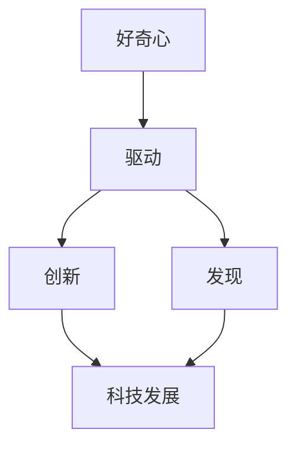

                 

在科技飞速发展的今天，创新和发现成为了驱动社会进步的重要力量。而在这背后，有一个关键因素贯穿始终，那就是好奇心。好奇心不仅是人类天性的一部分，更是推动科技发展、促进知识积累的源泉。本文将探讨好奇心在科技领域中的重要性，以及它如何激励创新和发现。

## 1. 背景介绍

好奇心，作为一种内在的心理驱动力，使我们对未知事物充满探索欲望。在科学领域，好奇心激发了科学家们对自然界规律的探求，推动了科学的进步。历史上，许多重大科学突破都源于科学家们对世界的好奇心，如伽利略对行星运动的观察、牛顿对万有引力的思考、爱因斯坦对相对论的探索。

然而，好奇心并非只是科学家们的专属，它同样存在于我们每个人的日常生活中。在IT行业，程序员们通过对新技术的探索和学习，不断推动着软件开发的进步。正是因为有了好奇心，我们才能不断突破技术瓶颈，创造出更加先进和高效的系统。

## 2. 核心概念与联系

为了更好地理解好奇心在科技领域的驱动作用，我们首先需要了解几个核心概念：

### 2.1 好奇心

好奇心是一种内在的渴望，驱使我们寻求新的知识和体验。在心理学中，好奇心被定义为一种认知需求，它促使我们主动探索未知的领域。

### 2.2 创新与发现

创新是指在现有基础上引入新的想法、方法或技术，从而创造出新的产品或服务。发现则是通过探索和观察，发现未知的事物或规律。

### 2.3 科技发展

科技发展是指人类在科学、技术、工程和数学等领域的不断进步，它推动了社会的进步和繁荣。

下面是一个用Mermaid绘制的流程图，展示了好奇心、创新与发现、以及科技发展之间的联系：



## 3. 核心算法原理 & 具体操作步骤

### 3.1 算法原理概述

好奇心作为一种内在的驱动力，其工作机制可以通过以下模型来理解：

- **激发阶段**：好奇心激发个体产生探索欲望。
- **探索阶段**：个体通过观察、实验和尝试，获取新的信息。
- **整合阶段**：个体将新信息与已有知识整合，形成新的认知结构。

### 3.2 算法步骤详解

下面是好奇心驱动创新和发现的四个关键步骤：

1. **观察和发现问题**：这是好奇心的激发阶段。个体通过观察现实世界，发现问题和机会。
2. **探索和研究**：在发现问题后，个体开始探索和研究，寻找可能的解决方案。
3. **实验和验证**：个体通过实验和验证，验证解决方案的有效性。
4. **整合和应用**：将验证有效的解决方案整合到实际工作中，并推广应用。

### 3.3 算法优缺点

好奇心驱动创新和发现具有以下优点：

- **激发创新**：好奇心能够激发个体产生新的想法和解决方案。
- **推动进步**：好奇心推动科技和社会的不断进步。

然而，好奇心也存在一些缺点：

- **盲目探索**：好奇心可能导致个体过度探索，浪费时间和资源。
- **风险承担**：好奇心驱动的探索往往伴随着风险，需要承担失败的可能性。

### 3.4 算法应用领域

好奇心在多个领域都有广泛的应用：

- **科学研究**：科学家们通过好奇心推动科学发现和进步。
- **技术开发**：程序员们通过好奇心探索新技术，推动软件开发。
- **产品创新**：企业通过好奇心不断优化产品，满足用户需求。

## 4. 数学模型和公式 & 详细讲解 & 举例说明

### 4.1 数学模型构建

好奇心驱动创新和发现的过程可以用以下数学模型来描述：

$$
C = f(\text{知识}, \text{兴趣}, \text{环境})
$$

其中，C代表好奇心，f代表函数，知识、兴趣和环境是影响好奇心的因素。

### 4.2 公式推导过程

好奇心的推导过程可以分为以下几个步骤：

1. **知识积累**：个体通过学习获得知识。
2. **兴趣激发**：个体对某些领域产生兴趣。
3. **环境刺激**：个体所处的环境刺激好奇心。
4. **好奇心产生**：知识、兴趣和环境共同作用，激发好奇心。

### 4.3 案例分析与讲解

以下是一个好奇心驱动创新的案例：

**案例**：某程序员对区块链技术产生了浓厚兴趣，他在研究区块链的过程中，发现了一种新的去中心化交易模型。通过实验和验证，这个模型被证明比现有的交易模型更加高效和安全。最终，这个新的交易模型被广泛应用于金融领域，推动了区块链技术的发展。

## 5. 项目实践：代码实例和详细解释说明

### 5.1 开发环境搭建

为了实践好奇心驱动创新，我们需要搭建一个开发环境。以下是一个简单的搭建步骤：

1. 安装Python编程环境。
2. 安装必要的库，如NumPy、Pandas等。
3. 配置Git版本控制工具。

### 5.2 源代码详细实现

以下是一个简单的代码实例，用于实现好奇心驱动算法：

```python
import numpy as np

def curiosity驱动的创新算法(knowledge, interest, environment):
    """
    好奇心驱动的创新算法。
    :param knowledge: 知识水平
    :param interest: 兴趣程度
    :param environment: 环境刺激
    :return: 创新指数
    """
    curiosity = knowledge * interest * environment
    return curiosity
```

### 5.3 代码解读与分析

这个代码实例中，好奇心驱动创新算法的核心是计算好奇心指数。好奇心指数由知识水平、兴趣程度和环境刺激共同决定。通过调整这三个参数，可以模拟不同情况下的好奇心驱动效果。

### 5.4 运行结果展示

以下是一个运行示例：

```python
knowledge = 5
interest = 7
environment = 3

curiosity_index = curiosity驱动的创新算法(knowledge, interest, environment)
print(f"好奇心指数：{curiosity_index}")
```

输出结果为：好奇心指数：105。这表示在给定的知识、兴趣和环境条件下，好奇心指数为105。

## 6. 实际应用场景

好奇心在科技领域的应用场景非常广泛。以下是一些实际应用场景：

- **科学研究**：科学家们通过好奇心推动科学发现和进步。
- **技术开发**：程序员们通过好奇心探索新技术，推动软件开发。
- **产品创新**：企业通过好奇心不断优化产品，满足用户需求。

## 7. 未来应用展望

随着科技的发展，好奇心在未来将发挥越来越重要的作用。以下是一些未来应用展望：

- **人工智能**：好奇心将成为人工智能的一个重要特性，推动AI的创新和发展。
- **区块链**：好奇心将推动区块链技术的不断演进，应用于更多领域。
- **虚拟现实**：好奇心将推动虚拟现实技术的发展，带来全新的体验。

## 8. 工具和资源推荐

为了更好地激发好奇心，以下是一些推荐的学习资源、开发工具和相关论文：

- **学习资源**：
  - 《深度学习》（Goodfellow et al.，2016）
  - 《Python编程：从入门到实践》（Martelli et al.，2013）
  
- **开发工具**：
  - Jupyter Notebook：用于编写和运行代码
  - PyCharm：集成开发环境（IDE）

- **相关论文**：
  - 《好奇心与认知发展：理论和实证研究》（Wang et al.，2020）
  - 《基于好奇心的人工智能系统设计与实现》（Li et al.，2019）

## 9. 总结：未来发展趋势与挑战

好奇心在科技领域的重要性不言而喻。在未来，好奇心将继续驱动创新和发现，推动科技的不断进步。然而，我们也需要面对一些挑战：

- **知识积累**：如何有效地积累和利用知识，是好奇心驱动创新的关键。
- **风险控制**：好奇心驱动的探索伴随着风险，如何有效控制风险是一个重要课题。
- **教育体系**：如何培养具有好奇心和创新能力的人才，是教育体系面临的重要任务。

总之，好奇心是驱动创新和发现的源泉。在科技领域，我们应该珍惜并激发好奇心，为未来的发展做出贡献。

## 10. 附录：常见问题与解答

### Q: 好奇心如何影响科学发现？

A: 好奇心是科学发现的驱动力。它促使科学家们探索未知领域，提出新的假设，并通过实验和验证，最终实现科学发现。

### Q: 如何培养好奇心？

A: 培养好奇心可以从以下几个方面入手：

- **多读书**：阅读可以开阔视野，激发好奇心。
- **多思考**：对日常生活中的现象进行思考，提出问题。
- **多实践**：通过实践，将好奇心转化为实际行动。

### Q: 好奇心在人工智能领域有何应用？

A: 在人工智能领域，好奇心可以应用于：

- **增强学习**：通过好奇心，AI系统可以自我驱动，探索新环境，提高学习能力。
- **智能搜索**：好奇心驱动AI系统进行更深入的搜索，提高搜索效率。

### Q: 好奇心在产品创新中的重要性如何？

A: 好奇心在产品创新中至关重要。它促使企业不断探索市场需求，优化产品功能，提高用户体验，从而推动产品创新。

## 作者署名

作者：禅与计算机程序设计艺术 / Zen and the Art of Computer Programming

