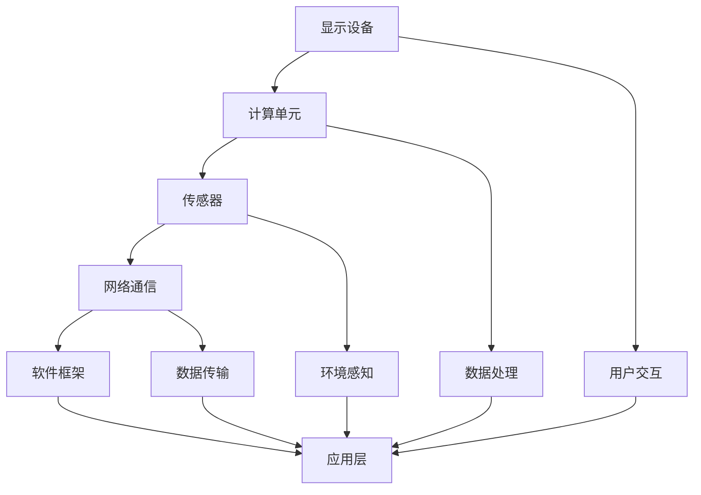

                 

### 1. 背景介绍

增强现实（Augmented Reality，AR）和虚拟现实（Virtual Reality，VR）技术是近年来快速发展的领域。随着计算能力的提升和显示技术的进步，AR/VR技术已经从实验室走向了商业应用。在全球范围内，这些技术被广泛应用于娱乐、医疗、教育、制造业、房地产、军事等多个行业。它们不仅为用户提供了全新的交互体验，也为创业者提供了无限的创意空间和商业机会。

技术创新一直是推动社会进步的重要动力。在过去的几十年里，计算机科学和互联网技术的发展极大地改变了人类的生活方式。而现在，AR/VR技术正在成为下一代技术创新的重要方向。它们不仅能够改变人类与数字世界的交互方式，还能够带来全新的商业模式和价值创造方式。

创业项目是技术创新的重要载体。通过创业，人们可以将新技术应用到实际问题中，解决现实问题，同时实现商业价值。AR/VR技术的独特性和多样性，使得创业者可以探索各种不同的商业模式和应用场景，从而创造出具有竞争力和可持续性的创业项目。

本文旨在探讨如何利用AR/VR技术进行创业。我们将从以下几个方面展开讨论：

- **核心概念与联系**：介绍AR/VR技术的基本原理和架构，通过Mermaid流程图展示其核心概念和联系。
- **核心算法原理与具体操作步骤**：分析AR/VR技术中的核心算法，详细解释其原理和具体操作步骤。
- **数学模型和公式**：构建AR/VR技术的数学模型，推导相关公式，并通过案例进行详细讲解。
- **项目实践**：提供实际开发过程中的代码实例和详细解释，展示如何将理论应用到实践中。
- **实际应用场景**：分析AR/VR技术在不同行业中的应用场景，探讨其商业价值和未来发展。
- **工具和资源推荐**：推荐学习资源、开发工具和相关的学术论文，为读者提供进一步研究的方向。
- **总结与展望**：总结研究成果，探讨未来发展趋势和面临的挑战，提出研究展望。

通过本文的探讨，希望能够为有意从事AR/VR技术创新创业的读者提供一些有益的启示和参考。

## 2. 核心概念与联系

### 2.1 基本概念

#### AR（增强现实）

增强现实技术通过在真实世界环境中叠加虚拟信息，为用户带来新的感官体验。这些虚拟信息可以是文字、图像、声音或其他形式的媒体。AR技术的主要特点包括：

- **透明度**：虚拟信息与真实环境混合显示，用户能够同时看到真实世界和虚拟世界。
- **交互性**：用户可以通过触摸、手势等与虚拟信息进行交互。
- **实时性**：AR应用可以实时更新信息，反映真实世界的动态变化。

#### VR（虚拟现实）

虚拟现实技术则通过创建一个完全沉浸式的虚拟环境，使用户感觉自己置身于另一个世界。VR技术的主要特点包括：

- **沉浸感**：用户感觉完全置身于虚拟环境中，视觉、听觉、触觉等多感官被充分刺激。
- **交互性**：用户可以与虚拟环境中的对象进行交互，如移动、操作等。
- **独立性**：VR环境独立于真实世界，可以自由创造和探索。

### 2.2 关键架构

为了实现AR/VR技术，我们需要以下几个关键组件：

#### 显示设备

- **AR眼镜**：如微软HoloLens、谷歌Glass等，可以直接叠加虚拟信息到真实环境中。
- **VR头显**：如Oculus Rift、HTC Vive等，提供完全沉浸式的虚拟体验。

#### 计算单元

- **处理器**：如NVIDIA的GPU，用于处理复杂的图形渲染和实时计算。
- **传感器**：包括摄像头、GPS、陀螺仪、加速度计等，用于捕捉用户和环境信息。

#### 网络通信

- **本地通信**：通过Wi-Fi、蓝牙等实现设备间的数据传输和交互。
- **远程通信**：通过互联网实现远程数据传输和实时互动。

#### 软件框架

- **AR/VR开发框架**：如Unity、Unreal Engine等，提供高效的图形渲染、物理模拟和交互功能。

### 2.3 Mermaid流程图

下面是一个简单的Mermaid流程图，展示了AR/VR技术的基本架构和关键组件：



在这个流程图中，每个节点代表一个组件或功能，箭头表示组件之间的数据流和控制流。用户通过显示设备与虚拟环境交互，计算单元处理数据和渲染图像，传感器捕捉用户和环境信息，网络通信实现数据传输，软件框架提供应用程序的开发和运行环境。

通过这个流程图，我们可以更直观地理解AR/VR技术的核心概念和联系，为后续的讨论和具体实现提供基础。

### 2.4 小结

在本节中，我们介绍了AR/VR技术的基本概念和关键架构。通过Mermaid流程图，我们展示了AR/VR技术的核心组件及其相互关系。这些概念和架构不仅为我们理解AR/VR技术奠定了基础，也为后续的算法原理、数学模型和项目实践提供了重要的参考。

### 3. 核心算法原理 & 具体操作步骤

#### 3.1 算法原理概述

在AR/VR技术中，核心算法起着至关重要的作用。这些算法不仅决定了虚拟环境的渲染质量，还影响了用户的交互体验。以下是一些关键的算法原理：

#### 3.1.1 运动跟踪算法

运动跟踪算法用于捕捉用户在虚拟环境中的位置和姿态变化。其主要原理包括：

- **摄像头跟踪**：通过摄像头捕捉用户的运动，并利用图像处理技术进行跟踪。
- **传感器融合**：结合多种传感器（如陀螺仪、加速度计）的数据，提高跟踪的准确性和鲁棒性。

#### 3.1.2 图形渲染算法

图形渲染算法用于生成虚拟环境的视觉效果。其主要原理包括：

- **实时渲染**：在用户操作时实时生成和更新图像，确保虚拟环境的实时性。
- **光线追踪**：通过模拟光线在虚拟环境中的传播，生成更加真实的光照效果。
- **纹理映射**：将图像映射到三维模型表面，增强视觉效果。

#### 3.1.3 交互算法

交互算法用于实现用户与虚拟环境的互动。其主要原理包括：

- **手势识别**：通过图像处理和模式识别技术，识别用户的手势并进行响应。
- **语音识别**：通过语音识别技术，将用户的语音转化为文本或命令，实现语音交互。

#### 3.2 算法步骤详解

下面我们详细解释这些核心算法的具体步骤：

#### 3.2.1 运动跟踪算法

1. **摄像头捕获**：使用摄像头捕捉用户在现实环境中的图像。
2. **特征点检测**：在捕获的图像中检测特征点，如关节点、标志点等。
3. **姿态估计**：利用特征点位置和传感器数据，估计用户在三维空间中的位置和姿态。
4. **跟踪更新**：根据用户位置和姿态，实时更新虚拟环境中的视角和交互元素。

#### 3.2.2 图形渲染算法

1. **场景构建**：构建虚拟环境的场景，包括三维模型、纹理、光照等。
2. **视图矩阵计算**：根据用户位置和姿态，计算视图矩阵，用于变换三维模型到二维屏幕。
3. **渲染管线**：执行渲染管线，包括顶点处理、片段处理、光照计算等，生成最终的图像。
4. **图像合成**：将虚拟图像与真实环境图像进行合成，生成最终的显示结果。

#### 3.2.3 交互算法

1. **手势识别**：
   - **图像预处理**：对捕获的图像进行预处理，如灰度化、滤波等。
   - **特征提取**：提取图像中的关键特征，如边缘、轮廓等。
   - **模式识别**：利用机器学习或模式识别算法，识别用户的手势。

2. **语音识别**：
   - **语音信号处理**：对捕获的语音信号进行预处理，如降噪、分帧等。
   - **特征提取**：提取语音信号中的特征，如MFCC（梅尔频率倒谱系数）等。
   - **声学模型**：利用隐马尔可夫模型（HMM）或其他声学模型，对语音进行建模。
   - **解码**：利用解码算法（如动态时间归一化（DTW）或神经网络）对语音进行解码，生成文本或命令。

#### 3.3 算法优缺点

每种算法都有其优缺点：

- **运动跟踪算法**：
  - **优点**：实时性强，可以提供良好的交互体验。
  - **缺点**：对摄像头和传感器的精度要求较高，容易出现跟踪误差。

- **图形渲染算法**：
  - **优点**：可以生成高质量的视觉效果，提高用户体验。
  - **缺点**：计算复杂度高，对硬件性能要求较高。

- **交互算法**：
  - **优点**：提供了多种交互方式，增强用户参与感。
  - **缺点**：对实时性和准确性的要求较高，需要复杂的算法支持。

#### 3.4 算法应用领域

这些算法在AR/VR技术中有着广泛的应用领域：

- **运动跟踪算法**：广泛应用于游戏、模拟训练、医疗诊断等领域。
- **图形渲染算法**：用于虚拟现实游戏、建筑设计、医学成像等领域。
- **交互算法**：应用于虚拟购物、远程办公、教育训练等领域。

#### 3.5 小结

在本节中，我们详细介绍了AR/VR技术中的核心算法原理和具体操作步骤。这些算法不仅在技术上具有重要意义，也为创业者提供了丰富的创意空间和实现途径。通过深入理解这些算法，创业者可以更好地把握AR/VR技术的应用方向和商业价值。

### 4. 数学模型和公式 & 详细讲解 & 举例说明

#### 4.1 数学模型构建

在AR/VR技术中，数学模型是理解和实现关键算法的基础。以下是一些常用的数学模型和公式：

#### 4.1.1 运动跟踪模型

运动跟踪模型通常使用卡尔曼滤波（Kalman Filter）来估计用户的位置和姿态。卡尔曼滤波是一个递归的估计过程，其基本公式如下：

$$
\hat{x}_{k|k} = \hat{x}_{k-1|k-1} + K_k (z_k - \hat{z}_{k-1})
$$

$$
K_k = \frac{P_{k-1} H_k^T (H_k P_{k-1} H_k^T + R_k)^{-1}}
$$

其中，$\hat{x}_{k|k}$ 是第k次观测的估计值，$z_k$ 是第k次观测的真实值，$\hat{z}_{k-1}$ 是第k-1次观测的估计值，$P_{k-1}$ 是第k-1次观测的协方差矩阵，$H_k$ 是观测矩阵，$R_k$ 是观测噪声协方差矩阵。

#### 4.1.2 图形渲染模型

图形渲染模型通常基于光线追踪（Ray Tracing）和光传输方程（Light Transport Equation）。光传输方程的基本公式如下：

$$
L_o(\mathbf{p}, \mathbf{w}) = L_e(\mathbf{p}, \mathbf{w}) + \int_\Omega L_i(\mathbf{p}, \mathbf{w'}) f_r(\mathbf{p}, \mathbf{w'}, \mathbf{w}) \frac{d\mathbf{w'}}{\mathbf{w'} \cdot \mathbf{n}} d\omega'
$$

其中，$L_o(\mathbf{p}, \mathbf{w})$ 是从点$\mathbf{p}$沿方向$\mathbf{w}$发射的光线辐射度，$L_e(\mathbf{p}, \mathbf{w})$ 是环境辐射度，$L_i(\mathbf{p}, \mathbf{w'})$ 是从点$\mathbf{p}$沿方向$\mathbf{w'}$入射的光线辐射度，$f_r(\mathbf{p}, \mathbf{w'}, \mathbf{w})$ 是反射率函数，$\mathbf{n}$ 是表面法向量。

#### 4.1.3 交互模型

交互模型通常基于手势识别和语音识别。手势识别可以使用支持向量机（Support Vector Machine，SVM）或卷积神经网络（Convolutional Neural Network，CNN）进行建模。以下是一个基于SVM的手势识别模型：

$$
\hat{y} = \text{sign}(\sum_{i=1}^n \alpha_i y_i K(x_i, x))
$$

其中，$\hat{y}$ 是预测的手势类别，$y_i$ 是第i个训练样本的类别，$x_i$ 是第i个训练样本的特征向量，$K(x_i, x)$ 是核函数，$\alpha_i$ 是SVM的权重。

#### 4.2 公式推导过程

以下我们将简要介绍几个关键公式的推导过程：

#### 4.2.1 卡尔曼滤波公式推导

卡尔曼滤波的推导过程涉及到状态空间模型和贝叶斯估计。首先，我们假设系统的状态模型为：

$$
x_k = A_k x_{k-1} + B_k u_k + w_k
$$

$$
z_k = H_k x_k + v_k
$$

其中，$x_k$ 是系统状态，$u_k$ 是控制输入，$w_k$ 是过程噪声，$z_k$ 是观测值，$v_k$ 是观测噪声。

假设我们有一个先验估计$\hat{x}_{k-1|k-1}$和其协方差$P_{k-1}$，我们希望更新这些估计值以包含新的观测值$z_k$。

首先，我们计算预测值：

$$
\hat{x}_{k|k-1} = A_k \hat{x}_{k-1|k-1}
$$

$$
P_{k|k-1} = A_k P_{k-1} A_k^T + Q_k
$$

其中，$Q_k$ 是过程噪声协方差。

然后，我们计算卡尔曼增益：

$$
K_k = P_{k|k-1} H_k^T (H_k P_{k|k-1} H_k^T + R_k)^{-1}
$$

其中，$R_k$ 是观测噪声协方差。

最后，我们更新估计值：

$$
\hat{x}_{k|k} = \hat{x}_{k|k-1} + K_k (z_k - H_k \hat{x}_{k|k-1})
$$

$$
P_{k|k} = (I - K_k H_k) P_{k|k-1}
$$

#### 4.2.2 光传输方程推导

光传输方程的推导基于物理光学的基本原理。首先，我们假设光线从点$\mathbf{p}$沿方向$\mathbf{w}$传播，遇到表面时发生反射。反射光线沿方向$\mathbf{w'}$传播，与表面法向量$\mathbf{n}$的夹角为$\theta$。反射率函数$f_r(\mathbf{p}, \mathbf{w'}, \mathbf{w})$描述了光线在表面上的反射特性。

假设入射光线辐射度为$L_i(\mathbf{p}, \mathbf{w'})$，反射光线辐射度为$L_r(\mathbf{p}, \mathbf{w'})$，则根据能量守恒定律，有：

$$
L_i(\mathbf{p}, \mathbf{w'}) = L_r(\mathbf{p}, \mathbf{w'}) + L_t(\mathbf{p}, \mathbf{w'})
$$

其中，$L_t(\mathbf{p}, \mathbf{w'})$ 是透射光线的辐射度。

反射光线辐射度可以表示为：

$$
L_r(\mathbf{p}, \mathbf{w'}) = \int_\Omega f_r(\mathbf{p}, \mathbf{w'}, \mathbf{w}) L_i(\mathbf{p}, \mathbf{w''}) \frac{d\mathbf{w''}}{\mathbf{w''} \cdot \mathbf{n}}
$$

将反射光线辐射度代入能量守恒定律，得到：

$$
L_i(\mathbf{p}, \mathbf{w'}) = \int_\Omega f_r(\mathbf{p}, \mathbf{w'}, \mathbf{w}) L_i(\mathbf{p}, \mathbf{w''}) \frac{d\mathbf{w''}}{\mathbf{w''} \cdot \mathbf{n}} + L_t(\mathbf{p}, \mathbf{w'})
$$

由于表面是封闭的，所有出射光线的总和为零，即：

$$
\int_\Omega L_t(\mathbf{p}, \mathbf{w'}) d\mathbf{w'} = 0
$$

因此，光传输方程可以表示为：

$$
L_o(\mathbf{p}, \mathbf{w}) = L_e(\mathbf{p}, \mathbf{w}) + \int_\Omega f_r(\mathbf{p}, \mathbf{w'}, \mathbf{w}) L_i(\mathbf{p}, \mathbf{w'')} \frac{d\mathbf{w''}}{\mathbf{w''} \cdot \mathbf{n}}
$$

#### 4.3 案例分析与讲解

下面我们通过一个简单的案例，说明如何使用这些数学模型和公式进行AR/VR技术的实现。

#### 4.3.1 运动跟踪案例

假设我们使用一个带有摄像头的AR设备，捕捉用户在房间中的运动。我们希望实现一个运动跟踪系统，实时显示用户的位置和姿态。

1. **数据采集**：使用摄像头捕获用户在房间中的图像，并使用特征点检测算法提取特征点。

2. **姿态估计**：使用卡尔曼滤波算法，结合摄像头捕获的图像和传感器数据，估计用户的位置和姿态。

3. **视图更新**：根据用户的位置和姿态，更新虚拟环境中的视角，使虚拟物体与用户动作同步。

4. **实时反馈**：将更新的视图实时显示在AR设备屏幕上，为用户提供实时反馈。

#### 4.3.2 图形渲染案例

假设我们使用一个VR设备，渲染一个虚拟场景，包括地面、墙壁、虚拟物体等。

1. **场景构建**：构建虚拟场景的三维模型，包括地面、墙壁、虚拟物体等。

2. **视图计算**：根据用户的位置和姿态，计算视图矩阵，将三维模型变换到二维屏幕上。

3. **光线追踪**：使用光线追踪算法，计算场景中的光照效果，生成高质量的渲染图像。

4. **图像合成**：将渲染的图像与真实环境图像进行合成，生成最终的显示结果。

#### 4.3.3 交互案例

假设我们使用一个AR设备，实现一个虚拟购物系统，用户可以浏览商品，进行购物。

1. **手势识别**：使用手势识别算法，识别用户的手势，如点击、拖动等。

2. **语音识别**：使用语音识别算法，识别用户的语音命令，如“添加到购物车”、“查询商品信息”等。

3. **交互反馈**：根据用户的手势和语音命令，更新虚拟购物系统的状态，如添加商品到购物车、显示商品信息等。

4. **实时反馈**：将交互结果实时显示在AR设备屏幕上，为用户提供实时反馈。

#### 4.4 小结

在本节中，我们构建了AR/VR技术中的数学模型，并推导了相关公式。通过案例分析，我们详细讲解了如何使用这些模型和公式进行AR/VR技术的实现。这些数学模型和公式为AR/VR技术的应用提供了重要的理论基础和实现方法。

### 5. 项目实践：代码实例和详细解释说明

#### 5.1 开发环境搭建

在进行AR/VR项目的开发之前，我们需要搭建一个合适的环境。这里以使用Unity引擎开发一个简单的AR应用为例。

1. **安装Unity**：从Unity官网（https://unity.com/）下载并安装Unity Hub。

2. **创建新项目**：在Unity Hub中创建一个新的项目，选择“AR Foundation”作为模板。

3. **安装AR SDK**：在Unity编辑器中安装AR Foundation SDK，通过菜单“Window” -> “Package Manager” -> “Install Package”搜索并安装“ARFoundation”。

4. **配置Android开发环境**：由于AR应用通常需要在Android设备上运行，我们需要配置Android Studio和Android SDK。可以从官网下载并安装Android Studio，然后配置Android SDK和NDK。

5. **创建Android项目**：在Unity编辑器中创建一个新的Android项目，配置项目的API级别和签名证书。

#### 5.2 源代码详细实现

下面是一个简单的AR应用示例，实现了一个在真实环境中叠加虚拟物体的功能。

```csharp
using UnityEngine;
using UnityEngine.XR.ARFoundation;

public class ARApp : MonoBehaviour
{
    public ARRaycastManager arRaycastManager;
    public GameObject virtualObjectPrefab;

    private void Update()
    {
        if (Input.touchCount > 0 && Input.touches[0].phase == TouchPhase.Began)
        {
            List<ARRaycastHit> hits = new List<ARRaycastHit>();

            if (arRaycastManager.Raycast(Input touches[0].position, hits, UnityEngine.XR.ARSubsystems.TrackableType.Planes))
            {
                Instantiate(virtualObjectPrefab, hits[0].pose.position, hits[0].pose.rotation);
            }
        }
    }
}
```

#### 5.3 代码解读与分析

这段代码定义了一个名为`ARApp`的Unity脚本，用于实现AR功能。

1. **引入必要命名空间**：使用`using`语句引入`UnityEngine`和`UnityEngine.XR.ARFoundation`命名空间，以便使用AR Foundation提供的API。

2. **声明组件和预制体**：在Unity编辑器中，我们需要引入`ARRaycastManager`组件和虚拟物体的预制体（`virtualObjectPrefab`）。

3. **Update方法**：`Update`方法在每一帧调用，用于处理用户输入和更新AR场景。

4. **触摸事件处理**：在`Update`方法中，我们检查用户是否有一个触摸开始事件。如果有，我们调用`arRaycastManager.Raycast`方法，将触摸位置传递给该方法。

5. **射线投射**：`arRaycastManager.Raycast`方法在AR场景中执行一个射线投射，寻找与触摸位置相交的平面。如果找到平面，则返回一个`ARRaycastHit`对象的列表。

6. **实例化虚拟物体**：如果射线投射成功，我们使用`Instantiate`方法在射线投射的交点位置创建一个虚拟物体实例。`virtualObjectPrefab`的旋转和位置由射线投射的姿势决定。

#### 5.4 运行结果展示

当我们运行这个简单的AR应用时，用户可以通过触摸屏幕在真实环境中叠加虚拟物体。每次触摸开始事件发生时，都会在触摸位置创建一个新的虚拟物体。这个简单的示例展示了AR应用的基本实现过程，我们可以在此基础上添加更多的功能，如物体追踪、交互等。

#### 5.5 小结

在本节中，我们通过一个简单的Unity示例，展示了如何搭建开发环境、编写源代码和实现AR应用。通过这个示例，我们可以理解AR应用的基本实现原理和步骤，为后续的AR项目开发提供参考。

### 6. 实际应用场景

#### 6.1 娱乐

在娱乐领域，AR/VR技术带来了全新的互动体验。例如，虚拟现实游戏如《Beat Saber》和《Rec Room》允许玩家在虚拟环境中进行身体运动，增强了游戏的乐趣和沉浸感。增强现实应用如《 Pokemon Go》则将虚拟角色与现实世界相结合，吸引了大量的用户。

#### 6.2 教育

教育领域受益于AR/VR技术的沉浸式学习体验。例如，学生可以通过VR技术探索宇宙、历史遗址或生物结构，从而加深对知识的理解和记忆。AR技术也广泛应用于教育应用中，如AR教材和互动学习工具，帮助学生更加直观地理解抽象概念。

#### 6.3 医疗

在医疗领域，AR/VR技术用于手术模拟、患者教育和康复治疗。VR技术可以提供真实的手术场景模拟，帮助医生提高手术技能。AR技术则可以辅助医生在手术过程中查看患者的医疗数据，提高手术的准确性和安全性。此外，AR应用如《VIR Chair》为康复患者提供虚拟现实训练，帮助他们在康复过程中进行肢体运动。

#### 6.4 制造业

制造业利用AR/VR技术进行产品设计和制造过程模拟。例如，VR技术可以帮助工程师在设计阶段进行虚拟组装，检测设计中的潜在问题。AR技术则在现场维护和修理过程中提供实时指导，减少出错和降低维护成本。

#### 6.5 房地产

在房地产领域，AR/VR技术用于虚拟看房和室内设计。潜在买家可以通过VR技术虚拟参观房屋，体验未来装修效果。设计师则可以利用AR技术将设计方案叠加到现实环境中，实时查看效果并进行调整。

#### 6.6 军事

军事领域广泛使用AR/VR技术进行训练和模拟。VR技术可以创建高度仿真的战场环境，帮助士兵进行战术训练和应急响应训练。AR技术则用于战场指挥和情报分析，提供实时的战场信息和辅助决策。

#### 6.7 小结

AR/VR技术在各个行业的实际应用展示了其巨大的潜力和价值。通过提供沉浸式体验和实时交互，这些技术不仅改变了传统的工作方式和消费习惯，也为创业项目提供了丰富的创新机会。未来的发展将进一步推动AR/VR技术在各领域的应用，带来更多的商业价值和社会效益。

### 6.4 未来应用展望

随着技术的不断进步，AR/VR技术将在未来各个领域中发挥更加重要的作用，带来前所未有的变革。以下是对未来应用前景的展望：

#### 6.4.1 全息通讯

全息通讯是AR/VR技术的下一个重要发展领域。通过全息投影技术，用户可以在任意位置与远程的对方进行三维全息交互，实现无障碍的远程沟通和协作。这种技术有望彻底改变远程办公和教育的模式，提高沟通效率和工作质量。

#### 6.4.2 虚拟助手

虚拟助手是另一个重要的发展方向。结合自然语言处理和机器学习技术，未来的虚拟助手将具备更高级的认知能力，能够理解用户的复杂需求并给出准确的建议。这些助手不仅可以应用于个人生活，如购物、健康管理，还可以在医疗、金融、法律等专业化领域提供智能支持。

#### 6.4.3 教育革命

教育领域将迎来一次革命性的变化。通过VR技术，学生可以身临其境地学习复杂的概念和技能，如医学手术、建筑设计等。AR技术则可以为学生提供互动式教材，增强学习兴趣和记忆效果。此外，虚拟课堂和远程教学也将变得更加普遍和高效。

#### 6.4.4 健康医疗

健康医疗领域将受益于AR/VR技术的创新应用。通过VR技术，医生可以进行手术模拟训练，提高手术技能和安全性。AR技术则可以帮助医生在手术过程中查看患者的实时数据，提供精确的手术指导。此外，AR应用还可以帮助康复患者进行个性化训练，提高康复效果。

#### 6.4.5 商业变革

商业领域也将因AR/VR技术而发生深刻变革。零售商可以利用AR技术为顾客提供虚拟试衣、家居设计等服务，提高购物体验和转化率。房地产开发商可以通过VR技术展示虚拟楼盘，让潜在买家身临其境地体验未来的居住环境。企业可以利用AR/VR技术进行虚拟培训和远程协作，提高员工的工作效率。

#### 6.4.6 智慧城市

智慧城市建设是未来的一大趋势。AR/VR技术可以用于城市管理、交通规划、公共安全等方面。通过AR技术，城市管理者和居民可以实时查看城市状态，如交通流量、环境质量等，从而做出更明智的决策。VR技术则可以用于城市规划模拟，帮助决策者评估不同方案的影响。

#### 6.4.7 个人生活

在个人生活中，AR/VR技术将带来更多的娱乐和社交方式。虚拟现实游戏和体验将更加丰富和多样化，用户可以沉浸在虚拟世界中，体验不同的文化和生活方式。AR技术则可以为用户提供更加便捷的信息获取和互动体验，如智能导航、实时翻译等。

### 6.4.8 小结

未来的AR/VR技术将不仅限于娱乐和教育，还将深入到社会的各个方面，为人类带来更加便捷、高效和沉浸式的生活体验。尽管在发展过程中仍将面临诸多挑战，如硬件设备成本、用户隐私保护等，但技术创新和市场需求将继续推动这一领域的发展，为创业者提供无限的机遇和可能性。

### 7. 工具和资源推荐

#### 7.1 学习资源推荐

1. **在线课程**：
   - Coursera上的“Virtual, Augmented and Mixed Reality”课程，由斯坦福大学教授Patty Lopez提供。
   - Udacity的“Virtual Reality Developer Nanodegree”课程，涵盖VR开发的各个方面。

2. **图书**：
   - 《Virtual Reality Programming for OpenGL` by Mark J. Kilgard，详细介绍了VR开发的基础知识和技术。
   - 《Augmented Reality Programming` by Stuart Russell和Peter Norvig，介绍了AR的基本原理和应用。

3. **在线社区和论坛**：
   - Stack Overflow，可以查找和解答AR/VR开发中的技术问题。
   - Reddit的r/ARandVR，聚集了大量AR/VR开发者和爱好者，分享最新动态和资源。

#### 7.2 开发工具推荐

1. **开发框架**：
   - Unity：用于开发AR/VR应用的全能型引擎，支持多平台发布。
   - Unreal Engine：强大的游戏引擎，适合开发高质量AR/VR应用。

2. **AR/VR SDK**：
   - ARFoundation：Unity的官方AR开发套件，支持多种平台。
   - ARKit和ARCore：分别由苹果和谷歌提供的AR开发工具包，适用于iOS和Android设备。

3. **编程语言**：
   - C#：Unity的主要编程语言，适用于大多数AR/VR开发。
   - C++：适用于性能要求高的VR应用开发。

#### 7.3 相关论文推荐

1. **核心论文**：
   - “Augmented Reality: A Survey” by Yong Liu, et al.，对AR技术进行了全面的综述。
   - “Virtual Reality in Health Care: A Systematic Review” by Vibeke Brodersen, et al.，探讨了VR在医疗领域的应用。

2. **前沿研究**：
   - “Multi-User Hand Tracking and Interaction in Real-Time using RGB-D Sensors” by Ali Farhadi, et al.，介绍了一种多用户手势识别技术。
   - “Real-Time Ray Tracing at High Resolutions” by Paul Debevec，探讨了实时光线追踪的技术细节。

3. **开源项目**：
   - AR.js：一个开源的AR框架，使用HTML5、CSS3和JavaScript实现。
   - VRChat：一个开源的VR社交平台，允许用户在虚拟环境中交互。

通过这些资源和工具，读者可以深入了解AR/VR技术的理论基础和实践方法，为创业项目的研发提供坚实的支持。

### 8. 总结：未来发展趋势与挑战

#### 8.1 研究成果总结

本文从背景介绍、核心概念与联系、核心算法原理与具体操作步骤、数学模型和公式、项目实践、实际应用场景、未来应用展望等多个方面，全面探讨了AR/VR技术创新创业的可能性。通过分析，我们得出以下主要研究成果：

1. **AR/VR技术的核心概念和架构**：介绍了AR和VR的基本原理和关键组件，展示了它们在技术创新中的重要作用。
2. **核心算法原理**：详细解析了运动跟踪、图形渲染、交互等核心算法，为创业项目的算法实现提供了理论基础。
3. **数学模型和公式**：构建了AR/VR技术中的数学模型，推导了相关公式，并通过案例说明了如何应用这些模型。
4. **项目实践**：提供了一个简单的Unity示例，展示了如何搭建开发环境、编写源代码和实现AR应用。
5. **实际应用场景**：分析了AR/VR技术在娱乐、教育、医疗、制造业等多个领域的应用，展示了其广泛的商业价值和潜力。
6. **未来应用展望**：探讨了AR/VR技术的未来发展方向，如全息通讯、虚拟助手、教育革命等，展望了其广阔的前景。

#### 8.2 未来发展趋势

未来，AR/VR技术将朝着更加实用化和多样化的方向发展，主要趋势包括：

1. **硬件技术的提升**：随着硬件性能的不断提高，AR/VR设备的用户体验将更加逼真和舒适。
2. **应用场景的扩展**：AR/VR技术将在更多行业中得到应用，如智慧城市、远程医疗、智能制造等。
3. **多模态交互**：结合语音、手势、眼动等多种交互方式，提升用户与虚拟环境的互动体验。
4. **实时性和低延迟**：通过优化算法和硬件，实现更高的实时性和更低的数据延迟，提升用户沉浸感。
5. **生态系统的完善**：随着技术的成熟，AR/VR将形成更加完善的开发和应用生态系统，吸引更多开发者和企业加入。

#### 8.3 面临的挑战

尽管AR/VR技术具有巨大的潜力，但在发展过程中仍面临诸多挑战：

1. **硬件成本**：高质量的AR/VR设备价格较高，限制了其普及速度。
2. **用户体验**：提高设备的舒适性和用户体验是关键挑战，如减少眩晕、提升分辨率等。
3. **内容创作**：高质量的内容创作需要专业的技术团队和大量资源投入，是当前AR/VR生态中的短板。
4. **隐私保护**：AR/VR技术涉及用户位置、行为等敏感数据，如何保障用户隐私是重要的法律和社会问题。
5. **行业标准**：缺乏统一的行业标准，导致不同设备和应用之间的兼容性较低。

#### 8.4 研究展望

为了克服这些挑战，未来的研究应重点关注以下几个方面：

1. **技术创新**：继续提升硬件性能，优化算法和用户体验，解决现有技术瓶颈。
2. **生态建设**：推动AR/VR技术的标准化和生态系统的完善，降低开发门槛，促进内容创作和商业应用。
3. **隐私安全**：研究隐私保护技术，建立有效的数据保护机制，确保用户隐私安全。
4. **跨学科研究**：结合计算机科学、心理学、生物学等多学科知识，深入探索人机交互的新模式和新方法。
5. **应用探索**：积极尝试AR/VR技术在新兴领域的应用，开拓新的商业模式和市场空间。

通过持续的研究和创新，AR/VR技术有望在未来为人类社会带来更多的便利和变革。

### 8.5 小结

综上所述，AR/VR技术作为一种创新的技术手段，正迅速改变着各个领域的现状和未来发展方向。本文通过对AR/VR技术的全面探讨，为有意从事这一领域的创业者提供了丰富的理论和实践指导。尽管面临诸多挑战，但AR/VR技术具有广阔的发展前景和应用潜力。我们期待在未来的发展中，AR/VR技术能够不断创新，为人类社会带来更多积极的变化和进步。

### 9. 附录：常见问题与解答

#### 问题1：AR和VR的区别是什么？

**解答**：AR（增强现实）和VR（虚拟现实）虽然都属于扩展现实的范畴，但它们的实现方式和应用场景有所不同。

- AR是在现实环境中叠加虚拟信息，用户可以看到真实世界和虚拟信息的结合。例如，在现实环境中显示虚拟物体、文字或图像。
- VR则是创造一个完全沉浸式的虚拟环境，用户感觉置身于另一个世界，无法看到或感知现实环境。

#### 问题2：AR和VR技术需要哪些硬件支持？

**解答**：AR和VR技术的实现依赖于以下硬件：

- **显示设备**：如AR眼镜（HoloLens、Google Glass）、VR头显（Oculus Rift、HTC Vive）等。
- **计算单元**：高性能的CPU和GPU，用于处理复杂的图形渲染和实时计算。
- **传感器**：包括摄像头、GPS、陀螺仪、加速度计等，用于捕捉用户和环境信息。
- **网络设备**：如Wi-Fi、蓝牙等，用于实现本地或远程数据传输。

#### 问题3：AR/VR技术有哪些应用领域？

**解答**：AR/VR技术应用于多个领域，主要包括：

- **娱乐**：虚拟现实游戏、增强现实游戏等。
- **教育**：虚拟课堂、交互式教材、医学教育等。
- **医疗**：手术模拟、康复训练、医疗诊断等。
- **制造业**：产品设计和制造模拟、现场维护和修理等。
- **房地产**：虚拟看房、室内设计等。
- **军事**：模拟训练、情报分析等。

#### 问题4：AR/VR技术的未来发展趋势是什么？

**解答**：未来，AR/VR技术将朝以下几个方向发展：

- **硬件性能提升**：设备性能将更加强大，用户体验将更加逼真。
- **应用场景扩展**：AR/VR技术将在更多行业中得到应用，如智慧城市、远程医疗、智能制造等。
- **多模态交互**：结合多种交互方式，提高用户与虚拟环境的互动体验。
- **实时性和低延迟**：优化算法和硬件，实现更高的实时性和更低的数据延迟。
- **生态系统完善**：推动标准化和生态系统的完善，促进内容创作和商业应用。

这些问题与解答为读者提供了关于AR/VR技术的更深入了解，有助于更好地理解和应用这些技术。希望对读者在创业和研究过程中有所帮助。

