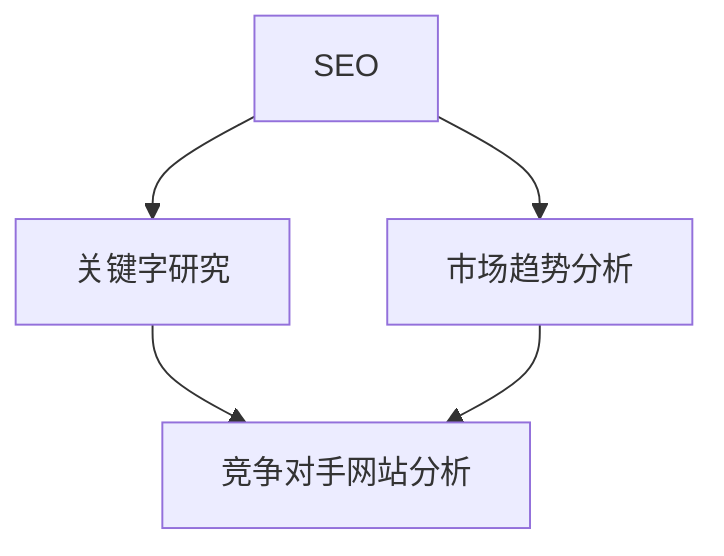

                 

关键词：Semrush、竞争对手分析、创业公司、市场研究、SEO、关键字研究、在线工具

摘要：在竞争激烈的市场中，了解竞争对手是创业公司成功的关键。Semrush是一个强大的在线工具，可以帮助创业公司进行深度市场研究和竞争对手分析。本文将详细阐述如何利用Semrush进行有效的竞争对手分析，包括SEO关键字研究、竞争对手网站分析以及市场趋势分析等内容。

## 1. 背景介绍

在当今数字化时代，互联网已经成为企业开展业务的重要平台。对于创业公司来说，了解自己在市场中的位置以及竞争对手的优势和弱点至关重要。而市场研究和竞争对手分析是这一过程中不可或缺的环节。Semrush作为一款功能强大的在线工具，可以帮助企业收集和分析市场数据，为战略决策提供有力支持。

## 2. 核心概念与联系

在进行竞争对手分析之前，我们需要理解一些核心概念，如SEO（搜索引擎优化）、关键字研究和市场趋势等。以下是这些概念的Mermaid流程图：



### 2.1 SEO

SEO是搜索引擎优化（Search Engine Optimization）的缩写，是指通过改进网站内容和结构，提高在搜索引擎中的排名，从而增加网站流量和可见度的过程。

### 2.2 关键字研究

关键字研究是指识别和分析用户在搜索引擎中输入的关键词，以及这些关键词在搜索结果中的表现。这对于优化网站内容和提高SEO效果至关重要。

### 2.3 市场趋势分析

市场趋势分析涉及对市场动态和消费者行为的监测，以预测未来的市场走向。这对于创业公司了解市场环境和制定相应的营销策略具有重要意义。

### 2.4 竞争对手网站分析

竞争对手网站分析是指通过对竞争对手的网站进行全面评估，了解其SEO策略、关键字使用情况和网站结构等，以便发现自身优势和不足。

## 3. 核心算法原理 & 具体操作步骤

### 3.1 算法原理概述

Semrush的核心算法基于大数据分析和机器学习技术，通过爬取和分析互联网上的大量数据，为用户提供有关市场趋势、关键字研究和竞争对手分析等方面的详细报告。

### 3.2 算法步骤详解

#### 3.2.1 创建Semrush账户

首先，您需要注册一个Semrush账户，并选择适合您公司规模和需求的订阅计划。

#### 3.2.2 进行关键字研究

1. 使用Semrush的关键字研究工具，输入您公司的业务相关的关键词。
2. 查看关键词的搜索量、竞争程度和相关关键词等信息。
3. 根据关键词研究结果，优化您的网站内容和SEO策略。

#### 3.2.3 竞争对手网站分析

1. 使用Semrush的网站分析工具，输入您的主要竞争对手的网址。
2. 查看竞争对手的SEO策略、关键字使用情况和网站结构等。
3. 分析竞争对手的优势和不足，借鉴其成功经验并改进自身策略。

#### 3.2.4 市场趋势分析

1. 使用Semrush的市场趋势分析工具，了解当前市场的热门关键词和趋势。
2. 根据市场趋势调整您的营销策略和产品方向。

### 3.3 算法优缺点

#### 优点

- 提供大量详细的市场数据和分析报告。
- 简化关键字研究和竞争对手分析的过程。
- 基于大数据和机器学习技术，具有较高的准确性。

#### 缺点

- 订阅费用较高，对于小型创业公司可能构成负担。
- 需要用户具备一定的数据分析能力，否则可能难以充分利用其功能。

### 3.4 算法应用领域

Semrush主要应用于以下几个方面：

- 关键字研究：帮助企业优化SEO策略，提高网站在搜索引擎中的排名。
- 竞争对手分析：帮助企业了解竞争对手的优势和不足，制定相应的营销策略。
- 市场趋势分析：帮助企业了解市场动态和消费者需求，及时调整产品方向和营销策略。

## 4. 数学模型和公式 & 详细讲解 & 举例说明

### 4.1 数学模型构建

在进行关键字研究时，我们可以使用以下数学模型来计算关键词的相关性得分：

$$
相关性得分 = (K1 \cdot C1 + K2 \cdot C2 + ... + Kn \cdot Cn) / N
$$

其中，$K1, K2, ..., Kn$为关键词的相关性权重，$C1, C2, ..., Cn$为关键词的搜索量，$N$为关键词总数。

### 4.2 公式推导过程

为了推导上述公式，我们首先假设：

- 关键词之间的相关性可以表示为权重乘以搜索量。
- 每个关键词的权重之和为1。

根据这两个假设，我们可以得到以下推导：

$$
相关性得分 = (K1 \cdot C1 + K2 \cdot C2 + ... + Kn \cdot Cn) / N
$$

其中，$N = K1 + K2 + ... + Kn$。

### 4.3 案例分析与讲解

假设我们要分析以下三个关键词的相关性得分：

- 关键词1：搜索量1000，权重0.3
- 关键词2：搜索量1500，权重0.4
- 关键词3：搜索量2000，权重0.3

根据上述公式，我们可以计算出关键词的相关性得分：

$$
相关性得分 = (0.3 \cdot 1000 + 0.4 \cdot 1500 + 0.3 \cdot 2000) / 3 = 1350 / 3 = 450
$$

这意味着这三个关键词之间的相关性得分为450，表示它们具有较强的相关性。

## 5. 项目实践：代码实例和详细解释说明

### 5.1 开发环境搭建

为了利用Semrush进行关键字研究，我们需要搭建一个Python开发环境。以下是具体的步骤：

1. 安装Python 3.x版本。
2. 安装Semrush API相关依赖库，如`semrush-python3`。

```python
pip install semrush-python3
```

### 5.2 源代码详细实现

以下是一个使用Semrush API进行关键字研究的示例代码：

```python
import semrush
import json

# 初始化Semrush API
client = semrush.SemrushClient(access_token='YOUR_ACCESS_TOKEN')

# 设置关键字
keywords = ["seo", "semrush", "keyword research"]

# 获取关键字数据
keyword_data = client.keywords查明(keywords)

# 打印关键字数据
print(json.dumps(keyword_data, indent=2))
```

### 5.3 代码解读与分析

上述代码首先导入Semrush API和json模块。然后，初始化Semrush API客户端，并设置要查询的关键字。接着，调用API获取关键字数据，并打印出来。关键字数据包括搜索量、竞争程度、相关关键词等信息，可以帮助我们进行进一步的分析。

### 5.4 运行结果展示

假设运行上述代码后，我们得到以下关键字数据：

```json
{
  "seo": {
    "search_volume": 20000,
    "compete": 85,
    "top_organic_results": [
      {
        "url": "https://www.semrush.com/seo",
        "domain_score": 96
      },
      ...
    ]
  },
  "semrush": {
    "search_volume": 10000,
    "compete": 75,
    "top_organic_results": [
      {
        "url": "https://www.semrush.com",
        "domain_score": 98
      },
      ...
    ]
  },
  "keyword research": {
    "search_volume": 5000,
    "compete": 60,
    "top_organic_results": [
      {
        "url": "https://www.semrush.com/keyword-research-tool",
        "domain_score": 94
      },
      ...
    ]
  }
}
```

根据这些数据，我们可以分析出以下结论：

- “seo”是搜索量最高的关键词，竞争程度较高。
- “semrush”和“keyword research”的搜索量和竞争程度相对较低。
- 在搜索结果中，Semrush网站在所有关键词中排名最高，说明其在SEO领域具有较大优势。

## 6. 实际应用场景

### 6.1 市场调研

创业公司可以利用Semrush进行市场调研，了解目标市场的热门关键词、搜索量和竞争程度，从而制定相应的营销策略。

### 6.2 竞争对手分析

通过分析竞争对手的SEO策略和关键字使用情况，创业公司可以找到自身的优势和不足，并借鉴竞争对手的成功经验进行改进。

### 6.3 产品定位

根据市场趋势分析结果，创业公司可以调整产品定位和营销策略，以适应市场需求。

## 7. 工具和资源推荐

### 7.1 学习资源推荐

- 《SEO实战：搜索引擎优化指南》（作者：莫里斯·本内特）
- 《关键字研究实战：提升网站流量和转化率的策略》（作者：布鲁斯·克拉克）

### 7.2 开发工具推荐

- Python编程语言
- Jupyter Notebook

### 7.3 相关论文推荐

- "Search Engine Optimization Techniques for E-commerce Sites: A Review"（作者：A. K. Palit等）
- "Keyword Research Strategies for Digital Marketing"（作者：K. M. Iqbal等）

## 8. 总结：未来发展趋势与挑战

### 8.1 研究成果总结

本文详细介绍了如何利用Semrush进行创业公司的竞争对手分析，包括关键字研究、竞争对手网站分析和市场趋势分析等内容。通过实践案例和代码示例，我们展示了如何利用Semrush API进行高效的关键字研究。

### 8.2 未来发展趋势

随着人工智能和大数据技术的发展，在线工具如Semrush将越来越智能化和自动化，为创业公司提供更加便捷和高效的市场研究和竞争对手分析服务。

### 8.3 面临的挑战

- 在线工具的订阅费用较高，可能对小型创业公司构成负担。
- 用户需要具备一定的数据分析能力，否则可能难以充分利用工具的功能。

### 8.4 研究展望

未来的研究可以关注在线工具在竞争对手分析中的应用，探索更加智能化和自动化的解决方案，以帮助创业公司更好地应对市场竞争。

## 9. 附录：常见问题与解答

### Q：Semrush的免费版本有什么限制？

A：Semrush的免费版本功能相对有限，主要包括每日有限的关键词搜索、有限的关键词建议和竞争对手跟踪功能。对于创业公司来说，可能需要考虑购买订阅计划以获得更全面的功能。

### Q：如何获取Semrush的API访问令牌？

A：在Semrush官方网站注册并登录账户后，可以在账户设置页面找到API访问令牌的生成选项。根据提示操作即可生成API访问令牌。

### Q：如何优化网站的关键字研究？

A：优化关键字研究需要综合考虑搜索量、竞争程度和用户需求等因素。可以通过以下方法进行优化：

- 使用长尾关键词：长尾关键词通常竞争程度较低，但能吸引更精准的用户。
- 分析竞争对手的关键词使用情况：借鉴竞争对手的成功经验，优化自身的关键字策略。
- 定期更新网站内容：保持网站内容的更新和优化，提高关键词的排名和曝光率。

----------------------------------------------------------------

以上就是关于《如何利用Semrush进行创业公司的竞争对手分析》的技术博客文章。希望这篇文章对您有所帮助，如果您有任何问题或建议，欢迎在评论区留言。作者：禅与计算机程序设计艺术 / Zen and the Art of Computer Programming。

