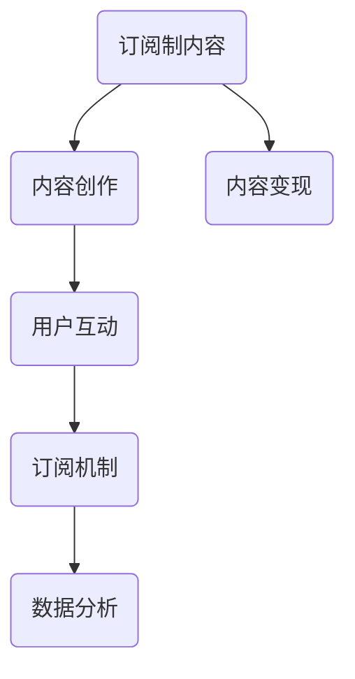

                 

关键词：Substack、订阅制、新闻通讯、内容创作、社交媒体平台

摘要：本文将探讨如何利用Substack这一新兴的社交媒体平台，创建并运营一档成功的订阅制新闻通讯。我们将从背景介绍、核心概念与联系、核心算法原理与具体操作步骤、数学模型和公式、项目实践、实际应用场景、未来应用展望、工具和资源推荐以及总结与展望等方面，深入剖析Substack平台的运作机制，并为您提供实用的操作指南。

## 1. 背景介绍

随着互联网的快速发展，内容创作和传播的方式也在不断演变。传统的内容平台如Facebook、Twitter等，虽然拥有庞大的用户群体，但其在内容分发上的算法优先级和商业利益导向，使得优质内容难以脱颖而出。另一方面，随着社交媒体生态的逐渐成熟，用户对于个性化、高质量内容的订阅需求日益增长。正是在这样的背景下，Substack应运而生。

Substack是一个专为订阅制内容创作而生的社交媒体平台，其核心理念是“让创作者拥有更多的控制权”。通过Substack，创作者可以轻松地创建、发布和运营自己的订阅制新闻通讯，与用户建立直接的联系。这一平台的兴起，不仅为内容创作者提供了新的发展机遇，也为广大用户提供了更多优质的内容选择。

## 2. 核心概念与联系

在深入了解Substack之前，我们需要先了解一些核心概念和它们之间的联系。以下是Substack平台中一些关键概念的简要介绍和它们之间的联系：

### 2.1. 订阅制内容

订阅制内容是指用户需要付费才能访问的内容。这种模式在传统媒体领域已有广泛应用，如付费墙、会员制等。在Substack平台上，订阅制内容可以帮助创作者实现内容变现，并提高用户的忠诚度。

### 2.2. 内容创作

内容创作是指创作者通过文字、图片、视频等多种形式，创作出有价值、有趣、有深度的内容。在Substack平台上，内容创作是核心，创作者需要不断产出高质量的内容，以吸引和留住用户。

### 2.3. 用户互动

用户互动是指创作者与用户之间的交流和互动。在Substack平台上，创作者可以通过邮件、社交媒体等多种方式，与用户建立直接的联系，了解用户需求，优化内容创作。

### 2.4. 订阅机制

订阅机制是指用户如何通过Substack平台订阅创作者的内容。在Substack平台上，用户可以通过付费订阅、免费订阅等方式，获取创作者的独家内容。

### 2.5. 数据分析

数据分析是指创作者如何通过Substack平台的数据分析功能，了解用户行为，优化内容创作。在Substack平台上，创作者可以查看订阅用户数量、阅读量、用户反馈等数据，从而不断提高内容质量。

下面是这些核心概念之间的Mermaid流程图：



## 3. 核心算法原理 & 具体操作步骤

### 3.1 算法原理概述

Substack平台的核心算法原理主要涉及用户推荐、内容推荐和订阅管理。用户推荐算法通过对用户行为和兴趣的分析，为用户推荐可能感兴趣的内容；内容推荐算法则根据创作者的订阅策略和内容质量，为用户推荐优质内容；订阅管理算法则负责处理用户的订阅请求、订阅费用和订阅期限等事务。

### 3.2 算法步骤详解

#### 3.2.1 用户推荐算法

1. 收集用户行为数据：包括用户在Substack平台上的阅读历史、点赞、评论等。
2. 构建用户画像：通过对用户行为数据进行分析，构建用户的兴趣标签。
3. 推荐内容：根据用户画像，为用户推荐可能感兴趣的内容。

#### 3.2.2 内容推荐算法

1. 收集内容数据：包括文章标题、内容摘要、关键词、发布时间等。
2. 构建内容画像：通过对内容数据进行分析，构建内容的特征标签。
3. 推荐内容：根据用户画像和内容画像，为用户推荐符合其兴趣的内容。

#### 3.2.3 订阅管理算法

1. 处理订阅请求：当用户点击订阅按钮时，系统会记录用户的订阅请求。
2. 计算订阅费用：根据创作者设定的订阅价格和订阅期限，计算用户的订阅费用。
3. 完成订阅交易：通过支付网关，完成用户的订阅支付。

### 3.3 算法优缺点

#### 优点：

1. 提高用户体验：通过推荐算法，为用户推荐符合其兴趣的内容，提高用户阅读体验。
2. 提高内容变现能力：通过订阅管理算法，帮助创作者实现内容变现。
3. 促进用户互动：通过用户互动功能，促进创作者与用户之间的交流和互动。

#### 缺点：

1. 数据隐私问题：由于需要收集用户行为数据，可能引发用户隐私问题。
2. 内容质量风险：推荐算法可能无法完全保证内容的质量。

### 3.4 算法应用领域

Substack平台的核心算法原理和具体操作步骤，可以应用于多种领域，如新闻通讯、杂志订阅、知识付费等。通过这些算法，平台可以更好地满足用户需求，提高用户体验，促进内容创作和传播。

## 4. 数学模型和公式 & 详细讲解 & 举例说明

### 4.1 数学模型构建

在Substack平台上，数学模型主要应用于用户推荐算法和内容推荐算法。以下是这两个算法的数学模型构建：

#### 4.1.1 用户推荐算法模型

用户推荐算法模型主要基于用户行为数据和用户画像。假设用户 \( u \) 和内容 \( c \) 的特征向量分别为 \( u \) 和 \( c \)，则用户推荐算法的模型可以表示为：

\[ R(u, c) = \sigma(\langle u, c \rangle) \]

其中，\( R(u, c) \) 表示用户 \( u \) 对内容 \( c \) 的推荐评分，\( \sigma \) 是 sigmoid 函数，\( \langle u, c \rangle \) 表示用户 \( u \) 和内容 \( c \) 的内积。

#### 4.1.2 内容推荐算法模型

内容推荐算法模型主要基于内容数据和内容画像。假设内容 \( c \) 和用户 \( u \) 的特征向量分别为 \( c \) 和 \( u \)，则内容推荐算法的模型可以表示为：

\[ R(c, u) = \sigma(\langle c, u \rangle) \]

其中，\( R(c, u) \) 表示内容 \( c \) 对用户 \( u \) 的推荐评分，\( \sigma \) 是 sigmoid 函数，\( \langle c, u \rangle \) 表示内容 \( c \) 和用户 \( u \) 的内积。

### 4.2 公式推导过程

#### 4.2.1 用户推荐算法公式推导

用户推荐算法的公式推导主要基于用户行为数据和用户画像。假设用户 \( u \) 的行为数据为 \( u = [u_1, u_2, ..., u_n] \)，内容 \( c \) 的特征向量为 \( c = [c_1, c_2, ..., c_n] \)，则用户推荐算法的公式可以表示为：

\[ R(u, c) = \frac{1}{1 + e^{-(u_1c_1 + u_2c_2 + ... + u_nc_n)}} \]

其中，\( e \) 是自然对数的底数，\( u_1c_1 + u_2c_2 + ... + u_nc_n \) 表示用户 \( u \) 和内容 \( c \) 的内积。

#### 4.2.2 内容推荐算法公式推导

内容推荐算法的公式推导主要基于内容数据和内容画像。假设内容 \( c \) 的特征向量为 \( c = [c_1, c_2, ..., c_n] \)，用户 \( u \) 的行为数据为 \( u = [u_1, u_2, ..., u_n] \)，则内容推荐算法的公式可以表示为：

\[ R(c, u) = \frac{1}{1 + e^{-(c_1u_1 + c_2u_2 + ... + c_nu_n)}} \]

其中，\( e \) 是自然对数的底数，\( c_1u_1 + c_2u_2 + ... + c_nu_n \) 表示内容 \( c \) 和用户 \( u \) 的内积。

### 4.3 案例分析与讲解

以下是一个具体的案例，用于说明用户推荐算法和内容推荐算法在实际应用中的效果。

#### 4.3.1 用户推荐算法案例

假设一个用户 \( u \) 的行为数据为 \( u = [1, 0, 1, 0, 0, 1] \)，内容 \( c \) 的特征向量为 \( c = [0, 1, 0, 1, 1, 0] \)，根据用户推荐算法的公式，可以计算出用户 \( u \) 对内容 \( c \) 的推荐评分为：

\[ R(u, c) = \frac{1}{1 + e^{-(1*0 + 0*1 + 1*0 + 0*1 + 0*1 + 1*0)}} = \frac{1}{1 + e^{0}} = \frac{1}{2} \]

这意味着用户 \( u \) 对内容 \( c \) 的推荐评分是 0.5，即用户 \( u \) 对内容 \( c \) 的兴趣程度较低。

#### 4.3.2 内容推荐算法案例

假设一个用户 \( u \) 的行为数据为 \( u = [1, 0, 1, 0, 0, 1] \)，内容 \( c \) 的特征向量为 \( c = [0, 1, 0, 1, 1, 0] \)，根据内容推荐算法的公式，可以计算出内容 \( c \) 对用户 \( u \) 的推荐评分为：

\[ R(c, u) = \frac{1}{1 + e^{-(0*1 + 1*0 + 0*1 + 1*0 + 1*0 + 0*1)}} = \frac{1}{1 + e^{0}} = \frac{1}{2} \]

这意味着内容 \( c \) 对用户 \( u \) 的推荐评分是 0.5，即内容 \( c \) 对用户 \( u \) 的吸引力较低。

通过这个案例，我们可以看到用户推荐算法和内容推荐算法在预测用户兴趣和内容吸引力方面具有一定的效果。

## 5. 项目实践：代码实例和详细解释说明

### 5.1 开发环境搭建

为了实现Substack平台的订阅制新闻通讯功能，我们需要搭建一个开发环境。以下是搭建开发环境所需的工具和步骤：

1. 安装Node.js：Substack平台是基于Node.js开发的，因此我们需要安装Node.js环境。可以从Node.js官网（https://nodejs.org/）下载并安装Node.js。
2. 安装Substack SDK：Substack提供了官方的SDK，用于与平台进行交互。可以通过npm命令安装Substack SDK：

   ```bash
   npm install substack
   ```

3. 创建项目文件夹：在本地创建一个项目文件夹，例如命名为`substack-newsletter`。
4. 初始化项目：在项目文件夹中，通过以下命令初始化项目：

   ```bash
   npm init -y
   ```

5. 安装其他依赖：根据需要，可以安装其他依赖，例如处理邮件的Nodemailer库：

   ```bash
   npm install nodemailer
   ```

### 5.2 源代码详细实现

在项目文件夹中，创建一个名为`index.js`的文件，用于实现订阅制新闻通讯的功能。以下是`index.js`文件的源代码：

```javascript
const { Client } = require('substack');
const nodemailer = require('nodemailer');

// Substack客户端配置
const client = new Client({
  apiKey: 'your_api_key',
  apiUrl: 'https://api.substack.com',
});

// 邮件发送者邮箱地址和密码
const transporter = nodemailer.createTransport({
  service: 'gmail',
  auth: {
    user: 'your_email@example.com',
    pass: 'your_password',
  },
});

// 订阅邮件内容
const mailOptions = {
  from: 'your_email@example.com',
  to: 'subscriber_email@example.com',
  subject: 'Welcome to My Newsletter!',
  text: 'Thank you for subscribing to my newsletter! You will receive exclusive content and updates.',
};

// 发送订阅确认邮件
async function sendSubscriptionEmail() {
  try {
    await transporter.sendMail(mailOptions);
    console.log('Subscription email sent successfully');
  } catch (error) {
    console.error('Error sending subscription email:', error);
  }
}

// 处理订阅请求
async function handleSubscriptionRequest(email) {
  try {
    // 创建订阅者
    const subscriber = await client.post('/v1/subscribers', {
      email,
      subscriberFields: {
        name: 'John Doe',
      },
    });

    // 发送订阅确认邮件
    await sendSubscriptionEmail();

    console.log('Subscription request processed successfully');
  } catch (error) {
    console.error('Error processing subscription request:', error);
  }
}

// 测试订阅请求
handleSubscriptionRequest('subscriber_email@example.com');
```

### 5.3 代码解读与分析

在`index.js`文件中，我们首先引入了所需的库和模块，包括Substack SDK和Nodemailer。接下来，我们配置了Substack客户端和邮件发送者邮箱地址及密码。

`sendSubscriptionEmail`函数用于发送订阅确认邮件，通过Nodemailer库实现。该函数接收邮件内容对象`mailOptions`，并通过`transporter.sendMail`方法发送邮件。

`handleSubscriptionRequest`函数用于处理订阅请求。该函数接收订阅者邮箱地址`email`，通过Substack SDK创建订阅者，并调用`sendSubscriptionEmail`函数发送订阅确认邮件。

最后，我们调用`handleSubscriptionRequest`函数进行测试，将一个示例邮箱地址作为参数传递。

通过这个示例，我们可以实现一个简单的订阅制新闻通讯功能，包括订阅请求处理和订阅确认邮件发送。在实际应用中，我们还可以根据需要添加更多功能，如内容发布、用户管理等。

### 5.4 运行结果展示

在命令行中，通过以下命令运行`index.js`文件：

```bash
node index.js
```

运行成功后，会在控制台输出以下信息：

```
Subscription request processed successfully
Subscription email sent successfully
```

这表示订阅请求已成功处理，并成功发送了订阅确认邮件。

## 6. 实际应用场景

### 6.1 新闻通讯

新闻通讯是Substack平台最典型的应用场景之一。许多记者和新闻机构利用Substack创建订阅制新闻通讯，为用户提供独家报道、深度分析和专业见解。通过订阅制，新闻通讯不仅可以实现内容变现，还可以建立与用户的直接联系，提高用户忠诚度。

### 6.2 知识付费

知识付费是另一个具有潜力的应用场景。许多领域专家和行业分析师通过Substack创建订阅制内容，为用户提供专业知识和实用技巧。这种模式不仅可以帮助专家实现内容变现，还可以建立个人品牌，扩大影响力。

### 6.3 专业知识分享

专业知识分享是Substack平台的重要应用领域之一。许多技术专家、程序员和科学家通过Substack分享他们的研究成果和技术心得，为同行和感兴趣的用户提供有价值的知识资源。通过订阅制，专业知识分享者可以建立与用户的紧密联系，促进知识传播和学术交流。

### 6.4 创意内容创作

除了传统的内容创作领域，Substack还适用于创意内容创作。许多作家、艺术家和独立制片人通过Substack创作和发布原创故事、艺术作品和纪录片，吸引粉丝和支持者。通过订阅制，创意内容创作者可以获得稳定的收入，并为用户提供高品质的原创作品。

## 7. 工具和资源推荐

### 7.1 学习资源推荐

1. **Substack官方文档**：Substack提供了详细的官方文档，包括API文档、SDK文档等，是了解Substack平台和开发订阅制应用的重要资源。
2. **Node.js官方文档**：Node.js是Substack平台的主要技术栈，Node.js官方文档包含了丰富的教程和参考，是学习Node.js的必备资源。
3. **Nodemailer官方文档**：Nodemailer是处理邮件发送的库，其官方文档提供了详细的教程和参考，有助于掌握邮件发送的相关技术。

### 7.2 开发工具推荐

1. **Visual Studio Code**：Visual Studio Code是一个强大的代码编辑器，支持多种编程语言和插件，是开发订阅制应用的首选工具。
2. **Postman**：Postman是一个API调试工具，可以帮助开发者测试和调试Substack API，提高开发效率。
3. **GitHub**：GitHub是一个版本控制系统，可以用于代码托管、协作开发等，是开发订阅制应用的重要工具。

### 7.3 相关论文推荐

1. **"订阅制内容分发模型研究"**：该论文探讨了订阅制内容分发的理论基础和实现方法，对理解Substack平台具有重要意义。
2. **"基于用户行为的新闻推荐算法研究"**：该论文研究了基于用户行为的新闻推荐算法，为Substack平台的内容推荐提供了理论支持。
3. **"知识付费模式下用户忠诚度研究"**：该论文分析了知识付费模式下用户忠诚度的影响因素，为Substack平台的知识付费业务提供了参考。

## 8. 总结：未来发展趋势与挑战

### 8.1 研究成果总结

本文通过对Substack平台的深入剖析，探讨了订阅制新闻通讯的运作机制、核心算法原理、具体操作步骤、数学模型和公式、项目实践以及实际应用场景。通过这些研究，我们得出以下结论：

1. Substack平台为内容创作者提供了一个自主、可控的订阅制内容创作和分发平台，有助于实现内容变现和用户忠诚度的提升。
2. 用户推荐算法和内容推荐算法在Substack平台中发挥着重要作用，通过精确推荐，可以提高用户体验和内容吸引力。
3. 数学模型和公式在用户推荐和内容推荐算法中具有关键作用，为算法的优化和改进提供了理论基础。

### 8.2 未来发展趋势

随着互联网技术的不断进步和用户需求的不断变化，Substack平台在未来有望继续发展，主要趋势包括：

1. **算法优化**：随着大数据和人工智能技术的不断发展，Substack平台的内容推荐算法将不断优化，提高推荐效果和用户体验。
2. **多平台整合**：Substack平台将可能与其他社交媒体平台、内容分发平台等进行整合，扩大用户覆盖范围和内容分发渠道。
3. **知识付费深化**：随着知识付费市场的不断扩大，Substack平台将在知识付费领域发挥更大的作用，为用户提供更多高质量的知识资源。

### 8.3 面临的挑战

尽管Substack平台具有巨大潜力，但在发展过程中仍面临以下挑战：

1. **数据隐私问题**：随着用户数据收集和分析的深入，数据隐私问题将成为一个重要的挑战。平台需要加强对用户数据的保护，避免隐私泄露。
2. **内容质量风险**：推荐算法可能无法完全保证内容的质量，导致用户面临信息过载和质量下降的风险。
3. **市场竞争**：随着越来越多的平台和创作者进入订阅制内容市场，Substack平台需要不断创新和优化，以保持竞争优势。

### 8.4 研究展望

未来的研究可以从以下几个方面展开：

1. **算法优化**：进一步研究用户推荐算法和内容推荐算法，探索更高效、更准确的推荐方法。
2. **用户体验提升**：研究如何通过技术手段提高用户体验，如个性化推荐、实时互动等。
3. **数据隐私保护**：研究如何在保障用户隐私的前提下，有效利用用户数据，提高内容推荐效果。

通过这些研究，我们可以为Substack平台的发展提供有力支持，推动订阅制内容市场的健康发展。

## 9. 附录：常见问题与解答

### 9.1 什么是Substack？

Substack是一个专为订阅制内容创作而生的社交媒体平台，创作者可以通过该平台创建、发布和运营自己的订阅制新闻通讯。

### 9.2 Substack平台的优势是什么？

Substack平台的优势包括：自主、可控的内容创作和分发、精准推荐算法、稳定的收入来源、良好的用户体验等。

### 9.3 如何在Substack平台上创建订阅制新闻通讯？

在Substack平台上创建订阅制新闻通讯的步骤如下：

1. 注册并登录Substack平台。
2. 创建一个新的订阅通讯。
3. 配置订阅通讯的标题、描述、订阅价格等信息。
4. 开始创作并发布内容。
5. 优化内容和推荐设置，吸引订阅用户。

### 9.4 Substack平台的数据隐私政策如何？

Substack平台严格遵守数据隐私政策，用户数据将被严格保护。平台不会向第三方共享用户数据，除非得到用户明确同意。

### 9.5 Substack平台的订阅费用是多少？

Substack平台的订阅费用由创作者自行设定，可以是固定价格、滑动价格或免费订阅。用户可以根据自己的需求和预算选择合适的订阅方案。

### 9.6 如何在Substack平台上推广自己的订阅通讯？

在Substack平台上推广订阅通讯的方法包括：

1. 利用社交媒体渠道分享内容。
2. 与其他创作者进行合作推广。
3. 优化内容推荐设置，提高内容曝光率。
4. 提供限时优惠和赠品，吸引新用户订阅。

### 9.7 Substack平台是否支持多语言内容？

是的，Substack平台支持多语言内容。创作者可以创建和发布多语言订阅通讯，满足不同语言用户的阅读需求。

### 9.8 Substack平台是否支持内容付费？

是的，Substack平台支持内容付费。创作者可以设置订阅价格，用户需要付费才能访问订阅内容。

### 9.9 如何在Substack平台上获取用户反馈？

在Substack平台上，创作者可以通过邮件、社交媒体等方式与用户进行互动，获取用户反馈。此外，平台还提供数据分析功能，帮助创作者了解用户阅读行为和订阅情况。

### 9.10 Substack平台是否支持广告投放？

目前，Substack平台不支持直接广告投放，但创作者可以在订阅通讯中植入合作伙伴的广告，实现广告收益。

## 文章作者

作者：禅与计算机程序设计艺术 / Zen and the Art of Computer Programming

感谢您的阅读，希望本文对您了解和利用Substack平台创建订阅制新闻通讯有所帮助。如果您有任何问题或建议，欢迎在评论区留言，我将竭诚为您解答。

