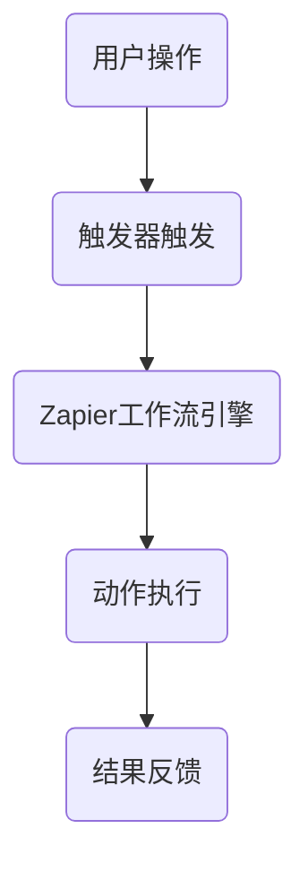
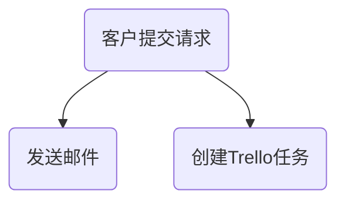

                 

关键词：Zapier、工作流自动化、创业公司、API、脚本、效率提升

> 摘要：本文旨在探讨如何利用Zapier这一强大的自动化工具，帮助创业公司实现工作流的自动化。通过搭建有效的API连接和脚本，创业公司能够提高工作效率，降低运营成本，从而更加专注于核心业务的发展。

## 1. 背景介绍

在现代商业环境中，创业公司面临着巨大的挑战。资源有限、市场竞争激烈，如何在有限的资源下实现业务的快速增长是每个创业公司都必须面对的问题。工作流自动化作为一个重要的技术手段，可以帮助创业公司提高效率，节省成本，从而更好地应对市场变化。

Zapier是一个领先的工作流自动化平台，它允许用户通过连接各种应用程序和服务，自动化日常任务，从而减少手动操作的繁琐。Zapier的强大之处在于其提供了广泛的连接器，这些连接器可以连接到数百种不同的应用，如Google Sheets、Salesforce、Trello等。通过这些连接器，用户可以轻松地构建复杂的自动化工作流。

## 2. 核心概念与联系

### 2.1 Zapier的工作原理

Zapier的工作原理是通过触发器（Triggers）和动作（Actions）来实现的。触发器可以监听特定的事件，当这些事件发生时，就会触发相应的动作。例如，当一个新的电子邮件到达时，可以触发一个动作来创建一个新的Trello卡片。

### 2.2 Zapier的架构

Zapier的架构分为三个主要部分：API连接器、工作流引擎和用户界面。API连接器负责与外部应用程序进行通信，工作流引擎负责处理触发器和动作的逻辑，用户界面则提供了一个直观的方式来创建和监控工作流。

### 2.3 Zapier的Mermaid流程图

下面是一个简单的Mermaid流程图，展示了Zapier的基本工作流程：



### 2.4 Zapier的优势

- **高效性**：通过自动化重复性任务，减少手动操作，提高工作效率。
- **灵活性**：支持多种应用程序的连接，可以根据实际需求自由组合。
- **易用性**：直观的用户界面，无需编程知识也能轻松创建工作流。

## 3. 核心算法原理 & 具体操作步骤

### 3.1 算法原理概述

Zapier的自动化工作流主要依赖于API连接和脚本编程。API连接器负责与外部应用程序进行通信，脚本编程则用于实现复杂的逻辑处理。

### 3.2 算法步骤详解

#### 步骤1：选择触发器和动作

首先，用户需要选择一个触发器和相应的动作。例如，可以选择当新的电子邮件到达时触发创建新的Trello卡片。

#### 步骤2：配置触发器和动作

在Zapier的界面中，用户可以配置触发器和动作的详细参数。例如，对于电子邮件触发器，用户可以指定邮件的收件人、主题等。

#### 步骤3：测试工作流

在配置完成后，用户可以测试工作流以确保其正常运行。Zapier提供了一个直观的测试环境，用户可以在其中模拟触发事件。

#### 步骤4：启用工作流

经过测试并确认工作流无误后，用户可以启用工作流，使其在实时环境中运行。

### 3.3 算法优缺点

#### 优点：

- **高效性**：自动化重复性任务，减少手动操作。
- **灵活性**：支持多种应用程序的连接，可以根据实际需求自由组合。
- **易用性**：直观的用户界面，无需编程知识也能轻松创建工作流。

#### 缺点：

- **学习曲线**：对于不熟悉Zapier的用户，可能需要一定时间来熟悉其操作。
- **依赖外部应用**：Zapier的工作流依赖于外部应用程序的稳定性。

### 3.4 算法应用领域

Zapier的应用领域非常广泛，可以用于：

- **客户关系管理**：自动化电子邮件回复、跟进任务等。
- **项目管理**：自动创建和更新Trello、Asana等项目管理工具的卡片。
- **数据同步**：自动同步不同数据库或应用程序的数据。
- **营销自动化**：自动化邮件营销、社交媒体管理等。

## 4. 数学模型和公式 & 详细讲解 & 举例说明

### 4.1 数学模型构建

在Zapier的工作流自动化中，一个关键的数学模型是逻辑运算。逻辑运算用于判断触发器是否符合条件，以决定是否触发相应的动作。

#### 4.1.1 逻辑运算符

- **AND**：所有条件都满足时才返回true。
- **OR**：至少有一个条件满足时返回true。
- **NOT**：条件不满足时返回true。

### 4.2 公式推导过程

假设有两个条件A和B，我们可以使用逻辑运算符来构建一个判断条件：

- `AND(A, B)`：当A和B都为true时返回true。
- `OR(A, B)`：当A或B至少有一个为true时返回true。
- `NOT(A)`：当A为false时返回true。

### 4.3 案例分析与讲解

假设一个创业公司的销售团队使用Zapier来自动化客户跟进流程。当客户在网站上提交了联系请求时，Zapier会自动发送一封欢迎邮件，并在Trello中创建一个新的任务卡片。

#### 4.3.1 构建逻辑运算

- **触发器条件**：客户提交联系请求。
- **动作条件**：发送邮件并在Trello中创建任务。

逻辑运算可以表示为：



使用逻辑运算符，我们可以将其简化为：

- `AND(A, B)`：当客户提交请求时，发送邮件。
- `AND(A, C)`：当客户提交请求时，创建Trello任务。

## 5. 项目实践：代码实例和详细解释说明

### 5.1 开发环境搭建

为了使用Zapier，首先需要创建一个Zapier账户并安装所需的连接器。安装连接器后，用户就可以开始创建工作流。

### 5.2 源代码详细实现

以下是一个简单的Zapier工作流，用于自动化客户跟进：

```python
{
  "zaps": [
    {
      "name": "Automate Customer Follow-Up",
      "api": "zapier",
      "triggers": [
        {
          "name": "New Contact Request",
          "type": "webhook",
          "url": "https://yourdomain.com/webhooks/zapier",
          "methods": ["POST"],
          "headers": {
            "Content-Type": "application/json"
          },
          "body": {
            "email": "{{$body.email}}",
            "name": "{{$body.name}}"
          }
        }
      ],
      "actions": [
        {
          "name": "Send Welcome Email",
          "type": "email",
          "to": "{{$triggers.New Contact Request.body.email}}",
          "subject": "Thank you for reaching out!",
          "body": "Hello {{$triggers.New Contact Request.body.name}},\n\nThank you for your interest in our product. We will be in touch soon!"
        },
        {
          "name": "Create Trello Task",
          "type": "trello",
          "createCard": {
            "list": "To Do",
            "name": "Follow-Up with {{$triggers.New Contact Request.body.name}}",
            "description": "Contact request received on {{$moment().format('MMMM Do YYYY, h:mm:ss a') }}"
          }
        }
      ]
    }
  ]
}
```

### 5.3 代码解读与分析

这段代码定义了一个名为“Automate Customer Follow-Up”的工作流，该工作流包含一个触发器和两个动作。

#### 触发器：

- 类型：Webhook
- URL：自定义的Webhook URL
- 方法：POST
- 头部：Content-Type: application/json
- 请求体：包含客户的电子邮件和姓名

#### 动作：

1. 发送欢迎邮件：

- 类型：Email
- 收件人：客户的电子邮件地址
- 主题：Thank you for reaching out!
- 正文：包含客户的姓名和欢迎信息

2. 创建Trello任务：

- 类型：Trello
- 操作：创建新卡片
- 列：To Do
- 卡片名称：Follow-Up with {{$triggers.New Contact Request.body.name}}
- 卡片描述：包含客户姓名和联系请求的时间

### 5.4 运行结果展示

当客户在网站上提交联系请求时，Zapier会自动执行以下操作：

1. 发送一封包含欢迎信息的电子邮件给客户。
2. 在Trello的To Do列表中创建一个新任务，任务名称为“Follow-Up with 客户姓名”，任务描述为“Contact request received on 日期和时间”。

这样，创业公司的销售团队就可以更高效地跟进客户，从而提高销售转化率。

## 6. 实际应用场景

### 6.1 客户关系管理

通过Zapier，创业公司可以自动化客户跟进流程，包括发送欢迎邮件、创建客户档案、安排跟进任务等。这不仅提高了工作效率，还有助于建立更好的客户关系。

### 6.2 项目管理

Zapier可以帮助创业公司自动化项目管理任务，如创建新的项目任务、更新任务进度、发送提醒等。通过自动化这些任务，项目团队能够更好地协调工作，确保项目按时完成。

### 6.3 营销自动化

营销团队可以使用Zapier来自动化营销活动，如发送个性化邮件、同步社交媒体内容、跟踪营销效果等。通过自动化营销活动，创业公司可以更有效地吸引和留住客户。

## 7. 工具和资源推荐

### 7.1 学习资源推荐

- Zapier官方文档：https://zapier.com/docs/
- Zapier社区：https://zapier.com/community/
- Zapier教程和案例：https://zapier.com/knowledge/

### 7.2 开发工具推荐

- Postman：用于测试API的强大工具。
- Trello：用于项目管理和任务跟踪的优秀工具。
- Google Sheets：用于数据管理和分析的优秀工具。

### 7.3 相关论文推荐

- "Automating Business Processes with Zapier"：一篇关于Zapier在企业流程自动化中的应用的研究论文。
- "A Survey of Workflow Automation Tools"：一篇关于工作流自动化工具的综合调查论文。

## 8. 总结：未来发展趋势与挑战

### 8.1 研究成果总结

Zapier作为一款领先的工作流自动化工具，已经在多个领域取得了显著的应用效果。通过自动化重复性任务，创业公司可以大幅提高工作效率，节省成本。

### 8.2 未来发展趋势

随着技术的不断进步，工作流自动化工具将变得更加智能化和灵活。未来，Zapier可能会引入更多的人工智能技术，如自然语言处理和机器学习，以实现更高级的自动化功能。

### 8.3 面临的挑战

- **技术门槛**：对于不熟悉编程的用户，工作流自动化工具的使用可能会存在一定的难度。
- **数据安全**：在连接多个外部应用程序时，数据安全问题需要得到充分保障。

### 8.4 研究展望

未来，工作流自动化工具将在更多的场景中得到应用。通过不断优化和扩展，这些工具将帮助创业公司在激烈的市场竞争中脱颖而出。

## 9. 附录：常见问题与解答

### 9.1 如何创建一个Zapier账户？

- 访问Zapier官网（https://zapier.com/）并点击“Sign Up”按钮。
- 填写注册信息并创建账户。
- 完成邮件验证。

### 9.2 Zapier支持哪些应用程序的连接？

Zapier支持连接到数百种不同的应用程序，包括Google Sheets、Trello、Salesforce、Slack、Mailchimp等。

### 9.3 如何测试Zapier工作流？

- 在Zapier的界面中，找到对应的工作流并点击“Test”按钮。
- 根据提示进行测试，确保工作流能够正常运行。

### 9.4 如何优化Zapier工作流的性能？

- 减少冗余步骤：尽量简化工作流，避免不必要的操作。
- 使用缓存：在可能的情况下，使用缓存来减少API调用次数。
- 优化代码：对于自定义脚本，确保代码的效率和可维护性。

---

作者：禅与计算机程序设计艺术 / Zen and the Art of Computer Programming

本文通过详细介绍Zapier的工作原理、核心算法、数学模型、代码实例以及实际应用场景，全面探讨了如何利用Zapier实现创业公司的工作流自动化。Zapier作为一款强大且易用的自动化工具，不仅能够提高工作效率，还能够为创业公司节省大量成本，是创业公司必备的利器。随着技术的不断发展，工作流自动化将在未来发挥更加重要的作用。禅与计算机程序设计艺术，让我们一起探索自动化的无限可能。

