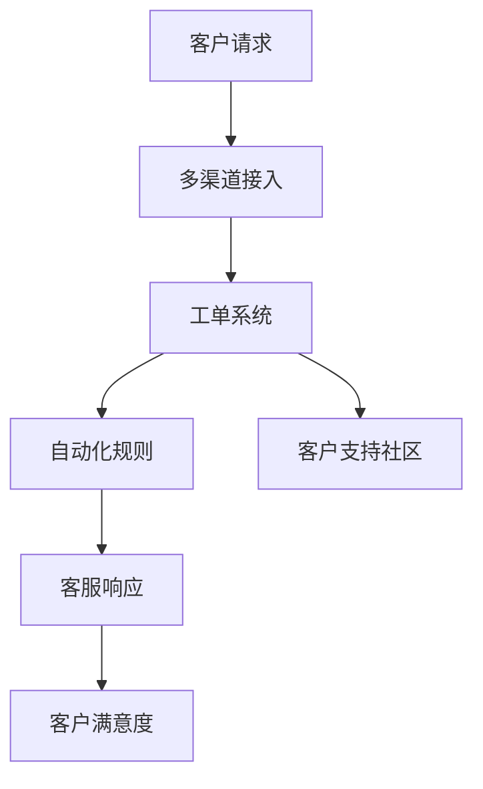

                 

关键词：客户服务、 Zendesk、创业公司、客户关系管理、客户体验、技术解决方案。

> 摘要：本文将深入探讨如何利用 Zendesk 这个强大的客户服务解决方案，为创业公司打造一个高效、个性化的客户服务体系，从而提升客户满意度和公司竞争力。

## 1. 背景介绍

随着互联网的普及和电子商务的快速发展，客户服务已经成为企业成功的关键因素之一。对于创业公司来说，如何在有限的资源下提供高质量的客户服务，是生存和发展的重大挑战。Zendesk 是一家提供客户关系管理（CRM）软件的公司，其产品旨在帮助各类企业，特别是创业公司，简化客户服务流程，提高客户满意度。

## 2. 核心概念与联系

### 2.1 Zendesk 的基本概念

Zendesk 是一个全功能的客户服务与支持平台，它集成了多渠道客户互动功能，如电子邮件、聊天、电话和社交媒体。其核心概念包括：

- **多渠道集成**：Zendesk 能够整合各种沟通渠道，使客服团队能够在统一的平台上处理所有客户请求。
- **自动化流程**：通过自动化规则，Zendesk 可以自动分类、分配和响应客户请求，减少人工工作量。
- **智能工单系统**：Zendesk 的工单系统可以帮助客服团队跟踪每个客户请求的状态和解决进度。
- **客户支持社区**：企业可以通过 Zendesk 创建一个客户支持社区，提供自助服务，减轻客服团队的工作负担。

### 2.2 Zendesk 的架构

为了更好地理解 Zendesk 的功能，以下是一个简单的 Mermaid 流程图，展示了 Zendesk 的核心架构和组件：



## 3. 核心算法原理 & 具体操作步骤

### 3.1 算法原理概述

Zendesk 的核心算法原理主要集中在自动化和智能化处理客户请求。其工作流程如下：

1. **请求接入**：客户通过电子邮件、聊天、电话等渠道发起请求。
2. **请求分类**：系统根据预设的规则对请求进行分类。
3. **请求分配**：根据客服团队的工作分配策略，将请求分配给合适的客服人员。
4. **请求处理**：客服人员通过工单系统处理请求，并可以设置自动化回复和跟进。
5. **请求反馈**：客服处理完成后，客户会得到反馈，满意度也会被收集。

### 3.2 算法步骤详解

#### 3.2.1 请求接入

客户请求接入是 Zendesk 服务的起点。客户可以通过以下几种方式发起请求：

- 电子邮件：客户可以直接将问题通过电子邮件发送到公司的 Zendesk 邮箱。
- 聊天：客户可以访问公司的网站，直接在网页上发起聊天请求。
- 电话：客户可以通过电话拨打公司的客服热线，Zendesk 可以自动记录电话请求。
- 社交媒体：客户可以通过社交媒体平台私信公司账号，Zendesk 可以自动接入并处理。

#### 3.2.2 请求分类

请求分类是 Zendesk 的一个关键步骤，它基于预设的规则和标签自动分类请求。分类规则可以包括：

- 请求类型：如技术支持、账单问题、投诉等。
- 客户等级：如VIP客户、普通客户等。
- 优先级：如高、中、低优先级。

#### 3.2.3 请求分配

请求分配是基于客服团队的工作分配策略。常见的分配策略包括：

- 轮换分配：将请求轮流分配给不同的客服人员。
- 最闲分配：将请求分配给当前工作负担最轻的客服人员。
- 技能匹配：根据客服人员的技能和专长，将请求分配给最合适的人员。

#### 3.2.4 请求处理

客服人员可以通过 Zendesk 的工单系统处理请求。处理流程通常包括：

- 查看请求详情：客服人员可以查看请求的所有相关信息，包括历史沟通记录、客户信息等。
- 自动化回复：客服人员可以使用预设的自动化回复模板快速响应客户。
- 手动回复：客服人员可以撰写个性化回复，解决客户的问题。
- 跟进请求：客服人员可以设置请求的跟进日期，确保问题得到及时解决。

#### 3.2.5 请求反馈

请求处理完成后，客户会得到反馈。反馈的方式可以是：

- 自动邮件通知：系统会自动发送处理完成的邮件通知给客户。
- 客户满意度调查：系统可以引导客户进行满意度调查，收集客户反馈。

### 3.3 算法优缺点

#### 优点

- **高效**：自动化流程提高了工作效率，减少了人工处理的时间。
- **个性**：通过个性化回复和跟进，提升了客户体验。
- **集成**：多渠道接入和工单系统集成了客户服务的所有环节。
- **可扩展**：可以轻松扩展到不同的业务需求和场景。

#### 缺点

- **初始配置复杂**：需要投入时间和资源进行初始配置。
- **依赖网络**：作为云端服务，网络稳定性对服务质量有影响。

### 3.4 算法应用领域

Zendesk 的算法主要应用于客户服务的各个环节，包括：

- **客户支持**：处理客户的各种问题和投诉。
- **售后服务**：跟踪和处理售后问题。
- **客户关系管理**：维护客户关系，提高客户满意度。
- **在线客服**：提供实时在线支持。

## 4. 数学模型和公式 & 详细讲解 & 举例说明

### 4.1 数学模型构建

在客户服务中，可以构建一个简单的数学模型来评估客户满意度和客户流失率。以下是一个简单的模型：

$$
\text{客户满意度} = \frac{\text{正面反馈次数}}{\text{总反馈次数}}
$$

$$
\text{客户流失率} = \frac{\text{流失客户数}}{\text{总客户数}}
$$

### 4.2 公式推导过程

上述公式的推导过程相对简单。客户满意度可以通过比较正面反馈次数和总反馈次数来计算。流失率则是通过流失客户数除以总客户数得到。

### 4.3 案例分析与讲解

假设一个创业公司的客户满意度为 0.8，客户流失率为 0.05。通过这些数据，我们可以初步判断公司的客户服务水平较高，但仍有优化空间。

为提高客户满意度，公司可以：

- 提供更多个性化服务，提升客户体验。
- 加强售后服务，及时解决客户问题。

为降低客户流失率，公司可以：

- 提供更具吸引力的优惠政策。
- 加强客户关系管理，提高客户忠诚度。

## 5. 项目实践：代码实例和详细解释说明

### 5.1 开发环境搭建

为了演示如何利用 Zendesk，我们首先需要搭建一个开发环境。以下是步骤：

1. 注册并登录 Zendesk。
2. 创建一个测试组织。
3. 安装并配置必要的开发工具，如 Postman、Node.js 等。

### 5.2 源代码详细实现

以下是一个简单的示例，演示如何使用 Node.js 和 Zendesk API 创建一个新的客户请求。

```javascript
const axios = require('axios');

const createCustomerRequest = async (requestData) => {
  const apiKey = 'your_api_key';
  const url = `https://yoursubdomain.zendesk.com/api/v2/tickets.json`;

  const response = await axios.post(url, {
    ticket: {
      subject: requestData.subject,
      description: requestData.description,
      requester: {
        email: requestData.email
      }
    }
  }, {
    headers: {
      'Content-Type': 'application/json',
      'Authorization': `Basic ${apiKey}`
    }
  });

  return response.data;
};

const requestData = {
  subject: '账户问题',
  description: '无法登录账户',
  email: 'customer@example.com'
};

createCustomerRequest(requestData)
  .then(response => console.log('Request created:', response))
  .catch(error => console.error('Error creating request:', error));
```

### 5.3 代码解读与分析

上述代码首先引入了 axios 库，用于发起 HTTP 请求。然后定义了一个异步函数 `createCustomerRequest`，用于创建新的客户请求。函数接收一个包含请求数据的对象，如请求主题、描述和客户邮箱。通过 axios.post 方法，将请求数据发送到 Zendesk API 的 `/tickets` 路径。如果请求成功，函数返回响应数据，否则抛出错误。

### 5.4 运行结果展示

运行上述代码后，会创建一个新的客户请求，请求主题为“账户问题”，描述为“无法登录账户”，请求人邮箱为“customer@example.com”。在 Zendesk 的后台，可以查看新创建的请求，并对其进行处理。

## 6. 实际应用场景

### 6.1 电子商务平台

电子商务平台可以利用 Zendesk 提供多渠道客户支持，如处理订单问题、物流查询等。通过自动化和智能化的处理流程，提高客户满意度，降低运营成本。

### 6.2 软件即服务（SaaS）

对于 SaaS 企业，Zendesk 可以提供技术支持和售后服务。通过创建客户支持社区，提供自助服务，减轻客服团队的工作负担。

### 6.3 物流和运输

物流和运输企业可以利用 Zendesk 处理客户关于运输状态的查询、投诉等。通过实时跟进和自动化处理，提高客户体验。

## 7. 工具和资源推荐

### 7.1 学习资源推荐

- 《Zendesk 实用教程》
- 《客户服务与Zendesk实战》
- 《Node.js 与 Zendesk API 开发指南》

### 7.2 开发工具推荐

- Postman：用于测试和调试 HTTP 请求。
- Visual Studio Code：强大的代码编辑器，支持多种编程语言。
- Git：版本控制工具，方便代码管理和协作。

### 7.3 相关论文推荐

- "Customer Satisfaction and Relationship Strength: A Meta-Analytic Review and Theoretical Integration"
- "The Impact of Customer Service Automation on Customer Satisfaction and Loyalty"
- "Using Customer Relationship Management Systems to Improve Customer Service: A Systematic Review"

## 8. 总结：未来发展趋势与挑战

### 8.1 研究成果总结

通过本文的讨论，我们可以总结出以下研究成果：

- Zendesk 为创业公司提供了一套全面的客户服务解决方案。
- 通过自动化和智能化的处理流程，可以提高客户满意度和运营效率。
- 客户满意度评估和流失率评估是衡量客户服务效果的重要指标。

### 8.2 未来发展趋势

未来，客户服务领域将继续向智能化和个性化方向发展。具体趋势包括：

- 人工智能技术的应用，如自然语言处理、机器学习等，将进一步提高客户服务的智能化水平。
- 跨渠道集成和服务机器人将成为主流，提供更无缝的客户体验。
- 客户数据的深度挖掘和分析，为个性化服务和精准营销提供支持。

### 8.3 面临的挑战

尽管客户服务领域有诸多机遇，但也面临以下挑战：

- 数据隐私和安全：随着客户数据的增加，保护数据隐私和安全成为重要问题。
- 技术更新和维护：快速变化的技术环境要求企业持续更新和优化客户服务系统。
- 员工培训和技能提升：随着技术的进步，客服人员需要不断学习和提升技能。

### 8.4 研究展望

未来，我们可以进一步研究以下方向：

- 开发更智能的客户服务机器人，提高处理复杂问题的能力。
- 利用大数据分析，为用户提供个性化的服务和推荐。
- 研究如何更好地平衡自动化和人性化服务，提供最佳客户体验。

## 9. 附录：常见问题与解答

### 9.1 如何配置 Zendesk？

配置 Zendesk 需要以下步骤：

1. 注册并登录 Zendesk。
2. 创建一个组织。
3. 配置多渠道接入，如电子邮件、聊天、电话等。
4. 设置自动化规则和工单系统。
5. 安装必要的插件和扩展。

### 9.2 Zendesk API 如何使用？

使用 Zendesk API，你需要以下步骤：

1. 获取 API 密钥：在 Zendesk 后台获取 API 密钥。
2. 发起 HTTP 请求：使用库如 axios 发起 GET、POST、PUT、DELETE 等请求。
3. 处理响应：根据 API 响应处理数据。

### 9.3 如何评估客户满意度？

评估客户满意度可以通过以下步骤：

1. 设计满意度调查问卷。
2. 通过电子邮件或在线调查发送给客户。
3. 收集并分析反馈数据。
4. 根据客户满意度分数进行评估。

### 9.4 如何降低客户流失率？

降低客户流失率可以通过以下策略：

1. 提供个性化服务和体验。
2. 及时解决客户问题和投诉。
3. 提供优惠和激励措施。
4. 加强客户关系管理，提高客户忠诚度。

以上是关于如何利用 Zendesk 优化创业公司客户服务的一篇全面的技术博客文章。希望这篇文章能为创业者提供有益的指导。作者：禅与计算机程序设计艺术 / Zen and the Art of Computer Programming。

