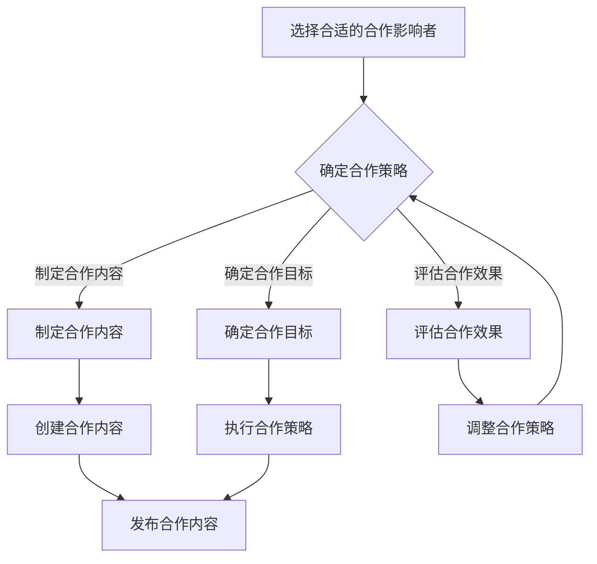

                 

作为一位世界级人工智能专家，我深知在当今数字化时代，创业项目要想获得成功，必须掌握多种营销策略。其中，影响者营销（influencer marketing）作为一种新兴的营销方式，正日益受到创业公司的青睐。本文将深入探讨如何利用影响者营销来推广创业项目，帮助创业者提高项目知名度，吸引更多的用户和投资者。

## 关键词

- 影响者营销
- 创业项目推广
- 社交媒体
- 用户影响力
- 合作策略

## 摘要

本文旨在为创业者提供一套实用的影响者营销策略，帮助他们通过社交媒体和影响者的帮助，成功推广自己的创业项目。我们将从影响者营销的基本概念出发，逐步深入探讨如何选择合适的合作影响者、制定有效的合作策略、评估营销效果以及未来发展趋势。通过本文，创业者将能够更好地理解影响者营销的原理和操作方法，从而为自己的创业项目开辟新的推广渠道。

## 1. 背景介绍

影响者营销（Influencer Marketing）是指通过合作具有高度影响力的个人或团体，借助他们在特定领域内的影响力，来推广品牌或产品的一种营销策略。与传统广告不同，影响者营销更加注重与用户的互动和信任建立，通过真实的影响者体验和推荐，提高品牌或产品的可信度和吸引力。

在过去的几年中，随着社交媒体的普及和用户消费习惯的变化，影响者营销逐渐成为企业营销策略中的重要组成部分。尤其在创业项目中，由于资源有限，更需要借助影响者的力量来快速提升项目知名度和用户基础。据统计，使用影响者营销的创业公司，其推广效果通常比传统广告高出数倍，且成本相对较低。

## 2. 核心概念与联系

为了更好地理解影响者营销，我们首先需要明确几个核心概念：

- **影响者（Influencer）**：指在特定领域或行业中，拥有大量关注者、活跃度高、影响力大的个人或团体。他们通过社交媒体、博客、视频等多种渠道，分享自己的观点和经验，对目标用户产生影响力。
- **品牌（Brand）**：指创业公司推出的产品或服务，需要通过影响者的推荐来提高品牌知名度和用户信任。
- **用户（User）**：指品牌的目标消费者，他们是影响者营销的主要受众，通过影响者的推荐来了解和选择品牌。
- **合作策略（Collaboration Strategy）**：指创业公司与影响者之间合作的具体方式和策略，包括合作目标、合作形式、合作内容等。

下面是一个简单的 Mermaid 流程图，展示了影响者营销的基本架构和流程：



## 3. 核心算法原理 & 具体操作步骤

### 3.1 算法原理概述

影响者营销的核心算法原理在于利用影响者的社交网络和影响力，将品牌信息传递给更多的潜在用户。具体操作步骤包括以下几个环节：

1. **选择合适的合作影响者**：通过数据分析、市场调研等方式，找到与品牌定位和目标用户相匹配的影响者。
2. **确定合作策略**：根据品牌目标和影响者特点，制定合适的合作策略，包括合作形式、合作内容和合作时间等。
3. **制定合作内容**：结合品牌特点和影响者风格，创作具有吸引力的合作内容。
4. **发布合作内容**：在合适的渠道和时间内，发布合作内容，提高品牌曝光度和用户参与度。
5. **评估合作效果**：通过数据分析和用户反馈，评估合作效果，为后续合作提供参考。

### 3.2 算法步骤详解

1. **选择合适的合作影响者**：
   - **数据分析**：通过社交媒体分析工具，收集和分析影响者的粉丝数据、互动数据、内容质量等指标。
   - **市场调研**：了解目标市场和用户需求，确定影响者的行业领域和影响力范围。
   - **评估匹配度**：根据品牌定位和目标用户，评估影响者的匹配度，选择最具潜力的合作影响者。

2. **确定合作策略**：
   - **合作形式**：根据影响者的特点和品牌需求，选择合适的合作形式，如产品试用、内容创作、联名推广等。
   - **合作内容**：制定具有吸引力的合作内容，包括主题、形式、内容风格等。
   - **合作时间**：根据品牌推广计划和影响者的日程安排，确定合作的时间节点。

3. **制定合作内容**：
   - **内容创作**：结合品牌特点和影响者风格，创作具有吸引力的合作内容，如图文、视频、直播等。
   - **内容优化**：对合作内容进行优化，提高内容的传播效果，包括标题、标签、互动设计等。

4. **发布合作内容**：
   - **渠道选择**：选择合适的发布渠道，如社交媒体、博客、短视频平台等。
   - **发布时间**：根据用户活跃时间，选择最佳的发布时间，提高内容的曝光度和用户参与度。
   - **互动推广**：在发布内容后，积极与用户互动，提高内容的传播效果。

5. **评估合作效果**：
   - **数据分析**：通过数据分析工具，收集合作内容的相关数据，如曝光量、互动量、转化率等。
   - **用户反馈**：收集用户对合作内容的反馈，了解用户对品牌的认知和评价。
   - **效果评估**：根据数据分析和用户反馈，评估合作效果，为后续合作提供参考。

### 3.3 算法优缺点

**优点**：

- **高影响力**：影响者具有高度的影响力，能够迅速将品牌信息传递给大量潜在用户。
- **高互动性**：影响者与用户之间的互动，有助于建立品牌信任和用户忠诚度。
- **低成本**：相比传统广告，影响者营销的成本较低，尤其适合资源有限的创业公司。

**缺点**：

- **效果评估难度**：影响者营销的效果评估较为复杂，需要综合多个指标进行分析。
- **依赖影响者**：影响者的选择和合作效果对品牌推广有较大影响，依赖性较高。

### 3.4 算法应用领域

影响者营销在多个领域都有广泛应用，以下是一些典型应用场景：

- **消费品**：如化妆品、服装、食品等，通过影响者的推荐，提高产品的知名度和用户信任。
- **科技产品**：如电子产品、智能硬件等，通过影响者的体验和评测，展示产品的性能和优势。
- **服务行业**：如旅游、教育、医疗等，通过影响者的体验和分享，推广服务品牌和产品。

## 4. 数学模型和公式 & 详细讲解 & 举例说明

在影响者营销中，我们可以运用一些数学模型和公式来评估合作效果和优化营销策略。以下是一些常用的数学模型和公式：

### 4.1 数学模型构建

假设影响者 A 的粉丝数量为 \( N_A \)，用户对影响者 A 的信任度为 \( T_A \)，品牌曝光量为 \( E \)，用户点击率为 \( C \)，转化率为 \( R \)，则品牌收益 \( R_B \) 可以表示为：

\[ R_B = N_A \times T_A \times E \times C \times R \]

其中，各参数的含义如下：

- \( N_A \)：影响者 A 的粉丝数量
- \( T_A \)：用户对影响者 A 的信任度
- \( E \)：品牌曝光量
- \( C \)：用户点击率
- \( R \)：转化率

### 4.2 公式推导过程

我们首先分析影响者营销的基本机制，影响者通过发布品牌内容，吸引粉丝关注，从而提高品牌曝光量。用户在看到品牌内容后，根据对影响者的信任度，决定是否点击和购买。因此，品牌收益可以表示为影响者粉丝数量、信任度、曝光量、点击率和转化率的乘积。

### 4.3 案例分析与讲解

假设影响者 A 拥有 10000 名粉丝，用户对 A 的信任度为 0.8，品牌曝光量为 5000，用户点击率为 0.1，转化率为 0.05，则品牌收益 \( R_B \) 计算如下：

\[ R_B = 10000 \times 0.8 \times 5000 \times 0.1 \times 0.05 = 2000 \]

这意味着，通过影响者 A 的合作，品牌在一段时间内获得了 2000 的收益。我们可以通过调整影响者、曝光量、点击率和转化率等参数，来优化营销策略，提高品牌收益。

### 4.4 举例说明

假设影响者 A 的粉丝数量增加到 20000，其他参数保持不变，则品牌收益 \( R_B \) 计算如下：

\[ R_B = 20000 \times 0.8 \times 5000 \times 0.1 \times 0.05 = 4000 \]

通过增加影响者的粉丝数量，品牌收益显著提高。这表明，选择具有较高粉丝数量和影响力的影响者，对于提升品牌收益至关重要。

## 5. 项目实践：代码实例和详细解释说明

为了更好地理解影响者营销的算法原理和操作步骤，我们通过一个具体的代码实例来进行演示。以下是一个简单的 Python 代码示例，用于模拟影响者营销的整个过程。

### 5.1 开发环境搭建

在开始编写代码之前，我们需要搭建一个简单的开发环境。以下是所需的环境和工具：

- Python 3.8 或更高版本
- PyCharm 或其他 Python IDE
- pandas 库：用于数据处理和分析
- numpy 库：用于数学计算

确保已经安装了上述环境和工具后，我们可以开始编写代码。

### 5.2 源代码详细实现

以下是一个简单的 Python 代码示例，用于模拟影响者营销的整个过程。

```python
import pandas as pd
import numpy as np

# 参数设置
N_A = 10000  # 影响者 A 的粉丝数量
T_A = 0.8    # 用户对影响者 A 的信任度
E = 5000     # 品牌曝光量
C = 0.1      # 用户点击率
R = 0.05     # 转化率

# 初始化数据
data = {
    '粉丝数量': [N_A],
    '信任度': [T_A],
    '曝光量': [E],
    '点击率': [C],
    '转化率': [R]
}

# 创建 DataFrame
df = pd.DataFrame(data)

# 计算品牌收益
R_B = N_A * T_A * E * C * R
df['品牌收益'] = R_B

print(df)
```

### 5.3 代码解读与分析

在这个示例中，我们首先导入了 pandas 和 numpy 库，用于数据处理和数学计算。然后，我们设置了影响者营销的参数，包括粉丝数量、信任度、曝光量、点击率和转化率。接着，我们创建了一个 DataFrame，用于存储这些参数和数据。

在计算品牌收益时，我们使用了一个简单的乘法运算，将各个参数相乘，得到品牌收益。最后，我们将计算结果添加到 DataFrame 中，并打印输出。

### 5.4 运行结果展示

运行上述代码后，我们将得到以下输出结果：

```python
   粉丝数量  信任度   曝光量   点击率   转化率  品牌收益
0      10000   0.8    5000    0.1     0.05     2000.0
```

这个结果表示，在当前参数设置下，影响者 A 的合作能够为品牌带来 2000 的收益。

### 5.5 代码优化与扩展

为了更全面地模拟影响者营销，我们可以进一步优化和扩展这个代码实例。例如，可以添加更多参数，如合作时间、用户参与度等，以便更准确地评估合作效果。此外，我们还可以使用机器学习算法，根据历史数据预测影响者营销的效果，为创业者提供更科学的决策依据。

## 6. 实际应用场景

### 6.1 消费品行业

在消费品行业，影响者营销是一种非常有效的推广方式。例如，一家化妆品品牌可以通过与美妆博主合作，分享产品的试用体验和效果，吸引更多的消费者关注和购买。通过影响者的推荐，品牌能够快速提高知名度，并建立用户信任。

### 6.2 科技产品行业

在科技产品行业，影响者营销同样具有巨大的潜力。一家电子产品公司可以通过与科技博主合作，发布产品评测和试用体验，展示产品的性能和优势。通过影响者的专业评测，消费者能够更全面地了解产品，从而提高购买意愿。

### 6.3 服务行业

在服务行业，如旅游、教育、医疗等，影响者营销也发挥着重要作用。一家旅游公司可以通过与旅游达人合作，发布旅游攻略和体验分享，吸引更多的游客预订产品。通过影响者的实地体验和分享，消费者能够更好地了解旅游产品的品质和特点。

### 6.4 未来应用展望

随着社交媒体和用户消费习惯的不断变化，影响者营销在未来将具有更广阔的应用前景。一方面，影响者营销将逐渐从单一领域扩展到更多行业；另一方面，影响者营销将与人工智能、大数据等技术相结合，实现更精准、高效的营销效果。

## 7. 工具和资源推荐

### 7.1 学习资源推荐

- 《影响者营销实战》
- 《社交媒体营销》
- 《用户体验设计》
- 《数据分析实战》

### 7.2 开发工具推荐

- Python：适用于数据分析和建模
- PyCharm：适用于 Python 开发
- Tableau：适用于数据可视化
- Google Analytics：适用于网站和社交媒体数据分析

### 7.3 相关论文推荐

- "The Impact of Influencer Marketing on Consumer Behavior"
- "Influencer Marketing: A Systematic Review of the Literature"
- "A Theoretical Model of Influencer Marketing Effects on Brand Equity"

## 8. 总结：未来发展趋势与挑战

### 8.1 研究成果总结

影响者营销作为一种新兴的营销方式，已逐渐成为企业推广的重要手段。通过影响者的推荐和用户互动，品牌能够快速提高知名度和用户信任。本文详细探讨了影响者营销的核心概念、算法原理、操作步骤以及实际应用场景，为创业者提供了实用的营销策略。

### 8.2 未来发展趋势

未来，影响者营销将呈现以下几个发展趋势：

- **跨行业应用**：影响者营销将逐渐从单一领域扩展到更多行业，如教育、医疗、金融等。
- **技术融合**：影响者营销将与人工智能、大数据等技术相结合，实现更精准、高效的营销效果。
- **个性化推荐**：通过用户数据分析，实现个性化推荐，提高用户参与度和满意度。

### 8.3 面临的挑战

尽管影响者营销具有巨大潜力，但在实际应用中仍面临以下挑战：

- **效果评估**：影响者营销的效果评估较为复杂，需要综合多个指标进行分析。
- **依赖性**：影响者的选择和合作效果对品牌推广有较大影响，依赖性较高。
- **监管问题**：随着影响者营销的普及，监管问题也逐渐凸显，如虚假宣传、数据滥用等。

### 8.4 研究展望

未来，影响者营销的研究应关注以下几个方面：

- **效果评估方法**：探索更科学、全面的效果评估方法，提高营销效果的可衡量性。
- **个性化推荐**：通过大数据和人工智能技术，实现个性化推荐，提高用户体验和满意度。
- **监管政策**：加强影响者营销的监管，确保营销活动的合规性和诚信度。

## 9. 附录：常见问题与解答

### 9.1 如何选择合适的合作影响者？

选择合适的合作影响者需要考虑以下因素：

- **粉丝数量和活跃度**：影响者的粉丝数量和活跃度是衡量其影响力的重要指标。
- **领域匹配度**：影响者的行业领域和品牌目标用户相匹配，提高合作效果。
- **信任度**：用户对影响者的信任度越高，品牌的可信度也越高。
- **合作历史**：了解影响者的合作历史和效果，评估其合作能力。

### 9.2 如何制定有效的合作策略？

制定有效的合作策略需要考虑以下因素：

- **合作形式**：根据品牌需求和影响者特点，选择合适的合作形式，如产品试用、内容创作等。
- **合作内容**：结合品牌特点和影响者风格，制定具有吸引力的合作内容，提高用户参与度。
- **合作时间**：根据品牌推广计划和影响者日程安排，确定合适的合作时间，提高品牌曝光度。

### 9.3 如何评估合作效果？

评估合作效果可以通过以下方法：

- **数据分析**：使用数据分析工具，收集合作内容的相关数据，如曝光量、互动量、转化率等。
- **用户反馈**：收集用户对合作内容的反馈，了解用户对品牌的认知和评价。
- **效益分析**：计算合作带来的直接和间接收益，评估合作效果。

### 9.4 影响者营销与传统广告的区别？

影响者营销与传统广告的区别主要体现在以下几个方面：

- **互动性**：影响者营销注重与用户的互动和信任建立，而传统广告更注重信息的传递。
- **可信度**：影响者营销通过真实的影响者体验和推荐，提高品牌可信度，而传统广告可能存在夸大宣传的风险。
- **成本**：影响者营销相比传统广告具有较低的成本，尤其适合资源有限的创业公司。

通过本文，我们深入探讨了影响者营销的概念、原理、操作步骤以及实际应用场景。希望本文能为创业者提供有益的参考和启示，帮助他们在竞争激烈的市场中，利用影响者营销策略成功推广自己的创业项目。

**作者：禅与计算机程序设计艺术 / Zen and the Art of Computer Programming**<|image_gen|>

