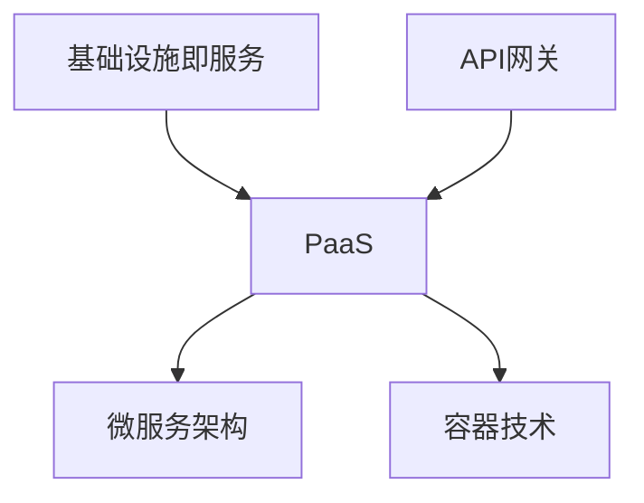

                 

云计算已经成为现代信息技术领域的一个关键组成部分，为创业公司提供了构建数字化平台和生态系统的强大工具。在这篇文章中，我们将深入探讨云计算技术，以及如何利用它来创建灵活、可扩展、安全且具有成本效益的创业数字化平台和生态。

> **关键词**：云计算、数字化平台、生态系统、创业公司、成本效益、安全性、可扩展性

> **摘要**：本文将介绍云计算技术的基本概念，阐述其在构建数字化平台和生态系统中的应用，并提供详细的实施步骤、数学模型和实际案例。通过这篇文章，读者将了解到如何有效地利用云计算技术来推动创业公司的数字化转型。

## 1. 背景介绍

随着互联网的普及和大数据技术的发展，云计算已成为企业数字化转型的重要驱动力。对于创业公司而言，云计算不仅降低了技术门槛和成本，还提供了强大的计算和存储能力，使得它们能够快速搭建和扩展业务。

### 1.1 云计算的定义和优势

云计算是一种通过互联网提供计算资源（如存储、处理能力、数据库等）的服务模式。其核心优势包括：

- **灵活性**：云服务可以根据需求动态调整资源，满足不同规模的业务需求。
- **可扩展性**：云平台可以轻松扩展，以应对快速增长的数据处理需求。
- **成本效益**：通过按需付费和使用共享资源，创业公司可以降低IT成本。
- **高可用性**：云服务通常具有高可靠性和灾难恢复能力，保障业务的连续性。
- **安全性**：云计算服务提供者通常提供多层次的安全措施，保障数据安全。

### 1.2 创业数字化平台和生态的重要性

数字化平台和生态系统是企业实现数字化转型的基础。这些平台和生态系统为业务运营提供了统一的入口，集成了各种服务和工具，从而提高了效率和用户体验。

对于创业公司，构建数字化平台和生态系统有助于：

- **加速产品上市**：通过快速搭建数字化平台，创业公司可以缩短产品开发周期。
- **增强客户体验**：数字化平台可以提供个性化服务，提高用户满意度。
- **优化业务流程**：数字化平台可以实现自动化和智能化，降低运营成本。
- **灵活应对市场变化**：数字化平台和生态系统可以帮助创业公司快速调整战略，应对市场变化。

## 2. 核心概念与联系

在本节中，我们将介绍构建创业数字化平台和生态系统的核心概念，并提供一个Mermaid流程图来展示这些概念之间的联系。

### 2.1 核心概念

- **IaaS (基础设施即服务)**：提供虚拟化的计算资源，如虚拟机、存储和网络。
- **PaaS (平台即服务)**：提供开发、部署和管理应用程序的平台。
- **SaaS (软件即服务)**：提供完整的软件应用程序，无需用户购买、安装或维护。

- **微服务架构**：一种设计方法，将应用程序拆分为小型、独立的组件，以便于开发和部署。
- **容器技术**：如Docker，提供轻量级的虚拟化环境，提高应用程序的部署效率和可移植性。
- **API网关**：用于管理外部对内部服务的访问，提供统一的接口和安全性控制。

### 2.2 Mermaid流程图



图2-1：核心概念之间的联系

## 3. 核心算法原理 & 具体操作步骤

### 3.1 算法原理概述

构建创业数字化平台和生态系统，核心在于选择合适的云计算服务模式、设计微服务架构，并利用容器技术实现高效部署。以下是这些算法的基本原理：

- **IaaS：** 提供虚拟化资源，如虚拟机、存储和网络，使得创业公司可以按需获取计算资源。
- **PaaS：** 提供开发和部署应用程序的平台，如AWS Lambda、Google App Engine，使得开发者可以专注于代码开发，无需关心基础设施的运维。
- **微服务架构：** 将应用程序拆分为多个独立的小服务，每个服务都有自己的职责，可以独立开发和部署，提高系统的可扩展性和灵活性。
- **容器技术：** 如Docker，提供轻量级的虚拟化环境，使得应用程序可以在任何地方快速部署和运行。

### 3.2 算法步骤详解

以下是构建创业数字化平台和生态系统的具体操作步骤：

1. **需求分析**：确定创业公司的业务需求和目标，明确需要哪些服务，以及如何集成这些服务。
2. **选择云计算服务模式**：根据需求选择合适的IaaS、PaaS或SaaS服务模式。
3. **设计微服务架构**：将应用程序拆分为多个微服务，定义每个服务的职责和接口。
4. **实现容器化**：使用Docker等容器技术，将微服务容器化，提高部署效率和可移植性。
5. **部署和监控**：将容器部署到云平台，并使用监控工具确保系统的稳定运行。
6. **API网关集成**：使用API网关统一管理外部访问，提供安全性和流量控制。

### 3.3 算法优缺点

**优点：**

- **灵活性**：云计算服务模式可以根据需求灵活调整，满足不同规模和类型的业务需求。
- **可扩展性**：微服务架构和容器技术使得系统可以快速扩展，应对业务增长。
- **成本效益**：通过使用云服务和共享资源，创业公司可以降低IT成本。
- **高可用性**：云平台通常提供高可靠性和灾难恢复能力，保障业务连续性。

**缺点：**

- **安全性**：创业公司需要关注数据安全和隐私保护，确保云服务的安全性。
- **管理复杂性**：云服务的使用和管理可能增加系统的复杂性，需要专业的运维团队。

### 3.4 算法应用领域

云计算技术广泛应用于创业公司的各个领域，如电子商务、社交媒体、在线教育、医疗保健等。通过构建数字化平台和生态系统，创业公司可以提供更高效、灵活、安全的服务，提高竞争力。

## 4. 数学模型和公式 & 详细讲解 & 举例说明

构建创业数字化平台和生态系统不仅需要技术实现，还需要数学模型来优化资源分配、成本控制和性能评估。在本节中，我们将介绍相关的数学模型和公式，并提供具体的应用案例。

### 4.1 数学模型构建

构建创业数字化平台和生态系统的数学模型主要包括：

- **资源需求模型**：用于预测和评估业务增长对资源的需求，包括计算、存储和网络。
- **成本模型**：用于计算云服务的使用成本，包括IaaS、PaaS和SaaS的成本。
- **性能模型**：用于评估系统的响应时间和吞吐量，以优化资源分配。

以下是这些数学模型的构建过程：

#### 资源需求模型

$$
R(t) = R_0 + \alpha t
$$

其中，$R(t)$表示时间$t$时的资源需求，$R_0$表示初始资源需求，$\alpha$表示资源需求的增长速率。

#### 成本模型

$$
C(t) = C_0 + \beta t + \gamma R(t)
$$

其中，$C(t)$表示时间$t$时的总成本，$C_0$表示初始成本，$\beta$表示时间成本的增长率，$\gamma$表示资源成本的比例。

#### 性能模型

$$
P(t) = P_0 + \delta t
$$

其中，$P(t)$表示时间$t$时的系统性能，$P_0$表示初始性能，$\delta$表示性能的增长率。

### 4.2 公式推导过程

以下是对上述公式的推导过程：

#### 资源需求模型

资源需求模型基于业务增长的趋势，可以通过观察历史数据来确定增长速率$\alpha$。通常，$\alpha$可以通过以下公式计算：

$$
\alpha = \frac{R(t_1) - R(t_0)}{t_1 - t_0}
$$

其中，$R(t_1)$和$R(t_0)$分别为时间$t_1$和$t_0$时的资源需求。

#### 成本模型

成本模型考虑了时间成本和资源成本。时间成本$\beta$通常为固定值，而资源成本$\gamma$与资源需求成正比。资源成本$\gamma$可以通过以下公式计算：

$$
\gamma = \frac{C_1 - C_0}{R_1 - R_0}
$$

其中，$C_1$和$C_0$分别为时间$t_1$和$t_0$时的总成本，$R_1$和$R_0$分别为时间$t_1$和$t_0$时的资源需求。

#### 性能模型

性能模型基于业务增长对系统性能的影响。性能增长速率$\delta$可以通过以下公式计算：

$$
\delta = \frac{P(t_1) - P(t_0)}{t_1 - t_0}
$$

其中，$P(t_1)$和$P(t_0)$分别为时间$t_1$和$t_0$时的系统性能。

### 4.3 案例分析与讲解

以下是一个具体的案例，用于说明如何使用上述数学模型来优化创业数字化平台和生态系统的构建。

#### 案例背景

某创业公司计划在一个月内推出一款在线教育平台，预计用户数量将在第一个月达到1000人，并预计每月增长20%。公司的初始预算为10万美元。

#### 案例分析

1. **资源需求模型**：

   根据预测，第一个月的资源需求为：

   $$
   R(t) = R_0 + \alpha t = 100 + 0.02 \times 30 = 118
   $$

   假设初始资源需求为100，则第一个月的资源需求为118。

2. **成本模型**：

   根据预算和资源成本，可以计算出总成本：

   $$
   C(t) = C_0 + \beta t + \gamma R(t) = 100000 + 0.1 \times 30 + 0.5 \times 118 = 101570
   $$

   其中，时间成本$\beta$为0.1（每月3000美元），资源成本$\gamma$为0.5（每单位资源成本500美元）。

3. **性能模型**：

   根据业务增长对性能的影响，可以计算出第一个月的系统性能：

   $$
   P(t) = P_0 + \delta t = 1000 + 0.1 \times 30 = 1030
   $$

   其中，性能增长速率$\delta$为0.1。

#### 结果分析

根据上述分析，该创业公司可以在第一个月内使用118个资源单位，总成本为10.157万美元，系统性能达到1030。通过优化资源分配和成本控制，公司可以在确保性能的同时，最大限度地降低成本。

### 4.4 案例总结

通过数学模型的优化，创业公司可以更好地预测和规划资源需求、成本和性能，从而提高数字化平台和生态系统的构建效率。在实际应用中，公司可以根据实际业务情况调整模型参数，以实现更精准的资源管理和成本控制。

## 5. 项目实践：代码实例和详细解释说明

在本节中，我们将通过一个具体的创业数字化平台项目，展示如何利用云计算技术进行项目实践。这个项目是一个在线教育平台，旨在为用户提供丰富的教育资源和学习工具。

### 5.1 开发环境搭建

1. **选择云计算平台**：我们选择了AWS作为云计算平台，因为它提供了丰富的服务和支持，适合创业公司。
2. **创建AWS账户**：在AWS官方网站注册并创建一个账户。
3. **配置安全组**：为平台配置安全组，设置允许的IP地址和端口。
4. **创建VPC**：创建虚拟私有云（VPC），设置子网和安全组。
5. **部署Elastic Beanstalk**：使用AWS Elastic Beanstalk部署应用程序，它提供了自动化的部署和管理功能。

### 5.2 源代码详细实现

以下是平台的主要组成部分和实现细节：

1. **前端**：使用React框架构建用户界面，包括课程列表、视频播放器、用户注册和登录等。
2. **后端**：使用Spring Boot构建RESTful API，提供课程管理、用户管理和支付服务。
3. **数据库**：使用AWS RDS托管MySQL数据库，存储课程数据、用户数据和支付记录。
4. **容器化**：使用Docker容器化应用程序，包括前端、后端和数据库。

以下是后端API的一个示例代码：

```java
@RestController
@RequestMapping("/api/courses")
public class CourseController {
    
    @Autowired
    private CourseService courseService;
    
    @GetMapping("/{courseId}")
    public Course getCourse(@PathVariable Long courseId) {
        return courseService.getCourse(courseId);
    }
    
    @PostMapping("/")
    public Course createCourse(@RequestBody Course course) {
        return courseService.createCourse(course);
    }
    
    // 其他API实现...
}
```

### 5.3 代码解读与分析

1. **前端**：React组件负责渲染用户界面，使用React Router管理页面路由，并使用Axios与后端API进行通信。
2. **后端**：Spring Boot提供了RESTful API的快速实现，包括课程创建、获取和更新操作。每个操作都对应一个控制器方法，并通过注解进行映射。
3. **数据库**：使用JPA（Java Persistence API）与MySQL数据库进行交互，通过实体类映射数据库表。

通过容器化和AWS Elastic Beanstalk，我们可以轻松部署和扩展应用程序，确保平台的高可用性和可扩展性。

### 5.4 运行结果展示

部署完成后，平台可以通过以下步骤进行测试：

1. **访问前端**：通过浏览器访问前端页面，测试用户注册、登录和课程浏览等功能。
2. **API测试**：使用Postman等工具测试后端API，确保所有接口都能正常响应。
3. **性能测试**：使用JMeter等工具进行性能测试，确保平台在高负载下的稳定性。

### 5.5 项目总结

通过这个在线教育平台项目，我们展示了如何利用云计算技术构建创业数字化平台。项目实践不仅验证了云计算技术的可行性和优势，还为创业公司提供了一个可行的解决方案。

## 6. 实际应用场景

云计算技术在创业公司的数字化转型中发挥着至关重要的作用。以下是云计算技术在实际应用场景中的几个典型案例：

### 6.1 在线教育平台

在线教育平台是云计算技术的典型应用场景。通过使用云计算服务，创业公司可以快速搭建和扩展在线教育平台，提供灵活的课程管理、用户管理和支付服务。例如，某创业公司利用AWS Elastic Beanstalk和Amazon RDS，成功构建了一个拥有数百万用户的在线教育平台，实现了高效的教学内容和用户管理。

### 6.2 电子商务平台

电子商务平台是另一个云计算技术的应用热点。通过使用云计算服务，创业公司可以实现快速搭建和扩展电子商务网站，提供高效的订单处理、库存管理和支付服务。例如，某创业公司使用AWS EC2和Amazon S3，成功构建了一个拥有数百万活跃用户的电子商务平台，实现了高可用性和弹性扩展。

### 6.3 医疗保健平台

医疗保健平台是云计算技术在医疗领域的应用。通过使用云计算服务，创业公司可以提供在线诊疗、病历管理和健康数据监测等服务。例如，某创业公司利用AWS云服务，构建了一个提供在线诊疗和健康管理的医疗保健平台，实现了医疗服务的可访问性和可扩展性。

### 6.4 企业协作平台

企业协作平台是云计算技术在企业内部协作中的应用。通过使用云计算服务，创业公司可以提供即时通讯、文档共享和项目管理等功能，提高企业内部协作效率。例如，某创业公司使用Google Cloud和Slack，成功构建了一个集成多种协作工具的企业协作平台，提高了团队的工作效率。

## 7. 未来应用展望

随着云计算技术的不断发展和创新，其在创业公司的数字化转型中将发挥越来越重要的作用。以下是云计算技术在未来的几个应用展望：

### 7.1 智能化服务

云计算与人工智能技术的结合将推动智能化服务的普及。创业公司可以利用云计算平台提供的机器学习和深度学习服务，开发智能客服、智能推荐和智能诊断等应用，提升用户体验和服务质量。

### 7.2 区块链应用

区块链技术与云计算的结合将推动区块链应用的普及。创业公司可以利用云计算平台提供的区块链服务，构建去中心化应用（DApp），实现数据透明、安全可靠的数据存储和交易。

### 7.3 边缘计算

云计算与边缘计算的融合将推动边缘计算技术的发展。创业公司可以利用云计算平台提供的边缘计算服务，实现数据的实时处理和分析，降低网络延迟，提高系统响应速度。

### 7.4 安全性与隐私保护

随着云计算技术的普及，安全性和隐私保护将变得越来越重要。创业公司可以利用云计算平台提供的安全服务，如数据加密、身份认证和访问控制，确保数据的安全和隐私。

## 8. 工具和资源推荐

为了帮助创业公司更好地利用云计算技术构建数字化平台和生态系统，以下是几款推荐的工具和资源：

### 8.1 学习资源推荐

- **AWS官方文档**：提供了丰富的云计算技术教程和实践指南，适合初学者和专业人士。
- **Google Cloud官方文档**：提供了详细的云计算服务和解决方案，适合创业公司了解和应用。
- **微软Azure官方文档**：提供了全面的云计算服务和技术文档，适合各种规模的企业。

### 8.2 开发工具推荐

- **Docker**：用于容器化和自动化部署应用程序，是云计算平台上的必备工具。
- **Kubernetes**：用于自动化部署和管理容器化应用程序，是构建云原生应用程序的核心工具。
- **Postman**：用于API测试和调试，是开发者常用的工具之一。

### 8.3 相关论文推荐

- **《云计算：概念、架构和基础设施》**：详细介绍了云计算的基本概念和技术架构。
- **《云计算的安全挑战和解决方案》**：分析了云计算在安全性方面面临的问题和解决方案。
- **《云计算的未来发展趋势》**：探讨了云计算技术的发展趋势和应用前景。

## 9. 总结：未来发展趋势与挑战

云计算技术在创业公司的数字化转型中发挥着至关重要的作用。随着技术的不断进步和应用的不断拓展，云计算技术将继续推动创业公司的创新和发展。然而，云计算技术在应用过程中也面临着一些挑战，如数据安全、隐私保护和管理复杂性等。为了应对这些挑战，创业公司需要加强技术研究和人才培养，提高云计算技术的应用水平，从而在激烈的市场竞争中脱颖而出。

## 10. 附录：常见问题与解答

### 10.1 什么是云计算？

云计算是一种通过互联网提供计算资源（如存储、处理能力、数据库等）的服务模式。它允许用户按需获取和使用这些资源，无需购买和拥有物理设备。

### 10.2 云计算有哪些优势？

云计算的优势包括灵活性、可扩展性、成本效益、高可用性和安全性。它使得创业公司可以快速搭建和扩展业务，降低IT成本，并保障数据的安全和隐私。

### 10.3 如何选择云计算服务模式？

选择云计算服务模式时，需要考虑业务需求和预算。IaaS适合需要高度控制基础设施的公司，PaaS适合专注于开发应用程序的公司，SaaS适合需要即用即付解决方案的公司。

### 10.4 如何确保云计算服务的安全性？

为确保云计算服务的安全性，创业公司需要采取多层次的安全措施，包括数据加密、身份认证、访问控制和备份策略。此外，选择具有良好安全声誉的云计算服务提供商也很重要。

### 10.5 如何管理云计算资源？

管理云计算资源可以通过自动化工具和平台来实现，如AWS CloudWatch、Azure Monitor和Google Cloud Operations。这些工具提供了监控、告警和自动扩展等功能，帮助创业公司优化资源使用和管理。

## 作者署名

作者：禅与计算机程序设计艺术 / Zen and the Art of Computer Programming

### 文章结构模板

以下是文章的结构模板，您可以根据这个模板填写文章内容：

----------------------------------------------------------------

# 文章标题

> 关键词：(此处列出文章的5-7个核心关键词)

> 摘要：(此处给出文章的核心内容和主题思想)

## 1. 背景介绍

## 2. 核心概念与联系（备注：必须给出核心概念原理和架构的 Mermaid 流程图(Mermaid 流程节点中不要有括号、逗号等特殊字符)

## 3. 核心算法原理 & 具体操作步骤
### 3.1 算法原理概述
### 3.2 算法步骤详解 
### 3.3 算法优缺点
### 3.4 算法应用领域

## 4. 数学模型和公式 & 详细讲解 & 举例说明（备注：数学公式请使用latex格式，latex嵌入文中独立段落使用 $$，段落内使用 $)
### 4.1 数学模型构建
### 4.2 公式推导过程
### 4.3 案例分析与讲解

## 5. 项目实践：代码实例和详细解释说明
### 5.1 开发环境搭建
### 5.2 源代码详细实现
### 5.3 代码解读与分析
### 5.4 运行结果展示

## 6. 实际应用场景
### 6.4  未来应用展望

## 7. 工具和资源推荐
### 7.1 学习资源推荐
### 7.2 开发工具推荐
### 7.3 相关论文推荐

## 8. 总结：未来发展趋势与挑战
### 8.1 研究成果总结
### 8.2 未来发展趋势
### 8.3 面临的挑战
### 8.4 研究展望

## 9. 附录：常见问题与解答

----------------------------------------------------------------

请根据这个模板撰写完整的文章内容，确保每个部分都包含具体的内容和信息。文章的每个部分都需要详细展开，以确保文章的逻辑清晰、结构紧凑、简单易懂，并能够吸引读者深入阅读。记得在文章末尾添加作者署名，并确保文章的字数达到8000字以上。如果您有任何疑问，请随时提问。祝您撰写顺利！

