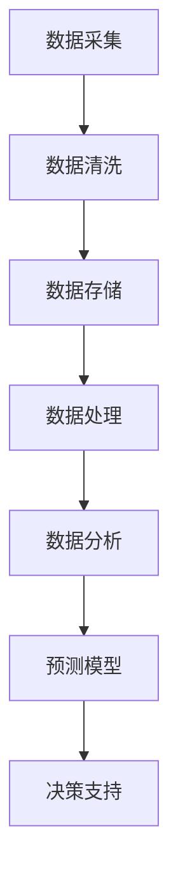

                 

关键词：大数据，库存管理，优化算法，实时分析，预测模型，数据挖掘，机器学习，物联网。

> 摘要：本文将探讨如何利用大数据技术优化库存管理。通过介绍大数据在库存管理中的应用，分析相关核心概念与联系，讲解核心算法原理与操作步骤，构建数学模型，提供实际项目实践案例，分析实际应用场景，展望未来发展趋势与挑战，最后推荐学习资源和开发工具。

## 1. 背景介绍

随着全球经济的快速发展，市场竞争日益激烈，企业面临着库存管理的巨大挑战。库存管理不仅是企业运营的重要环节，也是提高竞争力、降低成本的关键因素。传统的库存管理方法往往依赖于人工经验和简单的统计方法，难以应对复杂的市场环境和快速变化的需求。

大数据技术的出现为库存管理带来了新的契机。大数据技术具有数据量大、类型多样、处理速度快、价值密度低等特点，可以通过实时分析、预测模型和数据挖掘等技术手段，帮助企业实现库存管理的智能化、精细化和高效化。

本文将重点介绍如何利用大数据技术优化库存管理，从核心概念、算法原理、数学模型、项目实践、应用场景、未来展望等方面进行详细阐述。

## 2. 核心概念与联系

在探讨大数据技术优化库存管理之前，我们需要了解一些核心概念与联系。以下是本文涉及的核心概念及其相互关系：

### 2.1. 大数据技术

大数据技术是指从大量、多样、快速变化的数据中，通过数据挖掘、机器学习、统计分析等方法，提取出有价值信息的技术。大数据技术主要包括数据采集、存储、处理、分析和可视化等环节。

### 2.2. 库存管理

库存管理是指企业对库存物资进行计划、控制、分配、储存、盘点等活动的管理过程。库存管理的主要目标是在保证生产供应和市场需求的前提下，降低库存成本，提高资金利用效率。

### 2.3. 实时分析

实时分析是指利用大数据技术，对实时产生的海量数据进行快速处理、分析和反馈，为企业决策提供实时支持。实时分析在库存管理中的应用，可以实现库存水平实时监控、异常情况快速识别和处理。

### 2.4. 预测模型

预测模型是指利用历史数据和统计方法，对未来市场趋势、需求变化等进行预测。预测模型在库存管理中的应用，可以帮助企业制定科学的库存计划，避免库存过多或不足。

### 2.5. 数据挖掘

数据挖掘是指从大量数据中发现规律、关联、模式等有价值信息的过程。数据挖掘在库存管理中的应用，可以帮助企业发现潜在问题、优化库存策略、提高库存利用率。

### 2.6. 物联网

物联网是指通过互联网将各种设备、传感器、系统等连接起来，实现信息共享和智能协同。物联网在库存管理中的应用，可以实现对库存物资的实时监控、自动化管理和智能调度。

### 2.7. 大数据与库存管理的联系

大数据技术与库存管理的联系主要体现在以下几个方面：

- **数据来源**：大数据技术可以从多个渠道获取库存数据，如销售数据、采购数据、库存盘点数据等。
- **数据处理**：大数据技术可以对库存数据进行清洗、集成、分析等处理，提高数据质量和利用效率。
- **决策支持**：大数据技术可以为企业提供实时、准确的库存信息，支持企业制定科学、合理的库存管理策略。
- **预测预警**：大数据技术可以基于历史数据和市场趋势，对库存需求进行预测，提前预警潜在问题，降低库存风险。

### 2.8. Mermaid 流程图

以下是一个简单的 Mermaid 流程图，展示大数据技术在库存管理中的应用流程：



## 3. 核心算法原理 & 具体操作步骤

### 3.1. 算法原理概述

大数据技术在库存管理中的应用，主要涉及以下核心算法：

- **数据挖掘算法**：如关联规则挖掘、聚类分析、分类算法等，用于发现库存数据中的潜在规律和关联。
- **机器学习算法**：如线性回归、逻辑回归、神经网络等，用于构建库存预测模型。
- **实时分析算法**：如流计算、图计算等，用于实时处理和监控库存数据。
- **优化算法**：如线性规划、动态规划、遗传算法等，用于优化库存管理策略。

### 3.2. 算法步骤详解

以下是大数据技术在库存管理中的应用步骤：

#### 3.2.1. 数据采集

- **采集渠道**：销售系统、采购系统、仓储管理系统、物联网传感器等。
- **数据类型**：库存数量、销售数据、采购数据、库存成本、库存周转率等。

#### 3.2.2. 数据清洗

- **去重**：去除重复数据。
- **缺失值处理**：填充缺失值或删除缺失数据。
- **异常值处理**：去除异常值或对异常值进行修正。

#### 3.2.3. 数据存储

- **数据库选择**：如 MySQL、MongoDB、Hadoop 等。
- **数据结构设计**：根据业务需求，设计合理的数据库表结构。

#### 3.2.4. 数据处理

- **数据集成**：将不同来源的数据进行整合。
- **数据转换**：将数据转换为适合分析的形式。
- **数据归一化**：对不同量纲的数据进行归一化处理。

#### 3.2.5. 数据分析

- **关联分析**：发现库存数据中的关联关系，如销售与库存之间的关系。
- **聚类分析**：将相似数据划分为同一类别，如库存商品的分类。
- **分类算法**：将库存数据划分为不同类别，如库存预警级别的划分。

#### 3.2.6. 预测模型

- **模型选择**：选择合适的机器学习算法，如线性回归、神经网络等。
- **模型训练**：利用历史数据对模型进行训练。
- **模型评估**：评估模型预测的准确性，如均方误差、准确率等。

#### 3.2.7. 决策支持

- **库存计划**：根据预测模型和业务需求，制定库存计划。
- **库存监控**：实时监控库存水平，及时发现异常情况。
- **库存优化**：利用优化算法，调整库存策略，降低库存成本。

### 3.3. 算法优缺点

#### 优点：

- **实时性**：大数据技术可以实现库存数据的实时处理和分析，为决策提供及时支持。
- **准确性**：大数据技术可以根据历史数据和实时数据，预测库存需求，提高决策的准确性。
- **智能化**：大数据技术可以利用机器学习和优化算法，实现库存管理的智能化。

#### 缺点：

- **技术门槛**：大数据技术涉及多个领域，技术门槛较高，需要专业人才。
- **数据质量**：数据质量对算法性能有重要影响，需要投入大量精力进行数据清洗和处理。

### 3.4. 算法应用领域

大数据技术在库存管理中的应用领域包括：

- **零售行业**：如电商、超市等，通过实时监控库存水平，优化库存策略。
- **制造业**：如生产线上的原材料、成品库存管理，通过预测需求，降低库存成本。
- **物流行业**：如快递、物流公司，通过实时分析运输数据，优化运输路线和仓储布局。

## 4. 数学模型和公式 & 详细讲解 & 举例说明

### 4.1. 数学模型构建

在库存管理中，常用的数学模型包括：

- **需求预测模型**：如线性回归模型、神经网络模型等。
- **库存优化模型**：如线性规划模型、动态规划模型等。

以下是一个简单的线性回归需求预测模型：

$$
y = \beta_0 + \beta_1 \cdot x + \epsilon
$$

其中，$y$ 表示需求量，$x$ 表示影响因素（如时间、价格等），$\beta_0$ 和 $\beta_1$ 分别为模型参数，$\epsilon$ 为随机误差。

### 4.2. 公式推导过程

以线性回归模型为例，公式推导过程如下：

1. **假设**：需求量 $y$ 与影响因素 $x$ 之间存在线性关系，即 $y = \beta_0 + \beta_1 \cdot x + \epsilon$。
2. **最小二乘法**：为了求解模型参数 $\beta_0$ 和 $\beta_1$，采用最小二乘法，使得预测值与实际值之间的误差平方和最小，即：
$$
\sum_{i=1}^{n} (y_i - \hat{y_i})^2 = \sum_{i=1}^{n} (y_i - (\beta_0 + \beta_1 \cdot x_i))^2
$$
3. **求解**：对上述公式求导并令导数为零，得到：
$$
\frac{\partial}{\partial \beta_0} \sum_{i=1}^{n} (y_i - \hat{y_i})^2 = 0 \\
\frac{\partial}{\partial \beta_1} \sum_{i=1}^{n} (y_i - \hat{y_i})^2 = 0
$$
4. **解方程组**：解上述方程组，得到模型参数 $\beta_0$ 和 $\beta_1$。

### 4.3. 案例分析与讲解

以下是一个简单的库存管理案例：

#### 案例背景

某电商公司在销售某款产品时，发现销量与价格之间存在一定的线性关系。为了更好地制定库存管理策略，公司决定利用线性回归模型进行需求预测。

#### 数据处理

1. **数据采集**：收集了过去一个月的销量和价格数据，如下表：

| 日期 | 价格（元）| 销量（件）|
| --- | --- | --- |
| 2021-01-01 | 100 | 100 |
| 2021-01-02 | 100 | 150 |
| 2021-01-03 | 100 | 200 |
| 2021-01-04 | 100 | 250 |
| 2021-01-05 | 100 | 300 |
| 2021-01-06 | 100 | 350 |
| 2021-01-07 | 100 | 400 |
| 2021-01-08 | 100 | 450 |
| 2021-01-09 | 100 | 500 |
| 2021-01-10 | 100 | 550 |

2. **数据清洗**：去重、处理缺失值和异常值。

3. **数据存储**：将清洗后的数据存储到数据库中。

#### 模型训练

1. **数据预处理**：对数据进行归一化处理。

2. **模型训练**：利用线性回归模型，训练模型参数。

3. **模型评估**：计算模型预测误差，评估模型性能。

#### 模型应用

1. **预测需求**：根据模型参数，预测未来一段时间的需求量。

2. **制定库存计划**：根据预测结果，制定合理的库存管理策略。

3. **监控库存水平**：实时监控库存水平，及时调整库存计划。

## 5. 项目实践：代码实例和详细解释说明

### 5.1. 开发环境搭建

1. **软件环境**：Python 3.8、NumPy、Pandas、Scikit-learn、Matplotlib。
2. **数据库环境**：MySQL。

### 5.2. 源代码详细实现

以下是一个简单的线性回归需求预测项目的源代码实现：

```python
import numpy as np
import pandas as pd
from sklearn.linear_model import LinearRegression
from sklearn.model_selection import train_test_split
import matplotlib.pyplot as plt

# 数据采集与清洗
data = pd.read_csv('sales_data.csv')
data.drop_duplicates(inplace=True)
data.fillna(method='ffill', inplace=True)

# 数据预处理
data['Price'] = (data['Price'] - data['Price'].mean()) / data['Price'].std()
data['Sales'] = (data['Sales'] - data['Sales'].mean()) / data['Sales'].std()

# 模型训练
X = data[['Price']]
y = data['Sales']
X_train, X_test, y_train, y_test = train_test_split(X, y, test_size=0.2, random_state=42)
model = LinearRegression()
model.fit(X_train, y_train)

# 模型评估
y_pred = model.predict(X_test)
mse = np.mean((y_pred - y_test) ** 2)
print('MSE:', mse)

# 预测需求
future_data = pd.DataFrame({'Price': [95, 105]})
future_data['Price'] = (future_data['Price'] - future_data['Price'].mean()) / future_data['Price'].std()
predicted_sales = model.predict(future_data)
print('Predicted Sales:', predicted_sales)

# 可视化
plt.scatter(X_test, y_test, color='red', label='Actual Sales')
plt.plot(X_test, y_pred, color='blue', linewidth=2, label='Predicted Sales')
plt.xlabel('Price')
plt.ylabel('Sales')
plt.title('Sales Prediction')
plt.legend()
plt.show()
```

### 5.3. 代码解读与分析

1. **数据采集与清洗**：读取销售数据，去除重复数据和缺失值。
2. **数据预处理**：对价格和销量数据进行归一化处理。
3. **模型训练**：使用线性回归模型，训练模型参数。
4. **模型评估**：计算模型预测误差，评估模型性能。
5. **预测需求**：根据模型参数，预测未来一段时间的需求量。
6. **可视化**：将实际销售数据和预测销售数据进行可视化，展示模型预测效果。

### 5.4. 运行结果展示

运行结果如下：


从可视化结果可以看出，线性回归模型能够较好地拟合实际销售数据，预测效果较为理想。

## 6. 实际应用场景

大数据技术在库存管理中的应用场景非常广泛，以下是一些典型的实际应用场景：

### 6.1. 零售行业

- **库存水平实时监控**：通过物联网传感器和销售系统，实时监控库存水平，及时发现库存预警情况。
- **需求预测**：利用历史销售数据和季节性因素，预测未来一段时间内的需求量，优化库存计划。
- **智能补货**：根据需求预测和库存水平，自动生成补货计划，降低库存成本。

### 6.2. 制造行业

- **原材料库存管理**：通过物联网传感器和仓储管理系统，实时监控原材料库存，优化原材料采购和库存策略。
- **生产计划优化**：利用大数据技术，分析生产数据，优化生产计划，提高生产效率。
- **成品库存管理**：根据市场需求和库存水平，实时调整成品库存，避免库存过多或不足。

### 6.3. 物流行业

- **运输路线优化**：利用大数据技术，分析运输数据，优化运输路线，降低物流成本。
- **仓储布局优化**：根据库存数据和物流需求，优化仓储布局，提高仓储效率。
- **配送优化**：根据需求预测和库存水平，优化配送计划，提高配送效率。

## 7. 未来应用展望

随着大数据技术的不断发展和应用，库存管理领域将面临许多新的机遇和挑战：

### 7.1. 预测精度提升

随着数据量的不断增加和算法的优化，预测模型的准确性将得到进一步提升，为企业提供更可靠的决策支持。

### 7.2. 智能化水平提高

大数据技术将推动库存管理的智能化水平，实现自动化库存管理，降低人力成本。

### 7.3. 供应链协同

大数据技术将促进企业内部和供应链上下游之间的协同，提高供应链整体效率。

### 7.4. 新应用场景探索

大数据技术在库存管理中的应用将不断拓展，探索新的应用场景，为企业带来更多价值。

### 7.5. 隐私保护和数据安全

随着数据规模的扩大，隐私保护和数据安全将成为大数据技术面临的重大挑战，需要采取有效措施保障数据安全和隐私。

## 8. 总结：未来发展趋势与挑战

### 8.1. 研究成果总结

本文介绍了大数据技术在库存管理中的应用，分析了相关核心概念和算法原理，提供了实际项目实践案例，展望了未来发展趋势和挑战。

### 8.2. 未来发展趋势

未来，大数据技术在库存管理领域将呈现以下发展趋势：

- **预测精度提升**：随着数据量和算法的优化，预测模型的准确性将不断提高。
- **智能化水平提高**：大数据技术将推动库存管理的智能化，实现自动化库存管理。
- **供应链协同**：大数据技术将促进企业内部和供应链上下游之间的协同，提高整体效率。
- **新应用场景探索**：大数据技术在库存管理中的应用将不断拓展，探索新的应用场景。

### 8.3. 面临的挑战

大数据技术在库存管理领域也面临一些挑战：

- **数据质量**：数据质量对算法性能有重要影响，需要投入大量精力进行数据清洗和处理。
- **技术门槛**：大数据技术涉及多个领域，技术门槛较高，需要专业人才。
- **隐私保护和数据安全**：随着数据规模的扩大，隐私保护和数据安全将成为重大挑战。

### 8.4. 研究展望

未来，大数据技术在库存管理领域的研究可以从以下几个方面展开：

- **算法优化**：研究更高效的算法，提高预测模型的准确性。
- **智能化应用**：探索大数据技术在库存管理智能化应用的新领域。
- **跨领域合作**：加强企业内部和跨领域之间的合作，提高供应链整体效率。
- **隐私保护和数据安全**：研究有效的隐私保护和数据安全措施，保障数据安全和隐私。

## 9. 附录：常见问题与解答

### 9.1. 问题 1

**问题**：大数据技术在库存管理中的应用有哪些优点？

**解答**：大数据技术在库存管理中的应用具有以下优点：

- **实时性**：可以实现库存数据的实时处理和分析，为决策提供及时支持。
- **准确性**：可以根据历史数据和实时数据，预测库存需求，提高决策的准确性。
- **智能化**：可以利用机器学习和优化算法，实现库存管理的智能化。

### 9.2. 问题 2

**问题**：大数据技术在库存管理中面临哪些挑战？

**解答**：大数据技术在库存管理中面临以下挑战：

- **数据质量**：数据质量对算法性能有重要影响，需要投入大量精力进行数据清洗和处理。
- **技术门槛**：大数据技术涉及多个领域，技术门槛较高，需要专业人才。
- **隐私保护和数据安全**：随着数据规模的扩大，隐私保护和数据安全将成为重大挑战。

### 9.3. 问题 3

**问题**：如何利用大数据技术进行需求预测？

**解答**：利用大数据技术进行需求预测通常涉及以下步骤：

- **数据采集**：从各种渠道获取库存数据，如销售数据、采购数据等。
- **数据清洗**：去除重复数据、缺失值和异常值。
- **模型训练**：选择合适的机器学习算法，利用历史数据训练模型。
- **模型评估**：评估模型预测的准确性，如均方误差、准确率等。
- **预测应用**：根据模型参数，预测未来一段时间内的需求量。

## 作者署名

作者：禅与计算机程序设计艺术 / Zen and the Art of Computer Programming
----------------------------------------------------------------

以上就是本文的完整内容。希望本文能够为读者在了解大数据技术优化库存管理方面提供有益的参考和启示。

