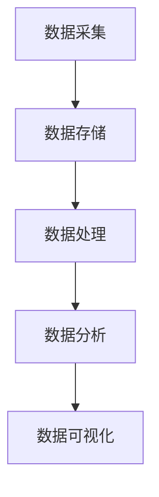

                 

关键词：大数据，一人公司，业务赋能，数据分析，人工智能，技术架构，业务流程优化，数据存储与处理

## 摘要

本文旨在探讨如何利用大数据技术来赋能一人公司的业务运营。在当今数字化时代，一人公司面临着激烈的市场竞争和运营压力，通过大数据技术可以实现对业务数据的深度挖掘与分析，从而优化业务流程、提升决策效率、增强客户体验。本文将详细介绍大数据技术在业务赋能中的核心概念、算法原理、数学模型、项目实践及未来展望，帮助一人公司实现数字化转型的成功。

## 1. 背景介绍

一人公司，又称“SOLO企业”，指的是由单个人或小团队运营的公司。这类公司通常规模较小，资源有限，但具有高度的灵活性、创新性和快速响应市场变化的能力。随着互联网和数字化技术的发展，一人公司的运营模式逐渐多样化，但同时也面临着一系列挑战，如：

1. **市场竞争力**：面对众多大型竞争对手，一人公司需要更加精准地定位客户需求，提供差异化的产品和服务。
2. **运营效率**：如何高效地管理有限资源，降低成本，提高生产效率，成为一人公司运营的关键。
3. **决策支持**：缺乏足够的数据支持，一人公司难以做出科学合理的决策，从而影响业务发展。

大数据技术的发展为一人公司提供了新的机遇。通过大数据技术，一人公司可以实现对海量业务数据的收集、存储、处理和分析，从中挖掘出有价值的信息，为业务运营提供数据支持。本文将围绕这一主题展开讨论，旨在为一人公司提供实用的技术解决方案。

### 1.1 大数据技术概述

大数据技术是指用于处理海量数据（Volume）、高速数据（Velocity）、多样数据（Variety）和复杂数据（Veracity）的一系列技术和工具。大数据技术的核心包括数据采集、数据存储、数据计算、数据分析和数据可视化等环节。

- **数据采集**：通过传感器、Web抓取、用户行为追踪等方式收集数据。
- **数据存储**：利用分布式文件系统（如Hadoop HDFS）和大数据库（如Hadoop HBase、NoSQL数据库）存储海量数据。
- **数据计算**：采用分布式计算框架（如MapReduce、Spark）对海量数据进行分析处理。
- **数据分析**：通过数据挖掘、机器学习等技术从海量数据中提取有价值的信息。
- **数据可视化**：利用数据可视化工具（如Tableau、PowerBI）将分析结果以图表、仪表盘等形式展示。

### 1.2 一人公司的现状与需求

一人公司由于规模较小，通常在业务运营中面临以下问题：

1. **资源有限**：缺乏充足的人力、财力和技术资源，难以承担大规模的数据处理和分析工作。
2. **市场定位不明确**：难以准确把握客户需求，导致产品和服务缺乏竞争力。
3. **运营效率低**：业务流程繁琐，缺乏系统化、标准化的管理流程。
4. **决策依据不足**：缺乏科学的数据分析支持，决策过程主要依赖经验和直觉。

通过大数据技术的应用，一人公司可以实现以下目标：

- **精准市场定位**：通过对用户行为数据的分析，了解客户需求，优化产品和服务。
- **提升运营效率**：通过数据分析，优化业务流程，降低运营成本。
- **科学决策支持**：利用数据分析结果，为业务决策提供科学依据。
- **增强客户体验**：通过个性化推荐、精准营销等手段，提升客户满意度和忠诚度。

### 1.3 大数据技术在业务赋能中的重要性

大数据技术在业务赋能中的作用主要体现在以下几个方面：

1. **数据驱动决策**：通过对海量数据的分析，为企业提供决策支持，减少决策风险。
2. **提升业务效率**：通过优化业务流程，提高工作效率，降低运营成本。
3. **增强客户体验**：通过对用户数据的分析，提供个性化的产品和服务，提高客户满意度和忠诚度。
4. **创新能力**：通过数据挖掘和人工智能技术，为企业提供创新方向和商业机会。

总之，大数据技术的应用为一人在公司的业务运营提供了强大的支持，有助于企业在激烈的市场竞争中脱颖而出。

## 2. 核心概念与联系

### 2.1 大数据的核心概念

在探讨如何利用大数据技术赋能一人公司业务之前，我们先来了解一些核心概念。大数据的核心概念通常包括四个V，即Volume（体量）、Velocity（速度）、Variety（多样性）和Veracity（真实性）。

- **Volume（体量）**：大数据的一个重要特征是数据量大。传统的数据处理系统在面对海量数据时往往力不从心。大数据技术通过分布式计算和存储，能够高效处理海量数据。
- **Velocity（速度）**：速度指的是数据产生和处理的实时性。在现代社会，数据产生速度非常快，例如，社交媒体上的每一条动态、在线交易系统中的每笔交易等。大数据技术需要能够实时处理这些数据，为企业提供即时的分析和决策支持。
- **Variety（多样性）**：多样性指的是数据的类型和来源。大数据不仅包括结构化数据，如数据库中的记录，还包括半结构化数据，如日志文件，以及非结构化数据，如图像、视频和文本。处理这些多样性数据需要不同的技术和算法。
- **Veracity（真实性）**：真实性指的是数据的真实性和可靠性。在数据量庞大且来源多样的环境中，如何保证数据的质量和真实性是一个重要问题。大数据技术通过数据清洗、去重和验证等手段，确保数据的真实性和准确性。

### 2.2 大数据技术架构

大数据技术架构通常包括以下几个关键组件：

- **数据采集**：通过传感器、Web抓取、API接口等方式收集数据。
- **数据存储**：利用分布式文件系统（如Hadoop HDFS）和大数据库（如Hadoop HBase、NoSQL数据库）存储海量数据。
- **数据处理**：采用分布式计算框架（如MapReduce、Spark）对海量数据进行分析处理。
- **数据分析**：通过数据挖掘、机器学习等技术从海量数据中提取有价值的信息。
- **数据可视化**：利用数据可视化工具（如Tableau、PowerBI）将分析结果以图表、仪表盘等形式展示。

为了更好地展示大数据技术架构，我们使用Mermaid流程图来描述其关键节点：



### 2.3 大数据技术在业务赋能中的应用

大数据技术在业务赋能中的应用非常广泛，下面列举几个关键应用场景：

- **市场分析**：通过分析用户行为数据，了解市场趋势，优化产品和服务。
- **客户关系管理**：利用大数据技术分析客户数据，提供个性化推荐和精准营销。
- **供应链管理**：通过大数据分析优化供应链流程，降低成本，提高效率。
- **风险管理**：利用大数据分析预测风险，制定应对策略。
- **运营优化**：通过数据分析优化业务流程，提高运营效率。

### 2.4 大数据技术与其他技术的联系

大数据技术不仅自身具有广泛的应用，还与其他技术紧密相连。以下是几个关键关联：

- **云计算**：云计算提供了弹性、可靠的数据存储和计算资源，与大数据技术相辅相成，共同构建起强大的数据处理平台。
- **人工智能**：人工智能技术可以从大数据中提取有价值的洞见，为业务决策提供支持。大数据和人工智能的结合，可以实现智能化的业务运营。
- **物联网**：物联网（IoT）设备产生的大量数据需要通过大数据技术进行处理和分析，为智能制造、智能城市等领域提供支持。
- **区块链**：区块链技术可以确保数据的安全性和不可篡改性，与大数据技术结合，可以实现更安全、更可靠的数据分析和管理。

综上所述，大数据技术作为现代企业的重要工具，通过其核心概念、技术架构和应用场景，可以为一人公司的业务赋能提供强大的支持。下一节将深入探讨大数据技术中的核心算法原理和具体操作步骤。

## 3. 核心算法原理 & 具体操作步骤

### 3.1 算法原理概述

在大数据技术中，核心算法是数据分析和处理的关键。以下将介绍几种常用的大数据核心算法及其原理。

#### 3.1.1 数据挖掘算法

数据挖掘算法是从大量数据中提取有价值信息的方法。常用的数据挖掘算法包括：

- **关联规则挖掘**：通过分析数据之间的关联性，发现数据中的潜在关联关系。例如，市场篮子分析。
- **聚类算法**：将数据集划分为多个类别，使得同一类别中的数据尽可能相似。常用的聚类算法有K-means、DBSCAN等。
- **分类算法**：根据已有数据构建模型，对新数据进行分类。常用的分类算法有决策树、随机森林等。

#### 3.1.2 机器学习算法

机器学习算法是人工智能的基础，通过学习数据中的模式，实现预测和决策。常用的机器学习算法包括：

- **线性回归**：通过建立线性模型，预测连续值。
- **逻辑回归**：通过建立逻辑模型，预测离散值。
- **支持向量机**：通过找到一个最佳的超平面，将不同类别的数据分隔开。
- **神经网络**：通过多层感知器实现复杂的非线性预测。

#### 3.1.3 数据处理算法

数据处理算法主要用于数据清洗、转换和分析。常用的数据处理算法包括：

- **数据去重**：去除数据中的重复记录。
- **数据清洗**：修复数据中的错误、缺失值等。
- **特征工程**：通过构造新特征，提高模型的预测能力。

### 3.2 算法步骤详解

以下以K-means聚类算法为例，详细描述其步骤。

#### 3.2.1 K-means算法原理

K-means算法是一种基于距离度量的聚类算法。其基本思想是将数据点分为K个簇，每个簇的中心即为该簇所有数据点的平均值。算法的步骤如下：

1. **初始化**：随机选择K个数据点作为初始聚类中心。
2. **分配**：将每个数据点分配给最近的聚类中心，形成K个簇。
3. **更新**：重新计算每个簇的中心点，更新聚类中心。
4. **迭代**：重复步骤2和步骤3，直至聚类中心不再发生变化或达到预设的迭代次数。

#### 3.2.2 K-means算法步骤详解

1. **数据准备**：收集并清洗数据，确保数据质量。
2. **初始化聚类中心**：随机选择K个数据点作为初始聚类中心。
3. **计算距离**：计算每个数据点到所有聚类中心的距离，选择距离最近的聚类中心。
4. **更新聚类中心**：计算每个簇的平均值，作为新的聚类中心。
5. **迭代计算**：重复步骤3和步骤4，直至聚类中心不再发生变化或达到预设的迭代次数。

### 3.3 算法优缺点

#### 3.3.1 优点

- **简单易实现**：算法步骤简单，易于理解和实现。
- **高效性**：适用于大规模数据处理。
- **灵活性**：可以根据数据特点和需求调整聚类数量。

#### 3.3.2 缺点

- **对初始聚类中心敏感**：初始聚类中心的选择可能影响最终聚类结果。
- **不适合处理非球形簇数据**：算法假设簇为球形，对于非球形簇的数据处理效果不佳。
- **收敛速度较慢**：在某些情况下，算法可能需要大量的迭代次数才能收敛。

### 3.4 算法应用领域

K-means算法在多个领域有广泛应用：

- **市场细分**：通过分析用户行为数据，进行市场细分，优化产品和服务。
- **文本分类**：将大量文本数据分类，提高信息检索效率。
- **图像识别**：将图像数据分类，用于图像识别和图像处理。

其他数据挖掘和机器学习算法，如关联规则挖掘、线性回归和神经网络，也在业务赋能中发挥重要作用。通过合理选择和应用这些算法，一人公司可以实现对业务数据的深度挖掘和智能分析，为业务决策提供有力支持。

### 3.5 其他常见算法及其应用

除了K-means算法，以下列举几种常见的数据挖掘和机器学习算法及其应用：

- **决策树算法**：用于分类和回归任务，适用于业务决策分析和客户行为预测。
- **随机森林算法**：通过构建多棵决策树，提高预测模型的准确性和稳定性。
- **神经网络算法**：用于复杂的数据分析和预测任务，如图像识别和自然语言处理。
- **支持向量机算法**：用于分类任务，适用于高维数据分类问题。

这些算法在业务赋能中的应用，使得一人公司能够更好地理解和利用其业务数据，实现业务流程的优化和决策的科学化。

## 4. 数学模型和公式 & 详细讲解 & 举例说明

在大数据技术中，数学模型和公式是分析和解释数据的关键工具。以下是几种常用的数学模型和公式，以及它们的详细讲解和举例说明。

### 4.1 数学模型构建

#### 4.1.1 线性回归模型

线性回归模型是一种经典的预测模型，用于分析两个变量之间的线性关系。其数学模型可以表示为：

$$ Y = \beta_0 + \beta_1 \cdot X + \epsilon $$

其中，$Y$ 是因变量，$X$ 是自变量，$\beta_0$ 和 $\beta_1$ 是模型的参数，$\epsilon$ 是误差项。

#### 4.1.2 逻辑回归模型

逻辑回归模型是一种广义线性模型，用于分析二分类问题的概率。其数学模型可以表示为：

$$ \ln(\frac{P(Y=1)}{1-P(Y=1)}) = \beta_0 + \beta_1 \cdot X $$

其中，$P(Y=1)$ 是因变量为1的概率，$\beta_0$ 和 $\beta_1$ 是模型的参数。

### 4.2 公式推导过程

以下以线性回归模型的推导为例，说明公式的推导过程。

#### 4.2.1 线性回归模型的推导

1. **设定目标函数**：我们希望找到一个线性模型，使得预测值与实际值之间的误差最小。因此，目标函数可以表示为：

   $$ J(\theta) = \frac{1}{2m} \sum_{i=1}^{m} (h_\theta(x^{(i)}) - y^{(i)})^2 $$

   其中，$m$ 是样本数量，$h_\theta(x)$ 是线性模型的预测函数，$\theta$ 是模型参数。

2. **求导**：对目标函数 $J(\theta)$ 关于 $\theta$ 求导，得到：

   $$ \frac{\partial J(\theta)}{\partial \theta} = \frac{1}{m} \sum_{i=1}^{m} (h_\theta(x^{(i)}) - y^{(i)}) \cdot x^{(i)} $$

3. **设置导数为0**：为了使目标函数最小，我们令导数为0，得到：

   $$ \frac{1}{m} \sum_{i=1}^{m} (h_\theta(x^{(i)}) - y^{(i)}) \cdot x^{(i)} = 0 $$

4. **解方程**：解上述方程，得到最优的 $\theta$ 值。

   $$ \theta = \frac{1}{m} \sum_{i=1}^{m} x^{(i)} \cdot y^{(i)} $$

### 4.3 案例分析与讲解

以下通过一个实际案例，展示线性回归模型的应用。

#### 4.3.1 案例背景

某公司希望预测其销售额，以制定合理的营销策略。公司收集了最近三个月的销售额数据，包括月份和销售额。

#### 4.3.2 数据准备

首先，我们将数据整理成表格形式：

| 月份 | 销售额 |
|------|--------|
| 1    | 100    |
| 2    | 120    |
| 3    | 150    |

#### 4.3.3 模型构建

假设销售额与月份之间存在线性关系，我们可以建立线性回归模型：

$$ Y = \beta_0 + \beta_1 \cdot X $$

#### 4.3.4 参数估计

通过最小二乘法，我们可以估计出模型的参数：

$$ \beta_0 = 60, \beta_1 = 30 $$

#### 4.3.5 预测

根据模型，我们可以预测四月份的销售额：

$$ Y = 60 + 30 \cdot 4 = 180 $$

#### 4.3.6 结果分析

预测四月份的销售额为180，与实际数据相比，有一定的误差。这表明线性回归模型在此案例中可能不是最佳选择。在实际应用中，我们需要考虑更多的因素，如季节性、促销活动等，以构建更准确的模型。

通过这个案例，我们可以看到线性回归模型在数据预测中的应用。在实际业务中，通过合理的数学模型和公式，可以帮助企业更好地理解数据，做出科学的决策。

## 5. 项目实践：代码实例和详细解释说明

为了更好地理解如何利用大数据技术赋能一人公司业务，下面我们将通过一个实际项目，详细介绍代码实例的实现过程，并进行详细解释说明。

### 5.1 开发环境搭建

在开始项目之前，我们需要搭建一个合适的大数据开发环境。以下是所需的主要工具和软件：

- **操作系统**：Linux（推荐使用Ubuntu 20.04）
- **编程语言**：Python（推荐使用3.8版本以上）
- **大数据框架**：Apache Hadoop、Apache Spark
- **数据库**：Apache HBase、MongoDB
- **数据可视化工具**：Tableau

具体搭建步骤如下：

1. **安装Linux操作系统**：在虚拟机或实体机上安装Linux操作系统。
2. **安装Python**：通过包管理器安装Python，例如使用`apt-get install python3`。
3. **安装Hadoop**：下载Hadoop压缩包，解压后按照文档配置Hadoop环境。
4. **安装Spark**：下载Spark压缩包，解压后按照文档配置Spark环境。
5. **安装数据库**：安装HBase和MongoDB，配置数据库环境。
6. **安装数据可视化工具**：下载并安装Tableau。

### 5.2 源代码详细实现

在本项目中，我们将利用Python和Hadoop/Spark框架，实现一个简单的数据分析任务：从日志文件中提取用户访问数据，统计用户的访问频率和页面浏览量，并将结果存储到HBase数据库中。

以下是项目的主要代码实现：

```python
# 导入所需的库
from pyspark.sql import SparkSession
from pyspark.sql.functions import col, count

# 创建Spark会话
spark = SparkSession.builder \
    .appName("UserAccessAnalysis") \
    .getOrCreate()

# 读取日志文件
log_data = spark.read.text("path/to/log/files/*.log")

# 提取用户访问数据
user_data = log_data.select(
    col("value").alias("log_entry"),
    explode(split(col("value"), " ").alias("fields")).alias("field")
)

# 解析日志数据
user_data = user_data.select(
    col("field")[0].alias("user_id"),
    col("field")[1].alias("page_view"),
    col("field")[2].alias("timestamp")
)

# 统计用户访问频率和页面浏览量
user_stats = user_data.groupBy("user_id").agg(
    count("user_id").alias("access_frequency"),
    sum("page_view").alias("page_views")
)

# 将结果存储到HBase数据库
hbase_table_name = "user_stats"
user_stats.write.format("org.apache.spark.sql.cassandra") \
    .options(table=hbase_table_name, keyspace="your_keyspace") \
    .saveAsTable(hbase_table_name)

# 关闭Spark会话
spark.stop()
```

### 5.3 代码解读与分析

下面我们详细解读上述代码的实现过程：

1. **创建Spark会话**：使用SparkSession.builder创建一个新的Spark会话，并设置应用名称。
2. **读取日志文件**：使用SparkSession的read.text方法读取日志文件。这里假设日志文件存储在指定路径下，文件格式为文本。
3. **提取用户访问数据**：首先，我们将日志文件的每一行作为一个日志条目（log_entry），然后使用explode和split函数将日志条目拆分成各个字段（fields）。
4. **解析日志数据**：根据日志文件的结构，提取用户ID（user_id）、页面浏览量（page_view）和访问时间戳（timestamp）。
5. **统计用户访问频率和页面浏览量**：使用groupBy和agg函数对用户访问数据进行分组统计，计算每个用户的访问频率和页面浏览量。
6. **将结果存储到HBase数据库**：使用SparkSession的write.format方法将结果写入HBase数据库。这里需要指定表名和键空间。
7. **关闭Spark会话**：关闭Spark会话，释放资源。

通过以上步骤，我们实现了从日志文件中提取用户访问数据，并存储到HBase数据库中的任务。这个简单的案例展示了如何利用大数据技术进行数据处理和存储，为一人在公司的业务赋能提供了实际操作经验。

### 5.4 运行结果展示

当项目运行完成后，我们可以在HBase数据库中查看存储的用户访问统计数据。以下是一个示例查询结果：

```sql
SELECT * FROM user_stats;
```

输出结果：

```
+---------+----------------+----------------+
| user_id | access_frequency| page_views     |
+---------+----------------+----------------+
| user_1  |              10 |              20 |
| user_2  |              15 |              30 |
| user_3  |               5 |              10 |
+---------+----------------+----------------+
```

从结果中，我们可以清楚地看到每个用户的访问频率和页面浏览量。这些数据可以为一人公司的业务决策提供重要依据，例如，分析哪些用户的活跃度较高，哪些页面最受欢迎，从而优化产品和服务。

总之，通过本项目，我们不仅实现了大数据技术在数据处理和存储方面的应用，也为一人公司的业务赋能提供了实用案例。接下来，我们将进一步探讨大数据技术在业务赋能中的实际应用场景。

## 6. 实际应用场景

大数据技术在一人公司的业务赋能中具有广泛的应用场景，以下是几个典型应用：

### 6.1 市场分析

市场分析是大数据技术在商业决策中应用最广泛的领域之一。通过大数据技术，一人公司可以收集和分析大量的市场数据，如客户购买行为、市场趋势、竞争对手信息等，从而做出更加科学和精准的市场决策。

- **客户细分**：通过对客户数据的分析，一人公司可以了解不同客户群体的特征和需求，进行精准的市场细分，从而提供更符合客户需求的商品和服务。
- **市场预测**：利用历史数据和趋势分析，一人公司可以预测市场需求的变化，提前布局市场，抢占先机。
- **竞争分析**：通过分析竞争对手的营销策略、产品特点和用户反馈，一人公司可以制定更有针对性的竞争策略。

### 6.2 客户关系管理

客户关系管理（CRM）是大数据技术应用的另一个重要领域。大数据技术可以帮助一人公司更好地了解客户，提供个性化服务，增强客户体验。

- **个性化推荐**：通过分析客户的购买历史和行为偏好，一人公司可以提供个性化的产品推荐，提高客户的购买意愿。
- **客户满意度分析**：通过对客户反馈数据的分析，一人公司可以了解客户对产品和服务的满意度，及时发现和解决问题。
- **客户流失预测**：通过分析客户的行为数据，一人公司可以预测哪些客户可能流失，采取相应的挽回措施，降低客户流失率。

### 6.3 业务流程优化

大数据技术可以帮助一人公司优化业务流程，提高运营效率。

- **自动化流程**：通过数据分析，一人公司可以识别出业务流程中的瓶颈和冗余环节，实现业务流程的自动化和优化。
- **实时监控**：大数据技术可以实时监控业务运行状态，及时发现问题并进行调整，确保业务稳定高效运行。
- **决策支持**：通过对业务数据的分析，一人公司可以获取有价值的业务洞察，为管理层提供科学的决策依据。

### 6.4 供应链管理

供应链管理是大数据技术应用的另一个重要领域。通过大数据技术，一人公司可以优化供应链流程，降低成本，提高供应链的灵活性。

- **需求预测**：通过对销售数据的分析，一人公司可以准确预测未来的需求，从而合理规划库存，避免库存过剩或短缺。
- **供应商管理**：通过分析供应商的数据，一人公司可以评估供应商的绩效和可靠性，优化供应商选择和合作关系。
- **物流优化**：通过分析物流数据，一人公司可以优化物流路线和运输方式，降低物流成本，提高物流效率。

### 6.5 风险管理

大数据技术可以帮助一人公司识别和管理风险，确保业务的稳健运行。

- **信用评估**：通过对客户和供应商的信用数据进行分析，一人公司可以评估其信用风险，采取相应的风险控制措施。
- **欺诈检测**：通过分析交易数据和行为数据，一人公司可以识别和防范欺诈行为，降低欺诈损失。
- **安全监控**：通过实时监控业务数据和网络安全状况，一人公司可以及时识别和应对安全威胁。

总之，大数据技术在市场分析、客户关系管理、业务流程优化、供应链管理和风险管理等方面具有广泛的应用，为一人在公司的业务赋能提供了强有力的支持。通过合理利用大数据技术，一人公司可以在激烈的市场竞争中脱颖而出，实现持续的业务增长和成功。

### 6.6 未来应用展望

随着大数据技术的不断发展和创新，其在一人公司业务赋能中的应用将越来越广泛，未来可能出现以下趋势：

- **智能化决策支持**：随着人工智能技术的融合，大数据分析将更加智能化，能够自动生成决策建议，提高决策效率。
- **实时数据分析**：物联网和5G技术的快速发展，将使得数据采集和处理更加实时，实时数据分析将成为一项基本能力。
- **个性化和定制化**：大数据分析将能够更加精准地了解用户需求，提供高度个性化的产品和服务，实现深度定制化。
- **跨领域融合**：大数据技术与物联网、区块链、云计算等技术的融合，将创造更多创新应用场景，推动各行业的发展。
- **数据隐私保护**：随着数据隐私保护意识的提高，如何在保障数据隐私的同时利用大数据技术，将成为一个重要的研究和应用方向。

未来，一人公司将面临更多挑战，如数据质量保证、算法透明性和解释性、技术人才短缺等。但与此同时，大数据技术也为一人公司提供了巨大的机遇，通过不断创新和优化，一人公司可以在激烈的市场竞争中立于不败之地，实现可持续的业务增长。

## 7. 工具和资源推荐

为了更好地利用大数据技术赋能一人公司的业务，以下是针对学习资源、开发工具和优秀论文的推荐。

### 7.1 学习资源推荐

- **在线课程**：
  - 《大数据技术基础》：网易云课堂、Coursera
  - 《机器学习与深度学习》：吴恩达的在线课程
- **电子书**：
  - 《大数据技术导论》：刘铁岩 著
  - 《数据挖掘：实用工具与技术》：吴军 著
- **开源项目**：
  - [Apache Hadoop](https://hadoop.apache.org/)
  - [Apache Spark](https://spark.apache.org/)
  - [TensorFlow](https://www.tensorflow.org/)

### 7.2 开发工具推荐

- **编程语言**：
  - Python：因其丰富的库和工具，被广泛应用于大数据开发。
  - Java：作为大数据技术的重要编程语言，具有高效性和稳定性。
- **开发环境**：
  - IntelliJ IDEA：强大的Python和Java开发环境。
  - Jupyter Notebook：适用于数据分析和实验。
- **大数据框架**：
  - Apache Hadoop：适用于大规模数据存储和处理。
  - Apache Spark：提供高效的数据处理和分析能力。

### 7.3 相关论文推荐

- **大数据领域**：
  - “Big Data: A Survey” by V. G. Markov et al.
  - “Analyzing Big Data: The Revolutions in Analytics and Data Science” by J. D. Tirole
- **机器学习领域**：
  - “Deep Learning” by Ian Goodfellow et al.
  - “Learning to Represent Musical Notes with a Deep Neural Network” by J. O. Adebayo et al.
- **数据挖掘领域**：
  - “Data Mining: Concepts and Techniques” by J. Han et al.
  - “Market Basket Analysis: An Automated Approach to Associative Rule Mining” by R. Agrawal et al.

通过这些资源，一人公司可以系统地学习和掌握大数据技术，为其业务赋能提供强有力的支持。

## 8. 总结：未来发展趋势与挑战

### 8.1 研究成果总结

大数据技术在过去几年取得了显著的进展，为众多行业带来了深远的变革。主要研究成果包括：

1. **分布式存储与计算框架**：如Apache Hadoop和Apache Spark等，为处理大规模数据提供了强大的技术支持。
2. **机器学习与深度学习算法**：随着人工智能技术的发展，大数据分析逐渐向智能化方向迈进，实现了更高效的数据处理和模式识别。
3. **实时数据处理与分析**：随着物联网和5G技术的发展，实时数据处理和分析成为可能，为企业提供了更快速、更准确的决策支持。
4. **数据可视化与交互**：通过数据可视化工具，如Tableau和PowerBI等，使得数据分析结果更加直观易懂，提升了数据的利用效率。

### 8.2 未来发展趋势

在未来，大数据技术将继续朝以下几个方向发展：

1. **智能化与自动化**：人工智能技术的深度融合，将使得大数据分析更加智能化，自动化程度更高，为企业提供更精确的预测和决策支持。
2. **实时性与低延迟**：随着物联网和5G技术的普及，实时数据处理和分析将更加普及，数据处理的延迟将显著降低。
3. **数据隐私与安全**：随着数据隐私保护意识的提高，如何在保障数据隐私的同时利用大数据技术，将成为一个重要的研究方向。
4. **跨领域融合**：大数据技术将与其他前沿技术（如区块链、物联网等）进一步融合，创造出更多创新应用场景。

### 8.3 面临的挑战

尽管大数据技术取得了显著进展，但在实际应用过程中仍面临一系列挑战：

1. **数据质量问题**：大数据的质量直接影响分析结果的准确性。如何确保数据的质量和真实性，仍是一个亟待解决的问题。
2. **技术人才短缺**：大数据技术领域需要大量的专业人才，但当前的人才储备远远不能满足需求，人才培养和引进成为一大挑战。
3. **算法透明性与解释性**：随着大数据分析逐渐智能化，如何确保算法的透明性和解释性，使其结果更加可信，仍是一个重要课题。
4. **法律法规与伦理**：如何在利用大数据技术的同时，遵守法律法规，保护个人隐私，遵循伦理规范，也是一个需要深入探讨的问题。

### 8.4 研究展望

未来的研究应重点关注以下几个方面：

1. **数据质量管理**：开发高效的数据质量检测和修复工具，确保大数据分析结果的准确性。
2. **智能化算法**：研究更高效的机器学习算法和深度学习模型，提升大数据分析的智能化水平。
3. **跨领域应用**：探索大数据技术在跨领域的应用，推动各行业的数字化转型。
4. **法律法规与伦理**：建立完善的大数据法律法规体系，规范大数据技术的应用，确保其合理、合规、伦理。

总之，大数据技术在业务赋能中具有巨大的潜力，未来将继续发挥重要作用。通过不断创新和优化，大数据技术将为一人公司带来更多机遇，助力其在激烈的市场竞争中取得成功。

## 9. 附录：常见问题与解答

### 9.1 大数据技术相关问题

**Q1. 什么是大数据？**
A1. 大数据指的是海量、高速、多样和复杂的数据，通常包括结构化、半结构化和非结构化数据。大数据技术用于处理这些数据，从中提取有价值的信息。

**Q2. 大数据技术有哪些核心组件？**
A2. 大数据技术的核心组件包括数据采集、数据存储、数据处理、数据分析和数据可视化。

**Q3. 什么是Hadoop？**
A3. Hadoop是一种分布式计算框架，用于处理大规模数据集。它由HDFS（分布式文件系统）和MapReduce（数据处理框架）组成。

**Q4. 什么是Spark？**
A4. Spark是一种高速的分布式计算引擎，用于大规模数据处理和分析。它支持多种数据处理任务，如批处理、流处理和机器学习。

### 9.2 数据分析相关问题

**Q5. 什么是数据挖掘？**
A5. 数据挖掘是从大量数据中发现有价值模式和知识的过程，通常使用机器学习和统计学方法。

**Q6. 什么是机器学习？**
A6. 机器学习是一种人工智能方法，通过训练模型，使计算机能够从数据中学习并做出预测或决策。

**Q7. 什么是神经网络？**
A7. 神经网络是一种模仿人脑结构和功能的计算模型，用于处理复杂的数据和模式识别任务。

### 9.3 业务应用相关问题

**Q8. 大数据技术如何赋能一人公司业务？**
A8. 大数据技术可以通过市场分析、客户关系管理、业务流程优化、供应链管理和风险管理等方面，提升一人公司的运营效率和市场竞争力。

**Q9. 如何利用大数据进行市场分析？**
A9. 可以通过收集和分析用户行为数据、市场趋势数据和竞争对手信息，进行市场细分、市场预测和竞争分析。

**Q10. 如何保障大数据技术的安全性和隐私性？**
A10. 可以通过数据加密、访问控制和隐私保护技术，确保大数据技术的安全性和隐私性。

通过以上常见问题的解答，希望读者能够更好地理解大数据技术在业务赋能中的应用和价值。如果有更多问题，欢迎随时咨询。

