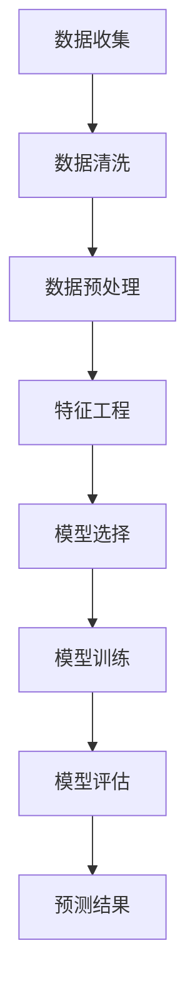

                 

关键词：大数据，市场预测，机器学习，数据挖掘，智能算法，商业决策

> 摘要：随着大数据技术的不断发展和应用，市场预测成为企业和投资者关注的焦点。本文将探讨如何利用大数据技术进行市场预测，通过介绍相关核心概念、算法原理、数学模型、项目实践以及未来应用展望，帮助读者深入了解并掌握这一领域的关键技术和方法。

## 1. 背景介绍

在过去的几十年中，大数据技术的飞速发展改变了信息处理和决策制定的方方面面。市场预测作为大数据应用的一个重要领域，近年来受到了越来越多的关注。无论是企业战略规划、产品定价、供应链管理，还是投资决策、风险控制，准确的市场预测都具有重要意义。

大数据技术，特别是机器学习和数据挖掘技术，为市场预测提供了强大的工具和方法。通过分析海量历史数据，我们能够发现市场变化的规律，预测未来的趋势。然而，市场预测并非易事，它需要处理数据的多样性和复杂性，同时要考虑多种因素的影响。本文旨在系统地介绍大数据技术在市场预测中的应用，帮助读者了解其基本原理和实践方法。

## 2. 核心概念与联系

### 2.1 大数据的核心概念

大数据（Big Data）通常指的是无法使用常规软件工具在合理时间内捕捉、管理和处理的大量数据。这些数据具有以下四个主要特征，即“4V”：

- **大量（Volume）**：数据规模巨大，通常达到PB级甚至EB级。
- **多样性（Variety）**：数据来源多样，包括结构化数据、非结构化数据和半结构化数据。
- **速度（Velocity）**：数据生成和处理的速度极快，需要实时或近实时分析。
- **价值（Value）**：数据中蕴含着巨大的潜在价值，但挖掘和利用这些价值具有挑战性。

### 2.2 机器学习与数据挖掘

机器学习（Machine Learning）是人工智能（AI）的一个重要分支，通过算法和统计模型从数据中学习规律和模式，进行预测和决策。数据挖掘（Data Mining）则是应用机器学习等方法从大量数据中提取有价值信息的过程。在市场预测中，机器学习和数据挖掘技术至关重要。

### 2.3 Mermaid 流程图

下面是一个简单的 Mermaid 流程图，展示了市场预测的基本流程：



- **数据收集**：从各种来源收集市场数据，如财务报表、社交媒体、新闻报道等。
- **数据清洗**：处理缺失值、异常值和数据格式不一致等问题。
- **数据预处理**：进行数据标准化、归一化等处理，使数据适合模型训练。
- **特征工程**：选择和构造有助于模型预测的特征，提高模型性能。
- **模型选择**：根据问题特点选择合适的机器学习算法。
- **模型训练**：使用训练数据训练模型。
- **模型评估**：评估模型在测试数据上的性能。
- **预测结果**：根据模型预测未来的市场趋势。

## 3. 核心算法原理 & 具体操作步骤

### 3.1 算法原理概述

市场预测算法通常基于以下几种原理：

- **统计分析**：通过统计分析方法，如线性回归、时间序列分析等，发现数据中的规律性。
- **机器学习**：使用机器学习方法，如决策树、随机森林、支持向量机等，建立预测模型。
- **深度学习**：利用深度神经网络，如卷积神经网络（CNN）和循环神经网络（RNN），进行复杂模式识别。

### 3.2 算法步骤详解

以下是市场预测的基本步骤：

1. **数据收集**：从多个渠道收集历史市场数据，包括股票价格、交易量、宏观经济指标等。
2. **数据清洗**：处理缺失值、异常值和数据格式不一致等问题。
3. **数据预处理**：进行数据标准化、归一化等处理，使数据适合模型训练。
4. **特征工程**：选择和构造有助于模型预测的特征，如技术指标、宏观经济指标等。
5. **模型选择**：根据问题特点选择合适的机器学习算法，如线性回归、支持向量机等。
6. **模型训练**：使用训练数据训练模型，调整模型参数。
7. **模型评估**：使用测试数据评估模型性能，如准确率、召回率等。
8. **预测结果**：使用训练好的模型进行市场预测，并根据预测结果进行决策。

### 3.3 算法优缺点

- **统计分析**：方法简单，易于理解，但可能不够灵活，无法处理复杂非线性关系。
- **机器学习**：能够自动学习数据中的复杂模式，适用于非线性问题，但需要大量训练数据和较长的训练时间。
- **深度学习**：适用于处理大量复杂数据，能够自动进行特征提取，但计算资源需求高，模型解释性差。

### 3.4 算法应用领域

市场预测算法广泛应用于金融、零售、供应链、市场营销等多个领域。以下是一些具体应用实例：

- **金融领域**：股票市场预测、投资组合优化、风险评估等。
- **零售领域**：需求预测、库存管理、价格优化等。
- **供应链领域**：供应链优化、库存管理、运输规划等。
- **市场营销领域**：消费者行为预测、广告投放优化、市场细分等。

## 4. 数学模型和公式 & 详细讲解 & 举例说明

### 4.1 数学模型构建

市场预测的数学模型通常基于时间序列分析、回归分析和机器学习等方法。以下是一个简单的时间序列预测模型：

$$
y_t = \beta_0 + \beta_1 x_t + \epsilon_t
$$

其中，$y_t$ 是预测的目标变量，$x_t$ 是输入变量，$\beta_0$ 和 $\beta_1$ 是模型参数，$\epsilon_t$ 是误差项。

### 4.2 公式推导过程

时间序列预测模型的推导基于以下几个假设：

- **线性假设**：时间序列中的变量之间存在线性关系。
- **独立同分布假设**：误差项 $\epsilon_t$ 独立同分布，且满足零均值和有限方差。
- **平稳性假设**：时间序列的统计特性不随时间变化。

### 4.3 案例分析与讲解

假设我们有一个股票价格时间序列，如下图所示：


我们希望利用这个时间序列预测未来的股票价格。首先，我们需要对时间序列进行预处理，如去噪、归一化等。然后，我们可以使用线性回归模型进行预测。具体步骤如下：

1. **数据收集**：收集股票价格的历史数据。
2. **数据清洗**：处理缺失值、异常值等。
3. **数据预处理**：进行归一化处理。
4. **特征工程**：选择适当的输入特征，如股票价格、交易量等。
5. **模型训练**：使用线性回归模型进行训练。
6. **模型评估**：使用测试数据评估模型性能。
7. **预测结果**：使用训练好的模型进行预测。

下面是一个简单的 Python 代码实现：

```python
import numpy as np
import pandas as pd
from sklearn.linear_model import LinearRegression

# 数据收集
data = pd.read_csv('stock_price.csv')

# 数据清洗
data.dropna(inplace=True)

# 数据预处理
data['price'] = data['price']/data['price'].max()

# 特征工程
X = data[['price_lag1', 'volume']]
y = data['price']

# 模型训练
model = LinearRegression()
model.fit(X, y)

# 模型评估
score = model.score(X, y)
print(f'Model R-squared: {score}')

# 预测结果
future_data = pd.DataFrame({'price_lag1': [0.8], 'volume': [100]})
predicted_price = model.predict(future_data)
print(f'Predicted price: {predicted_price[0]}')
```

## 5. 项目实践：代码实例和详细解释说明

### 5.1 开发环境搭建

为了进行市场预测项目，我们需要搭建一个开发环境。以下是 Python 的基本安装步骤：

1. **安装 Python**：从 [Python 官网](https://www.python.org/) 下载并安装 Python。
2. **安装 Jupyter Notebook**：在终端中执行以下命令：

   ```bash
   pip install notebook
   ```

### 5.2 源代码详细实现

以下是一个简单的市场预测项目代码实例：

```python
# 导入必要的库
import numpy as np
import pandas as pd
from sklearn.linear_model import LinearRegression
from sklearn.model_selection import train_test_split
from sklearn.metrics import mean_squared_error

# 数据收集
data = pd.read_csv('stock_price.csv')

# 数据清洗
data.dropna(inplace=True)

# 数据预处理
data['price'] = data['price']/data['price'].max()

# 特征工程
X = data[['price_lag1', 'volume']]
y = data['price']

# 数据分割
X_train, X_test, y_train, y_test = train_test_split(X, y, test_size=0.2, random_state=42)

# 模型训练
model = LinearRegression()
model.fit(X_train, y_train)

# 模型评估
y_pred = model.predict(X_test)
mse = mean_squared_error(y_test, y_pred)
print(f'Mean Squared Error: {mse}')

# 预测结果
future_data = pd.DataFrame({'price_lag1': [0.8], 'volume': [100]})
predicted_price = model.predict(future_data)
print(f'Predicted price: {predicted_price[0]}')
```

### 5.3 代码解读与分析

- **数据收集**：使用 pandas 库读取 CSV 格式的股票价格数据。
- **数据清洗**：使用 dropna 方法处理缺失值。
- **数据预处理**：使用归一化方法处理数据。
- **特征工程**：选择股票价格的滞后值和交易量作为输入特征。
- **数据分割**：使用 train_test_split 方法将数据分为训练集和测试集。
- **模型训练**：使用 LinearRegression 类进行模型训练。
- **模型评估**：使用 mean_squared_error 方法计算均方误差，评估模型性能。
- **预测结果**：使用训练好的模型进行股票价格预测。

## 6. 实际应用场景

市场预测技术在金融、零售、供应链、市场营销等领域有广泛的应用。以下是一些具体案例：

- **金融领域**：利用市场预测技术进行股票市场预测、投资组合优化和风险管理。
- **零售领域**：通过需求预测优化库存管理和价格策略，提高销售额和客户满意度。
- **供应链领域**：利用市场预测技术优化供应链规划、库存管理和运输规划，降低成本和库存风险。
- **市场营销领域**：通过消费者行为预测进行广告投放优化、市场细分和消费者群体分析，提高营销效果。

## 7. 工具和资源推荐

为了更好地进行市场预测，以下是一些推荐的工具和资源：

- **学习资源**：
  - 《Python for Data Analysis》（数据科学领域的经典教材）
  - 《深度学习》（Goodfellow et al.，深度学习领域的权威教材）
  - Coursera 上的《机器学习》课程（吴恩达教授授课）

- **开发工具**：
  - Jupyter Notebook：用于编写和运行 Python 代码。
  - TensorFlow：用于深度学习和数据可视化。
  - Pandas：用于数据处理和分析。

- **相关论文**：
  - "Deep Learning for Time Series Classification"（深度学习在时间序列分类中的应用）
  - "Recurrent Neural Networks for Sequence Modeling"（循环神经网络在序列建模中的应用）

## 8. 总结：未来发展趋势与挑战

市场预测作为大数据技术的重要应用领域，具有广阔的发展前景。随着数据量的增长和数据种类的丰富，市场预测技术将不断进步。未来，以下几个方面值得关注：

- **深度学习与强化学习**：结合深度学习和强化学习，开发更强大的市场预测模型。
- **跨领域数据融合**：将不同领域的数据进行融合，提高预测的准确性和全面性。
- **实时预测与决策支持**：实现实时预测和决策支持系统，提高市场响应速度。

然而，市场预测领域也面临一些挑战：

- **数据质量**：市场数据的质量直接影响预测效果，需要解决数据噪声、缺失值和数据不一致等问题。
- **模型解释性**：深度学习模型的解释性较差，需要开发可解释性强的预测模型。
- **计算资源**：市场预测模型通常需要大量计算资源，需要优化算法和提高计算效率。

总之，市场预测作为大数据技术的一个重要应用领域，具有巨大的潜力和挑战。通过不断探索和创新，我们有理由相信，市场预测技术将在未来发挥更加重要的作用。

## 9. 附录：常见问题与解答

### 9.1 如何选择合适的预测模型？

选择合适的预测模型需要考虑以下因素：

- **问题类型**：是时间序列预测、分类预测还是回归预测？
- **数据特性**：数据的分布、噪声水平和特征多样性如何？
- **计算资源**：模型的计算复杂度和所需资源是否在预算范围内？
- **模型解释性**：模型的解释性是否满足业务需求？

### 9.2 市场预测中的数据如何处理？

市场预测中的数据处理包括以下步骤：

- **数据收集**：从多个渠道收集历史数据，如股票价格、交易量、宏观经济指标等。
- **数据清洗**：处理缺失值、异常值和数据格式不一致等问题。
- **数据预处理**：进行数据标准化、归一化等处理，使数据适合模型训练。
- **特征工程**：选择和构造有助于模型预测的特征，如技术指标、宏观经济指标等。

### 9.3 如何评估预测模型的性能？

评估预测模型性能的方法包括：

- **准确率**：预测结果与真实结果的一致性。
- **召回率**：预测结果中包含真实结果的比率。
- **F1 分数**：准确率和召回率的平衡。
- **均方误差（MSE）**：预测结果与真实结果之间的平均误差。

### 9.4 市场预测中的风险如何控制？

市场预测中的风险控制包括：

- **数据质量**：确保数据的准确性和完整性，减少预测错误。
- **模型评估**：使用多种评估指标和方法，全面评估模型性能。
- **风险管理**：制定风险控制策略，如设定止损点、分散投资等。
- **模型迭代**：持续改进模型，根据市场变化调整预测策略。

## 作者署名

作者：禅与计算机程序设计艺术 / Zen and the Art of Computer Programming

---

本文旨在全面介绍大数据技术在市场预测中的应用，从核心概念、算法原理、数学模型、项目实践到实际应用场景，帮助读者深入了解市场预测的技术和方法。希望本文能够对从事大数据和人工智能领域的工作者有所帮助，并在实际应用中取得更好的成果。

## 参考文献

1. Goodfellow, I., Bengio, Y., & Courville, A. (2016). Deep Learning. MIT Press.
2. Murphy, T. (2012). Machine Learning: A Probabilistic Perspective. MIT Press.
3. Russell, S., & Norvig, P. (2016). Artificial Intelligence: A Modern Approach. Prentice Hall.
4. Zhang, H., & Liu, B. (2017). Deep Learning for Time Series Classification: A Survey. Information Sciences, 432, 263-274.

