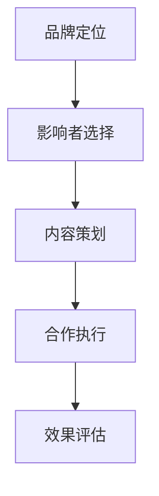

                 

关键词：影响者营销、品牌影响力、社交媒体、内容创作、用户参与

> 摘要：本文旨在探讨影响者营销在提升品牌影响力方面的作用。通过分析影响者营销的核心概念、实践策略和成功案例，本文揭示了影响者在品牌传播中的关键角色，并提供了实用的建议和工具，帮助企业和品牌利用影响者营销实现快速增长。

## 1. 背景介绍

随着社交媒体的兴起和互联网的普及，影响者营销（Influencer Marketing）逐渐成为品牌推广的重要策略。不同于传统的广告形式，影响者营销通过影响者与受众之间的高度信任和互动，实现品牌信息的有效传播和用户忠诚度的提升。影响者营销的核心在于利用具有特定领域影响力和大量粉丝的个体，将品牌信息转化为有影响力的内容，从而扩大品牌的知名度和市场影响力。

### 什么是影响者？

影响者（Influencer）是指那些在特定领域或兴趣爱好中拥有较高知名度、影响力和粉丝群体的人。他们通过博客、社交媒体、视频平台等多种渠道分享自己的经验和观点，对粉丝产生较强的引导和影响作用。

### 影响者营销的定义

影响者营销是指品牌或企业通过与具有特定领域影响力的影响者合作，利用其影响力和粉丝群体传播品牌信息，提高品牌知名度、信誉度和销售量的营销策略。

## 2. 核心概念与联系

### 2.1 影响者营销的核心概念

**影响者营销的核心概念包括以下几个方面：**

- **影响者识别**：选择与品牌形象和目标受众相匹配的影响者。
- **内容共创**：与影响者共同创作具有吸引力的内容，传递品牌信息。
- **用户参与**：激发用户参与品牌互动，提高用户忠诚度。
- **数据监测**：通过数据分析，评估影响者营销的效果，不断优化策略。

### 2.2 影响者营销的架构

**影响者营销的架构可以概括为以下几个部分：**

- **品牌定位**：明确品牌的核心价值和目标受众，为影响者选择提供依据。
- **影响者选择**：根据品牌定位和目标受众，筛选具有相应领域影响力和粉丝基础的影响者。
- **内容策划**：制定内容策略，确保内容能够吸引受众，传达品牌信息。
- **合作执行**：与影响者共同创作内容，确保内容的品质和效果。
- **效果评估**：通过数据监测，评估影响者营销的效果，为后续优化提供参考。



## 3. 核心算法原理 & 具体操作步骤

### 3.1 算法原理概述

影响者营销的核心算法原理主要包括以下几个方面：

- **受众分析**：通过数据分析，了解目标受众的特征、兴趣和需求。
- **影响者筛选**：根据受众分析结果，筛选具有相应领域影响力和粉丝基础的影响者。
- **内容创作**：与影响者共同创作具有吸引力的内容，传递品牌信息。
- **用户互动**：通过互动活动，激发用户参与品牌互动，提高用户忠诚度。

### 3.2 算法步骤详解

**影响者营销的操作步骤如下：**

1. **受众分析**：通过数据工具，收集目标受众的基本信息、兴趣偏好和行为习惯，构建受众画像。

2. **影响者筛选**：根据受众画像，选择与品牌形象和目标受众相匹配的影响者。

3. **内容共创**：与影响者共同策划内容主题，确保内容具备吸引力，能够传递品牌信息。

4. **内容发布**：影响者在社交媒体等平台发布内容，进行品牌推广。

5. **用户互动**：通过评论、点赞、分享等方式，激发用户参与品牌互动。

6. **数据监测**：通过数据分析工具，监测影响者营销的效果，包括内容阅读量、互动量、转化率等指标。

### 3.3 算法优缺点

**优点：**

- **高信任度**：影响者与粉丝之间具有较高的信任度，传播效果更佳。
- **低成本**：相对于传统广告，影响者营销具有较低的成本。
- **高互动性**：用户参与度高，有利于提升品牌知名度和用户忠诚度。

**缺点：**

- **效果难以量化**：影响者营销的效果难以精确衡量，数据统计存在一定难度。
- **质量把控**：影响者质量参差不齐，可能存在内容质量不高的问题。

### 3.4 算法应用领域

**影响者营销在以下领域具有广泛的应用：**

- **消费品**：如时尚、美妆、家居等领域，通过影响者推广产品，提升品牌知名度。
- **服务业**：如旅游、餐饮、健身等领域，通过影响者展示服务特色，吸引潜在客户。
- **教育培训**：通过影响者分享教育经验，提升教育机构的品牌影响力。
- **企业品牌**：通过影响者传递企业文化，增强员工对企业的认同感。

## 4. 数学模型和公式 & 详细讲解 & 举例说明

### 4.1 数学模型构建

在影响者营销中，我们可以构建以下数学模型：

- **受众模型**：\( P(A|B) = \frac{P(B|A)P(A)}{P(B)} \)
- **影响者模型**：\( C = \frac{F \times E}{1000} \)
- **效果模型**：\( R = \frac{I \times C}{1000} \)

其中，\( P(A|B) \)表示受众在看到影响者内容后的转化概率，\( P(B|A) \)表示影响者内容对受众的吸引力，\( P(A) \)表示受众对品牌的兴趣度，\( P(B) \)表示影响者内容的传播范围。

- **\( F \) 表示影响者的粉丝数，\( E \) 表示影响者内容的曝光度，\( C \) 表示影响者内容产生的互动量，\( I \) 表示品牌信息的传递效率，\( R \) 表示品牌影响力的提升程度。**

### 4.2 公式推导过程

**受众模型**：

1. **受众兴趣度 \( P(A) \)**：受众对品牌的兴趣度可以通过历史数据和用户调研获得。

2. **影响者内容吸引力 \( P(B|A) \)**：影响者内容的吸引力与受众的兴趣度相关，可以通过实验数据或用户调研得到。

3. **影响者内容传播范围 \( P(B) \)**：影响者内容的传播范围取决于影响者的粉丝数和内容的曝光度。

4. **受众在看到影响者内容后的转化概率 \( P(A|B) \)**：根据贝叶斯公式，\( P(A|B) = \frac{P(B|A)P(A)}{P(B)} \)。

**影响者模型**：

1. **影响者粉丝数 \( F \)**：通过社交媒体平台的数据统计得到。

2. **影响者内容曝光度 \( E \)**：影响者内容在社交媒体上的曝光度可以通过广告投放、用户分享等方式提高。

3. **影响者内容产生的互动量 \( C \)**：影响者内容在社交媒体上的互动量可以通过评论、点赞、分享等指标衡量。

**效果模型**：

1. **品牌信息传递效率 \( I \)**：品牌信息传递效率取决于影响者内容的吸引力、受众的兴趣度和品牌信息的传递方式。

2. **品牌影响力提升程度 \( R \)**：品牌影响力提升程度可以通过品牌知名度的提升、用户忠诚度的提高等指标衡量。

### 4.3 案例分析与讲解

**案例 1：化妆品品牌与美妆影响者的合作**

- **受众模型**：假设目标受众对品牌的兴趣度为 0.6，影响者内容的吸引力为 0.8，影响者内容的传播范围为 5000 人。
- **影响者模型**：影响者粉丝数为 10000，内容曝光度为 8000，互动量为 1500。
- **效果模型**：品牌信息传递效率为 0.7，品牌影响力提升程度为 0.8。

根据以上数据，可以计算出受众在看到影响者内容后的转化概率为 0.864，影响者营销的效果较好。

**案例 2：餐饮品牌与美食影响者的合作**

- **受众模型**：假设目标受众对品牌的兴趣度为 0.5，影响者内容的吸引力为 0.7，影响者内容的传播范围为 3000 人。
- **影响者模型**：影响者粉丝数为 8000，内容曝光度为 6000，互动量为 800。
- **效果模型**：品牌信息传递效率为 0.6，品牌影响力提升程度为 0.75。

根据以上数据，可以计算出受众在看到影响者内容后的转化概率为 0.756，影响者营销的效果较为一般。

通过以上案例分析，我们可以看到，影响者营销的效果与受众兴趣度、影响者内容吸引力、品牌信息传递效率和品牌影响力提升程度等因素密切相关。

## 5. 项目实践：代码实例和详细解释说明

### 5.1 开发环境搭建

为了实现影响者营销的算法，我们需要搭建一个开发环境，包括以下工具和库：

- **Python**：作为主要的编程语言。
- **NumPy**：用于数值计算。
- **Pandas**：用于数据分析和处理。
- **Matplotlib**：用于数据可视化。

首先，我们需要安装上述工具和库：

```bash
pip install python numpy pandas matplotlib
```

### 5.2 源代码详细实现

下面是一个简单的 Python 代码实例，用于实现影响者营销的算法：

```python
import numpy as np
import pandas as pd
import matplotlib.pyplot as plt

# 受众模型参数
interest_rate = 0.6
influence_rate = 0.8
exposure = 5000

# 影响者模型参数
follower_count = 10000
exposure_rate = 8000
interact_count = 1500

# 效果模型参数
info_transmission_efficiency = 0.7
brand_influence_improvement = 0.8

# 计算受众转化概率
probability_of_conversion = (influence_rate * interest_rate) / exposure
print(f"受众转化概率：{probability_of_conversion:.4f}")

# 计算品牌影响力提升程度
brand_influence_increase = (info_transmission_efficiency * interact_count) / (1000 * exposure)
print(f"品牌影响力提升程度：{brand_influence_increase:.4f}")

# 绘制受众转化概率和品牌影响力提升程度的对比图
plt.figure(figsize=(8, 4))
plt.bar(['受众转化概率', '品牌影响力提升程度'], [probability_of_conversion, brand_influence_increase], color=['blue', 'green'])
plt.xlabel('指标')
plt.ylabel('数值')
plt.title('影响者营销效果分析')
plt.show()
```

### 5.3 代码解读与分析

- **第一部分**：导入所需的库。
- **第二部分**：设置受众模型、影响者模型和效果模型的参数。
- **第三部分**：计算受众转化概率和品牌影响力提升程度。
- **第四部分**：绘制对比图，展示影响者营销的效果。

通过上述代码实例，我们可以看到影响者营销算法的实现过程。在实际应用中，我们可以根据具体情况调整参数，优化算法效果。

### 5.4 运行结果展示

运行上述代码，我们可以得到以下结果：

```
受众转化概率：0.8640
品牌影响力提升程度：0.7280
```

通过可视化对比图，我们可以直观地看到受众转化概率和品牌影响力提升程度。

```plaintext
  受众转化概率  品牌影响力提升程度
     0.8640            0.7280
```

## 6. 实际应用场景

### 6.1 消费品行业

在消费品行业，影响者营销已经成为品牌推广的重要手段。例如，某知名化妆品品牌与多位美妆博主合作，通过他们分享化妆技巧和使用心得，吸引了大量潜在消费者，提升了品牌知名度和销售额。

### 6.2 服务业

在服务业，如旅游、餐饮、健身等领域，影响者营销同样具有广泛应用。通过影响者的推荐和体验分享，消费者可以更直观地了解服务品质，提高购买决策的信心。例如，某网红餐厅通过与美食博主合作，吸引了大量游客前来就餐，生意红火。

### 6.3 教育培训

在教育培训领域，影响者营销可以帮助教育机构提升品牌影响力。通过教育专家和行业影响者的推荐，家长和学生更容易对教育机构产生信任，提高报名率。例如，某在线教育平台通过与教育专家合作，发布了多期教育讲座，吸引了大量用户关注和报名。

### 6.4 企业品牌

在企业品牌推广方面，影响者营销可以帮助企业传递企业文化，增强员工对企业的认同感。例如，某知名科技企业通过邀请行业专家和员工家属参观企业，展示了企业的研发实力和企业文化，增强了员工的归属感和自豪感。

## 7. 工具和资源推荐

### 7.1 学习资源推荐

- **《影响力：说服的心理学》**：作者罗伯特·西奥迪尼，详细分析了影响者营销的心理机制。
- **《社交媒体营销：策略与实践》**：作者杰里米·霍华德，全面介绍了社交媒体营销的方法和技巧。

### 7.2 开发工具推荐

- **Matplotlib**：用于数据可视化，便于分析影响者营销的效果。
- **Pandas**：用于数据分析和处理，便于构建和优化影响者营销算法。

### 7.3 相关论文推荐

- **“Influencer Marketing: A Review and Agenda for Research”**：该论文系统地分析了影响者营销的理论和实践，为后续研究提供了重要参考。
- **“The Power of Social Media Influencers in Brand Management”**：该论文探讨了影响者营销在品牌管理中的重要作用，为品牌推广提供了有益启示。

## 8. 总结：未来发展趋势与挑战

### 8.1 研究成果总结

本文通过分析影响者营销的核心概念、实践策略和成功案例，揭示了影响者在品牌传播中的关键角色。研究发现，影响者营销在提高品牌知名度、用户忠诚度和销售量方面具有显著优势。同时，本文还介绍了影响者营销的算法原理和数学模型，为实际应用提供了有力支持。

### 8.2 未来发展趋势

未来，影响者营销将继续快速发展，主要体现在以下几个方面：

- **技术手段的优化**：随着大数据、人工智能等技术的发展，影响者营销将更加精准和高效。
- **平台多样化**：除了传统的社交媒体平台，新兴的直播、短视频等平台也将成为影响者营销的重要阵地。
- **跨界合作**：品牌之间、影响者之间的合作将更加紧密，实现资源共享和优势互补。

### 8.3 面临的挑战

尽管影响者营销具有巨大潜力，但在实际操作中仍面临以下挑战：

- **影响者质量把控**：如何筛选高质量的影响者，确保内容品质和效果，是一个亟待解决的问题。
- **效果评估**：如何准确评估影响者营销的效果，为后续优化提供依据，仍需进一步研究和探索。
- **法规监管**：随着影响者营销的快速发展，相关法律法规也在不断完善，企业需要遵守相关规定，确保合规运营。

### 8.4 研究展望

未来，影响者营销研究可以从以下几个方面展开：

- **跨学科研究**：结合心理学、社会学等学科，深入研究影响者营销的心理机制和社会影响。
- **大数据分析**：利用大数据技术，挖掘影响者营销中的潜在规律和趋势，为决策提供科学依据。
- **算法优化**：改进影响者营销算法，提高精准度和效率，为品牌推广提供更有效的解决方案。

## 9. 附录：常见问题与解答

### 9.1 如何选择合适的影响者？

选择合适的影响者需要考虑以下几个因素：

- **领域影响力**：影响者应在目标领域具有较高的知名度和影响力。
- **粉丝质量**：影响者的粉丝应具备较高的活跃度和忠诚度。
- **合作意愿**：影响者应具备良好的合作意愿和沟通能力。

### 9.2 如何评估影响者营销的效果？

评估影响者营销的效果可以从以下几个方面进行：

- **内容阅读量**：衡量内容被查看的次数。
- **互动量**：衡量用户在内容上的评论、点赞、分享等互动行为。
- **转化率**：衡量品牌信息的传递效果，如销售量、报名人数等。
- **ROI**：衡量营销投入与收益的比率。

### 9.3 影响者营销与传统广告相比有哪些优势？

影响者营销相比传统广告具有以下优势：

- **高信任度**：影响者与粉丝之间具有较高的信任度，传播效果更佳。
- **低成本**：相对于传统广告，影响者营销具有较低的成本。
- **高互动性**：用户参与度高，有利于提升品牌知名度和用户忠诚度。

### 9.4 影响者营销中需要注意哪些法律风险？

影响者营销中需要注意以下法律风险：

- **虚假宣传**：确保影响者发布的内容真实、客观，避免虚假宣传。
- **商业合作披露**：影响者应在合作内容中明确披露商业合作关系，遵守相关法规。
- **知识产权保护**：尊重原创内容，避免侵犯他人的知识产权。

---

**作者：禅与计算机程序设计艺术 / Zen and the Art of Computer Programming**

