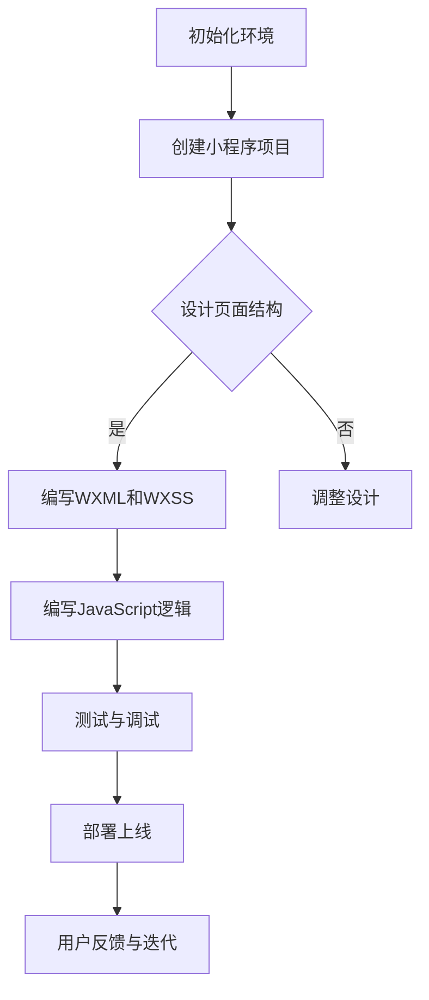

                 

关键词：微信小程序、产品原型、轻量级开发、用户体验设计、前端开发框架

摘要：本文将深入探讨如何利用微信小程序平台开发轻量级产品原型。通过理解微信小程序的开发流程、核心概念和设计原则，读者可以掌握快速构建高质量原型的方法，为产品的成功打下坚实的基础。

## 1. 背景介绍

在数字化时代，用户体验设计（UX）和产品原型开发变得越来越重要。轻量级产品原型是一种在项目早期阶段快速构建的可交互产品模型，用于验证设计概念、测试用户反馈和指导后续开发。微信小程序，作为腾讯公司推出的移动应用解决方案，凭借其便捷的开发流程、良好的用户体验和广泛的应用场景，成为开发轻量级产品原型的一个理想平台。

微信小程序具有以下特点：
- **快速开发**：基于微信强大的生态系统，开发者可以快速搭建原型并进行迭代。
- **易于传播**：小程序可以通过微信分享，易于用户获取和推广。
- **跨平台**：支持iOS和Android平台，适用于多设备开发。
- **丰富的API**：提供多种API接口，方便开发者集成第三方服务和数据。

本文将详细讨论如何利用微信小程序开发轻量级产品原型，从核心概念到具体操作步骤，再到实际应用和未来展望，希望能为开发者提供有价值的参考。

## 2. 核心概念与联系

在开始微信小程序的开发前，我们需要理解几个核心概念，它们共同构成了微信小程序的技术架构。

### 2.1. 小程序框架

微信小程序框架基于JavaScript、WXML（微信小程序标记语言）和WXSS（微信小程序样式表），提供了丰富的组件和API。开发者可以通过编写WXML和WXSS文件，构建小程序的界面和样式；通过JavaScript脚本实现页面的交互逻辑。

### 2.2. 页面路由

页面路由是小程序的基础功能之一，它允许用户在多个页面之间切换。微信小程序使用`Page`对象来定义页面，并通过`navigator`组件实现页面的跳转。开发者需要合理设计页面路由，以提升用户体验。

### 2.3. 数据绑定

数据绑定是微信小程序中的一个重要特性，它允许开发者直接在WXML中引用JavaScript中的数据。通过数据绑定，开发者可以简化数据操作，实现页面的动态更新。

### 2.4. 生命周期

小程序中的每个页面都有其生命周期，包括创建、显示、隐藏、卸载等状态。开发者可以通过生命周期函数来监听页面状态的变化，并在合适的时机进行相应的操作。

### 2.5. 组件化开发

组件化开发是一种现代前端开发方法，它通过将UI拆分为可复用的组件，提高代码的可维护性和扩展性。微信小程序支持组件化开发，开发者可以自定义组件并方便地使用。

### 2.6. Mermaid流程图

下面是一个简单的Mermaid流程图，展示了微信小程序开发的基本流程：



通过这个流程图，我们可以看到微信小程序开发的主要步骤和它们之间的联系。

## 3. 核心算法原理 & 具体操作步骤

### 3.1. 算法原理概述

微信小程序的开发涉及多种算法和编程技术。以下是一些核心算法原理：

- **响应式布局算法**：微信小程序使用响应式布局，根据屏幕尺寸自动调整页面元素的位置和大小。
- **网络通信算法**：小程序通过HTTP请求与服务器通信，使用Ajax或Fetch API异步获取数据。
- **状态管理算法**：小程序使用Vuex或其他状态管理库来管理全局状态，确保数据的一致性。

### 3.2. 算法步骤详解

以下是微信小程序开发的基本步骤：

1. **初始化环境**：
   - 安装微信开发者工具。
   - 创建小程序项目。

2. **设计页面结构**：
   - 使用Sketch、Adobe XD等工具设计界面。
   - 将设计稿转换为WXML和WXSS文件。

3. **编写WXML和WXSS**：
   - 使用WXML构建页面结构。
   - 使用WXSS定义页面样式。

4. **编写JavaScript逻辑**：
   - 使用JavaScript编写页面的交互逻辑。
   - 实现数据绑定和页面路由。

5. **测试与调试**：
   - 使用微信开发者工具进行调试。
   - 修复bug和优化性能。

6. **部署上线**：
   - 将小程序提交审核。
   - 发布小程序到微信平台。

7. **用户反馈与迭代**：
   - 收集用户反馈。
   - 根据反馈进行迭代优化。

### 3.3. 算法优缺点

- **优点**：
  - **快速开发**：微信小程序提供了一套完善的开发工具和API，使得开发者可以快速搭建原型。
  - **跨平台**：小程序支持iOS和Android平台，无需为不同操作系统编写额外代码。
  - **用户体验**：小程序的界面设计和交互方式与微信原生应用一致，提升了用户体验。

- **缺点**：
  - **功能限制**：小程序在某些功能上受到限制，例如无法调用某些原生应用的功能。
  - **性能瓶颈**：由于微信小程序运行在微信应用中，性能可能受到微信应用的影响。

### 3.4. 算法应用领域

微信小程序广泛应用于多种领域，包括电商、教育、金融、游戏等。以下是一些应用案例：

- **电商小程序**：如拼多多、小红书等，通过小程序提供便捷的购物体验。
- **教育小程序**：如作业帮、猿辅导等，提供在线教育服务。
- **金融小程序**：如理财通、微众银行等，提供金融产品和服务。
- **游戏小程序**：如跳一跳、欢乐斗地主等，提供休闲游戏。

## 4. 数学模型和公式 & 详细讲解 & 举例说明

### 4.1. 数学模型构建

在微信小程序开发中，数据绑定是一个关键特性。数据绑定的数学模型可以简化为以下形式：

$$
\text{WXML元素} = \text{WXSS样式} + \text{JavaScript数据}
$$

其中，WXML元素表示页面的DOM结构，WXSS样式定义页面的样式，JavaScript数据则提供动态更新的内容。

### 4.2. 公式推导过程

数据绑定过程可以分为以下几个步骤：

1. **数据定义**：在JavaScript中定义数据对象，如`data = {text: 'Hello World!'}`。
2. **数据绑定**：在WXML中使用`{{ }}`语法绑定数据，如`<text bind:tap="setText">{{text}}</text>`。
3. **事件处理**：在WXML中绑定事件处理器，如`<button bind:tap="setText">Change Text</button>`。
4. **数据更新**：在JavaScript中更新数据，触发页面重新渲染。

### 4.3. 案例分析与讲解

以下是一个简单的案例，展示如何使用数据绑定实现文本动态更新：

```javascript
// JavaScript数据
data: {
  text: 'Hello World!'
}

// WXML数据绑定
<text bind:tap="setText">{{text}}</text>

// WXSS样式
text {
  color: #333;
  font-size: 24rpx;
}

// JavaScript事件处理
setText: function() {
  this.setData({
    text: 'Hello Again!'
  });
}
```

在这个案例中，文本内容`"Hello World!"`通过数据绑定显示在页面上。当用户点击文本时，`setText`函数将文本内容更新为`"Hello Again!"`，页面重新渲染，实现动态更新。

## 5. 项目实践：代码实例和详细解释说明

### 5.1. 开发环境搭建

要开始开发微信小程序，首先需要搭建开发环境。以下是搭建步骤：

1. 安装最新版本的微信开发者工具：[https://developers.weixin.qq.com/miniprogram/dev/devtools/download.html](https://developers.weixin.qq.com/miniprogram/dev/devtools/download.html)
2. 打开微信开发者工具，点击“新建项目”。
3. 在新建项目页面选择“小程序”选项，填写小程序名称、账号信息等。
4. 选择小程序模板（如“空白项目”），然后点击“确认”。

### 5.2. 源代码详细实现

以下是一个简单的微信小程序示例，展示了一个包含文本展示和点击事件的基本页面：

**WXML文件（index.wxml）**：

```html
<view class="container">
  <text class="title">{{title}}</text>
  <text class="description">{{description}}</text>
  <button bind:tap="onButtonClick">Click Me</button>
</view>
```

**WXSS文件（index.wxss）**：

```css
.container {
  display: flex;
  flex-direction: column;
  align-items: center;
  padding: 50rpx;
}

.title {
  font-size: 36rpx;
  font-weight: bold;
  margin-bottom: 20rpx;
}

.description {
  font-size: 28rpx;
  margin-bottom: 30rpx;
}

button {
  font-size: 28rpx;
  color: #fff;
  background-color: #007aff;
  padding: 10rpx 20rpx;
  border-radius: 10rpx;
}
```

**JavaScript文件（index.js）**：

```javascript
Page({
  data: {
    title: 'Welcome to My App!',
    description: 'This is a simple example of a WeChat Mini Program.'
  },
  onClickButton: function() {
    this.setData({
      description: 'Hello, WeChat Mini Program!'
    });
  }
});
```

### 5.3. 代码解读与分析

1. **WXML**：定义了页面结构，包括标题、描述和按钮。
2. **WXSS**：定义了页面的样式，如字体大小、颜色和按钮样式。
3. **JavaScript**：实现了页面的逻辑，包括数据绑定和事件处理。

在JavaScript中，使用`this.setData()`方法更新页面数据，触发页面的重新渲染。`onClickButton`事件处理函数在按钮被点击时执行，更新页面描述文本。

### 5.4. 运行结果展示

在微信开发者工具中运行此小程序，将显示一个简单的页面，包含标题、描述和按钮。点击按钮后，描述文本将更新为“Hello, WeChat Mini Program!”。

## 6. 实际应用场景

微信小程序在实际应用场景中展现出强大的潜力。以下是一些典型的应用场景：

### 6.1. 电商

电商小程序通过微信小程序平台，可以提供便捷的购物体验，例如商品浏览、购买、支付等功能。用户可以直接在微信内完成购物流程，无需下载额外应用。

### 6.2. 教育和培训

教育和培训领域的小程序可以帮助用户在线学习，提供课程内容、学习进度管理、互动讨论等功能。例如，在线课程平台、语言学习应用等。

### 6.3. 健康和医疗

健康和医疗领域的小程序可以提供健康咨询、预约挂号、在线问诊等服务。用户可以通过小程序了解健康知识、管理健康数据。

### 6.4. 游戏和娱乐

游戏和娱乐领域的小程序提供了丰富的休闲游戏，如消消乐、猜谜游戏等。这些小程序用户无需下载安装，即可在微信内玩游戏。

## 6.4. 未来应用展望

随着技术的不断进步，微信小程序在未来将迎来更多的发展机遇。以下是一些展望：

### 6.4.1. 技术升级

微信小程序可能会引入更多的前端开发框架，如React Native、Vue等，提高开发效率和性能。

### 6.4.2. 生态完善

微信小程序生态将进一步完善，提供更多第三方服务、插件和工具，方便开发者快速搭建小程序。

### 6.4.3. 新功能支持

微信小程序可能会引入更多功能，如AR、VR等，提供更丰富的用户体验。

### 6.4.4. 独立化发展

微信小程序可能会逐步独立于微信应用，提供更多自主控制权和功能扩展能力。

## 7. 工具和资源推荐

### 7.1. 学习资源推荐

- **微信官方文档**：[https://developers.weixin.qq.com/miniprogram/dev/framework/](https://developers.weixin.qq.com/miniprogram/dev/framework/)
- **《微信小程序开发实战》**：一本深入浅出的微信小程序开发书籍。

### 7.2. 开发工具推荐

- **微信开发者工具**：[https://developers.weixin.qq.com/miniprogram/dev/devtools/download.html](https://developers.weixin.qq.com/miniprogram/dev/devtools/download.html)
- **VSCode**：适用于微信小程序开发的代码编辑器。

### 7.3. 相关论文推荐

- **《微信小程序的设计与实现》**：探讨了微信小程序的设计理念和技术实现。
- **《小程序的未来发展趋势》**：分析了微信小程序的未来发展趋势和机遇。

## 8. 总结：未来发展趋势与挑战

### 8.1. 研究成果总结

本文探讨了如何利用微信小程序开发轻量级产品原型，介绍了微信小程序的核心概念、开发流程和实际应用场景。通过示例代码，展示了如何实现页面结构、样式和数据绑定。

### 8.2. 未来发展趋势

随着技术的进步和用户需求的变化，微信小程序将在多个领域继续发展，提供更丰富的功能和更好的用户体验。

### 8.3. 面临的挑战

微信小程序在功能扩展、性能优化和生态系统完善等方面仍面临一定挑战。

### 8.4. 研究展望

未来的研究可以关注微信小程序的技术升级、生态完善和功能扩展等方面，为开发者提供更有力的支持。

## 9. 附录：常见问题与解答

### 9.1. 如何解决小程序的性能瓶颈？

- **优化代码**：减少DOM操作，合理使用组件化开发。
- **使用Web Workers**：将耗时的计算任务分配给Web Workers，提高主线程的性能。
- **优化网络请求**：使用缓存、减少请求数量，提高数据传输效率。

### 9.2. 小程序如何实现跨平台兼容？

- **使用微信开发者工具的编译功能**：开发者工具支持iOS和Android平台的编译。
- **遵循小程序开发规范**：使用微信小程序支持的通用技术和API，确保跨平台兼容性。

### 9.3. 如何收集用户反馈？

- **使用小程序内置的反馈功能**：微信小程序提供了用户反馈功能，开发者可以方便地收集用户反馈。
- **使用第三方工具**：如Bugly、友盟等，提供更丰富的用户反馈分析和处理功能。

# 作者署名

作者：禅与计算机程序设计艺术 / Zen and the Art of Computer Programming

通过本文的深入探讨，相信读者对微信小程序开发轻量级产品原型有了更全面的理解。随着技术的不断进步，微信小程序将继续在产品原型开发领域发挥重要作用，为开发者提供更多的机遇和挑战。希望本文能为读者的项目开发提供有益的参考和启发。

