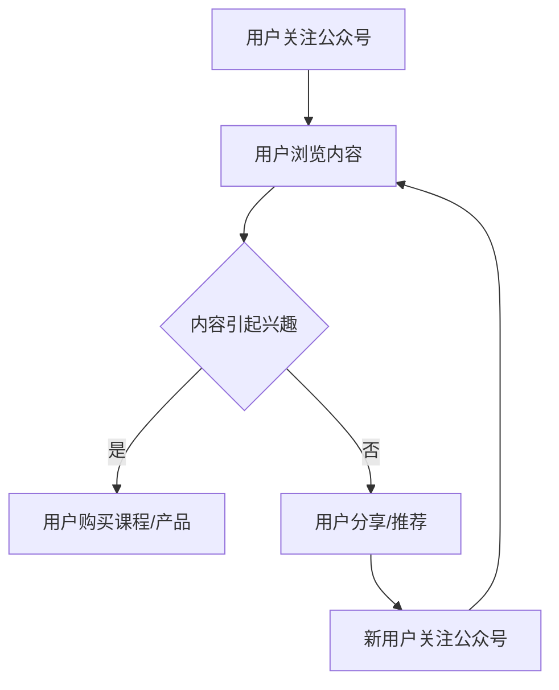

                 

微信，作为中国最广泛使用的社交媒体平台，不仅拥有庞大的用户群体，还具备丰富的生态圈资源。对于知识工作者来说，微信生态圈提供了多种实现知识变现的途径。本文将探讨如何利用微信生态圈实现知识变现，并提供一些实用的方法和技巧。

## 关键词

- 微信生态圈
- 知识变现
- 社交媒体营销
- 线上教育
- 内容创作

## 摘要

本文旨在为知识工作者提供一种通过微信生态圈实现知识变现的思路。通过分析微信生态圈的特点和资源，本文将介绍几种有效的知识变现方式，包括公众号运营、社群建设、知识付费课程、在线教育平台以及内容电商。同时，本文还将探讨这些方式的具体操作方法和成功案例，帮助读者找到适合自己的知识变现路径。

## 1. 背景介绍

微信自2011年上线以来，迅速成为中国最受欢迎的社交应用。截至2023年，微信月活跃用户数已超过12亿，覆盖了几乎所有的年龄层和职业群体。微信不仅仅是一个社交工具，它还拥有丰富的生态圈资源，包括公众号、小程序、微信群、微信支付等，这些资源为知识工作者提供了广阔的变现空间。

随着移动互联网的普及和用户习惯的转移，线上教育和知识付费成为新的趋势。越来越多的用户愿意为高质量的内容付费，知识工作者也有了更多的机会通过线上渠道实现知识变现。微信生态圈正是这样一个极具潜力的平台，它不仅可以帮助知识工作者扩大影响力，还可以实现盈利。

## 2. 核心概念与联系

### 微信生态圈

微信生态圈是一个由多个互联的组件组成的复杂系统，包括公众号、小程序、微信群、微信支付等。每个组件都有其特定的功能和用户群体，但它们共同构成了一个生态系统，为知识工作者提供了多样化的变现途径。

### 知识变现

知识变现是指将个人的知识、技能或经验转化为经济收益的过程。在微信生态圈中，知识变现可以通过多种方式实现，如内容创作、课程销售、咨询服务等。

### 社交媒体营销

社交媒体营销是利用社交媒体平台推广产品或服务的一种营销策略。在微信生态圈中，通过公众号、微信群等平台进行内容推广，可以有效地吸引潜在客户，实现知识变现。

### 线上教育

线上教育是指通过网络平台进行的教学活动。在微信生态圈中，知识工作者可以通过公众号、小程序等平台开设课程，提供在线教育服务。

### 内容电商

内容电商是指通过内容创作带动产品销售的一种商业模式。在微信生态圈中，知识工作者可以通过公众号、微信群等平台推广产品，实现知识变现。

### Mermaid 流程图

下面是微信生态圈中知识变现的 Mermaid 流程图：



## 3. 核心算法原理 & 具体操作步骤

### 3.1 算法原理概述

微信生态圈中的知识变现主要通过内容创作、社群运营、用户互动等方式实现。核心算法原理可以概括为：

1. **内容创作**：通过高质量的内容吸引关注和互动，建立用户粘性。
2. **社群运营**：通过建立微信群、社群等，加强与用户的互动和连接。
3. **用户互动**：通过用户的互动和反馈，优化内容和服务，提高用户满意度。
4. **数据分析**：通过数据分析，了解用户需求和行为，调整策略，提高变现效果。

### 3.2 算法步骤详解

1. **内容创作**：
   - 确定内容主题：根据用户需求和兴趣，选择适合的内容主题。
   - 内容策划：制定详细的内容策划方案，包括内容类型、发布频率等。
   - 内容创作：撰写高质量的文章、制作有吸引力的图片和视频。

2. **社群运营**：
   - 建立微信群：根据用户兴趣和需求，建立多个微信群，提供针对性的内容和服务。
   - 群内互动：定期在群内发布内容，组织讨论和互动，提高用户活跃度。
   - 群管理：规范群内秩序，维护良好的社群环境。

3. **用户互动**：
   - 回复评论：及时回复用户的评论和提问，提供专业的解答和建议。
   - 互动活动：组织互动活动，如抽奖、问卷调查等，增加用户参与度。
   - 用户调研：定期进行用户调研，了解用户需求和反馈，优化内容和服务。

4. **数据分析**：
   - 数据收集：收集用户行为数据，如阅读量、点赞量、分享量等。
   - 数据分析：分析用户行为数据，了解用户需求和偏好。
   - 数据应用：根据分析结果，调整内容和策略，提高变现效果。

### 3.3 算法优缺点

**优点**：

- **覆盖面广**：微信用户基数庞大，覆盖面广，有利于扩大影响力。
- **互动性强**：微信群、公众号等平台提供了丰富的互动功能，有利于建立用户粘性。
- **成本低**：相较于传统媒体，微信生态圈的成本较低，适合中小型知识工作者。

**缺点**：

- **竞争激烈**：由于微信用户众多，竞争激烈，需要高质量的内容和有效的运营策略才能脱颖而出。
- **变现难度**：知识变现需要长期积累和用户信任，初期变现难度较高。

### 3.4 算法应用领域

- **在线教育**：通过公众号、小程序等平台开设在线课程，提供知识服务。
- **内容创作**：通过公众号、短视频平台等创作高质量内容，吸引粉丝，实现广告、赞助等多种变现方式。
- **社群运营**：建立微信群、社群等，提供专业咨询服务，实现知识变现。

## 4. 数学模型和公式 & 详细讲解 & 举例说明

### 4.1 数学模型构建

为了更好地理解微信生态圈中的知识变现，我们可以构建一个简单的数学模型，用于描述用户关注、内容互动、变现效果之间的关系。

设：

- \( U \) 为用户基数
- \( C \) 为内容质量分数
- \( I \) 为互动指数
- \( R \) 为变现收益

则知识变现收益模型可以表示为：

\[ R = U \times C \times I \]

其中：

- \( U \) 表示用户基数，与微信用户数量相关。
- \( C \) 表示内容质量分数，衡量内容的质量和吸引力。
- \( I \) 表示互动指数，衡量用户与内容之间的互动程度。

### 4.2 公式推导过程

公式的推导过程基于以下假设：

1. 用户关注与内容质量成正比。
2. 互动程度与内容吸引力成正比。
3. 用户购买行为与互动程度成正比。

根据上述假设，我们可以推导出公式：

\[ R = U \times C \times I \]

其中：

- \( U \) 表示用户基数，是一个常数。
- \( C \) 表示内容质量分数，可以通过内容评估指标（如阅读量、点赞量、分享量等）来衡量。
- \( I \) 表示互动指数，可以通过用户互动指标（如评论量、互动次数等）来衡量。

### 4.3 案例分析与讲解

以下是一个具体的案例分析，以某知名教育类公众号为例：

- **用户基数**：公众号粉丝数为100万。
- **内容质量分数**：每篇文章平均阅读量为10万，点赞量为1万，分享量为5000。
- **互动指数**：每篇文章平均互动次数为3000。

根据上述数据，我们可以计算出该公众号的变现收益：

\[ R = 100万 \times (10万 + 1万 + 5000) \times 3000 \]
\[ R = 100万 \times 11.5万 \times 3000 \]
\[ R = 3.45亿 \]

这个计算结果是一个理论值，实际变现收益会受到多种因素的影响，如市场环境、用户需求等。但这个公式提供了一个基本的参考，帮助我们理解微信生态圈中的知识变现机制。

## 5. 项目实践：代码实例和详细解释说明

### 5.1 开发环境搭建

为了实现微信生态圈中的知识变现，我们需要搭建一个基于微信小程序的开发环境。以下是开发环境搭建的步骤：

1. **下载并安装微信开发者工具**：在微信官方开发平台下载并安装微信开发者工具。
2. **注册小程序**：在微信官方开发平台注册小程序，获取小程序ID。
3. **创建项目**：在微信开发者工具中创建新项目，填写小程序相关信息。
4. **配置开发环境**：配置小程序所需的开发环境，包括API密钥、服务器域名等。

### 5.2 源代码详细实现

以下是微信小程序中实现知识变现的源代码示例：

```javascript
// index.js
Page({
  data: {
    articles: [
      {
        title: "如何高效学习编程",
        content: "本文将分享高效学习编程的技巧和方法...",
        price: 9.99
      },
      {
        title: "大数据时代的机遇与挑战",
        content: "本文将探讨大数据时代的机遇与挑战...",
        price: 19.99
      },
      // 更多文章
    ]
  },
  onShareAppMessage: function (res) {
    if (res.from === 'button') {
      // 来自页面内转发按钮
      console.log(res.target);
    }
    return {
      title: '推荐阅读',
      path: '/pages/article/article?id=123',
      success: function (res) {
        // 转发成功后的回调
      },
      fail: function (res) {
        // 转发失败后的回调
      }
    }
  },
  onPay: function (e) {
    const orderId = e.currentTarget.dataset.orderid;
    // 调用支付接口
    wx.requestPayment({
      timeStamp: '',
      nonceStr: '',
      package: '',
      signType: '',
      paySign: '',
      success: function (res) {
        // 支付成功后的回调
      },
      fail: function (res) {
        // 支付失败后的回调
      }
    });
  }
});
```

### 5.3 代码解读与分析

上述代码是实现微信小程序中知识变现的核心部分，主要包括以下几个方面：

1. **文章列表展示**：通过 `data` 对象中的 `articles` 数组，展示多篇文章的标题和价格。
2. **分享功能**：通过 `onShareAppMessage` 函数，实现文章的分享功能，提高公众号的曝光率。
3. **支付功能**：通过 `onPay` 函数，实现文章的支付功能，将文章内容作为商品进行销售。

### 5.4 运行结果展示

当用户打开小程序，可以看到文章列表，点击文章标题可以查看详细内容。在文章页面的底部，用户可以选择分享或支付。分享功能可以通过微信内置的分享功能实现，支付功能则通过微信支付接口实现。

## 6. 实际应用场景

### 6.1 线上教育

在线教育是微信生态圈中最常见的知识变现方式之一。知识工作者可以通过公众号、小程序等平台开设在线课程，提供视频教程、直播授课等服务。例如，某位知名编程博主通过公众号开设编程课程，吸引了大量学员，实现了知识变现。

### 6.2 内容创作

内容创作是微信生态圈中另一个重要的知识变现途径。通过公众号、短视频平台等，知识工作者可以创作高质量的内容，吸引粉丝，并通过广告、赞助等方式实现变现。例如，某知名自媒体博主通过公众号发布高质量文章，吸引了大量粉丝，并通过广告合作实现了稳定的收入。

### 6.3 社群运营

社群运营是微信生态圈中的一种高效的知识变现方式。通过建立微信群、社群等，知识工作者可以提供专业咨询服务，建立用户信任，并通过社群活动实现知识变现。例如，某位知名心理咨询师通过建立微信群，提供心理咨询和辅导服务，吸引了大量用户，实现了知识变现。

### 6.4 未来应用展望

随着移动互联网的不断发展，微信生态圈中的知识变现方式将会越来越多样化。未来，知识工作者可以通过更加智能化的方式实现知识变现，如通过人工智能技术分析用户需求，提供个性化的知识服务。同时，微信生态圈也将不断推出新的功能和服务，为知识工作者提供更多的变现机会。

## 7. 工具和资源推荐

### 7.1 学习资源推荐

- 《微信小程序开发实战》
- 《微信公众平台运营实战》
- 《数据分析实战：用Python进行数据挖掘》

### 7.2 开发工具推荐

- 微信开发者工具
- PyCharm（Python开发环境）
- Sublime Text（文本编辑器）

### 7.3 相关论文推荐

- "WeChat: China's Largest Social Network"
- "The Rise of Knowledge Work: Transforming the Global Economy"
- "Knowledge Transfer in Social Networks: A Review"

## 8. 总结：未来发展趋势与挑战

### 8.1 研究成果总结

本文通过对微信生态圈中知识变现方式的探讨，总结了公众号运营、社群建设、知识付费课程、在线教育平台以及内容电商等多种知识变现途径。同时，通过数学模型和实际案例，深入分析了微信生态圈中的知识变现机制。

### 8.2 未来发展趋势

随着移动互联网的普及和用户需求的多样化，微信生态圈中的知识变现将呈现以下发展趋势：

- **智能化**：利用人工智能技术，实现更加个性化的知识服务。
- **多样化**：拓展知识变现的途径，如虚拟现实、增强现实等新技术。
- **生态化**：构建更加完善的微信生态圈，为知识工作者提供全方位的支持。

### 8.3 面临的挑战

尽管微信生态圈中的知识变现具有巨大潜力，但知识工作者在实际操作过程中仍面临以下挑战：

- **内容竞争**：随着内容创作者的增多，高质量内容竞争激烈。
- **变现难度**：知识变现需要长期积累和用户信任，初期变现难度较高。
- **技术更新**：移动互联网和人工智能技术的快速更新，要求知识工作者不断学习和适应。

### 8.4 研究展望

未来，微信生态圈中的知识变现研究应关注以下方向：

- **用户需求分析**：通过大数据分析，深入了解用户需求，提供更加个性化的知识服务。
- **技术融合**：结合虚拟现实、增强现实等新技术，拓展知识变现的途径。
- **生态建设**：构建完善的微信生态圈，为知识工作者提供全方位的支持。

## 9. 附录：常见问题与解答

### 9.1 问题1

**问题**：如何在微信生态圈中快速积累粉丝？

**解答**：要快速积累粉丝，可以采取以下策略：

- **内容质量**：发布高质量的内容，吸引粉丝关注。
- **互动营销**：通过互动活动，如抽奖、优惠券等，提高用户参与度。
- **社交媒体推广**：在其他社交媒体平台宣传，吸引流量。
- **合作互推**：与其他公众号、KOL等合作，互相推广。

### 9.2 问题2

**问题**：微信生态圈中的知识变现有哪些常见的盈利模式？

**解答**：微信生态圈中的知识变现常见盈利模式包括：

- **广告收入**：通过广告推广获取收入。
- **课程销售**：销售在线课程、电子书等知识产品。
- **咨询服务**：提供专业咨询服务，收取费用。
- **内容电商**：通过内容带动产品销售。

### 9.3 问题3

**问题**：如何利用微信生态圈进行精准营销？

**解答**：进行精准营销可以采取以下策略：

- **用户画像**：通过数据分析，了解用户需求和偏好。
- **内容定位**：根据用户画像，发布符合用户兴趣的内容。
- **个性化推荐**：通过算法，为用户推荐感兴趣的内容。
- **社交媒体互动**：加强与用户的互动，提高用户粘性。

以上是关于如何利用微信生态圈实现知识变现的详细探讨。希望通过本文，读者能够更好地理解微信生态圈中的知识变现机制，找到适合自己的变现路径。

---

**作者：禅与计算机程序设计艺术 / Zen and the Art of Computer Programming**

