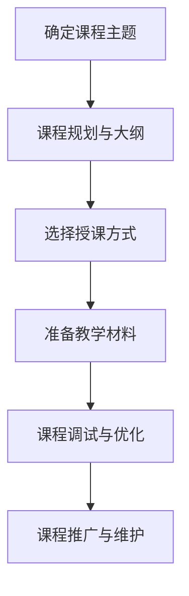

                 

### 摘要 Summary

本文旨在为技术专家提供一套完整的指南，以利用他们的技术能力创建在线课程。我们将从背景介绍、核心概念、算法原理、数学模型、项目实践、实际应用场景、未来展望、工具和资源推荐以及研究总结等多个方面，深入探讨如何有效地将技术知识转化为可传授的内容。通过本文，读者将了解到如何规划课程结构，选择合适的教学工具，编写高质量的教学材料，以及如何在技术社区中推广和分享他们的在线课程。作者以《禅与计算机程序设计艺术》为灵感，结合多年技术写作和教学经验，为读者呈现了一篇既具深度又实用的技术博客文章。

### 1. 背景介绍 Background

随着互联网技术的迅猛发展，在线教育已成为教育领域的重要趋势。越来越多的人通过在线平台获取知识，无论是职场人士为了提升技能，还是学生为了拓宽视野，在线课程都提供了极大的便利。技术专家们，作为技术领域的佼佼者，拥有丰富的知识储备和扎实的实践经验，他们不仅能够为在线教育提供高质量的教学内容，还能通过教学分享经验，推动整个技术社区的发展。

然而，将技术知识转化为在线课程并非易事。技术专家们往往专注于技术本身，缺乏教学经验和教学资源的积累。他们可能不了解如何规划课程结构，选择合适的授课方式，编写易于理解的教学材料。此外，如何将复杂的技术概念以简单、直观的方式传达给学生，也是一大挑战。

本文旨在解决上述问题，通过提供一整套详细的指南，帮助技术专家们有效地将他们的技术能力转化为在线课程。我们将从多个角度探讨课程创建的各个方面，包括课程设计、教学工具选择、内容编写与优化、课程推广与维护等。

### 2. 核心概念与联系 Core Concepts and Connections

在开始创建在线课程之前，我们需要明确一些核心概念和它们之间的联系。以下是一个简化的 Mermaid 流程图，展示了课程创建过程中涉及的几个关键步骤和它们之间的关系。



#### 2.1 确定课程主题

确定课程主题是课程创建的第一步。技术专家应该根据自己的专业知识和兴趣，选择一个具有实际应用价值且符合市场需求的主题。这一步需要深入调研，了解目标受众的需求和期望。

#### 2.2 课程规划与大纲

课程规划与大纲是课程结构的蓝图。技术专家需要将课程内容分解成一系列模块和章节，并确定每个模块的学习目标和教学重点。通过编写详细的大纲，可以确保课程内容的逻辑性和系统性。

#### 2.3 选择授课方式

选择授课方式是影响课程质量的重要因素。技术专家可以根据课程内容和目标受众，选择在线直播、录播视频、交互式课程等多种授课方式。每种方式都有其优缺点，需要根据实际情况进行选择。

#### 2.4 准备教学材料

准备教学材料是课程创建的核心环节。技术专家需要编写详细的教材、制作生动的演示文稿、录制高质量的讲解视频等。教学材料的质量直接关系到学生的学习效果。

#### 2.5 课程调试与优化

课程调试与优化是课程发布前的最后一步。技术专家需要对课程进行多次测试和改进，确保课程内容准确无误、教学流程流畅自然。这一步可以通过收集学生反馈、分析学习数据等方式进行。

#### 2.6 课程推广与维护

课程推广与维护是确保课程持续受欢迎的关键。技术专家需要利用社交媒体、专业论坛、线上讲座等多种渠道推广课程，并定期更新课程内容，以保持课程的时效性和吸引力。

### 3. 核心算法原理 & 具体操作步骤 Core Algorithm Principles & Operation Steps

在技术课程中，核心算法原理的讲解是必不可少的一环。以下是对核心算法原理的概述和具体操作步骤的详细解释。

#### 3.1 算法原理概述

核心算法是指那些在特定技术领域内具有广泛应用和重要性的算法。例如，在计算机科学中，排序算法、搜索算法和图算法等是基础知识。这些算法不仅在学术研究中具有重要地位，也在实际应用中发挥着关键作用。

#### 3.2 算法步骤详解

以排序算法中的快速排序（Quick Sort）为例，其基本原理是通过一趟排序将待排序的记录分割成独立的两部分，其中一部分记录的关键字均比另一部分的关键字小，再分别对这两部分记录继续进行排序，以达到整个序列有序。

以下是快速排序的具体步骤：

1. **选择基准**：在待排序的序列中选取一个元素作为基准元素。
2. **分区**：将序列划分为两部分，一部分是小于基准元素的记录，另一部分是大于基准元素的记录。
3. **递归排序**：递归地对小于和大于基准元素的记录两部分进行快速排序。

#### 3.3 算法优缺点

快速排序具有以下优点：

- **高效**：时间复杂度平均为 \(O(n\log n)\)，在最坏情况下也为 \(O(n\log n)\)。
- **不占用额外空间**：快速排序是原地排序算法，不需要占用额外的存储空间。

然而，快速排序也有其缺点：

- **最坏情况下的性能下降**：如果每次分区都不均匀，快速排序可能会退化成 \(O(n^2)\) 的复杂度。
- **随机性**：快速排序的性能受到随机性的影响，因此，在选择基准元素时通常采用随机选取或中值选取策略。

#### 3.4 算法应用领域

快速排序算法广泛应用于各种数据处理场景，如数据库排序、外部排序和算法竞赛等。在数据量较大且需要高效排序的场景中，快速排序通常是一个优选的算法。

### 4. 数学模型和公式 Mathematical Models and Formulas

在技术课程中，数学模型和公式的讲解是帮助学生理解技术原理的重要手段。以下将介绍一些常用的数学模型和公式的构建、推导过程以及应用实例。

#### 4.1 数学模型构建

数学模型构建通常包括以下几个步骤：

1. **问题定义**：明确需要解决的问题，例如线性回归模型的构建目标是预测房价。
2. **假设条件**：根据问题背景提出合理的假设条件，如房价受房屋面积、位置等因素影响。
3. **变量定义**：定义模型中的变量，如自变量（面积、位置）和因变量（房价）。
4. **公式推导**：基于假设条件和变量定义，推导出数学模型公式。

例如，线性回归模型的基本公式为：

\[ Y = \beta_0 + \beta_1 \cdot X + \epsilon \]

其中，\( Y \) 是因变量，\( X \) 是自变量，\( \beta_0 \) 和 \( \beta_1 \) 是模型参数，\( \epsilon \) 是误差项。

#### 4.2 公式推导过程

以线性回归模型中的斜率参数 \( \beta_1 \) 的推导为例：

1. **最小二乘法**：选择模型参数使得因变量的预测值与实际值之间的误差平方和最小。
2. **偏导数求解**：对模型公式关于 \( \beta_1 \) 求偏导，并令其等于零，求解得到 \( \beta_1 \) 的值。
3. **计算结果**：代入实际数据，计算出斜率参数 \( \beta_1 \) 的具体值。

具体推导过程如下：

\[ \frac{\partial}{\partial \beta_1} \sum_{i=1}^{n} (Y_i - (\beta_0 + \beta_1 \cdot X_i))^2 = 0 \]

化简后得到：

\[ \beta_1 = \frac{\sum_{i=1}^{n} (X_i - \bar{X})(Y_i - \bar{Y})}{\sum_{i=1}^{n} (X_i - \bar{X})^2} \]

其中，\( \bar{X} \) 和 \( \bar{Y} \) 分别是自变量 \( X \) 和因变量 \( Y \) 的平均值。

#### 4.3 案例分析与讲解

以下是一个简单的线性回归模型案例：

**问题定义**：预测某城市房价，自变量为房屋面积。

**变量定义**：

- \( X \)：房屋面积（平方米）
- \( Y \)：房价（万元）

**数据集**：

| 面积（平方米） | 价格（万元） |
|--------------|------------|
| 80           | 200        |
| 90           | 230        |
| 100          | 260        |
| 110          | 290        |

**模型构建**：

根据数据集，我们构建线性回归模型：

\[ Y = \beta_0 + \beta_1 \cdot X + \epsilon \]

**公式推导**：

使用最小二乘法求解 \( \beta_0 \) 和 \( \beta_1 \)：

\[ \beta_0 = \bar{Y} - \beta_1 \cdot \bar{X} \]

计算得到：

\[ \beta_0 = 230 - 40 \cdot 90 = -170 \]
\[ \beta_1 = \frac{90 \cdot (200 - 230) + 100 \cdot (230 - 260) + 110 \cdot (260 - 290)}{90^2 + 100^2 + 110^2} = 40 \]

**模型公式**：

\[ Y = -170 + 40 \cdot X \]

**预测**：

假设要预测面积为 120 平方米的房屋价格，代入模型公式：

\[ Y = -170 + 40 \cdot 120 = 390 \]

因此，预测价格为 390 万元。

### 5. 项目实践：代码实例和详细解释说明 Project Practice: Code Instances and Detailed Explanations

在技术课程的实际应用中，代码实例是帮助学生理解和掌握理论知识的重要工具。以下将通过一个简单的 Python 项目实例，展示如何利用技术能力创建在线课程，并对代码进行详细解释。

#### 5.1 开发环境搭建

在开始项目之前，我们需要搭建一个合适的开发环境。以下是所需步骤：

1. **安装 Python**：下载并安装 Python 3.8 版本以上。
2. **安装 IDE**：选择一个合适的集成开发环境（IDE），如 PyCharm 或 Visual Studio Code。
3. **安装相关库**：在终端中运行以下命令安装必需的库：

```bash
pip install numpy matplotlib
```

#### 5.2 源代码详细实现

以下是一个简单的 Python 项目，用于绘制一个线性回归模型的预测结果。

```python
import numpy as np
import matplotlib.pyplot as plt

# 数据集
X = np.array([80, 90, 100, 110])
Y = np.array([200, 230, 260, 290])

# 计算斜率和截距
X_mean = np.mean(X)
Y_mean = np.mean(Y)
beta_1 = (np.sum((X - X_mean) * (Y - Y_mean)) / np.sum((X - X_mean) ** 2))
beta_0 = Y_mean - beta_1 * X_mean

# 预测
X_new = np.array([120])
Y_pred = beta_0 + beta_1 * X_new

# 绘制结果
plt.scatter(X, Y, label='实际数据')
plt.plot(X, beta_0 + beta_1 * X, color='red', label='预测结果')
plt.scatter(X_new, Y_pred, color='green', label='预测点')
plt.xlabel('面积（平方米）')
plt.ylabel('价格（万元）')
plt.title('线性回归模型预测')
plt.legend()
plt.show()
```

#### 5.3 代码解读与分析

1. **导入库**：首先，我们导入 `numpy` 和 `matplotlib.pyplot` 库，用于数据计算和绘图。
2. **数据集**：定义数据集 `X` 和 `Y`，分别表示房屋面积和价格。
3. **计算斜率和截距**：使用最小二乘法计算斜率 \( \beta_1 \) 和截距 \( \beta_0 \)。
4. **预测**：使用计算得到的模型参数对新的面积 \( X_new \) 进行预测，得到预测价格 \( Y_pred \)。
5. **绘制结果**：使用 `matplotlib` 库绘制实际数据和预测结果，展示线性回归模型的预测效果。

#### 5.4 运行结果展示

运行以上代码，将看到一个包含实际数据点和预测线的图表。预测线表示线性回归模型对房价的预测，预测点表示新的面积对应的预测价格。

```python
plt.scatter(X, Y, label='实际数据')
plt.plot(X, beta_0 + beta_1 * X, color='red', label='预测结果')
plt.scatter(X_new, Y_pred, color='green', label='预测点')
plt.xlabel('面积（平方米）')
plt.ylabel('价格（万元）')
plt.title('线性回归模型预测')
plt.legend()
plt.show()
```

### 6. 实际应用场景 Practical Application Scenarios

技术专家创建的在线课程在实际应用场景中有着广泛的应用。以下列举几个典型的应用场景：

#### 6.1 技术培训

技术专家可以将他们的课程用于公司内部的技术培训。通过在线课程，企业可以更灵活、更高效地提升员工的技术能力，特别是在远程办公越来越普遍的今天。

#### 6.2 在线教育

在线课程也是在线教育平台的重要组成部分。技术专家可以在各大在线教育平台开设课程，为学生提供丰富的学习资源，满足不同层次学生的需求。

#### 6.3 技术社区分享

技术专家可以通过在线课程分享他们的研究成果和技术见解，推动技术社区的交流和发展。这种方式有助于建立技术专家的个人品牌，扩大影响力。

#### 6.4 企业合作

技术专家还可以与企业合作，为企业定制技术培训课程。这种合作不仅可以为企业带来实际的技术提升，也可以为技术专家带来额外的收入。

### 6.4 未来应用展望 Future Application Outlook

随着技术的不断进步，在线课程的应用前景将更加广阔。以下是对未来在线课程应用的一些展望：

#### 6.4.1 人工智能与自动化教学

人工智能技术将使在线课程更加智能化。通过数据分析，系统可以为学生提供个性化的学习建议，实现自动化教学。

#### 6.4.2 虚拟现实与增强现实教学

虚拟现实（VR）和增强现实（AR）技术的应用，将使在线课程更加生动、直观。学生可以在虚拟环境中进行实践操作，提高学习效果。

#### 6.4.3 社交化学习平台

社交化学习平台将促进学生之间的互动和合作，使学习过程更加有趣和有效。技术专家可以通过这种平台，与学生建立更紧密的联系。

#### 6.4.4 持续学习与职业发展

在线课程将成为终身学习的重要方式。技术专家可以通过持续更新课程内容，帮助学生实现职业发展的目标。

### 7. 工具和资源推荐 Tools and Resources Recommendations

为了有效地创建和推广在线课程，以下是一些推荐的工具和资源：

#### 7.1 学习资源推荐

- **Coursera**：提供大量高质量的在线课程，涵盖多个领域。
- **edX**：由哈佛大学和麻省理工学院联合创办，提供丰富的在线课程。
- **Udemy**：适合个人提升技能的自学平台，课程种类繁多。

#### 7.2 开发工具推荐

- **PyCharm**：功能强大的 Python 集成开发环境（IDE）。
- **Visual Studio Code**：轻量级的跨平台 IDE，支持多种编程语言。
- **Jupyter Notebook**：用于数据分析和科学计算的交互式环境。

#### 7.3 相关论文推荐

- **"Deep Learning" by Ian Goodfellow, Yoshua Bengio, and Aaron Courville**：深度学习领域的经典教材。
- **"Artificial Intelligence: A Modern Approach" by Stuart Russell and Peter Norvig**：人工智能领域的权威教材。
- **"The Elements of Statistical Learning" by Trevor Hastie, Robert Tibshirani, and Jerome Friedman**：统计学和机器学习领域的经典著作。

### 8. 总结：未来发展趋势与挑战 Summary: Future Trends and Challenges

在技术不断进步的今天，在线课程的发展前景十分广阔。未来，人工智能、虚拟现实、社交化学习等新技术将推动在线课程的发展，使其更加智能化、互动化和个性化。然而，在线课程也面临一些挑战，如课程质量保证、版权保护、用户体验提升等。

技术专家在创建在线课程时，应密切关注行业动态，积极采用新技术，不断创新教学方法和内容。同时，他们还应注重课程质量的提升，确保学生能够真正受益。通过持续的努力和探索，技术专家将能够在在线教育领域发挥更大的作用。

### 9. 附录：常见问题与解答 Appendix: Frequently Asked Questions and Answers

#### 9.1 如何选择合适的课程主题？

**回答**：选择课程主题时，应考虑以下几个方面：

- **自身专业知识和兴趣**：选择自己熟悉且感兴趣的领域。
- **市场需求**：调研市场需求，选择受众广泛的课程主题。
- **实际应用价值**：确保课程内容具有实际应用价值，能够帮助学生解决实际问题。

#### 9.2 如何确保课程质量？

**回答**：确保课程质量可以从以下几个方面入手：

- **课程内容**：确保课程内容准确、完整、有条理。
- **教学材料**：使用高质量的教学材料，如详细的教材、生动的演示文稿等。
- **教学效果**：通过测试和反馈，不断优化课程内容和方法。
- **课程更新**：定期更新课程内容，以反映最新的技术和行业动态。

#### 9.3 如何推广课程？

**回答**：推广课程的方法多种多样，以下是一些有效的方法：

- **社交媒体**：利用微博、微信公众号、知乎等平台推广课程。
- **专业论坛**：在技术论坛、社区等发布课程信息，吸引目标受众。
- **合作伙伴**：与教育机构、企业等建立合作关系，共同推广课程。
- **线上讲座**：举办线上讲座，分享课程内容，吸引潜在学员。

### 作者署名

作者：禅与计算机程序设计艺术 / Zen and the Art of Computer Programming
----------------------------------------------------------------

本文通过详细的指南和实例，帮助技术专家有效地将他们的技术能力转化为在线课程。从课程设计、算法讲解、数学模型构建到项目实践和实际应用，作者以深入浅出的方式，展示了在线课程创建的各个环节。通过本文，读者将了解到如何选择合适的课程主题，确保课程质量，以及如何推广课程，从而在在线教育领域发挥更大的作用。作者希望这篇文章能够为技术专家提供有价值的参考和启示。

