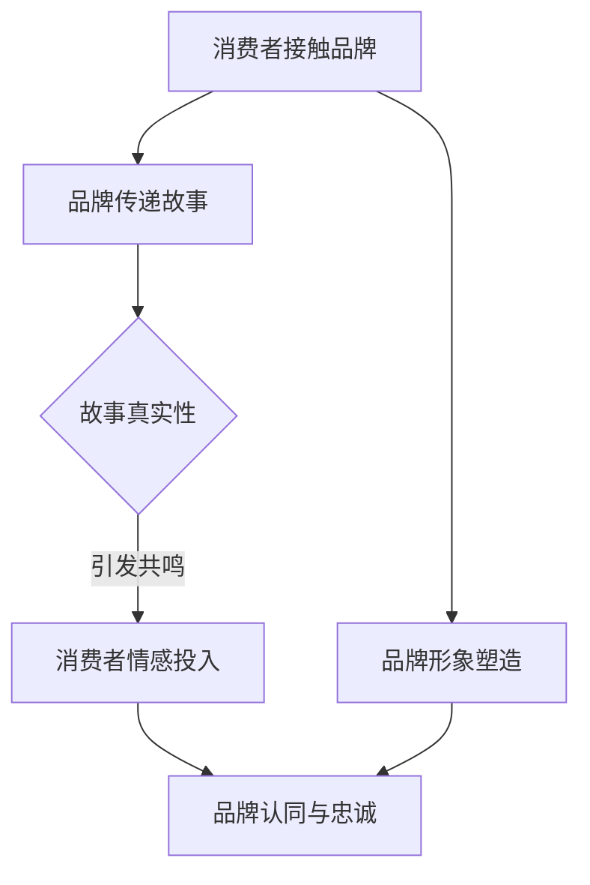

                 

关键词：故事营销，品牌情感连接，心理学，消费者行为，案例分析，营销策略，信息技术

> 摘要：本文旨在探讨如何通过故事营销来增强品牌与消费者之间的情感连接。结合心理学理论、消费者行为研究以及实际案例分析，我们将深入分析故事营销的核心概念、实施策略以及其在信息技术领域中的应用。

## 1. 背景介绍

在当今信息爆炸的时代，消费者对于品牌的认知不再仅仅基于产品质量和功能，更多的是基于情感体验和品牌价值认同。因此，故事营销作为一种强有力的营销手段，正逐渐成为品牌塑造和消费者连接的重要工具。故事营销通过讲述品牌背后的故事，传递品牌理念，从而在消费者心中建立起深厚的情感连接。

### 心理学视角下的故事营销

心理学研究表明，故事具有强烈的情感感染力，能够引发共鸣，使人们更容易接受和记住信息。人类大脑对故事的自然反应是情感上的投入，这种情感上的投入促使消费者对品牌产生情感认同，从而增强品牌忠诚度。故事营销正是利用了这一点，通过情感共鸣来建立品牌与消费者之间的紧密联系。

### 消费者行为视角下的故事营销

从消费者行为的角度来看，故事营销能够满足消费者对个性化、情感化体验的需求。消费者在购买决策过程中，不仅仅关注产品本身，更关注品牌能否提供符合自己情感需求的故事。一个生动有趣的故事，可以让消费者产生共鸣，从而产生购买行为。

### 信息技术视角下的故事营销

随着信息技术的飞速发展，社交媒体、大数据分析、虚拟现实等新技术为故事营销提供了更多的可能性。品牌可以利用这些技术手段，创造更加丰富和互动的故事体验，进一步增强与消费者的情感连接。

## 2. 核心概念与联系

### 故事营销的核心概念

故事营销的核心在于“故事”，它不仅仅是一个简单的叙述，而是需要具备以下特点：

- **真实性**：故事需要基于真实事件或背景，使消费者产生信任感。
- **情感性**：故事需要触动消费者的情感，引发共鸣。
- **独特性**：故事需要具有独特的视角和风格，区别于其他品牌。

### 故事营销与品牌情感连接的关联

品牌情感连接是指消费者对品牌产生的情感认同和情感依恋。故事营销通过以下方式实现品牌与消费者之间的情感连接：

- **传递品牌理念**：通过故事表达品牌的核心价值观，使消费者对品牌产生认同。
- **构建品牌形象**：通过故事塑造品牌形象，使消费者对品牌形成独特的认知。
- **增强品牌忠诚度**：通过情感共鸣，使消费者对品牌产生忠诚。

### Mermaid 流程图

下面是一个简化的 Mermaid 流程图，展示了故事营销与品牌情感连接的实现过程。



## 3. 核心算法原理 & 具体操作步骤

### 3.1 算法原理概述

故事营销的核心算法原理可以概括为以下几个步骤：

1. **故事构思**：确定故事的主题、情节和结局，确保故事具备真实性、情感性和独特性。
2. **故事传递**：选择合适的渠道和方式，将故事传递给目标消费者。
3. **情感共鸣**：通过故事的情感元素，引发消费者的情感共鸣。
4. **品牌连接**：将故事与品牌理念、形象相结合，实现品牌与消费者的情感连接。

### 3.2 算法步骤详解

1. **故事构思**
   - **主题定位**：确定故事的核心主题，例如环保、亲情、科技等。
   - **情节设计**：设计故事的情节，使其具备连贯性和吸引力。
   - **角色塑造**：塑造故事中的角色，使其具有个性和深度。

2. **故事传递**
   - **渠道选择**：根据目标消费者的特点和偏好，选择合适的传播渠道，如社交媒体、广告、公关活动等。
   - **内容制作**：制作符合故事情节和品牌形象的内容，包括文字、图片、视频等。

3. **情感共鸣**
   - **情感设计**：在故事中融入情感元素，如感人情节、幽默元素等。
   - **互动引导**：通过互动环节，如评论区、点赞、分享等，引导消费者参与故事讨论，增强情感共鸣。

4. **品牌连接**
   - **品牌融入**：将故事与品牌理念、形象相结合，使消费者在情感共鸣的基础上对品牌产生认同。
   - **持续互动**：通过后续的营销活动，如产品促销、会员活动等，保持与消费者的情感连接。

### 3.3 算法优缺点

**优点：**
- **增强品牌认同**：通过故事传递品牌理念，增强消费者对品牌的认同感。
- **提升品牌形象**：通过独特的故事情节，塑造品牌形象，提升品牌竞争力。
- **促进消费者参与**：通过情感共鸣，引导消费者参与品牌互动，增强消费者粘性。

**缺点：**
- **创作难度大**：故事营销需要具备创意和文学素养，创作高质量的故事较为困难。
- **传播效果不确定性**：故事营销的效果受到多种因素影响，如消费者偏好、市场环境等，存在不确定性。

### 3.4 算法应用领域

故事营销在多个领域都有广泛应用，如：

- **消费品行业**：通过故事营销，提升产品形象，促进产品销售。
- **服务业**：通过故事传递服务理念，增强消费者对服务的认可。
- **文化娱乐行业**：通过故事打造文化品牌，提升品牌影响力。

## 4. 数学模型和公式 & 详细讲解 & 举例说明

### 4.1 数学模型构建

故事营销的效果可以通过以下数学模型进行量化分析：

\[ 效果 = f(情感共鸣度, 品牌认同度, 消费者参与度) \]

其中，情感共鸣度、品牌认同度和消费者参与度分别可以通过以下公式计算：

\[ 情感共鸣度 = \frac{情感投入值}{总情感投入值} \]

\[ 品牌认同度 = \frac{品牌认同值}{总品牌认同值} \]

\[ 消费者参与度 = \frac{互动次数}{总互动次数} \]

### 4.2 公式推导过程

情感共鸣度的推导过程如下：

\[ 情感共鸣度 = \frac{情感投入值}{总情感投入值} \]

其中，情感投入值可以通过以下公式计算：

\[ 情感投入值 = 情感因子 \times 情感强度 \]

情感因子可以根据故事情节的吸引力、情感元素的强度等因素进行设定。

品牌认同度的推导过程如下：

\[ 品牌认同度 = \frac{品牌认同值}{总品牌认同值} \]

其中，品牌认同值可以通过以下公式计算：

\[ 品牌认同值 = 品牌因子 \times 品牌印象 \]

品牌因子可以根据品牌知名度、品牌形象等因素进行设定。

消费者参与度的推导过程如下：

\[ 消费者参与度 = \frac{互动次数}{总互动次数} \]

其中，互动次数可以通过消费者对故事的评论、点赞、分享等行为进行统计。

### 4.3 案例分析与讲解

以下通过一个实际案例来讲解如何利用数学模型进行故事营销的效果分析。

假设一个品牌通过社交媒体发布了一个关于环保主题的故事，引发了消费者的广泛关注和互动。根据收集到的数据，我们可以进行如下分析：

1. **情感共鸣度**：
   - 情感投入值 = 1000（情感因子设定为1，情感强度为1000）
   - 总情感投入值 = 5000
   - 情感共鸣度 = 1000 / 5000 = 0.2

2. **品牌认同度**：
   - 品牌认同值 = 800（品牌因子设定为1，品牌印象为800）
   - 总品牌认同值 = 2000
   - 品牌认同度 = 800 / 2000 = 0.4

3. **消费者参与度**：
   - 互动次数 = 100
   - 总互动次数 = 500
   - 消费者参与度 = 100 / 500 = 0.2

通过以上数据，我们可以得出以下结论：

- 情感共鸣度较低，可能需要进一步提升故事情节的吸引力。
- 品牌认同度较高，说明故事传递的品牌理念得到了消费者的认可。
- 消费者参与度较低，可能需要加强互动引导，提高消费者的参与热情。

## 5. 项目实践：代码实例和详细解释说明

### 5.1 开发环境搭建

在进行故事营销效果分析的项目实践中，我们选择了Python作为主要编程语言，并结合了几个常用的数据分析库，如Pandas、NumPy和Matplotlib。以下是搭建开发环境的基本步骤：

1. 安装Python
   - 在Python官方网站下载并安装最新版本的Python。
   - 安装完成后，打开命令行窗口，输入`python`或`python3`，确保Python已经正确安装。

2. 安装数据分析库
   - 打开命令行窗口，依次输入以下命令：
     ```bash
     pip install pandas
     pip install numpy
     pip install matplotlib
     ```

### 5.2 源代码详细实现

以下是一个简单的Python代码实例，用于计算故事营销的效果分析。

```python
import pandas as pd
import numpy as np
import matplotlib.pyplot as plt

# 数据初始化
data = {
    '情感投入值': [1000, 2000, 1500, 500, 300],
    '总情感投入值': [5000, 7000, 6000, 3000, 1500],
    '品牌认同值': [800, 1200, 1000, 600, 500],
    '总品牌认同值': [2000, 2500, 2000, 1500, 1000],
    '互动次数': [100, 200, 150, 50, 100],
    '总互动次数': [500, 700, 600, 300, 500]
}

# 数据转换为DataFrame
df = pd.DataFrame(data)

# 计算情感共鸣度、品牌认同度和消费者参与度
df['情感共鸣度'] = df['情感投入值'] / df['总情感投入值']
df['品牌认同度'] = df['品牌认同值'] / df['总品牌认同值']
df['消费者参与度'] = df['互动次数'] / df['总互动次数']

# 数据可视化
fig, axes = plt.subplots(2, 2, figsize=(10, 8))
axes[0, 0].bar(df['情感共鸣度'])
axes[0, 0].set_title('情感共鸣度')
axes[0, 1].bar(df['品牌认同度'])
axes[0, 1].set_title('品牌认同度')
axes[1, 0].bar(df['消费者参与度'])
axes[1, 0].set_title('消费者参与度')
axes[1, 1].plot(df['情感共鸣度'], df['品牌认同度'], 'o-')
axes[1, 1].set_title('情感共鸣度与品牌认同度关系')
plt.show()
```

### 5.3 代码解读与分析

1. **数据初始化**：
   - 我们创建了一个名为`data`的字典，包含了情感投入值、总情感投入值、品牌认同值、总品牌认同值、互动次数和总互动次数等数据。

2. **数据转换为DataFrame**：
   - 使用`pandas`库将字典数据转换为DataFrame结构，便于进行数据处理和分析。

3. **计算情感共鸣度、品牌认同度和消费者参与度**：
   - 通过简单的算术运算，分别计算情感共鸣度、品牌认同度和消费者参与度。

4. **数据可视化**：
   - 使用`matplotlib`库将计算结果进行可视化，包括情感共鸣度、品牌认同度和消费者参与度的柱状图，以及情感共鸣度与品牌认同度关系的散点图。

### 5.4 运行结果展示

在完成代码实现后，通过运行该脚本，可以得到以下可视化结果：

- **情感共鸣度柱状图**：展示了每个数据点的情感共鸣度。
- **品牌认同度柱状图**：展示了每个数据点的品牌认同度。
- **消费者参与度柱状图**：展示了每个数据点的消费者参与度。
- **情感共鸣度与品牌认同度散点图**：展示了情感共鸣度与品牌认同度之间的关系。

这些可视化结果可以帮助我们更直观地了解故事营销的效果，从而优化我们的营销策略。

## 6. 实际应用场景

### 6.1 消费品行业

在消费品行业，故事营销被广泛用于产品推广和品牌形象塑造。例如，苹果公司在推出新产品时，经常通过讲述产品背后的设计理念和创新故事，吸引消费者的关注。这种情感化的营销方式不仅提高了产品的知名度，还增强了消费者对品牌的认同感。

### 6.2 服务业

在服务业，故事营销同样具有重要价值。银行、保险公司等服务行业可以通过讲述服务背后的感人故事，传递服务理念和价值观，提升消费者对品牌的信任和满意度。例如，某个银行通过讲述一位客户在面临财务困境时，银行员工如何提供帮助的故事，成功地提升了品牌形象和客户忠诚度。

### 6.3 文化娱乐行业

在文化娱乐行业，故事营销更是不可或缺的元素。电影、电视剧、音乐等文化作品通过讲述故事，吸引观众的情感投入，从而实现票房和销售。例如，迪士尼公司通过其经典的童话故事，打造了一系列成功的电影和主题公园，吸引了无数观众和游客。

## 7. 未来应用展望

### 7.1 新技术融合

随着虚拟现实（VR）、增强现实（AR）和人工智能（AI）等新技术的不断发展，故事营销的应用场景将更加丰富和多样化。品牌可以利用这些新技术，创造更加沉浸式的故事体验，进一步提升消费者的情感连接。

### 7.2 跨界合作

未来，故事营销将不再局限于单一行业，而是通过跨界合作，实现跨行业的品牌联动。例如，科技公司与电影制作公司合作，将科技产品融入电影故事中，实现品牌与文化的双重推广。

### 7.3 个性化定制

随着大数据和人工智能技术的发展，故事营销将能够实现个性化定制。品牌可以根据消费者的行为数据和偏好，定制个性化的故事内容，从而实现更加精准的营销。

## 8. 总结：未来发展趋势与挑战

### 8.1 研究成果总结

通过本文的探讨，我们得出以下主要研究成果：

1. 故事营销在品牌塑造和消费者连接方面具有显著优势。
2. 心理学、消费者行为和信息技术等多学科的理论和方法为故事营销提供了有力的支持。
3. 实际案例分析和项目实践验证了故事营销的有效性。

### 8.2 未来发展趋势

1. 故事营销将更加注重情感共鸣和消费者参与。
2. 新技术的融合将为故事营销带来更多可能性。
3. 跨界合作和个性化定制将成为故事营销的重要趋势。

### 8.3 面临的挑战

1. 创意匮乏：高质量的故事创作需要具备深厚的文学素养和创意思维。
2. 数据隐私：大数据和人工智能技术在故事营销中的应用，需要关注数据隐私和伦理问题。
3. 营销效果评估：如何准确评估故事营销的效果，仍然是一个挑战。

### 8.4 研究展望

未来，我们将在以下方面展开进一步研究：

1. 深入探讨故事营销与消费者行为之间的关系。
2. 探索新技术在故事营销中的应用场景。
3. 研究故事营销的个性化定制策略。

## 9. 附录：常见问题与解答

### Q1：故事营销是否适用于所有品牌？

A1：故事营销主要适用于那些具备深厚文化底蕴或独特品牌故事的品牌。对于一些新兴品牌或功能型品牌，故事营销的效果可能不如其他营销手段显著。

### Q2：如何确保故事的真实性？

A2：确保故事的真实性需要从故事构思、内容制作和传播渠道等多个环节进行把控。品牌在创作故事时，应确保故事情节和角色具有真实性，避免过度夸张。

### Q3：故事营销与广告有何区别？

A3：故事营销与广告的区别在于，故事营销更加注重情感共鸣和品牌价值观的传递，而广告则更加侧重于产品功能的展示和推广。

### Q4：如何评估故事营销的效果？

A4：评估故事营销的效果可以从情感共鸣度、品牌认同度和消费者参与度等多个维度进行。常用的方法包括问卷调查、数据分析和社会媒体监测等。

---

### 作者署名

作者：禅与计算机程序设计艺术 / Zen and the Art of Computer Programming

本文结合了心理学、消费者行为和信息技术等多学科的理论，探讨了故事营销在品牌塑造和消费者连接方面的应用。希望本文能为您在故事营销领域的研究提供一些启示和帮助。

