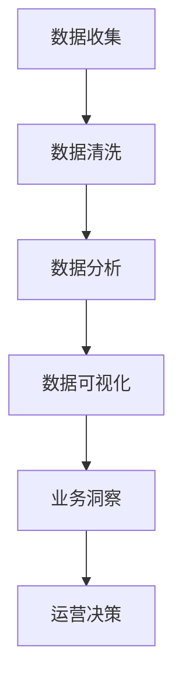

                 

关键词：数据分析、运营决策、商业智能、数据挖掘、机器学习

> 摘要：在商业世界中，数据分析正逐渐成为企业运营决策的核心工具。本文将深入探讨如何通过数据分析来指导运营决策，从而提升企业的竞争力和盈利能力。

## 1. 背景介绍

在信息爆炸的今天，数据已经成为企业最宝贵的资产之一。然而，如何有效地利用这些数据来指导运营决策，却是一个颇具挑战性的问题。传统的数据分析方法往往依赖于统计和报告，虽然能够提供一些基本的业务洞察，但在应对复杂的市场环境时显得力不从心。随着大数据和人工智能技术的发展，数据分析正迎来一个全新的时代。现代数据分析技术，如数据挖掘、机器学习和深度学习，为运营决策提供了更为精准和智能的支持。

## 2. 核心概念与联系

### 2.1 数据分析的基本概念

数据分析（Data Analysis）是指从大量数据中提取有价值的信息和知识的过程。它通常包括数据收集、数据清洗、数据存储、数据分析、数据可视化和数据解释等步骤。

### 2.2 运营决策的重要性

运营决策是企业日常运营的核心，包括产品策略、市场推广、供应链管理、库存控制、客户关系管理等。正确的运营决策能够帮助企业降低成本、提高效率、增强市场竞争力。

### 2.3 数据分析与运营决策的联系

数据分析与运营决策紧密相连。通过数据分析，企业可以识别业务中的问题、预测市场趋势、评估决策效果，从而做出更加科学和高效的运营决策。

### 2.4 Mermaid 流程图

以下是一个简化的数据分析与运营决策联系的 Mermaid 流程图：



## 3. 核心算法原理 & 具体操作步骤

### 3.1 算法原理概述

数据分析的核心算法包括数据挖掘算法、机器学习算法和深度学习算法。这些算法能够从数据中提取隐藏的模式和知识，为运营决策提供支持。

### 3.2 算法步骤详解

1. 数据收集：收集与业务相关的数据，包括内部数据和外部数据。
2. 数据清洗：处理缺失值、异常值和重复数据，保证数据的准确性和一致性。
3. 数据分析：使用数据挖掘算法和机器学习算法对数据进行处理和分析，提取有价值的信息。
4. 数据可视化：将分析结果以图表、地图等形式展示，便于理解和决策。
5. 业务洞察：基于数据分析结果，识别业务中的机会和挑战。
6. 运营决策：根据业务洞察，制定和调整运营策略。

### 3.3 算法优缺点

- **数据挖掘算法**：优点在于能够处理大量数据，发现复杂的关系模式；缺点是对数据质量要求较高，且算法复杂度较高。
- **机器学习算法**：优点在于能够自动学习数据中的模式，提高预测准确性；缺点是需要大量数据和计算资源。
- **深度学习算法**：优点在于能够处理复杂和非线性关系，提高预测性能；缺点是训练过程较为耗时，对数据质量要求较高。

### 3.4 算法应用领域

- **市场预测**：通过分析历史数据，预测市场趋势和消费者行为。
- **客户关系管理**：通过分析客户数据，识别高价值客户和潜在客户。
- **供应链优化**：通过分析供应链数据，优化库存管理和物流调度。
- **风险控制**：通过分析金融数据，预测市场风险和信用风险。

## 4. 数学模型和公式 & 详细讲解 & 举例说明

### 4.1 数学模型构建

数据分析中的数学模型通常包括回归模型、分类模型和聚类模型等。以下是一个简单的线性回归模型：

$$
Y = \beta_0 + \beta_1X + \epsilon
$$

其中，$Y$ 是因变量，$X$ 是自变量，$\beta_0$ 和 $\beta_1$ 是模型参数，$\epsilon$ 是误差项。

### 4.2 公式推导过程

线性回归模型的推导过程通常包括以下几个步骤：

1. 数据收集：收集一组因变量 $Y$ 和自变量 $X$ 的数据。
2. 数据预处理：对数据进行清洗和预处理，保证数据的质量。
3. 模型假设：假设 $Y$ 和 $X$ 之间满足线性关系。
4. 模型构建：根据假设，建立线性回归模型。
5. 参数估计：使用最小二乘法估计模型参数。
6. 模型验证：使用交叉验证等方法验证模型性能。

### 4.3 案例分析与讲解

假设某企业需要预测下一季度的销售额，收集了过去几年的销售额和营销投入数据。以下是使用线性回归模型进行预测的步骤：

1. 数据收集：收集销售额和营销投入数据，如下表所示。

| 年份 | 销售额（万元） | 营销投入（万元） |
| ---- | ------------ | ------------ |
| 2020 | 500          | 100          |
| 2021 | 550          | 120          |
| 2022 | 600          | 150          |

2. 数据预处理：对数据进行清洗和预处理，去除缺失值和异常值。

3. 模型假设：假设销售额 $Y$ 和营销投入 $X$ 之间满足线性关系。

4. 模型构建：建立线性回归模型：

$$
Y = \beta_0 + \beta_1X + \epsilon
$$

5. 参数估计：使用最小二乘法估计模型参数，得到：

$$
\beta_0 = 300, \beta_1 = 0.5
$$

6. 模型验证：使用交叉验证等方法验证模型性能。

7. 预测下一季度销售额：根据模型预测，下一季度的销售额为：

$$
Y = 300 + 0.5 \times 150 = 375 \text{ 万元}
$$

## 5. 项目实践：代码实例和详细解释说明

### 5.1 开发环境搭建

1. 安装 Python 环境：下载并安装 Python 3.8 以上版本。
2. 安装必要库：使用 pip 命令安装 numpy、pandas、scikit-learn、matplotlib 等库。

### 5.2 源代码详细实现

```python
import numpy as np
import pandas as pd
from sklearn.linear_model import LinearRegression
from sklearn.model_selection import train_test_split
import matplotlib.pyplot as plt

# 数据收集
data = pd.DataFrame({
    'year': [2020, 2021, 2022],
    'sales': [500, 550, 600],
    'investment': [100, 120, 150]
})

# 数据预处理
data.dropna(inplace=True)

# 模型构建
X = data[['investment']]
y = data['sales']
X_train, X_test, y_train, y_test = train_test_split(X, y, test_size=0.2, random_state=42)

# 参数估计
model = LinearRegression()
model.fit(X_train, y_train)

# 模型验证
predictions = model.predict(X_test)
print("R^2:", model.score(X_test, y_test))

# 预测下一季度销售额
next_year_investment = 150
next_sales = model.predict([[next_year_investment]])[0]
print("Next quarter sales prediction:", next_sales)

# 数据可视化
plt.scatter(X_test, y_test, color='blue')
plt.plot(X_test, predictions, color='red')
plt.xlabel('Investment')
plt.ylabel('Sales')
plt.title('Sales vs Investment')
plt.show()
```

### 5.3 代码解读与分析

1. 导入必要的库：numpy、pandas、scikit-learn、matplotlib。
2. 数据收集：使用 pandas 库读取数据。
3. 数据预处理：去除缺失值。
4. 模型构建：使用 scikit-learn 库的 LinearRegression 类构建线性回归模型。
5. 参数估计：使用 fit 方法训练模型。
6. 模型验证：使用 score 方法计算 R^2 值，评估模型性能。
7. 预测下一季度销售额：使用 predict 方法进行预测。
8. 数据可视化：使用 matplotlib 库绘制散点图和拟合线。

## 6. 实际应用场景

### 6.1 市场预测

通过数据分析，企业可以预测市场趋势，从而制定合适的营销策略。例如，一家电商公司可以通过分析用户购买行为、市场趋势和竞争环境，预测下一季度的销售额，从而调整库存和营销预算。

### 6.2 客户关系管理

通过数据分析，企业可以识别高价值客户和潜在客户，提供个性化的服务和优惠，提高客户满意度和忠诚度。例如，一家电信公司可以通过分析用户使用数据，识别高价值用户，并提供定制化的套餐和服务。

### 6.3 供应链优化

通过数据分析，企业可以优化供应链管理，降低库存成本，提高物流效率。例如，一家制造企业可以通过分析订单数据、库存水平和供应商信息，优化生产计划和物流调度。

## 7. 工具和资源推荐

### 7.1 学习资源推荐

- 《数据科学入门指南》
- 《Python 数据科学手册》
- 《机器学习实战》

### 7.2 开发工具推荐

- Jupyter Notebook：用于数据分析和机器学习项目。
- PyCharm：用于 Python 项目的开发。
- Tableau：用于数据可视化。

### 7.3 相关论文推荐

- "Data-Driven Business Strategy: Insights and Opportunities"
- "Machine Learning for Business Analytics: Developing a Practical Strategy"
- "Deep Learning for Business Applications: A Practical Guide"

## 8. 总结：未来发展趋势与挑战

### 8.1 研究成果总结

随着大数据和人工智能技术的发展，数据分析在运营决策中的应用越来越广泛。现代数据分析技术，如数据挖掘、机器学习和深度学习，为企业提供了更加精准和智能的支持。

### 8.2 未来发展趋势

- 数据分析技术将进一步成熟，如图神经网络、增强学习等。
- 数据分析工具将更加智能化和自动化，降低使用门槛。
- 数据分析将更加注重实时性和灵活性，满足企业快速变化的需求。

### 8.3 面临的挑战

- 数据质量和数据隐私问题：保证数据的质量和隐私是数据分析的关键挑战。
- 技术门槛：数据分析技术复杂，对专业人员的要求较高。
- 数据安全：保护企业数据安全是数据分析的重要任务。

### 8.4 研究展望

未来，数据分析将在更多领域得到应用，如金融、医疗、能源等。同时，数据分析技术将不断创新，推动企业运营决策的智能化和自动化。

## 9. 附录：常见问题与解答

### 9.1 数据分析在运营决策中的作用是什么？

数据分析在运营决策中发挥着重要作用，包括市场预测、客户关系管理、供应链优化等方面，为企业提供科学的决策依据。

### 9.2 如何保证数据分析的质量？

保证数据分析的质量需要从数据收集、数据清洗、模型选择和结果验证等多个方面进行控制，确保数据的准确性、一致性和完整性。

### 9.3 数据分析在哪些行业有广泛应用？

数据分析在金融、电商、医疗、制造、电信等多个行业有广泛应用，为企业的运营决策提供支持。

作者：禅与计算机程序设计艺术 / Zen and the Art of Computer Programming
```

