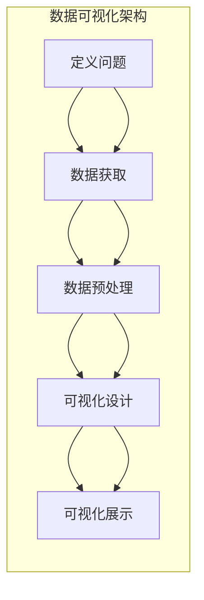

                 

关键词：数据可视化、决策效率、说服力、信息传达、图表设计、数据分析

> 摘要：本文将探讨数据可视化在提升决策效率与说服力方面的作用。通过分析数据可视化的核心概念、算法原理、数学模型，以及项目实践中的代码实例，将帮助读者理解数据可视化技术的应用场景和未来发展趋势。

## 1. 背景介绍

在当今信息爆炸的时代，数据已经成为企业、政府和个人决策的重要依据。然而，面对海量的数据，如何快速准确地提取有用信息、进行科学决策，成为了许多领域的挑战。数据可视化作为一种有效的信息传达工具，通过将复杂的数据转化为直观的图表，可以帮助用户更好地理解和分析数据，从而提升决策效率与说服力。

### 数据可视化的定义与重要性

数据可视化是一种将数据以图形、图像等形式展示的技术，旨在将复杂的数据转换为易于理解的信息。通过视觉化手段，数据可视化能够揭示数据之间的关系、趋势和模式，帮助用户快速获取关键信息，从而支持科学决策。

数据可视化的重要性体现在以下几个方面：

1. **提升决策效率**：数据可视化能够将大量数据简化为直观的图表，使用户能够快速捕捉数据中的关键信息，从而节省分析时间，提高决策效率。
2. **增强说服力**：通过图表展示数据，可以更直观地证明观点，提高报告或演讲的说服力。
3. **支持跨领域交流**：数据可视化能够消除语言、文化和专业知识的差异，使不同领域的专家能够更有效地交流和理解。
4. **发现数据中的隐藏信息**：图表形式能够揭示数据中的隐藏关系和趋势，帮助用户发现新的问题和机会。

### 数据可视化的发展历程

数据可视化的发展可以追溯到17世纪，当时欧洲的科学家和数学家开始使用图表来展示数据。随着时间的推移，数据可视化技术逐渐成熟，从简单的条形图、折线图，发展到更加复杂和多样化的图表类型，如散点图、热力图、网络图等。同时，计算机技术的发展也为数据可视化提供了强大的计算和展示能力，使得数据可视化工具更加普及和易于使用。

## 2. 核心概念与联系

### 数据可视化的核心概念

在探讨数据可视化的核心概念之前，首先需要理解一些基本的概念，包括数据、信息、知识和可视化。

- **数据**：数据是事实或事实的表述，可以是数字、文字、图像等形式。
- **信息**：信息是通过处理数据得到的有用内容，可以用来指导决策或行动。
- **知识**：知识是经过整理、加工、组织后的信息，具有更强的指导性和实用性。
- **可视化**：可视化是将数据或信息转化为视觉形式的过程，如图表、图像等。

### 数据可视化的架构

数据可视化通常包括以下几个关键组件：

1. **数据源**：数据源可以是数据库、文件、网络API等，提供原始数据。
2. **数据预处理**：数据预处理包括数据清洗、数据转换和数据整合等步骤，确保数据的质量和一致性。
3. **可视化设计**：可视化设计是根据数据类型和分析目标，选择合适的图表类型和设计元素。
4. **可视化展示**：可视化展示是将设计好的图表通过应用程序或网页呈现给用户。

### 数据可视化流程

数据可视化的流程可以概括为以下几个步骤：

1. **定义问题**：明确可视化目标和分析问题，确定需要展示的数据类型和关键信息。
2. **数据获取**：根据问题定义，从数据源获取所需数据。
3. **数据预处理**：对获取到的数据进行清洗和转换，使其适合可视化分析。
4. **可视化设计**：选择合适的图表类型和设计元素，设计数据可视化的布局和样式。
5. **可视化展示**：将设计好的可视化图表展示给用户，并允许用户交互和探索数据。

### Mermaid 流程图

以下是一个使用 Mermaid 语言的流程图，展示了数据可视化的关键步骤和组件：



## 3. 核心算法原理 & 具体操作步骤

### 3.1 算法原理概述

数据可视化技术的核心在于如何将数据转化为视觉形式，并保持数据与图表之间的映射关系。主要算法原理包括：

1. **数据映射**：将数据值映射到视觉属性，如颜色、大小、形状等。
2. **交互设计**：提供用户交互功能，如缩放、过滤、搜索等，增强数据探索能力。
3. **布局算法**：优化图表布局，提高视觉效果和可读性。

### 3.2 算法步骤详解

#### 步骤一：数据映射

数据映射是将数据值转化为视觉属性的过程。常见的数据映射方法包括：

1. **线性映射**：将数据值映射到颜色、大小等线性范围内。
2. **非线性映射**：使用非线性函数，如幂函数、指数函数等，进行数据映射。

#### 步骤二：交互设计

交互设计是为了提高用户的数据探索能力和可视化体验。主要交互设计方法包括：

1. **缩放**：允许用户放大或缩小图表，查看数据细节。
2. **过滤**：提供过滤条件，允许用户根据特定条件筛选数据。
3. **搜索**：允许用户根据关键词搜索特定的数据点或图表元素。

#### 步骤三：布局算法

布局算法是为了优化图表布局，提高视觉效果和可读性。主要布局算法包括：

1. **自动布局**：使用算法自动计算图表的布局，如Spring布局、力导向布局等。
2. **手动布局**：允许用户手动调整图表元素的位置和样式。

### 3.3 算法优缺点

#### 优点

1. **直观性**：数据可视化能够将复杂的数据转化为直观的图表，提高用户理解和分析能力。
2. **交互性**：交互设计提供了丰富的用户交互功能，增强数据探索能力。
3. **易用性**：布局算法和交互设计使得数据可视化工具易于使用和操作。

#### 缺点

1. **数据准确性**：数据映射和可视化设计可能会引入数据失真，影响数据准确性。
2. **视觉疲劳**：过多的图表和视觉元素可能会导致用户视觉疲劳，降低可视化效果。
3. **性能问题**：大规模数据可视化可能面临性能问题，如渲染速度慢、内存占用高等。

### 3.4 算法应用领域

数据可视化算法广泛应用于各个领域，如：

1. **商业智能**：用于企业数据分析和报告，帮助决策者快速获取关键信息。
2. **科学研究**：用于科学数据分析和可视化，支持科学研究与发现。
3. **公共卫生**：用于公共卫生数据的监控和分析，帮助政府和医疗机构应对疫情等突发事件。
4. **金融分析**：用于金融市场数据分析和预测，支持投资决策。

## 4. 数学模型和公式 & 详细讲解 & 举例说明

### 4.1 数学模型构建

数据可视化中的数学模型主要用于数据映射和交互设计。以下是一些常见的数学模型：

#### 4.1.1 线性映射模型

线性映射模型是将数据值映射到线性范围内的公式。例如，将数据值 \( x \) 映射到颜色范围 \( [0, 255] \)：

\[ color = 255 \times \frac{x - x_{\min}}{x_{\max} - x_{\min}} \]

其中，\( x_{\min} \) 和 \( x_{\max} \) 分别是数据的最小值和最大值。

#### 4.1.2 幂函数映射模型

幂函数映射模型使用幂函数将数据值映射到线性范围内。例如，将数据值 \( x \) 映射到大小范围 \( [1, 100] \)：

\[ size = 100 \times (x - x_{\min})^{0.5} \]

#### 4.1.3 指数函数映射模型

指数函数映射模型使用指数函数将数据值映射到线性范围内。例如，将数据值 \( x \) 映射到颜色范围 \( [0, 255] \)：

\[ color = 255 \times e^{k \times (x - x_{\min})} \]

其中，\( k \) 是一个调整系数，用于控制映射曲线的形状。

### 4.2 公式推导过程

以下以线性映射模型为例，介绍公式推导过程。

#### 4.2.1 问题分析

假设有 \( n \) 个数据值 \( x_1, x_2, ..., x_n \)，需要将它们映射到 \( [0, 255] \) 的颜色范围。目标是找到一个线性映射公式 \( color = f(x) \)，使得映射后的颜色值在 \( [0, 255] \) 范围内。

#### 4.2.2 假设与目标

假设线性映射公式为 \( color = k \times (x - x_{\min}) + b \)，其中 \( k \) 和 \( b \) 是待求的系数。

目标：找到合适的 \( k \) 和 \( b \)，使得映射后的颜色值在 \( [0, 255] \) 范围内。

#### 4.2.3 公式推导

为了找到合适的 \( k \) 和 \( b \)，需要满足以下条件：

1. \( f(x_{\min}) = 0 \)
2. \( f(x_{\max}) = 255 \)

代入假设公式，得到：

1. \( k \times (x_{\min} - x_{\min}) + b = 0 \)
2. \( k \times (x_{\max} - x_{\min}) + b = 255 \)

化简后得到：

1. \( b = 0 \)
2. \( k = \frac{255}{x_{\max} - x_{\min}} \)

因此，线性映射公式为：

\[ color = \frac{255}{x_{\max} - x_{\min}} \times (x - x_{\min}) \]

### 4.3 案例分析与讲解

以下通过一个实际案例，分析如何使用线性映射模型进行数据可视化。

#### 4.3.1 案例背景

假设我们有一组数据值 \( [10, 20, 30, 40, 50] \)，需要将它们映射到颜色范围 \( [0, 255] \)。

#### 4.3.2 数据预处理

首先，确定数据的最小值和最大值：

\( x_{\min} = 10 \)

\( x_{\max} = 50 \)

#### 4.3.3 公式应用

使用线性映射公式 \( color = \frac{255}{x_{\max} - x_{\min}} \times (x - x_{\min}) \) 进行映射：

\( color = \frac{255}{50 - 10} \times (x - 10) \)

#### 4.3.4 映射结果

将数据值代入公式，得到映射后的颜色值：

| 数据值 \( x \) | 映射后的颜色值 \( color \) |
| -------------- | ------------------------ |
| 10             | 0                       |
| 20             | 51                      |
| 30             | 102                     |
| 40             | 153                     |
| 50             | 204                     |

#### 4.3.5 可视化展示

根据映射后的颜色值，我们可以创建一个颜色条，展示数据值与颜色之间的映射关系：

```plaintext
0   51   102  153  204
黑色  红色  黄色  绿色  蓝色
```

通过这个案例，我们可以看到线性映射模型如何将数据值映射到颜色范围，并使用颜色条进行可视化展示。

## 5. 项目实践：代码实例和详细解释说明

### 5.1 开发环境搭建

为了更好地实践数据可视化，我们需要搭建一个开发环境。以下是推荐的开发环境和工具：

1. **编程语言**：Python
2. **可视化库**：Matplotlib
3. **数据预处理库**：Pandas
4. **版本控制**：Git

#### 安装步骤：

1. 安装 Python（推荐版本 3.8 以上）。
2. 安装 Matplotlib（使用命令 `pip install matplotlib`）。
3. 安装 Pandas（使用命令 `pip install pandas`）。
4. 配置 Git（参考官方文档）。

### 5.2 源代码详细实现

以下是一个简单的 Python 脚本，展示了如何使用 Matplotlib 创建一个数据可视化图表：

```python
import matplotlib.pyplot as plt
import pandas as pd

# 读取数据
data = pd.read_csv('data.csv')

# 数据预处理
data['value'] = data['value'].astype(float)

# 创建图表
plt.scatter(data['x'], data['value'])

# 添加标题和标签
plt.title('数据可视化示例')
plt.xlabel('X轴')
plt.ylabel('Y轴')

# 显示图表
plt.show()
```

#### 代码解读：

1. 导入必要的库（Matplotlib 和 Pandas）。
2. 读取数据（使用 Pandas 读取 CSV 文件）。
3. 数据预处理（将数据列 'value' 转换为浮点类型）。
4. 创建图表（使用 Matplotlib 的 `scatter` 函数创建散点图）。
5. 添加标题和标签（设置图表的标题和坐标轴标签）。
6. 显示图表（使用 `plt.show()` 显示图表）。

### 5.3 代码解读与分析

#### 数据读取

```python
data = pd.read_csv('data.csv')
```

这一行代码使用 Pandas 的 `read_csv` 函数读取 CSV 文件，将其转换为 DataFrame 对象。DataFrame 对象是 Pandas 中的一种数据结构，可以方便地进行数据操作和分析。

#### 数据预处理

```python
data['value'] = data['value'].astype(float)
```

这一行代码将数据列 'value' 转换为浮点类型。这是因为散点图需要处理数值型数据，将数据转换为浮点类型可以避免数据类型不匹配的错误。

#### 创建图表

```python
plt.scatter(data['x'], data['value'])
```

这一行代码使用 Matplotlib 的 `scatter` 函数创建散点图。`scatter` 函数接受两个参数：x 轴和 y 轴的数据。在这里，我们使用 DataFrame 的列名 'x' 和 'value' 作为数据源。

#### 添加标题和标签

```python
plt.title('数据可视化示例')
plt.xlabel('X轴')
plt.ylabel('Y轴')
```

这三行代码分别设置图表的标题和坐标轴标签。通过这些标签，用户可以更清楚地了解图表的内容和含义。

#### 显示图表

```python
plt.show()
```

这一行代码使用 `plt.show()` 函数显示图表。`plt.show()` 函数会打开一个窗口，展示创建的图表。

### 5.4 运行结果展示

运行上述代码后，将显示一个简单的散点图。图表显示数据集中 x 轴和 y 轴的对应关系，用户可以直观地看到数据点分布的情况。以下是一个示例结果：


## 6. 实际应用场景

### 6.1 商业智能

商业智能是企业进行数据分析和决策的重要工具。通过数据可视化，企业可以快速获取销售、客户、财务等关键指标的数据，从而支持业务决策。以下是一个实际应用案例：

#### 案例背景

一家电商平台希望通过数据可视化分析其销售数据，以优化营销策略和库存管理。

#### 案例步骤

1. **数据收集**：收集销售数据，包括销售额、商品种类、销售时间等。
2. **数据预处理**：清洗和整合销售数据，确保数据质量。
3. **数据可视化**：使用数据可视化工具（如 Tableau、Power BI 等），创建图表，如柱状图、折线图、饼图等，展示销售数据的趋势和分布。
4. **决策分析**：根据可视化结果，分析销售数据，发现销售高峰期、畅销商品等，优化营销策略和库存管理。

#### 结果

通过数据可视化分析，电商平台发现销售高峰期集中在周末，畅销商品集中在时尚品类。根据这些发现，电商平台调整了营销策略，如增加周末促销活动、加大时尚品类库存，从而提高了销售额。

### 6.2 科学研究

科学研究需要大量数据进行分析和验证。数据可视化在科学研究中发挥着重要作用，能够帮助科学家更好地理解实验结果、发现数据中的隐藏信息。以下是一个实际应用案例：

#### 案例背景

一位生物学家正在进行一项关于癌症研究的实验，需要分析实验数据，以确定癌症细胞的生长模式。

#### 案例步骤

1. **数据收集**：收集实验数据，包括癌细胞数量、生长速度、环境条件等。
2. **数据预处理**：清洗和整合实验数据，确保数据质量。
3. **数据可视化**：使用数据可视化工具（如 Matplotlib、Seaborn 等），创建图表，如散点图、热力图、散点图矩阵等，展示实验数据。
4. **结果分析**：根据可视化结果，分析实验数据，发现癌细胞生长模式、环境条件对细胞生长的影响。

#### 结果

通过数据可视化分析，生物学家发现癌细胞在低氧环境下生长速度明显加快。这一发现为癌症治疗提供了新的思路，如开发低氧环境下的癌症治疗方法。

### 6.3 公共卫生

公共卫生领域需要大量数据进行分析和监控，以预防疾病传播和突发公共卫生事件。数据可视化在公共卫生领域具有广泛的应用，能够帮助政府、医疗机构等更好地应对公共卫生挑战。以下是一个实际应用案例：

#### 案例背景

某地区发生疫情，政府需要监控疫情发展态势，制定防控措施。

#### 案例步骤

1. **数据收集**：收集疫情数据，包括确诊病例数、疑似病例数、密切接触者数等。
2. **数据预处理**：清洗和整合疫情数据，确保数据质量。
3. **数据可视化**：使用数据可视化工具（如 ECharts、D3.js 等），创建图表，如折线图、柱状图、地图等，展示疫情数据。
4. **决策分析**：根据可视化结果，分析疫情发展态势，制定防控措施。

#### 结果

通过数据可视化分析，政府发现疫情在特定区域迅速扩散，制定了针对性的防控措施，如增加检测点、限制人员流动等，有效遏制了疫情扩散。

### 6.4 未来应用展望

随着大数据和人工智能技术的发展，数据可视化将在更多领域得到广泛应用。以下是对未来数据可视化应用的展望：

1. **智能交通**：通过数据可视化，实时监控交通流量，优化交通信号灯控制，提高交通效率。
2. **环境监测**：通过数据可视化，实时监控空气质量、水质等环境指标，为环保决策提供依据。
3. **金融分析**：通过数据可视化，分析金融市场走势、风险评估等，为投资决策提供支持。
4. **医疗健康**：通过数据可视化，分析疾病趋势、患者行为等，为疾病预防、治疗提供支持。

## 7. 工具和资源推荐

### 7.1 学习资源推荐

1. **在线教程**：
   - 《数据可视化教程》：https://www.dataviztutorial.com/
   - 《数据可视化入门》：https://www.datavisualizationineducation.com/
2. **书籍**：
   - 《数据可视化：设计与展示原则》：https://www.amazon.com/Data-Visualization-Design-Principles-People/dp/0321887795
   - 《信息图形：数据视觉化的艺术与科学》：https://www.amazon.com/Information-Graphics-Art-Science-Design/dp/0465030792
3. **在线课程**：
   - Coursera：https://www.coursera.org/specializations/data-visualization
   - edX：https://www.edx.org/course/data-visualization-with-matplotlib-and-pandas

### 7.2 开发工具推荐

1. **可视化库**：
   - Matplotlib：https://matplotlib.org/
   - Seaborn：https://seaborn.pydata.org/
   - Plotly：https://plotly.com/python/
2. **数据预处理库**：
   - Pandas：https://pandas.pydata.org/
   - NumPy：https://numpy.org/
3. **交互式可视化工具**：
   - Tableau：https://www.tableau.com/
   - Power BI：https://www.powerbi.com/

### 7.3 相关论文推荐

1. **《信息可视化：交互式数据探索与分析》**：这是一篇关于信息可视化技术的综述论文，探讨了交互式数据探索与分析的方法和应用。
2. **《数据可视化中的视觉感知原理》**：该论文研究了数据可视化中的视觉感知原理，分析了人类视觉系统对数据可视化的感知和响应。
3. **《大数据环境下的数据可视化挑战与趋势》**：这篇论文探讨了大数据环境下数据可视化面临的挑战和未来发展趋势，为数据可视化技术的发展提供了指导。

## 8. 总结：未来发展趋势与挑战

### 8.1 研究成果总结

数据可视化技术在过去几十年中取得了显著进展，从简单的图表展示到复杂的交互式可视化，从单一的数据类型处理到多源数据的融合分析，数据可视化技术为各个领域提供了强大的信息传达和分析工具。目前，数据可视化技术已经广泛应用于商业智能、科学研究、公共卫生等领域，取得了良好的应用效果。

### 8.2 未来发展趋势

1. **智能化**：随着人工智能技术的发展，数据可视化将更加智能化，能够自动生成可视化图表，并支持用户交互和探索。
2. **多样化**：数据可视化将支持更多的数据类型和图表类型，如三维可视化、多维度可视化等，满足不同领域的需求。
3. **实时性**：实时数据可视化将得到广泛应用，支持实时监控和数据分析，为决策者提供及时的信息支持。
4. **个性化**：数据可视化将更加注重个性化需求，为用户提供定制化的可视化图表和交互体验。

### 8.3 面临的挑战

1. **数据质量**：数据质量是数据可视化成功的关键，如何确保数据的质量和一致性，是一个重要的挑战。
2. **可视化性能**：大规模数据可视化对性能要求较高，如何优化可视化算法和工具，提高可视化性能，是一个重要的课题。
3. **交互性**：交互性是数据可视化的重要组成部分，如何设计高效、直观的交互方式，提高用户的数据探索能力，是一个重要的挑战。
4. **多语言支持**：随着国际化的发展，如何支持多语言数据可视化，使不同语言的用户能够更好地理解和分析数据，是一个重要的挑战。

### 8.4 研究展望

未来，数据可视化技术将朝着智能化、多样化、实时性和个性化的方向发展。同时，研究人员应关注数据质量、可视化性能、交互性和多语言支持等关键挑战，以推动数据可视化技术的创新和发展。

## 9. 附录：常见问题与解答

### 9.1 如何选择合适的图表类型？

选择合适的图表类型取决于数据类型和分析目标。以下是一些常见的图表类型及其适用场景：

1. **条形图**：适用于比较不同类别的数据大小。
2. **折线图**：适用于展示数据随时间的变化趋势。
3. **饼图**：适用于展示各部分占整体的比例。
4. **散点图**：适用于展示两个变量之间的关系。
5. **热力图**：适用于展示数据分布的密集程度。

### 9.2 如何优化数据可视化性能？

优化数据可视化性能可以从以下几个方面入手：

1. **减少数据量**：只展示关键数据，避免过多的数据点。
2. **优化算法**：选择高效的算法和库，如使用 GPU 加速计算。
3. **数据压缩**：使用数据压缩技术，减少数据传输和存储需求。
4. **异步加载**：分批次加载数据，避免页面加载时间过长。

### 9.3 如何提高数据可视化图表的可读性？

提高数据可视化图表的可读性可以从以下几个方面入手：

1. **清晰标题**：图表标题应简洁明了，突出图表主要内容。
2. **适当的颜色**：选择对比度高的颜色，便于用户识别数据点。
3. **合适的字体**：选择清晰易读的字体，避免使用过于复杂的字体。
4. **注释说明**：在图表上添加注释说明，解释数据含义和图表构成。

作者：禅与计算机程序设计艺术 / Zen and the Art of Computer Programming
----------------------------------------------------------------

以上，是关于“如何利用数据可视化提升决策效率与说服力”的完整技术博客文章。文章涵盖了数据可视化的背景介绍、核心概念与联系、算法原理与步骤、数学模型与公式、项目实践、实际应用场景、工具和资源推荐、未来发展趋势与挑战以及常见问题与解答等多个方面，旨在为读者提供全面的数据可视化技术指导。希望这篇文章能够帮助到您，并在数据可视化的道路上为您带来启示。

