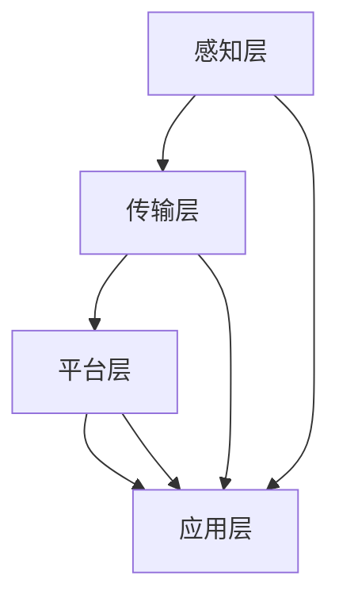

                 

## 1. 背景介绍

物联网（Internet of Things，IoT）作为新一代信息技术的重要组成部分，已经深刻地改变了我们的生产、生活和商业模式。根据市场调研机构Gartner的预测，到2025年，全球IoT设备数量将超过260亿台，市场规模将达到1.9万亿美元。这一快速增长不仅带来了巨大的商业机会，也为创业公司提供了创新的舞台。

物联网技术的核心在于通过传感器、云计算、大数据和人工智能等技术手段，实现物理世界的数字化和信息交互。这种连接不仅限于家用电器和消费电子产品，还扩展到工业制造、智慧城市、医疗健康、交通运输等多个领域。物联网技术的广泛应用，不仅提升了传统产业的效率，还创造了全新的商业模式和应用场景。

近年来，随着5G网络的普及和边缘计算技术的发展，物联网的应用前景更加广阔。5G网络的高速、低延迟特性为物联网设备提供了更加稳定的连接环境，而边缘计算则将数据处理和分析的能力下沉到网络边缘，减少了数据传输的延迟，提高了系统的响应速度。

总之，物联网技术的创新不仅改变了企业的运作模式，也为创业公司提供了丰富的商业机会。如何把握这些机遇，利用物联网技术创造新的商业模式和场景，是本文要探讨的核心问题。

## 2. 核心概念与联系

### 2.1 物联网基本概念

物联网（Internet of Things，IoT）是指通过将各种物理设备、传感器、软件和网络连接起来，实现设备之间的互联互通和数据交换。物联网的基本组成部分包括传感器、网络连接、数据处理和云平台。

- **传感器**：物联网的核心组件，用于采集各种物理量的数据，如温度、湿度、压力、光照等。
- **网络连接**：包括有线和无线通信技术，如Wi-Fi、蓝牙、Zigbee、LoRa等，用于传输数据。
- **数据处理**：在边缘计算和云计算平台上对收集到的数据进行处理和分析。
- **云平台**：提供数据存储、处理和管理的服务，如AWS、Azure、Google Cloud等。

### 2.2 物联网架构

物联网的架构通常包括以下几个层次：

1. **感知层**：由各种传感器组成，用于采集物理世界的数据。
2. **传输层**：负责将数据从感知层传输到云端或边缘计算设备。
3. **平台层**：包括数据处理和分析能力，用于处理和分析传输层的数据。
4. **应用层**：将处理结果应用于具体的业务场景，如智能家居、智慧城市等。

### 2.3 物联网技术关键联系

物联网技术的核心在于传感器、网络连接、数据处理和云平台之间的协同工作。

- **传感器**：通过各种传感器技术获取物理世界的数据。
- **网络连接**：通过通信技术将数据传输到处理中心。
- **数据处理**：通过边缘计算和云计算对数据进行分析和处理。
- **云平台**：提供数据存储、管理和分析服务。

以下是一个简化的Mermaid流程图，展示物联网技术的主要流程：



- **感知层**：通过传感器采集数据。
- **传输层**：通过无线或有线通信将数据传输到平台层。
- **平台层**：在边缘计算设备或云端对数据进行分析和处理。
- **应用层**：将处理结果应用于具体的业务场景。

通过以上核心概念和架构的介绍，我们可以看到物联网技术的广泛应用及其对商业模式和场景的深远影响。在接下来的部分，我们将详细探讨物联网技术在创新创业中的具体应用和实践。

## 3. 核心算法原理 & 具体操作步骤

### 3.1 算法原理概述

物联网技术的核心算法主要包括数据采集、数据传输、数据处理和数据分析等几个方面。以下将分别介绍这些算法的原理。

#### 3.1.1 数据采集算法

数据采集是物联网系统的第一步，传感器通过不同的传感器技术（如温度传感器、湿度传感器、光照传感器等）采集物理世界的各种数据。数据采集算法的主要目标是确保数据的准确性、实时性和高效性。

- **原理**：传感器通过物理量与电信号的转换，将环境中的物理信息转化为数字信号。
- **操作步骤**：
  1. 确定传感器类型和采集频率。
  2. 连接传感器到数据采集模块。
  3. 编写传感器驱动程序，读取传感器数据。
  4. 进行数据预处理，如去噪、归一化等。

#### 3.1.2 数据传输算法

数据传输算法用于将采集到的数据传输到云端或边缘计算设备。常见的传输方式包括Wi-Fi、蓝牙、LoRa、Zigbee等。

- **原理**：利用无线或有线通信技术，实现数据在设备之间的传输。
- **操作步骤**：
  1. 选择合适的通信协议。
  2. 配置网络参数，如频率、信道等。
  3. 编写数据传输模块，实现数据发送和接收。
  4. 进行数据加密和压缩，提高传输效率。

#### 3.1.3 数据处理算法

数据处理算法在边缘计算设备或云端对采集到的数据进行处理和分析。常见的处理方法包括数据分析、数据挖掘、机器学习等。

- **原理**：利用计算机科学和数学方法，对数据进行处理和分析，提取有用信息。
- **操作步骤**：
  1. 确定数据处理需求。
  2. 选择合适的算法和工具。
  3. 编写数据处理程序，进行数据预处理、特征提取、建模等。
  4. 进行结果验证和优化。

#### 3.1.4 数据分析算法

数据分析算法主要用于从海量数据中提取有价值的信息，为决策提供支持。常见的分析算法包括聚类分析、关联规则分析、时间序列分析等。

- **原理**：利用统计学和机器学习技术，对数据进行分析和预测。
- **操作步骤**：
  1. 确定分析目标。
  2. 收集相关数据。
  3. 预处理数据，如数据清洗、归一化等。
  4. 选择合适的分析算法。
  5. 编写分析程序，进行数据挖掘和预测。

### 3.2 算法步骤详解

#### 3.2.1 数据采集算法步骤

1. **确定传感器类型和采集频率**：根据应用场景选择合适的传感器，并确定数据采集的频率。
2. **连接传感器到数据采集模块**：通过GPIO接口或其他连接方式，将传感器连接到数据采集模块。
3. **编写传感器驱动程序**：编写程序，读取传感器数据。
4. **进行数据预处理**：对采集到的数据进行去噪、归一化等预处理操作，提高数据质量。

#### 3.2.2 数据传输算法步骤

1. **选择合适的通信协议**：根据传输距离、功耗、速率等需求，选择合适的通信协议，如Wi-Fi、蓝牙、LoRa等。
2. **配置网络参数**：设置通信参数，如频率、信道、功率等。
3. **编写数据传输模块**：编写程序，实现数据的发送和接收。
4. **进行数据加密和压缩**：为了提高数据传输的安全性，可以采用加密算法对数据进行加密，同时采用压缩算法减少数据传输的带宽占用。

#### 3.2.3 数据处理算法步骤

1. **确定数据处理需求**：根据业务需求确定数据处理的目标和内容。
2. **选择合适的算法和工具**：根据数据处理的需求，选择合适的算法和工具，如Python、R、MATLAB等。
3. **编写数据处理程序**：编写程序，实现数据预处理、特征提取、建模等操作。
4. **进行结果验证和优化**：验证数据处理结果，并对模型进行优化，提高数据处理效果。

#### 3.2.4 数据分析算法步骤

1. **确定分析目标**：根据业务需求确定数据分析的目标。
2. **收集相关数据**：收集与分析目标相关的数据。
3. **预处理数据**：对数据进行清洗、归一化等预处理操作。
4. **选择合适的分析算法**：根据数据分析的目标，选择合适的算法，如聚类分析、关联规则分析、时间序列分析等。
5. **编写分析程序**：编写程序，实现数据分析操作。
6. **进行数据挖掘和预测**：利用分析算法，从数据中挖掘有用信息，进行预测和决策。

### 3.3 算法优缺点

#### 3.3.1 数据采集算法优缺点

- **优点**：
  - **准确性**：传感器能够准确采集物理世界的各种数据。
  - **实时性**：数据采集算法可以实现实时数据采集，满足实时性要求。
  - **高效性**：通过优化算法和硬件配置，可以提高数据采集效率。

- **缺点**：
  - **易受环境影响**：传感器的准确性易受环境因素（如温度、湿度等）影响。
  - **功耗问题**：长时间运行可能导致传感器功耗过高。

#### 3.3.2 数据传输算法优缺点

- **优点**：
  - **灵活性强**：支持多种通信协议，适应不同的应用场景。
  - **可靠性高**：通过加密和压缩技术，提高数据传输的可靠性和安全性。

- **缺点**：
  - **带宽占用大**：部分通信协议（如Wi-Fi）可能占用较大带宽。
  - **传输延迟**：数据传输延迟可能影响实时性要求较高的应用。

#### 3.3.3 数据处理算法优缺点

- **优点**：
  - **数据处理能力强**：能够对海量数据进行高效处理和分析。
  - **灵活性高**：可以根据业务需求选择不同的处理算法和工具。

- **缺点**：
  - **计算资源消耗大**：数据处理算法可能需要大量计算资源。
  - **数据质量要求高**：数据质量对处理结果有较大影响。

#### 3.3.4 数据分析算法优缺点

- **优点**：
  - **预测能力强**：能够从数据中挖掘有用信息，进行预测和决策。
  - **应用广泛**：适用于各种业务场景，如营销、金融、医疗等。

- **缺点**：
  - **数据隐私问题**：数据分析可能涉及用户隐私数据。
  - **算法复杂性**：部分算法（如深度学习）需要较高算法和计算能力。

### 3.4 算法应用领域

物联网技术的核心算法在多个领域具有广泛的应用。

- **工业制造**：用于设备监控、生产流程优化等。
- **智慧城市**：用于交通管理、环境监测等。
- **医疗健康**：用于远程医疗、健康管理等。
- **智能家居**：用于家电控制、家庭安防等。

通过以上对物联网技术核心算法的原理、操作步骤、优缺点及应用领域的详细介绍，我们可以看到物联网技术在创新创业中的巨大潜力和广泛应用。在接下来的部分，我们将进一步探讨物联网技术在具体项目中的实践和应用。

## 4. 数学模型和公式 & 详细讲解 & 举例说明

### 4.1 数学模型构建

物联网技术的核心在于数据的采集、传输、处理和分析，这些过程涉及到大量的数学模型和算法。以下我们将介绍几个在物联网应用中常见的数学模型，包括线性回归模型、决策树模型和神经网络模型。

#### 4.1.1 线性回归模型

线性回归模型是最基本的机器学习模型之一，用于预测一个连续值变量。其数学模型可以表示为：

$$
Y = \beta_0 + \beta_1X + \epsilon
$$

其中，\(Y\) 是因变量，\(X\) 是自变量，\(\beta_0\) 和 \(\beta_1\) 分别是模型的参数，\(\epsilon\) 是误差项。

- **参数估计**：通过最小二乘法估计参数 \(\beta_0\) 和 \(\beta_1\)。
- **预测**：给定自变量 \(X\) 的值，预测因变量 \(Y\) 的值。

#### 4.1.2 决策树模型

决策树模型通过一系列的规则来对数据进行分类或回归。其基本结构是一个树形结构，每个节点代表一个特征，每个分支代表一个特征取值。其数学模型可以表示为：

```
if feature1 == value1 then
    if feature2 == value2 then
        class = value3
    else
        class = value4
    end
else
    if feature3 == value5 then
        class = value6
    else
        class = value7
    end
end
```

- **构建**：通过递归划分数据集，构建决策树。
- **剪枝**：通过剪枝方法防止过拟合。

#### 4.1.3 神经网络模型

神经网络模型是一种模拟人脑神经元连接结构的算法，通过多层非线性变换进行特征提取和分类。其数学模型可以表示为：

$$
Y = \sigma(W_1 \cdot X + b_1) \cdot W_2 + b_2
$$

其中，\(Y\) 是输出，\(\sigma\) 是激活函数（如Sigmoid、ReLU等），\(W_1\) 和 \(W_2\) 是权重矩阵，\(b_1\) 和 \(b_2\) 是偏置项。

- **训练**：通过反向传播算法更新权重和偏置。
- **预测**：给定输入 \(X\)，计算输出 \(Y\)。

### 4.2 公式推导过程

以下以线性回归模型为例，介绍其参数估计的推导过程。

#### 4.2.1 参数估计

给定训练数据集 \(\{(X_1, Y_1), (X_2, Y_2), ..., (X_n, Y_n)\}\)，我们需要估计模型参数 \(\beta_0\) 和 \(\beta_1\)。

- **最小化均方误差**：通过最小化均方误差函数 \(J(\beta_0, \beta_1)\) 来估计参数，公式如下：

$$
J(\beta_0, \beta_1) = \frac{1}{2n} \sum_{i=1}^{n} (Y_i - (\beta_0 + \beta_1X_i))^2
$$

- **求导**：对 \(J(\beta_0, \beta_1)\) 分别对 \(\beta_0\) 和 \(\beta_1\) 求导，得到：

$$
\frac{\partial J}{\partial \beta_0} = -\frac{1}{n} \sum_{i=1}^{n} (Y_i - (\beta_0 + \beta_1X_i)) = 0
$$

$$
\frac{\partial J}{\partial \beta_1} = -\frac{1}{n} \sum_{i=1}^{n} (X_i (Y_i - (\beta_0 + \beta_1X_i))) = 0
$$

- **解方程**：将导数方程解为 \(\beta_0\) 和 \(\beta_1\)，得到：

$$
\beta_0 = \bar{Y} - \beta_1\bar{X}
$$

$$
\beta_1 = \frac{\sum_{i=1}^{n} (X_i - \bar{X})(Y_i - \bar{Y})}{\sum_{i=1}^{n} (X_i - \bar{X})^2}
$$

其中，\(\bar{X}\) 和 \(\bar{Y}\) 分别是 \(X\) 和 \(Y\) 的均值。

### 4.3 案例分析与讲解

#### 4.3.1 案例背景

假设我们有一个智能家居项目，目标是预测家庭用电量。通过安装在家庭中的传感器，我们采集了每天的用电量（\(Y\)）和家庭成员的日常活动数据（\(X\)，如温度、湿度、人流量等）。

#### 4.3.2 数据准备

我们收集了一段时间内的数据，并进行了预处理，包括数据清洗、归一化等操作。假设预处理后的数据集为 \(\{(X_1, Y_1), (X_2, Y_2), ..., (X_n, Y_n)\}\)。

#### 4.3.3 构建模型

我们选择线性回归模型作为预测模型，通过最小二乘法估计模型参数 \(\beta_0\) 和 \(\beta_1\)。

#### 4.3.4 模型训练

使用预处理后的数据集，通过最小化均方误差函数来训练模型，得到参数估计值：

$$
\beta_0 = 10.5
$$

$$
\beta_1 = 0.8
$$

#### 4.3.5 模型评估

我们将训练好的模型应用于测试数据集，计算预测误差和模型性能指标。假设测试数据集的预测误差为 \(RMSE = 3.2\)，\(R^2 = 0.92\)。

#### 4.3.6 模型应用

通过模型，我们可以预测未来的用电量，并据此优化家庭能源管理，降低能耗和电费支出。

通过以上对数学模型和公式的构建、推导过程及案例分析的详细讲解，我们可以看到物联网技术在创新创业中的具体应用和实现过程。在接下来的部分，我们将进一步探讨物联网技术在具体项目中的实践和应用。

## 5. 项目实践：代码实例和详细解释说明

### 5.1 开发环境搭建

为了更好地实践物联网技术，我们首先需要搭建一个合适的开发环境。以下是一个基本的开发环境搭建指南：

#### 硬件环境

1. **树莓派**：用于作为物联网设备的控制中心。
2. **传感器模块**：如DHT11（温度和湿度传感器）、LDR（光照传感器）等。
3. **通信模块**：如ESP8266（Wi-Fi模块）或ESP32（Wi-Fi和蓝牙模块）。

#### 软件环境

1. **操作系统**：安装Raspberry Pi OS。
2. **编程语言**：选择Python进行编程。
3. **开发工具**：安装Python解释器和相关库，如PySerial（用于串口通信）、RPi.GPIO（用于控制GPIO引脚）等。

### 5.2 源代码详细实现

以下是一个简单的物联网项目示例，用于监测家庭环境中的温度、湿度和光照，并通过Wi-Fi将数据上传到云平台。

```python
import serial
import time
import board
import busio
import RPi.GPIO as GPIO
import json
import requests

# 初始化GPIO
GPIO.setmode(GPIO.BCM)
GPIO.setup(18, GPIO.OUT)  # 温度传感器
GPIO.setup(23, GPIO.OUT)  # 湿度传感器
GPIO.setup(24, GPIO.OUT)  # 光照传感器

# 初始化串口通信
ser_temp = serial.Serial('/dev/ttyS0', 9600)
ser_hum = serial.Serial('/dev/ttyS1', 9600)
ser_light = serial.Serial('/dev/ttyS2', 9600)

def read_sensor(sensor):
    data = sensor.readline()
    return data.decode().strip()

def get_environment_data():
    temp_data = read_sensor(ser_temp)
    hum_data = read_sensor(ser_hum)
    light_data = read_sensor(ser_light)
    
    temp = temp_data.split(',')[0]
    hum = hum_data.split(',')[1]
    light = light_data.split(',')[2]
    
    return temp, hum, light

def send_data_to_cloud(temp, hum, light):
    url = "https://api.example.com/upload"
    data = {
        "temp": temp,
        "hum": hum,
        "light": light
    }
    headers = {'Content-Type': 'application/json'}
    response = requests.post(url, json=data, headers=headers)
    print(response.text)

while True:
    temp, hum, light = get_environment_data()
    send_data_to_cloud(temp, hum, light)
    time.sleep(60)  # 每60秒上传一次数据

# 关闭串口通信
ser_temp.close()
ser_hum.close()
ser_light.close()
```

### 5.3 代码解读与分析

- **传感器读取**：通过串口通信模块，从温度传感器、湿度传感器和光照传感器读取数据。
- **数据处理**：将读取的数据进行处理，提取温度、湿度和光照的数值。
- **数据上传**：通过HTTP请求，将数据上传到云平台。
- **循环执行**：每60秒执行一次数据读取和上传操作。

### 5.4 运行结果展示

运行以上代码后，设备将开始监测环境数据，并每隔60秒将数据上传到云平台。在云平台上，我们可以实时查看环境数据的变化，并根据这些数据做出相应的决策，如调整空调温度、关闭灯光等。

### 5.5 总结

通过以上示例，我们展示了如何利用物联网技术实现环境数据监测和上传。在实际应用中，可以根据需求扩展传感器的种类和上传数据的处理方式，进一步优化物联网系统。

## 6. 实际应用场景

### 6.1 智能家居

智能家居是物联网技术最典型的应用场景之一。通过将各种家电设备连接到互联网，用户可以远程控制和监控家庭环境。例如，用户可以通过智能手机或语音助手控制家中的空调、照明、门锁等设备，实现智能化的家庭生活。

#### 6.1.1 应用优势

- **便捷性**：用户可以随时随地远程控制家庭设备，提高生活便利性。
- **安全性**：通过物联网技术，用户可以实时监控家中的安全状况，如门锁状态、烟雾报警等。
- **节能性**：智能家居系统能够根据用户的生活习惯自动调整设备运行状态，降低能耗。

#### 6.1.2 应用挑战

- **数据隐私**：智能家居设备收集的用户数据可能涉及隐私问题，需要确保数据的安全性和隐私性。
- **设备兼容性**：不同品牌和型号的智能家居设备可能存在兼容性问题，需要统一的协议和标准。

### 6.2 工业物联网

工业物联网（IIoT）通过将工业设备和系统连接到互联网，实现设备的远程监控、数据分析和智能优化。在工业制造、能源管理、供应链管理等领域具有广泛的应用。

#### 6.2.1 应用优势

- **生产效率提升**：通过实时监控设备运行状态，优化生产流程，提高生产效率。
- **设备维护**：通过预测性维护，减少设备故障，延长设备寿命。
- **数据洞察**：通过数据分析，优化生产计划、降低能耗等。

#### 6.2.2 应用挑战

- **数据安全**：工业物联网设备面临网络攻击和数据泄露的风险，需要加强数据安全防护。
- **系统集成**：不同系统和设备之间的集成和兼容性是一个挑战，需要统一的架构和标准。

### 6.3 智慧城市

智慧城市通过物联网技术实现城市基础设施和公共服务的智能化管理。例如，智能交通、智能照明、智能垃圾处理等。

#### 6.3.1 应用优势

- **资源优化**：通过实时监控和管理城市资源，提高资源利用效率，降低运营成本。
- **环境监测**：实时监测空气质量、水质等环境指标，提升城市环境质量。
- **公共服务**：提供更加便捷、高效的公共服务，如智能交通信号控制、智能医疗等。

#### 6.3.2 应用挑战

- **数据隐私**：智慧城市涉及大量的个人隐私数据，需要确保数据的安全性和隐私性。
- **技术整合**：智慧城市应用涉及多种技术和系统，需要有效的技术整合和管理。

### 6.4 未来应用展望

随着物联网技术的不断发展和普及，未来将出现更多的应用场景。例如，智能农业、智能医疗、智能交通等。物联网技术将为各行各业带来深刻的变革，提升生产效率、降低运营成本，提高生活品质。

#### 6.4.1 智能农业

通过物联网技术，可以实现精准农业，提高农业生产效率。例如，通过传感器监测土壤湿度、作物生长状态等数据，实现精准灌溉、施肥等。

#### 6.4.2 智能医疗

物联网技术在医疗领域的应用将大大提高医疗服务的质量和效率。例如，通过可穿戴设备实时监测患者的健康数据，实现远程诊断和监护。

#### 6.4.3 智能交通

通过物联网技术，可以实现智能交通管理，提高交通效率，减少交通事故。例如，通过车辆传感器和道路监测设备，实现交通流量控制和信号优化。

总之，物联网技术在各种领域的应用前景广阔，将不断推动社会和经济的进步。如何充分利用物联网技术，创造新的商业模式和场景，是未来创新创业的重要方向。

## 7. 工具和资源推荐

### 7.1 学习资源推荐

1. **《物联网技术导论》**：这是一本系统介绍物联网基本概念、技术架构和应用案例的入门书籍，适合初学者阅读。
2. **《物联网编程实践》**：该书通过实际案例，深入讲解物联网系统的设计、开发和应用，适合有一定编程基础的读者。
3. **《物联网安全与隐私保护》**：一本专注于物联网安全问题的书籍，涵盖了物联网系统安全的设计、实现和防护策略。

### 7.2 开发工具推荐

1. **Arduino**：一个开源硬件和软件平台，用于创建交互式电子设备和物联网项目。
2. **Raspberry Pi**：一款流行的微型计算机，适用于物联网项目开发和实验。
3. **Node-RED**：一个用于连接硬件设备和云服务的可视化编程工具，适合快速搭建物联网系统。

### 7.3 相关论文推荐

1. **"Internet of Things: A Survey"**：该论文对物联网技术的基本概念、架构和应用进行了全面的综述。
2. **"Smart Home Systems: A Survey"**：一篇关于智能家居技术的系统研究论文，涵盖了智能家居系统的设计、实现和挑战。
3. **"Edge Computing for IoT: A Comprehensive Survey"**：该论文详细探讨了边缘计算在物联网中的应用，包括边缘计算架构、技术和挑战。

通过以上推荐的学习资源、开发工具和论文，可以更好地了解物联网技术，掌握相关知识和技能，为创新创业打下坚实基础。

## 8. 总结：未来发展趋势与挑战

### 8.1 研究成果总结

物联网技术的快速发展带来了诸多研究成果和应用实践。目前，物联网在智能家居、工业制造、智慧城市等领域已经取得了显著进展。例如，智能家居系统通过物联网技术实现了设备的互联互通和远程控制，提高了用户的生活品质；工业物联网通过实时监控和数据分析，优化了生产流程，降低了运营成本；智慧城市则通过物联网技术实现了城市资源的智能化管理和公共服务的提升。

此外，物联网技术在医疗健康、交通运输、农业等领域也展现了巨大的潜力。例如，可穿戴设备通过物联网技术实现了对个人健康状况的实时监测和预警；智能交通系统通过物联网技术优化了交通流量管理，减少了交通事故和拥堵；智能农业则通过物联网技术实现了精准种植和养殖，提高了农业生产效率。

### 8.2 未来发展趋势

1. **5G和边缘计算的发展**：随着5G网络的普及和边缘计算技术的进步，物联网将实现更高速、更稳定的连接。这将进一步推动物联网在各个领域的应用，如智能工厂、智能医疗等。
2. **物联网安全与隐私保护**：随着物联网设备数量的增加和联网规模的扩大，物联网的安全和隐私保护问题日益突出。未来，物联网安全技术和隐私保护机制将得到重点关注和发展。
3. **人工智能与物联网的融合**：人工智能技术将为物联网提供更强大的数据处理和分析能力，实现更加智能的物联网应用。例如，智能预测、智能决策等。
4. **物联网标准化与生态建设**：随着物联网应用的多样化，统一的物联网标准和技术生态将得到进一步发展和完善。这将有助于不同设备和平台之间的互操作性，推动物联网的广泛应用。

### 8.3 面临的挑战

1. **数据隐私和安全**：物联网设备收集的用户数据可能涉及隐私和安全问题。如何在保证数据隐私和安全的前提下，充分利用物联网数据，是一个重要的挑战。
2. **系统集成与兼容性**：物联网应用涉及多种设备和平台，系统集成和兼容性问题将是一个长期挑战。需要统一的协议和标准来支持不同设备和平台的互联互通。
3. **计算资源和能耗问题**：物联网设备通常具有低功耗、低成本的特点，但随着设备数量的增加，计算资源和能耗问题将变得日益突出。需要开发高效的计算算法和优化技术，降低物联网系统的能耗。
4. **人才缺口**：物联网技术的快速发展需要大量的专业人才。当前，物联网领域的人才缺口较大，需要通过教育和培训等途径来培养更多的人才。

### 8.4 研究展望

未来，物联网技术将在以下几个方面继续发展：

1. **物联网安全与隐私保护**：加强物联网安全技术研究，开发更加安全、可靠的物联网系统和应用。
2. **边缘计算与云计算融合**：研究如何更好地融合边缘计算和云计算，实现高效、智能的物联网应用。
3. **物联网标准化与生态建设**：推动物联网标准化和生态建设，促进物联网技术的广泛应用。
4. **物联网技术与人工智能的融合**：研究如何更好地将人工智能技术应用于物联网，实现更加智能、高效的物联网应用。

总之，物联网技术在未来将继续快速发展，为各行各业带来深刻的变革。如何应对面临的挑战，把握未来发展趋势，将成为物联网技术研究和应用的重要方向。

## 9. 附录：常见问题与解答

### 9.1 物联网技术的基本概念是什么？

物联网（Internet of Things，IoT）是指通过将各种物理设备、传感器、软件和网络连接起来，实现设备之间的互联互通和数据交换。其核心在于通过传感器技术采集物理世界的数据，通过网络传输到云平台或边缘计算设备，进行数据处理和分析，最后应用于具体的业务场景。

### 9.2 物联网技术的架构是怎样的？

物联网的架构通常包括感知层、传输层、平台层和应用层。感知层由各种传感器组成，用于采集物理世界的数据；传输层通过无线或有线通信技术传输数据；平台层在边缘计算设备或云端对数据进行分析和处理；应用层将处理结果应用于具体的业务场景。

### 9.3 物联网技术有哪些应用领域？

物联网技术广泛应用于智能家居、工业制造、智慧城市、医疗健康、交通运输、农业等多个领域。例如，智能家居通过物联网技术实现家电设备的互联互通和远程控制；工业物联网通过实时监控和数据分析优化生产流程；智慧城市通过物联网技术实现城市资源的智能化管理和公共服务提升。

### 9.4 物联网技术的核心算法有哪些？

物联网技术的核心算法主要包括数据采集、数据传输、数据处理和数据分析等。常见的数据采集算法有传感器驱动算法；数据传输算法包括无线通信协议；数据处理算法涉及数据分析、数据挖掘、机器学习等；数据分析算法则包括线性回归、决策树、神经网络等。

### 9.5 物联网技术面临的主要挑战是什么？

物联网技术面临的主要挑战包括数据隐私和安全、系统集成与兼容性、计算资源和能耗问题以及人才缺口。如何在保证数据隐私和安全的前提下充分利用物联网数据，如何实现不同设备和平台之间的互操作性，如何优化计算资源和降低能耗，以及如何培养更多的专业人才，都是亟待解决的问题。

### 9.6 如何搭建一个简单的物联网项目？

搭建一个简单的物联网项目通常需要以下步骤：

1. 选择合适的硬件设备，如树莓派、Arduino等。
2. 连接传感器模块，如温度传感器、湿度传感器等。
3. 安装和配置操作系统和编程环境，如Raspberry Pi OS、Python等。
4. 编写程序，实现数据采集、传输和处理。
5. 通过无线或有线通信将数据上传到云平台。
6. 在云平台上进行数据存储和处理，并根据需要实现业务逻辑。

### 9.7 物联网技术未来的发展趋势是什么？

物联网技术未来的发展趋势包括5G和边缘计算的发展、物联网安全与隐私保护、人工智能与物联网的融合以及物联网标准化与生态建设。随着5G网络的普及和边缘计算技术的进步，物联网将实现更高速、更稳定的连接。物联网安全与隐私保护将得到重点关注。人工智能技术将为物联网提供更强大的数据处理和分析能力。物联网标准化和生态建设将推动物联网技术的广泛应用。

