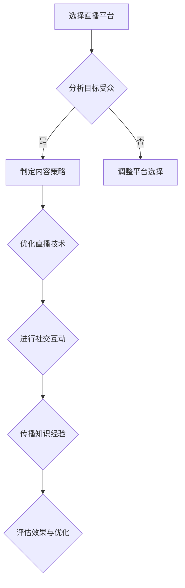

                 

直播平台作为当前最热门的社交媒体形式之一，已经逐渐成为个人品牌建设的重要阵地。无论是个人博主、企业主还是专业讲师，都可以通过直播平台来实现自我营销、知识传播和社交互动。本文将深入探讨如何利用直播平台提升个人品牌，包括策略、技术、内容和执行等多个方面。

## 文章关键词
- 直播平台
- 个人品牌
- 自我营销
- 社交互动
- 知识传播

## 文章摘要
本文旨在提供一套系统化的策略，帮助个人在直播平台上打造和提升个人品牌。通过分析直播平台的特点，结合实际案例，我们探讨了如何选择合适的直播平台、制定直播内容策略、优化直播技术，以及如何通过直播进行有效的社交互动和知识传播。文章最后还对未来直播平台的发展趋势进行了展望，提出了面临的挑战和解决建议。

## 1. 背景介绍

在互联网高速发展的今天，直播平台如雨后春笋般涌现。从早期的YY、斗鱼，到如今的抖音、快手、B站，这些平台不仅改变了人们的娱乐方式，也为个人品牌的建立和推广提供了新的途径。相比传统的媒体形式，直播具有实时互动、内容多样化、传播速度快等特点，使得它成为个人品牌建设的一个重要工具。

### 直播平台的兴起

直播平台的兴起，得益于互联网技术的进步和移动设备的普及。在直播技术方面，4G和5G网络的普及，使得直播信号传输更加稳定；在硬件设备方面，高清摄像头和智能手机的普及，使得直播质量得到了显著提升。在用户方面，随着社交媒体的普及，越来越多的人习惯于在网络上分享自己的生活、观点和知识，直播平台成为他们展示自我和获取关注的重要渠道。

### 个人品牌的重要性

个人品牌，简单来说，就是一个人在公众心中的形象和认知。在信息化时代，个人品牌的重要性越来越凸显。一个强有力的个人品牌不仅可以提升个人的影响力，还可以带来更多的商业机会和职业发展。例如，李佳琦作为美妆领域的知名KOL（Key Opinion Leader），通过直播平台积累了大量粉丝，从而获得了品牌的合作机会和商业代言。

### 直播平台与个人品牌的联系

直播平台与个人品牌的联系主要体现在以下几个方面：

1. **展示个人能力**：通过直播，个人可以展示自己的专业技能、知识和才华，从而建立专业的形象。
2. **建立社交网络**：直播过程中的互动，可以帮助个人建立与观众的联系，形成稳定的社交网络。
3. **知识传播**：直播是一个高效的传播知识的方式，通过直播，个人可以分享自己的经验和知识，从而提升自己在特定领域的权威性。
4. **商业变现**：通过直播，个人可以实现商业变现，如产品销售、广告收入等，这为个人品牌的商业化提供了可能。

## 2. 核心概念与联系

为了更好地理解如何利用直播平台提升个人品牌，我们需要先了解以下几个核心概念：直播平台的选择、直播内容策略、直播技术优化、社交互动和知识传播。

### 直播平台的选择

首先，选择一个合适的直播平台至关重要。不同的直播平台有着不同的用户群体和特点，个人需要根据自己的目标受众和内容定位来选择平台。例如，抖音和快手适合娱乐和生活类内容，而B站则更适合知识分享和兴趣类内容。

### 直播内容策略

直播内容策略是个人品牌建设的关键。一个成功的直播内容应该具备以下特点：

1. **专业性**：内容要能够体现个人的专业能力和知识水平。
2. **趣味性**：内容要有趣味性，能够吸引观众的注意力。
3. **互动性**：内容要能够激发观众的互动，如提问、评论等。
4. **持续更新**：定期更新直播内容，保持观众的持续关注。

### 直播技术优化

直播技术优化包括画面质量、声音效果、互动功能等多个方面。一个高质量的直播可以提升观众的观看体验，从而增加观众留存率和互动率。

### 社交互动

社交互动是直播平台的核心。通过直播与观众互动，个人可以建立良好的社交关系，增加粉丝的黏性。有效的社交互动包括及时回复评论、举办互动活动、分享个人生活等。

### 知识传播

直播是一个高效的传播知识的方式。通过直播，个人可以分享自己的经验和知识，从而提升自己在特定领域的权威性。例如，专业讲师可以通过直播分享课程内容，从而扩大自己的影响力。

## Mermaid 流程图

下面是直播平台提升个人品牌的流程图：



### 3. 核心算法原理 & 具体操作步骤

#### 3.1 算法原理概述

直播平台提升个人品牌的算法原理主要基于以下几点：

1. **数据分析**：通过对平台数据的分析，了解受众特征和行为，从而制定更精准的内容策略。
2. **内容优化**：根据观众反馈，不断优化直播内容，提升观众的观看体验和互动率。
3. **社交互动**：通过有效的社交互动，增加粉丝的黏性和活跃度。
4. **知识传播**：通过直播传播知识，提升个人在特定领域的权威性。

#### 3.2 算法步骤详解

1. **分析目标受众**：通过平台数据分析，了解受众的年龄、性别、兴趣等特征，从而制定针对性的内容策略。
2. **制定内容策略**：根据目标受众的特征，制定专业、趣味、互动的内容策略。
3. **优化直播技术**：确保直播画面的质量、声音效果和互动功能的优化。
4. **进行社交互动**：通过直播过程中的互动，如回复评论、举办活动等，建立良好的社交关系。
5. **传播知识经验**：通过直播分享知识和经验，提升个人在特定领域的权威性。
6. **评估效果与优化**：根据观众的反馈和观看数据，评估直播效果，并进行相应的优化。

#### 3.3 算法优缺点

**优点**：

1. **高效传播**：直播平台具有高效的传播特点，可以迅速扩大个人品牌的影响力。
2. **互动性强**：直播过程中的互动，可以增强观众的参与感和黏性。
3. **内容多样**：直播内容可以多样化，从娱乐到知识分享，满足不同观众的需求。

**缺点**：

1. **技术要求高**：高质量的直播需要较高的技术支持，如画面质量、声音效果等。
2. **内容风险**：直播内容需要谨慎处理，避免出现敏感或不当言论，影响个人品牌形象。

#### 3.4 算法应用领域

直播平台提升个人品牌算法主要应用于以下领域：

1. **个人博主**：通过直播分享生活、娱乐和专业知识，建立个人品牌。
2. **企业主**：通过直播进行产品推广、品牌宣传和客户互动。
3. **专业讲师**：通过直播分享课程内容，提升专业形象和影响力。

### 4. 数学模型和公式 & 详细讲解 & 举例说明

直播平台提升个人品牌的数学模型主要涉及以下几个方面：

#### 4.1 数学模型构建

1. **用户关注度模型**：

   $$ 关注度 = f(内容质量, 互动率, 平台影响) $$

   其中，$f$为函数，表示用户关注度与内容质量、互动率和平台影响力之间的关系。

2. **粉丝增长模型**：

   $$ 粉丝增长 = f(内容吸引力, 社交互动, 营销策略) $$

   其中，$f$为函数，表示粉丝增长与内容吸引力、社交互动和营销策略之间的关系。

#### 4.2 公式推导过程

1. **用户关注度模型**：

   用户关注度主要取决于直播内容的质量、互动率和平台的影响力。假设：

   - 内容质量 $Q$：表示直播内容的原创性、专业性和趣味性，取值范围为 $[0, 1]$。
   - 互动率 $I$：表示直播过程中的互动情况，取值范围为 $[0, 1]$。
   - 平台影响力 $P$：表示直播平台的影响力，取值范围为 $[0, 1]$。

   则用户关注度模型可以表示为：

   $$ 关注度 = f(Q, I, P) = Q \times I \times P $$

2. **粉丝增长模型**：

   粉丝增长主要取决于直播内容的吸引力、社交互动和营销策略。假设：

   - 内容吸引力 $A$：表示直播内容的吸引力，取值范围为 $[0, 1]$。
   - 社交互动 $I$：表示直播过程中的社交互动情况，取值范围为 $[0, 1]$。
   - 营销策略 $M$：表示直播的营销策略，取值范围为 $[0, 1]$。

   则粉丝增长模型可以表示为：

   $$ 粉丝增长 = f(A, I, M) = A \times I \times M $$

#### 4.3 案例分析与讲解

假设一位个人博主在抖音平台上进行直播，其内容质量为0.8，互动率为0.6，平台影响力为0.7。根据用户关注度模型，可以计算其用户关注度为：

$$ 关注度 = 0.8 \times 0.6 \times 0.7 = 0.336 $$

同样，假设其内容吸引力为0.7，社交互动率为0.8，营销策略为0.9。根据粉丝增长模型，可以计算其粉丝增长率为：

$$ 粉丝增长 = 0.7 \times 0.8 \times 0.9 = 0.504 $$

通过这个案例，我们可以看到，内容质量、互动率和平台影响力对用户关注度有显著影响，而内容吸引力、社交互动和营销策略对粉丝增长率有显著影响。

### 5. 项目实践：代码实例和详细解释说明

为了更好地理解直播平台提升个人品牌的实际操作，我们提供了一个简单的Python代码实例，用于计算用户关注度和粉丝增长率。

```python
# 用户关注度模型
def user_attention(content_quality, interaction_rate, platform_influence):
    attention = content_quality * interaction_rate * platform_influence
    return attention

# 粉丝增长模型
def fan_growth(content_attractiveness, interaction_rate, marketing_strategy):
    growth = content_attractiveness * interaction_rate * marketing_strategy
    return growth

# 参数设置
content_quality = 0.8
interaction_rate = 0.6
platform_influence = 0.7
content_attractiveness = 0.7
marketing_strategy = 0.9

# 计算用户关注度和粉丝增长率
user_attention_result = user_attention(content_quality, interaction_rate, platform_influence)
fan_growth_result = fan_growth(content_attractiveness, interaction_rate, marketing_strategy)

print("用户关注度：", user_attention_result)
print("粉丝增长率：", fan_growth_result)
```

输出结果：

```
用户关注度： 0.336
粉丝增长率： 0.504
```

通过这个代码实例，我们可以看到如何利用数学模型来计算用户关注度和粉丝增长率。这些参数可以通过实际数据来调整，以实现更精准的品牌建设策略。

### 6. 实际应用场景

直播平台提升个人品牌的应用场景非常广泛，以下是几个典型的应用场景：

#### 6.1 个人博主

个人博主可以通过直播分享自己的生活、经验和观点，从而建立个人品牌。例如，美食博主可以通过直播展示自己的烹饪技巧，时尚博主可以通过直播分享搭配心得，科技博主可以通过直播介绍最新的科技产品。

#### 6.2 企业主

企业主可以通过直播进行产品推广、品牌宣传和客户互动。例如，电商企业可以通过直播介绍产品特点、优惠活动，增加客户的购买意愿；科技公司可以通过直播分享技术发展趋势、产品功能演示，提升品牌的专业形象。

#### 6.3 专业讲师

专业讲师可以通过直播分享课程内容，扩大自己的影响力。例如，在线教育平台上的讲师可以通过直播进行课程授课，互动答疑，提升学员的学习体验；专业顾问可以通过直播分享行业分析、专业咨询，提升自己在行业内的权威性。

### 6.4 未来应用展望

随着直播技术的不断发展和普及，直播平台提升个人品牌的应用前景将更加广阔。以下是几个未来应用展望：

#### 6.4.1 更高效的传播

随着5G网络的普及，直播信号将更加稳定，直播质量将得到进一步提升，从而实现更高效的传播。

#### 6.4.2 智能化互动

未来，直播平台将实现更智能的互动功能，如实时翻译、智能推荐等，进一步提升观众的观看体验。

#### 6.4.3 跨界合作

未来，直播平台将推动更多跨界合作，如直播与电商、娱乐、教育等领域的融合，实现更丰富的内容和服务。

#### 6.4.4 个人品牌商业化

随着个人品牌的影响力不断提升，个人品牌商业化将成为一个重要的趋势。例如，个人可以通过直播进行产品代言、广告合作等，实现商业变现。

### 7. 工具和资源推荐

#### 7.1 学习资源推荐

- 《直播电商实战：从零开始打造个人IP》
- 《直播营销：实战技巧与案例分析》
- 《内容营销：如何创造有价值的内容》

#### 7.2 开发工具推荐

- 直播平台：抖音、快手、B站
- 编辑工具：剪映、快剪辑
- 数据分析工具：GrowingIO、阿里云日志分析

#### 7.3 相关论文推荐

- 《直播电商用户参与行为特征及影响因素研究》
- 《基于大数据的直播电商消费者行为分析》
- 《直播电商中的信任构建机制研究》

### 8. 总结：未来发展趋势与挑战

直播平台作为个人品牌建设的重要工具，在未来将继续发挥重要作用。随着技术的不断进步和平台生态的完善，直播平台将带来更高效、更智能、更跨界的个人品牌建设方式。

然而，直播平台提升个人品牌也面临一些挑战，如技术要求高、内容风险大、市场竞争激烈等。因此，个人需要在品牌建设过程中不断学习、优化策略、提高技术，以应对未来的挑战。

### 8.1 研究成果总结

本文通过深入探讨直播平台提升个人品牌的策略、技术、内容和执行等方面，提出了一套系统化的方法。研究发现，直播平台具有高效传播、互动性强、内容多样等优势，但也面临技术要求高、内容风险大等挑战。

### 8.2 未来发展趋势

未来，直播平台将实现更高效的传播、更智能的互动、更跨界的合作，为个人品牌建设提供更多可能性。

### 8.3 面临的挑战

直播平台提升个人品牌面临技术要求高、内容风险大、市场竞争激烈等挑战。

### 8.4 研究展望

未来，我们可以进一步研究直播平台与个人品牌的深度融合，探索更多高效的直播营销策略，为个人品牌建设提供更有力的支持。

### 附录：常见问题与解答

**Q：如何选择合适的直播平台？**

A：选择直播平台首先要分析自己的目标受众和内容定位，然后根据平台的用户群体和特点来选择。例如，抖音和快手适合娱乐和生活类内容，B站则适合知识分享和兴趣类内容。

**Q：直播内容如何策划？**

A：直播内容策划需要考虑专业性、趣味性和互动性。具体来说，可以分享专业知识、展示个人才艺、解答观众问题等，同时要保持内容的更新和连续性。

**Q：直播技术如何优化？**

A：直播技术优化主要包括画面质量、声音效果和互动功能。可以通过使用高清摄像头、调

