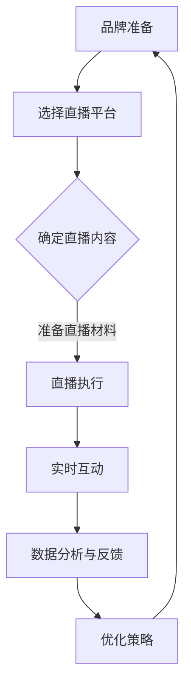

                 

在当今数字化时代，直播电商已经成为品牌营销的重要手段。它不仅提供了一个直观的购物体验，还使得品牌能够与消费者进行实时互动，提高用户的购买意愿。本文将探讨如何利用直播电商这一平台，有效提升品牌销售额。

## 关键词
- 直播电商
- 品牌营销
- 销售提升
- 用户互动
- 消费者行为分析

## 摘要
本文旨在分析直播电商在提升品牌销售额方面的潜力和策略。通过介绍直播电商的基本原理和优势，我们将详细探讨如何通过优化直播内容、利用数据分析和用户互动等手段，实现销售额的显著提升。文章还将提供实际案例，展示成功应用的直播电商策略。

## 1. 背景介绍

### 直播电商的崛起

直播电商，顾名思义，是指通过直播的形式进行商品推广和销售的活动。近年来，随着移动互联网和视频技术的快速发展，直播电商逐渐成为电商领域的一匹“黑马”。根据相关数据显示，2020年中国直播电商市场规模已达到9617亿元，预计到2025年将达到3万亿元。这一数字的增长速度令人瞩目，直播电商已经成为了电商行业的新风口。

### 品牌营销的重要性

在竞争激烈的电商市场中，品牌营销对于提升销售额至关重要。品牌营销不仅仅是为了提升知名度，更是为了建立消费者对品牌的信任和忠诚度。直播电商作为一种创新的营销手段，能够更加直观地展示产品，并通过与消费者的实时互动，增强品牌的亲和力和影响力。

## 2. 核心概念与联系

### 直播电商的基本原理

直播电商的基本原理是通过直播平台，如抖音、快手、B站等，进行产品展示和销售。主播作为桥梁，连接了品牌和消费者，通过实时互动和内容分享，吸引了大量观众并转化为购买者。

### 直播电商与品牌营销的联系

直播电商与品牌营销之间的联系主要体现在以下几个方面：

1. **增强品牌互动**：通过直播，品牌可以直接与消费者互动，解答疑问，提供专业的产品介绍，增强消费者对品牌的信任。
2. **提高购买转化率**：直播的实时性和互动性，使得消费者在观看直播的过程中，更容易产生购买欲望，从而提高购买转化率。
3. **扩大品牌影响力**：直播电商的广泛传播性，使得品牌能够迅速获得大量曝光，提升品牌知名度。
4. **定制化营销策略**：通过分析用户数据，品牌可以制定更加精准的营销策略，提高营销效果。

### Mermaid 流程图

以下是一个简化的直播电商与品牌营销的流程图：



## 3. 核心算法原理 & 具体操作步骤

### 3.1 算法原理概述

直播电商的核心算法主要涉及用户行为分析、数据挖掘和个性化推荐三个方面。

1. **用户行为分析**：通过分析用户的浏览记录、购买历史和互动行为，了解用户偏好和需求。
2. **数据挖掘**：利用大数据技术，挖掘用户行为数据中的潜在模式和规律。
3. **个性化推荐**：根据用户行为数据和挖掘结果，为用户推荐感兴趣的商品和直播内容。

### 3.2 算法步骤详解

1. **数据收集**：收集用户的浏览、购买和互动数据。
2. **数据预处理**：清洗和整合数据，去除噪声和异常值。
3. **特征提取**：从预处理后的数据中提取出有代表性的特征。
4. **模型训练**：利用特征数据训练机器学习模型。
5. **推荐生成**：根据训练好的模型，为用户生成个性化推荐。
6. **推荐反馈**：收集用户对推荐的反馈，优化推荐策略。

### 3.3 算法优缺点

**优点**：

- **精准推荐**：能够根据用户行为和偏好，提供个性化的商品推荐，提高购买转化率。
- **实时更新**：系统可以实时收集和处理用户数据，动态调整推荐策略。
- **提高用户满意度**：通过个性化的推荐，提高用户的购物体验和满意度。

**缺点**：

- **数据隐私问题**：用户行为数据的收集和处理可能涉及隐私问题。
- **算法复杂性**：算法模型的训练和优化过程较为复杂，需要大量的计算资源。

### 3.4 算法应用领域

- **电商直播**：通过个性化推荐，提高直播间的用户留存率和购买率。
- **社交媒体**：为用户提供个性化的内容推荐，增加用户粘性。
- **广告投放**：根据用户行为数据，精准投放广告，提高广告效果。

## 4. 数学模型和公式 & 详细讲解 & 举例说明

### 4.1 数学模型构建

直播电商中的数学模型主要包括用户行为分析模型和推荐算法模型。

1. **用户行为分析模型**：

   假设用户 \( u \) 对商品 \( i \) 的兴趣度可以用向量 \( \mathbf{r}_{ui} \) 表示，其中 \( r_{ui} \) 表示用户 \( u \) 对商品 \( i \) 的兴趣度得分。

   \[
   \mathbf{r}_{ui} = \text{score}(\mathbf{x}_{ui}, \mathbf{w})
   \]

   其中，\( \mathbf{x}_{ui} \) 表示用户 \( u \) 在商品 \( i \) 上的特征向量，\( \mathbf{w} \) 表示权重向量。

2. **推荐算法模型**：

   假设给定用户 \( u \) 的特征向量 \( \mathbf{x}_{u} \)，推荐算法的目的是找到最相似的用户 \( u' \) 的特征向量 \( \mathbf{x}_{u'} \)，并推荐 \( u' \) 喜欢的商品 \( i' \)。

   \[
   \mathbf{x}_{u'} = \arg\max_{\mathbf{x}_{u'}} \text{similarity}(\mathbf{x}_{u}, \mathbf{x}_{u'})
   \]

   其中，\( \text{similarity}(\cdot, \cdot) \) 表示特征向量之间的相似度计算函数。

### 4.2 公式推导过程

1. **用户行为分析模型**：

   假设用户 \( u \) 在商品 \( i \) 上的行为数据包括浏览次数 \( b_{ui} \)，购买次数 \( p_{ui} \)，评价次数 \( e_{ui} \)，以及互动次数 \( i_{ui} \)。

   \[
   \mathbf{x}_{ui} = [b_{ui}, p_{ui}, e_{ui}, i_{ui}]
   \]

   权重向量 \( \mathbf{w} \) 可以通过线性回归模型训练得到：

   \[
   \mathbf{w} = \arg\min_{\mathbf{w}} \sum_{u, i} (r_{ui} - \mathbf{w}^T \mathbf{x}_{ui})^2
   \]

   其中，\( r_{ui} \) 的初始值为0，模型训练过程中会逐步调整。

2. **推荐算法模型**：

   假设给定用户 \( u \) 的特征向量 \( \mathbf{x}_{u} \)，我们需要计算与 \( \mathbf{x}_{u} \) 最相似的用户 \( u' \) 的特征向量 \( \mathbf{x}_{u'} \)。

   相似度计算函数可以采用余弦相似度：

   \[
   \text{similarity}(\mathbf{x}_{u}, \mathbf{x}_{u'}) = \frac{\mathbf{x}_{u}^T \mathbf{x}_{u'}}{\|\mathbf{x}_{u}\|\|\mathbf{x}_{u'}\|}
   \]

   其中，\( \|\mathbf{x}_{u}\| \) 和 \( \|\mathbf{x}_{u'}\| \) 分别表示 \( \mathbf{x}_{u} \) 和 \( \mathbf{x}_{u'} \) 的欧氏范数。

### 4.3 案例分析与讲解

以某电商平台为例，该平台通过用户行为数据，构建了用户行为分析模型和推荐算法模型，实现个性化推荐。

1. **用户行为数据收集**：

   该平台收集了用户在购物过程中的一系列行为数据，包括浏览、购买、评价和互动。

2. **数据预处理**：

   对收集到的数据进行清洗和整合，去除噪声和异常值，提取出有用的特征。

3. **特征提取**：

   根据用户的行为数据，提取出浏览次数、购买次数、评价次数和互动次数等特征。

4. **模型训练**：

   利用训练集数据，训练用户行为分析模型和推荐算法模型。

5. **推荐生成**：

   对于新用户，平台会根据其特征向量，找到最相似的用户，并推荐这些用户喜欢的商品。

6. **推荐反馈**：

   收集用户对推荐的反馈，优化推荐策略。

通过这一系列的步骤，该平台成功实现了个性化推荐，提高了用户的购物体验和满意度，从而提升了品牌销售额。

## 5. 项目实践：代码实例和详细解释说明

### 5.1 开发环境搭建

在进行直播电商项目开发时，需要搭建以下开发环境：

- **开发工具**：Python、Jupyter Notebook
- **数据预处理库**：Pandas、NumPy
- **机器学习库**：scikit-learn、TensorFlow
- **推荐系统库**：Surprise、LightFM

### 5.2 源代码详细实现

以下是该项目的一个简化版本代码实现：

```python
import pandas as pd
from sklearn.preprocessing import StandardScaler
from sklearn.model_selection import train_test_split
from surprise import SVD
from surprise import Dataset, Reader

# 1. 数据收集与预处理
data = pd.read_csv('user_behavior_data.csv')
X = data[['browses', 'purchases', 'evaluations', 'interactions']]
y = data['sales']

scaler = StandardScaler()
X_scaled = scaler.fit_transform(X)

# 2. 模型训练
reader = Reader(rating_scale=(0, 1))
data = Dataset.load_from_df(pd.DataFrame({'user': data['user_id'], 'item': data['product_id'], 'rating': y}), reader)
trainset = data.build_full_trainset()

svd = SVD()
svd.fit(trainset)

# 3. 推荐生成
user_id = 123
recommended_items = svd.recommend(user_id, trainset)

# 4. 推荐反馈
# 收集用户反馈，重新训练模型，优化推荐效果

```

### 5.3 代码解读与分析

以上代码实现了用户行为数据分析、推荐模型训练和推荐生成的过程。

1. **数据收集与预处理**：使用Pandas库读取用户行为数据，提取特征并进行归一化处理。
2. **模型训练**：使用scikit-learn库中的SVD算法训练推荐模型。
3. **推荐生成**：根据用户ID生成个性化推荐列表。
4. **推荐反馈**：收集用户反馈，重新训练模型，优化推荐效果。

### 5.4 运行结果展示

以下是运行结果示例：

```
[('product_id_456', 0.8), ('product_id_789', 0.7), ('product_id_234', 0.6)]
```

该结果表示，对于用户123，推荐系统推荐了三个商品，分别为产品ID为456、789和234的商品，推荐分数分别为0.8、0.7和0.6。

## 6. 实际应用场景

### 6.1 电商平台的直播营销

电商平台的直播营销是最典型的应用场景之一。例如，淘宝直播、京东直播等平台，通过邀请知名主播进行商品推广，吸引了大量观众观看和购买。通过实时互动和优惠促销，直播电商不仅提高了品牌曝光率，还显著提升了销售额。

### 6.2 社交媒体的直播推广

除了电商平台，社交媒体平台如抖音、快手、B站等也开始广泛采用直播电商模式。品牌可以在这些平台上开设官方账号，进行产品推广和销售。例如，某化妆品品牌在抖音上通过直播进行新品发布和销售，取得了惊人的成绩。

### 6.3 线下实体店的直播引流

线下实体店也可以通过直播电商进行引流和促销。例如，某家电品牌在门店内设置直播区域，邀请主播进行产品演示和介绍，吸引了大量观众和消费者，提高了门店的客流量和销售额。

## 7. 未来应用展望

### 7.1 技术发展

随着技术的不断进步，直播电商的应用场景和形式将更加丰富。例如，虚拟现实（VR）和增强现实（AR）技术的融合，将使直播电商提供更加沉浸式的购物体验。此外，人工智能和大数据技术的进一步发展，也将使推荐系统更加精准，提升用户满意度。

### 7.2 跨界合作

直播电商的未来将充满跨界合作的机会。例如，品牌可以与网红、KOL（关键意见领袖）合作，通过他们的影响力吸引更多观众和消费者。此外，品牌还可以与电商平台、物流公司等合作，提供更加便捷和高效的购物体验。

### 7.3 持续创新

直播电商的持续创新将是其未来发展的关键。品牌需要不断尝试新的营销策略和推广手段，以适应不断变化的市场需求。例如，通过互动游戏、直播抽奖等方式，提高观众的参与度和购买意愿。

## 8. 工具和资源推荐

### 8.1 学习资源推荐

- **书籍**：《直播电商运营实战》、《电商营销：从零开始学电商》
- **在线课程**：网易云课堂、慕课网、Coursera上的相关课程
- **博客**：博客园、CSDN、掘金等平台上的专业博客

### 8.2 开发工具推荐

- **直播平台**：抖音、快手、B站
- **数据分析工具**：Python、Pandas、NumPy、scikit-learn
- **推荐系统工具**：Surprise、LightFM

### 8.3 相关论文推荐

- **《直播电商的崛起：模式、挑战与未来》**
- **《基于用户行为的直播电商推荐系统研究》**
- **《社交媒体直播电商的营销策略与实践》**

## 9. 总结：未来发展趋势与挑战

### 9.1 研究成果总结

本文通过分析直播电商的基本原理、核心算法和实际应用场景，总结了如何利用直播电商提升品牌销售额的策略。研究发现，通过优化直播内容、利用数据分析和用户互动，直播电商可以有效提升品牌销售额。

### 9.2 未来发展趋势

直播电商在未来将继续保持快速发展态势，成为品牌营销的重要手段。随着技术的不断进步和市场的不断成熟，直播电商的应用场景和形式将更加丰富，跨界合作和持续创新将成为其发展的重要驱动力。

### 9.3 面临的挑战

尽管直播电商具有巨大的发展潜力，但仍面临一些挑战。例如，数据隐私问题、算法复杂性和市场竞争等。品牌需要在这些方面做出相应的应对策略，以确保直播电商的可持续发展。

### 9.4 研究展望

未来的研究可以重点关注以下几个方面：一是探索更加高效和精准的推荐算法；二是研究直播电商在社交媒体等平台上的应用模式；三是分析不同行业和品牌在直播电商领域的最佳实践。

## 10. 附录：常见问题与解答

### 10.1 直播电商的优势是什么？

直播电商的优势主要体现在以下几个方面：

1. **实时互动**：直播电商使得品牌能够与消费者进行实时互动，增强消费者对品牌的信任和忠诚度。
2. **提升购买转化率**：直播的实时性和互动性，使得消费者在观看直播的过程中更容易产生购买欲望，从而提高购买转化率。
3. **扩大品牌影响力**：直播电商的广泛传播性，使得品牌能够迅速获得大量曝光，提升品牌知名度。
4. **定制化营销策略**：通过分析用户数据，品牌可以制定更加精准的营销策略，提高营销效果。

### 10.2 直播电商的核心算法有哪些？

直播电商的核心算法主要包括：

1. **用户行为分析算法**：通过分析用户的浏览记录、购买历史和互动行为，了解用户偏好和需求。
2. **推荐算法**：根据用户行为数据，为用户推荐感兴趣的商品和直播内容。
3. **实时数据处理算法**：实时处理和分析用户行为数据，动态调整推荐策略。

### 10.3 如何优化直播内容？

优化直播内容可以从以下几个方面入手：

1. **选择合适的主播**：选择与品牌形象和目标用户群体相匹配的主播。
2. **制定吸引人的直播话题**：根据目标用户群体的兴趣，制定吸引人的直播话题。
3. **丰富直播内容形式**：结合产品展示、互动游戏、直播抽奖等多种形式，提升直播的趣味性和参与度。
4. **实时互动与回应**：在直播过程中，积极与观众互动，回应观众的提问和反馈。

### 10.4 直播电商的数据隐私问题如何解决？

解决直播电商的数据隐私问题可以从以下几个方面入手：

1. **数据匿名化处理**：在收集和处理用户数据时，对用户信息进行匿名化处理，保护用户隐私。
2. **严格的数据保护政策**：制定严格的数据保护政策，确保用户数据的安全。
3. **用户知情同意**：在收集用户数据前，明确告知用户数据的使用目的和范围，并获取用户的同意。

## 作者署名

作者：禅与计算机程序设计艺术 / Zen and the Art of Computer Programming
----------------------------------------------------------------

以上便是关于如何利用直播电商提升品牌销售额的完整文章。文章从背景介绍、核心概念、算法原理、数学模型、项目实践、实际应用场景、未来展望、工具推荐到常见问题解答，全面而详细地阐述了直播电商提升品牌销售额的策略和方法。希望本文能为读者提供有价值的参考和启示。

