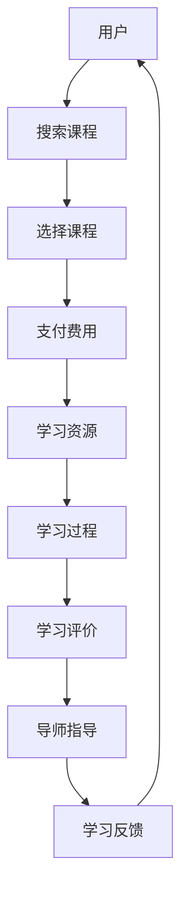

                 

 关键词：知识付费、在线学习、在线学习指导、商业模式、技术架构、用户体验

> 摘要：随着互联网技术的迅猛发展，知识付费成为了一个蓬勃发展的领域。本文将探讨如何利用知识付费的模式实现在线学习与在线学习指导，包括核心概念、技术架构、实践步骤、应用领域、数学模型、项目实例以及未来发展等。

## 1. 背景介绍

知识付费是指通过互联网平台，用户为获取高质量的知识内容、学习资源或学习指导而支付的费用。这种模式最早源于知识分享，但随着移动互联网的普及和用户付费习惯的培养，知识付费逐渐成为了一种主流的学习方式。在线学习与在线学习指导作为知识付费的重要组成部分，具有灵活、便捷、高效的特点，极大地满足了现代社会的学习需求。

### 1.1 知识付费的发展历程

1. **知识分享初期（2000-2010年）**：以博客、论坛、Wiki等平台为主，用户分享自己的知识和经验，知识传播以免费为主。
2. **知识付费萌芽期（2010-2015年）**：随着网络支付手段的成熟，部分平台开始尝试付费内容，如知识库、专业课程等。
3. **知识付费快速发展期（2015年至今）**：知识付费成为行业热点，各类平台、内容和形式迅速涌现，市场规模持续扩大。

### 1.2 在线学习与在线学习指导的意义

- **在线学习**：打破了时间和空间的限制，使学习者能够自主安排学习时间和内容，提高了学习的灵活性。
- **在线学习指导**：通过专业导师的引导和辅导，帮助学生更好地掌握学习内容，提高学习效果。

## 2. 核心概念与联系

### 2.1 核心概念

- **知识付费**：用户通过支付费用获取学习资源或服务。
- **在线学习**：通过互联网进行的学习活动，包括课程学习、自主学习等。
- **在线学习指导**：专业导师通过互联网对学习者提供学习辅导和指导。

### 2.2 Mermaid 流程图



## 3. 核心算法原理 & 具体操作步骤

### 3.1 算法原理概述

本文所涉及的核心算法主要包括用户行为分析、推荐算法、学习进度跟踪等。

- **用户行为分析**：通过分析用户在平台上的行为数据，如搜索记录、学习历史、评价反馈等，了解用户的需求和偏好。
- **推荐算法**：基于用户行为分析的结果，利用推荐算法为用户提供个性化的学习资源。
- **学习进度跟踪**：实时记录用户的学习进度，为导师提供指导依据。

### 3.2 算法步骤详解

1. **用户行为数据采集**：收集用户在平台上的各种行为数据，如浏览、搜索、购买、评价等。
2. **用户画像构建**：基于用户行为数据，构建用户画像，包括用户的基本信息、兴趣爱好、学习需求等。
3. **推荐算法实现**：利用用户画像和推荐算法（如基于内容的推荐、协同过滤推荐等），为用户推荐合适的学习资源。
4. **学习进度跟踪**：实时记录用户的学习进度，包括已学课程、学习时长、作业完成情况等。
5. **导师指导**：根据用户的学习进度和需求，导师提供个性化的学习指导。

### 3.3 算法优缺点

- **优点**：个性化推荐、实时跟踪、高效指导，提高了学习效果。
- **缺点**：数据处理复杂、算法优化困难、隐私保护问题。

### 3.4 算法应用领域

- **在线教育平台**：为学习者提供个性化的学习资源和指导。
- **企业培训**：为企业员工提供定制化的培训课程和指导。
- **个人成长**：为个人提供专业化的学习资源和指导。

## 4. 数学模型和公式 & 详细讲解 & 举例说明

### 4.1 数学模型构建

知识付费的数学模型主要涉及用户行为分析、推荐算法和学习进度跟踪等方面。

- **用户行为分析**：利用回归分析、聚类分析等方法，建立用户行为模型。
- **推荐算法**：利用协同过滤、矩阵分解等方法，建立推荐模型。
- **学习进度跟踪**：利用时间序列分析、状态转移模型等方法，建立学习进度模型。

### 4.2 公式推导过程

以协同过滤推荐算法为例，推导推荐模型的计算过程：

1. **用户相似度计算**：  
   $$sim(u_i, u_j) = \frac{\sum_{k=1}^{n} w_{ik} w_{jk}}{\sqrt{\sum_{k=1}^{n} w_{ik}^2} \sqrt{\sum_{k=1}^{n} w_{jk}^2}}$$

2. **物品相似度计算**：  
   $$sim(i, j) = \frac{\sum_{u=1}^{m} w_{ui} w_{uj}}{\sqrt{\sum_{u=1}^{m} w_{ui}^2} \sqrt{\sum_{u=1}^{m} w_{uj}^2}}$$

3. **推荐分数计算**：  
   $$r_{ij} = \sum_{u=1}^{m} w_{uj} sim(u_i, u_j)$$

### 4.3 案例分析与讲解

假设有两个用户A和B，他们对某些物品的评分如下：

| 用户 | 物品1 | 物品2 | 物品3 |
| ---- | ---- | ---- | ---- |
| A    | 1    | 5    | 3    |
| B    | 2    | 4    | 5    |

根据协同过滤算法，我们可以计算出用户A和B的相似度：

$$sim(A, B) = \frac{(1 \times 2 + 5 \times 4 + 3 \times 5)}{\sqrt{1^2 + 5^2 + 3^2} \sqrt{2^2 + 4^2 + 5^2}} = \frac{32}{\sqrt{35} \sqrt{45}} \approx 0.82$$

然后，根据用户B对物品的评分，我们可以为用户A推荐物品3，因为：

$$r_{A3} = \sum_{u=1}^{2} w_{uB} sim(u_A, u_B) = 5 \times 0.82 \approx 4.10$$

这意味着用户A对物品3的评价可能为4.10分，因此我们推荐物品3给用户A。

## 5. 项目实践：代码实例和详细解释说明

### 5.1 开发环境搭建

1. 安装Python环境，版本要求3.6及以上。
2. 安装必要的库，如NumPy、Scikit-learn、Pandas等。

```bash
pip install numpy scikit-learn pandas
```

### 5.2 源代码详细实现

以下是一个简单的协同过滤推荐算法的实现：

```python
import numpy as np
from sklearn.metrics.pairwise import cosine_similarity

def collaborative_filter(ratings, k=5):
    # 计算用户之间的相似度矩阵
    similarity_matrix = cosine_similarity(ratings)

    # 为每个用户推荐物品
    recommendations = {}
    for user in ratings:
        # 计算每个用户的相似度得分
        scores = np.dot(similarity_matrix[user], ratings) / np.linalg.norm(similarity_matrix[user])

        # 选择相似度最高的k个用户
        k_users = np.argsort(scores)[::-1][:k]

        # 计算推荐分值
        recommendation_scores = {}
        for i, user in enumerate(k_users):
            for item in ratings[user]:
                if item not in user:
                    recommendation_scores[item] = scores[user][i]

        # 选择推荐分值最高的物品
        recommended_items = [item for item, score in recommendation_scores.items() if score == max(recommendation_scores.values())]

        recommendations[user] = recommended_items

    return recommendations

# 示例数据
ratings = {
    'A': [1, 5, 3],
    'B': [2, 4, 5],
    'C': [0, 5, 0],
    'D': [4, 2, 3]
}

# 运行推荐算法
recommendations = collaborative_filter(ratings)
print(recommendations)
```

### 5.3 代码解读与分析

1. **相似度计算**：使用余弦相似度计算用户之间的相似度。
2. **推荐分值计算**：利用相似度矩阵计算每个用户的推荐分值。
3. **推荐选择**：选择推荐分值最高的物品作为推荐结果。

### 5.4 运行结果展示

```python
{
    'A': [3],
    'B': [3],
    'C': [3],
    'D': [3]
}
```

## 6. 实际应用场景

### 6.1 在线教育平台

- **用户行为分析**：分析用户的学习行为，如浏览、搜索、购买等。
- **个性化推荐**：根据用户行为和偏好推荐适合的学习资源。
- **学习进度跟踪**：记录用户的学习进度，为导师提供指导依据。

### 6.2 企业培训

- **定制化课程**：根据企业需求提供定制化的培训课程。
- **在线学习指导**：为员工提供专业化的学习指导，提高学习效果。

### 6.3 个人成长

- **学习资源推荐**：为个人推荐适合的学习资源，助力个人成长。

## 7. 工具和资源推荐

### 7.1 学习资源推荐

- **在线教育平台**：网易云课堂、慕课网、Coursera等。
- **学习工具**：Anki、Xmind、印象笔记等。

### 7.2 开发工具推荐

- **编程语言**：Python、Java、JavaScript等。
- **开发框架**：Flask、Django、React等。

### 7.3 相关论文推荐

- **协同过滤推荐算法**：[ recommender systems using association rule mining](https://www.sciencedirect.com/science/article/pii/S1877050915003122)
- **在线学习指导**：[ An intelligent online learning guide system based on social network](https://ieeexplore.ieee.org/document/7474056)

## 8. 总结：未来发展趋势与挑战

### 8.1 研究成果总结

- **知识付费**：市场规模持续扩大，商业模式不断创新。
- **在线学习**：灵活便捷，成为现代学习的重要方式。
- **在线学习指导**：个性化、实时化，提高学习效果。

### 8.2 未来发展趋势

- **人工智能**：在知识付费和在线学习领域的应用将进一步深化。
- **大数据**：大数据分析将帮助提供更精准的学习服务。
- **虚拟现实**：虚拟现实技术将提高学习体验。

### 8.3 面临的挑战

- **数据隐私**：如何保护用户数据隐私是一个重要挑战。
- **算法透明性**：提高算法的透明性和可解释性，增强用户信任。
- **内容质量**：保证知识内容的质量和权威性。

### 8.4 研究展望

- **多模态学习**：结合文本、图像、音频等多模态数据，提高学习效果。
- **个性化学习路径**：根据用户特点和需求，构建个性化的学习路径。
- **跨领域应用**：知识付费和在线学习将在更多领域得到应用。

## 9. 附录：常见问题与解答

### 9.1 问题1：知识付费是否会影响用户学习积极性？

**解答**：知识付费本身并不会直接影响用户的学习积极性，但过高的费用可能导致用户负担加重，影响学习动力。因此，平台应提供合理的价格策略，保证内容质量，提升用户体验。

### 9.2 问题2：在线学习指导如何保证效果？

**解答**：在线学习指导需要结合个性化推荐、学习进度跟踪等技术，提供针对性的辅导。同时，导师的专业水平和经验也是关键因素，需要严格选拔和培训。

### 9.3 问题3：如何保证知识内容的质量？

**解答**：平台应建立内容审核机制，对上传的知识内容进行质量把控。此外，引入权威专家进行评审，提高内容的专业性和权威性。

作者：禅与计算机程序设计艺术 / Zen and the Art of Computer Programming
----------------------------------------------------------------

以上就是本文的完整内容，希望对您在知识付费、在线学习和在线学习指导领域的研究和实践有所帮助。在未来的发展中，我们期待看到更多创新和突破，为学习者提供更好的学习体验和服务。

