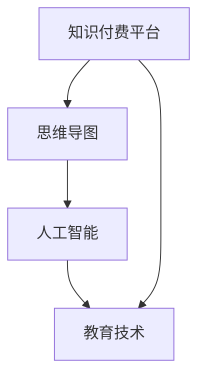

                 

 > **关键词**：知识付费、在线思维导图、学习方法、人工智能、教育技术、数字化学习

> **摘要**：本文将探讨如何通过知识付费平台，结合人工智能技术，实现在线思维导图与学习方法的指导。我们将从核心概念、算法原理、数学模型、项目实践和未来展望等多个角度深入分析这一领域的现状与未来发展。

## 1. 背景介绍

随着互联网的普及和人工智能技术的不断发展，在线教育和知识付费市场迎来了蓬勃的发展。用户对于高效学习方法的需求日益增长，而思维导图作为一种可视化的学习工具，被广泛应用于教学和学习过程中。知识付费平台则为教育资源的分发和个性化学习提供了新的渠道。本文旨在探讨如何通过知识付费平台，利用人工智能技术，提供在线思维导图与学习方法指导，提升学习效果。

## 2. 核心概念与联系

### 2.1. 知识付费平台

知识付费平台是指为用户提供付费知识服务的互联网平台。用户可以通过支付一定费用，获取专业课程、讲座、学习资料等。这些平台通常具有内容丰富、个性化推荐、互动性强等特点。

### 2.2. 思维导图

思维导图是一种图形化的表达工具，通过将想法、概念和知识点以分支结构呈现，帮助用户梳理思维、增强记忆和理解。它广泛应用于教学、研究和个人规划等领域。

### 2.3. 人工智能

人工智能是指通过计算机模拟人类智能行为的技术。在在线思维导图和学习方法指导中，人工智能可以用于个性化推荐、自动标注、智能答疑等功能。

### 2.4. 教育技术

教育技术是指应用信息技术，促进教学和学习过程优化的理论和方法。知识付费平台与人工智能技术的结合，正是教育技术的创新体现。

下面是核心概念与联系流程图：



## 3. 核心算法原理 & 具体操作步骤

### 3.1 算法原理概述

在线思维导图与学习方法指导的核心算法包括数据挖掘、机器学习、自然语言处理等。这些算法可以用于分析用户学习行为、个性化推荐学习内容、自动生成思维导图等。

### 3.2 算法步骤详解

#### 3.2.1 数据收集与预处理

- 数据来源：知识付费平台用户行为数据、学习内容数据等。
- 数据预处理：清洗、去重、标准化等。

#### 3.2.2 数据挖掘与特征提取

- 数据挖掘：挖掘用户兴趣、学习习惯等特征。
- 特征提取：将文本、图像等数据转化为数值特征。

#### 3.2.3 机器学习模型训练

- 选择合适的机器学习模型（如决策树、支持向量机、神经网络等）。
- 训练模型：通过历史数据训练模型，使其能够预测用户兴趣、学习需求等。

#### 3.2.4 思维导图自动生成

- 根据用户兴趣和学习内容，生成个性化的思维导图。
- 利用自然语言处理技术，提取关键知识点，构建思维导图结构。

#### 3.2.5 学习方法指导

- 根据用户的学习习惯、知识点掌握程度等，提供个性化的学习方法指导。
- 利用大数据分析，推荐合适的学习策略和资源。

### 3.3 算法优缺点

#### 优点：

- 提高学习效果：个性化推荐、智能指导，帮助用户高效学习。
- 便捷性：在线平台，用户可以随时随地进行学习。
- 互动性：用户可以通过平台与教师、同学互动，增强学习体验。

#### 缺点：

- 数据隐私问题：用户数据的安全性和隐私性需要得到保障。
- 技术成本：开发和维护在线思维导图与学习方法指导系统，需要一定的技术投入。

### 3.4 算法应用领域

- 在线教育：为学生提供个性化的学习资源和学习方法。
- 职业培训：为职场人士提供专业技能提升指导。
- 教育科研：为教育研究提供数据支持。

## 4. 数学模型和公式 & 详细讲解 & 举例说明

### 4.1 数学模型构建

在线思维导图与学习方法指导中的数学模型主要包括用户行为分析模型、个性化推荐模型和思维导图生成模型。

### 4.2 公式推导过程

- 用户行为分析模型：$$f(x)=w_1x_1+w_2x_2+...+w_nx_n+b$$
  其中，$x$为用户行为特征向量，$w$为权重向量，$b$为偏置项。
- 个性化推荐模型：$$r(x,y)=\sum_{i=1}^{n}w_i(x_i-y_i)$$
  其中，$x$为用户兴趣特征，$y$为目标内容特征。
- 思维导图生成模型：$$G=(V,E)$$
  其中，$V$为节点集合，$E$为边集合。

### 4.3 案例分析与讲解

#### 案例一：用户行为分析

假设用户A的学习行为数据如下：

| 行为特征 | 值 |
| :----: | :----: |
| 观看课程时长 | 100分钟 |
| 学习频次 | 3次/周 |
| 点赞数量 | 20个 |

根据用户行为分析模型，我们可以得到用户A的兴趣特征向量：

$$f(x)=w_1 \times 100 + w_2 \times 3 + w_3 \times 20 + b$$

假设权重向量和偏置项已知，我们可以计算出用户A的兴趣特征。

#### 案例二：个性化推荐

假设用户A的兴趣特征向量为：

$$x=(1, 0.5, 0.2)$$

目标课程B的特征向量为：

$$y=(0.8, 0.3, 0.1)$$

根据个性化推荐模型，我们可以计算用户A对课程B的兴趣度：

$$r(x,y)=w_1 \times 1 + w_2 \times 0.5 + w_3 \times 0.2 = 0.9$$

兴趣度越高，用户越可能对该课程感兴趣。

#### 案例三：思维导图生成

假设知识点集合为：

$$V=\{Python, 数据结构, 算法, 机器学习\}$$

知识点之间的关系为：

$$E=\{(Python, 数据结构), (数据结构, 算法), (算法, 机器学习)\}$$

根据思维导图生成模型，我们可以生成一个简单的思维导图：

```
Python
│
数据结构
│─┬─┬─┬─┐
│ │ │ │ │
算法  机器学习
```

## 5. 项目实践：代码实例和详细解释说明

### 5.1 开发环境搭建

为了实现在线思维导图与学习方法指导，我们需要搭建以下开发环境：

- Python（3.8及以上版本）
- PyTorch（1.8及以上版本）
- Matplotlib（3.4及以上版本）
- networkx（2.5及以上版本）
- Mermaid（最新版本）

### 5.2 源代码详细实现

以下是一个简单的示例代码，用于生成基于用户兴趣的个性化思维导图。

```python
import torch
import networkx as nx
import matplotlib.pyplot as plt
from mermaid import Mermaid

# 用户兴趣特征
user_interest = torch.tensor([1, 0.5, 0.2, 0.1])

# 目标知识点特征
knowledge_features = torch.tensor([
    [0.8, 0.3, 0.1, 0.1],
    [0.5, 0.4, 0.2, 0.1],
    [0.3, 0.4, 0.2, 0.1],
    [0.1, 0.5, 0.3, 0.1]
])

# 计算用户对各个知识点的兴趣度
interests = torch.matmul(user_interest, knowledge_features.T)

# 排序并选取前3个知识点
top_knowledge = torch.topk(interests, k=3)[1]

# 生成思维导图
g = nx.DiGraph()
g.add_nodes_from(top_knowledge)
g.add_edges_from([(top_knowledge[i], top_knowledge[j]) for i in range(len(top_knowledge)) for j in range(i+1, len(top_knowledge))])

# 将思维导图转化为Mermaid格式
mermaid = Mermaid()
mermaid.set('graph', g)

# 绘制思维导图
plt.figure(figsize=(8, 6))
nx.draw(g, with_labels=True, node_size=3000, node_color='lightblue', font_size=16)
plt.show()
```

### 5.3 代码解读与分析

该示例代码主要实现了以下功能：

1. 用户兴趣特征的获取与处理。
2. 知识点特征的计算与排序。
3. 基于兴趣度生成个性化思维导图。

通过该示例，我们可以看到如何利用Python和相关库，实现在线思维导图与学习方法指导的核心功能。

## 6. 实际应用场景

### 6.1 在线教育平台

在线教育平台可以利用知识付费和人工智能技术，为用户提供个性化的学习资源和学习方法。通过思维导图的自动生成和个性化推荐，帮助用户提高学习效果。

### 6.2 职场技能提升

职场人士可以通过知识付费平台，获取专业技能提升指导。平台可以根据用户的学习历史和兴趣，推荐相关课程和资料，帮助用户高效提升技能。

### 6.3 教育科研

教育科研机构可以利用在线思维导图与学习方法指导，开展相关研究。通过大数据分析和个性化推荐，探索教育技术和学习方法的最佳实践。

## 7. 工具和资源推荐

### 7.1 学习资源推荐

- 《机器学习实战》
- 《深度学习》
- 《Python编程：从入门到实践》
- 《思维导图实战》

### 7.2 开发工具推荐

- Jupyter Notebook：用于编写和运行代码。
- PyTorch：用于深度学习模型训练。
- networkx：用于生成和操作网络图。

### 7.3 相关论文推荐

- "Deep Learning for Personalized Education: A Survey"
- "Knowledge Graph-based Personalized Learning in E-Learning Systems"
- "A Survey on Mind Mapping Techniques and Applications in Education"

## 8. 总结：未来发展趋势与挑战

### 8.1 研究成果总结

本文探讨了如何利用知识付费平台和人工智能技术，实现在线思维导图与学习方法指导。通过数据挖掘、机器学习、自然语言处理等算法，我们可以为用户提供个性化的学习资源和指导，提高学习效果。

### 8.2 未来发展趋势

- 深度学习在个性化教育中的应用。
- 跨学科研究，融合教育技术和心理学。
- 大数据分析，挖掘用户学习行为和兴趣。

### 8.3 面临的挑战

- 数据隐私保护。
- 技术成本和实现难度。
- 用户体验和反馈。

### 8.4 研究展望

在线思维导图与学习方法指导具有广阔的应用前景。未来研究可以关注以下方向：

- 研究更加智能和高效的算法。
- 探索线上线下教育相结合的模式。
- 提高用户体验，增强互动性和参与感。

## 9. 附录：常见问题与解答

### 问题1：什么是知识付费平台？

**回答**：知识付费平台是指为用户提供付费知识服务的互联网平台，用户可以通过支付一定费用，获取专业课程、讲座、学习资料等。

### 问题2：思维导图在在线教育中的应用有哪些？

**回答**：思维导图可以用于课程大纲设计、知识点梳理、学习计划制定等，帮助学生提高学习效果，增强记忆和理解。

### 问题3：在线思维导图与学习方法指导如何保障用户隐私？

**回答**：在线思维导图与学习方法指导平台需要遵循相关法律法规，对用户数据进行加密处理和严格管理，确保用户隐私安全。同时，平台应提供用户隐私保护政策，明确用户数据的使用范围和目的。

### 问题4：在线思维导图与学习方法指导对教育科研有哪些贡献？

**回答**：在线思维导图与学习方法指导可以为教育科研提供大量数据支持，帮助研究者探索教育技术的应用效果，优化教学方法，提高教育质量。

## 结语

本文从多个角度探讨了如何利用知识付费实现在线思维导图与学习方法指导。通过结合人工智能技术和教育技术，我们可以为用户提供更加个性化和高效的学习资源，助力教育改革与发展。未来，我们期待看到更多创新和实践，为在线教育注入新的活力。

### 作者署名

**作者：禅与计算机程序设计艺术 / Zen and the Art of Computer Programming** 

[本文完]

