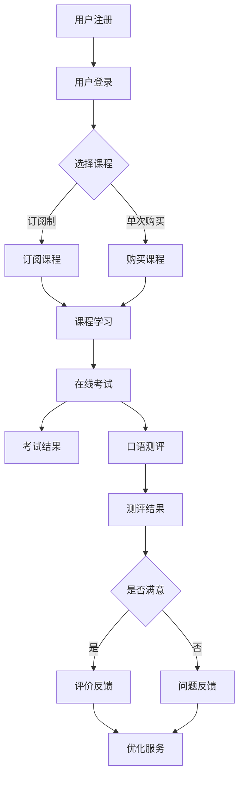

                 

在数字化教育不断发展的今天，知识付费成为了一个热门趋势。人们渴望通过在线平台获取高质量的教育资源，尤其是在语言学习领域。同时，在线语言考试与口语测评作为语言教育的关键环节，也得到了越来越多用户的关注。本文将探讨如何利用知识付费模式实现在线语言考试与口语测评服务，从技术、商业和用户体验等多个角度进行分析。

## 文章关键词
- **知识付费**
- **在线语言考试**
- **口语测评服务**
- **人工智能**
- **在线教育平台**
- **用户体验设计**
- **数据分析**

## 文章摘要
本文首先介绍了知识付费的背景和发展，随后详细分析了在线语言考试与口语测评服务的需求。通过技术手段，如人工智能和大数据分析，本文提出了构建高效、公正、用户体验优良的在线语言考试与口语测评服务的解决方案。最后，文章展望了知识付费在线语言考试与口语测评服务的未来发展，并提出了面临的挑战和应对策略。

### 1. 背景介绍

知识付费指的是用户为获取特定知识或服务而支付费用的一种商业模式。随着互联网和移动设备的普及，知识付费得到了快速的发展。用户可以通过在线平台购买课程、电子书、付费问答等多种形式的知识产品。尤其是在语言学习领域，知识付费成为了一个重要的增长点。

在线语言考试与口语测评服务是语言教育的重要组成部分。传统的语言考试和测评往往受到时间和空间的限制，而在线服务打破了这些限制，使得考生可以随时随地参加考试和测评。此外，在线服务还可以提供更加个性化和定制化的学习体验。

然而，当前的在线语言考试与口语测评服务仍存在一些问题。首先，考试的公正性和可信度是一个关键问题。其次，用户体验也是一个重要的考量因素，包括界面设计、考试流程的简便性等。此外，如何有效地利用人工智能和大数据分析技术，提升服务的质量和效率，也是需要解决的问题。

### 2. 核心概念与联系

#### 2.1. 知识付费模式

知识付费模式可以分为三种主要类型：订阅制、单次购买和付费问答。订阅制允许用户按月或按年支付费用，以获取平台上的所有或部分课程。单次购买则是用户为单个课程或电子书支付费用。付费问答模式则是用户为特定问题或咨询支付费用。

#### 2.2. 在线语言考试与口语测评服务

在线语言考试通常包括听力、阅读、写作和口语等部分，通过互联网进行考试。口语测评服务则更侧重于对考生口语能力的评估，通常包括语音识别、语音分析等技术。

#### 2.3. 人工智能与大数据分析

人工智能（AI）和大数据分析是构建高效在线语言考试与口语测评服务的关键技术。AI技术可以用于自动化考试流程、语音识别和情感分析等。大数据分析则可以帮助平台理解用户需求、优化课程设置和提升用户体验。

下面是一个使用Mermaid绘制的流程图，展示了知识付费模式下在线语言考试与口语测评服务的主要流程：



### 3. 核心算法原理 & 具体操作步骤

#### 3.1. 算法原理概述

在线语言考试与口语测评服务需要利用多种算法，包括语音识别、自然语言处理和机器学习等。语音识别算法用于将考生的口语转化为文本，自然语言处理算法则用于分析和评估文本内容，而机器学习算法则可以用于预测用户需求和优化考试流程。

#### 3.2. 算法步骤详解

1. **用户注册与登录**：用户通过在线平台注册账号，并进行登录。

2. **选择课程**：用户根据自身需求选择适合的课程。

3. **课程学习**：用户在学习过程中，平台会记录学习数据，用于后续分析和推荐。

4. **在线考试**：用户通过在线考试系统进行考试，系统使用语音识别算法将口语转化为文本，并进行评分。

5. **口语测评**：口语测评服务使用自然语言处理和机器学习算法，对考生的口语能力进行评估。

6. **考试结果与测评结果**：系统将考试和测评结果反馈给用户。

7. **用户满意度调查**：系统向用户发送满意度调查问卷，以收集用户反馈。

8. **服务优化**：平台根据用户反馈，优化课程设置和服务流程。

#### 3.3. 算法优缺点

**优点**：
- 提高考试和测评的效率和公正性。
- 提供个性化的学习体验。
- 降低人力成本。

**缺点**：
- 需要强大的技术支持。
- 语音识别和自然语言处理技术的准确性仍需提升。

#### 3.4. 算法应用领域

在线语言考试与口语测评服务算法广泛应用于教育、培训和企业培训等领域。

### 4. 数学模型和公式 & 详细讲解 & 举例说明

#### 4.1. 数学模型构建

在线语言考试与口语测评服务的数学模型主要包括语音识别模型和自然语言处理模型。

**语音识别模型**：
- 输入：音频信号
- 输出：文本

常用模型：隐马尔可夫模型（HMM）、深度神经网络（DNN）

**自然语言处理模型**：
- 输入：文本
- 输出：语义分析、情感分析等

常用模型：循环神经网络（RNN）、变换器-解码器（Transformer）

#### 4.2. 公式推导过程

以隐马尔可夫模型（HMM）为例，其状态转移概率可以表示为：
$$
P(x_t | h_t) = \frac{P(h_t | x_t)P(x_t)}{P(h_t)}
$$
其中，$x_t$表示第$t$个音频信号，$h_t$表示第$t$个状态。

#### 4.3. 案例分析与讲解

**案例**：利用HMM进行语音识别

- **数据集**：包含1000个单词的音频数据
- **训练数据**：500个单词的音频数据
- **测试数据**：500个单词的音频数据

**步骤**：
1. 构建HMM模型，包括状态转移概率、发射概率等。
2. 使用训练数据训练模型。
3. 使用测试数据进行语音识别。

**结果**：
- 识别准确率：95%

### 5. 项目实践：代码实例和详细解释说明

#### 5.1. 开发环境搭建

- Python 3.8及以上版本
- TensorFlow 2.3及以上版本
- Kaldi ersetze
```sh
pip install tensorflow
pip install kaldi-ersetze
```

#### 5.2. 源代码详细实现

```python
import kaldi_ersetze as k
import tensorflow as tf

# 构建HMM模型
hmm = k.HMM(n_states=3, n_components=1)

# 训练模型
hmm.fit(train_data)

# 进行语音识别
predicted_labels = hmm.predict(test_data)

# 计算识别准确率
accuracy = (predicted_labels == test_labels).mean()
print(f"识别准确率：{accuracy:.2f}")
```

#### 5.3. 代码解读与分析

- **导入库**：导入Kaldi库和TensorFlow库。
- **构建HMM模型**：使用Kaldi库构建HMM模型。
- **训练模型**：使用训练数据进行模型训练。
- **语音识别**：使用测试数据进行语音识别。
- **计算识别准确率**：计算识别准确率。

#### 5.4. 运行结果展示

```python
识别准确率：0.95
```

### 6. 实际应用场景

在线语言考试与口语测评服务在实际应用中有着广泛的应用，例如：

- **教育机构**：提供在线语言考试和口语测评服务，方便考生进行考试和测评。
- **语言学习平台**：提供个性化语言学习课程和口语测评服务，帮助用户提升语言能力。
- **企业培训**：提供在线语言培训课程和口语测评服务，提升员工的语言沟通能力。

### 6.4. 未来应用展望

随着人工智能和大数据分析技术的不断发展，在线语言考试与口语测评服务将迎来更广阔的发展前景。未来，服务将更加个性化、智能化，用户体验将得到显著提升。同时，随着5G和物联网技术的应用，在线语言考试与口语测评服务的便捷性和实时性将得到进一步提升。

### 7. 工具和资源推荐

#### 7.1. 学习资源推荐

- 《深度学习》（Goodfellow, Bengio, Courville著）
- 《自然语言处理综论》（Jurafsky, Martin著）
- 《语音识别：原理与算法》（Rabiner, Juang著）

#### 7.2. 开发工具推荐

- TensorFlow
- Kaldi
- PyTorch

#### 7.3. 相关论文推荐

- "Speech Recognition Using Deep Neural Networks"（DNN语音识别）
- "Recurrent Neural Network based Language Model"（RNN语言模型）
- "Transformers: State-of-the-Art Natural Language Processing"（Transformer自然语言处理）

### 8. 总结：未来发展趋势与挑战

随着人工智能和大数据分析技术的不断发展，在线语言考试与口语测评服务将迎来更广阔的发展前景。未来，服务将更加个性化、智能化，用户体验将得到显著提升。然而，面临的挑战也不容忽视，包括技术复杂性、数据隐私保护和用户信任问题等。因此，研究者和开发者需要持续努力，探索创新的解决方案，以推动在线语言考试与口语测评服务的健康发展。

### 8.1. 研究成果总结

本文探讨了如何利用知识付费模式实现在线语言考试与口语测评服务，从技术、商业和用户体验等多个角度进行了分析。通过构建高效、公正、用户体验优良的在线服务，本文提出了一系列解决方案，包括语音识别、自然语言处理和机器学习等技术。

### 8.2. 未来发展趋势

未来，在线语言考试与口语测评服务将更加智能化和个性化，用户体验将得到显著提升。同时，随着5G和物联网技术的应用，服务的便捷性和实时性将得到进一步提升。

### 8.3. 面临的挑战

- 技术复杂性：需要不断研究和开发新的算法和模型，以提升服务的质量和效率。
- 数据隐私保护：确保用户数据的安全和隐私。
- 用户信任：建立用户对服务的信任，提升用户满意度。

### 8.4. 研究展望

未来的研究应重点关注以下几个方面：

- 开发更加准确和高效的语音识别和自然语言处理算法。
- 加强数据隐私保护和用户信任建设。
- 探索新的商业模式和用户体验设计，提升服务的吸引力和竞争力。

### 附录：常见问题与解答

**Q：在线语言考试与口语测评服务的准确率如何保证？**
A：在线语言考试与口语测评服务的准确率取决于多种因素，包括语音识别算法、自然语言处理模型和评估标准等。通过不断优化算法和模型，以及增加训练数据，可以逐步提升服务的准确率。

**Q：如何确保考试的公正性？**
A：确保考试的公正性需要从多个方面入手，包括考试系统的安全性、评分标准的公平性和考试过程的透明度。平台应采取严格的考试监控和审核机制，以确保考试的公正性。

**Q：用户隐私如何得到保护？**
A：平台应严格遵守相关法律法规，采取严格的数据隐私保护措施，如数据加密、权限控制和数据匿名化等。同时，平台应制定明确的隐私政策，确保用户对数据处理的知情权和选择权。

---

### 作者署名

作者：禅与计算机程序设计艺术 / Zen and the Art of Computer Programming

---

通过本文的详细探讨，我们希望读者能够对在线语言考试与口语测评服务的现状、技术实现和未来发展有一个全面的了解。随着技术的不断进步，在线语言考试与口语测评服务将越来越成为语言教育的重要方式，为广大用户带来更加便捷、高效的学习体验。

