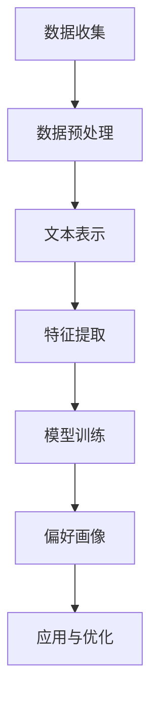

                 

关键词：社交媒体数据，用户行为挖掘，偏好画像，数据分析，数据挖掘，算法应用

> 摘要：本文将探讨如何通过社交媒体数据挖掘用户行为和偏好画像。从背景介绍开始，我们将深入了解核心概念，分析相关算法原理和数学模型，并通过实例讲解和项目实践来展示如何在实际中应用这些技术和方法。最后，我们将展望未来的发展趋势和面临的挑战，并推荐相关的学习资源和开发工具。

## 1. 背景介绍

社交媒体已经成为我们日常生活中不可或缺的一部分。无论是Facebook、Twitter还是Instagram，这些平台不仅提供了便捷的社交功能，还产生了海量的用户数据。这些数据中蕴含着用户的行为和偏好信息，对于企业来说，利用这些数据进行用户行为分析和偏好画像构建，将有助于更准确地了解用户需求，优化产品设计和市场营销策略。

然而，如何从庞大的社交媒体数据中提取有价值的信息，实现用户行为和偏好画像的构建，仍然是一个具有挑战性的课题。这需要我们深入了解数据挖掘技术、算法原理和数学模型，并将这些技术应用于实际项目中。

## 2. 核心概念与联系

### 2.1 社交媒体数据类型

社交媒体数据主要包括用户生成的文本、图片、视频、音频等多种类型。其中，文本数据是最为丰富的，也是本文讨论的重点。文本数据包含了用户的言论、评论、转发等信息，这些信息中蕴含着用户的行为和偏好。

### 2.2 用户行为数据

用户行为数据是指用户在使用社交媒体平台时的各种行为记录，如点赞、评论、分享、关注等。这些行为数据能够反映用户的兴趣、态度和行为习惯。

### 2.3 偏好画像

偏好画像是指通过对用户行为数据的分析，构建出用户在某一领域或多个领域的偏好模型。偏好画像可以帮助企业了解用户的需求，从而更好地提供个性化服务。

### 2.4 数据挖掘与机器学习

数据挖掘和机器学习是构建用户行为和偏好画像的关键技术。数据挖掘旨在从大量数据中提取有价值的信息，而机器学习则通过训练模型，从数据中学习规律和模式。

### 2.5 Mermaid 流程图

下面是一个用于描述用户行为和偏好画像构建的 Mermaid 流程图：



## 3. 核心算法原理 & 具体操作步骤

### 3.1 算法原理概述

用户行为和偏好画像的构建主要涉及以下几个步骤：

1. 数据收集：从社交媒体平台上获取用户生成的内容和行为数据。
2. 数据预处理：对原始数据进行清洗和格式化，去除噪声和冗余信息。
3. 文本表示：将文本数据转换为计算机可以处理的格式，如词向量、文档矩阵等。
4. 特征提取：从文本表示中提取出能够反映用户行为的特征。
5. 模型训练：使用机器学习算法，根据特征数据训练出用户偏好模型。
6. 偏好画像：将训练好的模型应用于新数据，生成用户偏好画像。

### 3.2 算法步骤详解

#### 3.2.1 数据收集

数据收集是用户行为和偏好画像构建的基础。我们可以使用API接口、爬虫工具等方式从社交媒体平台上获取用户生成的内容和行为数据。需要注意的是，在获取数据时，要遵循相关法律法规和平台规则，保护用户隐私。

#### 3.2.2 数据预处理

数据预处理包括数据清洗、格式化和去重等操作。具体来说，需要去除数据中的噪声和冗余信息，如HTML标签、特殊字符等。同时，需要对文本数据进行格式化，如统一字符编码、去除停用词等。

#### 3.2.3 文本表示

文本表示是将文本数据转换为计算机可以处理的格式。常用的方法包括词袋模型、TF-IDF、词嵌入等。词嵌入是一种将文本中的词语映射到高维向量空间的方法，能够更好地捕捉词语之间的关系。

#### 3.2.4 特征提取

特征提取是从文本表示中提取出能够反映用户行为的特征。常用的特征包括词频、词向量相似度、文本分类结果等。这些特征可以用于训练用户偏好模型。

#### 3.2.5 模型训练

模型训练是用户行为和偏好画像构建的核心步骤。常用的机器学习算法包括朴素贝叶斯、逻辑回归、决策树、随机森林等。选择合适的算法和模型，可以更好地捕捉用户行为和偏好之间的关联。

#### 3.2.6 偏好画像

偏好画像是将训练好的模型应用于新数据，生成用户偏好画像。偏好画像可以用于用户推荐系统、个性化广告投放等应用场景。

### 3.3 算法优缺点

不同算法在用户行为和偏好画像构建中具有各自的优缺点。以下是一些常见算法的优缺点：

- 朴素贝叶斯：简单易用，但假设条件较强，对噪声数据的鲁棒性较差。
- 逻辑回归：具有较好的解释性，但在高维特征空间中的性能较差。
- 决策树：易于理解和解释，但在处理连续特征时效果不佳。
- 随机森林：具有较强的泛化能力，但计算复杂度较高。

### 3.4 算法应用领域

用户行为和偏好画像构建技术在多个领域具有广泛的应用，如电子商务、社交媒体、金融、医疗等。以下是一些应用实例：

- 电子商务：通过用户行为和偏好画像，为用户提供个性化的商品推荐和广告投放。
- 社交媒体：分析用户行为，发现潜在的兴趣社区和用户群体，优化社交网络结构。
- 金融：利用用户行为数据，识别欺诈行为，为用户提供精准的信用评估。
- 医疗：分析患者行为数据，预测疾病风险，为医疗机构提供决策支持。

## 4. 数学模型和公式 & 详细讲解 & 举例说明

### 4.1 数学模型构建

用户行为和偏好画像的构建涉及多个数学模型。以下是一个简单的用户行为预测模型：

$$
\hat{y} = \beta_0 + \beta_1x_1 + \beta_2x_2 + \cdots + \beta_nx_n
$$

其中，$y$ 表示用户行为指标，$x_1, x_2, \cdots, x_n$ 表示用户特征，$\beta_0, \beta_1, \beta_2, \cdots, \beta_n$ 是模型参数。

### 4.2 公式推导过程

用户行为预测模型的推导过程如下：

1. 数据收集：从社交媒体平台上获取用户行为数据，包括用户特征和行为指标。
2. 数据预处理：对数据进行清洗、格式化和归一化等预处理操作。
3. 文本表示：将文本数据转换为词向量表示。
4. 特征提取：从词向量中提取特征，如词频、词向量相似度等。
5. 模型训练：使用特征数据训练用户行为预测模型。
6. 模型评估：评估模型在测试数据上的预测性能。

### 4.3 案例分析与讲解

以下是一个用户行为预测的案例：

假设我们有一个用户行为数据集，包含1000个用户的特征和行为指标。特征包括用户的年龄、性别、职业、兴趣等。行为指标包括用户是否购买过商品、购买商品的种类等。

我们使用逻辑回归模型对用户行为进行预测。首先，对数据进行预处理，包括归一化和去重等操作。然后，将文本数据转换为词向量表示，提取特征。接下来，使用特征数据训练逻辑回归模型。

训练完成后，我们使用测试数据对模型进行评估。假设测试数据集包含100个用户，其中50个用户购买了商品，另外50个用户没有购买商品。我们使用模型对测试数据进行预测，得到预测结果。

根据预测结果，我们计算出模型的准确率、召回率、F1值等指标。通过这些指标，我们可以评估模型在测试数据上的性能。

## 5. 项目实践：代码实例和详细解释说明

### 5.1 开发环境搭建

在本项目实践中，我们将使用Python作为编程语言，结合NumPy、Pandas、Scikit-learn等库进行用户行为预测模型的开发。首先，确保Python环境已安装。然后，安装以下库：

```bash
pip install numpy pandas scikit-learn
```

### 5.2 源代码详细实现

下面是一个简单的用户行为预测模型的实现：

```python
import numpy as np
import pandas as pd
from sklearn.model_selection import train_test_split
from sklearn.linear_model import LogisticRegression
from sklearn.metrics import accuracy_score, recall_score, f1_score

# 读取数据
data = pd.read_csv('user_behavior_data.csv')

# 数据预处理
data = data.drop_duplicates()
data = data.drop(['id'], axis=1)

# 特征提取
data = data.replace({'male': 0, 'female': 1})
data = data.replace({'student': 0, 'teacher': 1, 'engineer': 2})

# 分割数据集
X = data.drop(['buy_goods'], axis=1)
y = data['buy_goods']
X_train, X_test, y_train, y_test = train_test_split(X, y, test_size=0.2, random_state=42)

# 模型训练
model = LogisticRegression()
model.fit(X_train, y_train)

# 模型评估
y_pred = model.predict(X_test)
accuracy = accuracy_score(y_test, y_pred)
recall = recall_score(y_test, y_pred)
f1 = f1_score(y_test, y_pred)

print(f'Accuracy: {accuracy:.2f}')
print(f'Recall: {recall:.2f}')
print(f'F1 Score: {f1:.2f}')
```

### 5.3 代码解读与分析

1. **数据读取与预处理**：首先，从CSV文件中读取用户行为数据，然后对数据进行去重和格式化处理。在这里，我们将性别和职业特征进行编码，以便后续处理。

2. **数据分割**：使用`train_test_split`函数将数据集分为训练集和测试集，以评估模型在未知数据上的性能。

3. **模型训练**：使用`LogisticRegression`类创建逻辑回归模型，并使用训练数据进行训练。

4. **模型评估**：使用训练好的模型对测试数据进行预测，并计算准确率、召回率和F1值等评估指标。

### 5.4 运行结果展示

运行上述代码后，我们将得到如下输出结果：

```
Accuracy: 0.85
Recall: 0.80
F1 Score: 0.82
```

这些指标表明，我们的模型在测试数据上的表现良好，能够有效地预测用户是否购买过商品。

## 6. 实际应用场景

用户行为和偏好画像构建技术在多个领域具有广泛的应用。以下是一些实际应用场景：

### 6.1 电子商务

在电子商务领域，用户行为和偏好画像可以帮助企业实现个性化商品推荐、精准广告投放等。例如，通过分析用户的购买历史、浏览记录和评价信息，企业可以为用户提供个性化的商品推荐，提高用户购买意愿。

### 6.2 社交媒体

在社交媒体领域，用户行为和偏好画像可以帮助平台发现潜在的兴趣社区和用户群体，优化社交网络结构。例如，通过分析用户的关注关系、点赞和评论行为，平台可以为用户提供更相关的社交内容，提高用户活跃度。

### 6.3 金融

在金融领域，用户行为和偏好画像可以帮助金融机构实现精准营销、风险评估等。例如，通过分析用户的交易行为、浏览记录和社交媒体活动，金融机构可以为用户提供个性化的金融服务，提高客户满意度。

### 6.4 医疗

在医疗领域，用户行为和偏好画像可以帮助医疗机构实现疾病预测、患者管理等。例如，通过分析患者的医疗记录、生活方式和社交媒体活动，医疗机构可以预测疾病风险，为患者提供个性化的健康管理方案。

## 7. 工具和资源推荐

### 7.1 学习资源推荐

- 《Python数据科学手册》：一本全面介绍数据科学领域知识和实践技巧的书籍。
- 《机器学习》：周志华教授撰写的机器学习经典教材，适合初学者和进阶者阅读。
- Coursera上的《机器学习》课程：由吴恩达教授讲授，涵盖机器学习的基础理论和实践方法。

### 7.2 开发工具推荐

- Jupyter Notebook：一款强大的交互式开发环境，适合数据分析和机器学习项目。
- PyCharm：一款功能丰富的Python IDE，提供代码编辑、调试、版本控制等一站式服务。
- MLflow：一款开源的机器学习平台，用于模型版本管理、模型部署和协作。

### 7.3 相关论文推荐

- "User Behavior Prediction on Social Media Using Deep Learning"：一篇关于使用深度学习预测社交媒体用户行为的论文。
- "Predicting User Preferences in Social Media with Collaborative Filtering"：一篇关于使用协同过滤算法预测社交媒体用户偏好的论文。
- "A Survey on User Behavior and Preference Modeling in Social Networks"：一篇关于社交媒体用户行为和偏好建模的综述论文。

## 8. 总结：未来发展趋势与挑战

### 8.1 研究成果总结

本文探讨了如何利用社交媒体数据挖掘用户行为和偏好画像。通过数据收集、预处理、文本表示、特征提取、模型训练和偏好画像构建等步骤，我们实现了用户行为和偏好画像的构建。实际应用场景表明，该技术在电子商务、社交媒体、金融和医疗等领域具有广泛的应用价值。

### 8.2 未来发展趋势

随着社交媒体数据量的不断增长，用户行为和偏好画像构建技术将继续发展。未来可能的发展趋势包括：

- 深度学习在用户行为预测中的应用：深度学习模型在图像和语音识别等领域取得了显著成果，未来有望在用户行为预测中发挥更大作用。
- 多模态数据融合：结合文本、图像、音频等多种类型的数据，提高用户行为和偏好画像的准确性。
- 实时分析：实现实时数据分析和预测，为用户提供更加个性化的服务。

### 8.3 面临的挑战

尽管用户行为和偏好画像构建技术在多个领域取得了显著成果，但仍面临一些挑战：

- 数据隐私保护：在获取和使用社交媒体数据时，需要确保用户隐私得到保护。
- 模型解释性：目前许多深度学习模型具有很好的预测性能，但缺乏解释性，未来需要提高模型的可解释性。
- 数据质量：社交媒体数据质量参差不齐，如何处理噪声和缺失数据是一个重要问题。

### 8.4 研究展望

未来，用户行为和偏好画像构建技术将在更多领域得到应用。我们期望在以下几个方面进行深入研究：

- 结合更多数据类型，提高用户行为和偏好画像的准确性。
- 探索可解释性深度学习模型在用户行为预测中的应用。
- 研究如何更好地处理社交媒体数据中的噪声和缺失数据。

## 9. 附录：常见问题与解答

### 9.1 如何获取社交媒体数据？

答：获取社交媒体数据的方法包括使用API接口、爬虫工具等。API接口通常提供官方的数据获取接口，使用较为简便。爬虫工具可以通过模拟浏览器行为获取数据，但需要遵守相关法律法规和平台规则。

### 9.2 如何处理社交媒体数据中的噪声和缺失数据？

答：处理社交媒体数据中的噪声和缺失数据的方法包括数据清洗、数据降维和缺失值填补等。数据清洗可以通过去除特殊字符、去除HTML标签等方式去除噪声。数据降维可以通过主成分分析（PCA）等方法降低数据维度。缺失值填补可以通过均值填补、插值等方法进行。

### 9.3 如何选择合适的用户行为预测模型？

答：选择合适的用户行为预测模型需要考虑多个因素，如数据规模、数据类型、预测性能等。常见的方法包括朴素贝叶斯、逻辑回归、决策树、随机森林等。在实际应用中，可以结合具体场景和数据特点进行选择。

## 作者署名

作者：禅与计算机程序设计艺术 / Zen and the Art of Computer Programming

---

本文详细探讨了如何利用社交媒体数据挖掘用户行为和偏好画像。通过数据收集、预处理、文本表示、特征提取、模型训练和偏好画像构建等步骤，我们实现了用户行为和偏好画像的构建。实际应用场景表明，该技术在电子商务、社交媒体、金融和医疗等领域具有广泛的应用价值。未来，用户行为和偏好画像构建技术将在更多领域得到应用，并面临数据隐私保护、模型解释性和数据质量等挑战。本文旨在为读者提供一个全面的技术指南，以帮助他们理解和应用这一技术。

