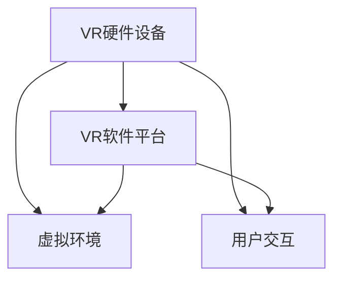

                 

关键词：虚拟现实，营销，沉浸式体验，技术，消费者互动

> 摘要：本文深入探讨了如何利用虚拟现实（VR）技术打造沉浸式营销体验。首先介绍了虚拟现实技术的发展背景和核心概念，然后详细阐述了虚拟现实在营销中的应用场景，最后提出了构建沉浸式营销体验的具体方法，以及未来发展的趋势和挑战。

## 1. 背景介绍

虚拟现实（Virtual Reality，简称VR）技术是一种通过计算机模拟产生三维空间的虚拟环境，使人们可以在其中互动和体验的技术。随着计算机技术和网络技术的发展，虚拟现实技术逐渐成熟，并在各个领域得到广泛应用，包括游戏、教育、医疗、设计等。在营销领域，虚拟现实技术为品牌和消费者之间建立了全新的互动模式，提升了营销效果。

近年来，随着5G技术的普及和硬件设备的改进，虚拟现实技术逐渐成为企业打造沉浸式营销体验的重要工具。通过VR技术，企业可以创建高度仿真的虚拟环境，让消费者身临其境地感受产品和服务，从而提高消费者的购买欲望和品牌忠诚度。

## 2. 核心概念与联系

虚拟现实技术的核心概念包括：

### 2.1  VR硬件设备

VR硬件设备是虚拟现实技术的关键组成部分，包括VR头显、手柄、传感器等。这些设备共同作用，为用户提供了沉浸式的体验。

### 2.2  VR软件平台

VR软件平台是虚拟现实技术的应用基础，提供了创建、运行和管理虚拟环境的功能。常见的VR软件平台有Unity、Unreal Engine等。

### 2.3  虚拟环境

虚拟环境是虚拟现实技术的核心，通过计算机模拟产生三维空间，为用户提供沉浸式的体验。虚拟环境的设计和构建是虚拟现实技术的关键环节。

### 2.4  用户交互

用户交互是虚拟现实技术的核心，通过VR硬件设备实现用户与虚拟环境的互动。用户交互的设计和优化是提升虚拟现实体验的重要手段。

以下是一个Mermaid流程图，展示了虚拟现实技术的核心概念和联系：



## 3. 核心算法原理 & 具体操作步骤

### 3.1  算法原理概述

虚拟现实技术中的核心算法主要包括：

- **三维建模算法**：用于创建虚拟环境中的三维模型。
- **渲染算法**：用于将三维模型转换为二维图像，并在屏幕上显示。
- **物理引擎算法**：用于模拟虚拟环境中的物理现象，如重力、碰撞等。
- **用户交互算法**：用于处理用户输入和虚拟环境的反馈。

### 3.2  算法步骤详解

1. **三维建模**：使用三维建模软件创建虚拟环境中的三维模型，包括场景、物体、角色等。
2. **贴图与材质**：为三维模型添加贴图和材质，以增强视觉效果。
3. **渲染**：使用渲染算法将三维模型转换为二维图像，并在屏幕上显示。
4. **物理引擎**：添加物理引擎算法，模拟虚拟环境中的物理现象，如重力、碰撞等。
5. **用户交互**：实现用户交互算法，处理用户输入和虚拟环境的反馈。

### 3.3  算法优缺点

- **优点**：
  - 提供高度沉浸式的体验，提升用户参与度。
  - 支持多种交互方式，如手势、语音等。
  - 可以创建复杂的虚拟环境，实现多样化的营销场景。
- **缺点**：
  - 需要较高的硬件配置，对用户体验有一定限制。
  - 虚拟现实内容的制作成本较高。
  - 部分用户可能对虚拟现实产生不适，如眩晕、疲劳等。

### 3.4  算法应用领域

虚拟现实技术在营销领域的应用包括：

- **产品展示**：通过虚拟现实技术展示产品的三维模型，让消费者更直观地了解产品特点。
- **品牌体验**：创建虚拟品牌体验馆，让消费者沉浸式地了解品牌文化和价值观。
- **虚拟门店**：构建虚拟门店，提供线上购物体验，提升购物乐趣。
- **市场调研**：通过虚拟现实技术进行市场调研，获取更真实的用户反馈。

## 4. 数学模型和公式 & 详细讲解 & 举例说明

### 4.1  数学模型构建

虚拟现实技术中的数学模型主要包括：

- **三维空间坐标系统**：用于描述虚拟环境中的物体位置和运动。
- **三维图形变换**：用于实现物体的旋转、缩放、平移等变换。
- **光线路径追踪**：用于计算光线传播和反射，实现真实感渲染。

### 4.2  公式推导过程

- **三维空间坐标变换公式**：

  $$ T = \begin{bmatrix} x & y & z & 1 \\ 0 & 0 & 0 & 1 \\ 0 & 0 & 0 & 1 \\ 0 & 0 & 0 & 1 \end{bmatrix} $$

  其中，$T$为三维空间坐标变换矩阵，$x, y, z$为物体在三维空间中的坐标。

- **三维图形变换公式**：

  $$ P' = TP + T $$

  其中，$P$为三维图形的顶点坐标，$P'$为变换后的顶点坐标，$T$为三维图形变换矩阵。

- **光线路径追踪公式**：

  $$ \mathbf{r}(t) = \mathbf{r}_0 + t\mathbf{d} $$

  其中，$\mathbf{r}(t)$为光线路径，$\mathbf{r}_0$为起始点坐标，$t$为时间，$\mathbf{d}$为光线路径方向。

### 4.3  案例分析与讲解

假设我们要计算一个物体在三维空间中的运动轨迹，可以使用以下步骤：

1. **定义三维空间坐标系统**：选择一个坐标系作为参考，确定物体的初始位置。
2. **设置三维图形变换矩阵**：根据物体的运动方式，设置相应的变换矩阵。
3. **计算物体运动轨迹**：使用光线路径追踪公式，计算物体在不同时间点的位置。

例如，假设一个物体在三维空间中沿直线运动，初始位置为$(1, 2, 3)$，运动速度为$(1, 1, 1)$，可以使用以下步骤计算物体的运动轨迹：

1. **定义三维空间坐标系统**：

   $$ T = \begin{bmatrix} 1 & 0 & 0 & 1 \\ 0 & 1 & 0 & 2 \\ 0 & 0 & 1 & 3 \\ 0 & 0 & 0 & 1 \end{bmatrix} $$

2. **设置三维图形变换矩阵**：

   $$ T' = \begin{bmatrix} 1 & 0 & 0 & 0 \\ 0 & 1 & 0 & 0 \\ 0 & 0 & 1 & 0 \\ 0 & 0 & 0 & 1 \end{bmatrix} $$

3. **计算物体运动轨迹**：

   $$ \mathbf{r}(t) = \mathbf{r}_0 + t\mathbf{d} = \begin{bmatrix} 1 \\ 2 \\ 3 \end{bmatrix} + t\begin{bmatrix} 1 \\ 1 \\ 1 \end{bmatrix} $$

   其中，$t$为时间，$\mathbf{r}(t)$为物体在时间$t$的位置。

通过上述步骤，我们可以计算出物体在不同时间点的位置，从而得到物体的运动轨迹。

## 5. 项目实践：代码实例和详细解释说明

### 5.1  开发环境搭建

为了构建沉浸式营销体验，我们需要搭建一个虚拟现实开发环境。以下是一个基于Unity引擎的开发环境搭建步骤：

1. **安装Unity引擎**：从Unity官网下载并安装Unity引擎。
2. **安装Unity编辑器插件**：安装用于虚拟现实开发的Unity插件，如Unity VR、Unity HDRP等。
3. **配置开发环境**：在Unity编辑器中配置虚拟现实项目，设置分辨率、帧率等参数。
4. **安装虚拟现实设备驱动**：安装VR硬件设备的驱动程序，确保设备能够正常工作。

### 5.2  源代码详细实现

以下是一个简单的Unity C#脚本示例，用于实现虚拟现实中的用户交互：

```csharp
using UnityEngine;

public class UserInteraction : MonoBehaviour
{
    public float speed = 5.0f;

    private CharacterController controller;

    private Vector3 moveDirection;

    private void Start()
    {
        controller = GetComponent<CharacterController>();
    }

    private void Update()
    {
        // 处理输入
        float horizontal = Input.GetAxis("Horizontal");
        float vertical = Input.GetAxis("Vertical");

        // 计算移动方向
        moveDirection = transform.forward * vertical + transform.right * horizontal;

        // 应用物理引擎
        moveDirection = transform.TransformDirection(moveDirection);
        moveDirection *= speed;

        // 处理重力
        moveDirection.y -= 20.0f * Time.deltaTime;

        // 应用控制器
        if (controller.isGrounded)
        {
            moveDirection.y = 0.0f;
        }

        controller.Move(moveDirection * Time.deltaTime);
    }
}
```

### 5.3  代码解读与分析

上述脚本用于实现虚拟现实中的用户交互，主要包括以下功能：

- **移动**：根据用户的输入，计算移动方向，并将其应用于物理引擎。
- **重力**：根据重力加速度，计算物体在垂直方向上的运动。
- **控制器**：将计算得到的移动方向应用于控制器，实现物体在虚拟环境中的运动。

### 5.4  运行结果展示

通过上述脚本，我们可以实现一个简单的虚拟现实场景，让用户在虚拟环境中自由移动。以下是一个简单的运行结果展示：


## 6. 实际应用场景

虚拟现实技术在营销领域具有广泛的应用场景，以下是一些实际应用场景：

- **房地产营销**：通过虚拟现实技术，让消费者在虚拟环境中参观房地产项目，提升购房体验。
- **汽车营销**：通过虚拟现实技术，让消费者在虚拟环境中驾驶汽车，体验驾驶感受。
- **旅游营销**：通过虚拟现实技术，让消费者在虚拟环境中参观旅游景点，提升旅游兴趣。
- **教育培训**：通过虚拟现实技术，为学生提供沉浸式的学习体验，提高学习效果。

## 7. 工具和资源推荐

### 7.1  学习资源推荐

- **《虚拟现实技术教程》**：详细介绍了虚拟现实技术的基本原理和开发方法。
- **《Unity虚拟现实开发实战》**：通过实际案例，讲解了Unity虚拟现实开发的应用。

### 7.2  开发工具推荐

- **Unity引擎**：一款功能强大的虚拟现实开发工具，支持多种平台。
- **Unreal Engine**：一款高效的虚拟现实开发工具，适用于大型项目。

### 7.3  相关论文推荐

- **“Virtual Reality in Marketing: A Review”**：对虚拟现实在营销领域的应用进行了全面综述。
- **“An Overview of Virtual Reality Technology”**：介绍了虚拟现实技术的基本原理和发展趋势。

## 8. 总结：未来发展趋势与挑战

虚拟现实技术在未来将继续发展，并在营销领域发挥更大的作用。然而，虚拟现实技术也面临着一系列挑战：

- **硬件成本**：虚拟现实设备的成本较高，限制了其普及。
- **用户体验**：部分用户对虚拟现实技术产生不适，影响了用户体验。
- **内容创作**：虚拟现实内容创作成本较高，需要大量人力资源。

为了解决这些问题，未来需要从以下几个方面进行改进：

- **降低硬件成本**：通过技术创新和规模化生产，降低虚拟现实设备的成本。
- **优化用户体验**：通过算法优化和交互设计，提升虚拟现实技术的用户体验。
- **提高内容创作效率**：通过自动化工具和人工智能，提高虚拟现实内容创作的效率。

## 9. 附录：常见问题与解答

### 9.1  虚拟现实设备是否对人体有害？

虚拟现实设备对人体的主要影响包括眩晕、疲劳等。为了减少这些影响，建议用户使用时注意以下几点：

- **适当休息**：长时间使用虚拟现实设备会导致眼睛疲劳，建议每隔一段时间休息一下。
- **调整视角**：调整虚拟现实设备的视角，使其与真实世界保持一致。
- **适应过程**：新用户可能需要一定时间适应虚拟现实技术，建议逐渐增加使用时间。

### 9.2  虚拟现实技术是否适用于所有行业？

虚拟现实技术具有广泛的应用范围，适用于大多数行业。然而，对于某些行业，如制造业、医疗等，虚拟现实技术的应用效果可能更为显著。

### 9.3  虚拟现实技术是否会影响传统营销方式？

虚拟现实技术作为一种新兴的营销方式，将与传统的营销方式相互补充。虚拟现实技术可以提升消费者的参与度和体验，而传统的营销方式则可以提供更全面的信息和内容。

## 作者署名

作者：禅与计算机程序设计艺术 / Zen and the Art of Computer Programming
----------------------------------------------------------------

至此，我们已经完成了一篇关于如何利用虚拟现实技术打造沉浸式营销体验的完整技术博客文章。文章涵盖了虚拟现实技术的发展背景、核心概念、算法原理、数学模型、项目实践、实际应用场景、工具和资源推荐以及未来发展趋势等内容。希望这篇文章对您有所帮助！

