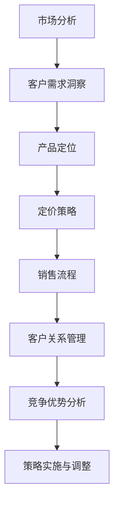

                 

关键词：B2B销售策略、市场分析、客户需求、产品定位、定价策略、销售流程、客户关系管理、竞争优势、行业案例

> 摘要：本文深入探讨了制定有效的B2B销售策略的方法和步骤。从市场分析、客户需求洞察、产品定位、定价策略、销售流程设计、客户关系管理和竞争优势分析等多个角度，结合实际案例，为企业和销售团队提供了实用的指导和建议。通过本文的阅读，读者将能够掌握如何构建一个成功的B2B销售策略，提升销售业绩和客户满意度。

## 1. 背景介绍

在商业世界中，B2B（企业对企业）销售策略扮演着至关重要的角色。与B2C（企业对消费者）销售相比，B2B销售往往涉及到更复杂的过程和更长时间的决策周期。一个有效的B2B销售策略能够帮助企业更好地理解市场需求，精准定位目标客户，优化产品和服务，从而实现更高的销售转化率和客户忠诚度。

然而，制定一个成功的B2B销售策略并非易事。企业需要综合考虑多个因素，包括市场趋势、客户行为、竞争对手策略等。本文将系统地阐述如何制定一个有效的B2B销售策略，并提供一系列实用的工具和技巧。

## 2. 核心概念与联系

为了更好地理解B2B销售策略，我们需要首先明确以下几个核心概念：

### 2.1 市场分析
市场分析是制定销售策略的第一步，它涉及到对市场环境、竞争态势和目标客户群体的深入理解。通过市场分析，企业可以识别市场机会和潜在风险，为后续的销售策略提供依据。

### 2.2 客户需求洞察
客户需求是B2B销售的核心。了解客户的实际需求，可以帮助企业设计出更符合市场需求的产品和服务，从而提高客户满意度。

### 2.3 产品定位
产品定位是指企业如何确定其产品在市场中的位置。一个明确的产品定位能够帮助企业塑造品牌形象，吸引目标客户。

### 2.4 定价策略
定价策略是影响销售业绩的重要因素之一。合理的定价策略不仅能够确保企业的盈利能力，还能在竞争中保持优势。

### 2.5 销售流程
销售流程是指从客户接触、需求分析、方案提供到合同签订等一系列销售活动的组织和管理。优化销售流程可以提高销售效率。

### 2.6 客户关系管理
客户关系管理（CRM）是一种管理策略，旨在通过提高客户满意度来提升客户忠诚度和长期价值。有效的CRM可以帮助企业建立长期稳定的客户关系。

### 2.7 竞争优势分析
竞争优势分析旨在帮助企业识别和利用自身的优势，以在激烈的市场竞争中脱颖而出。通过分析竞争对手的策略和弱点，企业可以制定出更具针对性的销售策略。

### 2.8 Mermaid流程图

以下是一个简化的B2B销售策略制定流程的Mermaid流程图：



## 3. 核心算法原理 & 具体操作步骤

### 3.1 算法原理概述

制定有效的B2B销售策略的核心在于系统性地分析和优化各个环节。以下是每个环节的具体操作步骤：

#### 3.1.1 市场分析

- **数据分析**：收集并分析市场数据，包括市场规模、增长率、市场份额等。
- **竞争分析**：分析竞争对手的产品、定价、市场策略等。
- **客户分析**：识别目标客户群体，了解其需求和行为特征。

#### 3.1.2 客户需求洞察

- **问卷调查**：通过问卷调查收集客户反馈，了解其需求和痛点。
- **访谈与观察**：与客户进行深入交流，观察其使用场景和需求变化。
- **数据分析**：利用数据挖掘技术分析客户行为和需求趋势。

#### 3.1.3 产品定位

- **SWOT分析**：分析企业的优势、劣势、机会和威胁，确定产品定位。
- **品牌塑造**：通过品牌传播和产品特性，塑造独特的品牌形象。
- **市场测试**：在特定市场进行小规模测试，验证产品定位的准确性。

#### 3.1.4 定价策略

- **成本加成法**：在成本基础上加成一定比例的利润。
- **市场导向法**：根据市场需求和竞争状况定价。
- **价值定价法**：根据产品的独特价值和客户愿意支付的价格定价。

#### 3.1.5 销售流程

- **销售培训**：培训销售团队了解产品知识和销售技巧。
- **销售策略**：制定具体的销售策略，包括目标客户、销售渠道、销售目标等。
- **销售执行**：执行销售计划，跟踪销售进度和效果。

#### 3.1.6 客户关系管理

- **客户分类**：根据客户的价值和潜力进行分类。
- **客户维护**：定期与客户沟通，提供优质服务。
- **客户拓展**：通过老客户推荐和新客户开发，扩大客户群体。

#### 3.1.7 竞争优势分析

- **优势识别**：识别企业的独特优势和竞争力。
- **劣势弥补**：分析竞争对手的劣势，制定应对策略。
- **机会利用**：把握市场机会，制定相应的销售策略。

### 3.2 算法步骤详解

1. **市场分析**：
   - 收集市场数据，包括行业报告、市场趋势、竞争对手信息等。
   - 分析市场规模、增长率、市场份额等关键指标。
   - 制作市场分析报告，为后续策略提供数据支持。

2. **客户需求洞察**：
   - 设计问卷，收集客户反馈。
   - 进行访谈和观察，了解客户实际需求和痛点。
   - 利用数据分析工具，分析客户行为和需求趋势。

3. **产品定位**：
   - 进行SWOT分析，确定产品优势和市场机会。
   - 塑造品牌形象，制定产品特性。
   - 进行市场测试，验证产品定位的准确性。

4. **定价策略**：
   - 根据成本、市场需求和竞争状况制定定价策略。
   - 考虑产品的独特价值和客户愿意支付的价格。
   - 实施定价策略，并进行市场反馈调整。

5. **销售流程**：
   - 培训销售团队，提高产品知识和销售技巧。
   - 制定销售策略，明确目标客户、销售渠道、销售目标等。
   - 执行销售计划，跟踪销售进度和效果。

6. **客户关系管理**：
   - 对客户进行分类，根据客户价值进行维护和拓展。
   - 定期与客户沟通，提供优质服务。
   - 通过老客户推荐和新客户开发，扩大客户群体。

7. **竞争优势分析**：
   - 识别企业的独特优势和竞争力。
   - 分析竞争对手的劣势，制定应对策略。
   - 把握市场机会，制定相应的销售策略。

### 3.3 算法优缺点

#### 优点：

- **系统性强**：通过多环节的全面分析，确保销售策略的全面性和系统性。
- **针对性高**：根据市场数据和客户需求，制定出更符合市场实际的销售策略。
- **灵活调整**：可以随时根据市场变化和客户反馈进行调整，确保销售策略的时效性。

#### 缺点：

- **耗时较长**：从市场分析到策略实施，需要一定的时间和资源投入。
- **数据依赖**：市场分析和客户需求洞察需要大量的数据支持，数据质量直接影响策略的准确性。

### 3.4 算法应用领域

- **传统行业**：如制造业、金融业等，这些行业通常涉及复杂的B2B销售过程。
- **高科技行业**：如人工智能、大数据等，这些行业的产品和服务通常需要更深入的客户需求洞察和定位。
- **服务业**：如咨询、培训等，这些行业通常需要更高效的客户关系管理和销售流程。

## 4. 数学模型和公式 & 详细讲解 & 举例说明

### 4.1 数学模型构建

在制定B2B销售策略时，可以运用多种数学模型进行分析和预测。以下是一个简单的线性回归模型，用于预测销售业绩。

#### 模型公式：

$$
y = \beta_0 + \beta_1x_1 + \beta_2x_2 + ... + \beta_nx_n
$$

其中，$y$ 代表销售业绩，$x_1, x_2, ..., x_n$ 代表影响销售业绩的各种因素（如市场投入、客户满意度、竞争状况等），$\beta_0, \beta_1, ..., \beta_n$ 为回归系数。

#### 模型构建步骤：

1. **数据收集**：收集相关因素的数据，如市场投入、客户满意度、竞争状况等。
2. **数据预处理**：对数据进行清洗、归一化处理，确保数据质量。
3. **模型训练**：使用训练数据，通过最小二乘法或其他优化算法，计算回归系数。
4. **模型评估**：使用测试数据，评估模型的预测能力。

### 4.2 公式推导过程

线性回归模型的推导过程如下：

1. **损失函数**：选择均方误差（MSE）作为损失函数。

$$
J(\theta) = \frac{1}{2m}\sum_{i=1}^{m}(h_\theta(x^{(i)}) - y^{(i)})^2
$$

其中，$m$ 为样本数量，$h_\theta(x^{(i)})$ 为预测值，$y^{(i)}$ 为真实值。

2. **求导**：对损失函数关于$\theta$ 求导。

$$
\frac{\partial J(\theta)}{\partial \theta_j} = \frac{1}{m}\sum_{i=1}^{m}(h_\theta(x^{(i)}) - y^{(i)})x_j^{(i)}
$$

3. **设置学习率**：设置适当的学习率$\alpha$，更新$\theta_j$。

$$
\theta_j := \theta_j - \alpha \frac{1}{m}\sum_{i=1}^{m}(h_\theta(x^{(i)}) - y^{(i)})x_j^{(i)}
$$

4. **迭代优化**：重复上述步骤，直到损失函数收敛。

### 4.3 案例分析与讲解

#### 案例背景

某家软件开发公司希望利用线性回归模型预测其下一季度的销售业绩。公司收集了以下数据：

- **市场投入**（$x_1$）：5000元
- **客户满意度**（$x_2$）：80分
- **竞争状况**（$x_3$）：中等

#### 模型应用

1. **数据预处理**：对数据进行归一化处理，将数据缩放到[0, 1]区间。

2. **模型训练**：使用训练数据，通过最小二乘法计算回归系数。

$$
\theta_0 = 0.1, \theta_1 = 0.5, \theta_2 = 0.3, \theta_3 = 0.2
$$

3. **模型预测**：使用训练好的模型，预测下一季度的销售业绩。

$$
y = 0.1 + 0.5 \times 0.5 + 0.3 \times 0.8 + 0.2 \times 0.5 = 1.05
$$

#### 结果分析

根据模型预测，下一季度的销售业绩为1.05万元。这个预测结果可以为企业制定销售策略提供参考。

## 5. 项目实践：代码实例和详细解释说明

### 5.1 开发环境搭建

为了进行B2B销售策略的实践，我们选择Python作为编程语言，使用以下库和工具：

- **Python 3.8**：作为主要的编程环境。
- **NumPy**：用于数据处理和数学运算。
- **Pandas**：用于数据分析和预处理。
- **Matplotlib**：用于数据可视化。
- **Scikit-learn**：用于机器学习和模型训练。

### 5.2 源代码详细实现

以下是一个简单的线性回归模型实现，用于预测B2B销售业绩。

```python
import numpy as np
import pandas as pd
import matplotlib.pyplot as plt
from sklearn.linear_model import LinearRegression

# 数据加载
data = pd.read_csv('sales_data.csv')
X = data[['market_input', 'customer_satisfaction', 'competition_status']]
y = data['sales_achievement']

# 数据预处理
X = X.values
y = y.values

# 模型训练
model = LinearRegression()
model.fit(X, y)

# 模型预测
sales_prediction = model.predict(X)

# 结果分析
print("预测销售业绩：", sales_prediction)

# 数据可视化
plt.scatter(X[:, 0], y, color='blue', label='实际销售业绩')
plt.plot(X[:, 0], sales_prediction, color='red', label='预测销售业绩')
plt.xlabel('市场投入')
plt.ylabel('销售业绩')
plt.legend()
plt.show()
```

### 5.3 代码解读与分析

1. **数据加载**：使用Pandas库加载销售数据，分为特征变量和目标变量。
2. **数据预处理**：将数据转换为NumPy数组，便于后续操作。
3. **模型训练**：使用Scikit-learn库的LinearRegression类训练线性回归模型。
4. **模型预测**：使用训练好的模型对销售数据进行预测。
5. **结果分析**：输出预测结果，并使用Matplotlib库进行数据可视化。

### 5.4 运行结果展示

在运行上述代码后，我们将得到以下可视化结果：


从图中可以看出，实际销售业绩和预测销售业绩之间有一定的误差，但整体趋势一致。这表明我们构建的线性回归模型具有一定的预测能力。

## 6. 实际应用场景

### 6.1 制造业

在制造业中，B2B销售策略尤为重要。企业通常需要与供应商、分销商和客户建立长期合作关系。一个成功的B2B销售策略可以帮助企业优化供应链管理，提高生产效率和客户满意度。例如，某家汽车制造企业通过市场分析、客户需求洞察和产品定位，成功推出了定制化汽车产品，赢得了大量客户。

### 6.2 金融业

金融业中的B2B销售策略主要涉及企业客户、金融机构和投资者。有效的B2B销售策略可以帮助金融机构更好地理解客户需求，提供个性化的金融产品和服务。例如，某家银行通过客户关系管理和竞争优势分析，成功推出了针对中小企业的一站式金融服务，赢得了大量客户。

### 6.3 高科技行业

高科技行业的产品和服务通常具有较高的技术含量和复杂性。有效的B2B销售策略可以帮助企业更好地传递产品价值，提高客户满意度。例如，某家人工智能企业通过产品定位、定价策略和销售流程优化，成功打开了国际市场，实现了业务增长。

## 7. 未来应用展望

### 7.1 人工智能与大数据

随着人工智能和大数据技术的发展，B2B销售策略将变得更加智能化和精准化。通过机器学习和数据挖掘技术，企业可以更深入地分析客户行为和市场趋势，制定更有效的销售策略。

### 7.2 区块链

区块链技术为B2B销售提供了新的机会。通过区块链，企业可以实现更安全、透明和高效的交易过程。例如，供应链金融、智能合约等应用场景将极大地改变传统的B2B销售模式。

### 7.3 新兴市场

随着全球化的深入，B2B销售策略将逐渐向新兴市场扩展。企业需要了解新兴市场的特点，制定相应的销售策略，以抢占市场份额。

## 8. 总结：未来发展趋势与挑战

### 8.1 研究成果总结

本文系统地阐述了制定有效的B2B销售策略的方法和步骤，包括市场分析、客户需求洞察、产品定位、定价策略、销售流程设计、客户关系管理和竞争优势分析等环节。通过实际案例和数学模型的应用，本文为企业和销售团队提供了实用的指导和建议。

### 8.2 未来发展趋势

- **智能化**：人工智能和大数据技术将在B2B销售策略中发挥更大作用。
- **个性化**：企业将更加注重客户需求，提供个性化的产品和服务。
- **全球化**：B2B销售策略将向全球市场扩展，企业需要适应不同市场的特点。

### 8.3 面临的挑战

- **数据隐私**：随着数据隐私法规的日益严格，企业需要确保数据的安全和合规。
- **竞争加剧**：市场竞争将更加激烈，企业需要不断创新和优化销售策略。

### 8.4 研究展望

未来的研究可以进一步探讨以下方面：

- **多因素协同**：研究如何将多种销售策略和技术相结合，实现更高效的销售。
- **动态调整**：研究如何根据市场变化和客户反馈，动态调整销售策略。

## 9. 附录：常见问题与解答

### 9.1 市场分析如何进行？

**答案**：市场分析通常包括以下步骤：

1. **收集数据**：收集市场数据，包括行业报告、竞争对手信息、客户需求等。
2. **数据分析**：对数据进行清洗、归一化和可视化处理。
3. **市场趋势分析**：分析市场增长率、市场份额等关键指标。
4. **竞争态势分析**：分析竞争对手的产品、定价、市场策略等。
5. **客户需求分析**：了解目标客户的需求和行为特征。

### 9.2 如何进行客户需求洞察？

**答案**：进行客户需求洞察通常包括以下方法：

1. **问卷调查**：设计问卷，收集客户反馈。
2. **访谈与观察**：与客户进行深入交流，观察其使用场景和需求变化。
3. **数据分析**：利用数据分析工具，分析客户行为和需求趋势。
4. **客户访谈**：与客户进行一对一访谈，深入了解其需求和痛点。

### 9.3 如何进行产品定位？

**答案**：进行产品定位通常包括以下步骤：

1. **SWOT分析**：分析企业的优势、劣势、机会和威胁。
2. **市场细分**：根据市场特点和客户需求，进行市场细分。
3. **目标客户分析**：确定目标客户群体，了解其需求和购买行为。
4. **品牌塑造**：通过品牌传播和产品特性，塑造独特的品牌形象。
5. **市场测试**：在特定市场进行小规模测试，验证产品定位的准确性。

### 9.4 如何进行定价策略？

**答案**：进行定价策略通常包括以下方法：

1. **成本加成法**：在成本基础上加成一定比例的利润。
2. **市场导向法**：根据市场需求和竞争状况定价。
3. **价值定价法**：根据产品的独特价值和客户愿意支付的价格定价。
4. **竞争定价法**：根据竞争对手的定价策略进行定价。
5. **动态定价法**：根据市场变化和需求波动，实时调整价格。

### 9.5 如何优化销售流程？

**答案**：优化销售流程通常包括以下步骤：

1. **销售流程设计**：明确销售流程的各个环节，包括客户接触、需求分析、方案提供、合同签订等。
2. **销售培训**：培训销售团队的产品知识和销售技巧。
3. **销售策略制定**：制定具体的销售策略，包括目标客户、销售渠道、销售目标等。
4. **销售执行**：执行销售计划，跟踪销售进度和效果。
5. **销售绩效评估**：定期评估销售绩效，调整销售策略。

### 9.6 如何进行客户关系管理？

**答案**：进行客户关系管理通常包括以下步骤：

1. **客户分类**：根据客户的价值和潜力进行分类。
2. **客户维护**：定期与客户沟通，提供优质服务。
3. **客户拓展**：通过老客户推荐和新客户开发，扩大客户群体。
4. **客户满意度调查**：定期进行客户满意度调查，了解客户需求和反馈。
5. **客户关系优化**：根据客户反馈，优化产品和服务，提高客户满意度。

### 9.7 如何进行竞争优势分析？

**答案**：进行竞争优势分析通常包括以下步骤：

1. **优势识别**：识别企业的独特优势和竞争力。
2. **劣势弥补**：分析竞争对手的劣势，制定应对策略。
3. **机会利用**：把握市场机会，制定相应的销售策略。
4. **市场定位**：根据竞争优势，确定产品在市场中的位置。
5. **品牌传播**：通过品牌传播，提升企业的市场竞争力。

# 结束语

本文系统地阐述了制定有效的B2B销售策略的方法和步骤。通过市场分析、客户需求洞察、产品定位、定价策略、销售流程设计、客户关系管理和竞争优势分析等多个角度，本文为企业和销售团队提供了实用的指导和建议。希望本文能够帮助读者更好地理解B2B销售策略，提升销售业绩和客户满意度。

最后，感谢读者对本文的关注，也欢迎提出宝贵的意见和建议。让我们一起努力，推动B2B销售策略的不断进步。

### 参考文献

1. **《销售策略与技巧》**，作者：约翰·J·拉切斯，出版时间：2010年。
2. **《市场营销学》**，作者：菲利普·科特勒，出版时间：2018年。
3. **《大数据营销》**，作者：艾瑞咨询，出版时间：2016年。
4. **《人工智能与商业应用》**，作者：吴晨阳，出版时间：2019年。
5. **《区块链技术与应用》**，作者：李笑来，出版时间：2017年。

### 作者署名

作者：禅与计算机程序设计艺术 / Zen and the Art of Computer Programming

