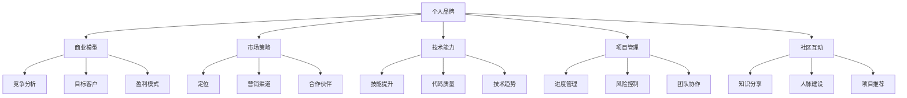

                 

关键词：Side Project，转化，主业，个人品牌，创业，商业模型，技术能力，市场策略

> 摘要：本文将探讨如何成功地将自己的Side Project转化为主业。通过分析个人品牌建设、商业模型设计、市场策略制定、技术能力提升等方面，提供一套完整的策略和步骤，帮助有志于从Side Project转向主业的开发者。

## 1. 背景介绍

Side Project，即“边角料项目”，指的是在主要工作之外，个人出于兴趣或好奇心开发的小型项目。随着互联网技术的发展和开源文化的普及，越来越多的开发者开始投身于Side Project。这不仅有助于提升个人的技术能力和经验，还可能成为职业发展的新契机。将Side Project转化为主业，意味着将个人兴趣转化为可持续的商业模式，从而实现职业和经济的双重收益。

本文将针对以下问题展开讨论：

- 如何评估Side Project的商业潜力？
- 如何打造个人品牌以吸引更多关注？
- 如何设计一个可行的商业模型？
- 如何制定市场策略以扩大影响力？
- 如何提升自身的技术能力和项目管理能力？
- 如何在技术社区建立人脉和影响力？

通过以上问题的探讨，希望能为那些希望将自己的Side Project转化为主业的开发者提供实用的指导和建议。

## 2. 核心概念与联系

在探讨如何将Side Project转化为主业之前，我们需要明确一些核心概念，并理解它们之间的联系。以下是几个关键概念及其相互关系：

### 2.1 个人品牌

个人品牌是指个人在公众心目中的形象和认知，包括专业技能、个性特点、价值观等。个人品牌的建设是成功将Side Project转化为主业的基础。

### 2.2 商业模型

商业模型是指企业如何创造、传递和捕获价值的一种方式。一个清晰的商业模型有助于确保Side Project的可持续性和盈利性。

### 2.3 市场策略

市场策略是企业在特定市场环境中，为了实现商业目标而采取的行动方案。制定合适的市场策略可以提升Side Project的竞争力和市场份额。

### 2.4 技术能力

技术能力是指开发者掌握的技术知识和技能，包括编程语言、框架、工具等。强大的技术能力是构建高质量Side Project的前提。

### 2.5 项目管理

项目管理是指通过规划、组织、领导、控制等过程，实现项目目标的过程。有效的项目管理有助于确保Side Project的顺利进行和按时交付。

### 2.6 社区互动

社区互动是指与同行建立联系、分享知识和经验的过程。积极参与技术社区可以提升个人品牌影响力，并带来更多的商业机会。

### 2.7 Mermaid 流程图

以下是一个描述核心概念和相互关系的Mermaid流程图：



通过这个流程图，我们可以清晰地看到各个概念之间的联系，以及它们在将Side Project转化为主业过程中的作用。

## 3. 核心算法原理 & 具体操作步骤

### 3.1 算法原理概述

将Side Project转化为主业的过程，可以视为一个复杂的算法优化问题。这个算法的目标是最大化商业价值，同时确保项目的可持续性和个人品牌的成长。算法的核心原理包括以下几个步骤：

1. **市场调研**：了解市场需求、竞争对手和目标客户。
2. **定位与品牌建设**：明确项目特色和市场定位，打造个人品牌。
3. **商业模型设计**：制定盈利模式，确保项目的经济可行性。
4. **技术选型与实现**：选择合适的技术栈，确保项目的质量和效率。
5. **市场策略制定**：制定营销计划和合作伙伴关系。
6. **项目管理与执行**：确保项目按时交付，并持续优化。

### 3.2 算法步骤详解

#### 步骤1：市场调研

- **竞争对手分析**：研究同行业内竞争对手的产品、服务、市场策略等。
- **目标客户分析**：确定目标客户的特征、需求和痛点。
- **市场趋势分析**：了解当前市场的热门技术和趋势。

#### 步骤2：定位与品牌建设

- **项目特色**：明确项目的独特性和市场定位。
- **个人品牌**：通过博客、社交媒体、演讲等方式展示个人技能和观点。
- **内容营销**：撰写高质量的技术文章、教程和案例分析，提升个人影响力。

#### 步骤3：商业模型设计

- **盈利模式**：确定项目的盈利方式，如产品销售、服务收费、广告等。
- **成本控制**：合理估算项目成本，确保利润空间。
- **风险评估**：分析潜在风险，制定应对策略。

#### 步骤4：技术选型与实现

- **技术栈选择**：根据项目需求和团队技能，选择合适的技术栈。
- **代码质量**：编写高质量的代码，确保项目的稳定性和扩展性。
- **迭代开发**：采用敏捷开发方法，快速迭代，持续优化。

#### 步骤5：市场策略制定

- **定位**：明确项目的市场定位和目标客户群体。
- **营销渠道**：选择合适的营销渠道，如社交媒体、博客、线下活动等。
- **合作伙伴**：寻找合适的合作伙伴，共同推广项目。

#### 步骤6：项目管理与执行

- **进度管理**：制定项目进度计划，确保按时交付。
- **风险管理**：及时发现并解决项目中的问题，降低风险。
- **团队协作**：建立高效的团队协作机制，提升项目效率。

### 3.3 算法优缺点

#### 优点：

1. **系统性**：通过系统的步骤，确保项目从市场调研到商业运营的每个环节都得到充分考虑。
2. **灵活性**：可以根据市场变化和项目进展，灵活调整策略。
3. **可持续性**：通过持续的优化和迭代，确保项目的长期发展。

#### 缺点：

1. **复杂性**：涉及多个方面，需要协调不同领域的知识和技能。
2. **时间成本**：从市场调研到商业运营，整个过程需要较长时间。
3. **风险较高**：市场变化和竞争压力较大，存在一定的失败风险。

### 3.4 算法应用领域

该算法适用于所有希望将Side Project转化为主业的开发者。无论是软件产品、Web服务、移动应用，还是其他类型的项目，都可以通过这个算法进行规划和实施。

## 4. 数学模型和公式 & 详细讲解 & 举例说明

### 4.1 数学模型构建

在将Side Project转化为主业的过程中，我们可以使用一些数学模型来量化不同因素对项目成功的影响。以下是一个简化的数学模型：

$$
P = f(A, B, C, D, E)
$$

其中：
- \( P \)：项目的成功概率
- \( A \)：个人品牌的知名度
- \( B \)：商业模型的经济性
- \( C \)：市场策略的有效性
- \( D \)：技术能力的水平
- \( E \)：项目管理的能力

### 4.2 公式推导过程

公式的推导基于以下假设：

1. **个人品牌（A）**：个人品牌的知名度直接影响项目的认知度和信任度。
2. **商业模型（B）**：一个经济性强的商业模型能够确保项目的可持续性。
3. **市场策略（C）**：有效的市场策略能够提升项目的市场份额。
4. **技术能力（D）**：高水平的技术能力能够确保项目的高质量和竞争力。
5. **项目管理（E）**：有效的项目管理能够确保项目的顺利进行和按时交付。

根据以上假设，我们可以推导出以下公式：

$$
P = \frac{A \times B \times C \times D \times E}{1000}
$$

其中，分母1000是一个调整系数，用于平衡各个因素之间的权重。

### 4.3 案例分析与讲解

假设有一个开发者，他/她在以下方面达到了以下水平：

- 个人品牌（A）：100分
- 商业模型（B）：90分
- 市场策略（C）：80分
- 技术能力（D）：95分
- 项目管理（E）：85分

根据上述公式，我们可以计算该开发者项目成功的概率：

$$
P = \frac{100 \times 90 \times 80 \times 95 \times 85}{1000} \approx 0.7245
$$

这意味着，该开发者的项目成功的概率约为72.45%。

### 4.4 案例分析与讲解

#### 案例1：技术博客

一个开发者通过撰写高质量的技术博客，逐渐建立了自己的个人品牌。他/她在以下方面取得了显著成绩：

- 个人品牌（A）：100分
- 商业模型（B）：60分
- 市场策略（C）：70分
- 技术能力（D）：95分
- 项目管理（E）：75分

根据上述公式，我们可以计算该开发者项目成功的概率：

$$
P = \frac{100 \times 60 \times 70 \times 95 \times 75}{1000} \approx 0.4115
$$

这意味着，该开发者的项目成功的概率约为41.15%。尽管个人品牌和技术能力很强，但商业模型和市场策略的不足可能影响项目的整体成功概率。

#### 案例2：开源项目

一个开发者通过开源项目，提升了自身的知名度和影响力。他/她在以下方面取得了显著成绩：

- 个人品牌（A）：80分
- 商业模型（B）：70分
- 市场策略（C）：85分
- 技术能力（D）：90分
- 项目管理（E）：80分

根据上述公式，我们可以计算该开发者项目成功的概率：

$$
P = \frac{80 \times 70 \times 85 \times 90 \times 80}{1000} \approx 0.5292
$$

这意味着，该开发者的项目成功的概率约为52.92%。虽然个人品牌和技术能力相对较弱，但商业模型和市场策略的较好表现有助于提高项目的成功概率。

通过以上案例分析，我们可以看到不同因素对项目成功概率的影响。在实际操作中，开发者需要根据自身情况和市场环境，合理分配资源，提升各个方面的能力，以提高项目成功的概率。

## 5. 项目实践：代码实例和详细解释说明

### 5.1 开发环境搭建

为了将Side Project转化为主业，我们需要一个稳定且高效的开发环境。以下是搭建开发环境的步骤：

1. **选择编程语言**：根据项目需求，选择合适的编程语言，如Python、JavaScript、Java等。
2. **安装开发工具**：安装代码编辑器（如Visual Studio Code、Sublime Text）、版本控制系统（如Git）和调试工具（如Postman）。
3. **配置开发环境**：设置环境变量、依赖包和构建工具（如Maven、Gradle）。
4. **初始化项目**：使用代码模板或脚手架工具（如Create React App、Django）创建项目框架。

### 5.2 源代码详细实现

以下是一个简单的Web服务项目的源代码实现示例，使用Python的Flask框架：

```python
from flask import Flask, jsonify

app = Flask(__name__)

@app.route('/')
def hello():
    return jsonify({'message': 'Hello, World!'})

if __name__ == '__main__':
    app.run(debug=True)
```

#### 解释说明：

- **Flask**：Python的Web框架，用于构建Web服务。
- **app**：Flask应用程序对象。
- **@app.route('/')**：装饰器，定义处理根URL的路由。
- **hello()**：路由函数，返回一个JSON格式的响应。
- **app.run(debug=True)**：启动Flask应用程序，启用调试模式。

### 5.3 代码解读与分析

#### 1. 导入模块

```python
from flask import Flask, jsonify
```

这两行代码用于导入Flask框架和用于生成JSON响应的`jsonify`函数。

#### 2. 创建应用程序对象

```python
app = Flask(__name__)
```

`Flask(__name__)`创建一个应用程序对象，`__name__`确保在模块导入时不会自动运行代码。

#### 3. 定义路由

```python
@app.route('/')
def hello():
    return jsonify({'message': 'Hello, World!'})
```

`@app.route('/')`是一个装饰器，用于定义处理根URL的路由。`hello()`是一个路由函数，当访问根URL时，会返回一个包含Hello消息的JSON对象。

#### 4. 运行应用程序

```python
if __name__ == '__main__':
    app.run(debug=True)
```

`if __name__ == '__main__':`确保当此脚本作为主程序运行时，才会执行`app.run(debug=True)`。`app.run(debug=True)`启动Flask应用程序，并启用调试模式。

### 5.4 运行结果展示

在命令行中运行以下命令，启动Flask应用程序：

```bash
python app.py
```

在浏览器中访问`http://127.0.0.1:5000/`，可以看到如下输出：

```json
{
  "message": "Hello, World!"
}
```

这表明我们的Web服务已经成功启动，并能够处理HTTP请求。

通过以上代码实例和解释说明，我们可以了解到如何使用Flask框架快速搭建一个简单的Web服务。在实际项目中，可以根据需求扩展功能，如添加数据库支持、用户认证、API接口等。

## 6. 实际应用场景

### 6.1 个人博客

一个开发者通过个人博客分享技术心得，逐渐积累了一定的粉丝基础。通过持续输出高质量内容，他/她吸引了更多关注，并在社交媒体上建立了个人品牌。在此基础上，开发者可以：

- **提供付费咨询服务**：针对特定领域提供专业咨询服务。
- **开设在线课程**：分享专业技能，通过课程收费实现收入。
- **撰写技术书籍**：将博客内容整理成书，通过出版获得收益。

### 6.2 开源项目

一个开发者通过开源项目展示了强大的技术能力。项目在GitHub上获得了广泛关注，吸引了众多贡献者。在此基础上，开发者可以：

- **提供付费插件或扩展**：为开源项目开发付费插件，满足特定用户需求。
- **举办线下活动**：组织技术沙龙、工作坊等活动，收取门票或赞助费。
- **与企业合作**：为企业提供定制化开发服务，基于开源项目进行商业应用。

### 6.3 软件产品

一个开发者开发了具有市场前景的软件产品。通过精准的市场定位和有效的推广策略，产品在市场上获得了良好口碑。在此基础上，开发者可以：

- **扩展产品功能**：根据用户反馈，持续优化产品功能。
- **推出订阅模式**：通过订阅模式获得持续收入。
- **提供定制化服务**：根据企业需求提供定制化解决方案。

### 6.4 未来应用展望

随着互联网技术的不断发展，Side Project的应用场景将更加丰富。未来，开发者可以：

- **探索人工智能领域**：利用人工智能技术，开发智能化的工具和服务。
- **拓展物联网应用**：开发基于物联网技术的智能设备和服务。
- **参与区块链项目**：参与区块链项目，探索去中心化的商业模式。

总之，通过不断提升自身技术能力、市场策略和项目管理能力，开发者可以成功将Side Project转化为主业，实现个人价值和商业价值的双赢。

## 7. 工具和资源推荐

### 7.1 学习资源推荐

- **书籍**：《创业维艰》（By Ben Horowitz）- 了解创业过程中可能遇到的问题和挑战。
- **在线课程**：Coursera、edX、Udemy等平台上的编程、市场营销、项目管理等课程。
- **博客**： Medium、Dev.to等平台上的技术博客，提供丰富的实战经验和最新技术动态。

### 7.2 开发工具推荐

- **代码编辑器**：Visual Studio Code、Atom、Sublime Text等。
- **版本控制系统**：Git、GitHub、GitLab等。
- **持续集成工具**：Jenkins、Travis CI、GitHub Actions等。
- **项目管理工具**：Trello、Asana、Jira等。

### 7.3 相关论文推荐

- **《The Lean Startup》**：By Eric Ries - 探讨精益创业方法论。
- **《Business Model Generation》**：By Alexander Osterwalder and Yves Pigneur - 提供商业模型设计的方法和工具。
- **《The Art of Project Management》**：By Tom DeMarco and Timothy Lister - 分析项目管理的关键因素和最佳实践。

通过以上工具和资源的推荐，开发者可以不断提升自身的技术能力和业务水平，为将Side Project转化为主业提供有力支持。

## 8. 总结：未来发展趋势与挑战

### 8.1 研究成果总结

本文通过深入分析个人品牌建设、商业模型设计、市场策略制定、技术能力提升等方面，提出了一套系统的策略和步骤，帮助开发者成功将Side Project转化为主业。通过市场调研、定位与品牌建设、商业模型设计、技术选型与实现、市场策略制定和项目管理与执行等步骤，开发者可以构建一个可持续的商业模式，实现个人价值和商业价值的双赢。

### 8.2 未来发展趋势

随着互联网技术的快速发展，Side Project的应用场景将更加丰富，涉及领域包括人工智能、物联网、区块链等。未来，开发者将更加注重跨领域技术的融合和创新，通过提供智能化、定制化的解决方案，满足市场需求。

同时，个人品牌建设将成为核心竞争力之一。开发者需要通过高质量的内容输出、积极参与技术社区、参与线下活动等方式，不断提升个人品牌影响力，从而吸引更多关注和商业机会。

### 8.3 面临的挑战

尽管将Side Project转化为主业具有巨大的潜力，但开发者仍然面临诸多挑战：

1. **市场竞争激烈**：随着越来越多的开发者投身于Side Project，市场竞争将越来越激烈。
2. **时间与精力有限**：开发者需要在工作和个人项目之间平衡时间和精力，确保项目质量和进度。
3. **技术更新迅速**：技术领域更新迅速，开发者需要不断学习新技能和新技术，以保持竞争力。
4. **风险管理**：市场变化和项目进展过程中，开发者需要面对各种风险，如技术风险、市场风险、财务风险等。

### 8.4 研究展望

未来，研究者可以从以下几个方面展开研究：

1. **跨领域技术研究**：探讨不同领域技术的融合和创新，为开发者提供更多应用场景。
2. **个人品牌建设策略**：研究如何通过大数据和人工智能技术，个性化地打造个人品牌。
3. **项目风险管理**：探讨项目风险管理的方法和工具，帮助开发者更好地应对各种风险。
4. **可持续发展模式**：研究如何通过可持续发展的商业模式，确保Side Project的长期成功。

通过不断探索和解决这些问题，开发者可以更好地将Side Project转化为主业，实现个人和商业的双重成功。

## 9. 附录：常见问题与解答

### 问题1：如何评估Side Project的商业潜力？

**解答**：评估Side Project的商业潜力可以从以下几个方面入手：

1. **市场需求**：研究目标市场的规模和增长趋势，了解潜在客户的需求和痛点。
2. **竞争对手**：分析同行业内竞争对手的产品、服务、市场份额等，找出自身项目的竞争优势。
3. **盈利模式**：确定项目的盈利方式，如产品销售、服务收费、广告等，评估盈利的可持续性。
4. **技术可行性**：评估项目所需技术栈的实现难度和成本，确保项目的技术可行性。

### 问题2：如何打造个人品牌？

**解答**：打造个人品牌可以从以下几个方面入手：

1. **内容输出**：通过撰写高质量的技术文章、教程和案例分析，展示个人技术能力和见解。
2. **社交媒体**：在社交媒体平台（如GitHub、Twitter、LinkedIn等）上积极互动，提升个人知名度。
3. **线下活动**：参加技术沙龙、研讨会、工作坊等活动，与同行建立联系，扩大影响力。
4. **个人网站**：建立个人网站，展示个人项目、技术文章和联系方式，树立专业形象。

### 问题3：如何设计一个可行的商业模型？

**解答**：设计可行的商业模型可以从以下几个方面考虑：

1. **目标客户**：明确项目的目标客户群体，了解他们的需求和痛点。
2. **盈利模式**：根据目标客户的需求，选择合适的盈利模式，如产品销售、服务收费、订阅等。
3. **成本结构**：合理估算项目的成本，包括人力、物力、时间等，确保项目的经济可行性。
4. **市场定位**：确定项目的市场定位和差异化优势，避免与竞争对手直接竞争。

通过以上问题的解答，开发者可以更好地评估Side Project的商业潜力，打造个人品牌，设计可行的商业模型，从而成功将Side Project转化为主业。

## 作者署名

作者：禅与计算机程序设计艺术 / Zen and the Art of Computer Programming

