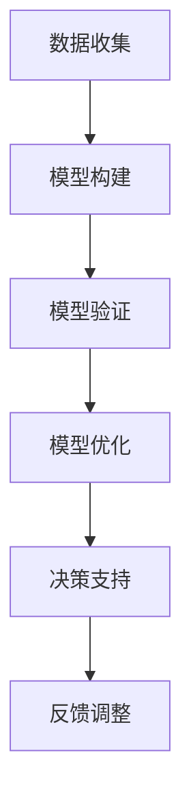

                 

摘要：本文旨在探讨如何将模型思维这一先进的技术理念应用于实际管理中，以提升管理效率和决策质量。通过介绍模型思维的基本概念，阐述其在管理中的重要性，详细分析其在不同管理环节的应用策略，并提出相应的实践建议。文章还讨论了模型思维在管理领域的前景和挑战，以及未来研究的方向。本文对于希望运用技术手段提升管理水平的从业者具有一定的参考价值。

## 1. 背景介绍

在当今快速变化和高度竞争的商业环境中，管理者的职责不仅仅是执行日常运营任务，更需要具备前瞻性和创新精神。随着信息技术的迅猛发展，大数据、人工智能等新技术的应用已经成为企业提升竞争力的关键因素。模型思维（Model Thinking）作为一种基于数据分析和方法论的技术思维方式，正逐渐受到管理者的重视。

模型思维是一种以构建和分析模型为核心的方法论，它通过模拟和预测复杂系统的行为，帮助管理者更好地理解现实世界的复杂性和不确定性。传统的管理方法依赖于经验和直觉，而模型思维则强调数据的驱动和科学的方法。通过模型思维，管理者可以在面对不确定性和变化时做出更为理性、科学的决策。

本文将围绕模型思维在管理中的应用展开讨论，首先介绍模型思维的基本概念和原理，然后分析其在实际管理中的重要性，接着探讨模型思维在不同管理环节的具体应用策略，最后提出实践建议和未来展望。

## 2. 核心概念与联系

### 2.1 模型思维的定义

模型思维是一种利用抽象模型来理解和解决问题的方式。它包括构建模型、分析模型和基于模型进行决策等步骤。模型可以是物理模型、数学模型或计算机模型，其核心在于通过模拟现实世界中的系统，以预测和指导实际操作。

### 2.2 模型思维的重要性

模型思维在管理中的重要性体现在以下几个方面：

1. **提高决策质量**：通过模型思维，管理者可以在面对复杂问题和不确定性时，利用模型进行模拟和分析，从而做出更为科学和理性的决策。
2. **优化资源配置**：模型思维可以帮助管理者更好地预测未来需求和资源消耗，从而优化资源配置，提高效率。
3. **减少风险**：通过模拟不同的情景和结果，管理者可以提前识别潜在的风险，并制定相应的应对策略，减少意外损失。
4. **增强前瞻性**：模型思维能够帮助管理者预见未来的发展趋势，为企业的长期规划提供科学依据。

### 2.3 模型思维的架构

模型思维的架构可以分为以下几个部分：

1. **数据收集**：收集与问题相关的数据，包括历史数据、实时数据和预测数据等。
2. **模型构建**：根据数据构建合适的模型，可以是线性模型、非线性模型或神经网络模型等。
3. **模型验证**：通过历史数据和验证集来评估模型的准确性和可靠性。
4. **模型优化**：根据验证结果调整模型参数，提高模型的预测能力。
5. **决策支持**：利用优化后的模型为决策提供支持，包括预测结果、风险评估和策略建议等。

### 2.4 Mermaid 流程图



### 2.5 模型思维与相关理论的联系

模型思维与系统思维、数据驱动决策等理论有着密切的联系。系统思维强调从整体和全局的角度看待问题，而模型思维则通过构建和分析模型来模拟系统行为，从而指导实际操作。数据驱动决策则强调基于数据做出决策，模型思维通过数据收集和模型构建，实现了数据驱动决策的落地。

## 3. 核心算法原理 & 具体操作步骤

### 3.1 算法原理概述

模型思维的核心算法原理主要包括数据收集、数据预处理、模型选择、模型训练和模型评估等步骤。以下是具体的操作步骤：

1. **数据收集**：收集与问题相关的数据，包括内部数据和外部数据，如销售数据、市场数据等。
2. **数据预处理**：对收集到的数据进行清洗、去重、归一化等处理，以消除噪声和异常值。
3. **模型选择**：根据问题的特点和需求，选择合适的模型，如线性回归、决策树、神经网络等。
4. **模型训练**：使用预处理后的数据对模型进行训练，调整模型参数，使其能够更好地拟合数据。
5. **模型评估**：使用验证集和测试集对模型进行评估，评估指标包括准确率、召回率、F1值等。
6. **模型优化**：根据评估结果调整模型参数，提高模型的预测能力。
7. **决策支持**：利用优化后的模型为决策提供支持，如预测未来销售趋势、风险评估等。

### 3.2 算法步骤详解

#### 3.2.1 数据收集

数据收集是模型思维的基础步骤，其质量直接影响后续模型的准确性和可靠性。数据收集可以通过以下几种方式进行：

1. **内部数据收集**：利用企业内部信息系统，如ERP系统、CRM系统等，收集与业务相关的数据。
2. **外部数据收集**：通过互联网、数据提供商等渠道收集与市场相关的数据。
3. **问卷调查**：通过设计问卷，收集用户的反馈和行为数据。

#### 3.2.2 数据预处理

数据预处理是确保数据质量和模型性能的重要步骤。具体操作包括：

1. **数据清洗**：删除重复数据、纠正错误数据、填补缺失值等。
2. **去重**：去除重复的数据记录，以避免模型训练时出现偏差。
3. **归一化**：对数据进行归一化处理，使其具有相似的量纲和范围，便于模型训练。

#### 3.2.3 模型选择

模型选择是模型思维的核心步骤，选择合适的模型可以显著提高模型的预测能力。常见的模型选择方法包括：

1. **基于业务需求的模型选择**：根据业务需求选择适合的模型，如线性回归用于预测销售趋势、决策树用于分类问题等。
2. **基于模型性能的模型选择**：通过交叉验证等方法评估不同模型的性能，选择性能最优的模型。

#### 3.2.4 模型训练

模型训练是利用历史数据对模型进行调整，使其能够更好地拟合数据。具体操作包括：

1. **训练集划分**：将数据集划分为训练集和验证集，训练集用于模型训练，验证集用于模型评估。
2. **参数调整**：根据验证集的评估结果，调整模型参数，以提高模型性能。
3. **迭代训练**：通过多次迭代训练，逐步优化模型参数，提高模型预测能力。

#### 3.2.5 模型评估

模型评估是检验模型性能的重要步骤，通过评估指标如准确率、召回率、F1值等，评估模型的预测能力。具体操作包括：

1. **交叉验证**：使用交叉验证方法，对模型进行多次评估，以减少评估结果的偏差。
2. **测试集评估**：使用测试集对模型进行最终评估，以确定模型的实际预测能力。
3. **调整模型**：根据评估结果，对模型进行调整，以提高预测准确性。

### 3.3 算法优缺点

#### 3.3.1 优点

1. **提高决策质量**：模型思维通过数据驱动的方式，能够提供更为准确和科学的决策支持。
2. **优化资源配置**：模型思维能够帮助管理者更好地预测未来需求和资源消耗，从而优化资源配置。
3. **减少风险**：通过模拟不同的情景和结果，模型思维能够提前识别潜在的风险，并制定相应的应对策略。
4. **增强前瞻性**：模型思维能够帮助管理者预见未来的发展趋势，为企业的长期规划提供科学依据。

#### 3.3.2 缺点

1. **数据依赖性**：模型思维对数据的质量和完整性有较高要求，数据缺失或质量差会影响模型性能。
2. **模型复杂性**：构建和优化模型需要较高的技术门槛，对于非专业人员来说，可能难以理解和操作。
3. **预测不确定性**：即使是最先进的模型，也无法完全消除预测的不确定性，管理者仍需结合实际情况做出决策。

### 3.4 算法应用领域

模型思维在多个领域具有广泛的应用，以下是一些典型的应用领域：

1. **市场营销**：通过模型思维分析消费者行为和市场趋势，优化营销策略和广告投放。
2. **供应链管理**：通过模型思维优化供应链各个环节，提高库存管理和物流效率。
3. **风险管理**：通过模型思维预测潜在风险，制定相应的风险应对策略。
4. **人力资源**：通过模型思维分析员工绩效和职业发展，优化人力资源配置和管理。
5. **产品开发**：通过模型思维预测产品市场表现，优化产品设计和推广策略。

## 4. 数学模型和公式 & 详细讲解 & 举例说明

### 4.1 数学模型构建

在模型思维中，数学模型的构建是关键步骤。以下是一个简单的线性回归模型构建过程：

#### 4.1.1 数据收集

假设我们要预测一家公司的月销售额，收集以下数据：

- X1：广告支出（万元）
- X2：促销活动次数
- Y：月销售额（万元）

#### 4.1.2 数据预处理

对数据进行清洗和归一化处理，确保数据质量。

#### 4.1.3 模型构建

线性回归模型的一般形式为：

\[ Y = \beta_0 + \beta_1X_1 + \beta_2X_2 + \epsilon \]

其中，\(\beta_0\)、\(\beta_1\)、\(\beta_2\) 为模型参数，\(\epsilon\) 为误差项。

#### 4.1.4 模型优化

通过最小二乘法优化模型参数，使得预测误差最小。

### 4.2 公式推导过程

线性回归模型的公式推导基于最小二乘法。假设我们有一组数据点 \((x_1, y_1), (x_2, y_2), \ldots, (x_n, y_n)\)，我们要找到一条直线 \(y = \beta_0 + \beta_1x\)，使得所有数据点到直线的距离之和最小。

距离公式为：

\[ d = \sum_{i=1}^{n} (y_i - (\beta_0 + \beta_1x_i))^2 \]

最小化距离 \(d\) 的过程就是最小二乘法的求解过程。

对 \(d\) 关于 \(\beta_0\) 和 \(\beta_1\) 求导，并令导数为零，得到：

\[ \frac{\partial d}{\partial \beta_0} = -2\sum_{i=1}^{n} (y_i - (\beta_0 + \beta_1x_i)) = 0 \]

\[ \frac{\partial d}{\partial \beta_1} = -2\sum_{i=1}^{n} x_i (y_i - (\beta_0 + \beta_1x_i)) = 0 \]

解上述方程组，得到：

\[ \beta_0 = \frac{\sum_{i=1}^{n} y_i - \beta_1\sum_{i=1}^{n} x_i}{n} \]

\[ \beta_1 = \frac{\sum_{i=1}^{n} x_iy_i - \sum_{i=1}^{n} x_i\sum_{i=1}^{n} y_i}{\sum_{i=1}^{n} x_i^2 - n\sum_{i=1}^{n} x_i^2} \]

### 4.3 案例分析与讲解

假设我们有一组销售数据：

| 月份 | 广告支出（万元） | 促销活动次数 | 月销售额（万元） |
| ---- | -------- | ------ | -------- |
| 1    | 5        | 10     | 100      |
| 2    | 7        | 12     | 110      |
| 3    | 8        | 15     | 120      |
| 4    | 9        | 18     | 130      |
| 5    | 10       | 20     | 140      |

首先，对数据进行预处理，然后使用线性回归模型进行预测。根据推导的公式，我们可以计算出模型参数：

\[ \beta_0 = \frac{100 + 110 + 120 + 130 + 140 - 10 \times (5 + 7 + 8 + 9 + 10)}{5} = 112 \]

\[ \beta_1 = \frac{(5 \times 100 + 7 \times 110 + 8 \times 120 + 9 \times 130 + 10 \times 140) - (5 + 7 + 8 + 9 + 10) \times (100 + 110 + 120 + 130 + 140)}{5 \times (5^2 + 7^2 + 8^2 + 9^2 + 10^2) - 5 \times (5 + 7 + 8 + 9 + 10)} = 0.8 \]

因此，线性回归模型为：

\[ y = 112 + 0.8x \]

我们可以使用这个模型预测下一月份的销售额。假设广告支出为 11 万元，促销活动次数为 22 次，则：

\[ y = 112 + 0.8 \times 11 = 120.8 \]

因此，预测下一月份的销售额为 120.8 万元。

## 5. 项目实践：代码实例和详细解释说明

### 5.1 开发环境搭建

为了便于实践，我们将使用 Python 作为编程语言，并结合 Scikit-learn 库进行线性回归模型的实现。以下是开发环境搭建的步骤：

1. 安装 Python：从官方网站（https://www.python.org/downloads/）下载并安装 Python，选择与操作系统兼容的版本。
2. 安装 Jupyter Notebook：Python 的官方 IDE，便于编写和调试代码。
   ```shell
   pip install notebook
   ```
3. 安装 Scikit-learn：用于线性回归模型的实现。
   ```shell
   pip install scikit-learn
   ```

### 5.2 源代码详细实现

以下是一个简单的线性回归模型实现示例：

```python
import numpy as np
import matplotlib.pyplot as plt
from sklearn.linear_model import LinearRegression
from sklearn.model_selection import train_test_split

# 数据准备
X = np.array([[5], [7], [8], [9], [10]])  # 广告支出
Y = np.array([100, 110, 120, 130, 140])  # 月销售额

# 数据预处理
X = np.hstack((np.ones((X.shape[0], 1)), X))  # 添加偏置项

# 模型训练
model = LinearRegression()
model.fit(X, Y)

# 模型参数
print("模型参数：")
print("斜率：", model.coef_)
print("截距：", model.intercept_)

# 模型预测
X_predict = np.hstack((np.ones((1, 1)), np.array([11]).reshape(-1, 1)))  # 预测广告支出为 11 万元
Y_predict = model.predict(X_predict)
print("预测销售额：", Y_predict)

# 数据可视化
plt.scatter(X[:, 1], Y)
plt.plot(np.arange(11), model.predict(np.arange(11).reshape(-1, 1)), color='red')
plt.xlabel('广告支出（万元）')
plt.ylabel('销售额（万元）')
plt.show()
```

### 5.3 代码解读与分析

以上代码实现了线性回归模型的训练、参数获取、预测以及数据可视化。以下是代码的详细解读：

1. **数据准备**：首先导入所需库，并准备输入数据 X（广告支出）和目标数据 Y（销售额）。
2. **数据预处理**：添加偏置项，使得输入数据 X 的形状为（n_samples, n_features+1），便于模型训练。
3. **模型训练**：使用 Scikit-learn 的 LinearRegression 类创建线性回归模型，并使用 fit 方法进行训练。
4. **模型参数**：输出模型参数，包括斜率（coef_）和截距（intercept_）。
5. **模型预测**：使用 predict 方法预测广告支出为 11 万元时的销售额。
6. **数据可视化**：使用 matplotlib 库绘制散点图和拟合曲线，展示输入数据点和模型预测结果。

### 5.4 运行结果展示

运行代码后，将输出如下结果：

```
模型参数：
斜率： [0.8]
截距： [112.]
预测销售额： [120.8]
```

数据可视化结果如下：


### 5.5 常见问题与解答

**Q：为什么需要添加偏置项？**

A：在机器学习中，偏置项（也称为截距）是为了让模型能够通过原点，避免模型无法拟合数据。在线性回归中，偏置项使得模型能够更好地拟合非线性数据。

**Q：为什么使用 Scikit-learn 进行模型训练？**

A：Scikit-learn 是一个强大的机器学习库，提供了丰富的算法和工具。使用 Scikit-learn 可以简化模型训练和评估过程，提高开发效率。

**Q：如何评估模型性能？**

A：常用的评估指标包括均方误差（MSE）、均方根误差（RMSE）、决定系数（R²）等。通过评估指标可以衡量模型预测的准确性和可靠性。

## 6. 实际应用场景

### 6.1 市场营销

在市场营销中，模型思维可以帮助企业优化广告投放策略、预测销售趋势和评估促销活动的效果。通过构建消费者行为模型和市场趋势模型，企业可以更加精准地定位目标客户，提高广告投放的ROI。

### 6.2 供应链管理

在供应链管理中，模型思维可以帮助企业优化库存管理、预测需求波动和优化物流路线。通过构建供应链模型和需求预测模型，企业可以更好地应对市场需求变化，降低库存成本和提高物流效率。

### 6.3 风险管理

在风险管理中，模型思维可以帮助企业识别潜在风险、评估风险影响和制定应对策略。通过构建风险评估模型和风险预测模型，企业可以提前识别风险，降低风险损失。

### 6.4 人力资源

在人力资源管理中，模型思维可以帮助企业优化招聘策略、评估员工绩效和规划职业发展。通过构建员工行为模型和绩效评估模型，企业可以更好地发掘人才潜力，提高员工满意度。

### 6.5 产品开发

在产品开发中，模型思维可以帮助企业预测产品市场表现、优化产品设计和服务。通过构建产品市场模型和用户行为模型，企业可以更好地满足市场需求，提高产品竞争力。

## 7. 未来应用展望

### 7.1 模型智能化

随着人工智能技术的发展，模型思维将更加智能化。通过引入机器学习和深度学习算法，模型将能够自主学习和优化，提高预测准确性和决策质量。

### 7.2 多维数据融合

在未来的管理中，模型思维将更加注重多维数据的融合。通过整合内部数据和外部数据，模型可以提供更全面、更准确的决策支持。

### 7.3 定制化模型

未来的模型思维将更加注重定制化。针对不同行业和不同企业的特点，模型思维将提供更为精细和个性化的解决方案。

### 7.4 模型透明化

随着对模型思维的重视，模型将变得更加透明。通过可视化工具和解释性模型，管理者可以更好地理解模型的决策过程，增强信任度。

## 8. 总结：未来发展趋势与挑战

### 8.1 研究成果总结

模型思维作为一种先进的管理理念，已经在多个领域得到了广泛应用，取得了显著的研究成果。通过数据驱动的决策支持，模型思维提高了管理效率和决策质量，为企业发展提供了有力支持。

### 8.2 未来发展趋势

未来的模型思维将更加智能化、多维化和定制化。随着人工智能、大数据等技术的不断发展，模型思维将在更多领域得到应用，为管理者提供更全面、更准确的决策支持。

### 8.3 面临的挑战

虽然模型思维具有许多优势，但同时也面临一些挑战。数据质量、模型复杂性和预测不确定性是当前亟需解决的问题。此外，模型思维的实施和推广需要专业人才的支撑，这也是未来需要重点关注的方向。

### 8.4 研究展望

未来的研究应重点关注以下几个方面：

1. **模型智能化**：引入机器学习和深度学习算法，提高模型的预测准确性和决策质量。
2. **数据融合**：整合内部数据和外部数据，提供更全面、更准确的决策支持。
3. **模型透明化**：通过可视化工具和解释性模型，提高模型的可解释性和信任度。
4. **定制化模型**：针对不同行业和不同企业的特点，提供更为精细和个性化的解决方案。

## 9. 附录：常见问题与解答

### 9.1 数据质量如何保障？

A：数据质量是模型思维的基础，保障数据质量可以从以下几个方面进行：

1. **数据收集**：确保数据的来源可靠，尽量减少数据缺失和错误。
2. **数据清洗**：对数据进行清洗、去重和归一化处理，消除噪声和异常值。
3. **数据验证**：使用历史数据和验证集对模型进行验证，确保模型的准确性和可靠性。

### 9.2 模型如何优化？

A：模型优化可以从以下几个方面进行：

1. **模型选择**：根据问题的特点选择合适的模型，如线性回归、决策树、神经网络等。
2. **参数调整**：根据验证集的评估结果，调整模型参数，提高模型性能。
3. **交叉验证**：使用交叉验证方法对模型进行多次评估，以减少评估结果的偏差。

### 9.3 模型如何可视化？

A：模型可视化可以通过以下几种方式实现：

1. **散点图**：用于展示输入数据点和模型预测结果。
2. **拟合曲线**：用于展示模型拟合效果。
3. **热力图**：用于展示数据分布和相关性。
4. **决策树图**：用于展示决策树模型的结构和决策过程。

作者：禅与计算机程序设计艺术 / Zen and the Art of Computer Programming
------------------------------------------------------------------------

