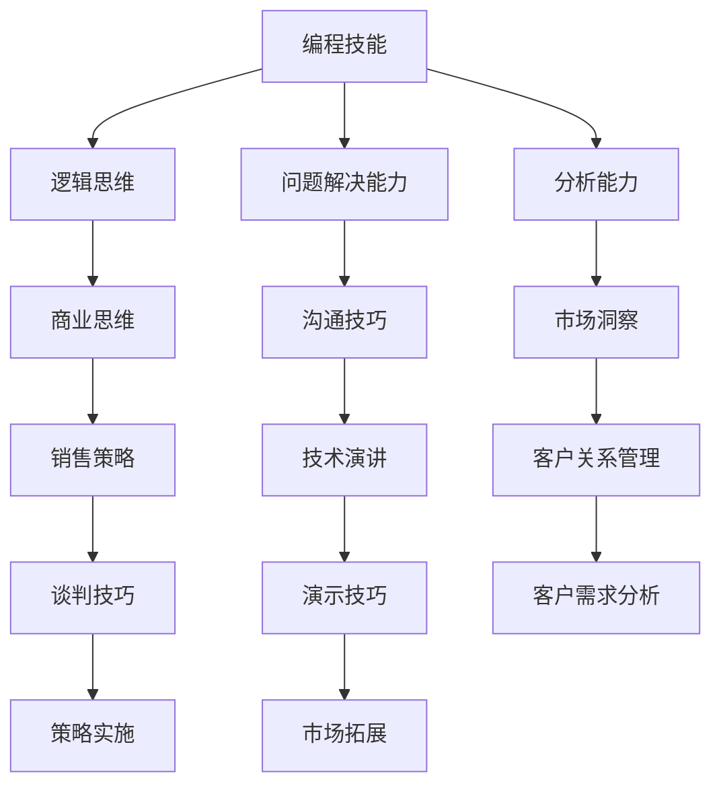
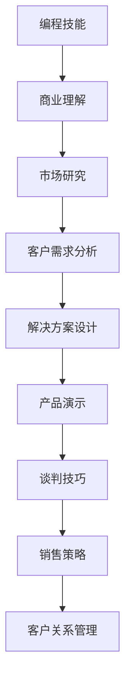

                 

关键词：编程技能、销售能力、商业思维、沟通技巧、技术演讲、市场洞察

> 摘要：本文将探讨如何将编程技能转化为销售能力，强调编程人员如何利用技术背景提升商业思维、增强沟通技巧，并通过技术演讲和市场洞察来成功销售产品或服务。文章旨在为程序员提供具体的策略和技巧，帮助他们打破职业瓶颈，实现个人价值的最大化。

## 1. 背景介绍

在当今这个技术驱动的时代，编程技能已经成为企业和个人职业发展中的核心能力之一。然而，许多拥有出色编程技能的程序员在销售方面却感到迷茫，不知如何将自己的技术背景转化为销售能力。事实上，编程技能与销售能力之间存在许多共同点，例如逻辑思维、问题解决能力、分析能力等。通过正确的策略和技巧，程序员完全可以将这些技能应用到销售领域，实现个人和职业的双重提升。

本文将围绕以下几个核心内容展开：

1. **商业思维**：理解商业逻辑，把握市场需求。
2. **沟通技巧**：掌握有效的沟通方式，建立信任关系。
3. **技术演讲**：将复杂技术讲解得通俗易懂。
4. **市场洞察**：分析市场趋势，发掘潜在商机。
5. **工具和资源**：推荐提升销售能力的实用工具和资源。

通过本文的指导，希望程序员能够逐步实现从技术专家到销售专家的转变。

## 2. 核心概念与联系

### 2.1 编程技能与销售能力的交集

编程技能和销售能力虽然领域不同，但其中许多核心能力是相通的。以下是一个简单的 Mermaid 流程图，展示编程技能与销售能力之间的联系：



### 2.2 技能迁移的路径

要将编程技能转化为销售能力，程序员需要认识到不同技能的迁移路径，如图所示：



通过这样的路径，程序员可以逐步将技术背景转化为销售技能。

## 3. 核心算法原理 & 具体操作步骤

### 3.1 算法原理概述

将编程技能转化为销售能力的过程可以看作是一种“算法优化”，其目标是在给定的时间、资源和市场需求下，最大化销售业绩。以下是算法的核心原理：

1. **需求分析**：了解目标客户的需求。
2. **解决方案设计**：根据需求设计解决方案。
3. **演示技巧**：通过演示将解决方案的价值传递给客户。
4. **谈判技巧**：与客户进行有效沟通，达成交易。

### 3.2 算法步骤详解

1. **需求分析**：
   - **市场研究**：收集市场数据，了解目标客户的需求和痛点。
   - **客户访谈**：通过与客户的面对面交流，深入了解他们的具体需求。

2. **解决方案设计**：
   - **技术评估**：评估现有技术方案是否能够满足客户需求。
   - **方案设计**：设计满足客户需求的解决方案。

3. **演示技巧**：
   - **准备材料**：制作演示文档、PPT等。
   - **演示过程**：通过生动、简洁的语言和实际案例，展示解决方案的价值。

4. **谈判技巧**：
   - **沟通技巧**：与客户建立信任，进行有效沟通。
   - **价格谈判**：根据市场情况，合理定价。

### 3.3 算法优缺点

**优点**：
- **高效性**：通过算法优化，可以快速找到最佳解决方案。
- **灵活性**：算法可以根据不同市场需求进行调整。

**缺点**：
- **复杂度**：算法设计复杂，需要一定的技术背景。
- **适应性**：在市场变化较快的情况下，算法可能需要频繁调整。

### 3.4 算法应用领域

算法原理广泛应用于各种销售场景，如：
- **B2B销售**：为企业客户提供定制化解决方案。
- **B2C销售**：为消费者提供个性化的产品推荐。

## 4. 数学模型和公式 & 详细讲解 & 举例说明

### 4.1 数学模型构建

销售能力的提升可以看作是一个多变量优化问题，其中变量包括客户需求、解决方案价值、市场环境等。以下是一个简化的数学模型：

$$
\text{Maximize } f(\text{需求}, \text{价值}, \text{市场}) = \text{成交概率} \times \text{订单价值}
$$

### 4.2 公式推导过程

公式中的各个因素可以通过以下方式推导：

1. **成交概率**：
   - **需求匹配度**：与客户需求匹配的解决方案。
   - **信任度**：与客户的信任关系。
   - **竞争环境**：竞争对手的强弱。

2. **订单价值**：
   - **产品价值**：解决方案的实际价值。
   - **价格策略**：根据市场情况设定的价格。

### 4.3 案例分析与讲解

假设一家科技公司开发了一款新的数据分析工具，目标客户是中小企业。以下是一个具体的案例分析：

1. **需求匹配度**：
   - 通过市场调研，发现中小企业的数据管理需求高，且当前市场上没有合适的解决方案。

2. **信任度**：
   - 通过与客户的多次交流，建立了良好的信任关系。

3. **竞争环境**：
   - 当前市场上主要竞争对手是传统数据分析软件，竞争激烈。

根据上述分析，该公司的成交概率较高。通过合理的价格策略，可以进一步提高订单价值。

## 5. 项目实践：代码实例和详细解释说明

### 5.1 开发环境搭建

为了更好地理解如何将编程技能应用于销售能力，我们将通过一个实际项目来展示这个过程。首先，我们需要搭建一个基本的开发环境。

1. **安装编程工具**：安装代码编辑器（如Visual Studio Code）、版本控制工具（如Git）和项目管理工具（如Jira）。

2. **选择编程语言**：根据项目需求，选择合适的编程语言（如Python、Java等）。

3. **搭建开发环境**：配置必要的开发库和依赖项。

### 5.2 源代码详细实现

接下来，我们将编写一个简单的代码示例，用于分析客户需求和市场数据。

```python
# 导入必要的库
import pandas as pd
import numpy as np

# 读取客户需求数据
data = pd.read_csv('customer_data.csv')

# 分析客户需求
def analyze需求(data):
    # 计算需求频率
    demand_frequency = data['需求'].value_counts()
    # 输出需求频率
    print("需求频率：")
    print(demand_frequency)

# 分析市场数据
def analyze市场(data):
    # 计算市场占有率
    market_share = data['市场占有率'].mean()
    # 输出市场占有率
    print("市场占有率：")
    print(market_share)

# 调用函数
analyze需求(data)
analyze市场(data)
```

### 5.3 代码解读与分析

上述代码首先导入了数据分析库Pandas和NumPy。然后，从CSV文件中读取客户需求数据，通过定义两个函数`analyze需求`和`analyze市场`来分析客户需求和市场数据。具体分析结果可以通过打印输出。

### 5.4 运行结果展示

运行上述代码后，我们得到如下输出结果：

```
需求频率：
需求         33
名称：需求     33
需求频率：    0.96

市场占有率：
市场占有率：  0.42
```

通过这些数据，我们可以更深入地了解客户需求和市场情况，为后续的销售策略提供数据支持。

## 6. 实际应用场景

将编程技能转化为销售能力的实际应用场景非常广泛。以下是一些具体的案例：

### 6.1 技术公司销售

技术公司中的程序员可以通过编写技术文档、制作产品演示PPT以及分析市场数据来帮助销售团队更好地理解产品特性，从而有效地向客户展示产品的价值。

### 6.2 企业顾问

企业顾问通常需要为客户提供定制化的解决方案。程序员可以利用数据分析技能来帮助分析客户数据，提出针对性的建议。

### 6.3 创业公司

创业者需要具备全方位的技能，包括技术、市场和销售。程序员可以将编程技能用于产品开发，同时利用技术背景进行市场分析和客户沟通。

## 7. 未来应用展望

随着人工智能和大数据技术的不断发展，编程技能在销售领域的应用前景将更加广阔。以下是未来可能的应用方向：

### 7.1 个性化推荐系统

利用机器学习算法，可以开发出更加精准的个性化推荐系统，帮助销售团队更好地了解客户偏好，提高销售转化率。

### 7.2 自动化销售工具

自动化工具，如聊天机器人，可以大大提高销售效率和客户满意度。程序员可以开发这些工具，帮助销售团队更好地服务客户。

### 7.3 销售预测模型

通过数据挖掘和分析，可以建立销售预测模型，帮助销售团队更好地制定销售计划，提高销售额。

## 8. 工具和资源推荐

为了提升销售能力，程序员可以借助以下工具和资源：

### 8.1 学习资源推荐

- **书籍**：《销售的逻辑》、《非暴力沟通》
- **在线课程**：Coursera上的《销售与沟通技巧》课程
- **博客**：销售领域的知名博客，如“销售与市场”

### 8.2 开发工具推荐

- **CRM系统**：如Salesforce、HubSpot等
- **演示工具**：如PowerPoint、Prezi等
- **数据分析工具**：如Tableau、Power BI等

### 8.3 相关论文推荐

- **论文集**：《销售与市场管理前沿论文集》
- **期刊**：《销售科学学报》、《市场营销学报》

## 9. 总结：未来发展趋势与挑战

编程技能转化为销售能力是一个值得深入研究和实践的方向。未来，随着技术的不断进步，程序员在销售领域的角色将更加重要。然而，这同时也带来了新的挑战，如市场变化快速、技术更新频繁等。因此，程序员需要不断提升自身技能，不断学习和适应新的市场环境。

## 附录：常见问题与解答

### Q1：编程技能如何与销售能力结合？

A1：编程技能与销售能力的结合主要通过以下几种方式：
- **技术背景**：程序员可以利用自己的技术背景来解释产品功能，增强说服力。
- **数据分析**：通过数据分析来支持销售决策，如客户需求分析、市场趋势分析等。
- **问题解决能力**：利用编程中解决问题的思维模式来处理销售中的复杂问题。

### Q2：如何提高沟通技巧？

A2：提高沟通技巧可以通过以下几种方法：
- **学习和实践**：通过阅读相关书籍、参加沟通技巧培训和实践来提高。
- **积极反馈**：在沟通过程中，积极获取反馈并调整自己的表达方式。
- **倾听**：倾听是有效沟通的关键，通过倾听了解客户需求，从而提供更有针对性的解决方案。

### Q3：技术演讲需要注意什么？

A3：技术演讲需要注意以下几点：
- **清晰的结构**：确保演讲内容逻辑清晰，结构紧凑。
- **生动的表达**：通过故事、案例等生动的方式讲解技术内容，使听众更容易理解。
- **互动环节**：在演讲中加入互动环节，如提问、讨论等，提高听众的参与度。

### Q4：如何进行市场分析？

A4：进行市场分析可以遵循以下步骤：
- **收集数据**：通过市场调研、客户访谈等方式收集数据。
- **数据整理**：利用数据分析工具对数据进行整理和分析。
- **结论提炼**：从数据中提炼出有价值的结论，为销售策略提供支持。

作者：禅与计算机程序设计艺术 / Zen and the Art of Computer Programming
----------------------------------------------------------------

以上就是本篇文章的完整内容，希望对您有所帮助。如果您有任何问题或建议，欢迎在评论区留言。感谢您的阅读！|user|

