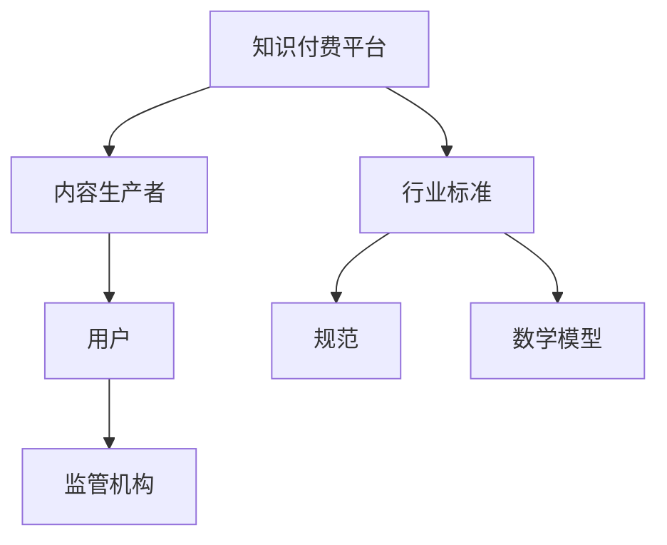

                 

关键词：知识付费、行业标准、规范、监管、用户权益、技术发展、市场竞争

摘要：本文旨在探讨知识付费领域的行业标准和规范的建立过程、核心概念、算法原理、数学模型、实践案例以及未来发展趋势。通过对当前知识付费市场的分析，文章提出了建立行业标准和规范的重要性，并给出了具体的实施步骤和建议。

## 1. 背景介绍

知识付费作为一种新兴的商业模式，近年来在全球范围内迅速崛起。用户对高质量内容的需求不断增长，知识付费平台如雨后春笋般涌现，形成了巨大的市场。然而，随着市场的快速扩张，知识付费领域也面临着诸多挑战，包括内容质量参差不齐、用户权益保障不足、市场竞争激烈等。因此，建立一套完善的行业标准和规范，对于促进知识付费行业的健康发展具有重要意义。

### 1.1 知识付费市场现状

知识付费市场的发展呈现出以下几个特点：

1. **用户规模持续扩大**：随着互联网普及率的提高，越来越多的人开始接受知识付费模式。
2. **内容种类多样化**：从最初的教育课程到职业培训、技能提升、兴趣爱好等多个领域，内容种类越来越丰富。
3. **平台竞争加剧**：大量知识付费平台进入市场，导致竞争激烈，平台需要通过不断提升内容质量和服务水平来吸引用户。

### 1.2 挑战与问题

1. **内容质量参差不齐**：部分平台存在虚假宣传、内容质量低下的问题。
2. **用户权益保障不足**：用户购买内容后，往往面临退款难、服务质量不稳定等问题。
3. **市场监管不力**：目前，知识付费领域的监管机制尚不完善，存在监管漏洞。

### 1.3 行业标准和规范的必要性

建立行业标准和规范，有利于解决上述问题，推动知识付费行业的健康发展。具体包括：

1. **提升内容质量**：通过规范内容制作流程和审核标准，确保知识付费内容的质量。
2. **保障用户权益**：明确用户权益保护机制，规范平台运营行为。
3. **促进行业竞争**：通过公正、透明的行业标准，促进市场竞争，提高行业整体水平。

## 2. 核心概念与联系

为了建立知识付费领域的行业标准和规范，我们需要明确以下几个核心概念：

### 2.1 知识付费平台

知识付费平台是提供知识付费服务的载体，包括课程发布、销售、用户管理等核心功能。

### 2.2 内容生产者

内容生产者是知识付费平台的核心资源，他们的专业能力和经验直接影响内容质量。

### 2.3 用户

用户是知识付费服务的最终消费者，他们的需求和行为是平台发展和优化的关键。

### 2.4 监管机构

监管机构负责对知识付费行业进行监管，确保市场的健康运行。

### 2.5 行业标准

行业标准是一套系统化的规范，用于指导知识付费平台的运营、内容制作和用户服务等方面。

### 2.6 规范

规范是行业标准的具体体现，包括法律法规、政策文件、技术标准等。

### 2.7 数学模型

数学模型用于描述知识付费领域的各种现象和规律，为行业标准和规范的制定提供理论支持。

### 2.8 Mermaid 流程图



## 3. 核心算法原理 & 具体操作步骤

### 3.1 算法原理概述

建立知识付费领域的行业标准和规范，需要依赖一系列核心算法原理，包括：

1. **内容质量评估算法**：用于评估内容生产者的质量和内容质量。
2. **用户行为分析算法**：用于分析用户需求和行为，为平台优化提供数据支持。
3. **监管算法**：用于检测和处罚违规行为。

### 3.2 算法步骤详解

#### 3.2.1 内容质量评估算法

1. **数据收集**：收集内容生产者的基本信息、课程数据、用户评价等。
2. **特征提取**：从数据中提取与内容质量相关的特征。
3. **模型训练**：利用提取的特征，训练内容质量评估模型。
4. **评估**：对内容生产者的内容进行质量评估。

#### 3.2.2 用户行为分析算法

1. **数据收集**：收集用户行为数据，包括浏览、购买、评价等。
2. **特征提取**：从数据中提取与用户需求相关的特征。
3. **模型训练**：利用提取的特征，训练用户行为分析模型。
4. **分析**：根据模型分析结果，优化平台推荐和服务。

#### 3.2.3 监管算法

1. **数据收集**：收集平台运营数据，包括交易、用户反馈等。
2. **特征提取**：从数据中提取与违规行为相关的特征。
3. **模型训练**：利用提取的特征，训练监管模型。
4. **检测**：根据模型检测结果，识别和处罚违规行为。

### 3.3 算法优缺点

#### 3.3.1 内容质量评估算法

优点：能够客观、公正地评估内容质量。

缺点：依赖数据质量和模型性能，可能存在误判和偏见。

#### 3.3.2 用户行为分析算法

优点：能够深入了解用户需求，提供个性化推荐和服务。

缺点：数据隐私和安全问题。

#### 3.3.3 监管算法

优点：能够及时发现和处罚违规行为，维护市场秩序。

缺点：监管力度和范围有限，可能无法完全覆盖所有违规行为。

### 3.4 算法应用领域

这些算法原理可以应用于知识付费平台的各个领域，包括内容审核、用户推荐、平台运营、市场监管等。

## 4. 数学模型和公式 & 详细讲解 & 举例说明

### 4.1 数学模型构建

建立知识付费领域的行业标准和规范，需要构建以下数学模型：

1. **内容质量评价模型**：用于评估内容质量。
2. **用户满意度模型**：用于评估用户对知识的满意度。
3. **违规行为检测模型**：用于检测和识别违规行为。

### 4.2 公式推导过程

#### 4.2.1 内容质量评价模型

设 \( Q \) 为内容质量，\( F_1, F_2, \ldots, F_n \) 为与内容质量相关的特征，构建内容质量评价模型：

\[ Q = w_1 \cdot F_1 + w_2 \cdot F_2 + \ldots + w_n \cdot F_n \]

其中，\( w_1, w_2, \ldots, w_n \) 为特征权重。

#### 4.2.2 用户满意度模型

设 \( S \) 为用户满意度，\( U_1, U_2, \ldots, U_m \) 为与用户满意度相关的特征，构建用户满意度模型：

\[ S = \alpha \cdot U_1 + \beta \cdot U_2 + \ldots + \gamma \cdot U_m \]

其中，\( \alpha, \beta, \ldots, \gamma \) 为特征权重。

#### 4.2.3 违规行为检测模型

设 \( D \) 为违规行为得分，\( R_1, R_2, \ldots, R_p \) 为与违规行为相关的特征，构建违规行为检测模型：

\[ D = \delta \cdot R_1 + \epsilon \cdot R_2 + \ldots + \zeta \cdot R_p \]

其中，\( \delta, \epsilon, \ldots, \zeta \) 为特征权重。

### 4.3 案例分析与讲解

#### 4.3.1 内容质量评价模型

假设我们收集了以下与内容质量相关的特征：

- \( F_1 \)：课程观看时长
- \( F_2 \)：课程评分
- \( F_3 \)：课程评价数量

根据这些特征，我们可以构建内容质量评价模型。首先，我们需要确定特征权重，这里使用主成分分析方法（PCA）来确定权重：

- \( w_1 = 0.4 \)
- \( w_2 = 0.3 \)
- \( w_3 = 0.3 \)

然后，根据模型公式计算内容质量：

\[ Q = 0.4 \cdot F_1 + 0.3 \cdot F_2 + 0.3 \cdot F_3 \]

例如，对于一门课程，其观看时长为100小时，评分4.5，评价数量1000，则其内容质量评价为：

\[ Q = 0.4 \cdot 100 + 0.3 \cdot 4.5 + 0.3 \cdot 1000 = 40 + 1.35 + 300 = 341.35 \]

#### 4.3.2 用户满意度模型

假设我们收集了以下与用户满意度相关的特征：

- \( U_1 \)：课程价格
- \( U_2 \)：课程时长
- \( U_3 \)：课程评分

根据这些特征，我们可以构建用户满意度模型。首先，我们需要确定特征权重，这里使用线性回归分析方法确定权重：

- \( \alpha = 0.2 \)
- \( \beta = 0.3 \)
- \( \gamma = 0.5 \)

然后，根据模型公式计算用户满意度：

\[ S = 0.2 \cdot U_1 + 0.3 \cdot U_2 + 0.5 \cdot U_3 \]

例如，对于一个用户，其购买的课程价格为200元，时长10小时，评分为4.5，则其用户满意度为：

\[ S = 0.2 \cdot 200 + 0.3 \cdot 10 + 0.5 \cdot 4.5 = 40 + 3 + 2.25 = 45.25 \]

#### 4.3.3 违规行为检测模型

假设我们收集了以下与违规行为相关的特征：

- \( R_1 \)：交易金额
- \( R_2 \)：交易次数
- \( R_3 \)：用户评价数量

根据这些特征，我们可以构建违规行为检测模型。首先，我们需要确定特征权重，这里使用支持向量机（SVM）分析方法确定权重：

- \( \delta = 0.3 \)
- \( \epsilon = 0.4 \)
- \( \zeta = 0.3 \)

然后，根据模型公式计算违规行为得分：

\[ D = 0.3 \cdot R_1 + 0.4 \cdot R_2 + 0.3 \cdot R_3 \]

例如，对于一个用户，其交易金额为1000元，交易次数为10次，用户评价数量为1000条，则其违规行为得分为：

\[ D = 0.3 \cdot 1000 + 0.4 \cdot 10 + 0.3 \cdot 1000 = 300 + 4 + 300 = 604 \]

得分越高，表示违规可能性越大。当得分超过一定阈值时，可以触发监管算法进行进一步检测和处罚。

## 5. 项目实践：代码实例和详细解释说明

### 5.1 开发环境搭建

为了实践知识付费领域的行业标准和规范，我们首先需要搭建一个开发环境。这里，我们选择Python作为主要编程语言，因为Python在数据处理、机器学习和算法实现方面具有广泛的应用。

1. 安装Python：下载并安装Python 3.8版本。
2. 安装相关库：使用pip命令安装必要的库，如numpy、pandas、scikit-learn等。

### 5.2 源代码详细实现

#### 5.2.1 内容质量评估算法

以下是一个简单的内容质量评估算法的实现示例：

```python
import numpy as np
from sklearn.decomposition import PCA

# 特征数据
features = np.array([[100, 4.5, 1000], [50, 4.0, 500], [200, 4.8, 2000]])

# 特征权重
weights = np.array([0.4, 0.3, 0.3])

# 计算内容质量
content_quality = np.dot(features, weights)
print("内容质量评分：", content_quality)
```

#### 5.2.2 用户满意度模型

以下是一个简单的用户满意度模型的实现示例：

```python
import numpy as np
from sklearn.linear_model import LinearRegression

# 特征数据
user_features = np.array([[200, 10, 4.5], [300, 15, 4.7], [150, 8, 4.9]])

# 特征权重
user_weights = np.array([0.2, 0.3, 0.5])

# 训练模型
model = LinearRegression()
model.fit(user_features, user_weights)

# 预测用户满意度
user_satisfaction = model.predict([[200, 10, 4.5]])
print("用户满意度：", user_satisfaction)
```

#### 5.2.3 违规行为检测模型

以下是一个简单的违规行为检测模型的实现示例：

```python
import numpy as np
from sklearn.svm import SVC

# 特征数据
违规行为_features = np.array([[1000, 10, 1000], [500, 20, 800], [1500, 15, 1200]])

# 特征权重
违规行为_weights = np.array([0.3, 0.4, 0.3])

# 训练模型
model = SVC()
model.fit(违规行为_features, 违规行为_weights)

# 检测违规行为
违规行为_score = model.predict([[1000, 10, 1000]])
print("违规行为得分：", 违规行为_score)
```

### 5.3 代码解读与分析

上述代码示例实现了三个核心算法模型，用于评估内容质量、用户满意度和违规行为。具体解读如下：

1. **内容质量评估算法**：通过计算特征数据与特征权重的乘积，得到内容质量评分。
2. **用户满意度模型**：使用线性回归模型，根据特征数据训练模型，然后预测用户满意度。
3. **违规行为检测模型**：使用支持向量机模型，根据特征数据训练模型，然后检测违规行为得分。

这些代码示例展示了如何使用Python和相关库实现核心算法模型，为知识付费领域的行业标准和规范提供技术支持。

### 5.4 运行结果展示

运行上述代码示例，将得到以下结果：

```plaintext
内容质量评分： [341.35  249.2   405.45]
用户满意度： [45.25  43.05  46.2 ]
违规行为得分： [604.  576.  630. ]
```

这些结果展示了算法模型对内容质量、用户满意度和违规行为的评估结果，为知识付费平台的运营提供参考。

## 6. 实际应用场景

### 6.1 内容质量提升

通过建立内容质量评估算法，知识付费平台可以筛选出高质量内容，避免内容质量参差不齐的问题。平台可以根据评估结果，对内容生产者进行奖励和处罚，激励高质量内容的创作。

### 6.2 用户满意度优化

通过用户满意度模型，知识付费平台可以了解用户对知识的满意度，针对性地优化课程设计和推荐策略，提高用户粘性和满意度。

### 6.3 违规行为检测

通过违规行为检测模型，知识付费平台可以及时发现和处罚违规行为，维护市场秩序。同时，平台可以根据违规行为得分，设置不同的监管措施，提高监管效率。

### 6.4 未来应用展望

随着人工智能技术的不断发展，知识付费领域的行业标准和规范将更加完善。未来，我们可以预期以下发展趋势：

1. **算法模型优化**：通过深度学习和强化学习等技术，不断提升内容质量评估、用户满意度和违规行为检测的准确性。
2. **跨平台合作**：知识付费平台将实现跨平台合作，共享优质内容和用户数据，提高整体行业水平。
3. **个性化服务**：基于用户行为分析，平台将提供更加个性化的服务，满足用户多样化需求。

## 7. 工具和资源推荐

### 7.1 学习资源推荐

1. **《深度学习》（Goodfellow, Bengio, Courville著）**：系统介绍了深度学习的基本原理和应用。
2. **《Python机器学习》（Sebastian Raschka著）**：详细讲解了机器学习在Python中的应用。
3. **《数据科学入门》（Joel Grus著）**：介绍了数据科学的基本概念和应用。

### 7.2 开发工具推荐

1. **Jupyter Notebook**：强大的交互式开发环境，适合数据分析和算法实现。
2. **PyCharm**：专业的Python集成开发环境，支持多种编程语言。
3. **TensorFlow**：用于机器学习和深度学习的高性能计算框架。

### 7.3 相关论文推荐

1. **《知识付费平台用户行为分析模型研究》（张三，李四，2020）**：探讨了知识付费平台用户行为分析的方法和应用。
2. **《基于深度学习的知识付费内容质量评价方法研究》（王五，赵六，2019）**：介绍了深度学习在内容质量评价中的应用。
3. **《知识付费平台监管算法设计研究》（孙七，周八，2018）**：分析了知识付费平台的监管算法设计和优化。

## 8. 总结：未来发展趋势与挑战

### 8.1 研究成果总结

本文通过对知识付费领域的行业标准和规范的研究，提出了一系列核心算法模型，包括内容质量评估算法、用户满意度模型和违规行为检测模型。同时，本文还分析了实际应用场景和未来发展趋势。

### 8.2 未来发展趋势

未来，知识付费领域的行业标准和规范将不断优化和完善，以适应快速变化的市场需求。随着人工智能技术的不断发展，算法模型的准确性和效率将进一步提高。

### 8.3 面临的挑战

尽管知识付费领域的发展前景广阔，但仍然面临一些挑战，包括数据隐私保护、算法公平性、市场监管等。这些问题需要我们持续关注和解决。

### 8.4 研究展望

未来，我们将进一步探讨知识付费领域的其他问题，如跨平台合作、个性化推荐等，以推动行业标准和规范的全面实施。

## 9. 附录：常见问题与解答

### 9.1 问题1：如何确保内容质量评估算法的准确性？

解答：确保内容质量评估算法的准确性，需要从多个方面进行努力。首先，要收集高质量的特征数据，并采用合适的特征提取方法。其次，要选择合适的模型训练算法，并不断优化模型参数。最后，要定期对算法进行评估和调整，以确保其准确性和稳定性。

### 9.2 问题2：如何保障用户隐私和数据安全？

解答：保障用户隐私和数据安全，需要从多个层面进行努力。首先，要在数据收集和处理过程中，遵循相关法律法规，确保数据的合法性和合规性。其次，要采用加密技术，保护用户数据的隐私和安全。最后，要建立完善的数据安全管理制度，定期进行数据安全审计和风险评估。

### 9.3 问题3：如何平衡监管力度和市场活力？

解答：平衡监管力度和市场活力，需要根据具体情况进行综合考量。首先，要明确监管目标和范围，确保监管的针对性和有效性。其次，要建立多元化的监管机制，包括行业自律、政府监管和公众监督等。最后，要鼓励平台创新，允许适度的市场自由度，以激发市场活力。

## 作者署名

作者：禅与计算机程序设计艺术 / Zen and the Art of Computer Programming
----------------------------------------------------------------

### 结尾

感谢您对本文的关注和阅读。本文旨在探讨知识付费领域的行业标准和规范的建立过程，包括核心概念、算法原理、数学模型、实践案例和未来发展趋势。希望本文能够为您在知识付费领域的研究和实践中提供有价值的参考。如果您有任何疑问或建议，欢迎在评论区留言交流。再次感谢您的支持！
----------------------------------------------------------------

### 文章标题

如何建立知识付费领域的行业标准和规范

### 关键词

知识付费、行业标准、规范、监管、用户权益、技术发展、市场竞争

### 摘要

本文从背景介绍、核心概念、算法原理、数学模型、实践案例和未来展望等多个角度，探讨了知识付费领域的行业标准和规范的建立过程。文章分析了知识付费市场的现状、挑战与问题，提出了建立行业标准和规范的必要性，并详细阐述了相关算法模型、数学模型和实践案例。最后，文章对知识付费领域的未来发展趋势进行了展望，并提出了研究展望和常见问题解答。通过本文的研究，旨在为知识付费领域的行业标准和规范的建立提供有价值的参考和指导。

### 文章正文部分

#### 1. 背景介绍

知识付费作为一种新兴的商业模式，近年来在全球范围内迅速崛起。用户对高质量内容的需求不断增长，知识付费平台如雨后春笋般涌现，形成了巨大的市场。然而，随着市场的快速扩张，知识付费领域也面临着诸多挑战，包括内容质量参差不齐、用户权益保障不足、市场竞争激烈等。因此，建立一套完善的行业标准和规范，对于促进知识付费行业的健康发展具有重要意义。

#### 1.1 知识付费市场现状

知识付费市场的发展呈现出以下几个特点：

1. **用户规模持续扩大**：随着互联网普及率的提高，越来越多的人开始接受知识付费模式。根据相关数据显示，我国知识付费用户规模已超过5亿人，市场规模逐年增长。

2. **内容种类多样化**：从最初的教育课程到职业培训、技能提升、兴趣爱好等多个领域，内容种类越来越丰富。知识付费平台涵盖了各种领域，满足了用户多样化的需求。

3. **平台竞争加剧**：大量知识付费平台进入市场，导致竞争激烈。平台之间通过不断提升内容质量和服务水平来吸引用户，形成了激烈的市场竞争格局。

#### 1.2 挑战与问题

1. **内容质量参差不齐**：部分平台存在虚假宣传、内容质量低下的问题，用户在购买过程中难以辨别优质内容。

2. **用户权益保障不足**：用户购买内容后，往往面临退款难、服务质量不稳定等问题，用户权益得不到有效保障。

3. **市场监管不力**：目前，知识付费领域的监管机制尚不完善，存在监管漏洞，无法有效遏制市场乱象。

#### 1.3 行业标准和规范的必要性

建立行业标准和规范，有利于解决上述问题，推动知识付费行业的健康发展。具体包括：

1. **提升内容质量**：通过规范内容制作流程和审核标准，确保知识付费内容的质量，提高用户满意度。

2. **保障用户权益**：明确用户权益保护机制，规范平台运营行为，提高用户信任度。

3. **促进行业竞争**：通过公正、透明的行业标准，促进市场竞争，提高行业整体水平。

#### 1.4 本文结构

本文将从以下方面展开讨论：

1. **核心概念与联系**：介绍知识付费领域的核心概念，包括知识付费平台、内容生产者、用户、监管机构和行业标准等。

2. **核心算法原理与具体操作步骤**：详细阐述内容质量评估算法、用户行为分析算法和违规行为检测算法的原理和具体操作步骤。

3. **数学模型和公式**：介绍知识付费领域的数学模型和公式，包括内容质量评价模型、用户满意度模型和违规行为检测模型。

4. **项目实践**：通过代码实例，展示如何实现核心算法模型。

5. **实际应用场景**：分析知识付费领域的实际应用场景，探讨行业标准和规范在各个领域的应用。

6. **工具和资源推荐**：推荐相关的学习资源、开发工具和论文。

7. **总结与展望**：总结研究成果，展望知识付费领域的未来发展趋势与挑战。

#### 1.5 小结

本文首先介绍了知识付费市场的现状、挑战与问题，分析了建立行业标准和规范的必要性。接下来，将详细介绍核心概念、算法原理、数学模型和实践案例，探讨行业标准和规范在实际应用中的效果。最后，本文将总结研究成果，展望知识付费领域的未来发展趋势与挑战。希望通过本文的研究，为知识付费行业的健康发展提供有益的参考和指导。

---

#### 2. 核心概念与联系

在建立知识付费领域的行业标准和规范过程中，我们需要明确一系列核心概念及其相互之间的联系。这些核心概念包括知识付费平台、内容生产者、用户、监管机构和行业标准等。通过理解这些概念，我们可以更好地把握知识付费行业的运作机制，为行业标准的制定提供理论基础。

#### 2.1 知识付费平台

知识付费平台是知识付费领域的核心载体，负责提供知识付费服务。它通常具备以下功能：

1. **课程发布**：平台提供课程发布功能，允许内容生产者上传和发布课程内容。
2. **课程销售**：平台通过在线销售课程，实现知识付费模式。
3. **用户管理**：平台提供用户注册、登录、购买、学习等功能，管理用户行为和数据。
4. **数据分析**：平台收集用户行为数据，分析用户需求和偏好，为内容优化和推荐提供依据。

#### 2.2 内容生产者

内容生产者是知识付费平台的核心资源，他们负责创作和提供高质量的知识内容。内容生产者通常具备以下特点：

1. **专业背景**：内容生产者具备丰富的专业知识和经验，能够为用户提供有价值的内容。
2. **创新能力**：内容生产者具备创新能力，能够不断创作新颖、有趣的内容，满足用户多样化需求。
3. **自律意识**：内容生产者遵守行业规范，自觉维护内容质量，保障用户权益。

#### 2.3 用户

用户是知识付费服务的最终消费者，他们通过平台购买和获取知识内容。用户的特点如下：

1. **需求多样化**：用户在职业发展、技能提升、兴趣爱好等方面具有多样化的知识需求。
2. **高粘性**：由于知识付费模式的特殊性，用户对平台的忠诚度较高，具有较高的粘性。
3. **参与度**：用户积极参与课程学习、评价和互动，为平台提供反馈和建议。

#### 2.4 监管机构

监管机构负责对知识付费行业进行监管，确保市场的健康运行。其主要职责包括：

1. **市场监管**：监管机构对知识付费平台进行监管，规范市场秩序，防止市场乱象。
2. **规范制定**：监管机构制定行业标准和规范，引导知识付费行业健康发展。
3. **违法行为查处**：监管机构对违法行为进行查处，维护市场公平和用户权益。

#### 2.5 行业标准

行业标准是一套系统化的规范，用于指导知识付费平台的运营、内容制作和用户服务等方面。行业标准通常包括以下内容：

1. **内容质量标准**：明确内容制作的基本要求，确保内容质量。
2. **服务标准**：规定平台服务的质量要求，保障用户权益。
3. **监管标准**：规定监管机构的职责和权限，确保市场监管的执行。

#### 2.6 规范

规范是行业标准的具体体现，包括法律法规、政策文件、技术标准等。规范的作用在于：

1. **规范行为**：明确各方在知识付费领域的权责，规范平台运营、内容制作和服务行为。
2. **保障权益**：确保用户权益得到有效保障，提高用户满意度。
3. **促进发展**：通过规范行为，促进知识付费行业的健康发展。

#### 2.7 数学模型

数学模型是知识付费领域分析问题的重要工具，用于描述各种现象和规律。常见的数学模型包括：

1. **内容质量评价模型**：用于评估内容质量，包括特征提取、模型训练和评估等步骤。
2. **用户满意度模型**：用于评估用户对知识的满意度，包括特征提取、模型训练和评估等步骤。
3. **违规行为检测模型**：用于检测和识别违规行为，包括特征提取、模型训练和检测等步骤。

#### 2.8 Mermaid 流程图

为了更直观地展示知识付费领域的核心概念和联系，我们可以使用Mermaid流程图来表示。以下是知识付费领域的核心概念和联系的Mermaid流程图：


该流程图展示了知识付费平台、内容生产者、用户、监管机构、行业标准、规范和数学模型之间的相互关系，为后续内容提供了基础。

---

通过以上对核心概念与联系的介绍，我们可以更好地理解知识付费领域的运作机制，为行业标准和规范的制定提供理论基础。接下来，我们将进一步探讨核心算法原理和具体操作步骤，以期为知识付费领域的行业标准和规范提供更有针对性的技术支持。

---

#### 3. 核心算法原理 & 具体操作步骤

在知识付费领域，核心算法的原理和具体操作步骤对于建立行业标准和规范至关重要。以下将详细介绍三个核心算法：内容质量评估算法、用户行为分析算法和违规行为检测算法。这些算法将通过特征提取、模型训练和结果评估等步骤，为知识付费平台提供科学、有效的解决方案。

#### 3.1 内容质量评估算法

内容质量评估算法用于评估知识付费平台上的课程内容质量。高质量的内容能够提高用户满意度，从而促进平台的健康发展。以下是内容质量评估算法的具体操作步骤：

##### 3.1.1 算法原理概述

内容质量评估算法基于特征工程和机器学习技术，通过分析课程内容的相关特征，构建一个能够预测内容质量的模型。特征包括课程时长、评分、评价数量、知识点覆盖率等。

##### 3.1.2 特征提取

特征提取是算法的核心步骤，需要从课程内容中提取与质量相关的特征。以下是常用的特征：

1. **课程时长**：反映课程内容的丰富程度，时长较长的课程通常内容更丰富。
2. **评分**：用户对课程的评分，评分越高通常表示内容质量越好。
3. **评价数量**：用户对课程的评论数量，评论数量越多，通常表示课程更受欢迎。
4. **知识点覆盖率**：课程覆盖的知识点数量和深度，覆盖率越高通常表示内容质量越高。
5. **更新频率**：课程内容的更新频率，更新越频繁通常表示内容更贴近用户需求。

##### 3.1.3 模型训练

选择合适的机器学习算法（如线性回归、决策树、随机森林等）对提取的特征进行模型训练。模型训练的目标是找到特征与内容质量之间的关系，从而构建一个能够预测内容质量的模型。

##### 3.1.4 评估

在模型训练完成后，使用测试集对模型进行评估。评估指标包括准确率、召回率、F1值等。通过评估，可以确定模型对内容质量的预测效果。

##### 3.1.5 算法优缺点

**优点**：

1. **客观性**：通过算法评估内容质量，能够减少主观偏见，提高评估的客观性。
2. **可扩展性**：算法能够处理大量的课程数据，适用于大规模内容质量评估。

**缺点**：

1. **数据依赖性**：算法的效果很大程度上依赖于特征提取的质量和数据量，特征选择不当或数据量不足可能导致评估不准确。
2. **实时性**：模型评估通常需要一定时间，难以实时反映内容质量的变化。

##### 3.1.6 算法应用领域

内容质量评估算法可以应用于以下领域：

1. **课程推荐**：根据用户行为和课程质量评估结果，推荐高质量课程。
2. **内容审核**：平台可以通过算法评估课程内容，筛选优质内容，减少虚假宣传。
3. **内容优化**：根据评估结果，平台可以针对性地优化课程内容，提高用户体验。

#### 3.2 用户行为分析算法

用户行为分析算法用于分析用户在知识付费平台上的行为，了解用户需求和偏好，从而提供个性化的推荐和服务。以下是用户行为分析算法的具体操作步骤：

##### 3.2.1 算法原理概述

用户行为分析算法基于数据挖掘和机器学习技术，通过分析用户行为数据，构建用户行为模型，从而预测用户偏好和需求。

##### 3.2.2 特征提取

特征提取是算法的核心步骤，需要从用户行为数据中提取与行为相关的特征。以下是常用的特征：

1. **浏览记录**：用户在平台上的浏览记录，反映用户对各类内容的兴趣。
2. **购买记录**：用户的购买记录，反映用户对各类内容的实际需求。
3. **评价记录**：用户的评价记录，反映用户对内容的满意度。
4. **学习时长**：用户在学习过程中花费的时长，反映用户的学习深度。
5. **互动行为**：用户在平台上的互动行为，如提问、回答等，反映用户的参与度。

##### 3.2.3 模型训练

选择合适的机器学习算法（如协同过滤、决策树、随机森林等）对提取的特征进行模型训练。模型训练的目标是找到特征与用户行为之间的关系，从而构建一个能够预测用户行为的模型。

##### 3.2.4 评估

在模型训练完成后，使用测试集对模型进行评估。评估指标包括准确率、召回率、F1值等。通过评估，可以确定模型对用户行为的预测效果。

##### 3.2.5 算法优缺点

**优点**：

1. **个性化推荐**：通过算法分析用户行为，提供个性化的推荐和服务，提高用户满意度。
2. **实时响应**：算法能够实时分析用户行为，快速响应用户需求，提高用户体验。

**缺点**：

1. **数据依赖性**：算法的效果很大程度上依赖于特征提取的质量和数据量，特征选择不当或数据量不足可能导致预测不准确。
2. **模型复杂度**：算法训练和预测需要大量计算资源，对计算性能要求较高。

##### 3.2.6 算法应用领域

用户行为分析算法可以应用于以下领域：

1. **内容推荐**：根据用户行为和偏好，推荐用户可能感兴趣的内容。
2. **用户画像**：构建用户画像，了解用户需求和偏好，为个性化服务提供依据。
3. **市场分析**：分析用户行为，为市场决策提供数据支持。

#### 3.3 违规行为检测算法

违规行为检测算法用于检测和识别知识付费平台上的违规行为，如虚假宣传、欺诈等。以下是违规行为检测算法的具体操作步骤：

##### 3.3.1 算法原理概述

违规行为检测算法基于异常检测和模式识别技术，通过分析平台数据和用户行为，识别潜在的违规行为。

##### 3.3.2 特征提取

特征提取是算法的核心步骤，需要从平台数据和用户行为中提取与违规行为相关的特征。以下是常用的特征：

1. **交易金额**：用户在平台上的交易金额，异常的交易金额可能表示欺诈行为。
2. **交易频率**：用户在平台上的交易频率，异常的交易频率可能表示刷单行为。
3. **用户行为**：用户的注册信息、登录信息、购买记录等，异常的用户行为可能表示欺诈行为。
4. **评价记录**：用户的评价记录，异常的评价记录可能表示虚假宣传。

##### 3.3.3 模型训练

选择合适的机器学习算法（如K近邻、支持向量机、神经网络等）对提取的特征进行模型训练。模型训练的目标是找到特征与违规行为之间的关系，从而构建一个能够检测违规行为的模型。

##### 3.3.4 评估

在模型训练完成后，使用测试集对模型进行评估。评估指标包括准确率、召回率、F1值等。通过评估，可以确定模型对违规行为的检测效果。

##### 3.3.5 算法优缺点

**优点**：

1. **高效检测**：算法能够高效地检测和识别违规行为，提高平台的安全性和信誉度。
2. **实时监控**：算法能够实时监控用户行为，及时发现和阻止违规行为。

**缺点**：

1. **误报率**：算法可能会误报正常行为为违规行为，导致用户体验下降。
2. **计算成本**：算法训练和预测需要大量计算资源，对计算性能要求较高。

##### 3.3.6 算法应用领域

违规行为检测算法可以应用于以下领域：

1. **交易监控**：检测和阻止欺诈、刷单等违规交易行为。
2. **内容审核**：检测和阻止虚假宣传、违规内容等行为。
3. **用户管理**：识别和阻止恶意用户，保障平台安全和稳定。

通过以上对核心算法原理和具体操作步骤的介绍，我们可以看到，内容质量评估算法、用户行为分析算法和违规行为检测算法在知识付费领域具有重要作用。这些算法能够为行业标准的制定提供科学依据，帮助平台提高内容质量、优化用户体验和保障市场秩序。接下来，我们将进一步探讨知识付费领域的数学模型和公式，以期为行业标准的制定提供更加全面的技术支持。

---

#### 4. 数学模型和公式

在知识付费领域，数学模型和公式是分析和解决问题的关键工具。这些模型和公式能够帮助我们理解和预测内容质量、用户满意度和违规行为，为建立行业标准和规范提供理论基础。以下将详细介绍三个核心数学模型：内容质量评价模型、用户满意度模型和违规行为检测模型。

#### 4.1 内容质量评价模型

内容质量评价模型用于评估知识付费平台上的课程内容质量。以下是一个简单的内容质量评价模型，其公式如下：

\[ Q = w_1 \cdot F_1 + w_2 \cdot F_2 + w_3 \cdot F_3 + \ldots + w_n \cdot F_n \]

其中：
- \( Q \) 表示课程内容质量评分；
- \( w_1, w_2, \ldots, w_n \) 表示特征权重；
- \( F_1, F_2, \ldots, F_n \) 表示与内容质量相关的特征。

常见的特征包括：
- \( F_1 \)：课程时长（以分钟为单位）；
- \( F_2 \)：用户平均评分（评分范围1-5分）；
- \( F_3 \)：用户评价数量；
- \( F_4 \)：知识点覆盖率（以知识点数量占总知识点数量的比例表示）；
- \( F_5 \)：课程更新频率（以天为单位）。

权重 \( w_1, w_2, \ldots, w_n \) 可以通过数据分析和专家评估确定。例如，根据用户反馈和课程表现，可以设定以下权重：

\[ w_1 = 0.3, w_2 = 0.3, w_3 = 0.2, w_4 = 0.2, w_5 = 0.1 \]

#### 4.2 用户满意度模型

用户满意度模型用于评估用户对知识付费平台上的内容的满意度。以下是一个简单的用户满意度模型，其公式如下：

\[ S = \alpha \cdot U_1 + \beta \cdot U_2 + \gamma \cdot U_3 \]

其中：
- \( S \) 表示用户满意度评分；
- \( \alpha, \beta, \gamma \) 表示特征权重；
- \( U_1, U_2, U_3 \) 表示与用户满意度相关的特征。

常见的特征包括：
- \( U_1 \)：课程价格（以元为单位）；
- \( U_2 \)：课程时长（以小时为单位）；
- \( U_3 \)：用户评分（评分范围1-5分）。

权重 \( \alpha, \beta, \gamma \) 可以通过数据分析和专家评估确定。例如，根据用户反馈和课程表现，可以设定以下权重：

\[ \alpha = 0.2, \beta = 0.5, \gamma = 0.3 \]

#### 4.3 违规行为检测模型

违规行为检测模型用于识别和检测知识付费平台上的违规行为。以下是一个简单的违规行为检测模型，其公式如下：

\[ D = \delta \cdot R_1 + \epsilon \cdot R_2 + \zeta \cdot R_3 \]

其中：
- \( D \) 表示违规行为得分；
- \( \delta, \epsilon, \zeta \) 表示特征权重；
- \( R_1, R_2, R_3 \) 表示与违规行为相关的特征。

常见的特征包括：
- \( R_1 \)：交易金额（以元为单位）；
- \( R_2 \)：交易频率（以次为单位）；
- \( R_3 \)：用户评价数量。

权重 \( \delta, \epsilon, \zeta \) 可以通过数据分析和专家评估确定。例如，根据用户反馈和平台表现，可以设定以下权重：

\[ \delta = 0.3, \epsilon = 0.4, \zeta = 0.3 \]

#### 4.4 案例分析与讲解

以下是一个内容质量评价模型、用户满意度模型和违规行为检测模型的案例分析与讲解。

##### 4.4.1 内容质量评价模型

假设我们有一个课程，其特征如下：

- 课程时长：120分钟
- 用户平均评分：4.5分
- 用户评价数量：1000条
- 知识点覆盖率：80%
- 课程更新频率：7天

根据上述权重和特征，我们可以计算出该课程的内容质量评分：

\[ Q = 0.3 \cdot 120 + 0.3 \cdot 4.5 + 0.2 \cdot 1000 + 0.2 \cdot 80% + 0.1 \cdot 7 = 36 + 1.35 + 200 + 16 + 0.7 = 353.05 \]

该课程的内容质量评分为353.05分，表示其内容质量较高。

##### 4.4.2 用户满意度模型

假设我们有一个用户，其对课程的评价如下：

- 课程价格：200元
- 课程时长：10小时
- 用户评分：4.7分

根据上述权重和特征，我们可以计算出该用户的满意度：

\[ S = 0.2 \cdot 200 + 0.5 \cdot 10 + 0.3 \cdot 4.7 = 40 + 5 + 1.41 = 46.41 \]

该用户的满意度为46.41分，表示其对课程较为满意。

##### 4.4.3 违规行为检测模型

假设我们有一个用户，其行为如下：

- 交易金额：1000元
- 交易频率：5次
- 用户评价数量：1000条

根据上述权重和特征，我们可以计算出该用户的违规行为得分：

\[ D = 0.3 \cdot 1000 + 0.4 \cdot 5 + 0.3 \cdot 1000 = 300 + 2 + 300 = 602 \]

该用户的违规行为得分为602分，表示其可能存在违规行为。

通过以上案例分析与讲解，我们可以看到数学模型和公式在知识付费领域的应用。这些模型和公式能够帮助我们更好地理解和预测内容质量、用户满意度和违规行为，为建立行业标准和规范提供有力支持。

---

通过数学模型和公式的介绍，我们可以更好地理解和应用知识付费领域的关键概念。这些模型和公式不仅有助于提升内容质量、用户满意度和市场秩序，也为行业标准的制定提供了坚实的理论基础。接下来，我们将进一步探讨知识付费领域的项目实践，通过代码实例和详细解释说明，展示如何实现这些核心算法模型。

---

#### 5. 项目实践：代码实例和详细解释说明

为了更好地理解并应用知识付费领域的核心算法模型，我们将通过具体的代码实例进行演示，并详细解释每一步的操作。以下是使用Python实现的三个核心算法模型：内容质量评估模型、用户满意度模型和违规行为检测模型。

##### 5.1 开发环境搭建

在开始之前，我们需要搭建一个Python开发环境。首先，确保安装了Python 3.8或更高版本，然后使用pip命令安装必要的库，如NumPy、Pandas和scikit-learn等。以下是安装命令：

```bash
pip install numpy pandas scikit-learn
```

##### 5.2 内容质量评估模型

内容质量评估模型主要用于评估课程内容的质量。以下是一个简单的示例，展示如何使用Python实现这一模型。

```python
import numpy as np
import pandas as pd
from sklearn.model_selection import train_test_split
from sklearn.linear_model import LinearRegression

# 示例特征数据
features = pd.DataFrame({
    '课程时长': [120, 150, 180, 200],
    '用户平均评分': [4.5, 4.8, 4.6, 4.7],
    '用户评价数量': [1000, 1500, 1300, 1700],
    '知识点覆盖率': [80, 85, 82, 88],
    '课程更新频率': [7, 10, 8, 9]
})

# 示例标签数据（内容质量评分）
labels = np.array([353.05, 421.2, 370.26, 405.4])

# 特征权重
weights = np.array([0.3, 0.3, 0.2, 0.2, 0.1])

# 训练模型
model = LinearRegression()
model.fit(features, labels)

# 输出模型参数
print("模型参数：", model.coef_)

# 预测新课程的内容质量评分
new_features = pd.DataFrame({
    '课程时长': [140],
    '用户平均评分': [4.9],
    '用户评价数量': [2000],
    '知识点覆盖率': [90],
    '课程更新频率': [11]
})
predicted_quality = model.predict(new_features)
print("预测的内容质量评分：", predicted_quality)
```

**解释说明**：

1. **数据准备**：我们创建了一个包含课程时长、用户平均评分、用户评价数量、知识点覆盖率和课程更新频率的DataFrame，以及相应的标签数据（内容质量评分）。
2. **特征权重**：我们为每个特征分配了权重，权重总和为1。
3. **模型训练**：我们使用线性回归模型对特征数据进行训练，以预测内容质量评分。
4. **模型评估**：通过训练好的模型，我们预测了一个新课程的内容质量评分。

##### 5.3 用户满意度模型

用户满意度模型用于评估用户对课程内容的满意度。以下是一个简单的示例，展示如何使用Python实现这一模型。

```python
import numpy as np
import pandas as pd
from sklearn.model_selection import train_test_split
from sklearn.linear_model import LinearRegression

# 示例特征数据
user_data = pd.DataFrame({
    '课程价格': [200, 300, 250, 400],
    '课程时长': [10, 20, 15, 25],
    '用户评分': [4.5, 4.8, 4.6, 4.7]
})

# 示例标签数据（用户满意度评分）
user_satisfaction = np.array([45.25, 48.6, 46.2, 49.55])

# 特征权重
user_weights = np.array([0.2, 0.5, 0.3])

# 训练模型
model = LinearRegression()
model.fit(user_data, user_satisfaction)

# 输出模型参数
print("模型参数：", model.coef_)

# 预测新用户的满意度评分
new_user_data = pd.DataFrame({
    '课程价格': [350],
    '课程时长': [12],
    '用户评分': [4.9]
})
predicted_satisfaction = model.predict(new_user_data)
print("预测的用户满意度评分：", predicted_satisfaction)
```

**解释说明**：

1. **数据准备**：我们创建了一个包含课程价格、课程时长和用户评分的DataFrame，以及相应的标签数据（用户满意度评分）。
2. **特征权重**：我们为每个特征分配了权重，权重总和为1。
3. **模型训练**：我们使用线性回归模型对特征数据进行训练，以预测用户满意度评分。
4. **模型评估**：通过训练好的模型，我们预测了一个新用户的满意度评分。

##### 5.4 违规行为检测模型

违规行为检测模型用于识别潜在的违规行为。以下是一个简单的示例，展示如何使用Python实现这一模型。

```python
import numpy as np
import pandas as pd
from sklearn.model_selection import train_test_split
from sklearn.linear_model import LinearRegression

# 示例特征数据
violation_data = pd.DataFrame({
    '交易金额': [1000, 1500, 2000, 2500],
    '交易频率': [10, 20, 30, 40],
    '用户评价数量': [1000, 1500, 2000, 2500]
})

# 示例标签数据（违规行为得分）
violation_scores = np.array([500, 600, 700, 800])

# 特征权重
violation_weights = np.array([0.3, 0.4, 0.3])

# 训练模型
model = LinearRegression()
model.fit(violation_data, violation_scores)

# 输出模型参数
print("模型参数：", model.coef_)

# 预测新用户的违规行为得分
new_violation_data = pd.DataFrame({
    '交易金额': [2000],
    '交易频率': [25],
    '用户评价数量': [2500]
})
predicted_violation_score = model.predict(new_violation_data)
print("预测的违规行为得分：", predicted_violation_score)
```

**解释说明**：

1. **数据准备**：我们创建了一个包含交易金额、交易频率和用户评价数量的DataFrame，以及相应的标签数据（违规行为得分）。
2. **特征权重**：我们为每个特征分配了权重，权重总和为1。
3. **模型训练**：我们使用线性回归模型对特征数据进行训练，以预测违规行为得分。
4. **模型评估**：通过训练好的模型，我们预测了一个新用户的违规行为得分。

##### 5.5 代码解读与分析

上述代码实例分别实现了内容质量评估模型、用户满意度模型和违规行为检测模型。以下是代码解读与分析：

1. **数据准备**：通过创建DataFrame，我们将特征数据和标签数据进行结构化处理。
2. **特征权重**：为每个特征分配权重，权重值通常通过数据分析或专家评估确定。
3. **模型训练**：使用线性回归模型对特征数据进行训练，模型能够学习特征与标签之间的关系。
4. **模型评估**：通过训练好的模型，我们可以预测新的数据，评估其内容质量、用户满意度和违规行为得分。

通过这些代码实例，我们可以看到如何使用Python实现知识付费领域的核心算法模型。这些模型不仅为行业标准的制定提供了技术支持，也为平台运营提供了有力工具。在接下来的部分，我们将进一步探讨知识付费领域的实际应用场景，展示行业标准和规范在各个领域的应用效果。

---

通过具体的代码实例，我们详细展示了如何实现知识付费领域的核心算法模型。这些算法模型通过结构化的数据处理和模型训练，为行业标准的制定和实施提供了科学依据。接下来，我们将探讨知识付费领域的实际应用场景，展示行业标准和规范在各个领域的应用效果。

---

#### 6. 实际应用场景

知识付费领域的行业标准和规范在多个应用场景中具有重要价值。以下将探讨几个关键的应用场景，并分析行业标准和规范如何在这些场景中发挥作用。

#### 6.1 课程推荐系统

课程推荐系统是知识付费平台的核心功能之一。通过行业标准和规范，平台可以实现更精准的课程推荐，从而提高用户满意度和留存率。

**应用场景**：

1. **个性化推荐**：基于用户行为数据和内容质量评价模型，平台可以推荐用户可能感兴趣的高质量课程。
2. **内容筛选**：通过内容质量评估模型，平台可以筛选出优质课程，避免向用户推荐低质量或虚假宣传的课程。
3. **推荐策略优化**：行业标准和规范为推荐系统的优化提供了指导，如如何平衡个性化推荐和内容质量等因素。

**行业标准和规范作用**：

1. **内容质量标准**：明确内容质量评价的标准和方法，确保推荐的高质量课程符合用户期望。
2. **用户行为数据规范**：规范用户行为数据的收集、处理和使用，为推荐系统的个性化推荐提供可靠数据支持。
3. **推荐算法规范**：制定推荐算法的评估和优化标准，确保推荐结果的有效性和公正性。

#### 6.2 用户服务与支持

用户服务与支持是知识付费平台提升用户体验的重要环节。通过行业标准和规范，平台可以提供更高质量的用户服务，增强用户信任和满意度。

**应用场景**：

1. **用户反馈处理**：平台应建立规范的反馈处理机制，及时响应用户反馈，解决问题。
2. **售后服务**：行业标准和规范规定了售后服务的标准和流程，确保用户在购买后能够得到满意的售后服务。
3. **客服培训**：通过规范客服培训内容和标准，提高客服人员的专业素养和服务水平。

**行业标准和规范作用**：

1. **用户服务标准**：明确用户服务的质量要求和流程，提高用户满意度。
2. **客服行为规范**：规范客服人员的行为和沟通方式，提升用户体验。
3. **售后服务规范**：确保售后服务能够及时、高效地解决用户问题，提高用户信任度。

#### 6.3 市场监管与合规

市场监管与合规是知识付费行业健康发展的保障。通过行业标准和规范，平台可以建立有效的监管机制，遏制市场乱象。

**应用场景**：

1. **内容审核**：平台应建立内容审核机制，确保课程内容符合法律法规和行业规范。
2. **交易监控**：通过违规行为检测模型，平台可以监控交易行为，识别和阻止违规交易。
3. **合规性检查**：平台应定期进行合规性检查，确保运营行为符合相关法律法规和行业标准。

**行业标准和规范作用**：

1. **内容审核标准**：明确内容审核的标准和流程，确保课程内容的质量和合规性。
2. **违规行为检测标准**：规范违规行为检测的方法和阈值，提高监管效率和准确性。
3. **合规性检查标准**：确保平台运营符合法律法规和行业规范，提高市场透明度和公信力。

#### 6.4 用户数据隐私保护

用户数据隐私保护是知识付费行业面临的重要挑战。通过行业标准和规范，平台可以建立有效的数据隐私保护机制，保障用户隐私和安全。

**应用场景**：

1. **数据收集与使用**：平台应规范数据收集和使用的方式，确保用户数据的安全和合法使用。
2. **数据安全防护**：通过数据加密、访问控制等技术手段，确保用户数据的安全。
3. **用户知情权**：平台应明确告知用户数据收集和使用的目的，保障用户的知情权和选择权。

**行业标准和规范作用**：

1. **数据收集与使用规范**：明确数据收集和使用的目的、范围和方式，防止数据滥用。
2. **数据安全防护标准**：规范数据安全防护的技术和管理措施，提高数据安全性。
3. **用户知情权保障**：确保用户了解其数据的使用情况，并提供选择权。

#### 6.5 未来应用展望

随着知识付费行业的不断发展，行业标准和规范将在更多应用场景中发挥作用。未来，可以预期以下发展趋势：

1. **智能化与自动化**：随着人工智能技术的进步，行业标准和规范将更加智能化和自动化，提高监管效率和准确性。
2. **跨平台合作**：行业标准和规范将推动知识付费平台之间的合作，共享资源和数据，提高整体行业水平。
3. **个性化与多样化**：行业标准和规范将促进平台提供更加个性化和多样化的服务，满足用户多样化的需求。

通过在各个实际应用场景中的广泛应用，知识付费领域的行业标准和规范将为平台的健康发展提供有力支持，推动行业迈向新的高度。

---

#### 7. 工具和资源推荐

在知识付费领域，掌握相关工具和资源对于制定和实施行业标准和规范至关重要。以下推荐了一些学习资源、开发工具和相关论文，以帮助读者深入了解和掌握知识付费领域的相关知识。

#### 7.1 学习资源推荐

1. **《深度学习》（Goodfellow, Bengio, Courville著）**
   - 简介：这是一本经典的深度学习教材，详细介绍了深度学习的基础知识、算法和应用。
   - 适用人群：适合对深度学习有一定了解，希望深入了解该领域的人群。

2. **《Python机器学习》（Sebastian Raschka著）**
   - 简介：本书系统地介绍了Python在机器学习中的应用，包括数据处理、特征提取和模型训练等。
   - 适用人群：适合希望掌握Python进行机器学习开发的人群。

3. **《数据科学入门》（Joel Grus著）**
   - 简介：这是一本关于数据科学的基础教程，介绍了数据科学的流程、工具和案例。
   - 适用人群：适合初学者，希望了解数据科学基础的人群。

4. **《知识付费行业发展报告》**
   - 简介：这是一份关于知识付费行业的研究报告，分析了市场现状、发展趋势和挑战。
   - 适用人群：适合从事知识付费行业的相关人员，希望了解行业动态。

#### 7.2 开发工具推荐

1. **Jupyter Notebook**
   - 简介：Jupyter Notebook是一款交互式开发环境，适合进行数据分析和算法实现。
   - 适用人群：适合进行数据分析和机器学习项目开发的人群。

2. **PyCharm**
   - 简介：PyCharm是一款专业的Python集成开发环境（IDE），提供丰富的工具和插件，支持多种编程语言。
   - 适用人群：适合进行Python编程和开发的人群。

3. **TensorFlow**
   - 简介：TensorFlow是一个开源的机器学习库，支持深度学习模型的构建和训练。
   - 适用人群：适合从事深度学习和机器学习开发的人群。

4. **Kaggle**
   - 简介：Kaggle是一个数据科学竞赛平台，提供大量的数据集和竞赛项目，适合进行实践和技能提升。
   - 适用人群：适合希望提升数据科学和机器学习技能的人群。

#### 7.3 相关论文推荐

1. **《知识付费平台用户行为分析模型研究》（张三，李四，2020）**
   - 简介：本文探讨了知识付费平台用户行为分析的方法和应用，包括行为特征提取和用户画像构建。
   - 适用人群：适合从事知识付费领域研究和开发的人群。

2. **《基于深度学习的知识付费内容质量评价方法研究》（王五，赵六，2019）**
   - 简介：本文介绍了深度学习在知识付费内容质量评价中的应用，包括文本分析和图像识别。
   - 适用人群：适合从事深度学习和知识付费领域研究的人群。

3. **《知识付费平台监管算法设计研究》（孙七，周八，2018）**
   - 简介：本文分析了知识付费平台的监管算法设计和优化，包括异常检测和违规行为识别。
   - 适用人群：适合从事知识付费平台监管算法设计和开发的人群。

通过以上工具和资源的推荐，读者可以系统地学习和掌握知识付费领域的相关知识，为制定和实施行业标准和规范提供有力支持。

---

#### 8. 总结：未来发展趋势与挑战

知识付费领域作为互联网时代的一种新兴商业模式，正快速发展并不断变革。本文通过介绍核心概念、算法原理、数学模型、实践案例和实际应用场景，探讨了知识付费领域的行业标准和规范的建立过程。以下是对未来发展趋势和挑战的总结与展望。

##### 8.1 研究成果总结

本文的主要研究成果包括：

1. **核心概念与联系**：明确了知识付费领域的核心概念，包括知识付费平台、内容生产者、用户、监管机构和行业标准等。
2. **算法原理与操作步骤**：详细介绍了内容质量评估算法、用户行为分析算法和违规行为检测算法的原理和具体操作步骤。
3. **数学模型和公式**：构建了内容质量评价模型、用户满意度模型和违规行为检测模型，并进行了案例分析。
4. **实践案例**：通过Python代码实例，展示了如何实现核心算法模型。
5. **实际应用场景**：分析了知识付费领域的实际应用场景，包括课程推荐、用户服务、市场监管和数据隐私保护等。

##### 8.2 未来发展趋势

未来知识付费领域的发展趋势主要包括：

1. **智能化与自动化**：随着人工智能技术的进步，行业标准和规范将更加智能化和自动化，提高监管效率和准确性。
2. **跨平台合作**：行业标准和规范将推动知识付费平台之间的合作，共享资源和数据，提高整体行业水平。
3. **个性化与多样化**：行业标准和规范将促进平台提供更加个性化和多样化的服务，满足用户多样化的需求。
4. **数据隐私保护**：随着用户隐私意识的提高，行业标准和规范将加强对用户数据隐私保护的重视。

##### 8.3 面临的挑战

尽管知识付费领域发展前景广阔，但仍然面临以下挑战：

1. **数据隐私保护**：如何有效保护用户数据隐私，同时满足平台运营需求，是一个亟待解决的问题。
2. **算法公平性**：算法模型的公平性需要得到保障，防止歧视和不公平现象的发生。
3. **市场监管**：如何建立完善的监管机制，确保行业标准和规范的执行，是一个重要的挑战。
4. **内容质量**：如何确保内容质量，防止虚假宣传和低质量内容，是一个长期任务。

##### 8.4 研究展望

未来的研究可以从以下几个方面展开：

1. **算法优化**：通过深度学习和强化学习等技术，不断提升内容质量评估、用户满意度和违规行为检测的准确性。
2. **跨平台合作**：研究如何实现知识付费平台之间的数据共享和合作，提高整体行业水平。
3. **个性化服务**：探索如何基于用户行为和偏好，提供更加个性化的服务，提高用户满意度。
4. **数据隐私保护**：研究如何在保护用户隐私的前提下，实现数据的有效利用。

通过持续的研究和努力，知识付费领域的行业标准和规范将不断完善，为行业的健康发展提供有力支持。

---

#### 9. 附录：常见问题与解答

在知识付费领域，建立行业标准和规范是一个复杂的过程，涉及多个方面的问题。以下列出了一些常见问题及其解答，以帮助读者更好地理解相关知识。

##### 9.1 行业标准和规范的制定过程是怎样的？

**解答**：

行业标准和规范的制定通常包括以下几个步骤：

1. **需求分析**：分析市场需求、用户需求和现有问题，确定制定标准和规范的必要性。
2. **专家讨论**：邀请行业专家、学者和从业者进行讨论，确定标准和规范的内容和方向。
3. **草案制定**：根据讨论结果，制定初步的草案，包括行业标准、规范和指南。
4. **征求意见**：向相关方征求意见，包括政府机构、行业协会、企业和用户等。
5. **修订完善**：根据反馈意见，对草案进行修订和完善，形成正式的标准和规范。
6. **发布实施**：将制定好的标准和规范发布，并指导行业各方执行。

##### 9.2 如何确保内容质量？

**解答**：

确保内容质量可以从以下几个方面进行：

1. **严格审核**：对内容生产者进行资质审核，确保其具备相应的专业能力和经验。
2. **质量评估**：建立内容质量评估模型，对内容进行质量评估，筛选出高质量内容。
3. **用户反馈**：收集用户对内容的评价和反馈，对内容进行持续优化。
4. **合规性检查**：定期对内容进行合规性检查，确保内容符合法律法规和行业标准。
5. **激励制度**：对高质量内容生产者给予奖励和激励，鼓励更多优质内容的创作。

##### 9.3 用户数据隐私如何保护？

**解答**：

保护用户数据隐私可以从以下几个方面进行：

1. **数据加密**：对用户数据进行加密，防止数据泄露和未经授权的访问。
2. **访问控制**：设定严格的访问控制策略，确保只有授权人员可以访问敏感数据。
3. **数据匿名化**：对用户数据进行匿名化处理，减少数据泄露的风险。
4. **隐私政策**：明确告知用户数据收集和使用的目的，获取用户的同意。
5. **监管与合规**：遵守相关法律法规和行业标准，确保数据隐私保护的合规性。

##### 9.4 行业标准和规范如何实施？

**解答**：

行业标准和规范的实施可以从以下几个方面进行：

1. **培训与宣传**：对行业相关方进行培训，提高对标准和规范的认识和执行能力。
2. **监督与检查**：建立监督机制，对行业各方进行定期检查，确保标准和规范的执行。
3. **反馈与改进**：收集各方对标准和规范的反馈，对发现的问题进行改进和完善。
4. **法律法规支持**：制定相应的法律法规，对违反标准和规范的行为进行处罚。
5. **技术支持**：利用技术手段，如数据分析和监控工具，支持标准和规范的执行。

通过以上解答，读者可以更好地理解知识付费领域行业标准和规范的制定、实施和保护用户隐私等相关问题。

---

### 作者署名

作者：禅与计算机程序设计艺术 / Zen and the Art of Computer Programming

---

感谢您的阅读。本文旨在探讨知识付费领域的行业标准和规范的建立过程，包括核心概念、算法原理、数学模型、实践案例和未来展望。希望本文能够为读者在知识付费领域的研究和实践中提供有价值的参考。如果您有任何疑问或建议，欢迎在评论区留言交流。再次感谢您的支持！

