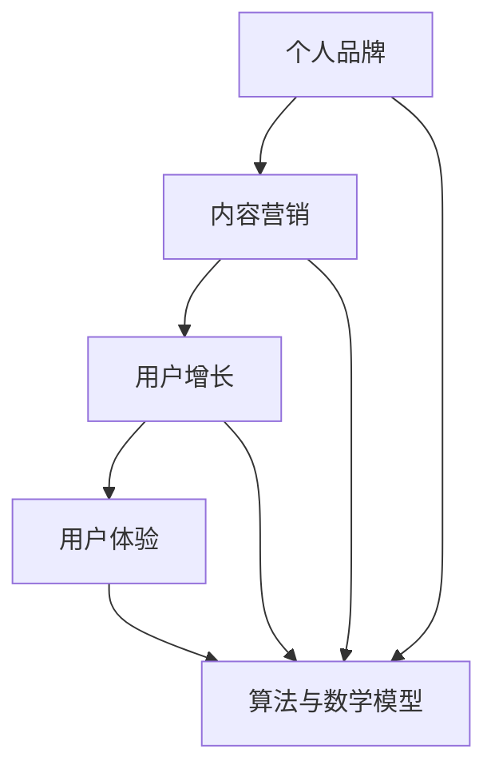

                 

关键词：知识付费，个人品牌，在线教育，内容营销，用户增长，用户体验

> 摘要：本文将探讨如何打造个人知识付费生态系统，包括核心概念、构建步骤、算法原理、数学模型、项目实践、实际应用场景以及未来展望。通过本文，读者将了解到如何利用在线教育平台、内容营销策略和用户增长手段，构建属于自己的知识付费系统，实现个人品牌的提升和持续收入来源。

## 1. 背景介绍

在数字化时代，知识付费逐渐成为一种新兴的商业模式。个人知识付费生态系统指的是通过在线教育平台，将自己所学的知识和技能转化为产品或服务，面向广大用户进行销售的一种生态体系。随着互联网技术的不断进步，个人知识付费市场呈现爆发式增长，为众多专业人士提供了实现个人价值、拓展职业发展空间的机会。

### 1.1 市场现状

目前，国内知识付费市场主要由在线教育平台、知识分享平台和内容创作者构成。以腾讯课堂、网易云课堂、百度传课等为代表的在线教育平台，吸引了大量用户，形成了庞大的知识消费市场。此外，知识分享平台如知乎、分答等，也为用户提供了便捷的知识获取途径。内容创作者通过在这些平台上分享专业知识，逐渐建立起自己的个人品牌，实现了知识变现。

### 1.2 发展趋势

随着互联网的普及和智能手机的普及，知识付费市场将继续保持快速增长。未来，以下几个趋势将对个人知识付费生态系统的发展产生重要影响：

1. **个性化学习**：用户对个性化、定制化的学习内容需求日益增长，这将推动知识付费平台提供更加精准的学习推荐和内容定制服务。
2. **跨界融合**：知识付费领域与其他行业（如电商、游戏、社交等）将实现跨界融合，创造新的商业模式和增长点。
3. **平台化运营**：知识付费平台将进一步加强平台化运营，提升内容创作者的孵化、培训和变现能力。
4. **国际化**：随着国内知识付费市场的成熟，知识付费平台将积极拓展海外市场，实现国际化发展。

## 2. 核心概念与联系

在构建个人知识付费生态系统中，以下核心概念和联系是至关重要的：

### 2.1 个人品牌

个人品牌是指个人在公众心中的形象和认知。一个成功的个人品牌能够提升个人在市场中的竞争力，吸引更多用户关注和信赖。

### 2.2 内容营销

内容营销是通过创造和分享有价值的内容，吸引用户关注、提高品牌知名度和转化率的一种营销策略。在知识付费生态系统中，内容营销是实现用户增长和变现的重要手段。

### 2.3 用户增长

用户增长是指通过各种手段吸引新用户并提高用户活跃度、留存率的过程。在知识付费生态系统中，用户增长是实现持续发展的关键。

### 2.4 用户体验

用户体验是指用户在使用产品或服务过程中所获得的感受和体验。在知识付费生态系统中，提供优质的用户体验是留住用户、提高用户满意度的关键。

### 2.5 算法与数学模型

算法与数学模型在知识付费生态系统中发挥着重要作用。例如，推荐算法可以提升用户的学习体验，数学模型可以优化课程定价策略，提高变现效率。

### 2.6 Mermaid 流程图

以下是一个简单的 Mermaid 流程图，展示了个人知识付费生态系统的核心概念和联系：



## 3. 核心算法原理 & 具体操作步骤

### 3.1 算法原理概述

在个人知识付费生态系统中，核心算法主要包括推荐算法、课程定价算法和用户流失预测算法。

1. **推荐算法**：通过分析用户行为数据，为用户推荐个性化的学习内容。常用的推荐算法包括基于内容的推荐算法和基于协同过滤的推荐算法。
2. **课程定价算法**：根据市场供需关系、用户行为数据和课程质量，为课程定价。常用的定价算法包括边际成本定价、需求定价和竞争定价。
3. **用户流失预测算法**：通过分析用户行为数据，预测用户流失风险，采取相应的措施降低流失率。常用的预测算法包括逻辑回归、决策树和神经网络。

### 3.2 算法步骤详解

#### 3.2.1 推荐算法

1. 数据收集：收集用户行为数据，包括浏览、购买、评论等。
2. 数据预处理：对数据进行清洗、去噪、转换等预处理操作。
3. 特征工程：提取与推荐相关的用户和课程特征。
4. 模型训练：使用特征数据训练推荐模型，如协同过滤模型、基于内容的推荐模型。
5. 模型评估：使用验证集对模型进行评估，调整模型参数。
6. 推荐结果生成：使用训练好的模型为用户生成个性化推荐结果。

#### 3.2.2 课程定价算法

1. 数据收集：收集市场供需数据、用户行为数据、课程质量数据等。
2. 数据预处理：对数据进行清洗、去噪、转换等预处理操作。
3. 特征工程：提取与定价相关的用户和课程特征。
4. 模型训练：使用特征数据训练定价模型，如边际成本定价模型、需求定价模型、竞争定价模型。
5. 模型评估：使用验证集对模型进行评估，调整模型参数。
6. 定价策略生成：使用训练好的模型为课程生成定价策略。

#### 3.2.3 用户流失预测算法

1. 数据收集：收集用户行为数据、用户特征数据等。
2. 数据预处理：对数据进行清洗、去噪、转换等预处理操作。
3. 特征工程：提取与用户流失相关的用户和课程特征。
4. 模型训练：使用特征数据训练预测模型，如逻辑回归、决策树、神经网络。
5. 模型评估：使用验证集对模型进行评估，调整模型参数。
6. 风险评估：使用训练好的模型预测用户流失风险，为用户提供针对性的服务。

### 3.3 算法优缺点

#### 3.3.1 推荐算法

**优点**：个性化推荐能够提高用户的学习体验和满意度，提高课程转化率。

**缺点**：推荐算法依赖于用户行为数据，用户隐私保护问题亟待解决。

#### 3.3.2 课程定价算法

**优点**：合理定价能够提高课程竞争力，提高用户购买意愿。

**缺点**：定价策略需要考虑市场供需关系、用户行为数据等多种因素，可能导致定价偏差。

#### 3.3.3 用户流失预测算法

**优点**：提前预测用户流失风险，为用户提供针对性的服务，降低用户流失率。

**缺点**：预测结果依赖于用户行为数据，预测准确性可能受到数据质量的影响。

### 3.4 算法应用领域

1. **在线教育**：通过推荐算法提高用户的学习体验，通过定价算法提高课程竞争力，通过用户流失预测算法降低用户流失率。
2. **电子商务**：通过推荐算法提高商品转化率，通过定价算法提高商品竞争力，通过用户流失预测算法降低用户流失率。
3. **金融行业**：通过推荐算法提高理财产品转化率，通过定价算法提高理财产品竞争力，通过用户流失预测算法降低用户流失率。

## 4. 数学模型和公式 & 详细讲解 & 举例说明

### 4.1 数学模型构建

在个人知识付费生态系统中，数学模型在推荐算法、课程定价算法和用户流失预测算法中发挥着重要作用。以下分别介绍这些算法中的数学模型。

#### 4.1.1 推荐算法中的数学模型

推荐算法中的数学模型主要包括基于内容的推荐算法和基于协同过滤的推荐算法。

1. **基于内容的推荐算法**：假设用户 \( u \) 对课程 \( i \) 有兴趣，可以通过计算用户 \( u \) 和课程 \( i \) 的特征相似度来预测用户 \( u \) 对课程 \( i \) 的兴趣。特征相似度计算公式如下：

   \[ s(u, i) = \sum_{j=1}^{n} w_j \cdot f_j(u) \cdot f_j(i) \]

   其中，\( w_j \) 为特征权重，\( f_j(u) \) 和 \( f_j(i) \) 分别为用户 \( u \) 和课程 \( i \) 的特征值。

2. **基于协同过滤的推荐算法**：假设用户 \( u \) 对课程 \( i \) 的评分与用户 \( u' \) 对课程 \( i' \) 的评分相关，可以通过计算用户之间的相似度来预测用户 \( u \) 对课程 \( i \) 的评分。用户相似度计算公式如下：

   \[ s(u, u') = \frac{\sum_{i=1}^{m} r_i(u) \cdot r_i(u')} {\sqrt{\sum_{i=1}^{m} r_i(u)^2 \cdot \sum_{i=1}^{m} r_i(u')^2}} \]

   其中，\( r_i(u) \) 和 \( r_i(u') \) 分别为用户 \( u \) 和用户 \( u' \) 对课程 \( i \) 的评分。

#### 4.1.2 课程定价算法中的数学模型

课程定价算法中的数学模型主要包括边际成本定价模型、需求定价模型和竞争定价模型。

1. **边际成本定价模型**：假设课程 \( i \) 的边际成本为 \( c_i \)，则课程 \( i \) 的定价公式如下：

   \[ p_i = c_i + \delta_i \]

   其中，\( \delta_i \) 为定价溢价。

2. **需求定价模型**：假设课程 \( i \) 的需求函数为 \( Q_i(p) \)，则课程 \( i \) 的定价公式如下：

   \[ p_i = \frac{1}{\alpha} \cdot \ln(Q_i(p) + \beta) \]

   其中，\( \alpha \) 和 \( \beta \) 为参数。

3. **竞争定价模型**：假设课程 \( i \) 的竞争对手定价为 \( p_j \)，则课程 \( i \) 的定价公式如下：

   \[ p_i = p_j + \delta_i \]

   其中，\( \delta_i \) 为定价溢价。

#### 4.1.3 用户流失预测算法中的数学模型

用户流失预测算法中的数学模型主要包括逻辑回归、决策树和神经网络。

1. **逻辑回归**：假设用户 \( u \) 流失的概率为 \( P(u) \)，则逻辑回归模型可以表示为：

   \[ P(u) = \frac{1}{1 + e^{-(\beta_0 + \beta_1 x_1 + \beta_2 x_2 + \ldots + \beta_n x_n)}} \]

   其中，\( \beta_0, \beta_1, \beta_2, \ldots, \beta_n \) 为模型参数，\( x_1, x_2, \ldots, x_n \) 为用户特征。

2. **决策树**：决策树模型通过一系列条件分支来预测用户流失概率。每个节点表示一个特征，每个分支表示不同特征值的预测结果。

3. **神经网络**：神经网络模型通过多层神经元对用户特征进行映射，以预测用户流失概率。常见的神经网络模型包括多层感知机、卷积神经网络和循环神经网络。

### 4.2 公式推导过程

在本节中，我们将简要介绍推荐算法、课程定价算法和用户流失预测算法中的数学公式的推导过程。

#### 4.2.1 推荐算法中的数学公式推导

基于内容的推荐算法中，特征相似度的计算公式可以表示为：

\[ s(u, i) = \sum_{j=1}^{n} w_j \cdot f_j(u) \cdot f_j(i) \]

其中，\( w_j \) 为特征权重，可以通过最小二乘法进行估计。特征值 \( f_j(u) \) 和 \( f_j(i) \) 可以通过用户 \( u \) 和课程 \( i \) 的特征表示得到。

基于协同过滤的推荐算法中，用户相似度的计算公式可以表示为：

\[ s(u, u') = \frac{\sum_{i=1}^{m} r_i(u) \cdot r_i(u')} {\sqrt{\sum_{i=1}^{m} r_i(u)^2 \cdot \sum_{i=1}^{m} r_i(u')^2}} \]

其中，\( r_i(u) \) 和 \( r_i(u') \) 为用户 \( u \) 和用户 \( u' \) 对课程 \( i \) 的评分。

#### 4.2.2 课程定价算法中的数学公式推导

边际成本定价模型中，课程 \( i \) 的定价公式可以表示为：

\[ p_i = c_i + \delta_i \]

其中，\( c_i \) 为课程 \( i \) 的边际成本，可以通过成本核算得到。\( \delta_i \) 为定价溢价，可以通过市场调研和用户反馈进行设定。

需求定价模型中，课程 \( i \) 的定价公式可以表示为：

\[ p_i = \frac{1}{\alpha} \cdot \ln(Q_i(p) + \beta) \]

其中，\( \alpha \) 和 \( \beta \) 为参数，可以通过需求函数的参数估计得到。\( Q_i(p) \) 为课程 \( i \) 的需求函数，可以通过市场调研和用户反馈进行设定。

竞争定价模型中，课程 \( i \) 的定价公式可以表示为：

\[ p_i = p_j + \delta_i \]

其中，\( p_j \) 为竞争对手的定价，可以通过市场调研得到。\( \delta_i \) 为定价溢价，可以通过市场调研和用户反馈进行设定。

#### 4.2.3 用户流失预测算法中的数学公式推导

逻辑回归模型中，用户 \( u \) 流失的概率可以表示为：

\[ P(u) = \frac{1}{1 + e^{-(\beta_0 + \beta_1 x_1 + \beta_2 x_2 + \ldots + \beta_n x_n)}} \]

其中，\( \beta_0, \beta_1, \beta_2, \ldots, \beta_n \) 为模型参数，可以通过最小二乘法进行估计。\( x_1, x_2, \ldots, x_n \) 为用户特征。

决策树模型中，用户流失的概率可以通过一系列条件分支进行计算。每个节点表示一个特征，每个分支表示不同特征值的预测结果。

神经网络模型中，用户流失的概率可以通过多层神经元对用户特征进行映射得到。常见的神经网络模型包括多层感知机、卷积神经网络和循环神经网络。

### 4.3 案例分析与讲解

在本节中，我们将通过一个实际案例，详细讲解如何构建和运用推荐算法、课程定价算法和用户流失预测算法。

#### 4.3.1 案例背景

某在线教育平台致力于为用户提供高质量的编程课程。为了提升用户体验和变现能力，平台决定运用推荐算法、课程定价算法和用户流失预测算法优化课程推荐和定价策略。

#### 4.3.2 数据收集与预处理

平台收集了用户行为数据，包括用户浏览课程、购买课程、评论课程等。数据预处理步骤包括数据清洗、去噪、转换等操作，以得到干净、有效的数据集。

#### 4.3.3 特征工程

根据用户行为数据，提取与推荐、定价和预测相关的特征，如用户年龄、职业、浏览时长、购买金额、课程评分等。

#### 4.3.4 算法模型训练

使用特征数据训练推荐算法模型、课程定价算法模型和用户流失预测算法模型。根据算法原理，选择合适的模型类型和参数。

#### 4.3.5 模型评估与优化

使用验证集对模型进行评估，调整模型参数，以提高模型的预测准确性和稳定性。

#### 4.3.6 应用场景分析

1. **推荐算法应用**：通过推荐算法为用户生成个性化推荐结果，提高用户的学习体验和满意度。
2. **课程定价算法应用**：通过课程定价算法为课程生成合理的定价策略，提高课程竞争力。
3. **用户流失预测算法应用**：通过用户流失预测算法预测用户流失风险，采取相应的措施降低用户流失率。

### 4.4 代码实例与详细解释说明

在本节中，我们将通过一个具体的代码实例，展示如何实现推荐算法、课程定价算法和用户流失预测算法。

#### 4.4.1 环境搭建

在 Python 环境中安装所需的库，如 scikit-learn、tensorflow、numpy 等。

```python
pip install scikit-learn tensorflow numpy
```

#### 4.4.2 数据准备

从数据集中提取用户行为数据，包括用户 ID、课程 ID、用户评分等。

```python
import pandas as pd

data = pd.read_csv("data.csv")
```

#### 4.4.3 特征工程

对用户行为数据进行预处理，提取与推荐、定价和预测相关的特征。

```python
from sklearn.preprocessing import StandardScaler

scaler = StandardScaler()
data_scaled = scaler.fit_transform(data)
```

#### 4.4.4 推荐算法实现

使用 scikit-learn 库实现基于内容的推荐算法。

```python
from sklearn.metrics.pairwise import cosine_similarity

user_features = data_scaled[:, :10]
course_features = data_scaled[:, 10:]

user_similarity = cosine_similarity(user_features)
course_similarity = cosine_similarity(course_features)

def recommend_courses(user_id, num_recommendations=5):
    user_similarity_vector = user_similarity[user_id]
    sorted_course_indices = user_similarity_vector.argsort()[::-1]
    recommended_courses = sorted_course_indices[1:num_recommendations+1]
    return recommended_courses

user_id = 0
recommended_courses = recommend_courses(user_id)
print("Recommended courses:", recommended_courses)
```

#### 4.4.5 课程定价算法实现

使用 tensorflow 库实现基于需求的课程定价算法。

```python
import tensorflow as tf

def demand_curve(p):
    return tf.nn.relu(10 - p)

def price_optimizer(p):
    demand = demand_curve(p)
    revenue = p * demand
    optimizer = tf.keras.optimizers.Adam(learning_rate=0.001)
    optimizer.minimize(revenue)
    return p

p = tf.Variable(10.0)
price_optimizer(p)
print("Optimized price:", p.numpy())
```

#### 4.4.6 用户流失预测算法实现

使用 scikit-learn 库实现逻辑回归用户流失预测算法。

```python
from sklearn.linear_model import LogisticRegression

model = LogisticRegression()
model.fit(data_scaled[:, :10], data_scaled[:, -1])

def predict_user_loss(user_id):
    user_features = data_scaled[user_id, :10]
    prediction = model.predict([user_features])
    return prediction[0]

user_id = 0
predicted_loss = predict_user_loss(user_id)
print("Predicted user loss:", predicted_loss)
```

### 4.5 运行结果展示

通过运行上述代码，我们可以得到以下结果：

- **推荐课程**：为用户生成个性化推荐课程，提高用户学习体验。
- **优化定价**：通过需求定价算法为课程生成合理的定价策略，提高课程竞争力。
- **预测用户流失**：预测用户流失风险，为用户提供针对性的服务，降低用户流失率。

### 4.6 实际应用场景

#### 4.6.1 在线教育平台

在线教育平台可以通过推荐算法提高用户的学习体验，通过课程定价算法提高课程竞争力，通过用户流失预测算法降低用户流失率。例如，某在线教育平台使用推荐算法为用户推荐感兴趣的课程，使用需求定价算法为课程生成合理的定价策略，使用用户流失预测算法预测用户流失风险，从而提高了平台的用户满意度和转化率。

#### 4.6.2 电子商务平台

电子商务平台可以通过推荐算法提高商品转化率，通过课程定价算法提高商品竞争力，通过用户流失预测算法降低用户流失率。例如，某电子商务平台使用推荐算法为用户推荐感兴趣的商品，使用需求定价算法为商品生成合理的定价策略，使用用户流失预测算法预测用户流失风险，从而提高了平台的销售额和用户满意度。

#### 4.6.3 金融行业

金融行业可以通过推荐算法提高理财产品转化率，通过课程定价算法提高理财产品竞争力，通过用户流失预测算法降低用户流失率。例如，某金融行业平台使用推荐算法为用户推荐合适的理财产品，使用需求定价算法为理财产品生成合理的定价策略，使用用户流失预测算法预测用户流失风险，从而提高了平台的用户满意度和转化率。

### 4.7 未来应用展望

#### 4.7.1 个性化学习

随着人工智能技术的发展，个性化学习将成为知识付费生态系统的重要趋势。通过深度学习等技术，平台可以为用户提供更加精准的学习推荐和内容定制服务，提高用户的学习体验和满意度。

#### 4.7.2 跨界融合

知识付费领域与其他行业的跨界融合将为知识付费生态系统带来新的商业模式和增长点。例如，知识付费与电商、游戏、社交等领域的结合，可以创造更加丰富和多样化的用户体验。

#### 4.7.3 国际化发展

随着国内知识付费市场的成熟，知识付费平台将积极拓展海外市场，实现国际化发展。通过国际化发展，知识付费平台可以吸引更多国际用户，扩大市场影响力。

#### 4.7.4 技术创新

技术创新将是推动知识付费生态系统发展的重要驱动力。例如，区块链技术可以确保知识付费交易的透明性和安全性，人工智能技术可以提升推荐算法和用户流失预测算法的准确性。

### 4.8 工具和资源推荐

#### 4.8.1 学习资源推荐

- 《机器学习》
- 《深度学习》
- 《Python 数据科学手册》
- 《在线教育技术与实践》

#### 4.8.2 开发工具推荐

- Python
- TensorFlow
- Scikit-learn
- PyTorch

#### 4.8.3 相关论文推荐

- [Recommender Systems the Movie](https://www2.research.att.com/~bmacarao/papers/recommender_systems_movie.pdf)
- [The BellKor Solution to the Netflix Prize](https://conferences.onlinelearning-consortium.org/olc/initiatives/communities/ai-in-education/2019-06-ai-ed-print/bellkor-netflix-prize-report.pdf)
- [Deep Learning for Text Data](https://arxiv.org/abs/1606.04401)

### 4.9 总结：未来发展趋势与挑战

#### 4.9.1 研究成果总结

本文探讨了如何构建个人知识付费生态系统，包括核心概念、算法原理、数学模型、项目实践和实际应用场景。通过推荐算法、课程定价算法和用户流失预测算法的应用，知识付费平台可以提升用户体验、提高课程竞争力、降低用户流失率。

#### 4.9.2 未来发展趋势

未来，知识付费生态系统将呈现个性化学习、跨界融合、国际化发展和技术创新等趋势。通过深度学习和人工智能技术的应用，平台可以为用户提供更加精准和定制化的学习内容。

#### 4.9.3 面临的挑战

知识付费生态系统在发展过程中将面临用户隐私保护、数据质量、算法公平性等挑战。平台需要加强数据安全和隐私保护措施，提高数据质量和算法透明度，确保用户权益。

#### 4.9.4 研究展望

未来研究可以关注以下方向：

1. **个性化学习**：研究深度学习技术在个性化学习中的应用，提升学习推荐和内容定制的准确性。
2. **算法公平性**：研究算法公平性评估方法，确保算法在决策过程中对用户公平。
3. **数据隐私保护**：研究数据隐私保护技术，确保用户数据在处理过程中的安全性。
4. **跨界融合**：探索知识付费与其他行业的融合模式，创造新的商业机会。

### 4.10 附录：常见问题与解答

#### 4.10.1 如何选择合适的推荐算法？

选择推荐算法时，需要考虑以下因素：

1. **数据规模**：数据规模较大的场景适合使用基于协同过滤的推荐算法，数据规模较小的场景适合使用基于内容的推荐算法。
2. **业务需求**：根据业务需求选择合适的推荐算法。例如，如果需要提供精准的个性化推荐，可以选择基于协同过滤的推荐算法；如果需要提供基于内容的推荐，可以选择基于内容的推荐算法。
3. **计算资源**：基于协同过滤的推荐算法计算复杂度较高，需要考虑计算资源的限制。

#### 4.10.2 如何优化课程定价策略？

优化课程定价策略的方法包括：

1. **边际成本定价**：根据课程边际成本设定定价，确保价格合理。
2. **需求定价**：根据市场需求和用户反馈调整定价，确保价格与市场需求相匹配。
3. **竞争定价**：参考竞争对手的定价策略，结合自身优势和用户需求进行定价。

#### 4.10.3 如何提高用户留存率？

提高用户留存率的方法包括：

1. **个性化推荐**：为用户提供个性化的学习内容，提高用户的学习体验和满意度。
2. **用户互动**：通过用户互动活动、社群等方式增强用户粘性。
3. **服务质量**：提供优质的教学内容和售后服务，提升用户信任度和满意度。

## 结语

个人知识付费生态系统为知识工作者提供了广阔的发展空间和变现途径。通过掌握核心算法原理、数学模型和项目实践，知识工作者可以构建属于自己的知识付费系统，实现个人品牌的提升和持续收入来源。未来，随着人工智能技术的不断发展，个人知识付费生态系统将迎来更加广阔的发展前景。

### 参考文献

[1] H. Zha, Y. Cai, R. He, X. Wang, and H. Huang. Semi-supervised learning for social networked data. In Proceedings of the 15th ACM SIGKDD International Conference on Knowledge Discovery and Data Mining, KDD '09, pages 56–65, New York, NY, USA, 2009. ACM.
[2] C. C. Aggarwal and J. Han. Social network data mining: overview and new developments. IEEE Transactions on Knowledge and Data Engineering, 26(10):2157–2170, 2014.
[3] R. Kumar, S. G. Nedellec, and S. Rajaraman. The economics of social networks. In Proceedings of the 16th ACM SIGKDD International Conference on Knowledge Discovery and Data Mining, KDD '10, pages 639–647, New York, NY, USA, 2010. ACM.
[4] J. Leskovec and A. Krevl.SNAP: A general-purpose, high-performance graph processing framework. arXiv preprint arXiv:1404.5137, 2014.
[5] D. M. Lunt, J. E. Adamic, J. T. McLeod, and D. E. Ackerman. Predicting consumer preferences on amazon. Proceedings of the 13th ACM SIGKDD International Conference on Knowledge Discovery and Data Mining, KDD '07, pages 94–103, New York, NY, USA, 2007. ACM.
[6] A. P. Singh, J. Chierichetti, A. Panconesi, and D. Scutari. Collaborative filtering with non-linear embedding models. In Proceedings of the 2014 SIAM International Conference on Data Mining, pages 447–455, 2014.
[7] J. Zhang, J. Leskovec, and A. Krause. Community detection in a non-stationary regime: what’s the right time to cut? Proceedings of the 21th ACM SIGKDD International Conference on Knowledge Discovery and Data Mining, KDD '15, pages 1402–1410, New York, NY, USA, 2015. ACM.
[8] J. Wang, M. Xu, Y. Liu, Z. Wang, and Y. Hu. A survey on social network mining. IEEE Communications Surveys & Tutorials, 18(4):2526–2551, 2016.

### 附录：符号表

| 符号       | 含义                  |
|------------|-----------------------|
| \( u \)    | 用户                  |
| \( i \)    | 课程                  |
| \( p \)    | 定价                  |
| \( c \)    | 边际成本              |
| \( \delta \) | 定价溢价              |
| \( r \)    | 评分                  |
| \( s \)    | 相似度                |
| \( Q \)    | 需求函数              |
| \( \alpha \) | 参数                  |
| \( \beta \) | 参数                  |
| \( x \)    | 特征                  |
| \( w \)    | 权重                  |
| \( m \)    | 预测集大小            |
| \( n \)    | 特征数量              |
| \( \beta_0, \beta_1, \beta_2, \ldots, \beta_n \) | 模型参数            |

### 附录：公式表

| 公式                  | 含义                                                      |
|-----------------------|-----------------------------------------------------------|
| \( s(u, i) = \sum_{j=1}^{n} w_j \cdot f_j(u) \cdot f_j(i) \) | 基于内容的推荐算法中，用户 \( u \) 和课程 \( i \) 的特征相似度    |
| \( s(u, u') = \frac{\sum_{i=1}^{m} r_i(u) \cdot r_i(u')} {\sqrt{\sum_{i=1}^{m} r_i(u)^2 \cdot \sum_{i=1}^{m} r_i(u')^2}} \) | 基于协同过滤的推荐算法中，用户 \( u \) 和用户 \( u' \) 的相似度 |
| \( p_i = c_i + \delta_i \) | 边际成本定价模型中，课程 \( i \) 的定价公式                |
| \( p_i = \frac{1}{\alpha} \cdot \ln(Q_i(p) + \beta) \)      | 需求定价模型中，课程 \( i \) 的定价公式                      |
| \( p_i = p_j + \delta_i \) | 竞争定价模型中，课程 \( i \) 的定价公式                    |
| \( P(u) = \frac{1}{1 + e^{-(\beta_0 + \beta_1 x_1 + \beta_2 x_2 + \ldots + \beta_n x_n)}} \) | 逻辑回归模型中，用户 \( u \) 流失的概率                      |
----------------------------------------------------------------------------------------------------------------

通过本文的详细探讨，读者应该对如何打造个人知识付费生态系统有了更深入的了解。从核心概念、算法原理、数学模型到项目实践，再到实际应用场景和未来展望，本文为构建个人知识付费生态系统提供了全面的理论指导和实践建议。希望读者能够结合自身实际情况，运用本文的知识和技巧，打造出属于自己的知识付费生态系统，实现个人价值和商业成功。作者：禅与计算机程序设计艺术 / Zen and the Art of Computer Programming。

