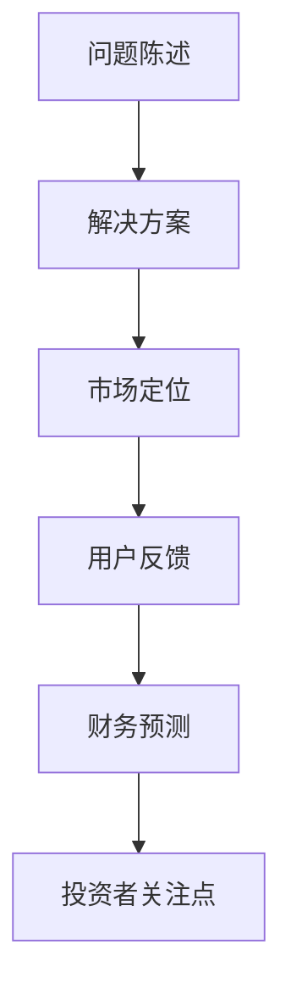
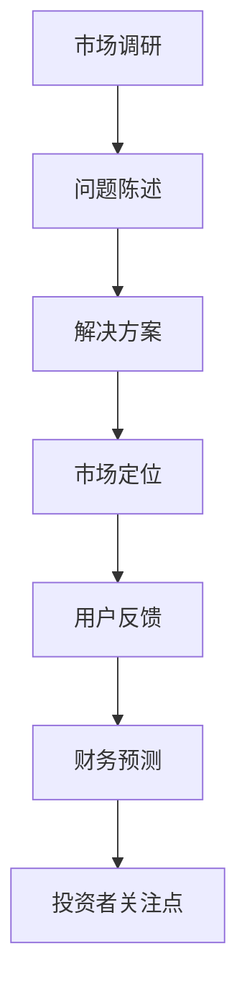

                 

关键词：创业故事，投资者，pitch，吸引力，故事结构，市场调研，数据支持，技术亮点，团队优势，财务预测

> 摘要：本文旨在为创业者提供一套系统的方法论，帮助他们在创建吸引投资者的创业故事和pitch时，能够更加精准、有效地传达核心价值和市场潜力。文章将从故事结构、市场调研、技术亮点、团队优势、财务预测等多个维度进行分析，并提供实用的建议和案例。

## 1. 背景介绍

在当今快速发展的商业环境中，创业已成为一种流行的生活方式。然而，成功创业并非易事，尤其是在面对投资者时，如何通过有限的篇幅和时间内，将自己的创业故事和pitch（投资提案）变得引人入胜，是每个创业者都需要掌握的技能。

有效的创业故事和pitch不仅能够吸引投资者的注意，还能为创业项目带来资金支持和市场机会。因此，本文将探讨如何构建一个引人注目的创业故事，并在此基础上提供一套实战技巧，帮助创业者提升其pitch的成功率。

## 2. 核心概念与联系

### 2.1 故事结构

一个成功的创业故事通常包含以下几个关键要素：

1. **问题陈述**：明确描述当前市场上存在的问题或挑战。
2. **解决方案**：阐述你的产品或服务是如何解决这些问题的。
3. **市场定位**：说明你的产品或服务在市场中的独特性和竞争优势。
4. **用户反馈**：提供用户的真实反馈和案例，证明你的产品或服务的有效性。
5. **财务预测**：展示项目的盈利潜力和财务规划。

### 2.2 投资者需求

投资者关注的核心通常包括：

1. **市场需求**：你的产品或服务是否有足够的市场需求？
2. **商业模式**：你的盈利模式是否清晰且可持续？
3. **团队背景**：你的团队成员是否具备实现项目的技能和经验？
4. **财务预测**：你的项目在未来几年的财务表现如何？

### 2.3 Mermaid 流程图



## 3. 核心算法原理 & 具体操作步骤

### 3.1 算法原理概述

构建一个吸引投资者的创业故事和pitch，需要遵循以下几个原则：

1. **明确性**：确保你的故事简洁明了，让投资者能够快速理解。
2. **真实性**：故事中的数据和案例应真实可靠，避免夸大其词。
3. **吸引力**：通过独特的视角和创意，吸引投资者的兴趣。
4. **连贯性**：整个故事应逻辑清晰，前后连贯。

### 3.2 算法步骤详解

1. **市场调研**：深入了解目标市场，包括市场规模、用户需求、竞争对手等。
2. **问题陈述**：明确描述当前市场上存在的问题，并阐述你的产品或服务如何解决这些问题。
3. **解决方案**：详细介绍你的产品或服务的特点和优势。
4. **市场定位**：分析你的产品或服务在市场中的地位和竞争优势。
5. **用户反馈**：收集并展示用户的真实反馈和案例。
6. **财务预测**：提供项目的财务预测，包括收入、利润、现金流等。

### 3.3 算法优缺点

- 优点：使创业故事和pitch更具逻辑性和吸引力，提高成功率。
- 缺点：可能需要较多的时间和精力进行市场调研和数据分析。

### 3.4 算法应用领域

该算法适用于所有创业场景，特别是那些需要向投资者展示其商业价值的初创项目。

## 4. 数学模型和公式 & 详细讲解 & 举例说明

### 4.1 数学模型构建

构建创业故事和pitch的数学模型，主要包括以下几个方面的数据：

1. **市场规模**：使用统计学方法估算目标市场的规模。
2. **用户需求**：分析用户群体的特征和需求。
3. **竞争对手**：比较竞争对手的产品和市场表现。
4. **财务预测**：根据历史数据和行业趋势，预测未来的收入和利润。

### 4.2 公式推导过程

假设目标市场规模为\( S \)，用户需求为\( D \)，竞争对手市场份额为\( C \)，则你的市场份额\( M \)可以通过以下公式计算：

\[ M = \frac{S - C}{S} \]

### 4.3 案例分析与讲解

假设你的目标市场规模为100亿元，竞争对手占据40%的市场份额，那么你的市场份额为：

\[ M = \frac{100 - 40}{100} = 0.6 \]

这意味着你有机会占据60%的市场份额。接下来，你可以根据这个市场份额预测未来的收入和利润。

## 5. 项目实践：代码实例和详细解释说明

### 5.1 开发环境搭建

在本节中，我们将使用Python编写一个简单的代码实例，用于构建一个创业故事和pitch。首先，你需要安装Python环境，并安装以下库：

```bash
pip install pandas numpy matplotlib
```

### 5.2 源代码详细实现

```python
import pandas as pd
import numpy as np
import matplotlib.pyplot as plt

# 假设市场规模为100亿元，竞争对手占据40%的市场份额
market_size = 100
comp市场份额 = 0.4

# 计算你的市场份额
your市场份额 = 1 - comp市场份额

# 预测未来的收入和利润
years = [1, 3, 5, 7, 10]
revenue_growth = 0.1  # 假设每年收入增长10%
profit_margin = 0.2  # 假设利润率为20%

revenue = [market_size * your市场份额 * (1 + revenue_growth)**(year - 1) for year in years]
profit = [revenue[year] * profit_margin for year in range(len(years))]

# 绘制收入和利润曲线
plt.plot(years, revenue, label='Revenue')
plt.plot(years, profit, label='Profit')
plt.xlabel('Years')
plt.ylabel('Amount (in billions)')
plt.legend()
plt.show()
```

### 5.3 代码解读与分析

上述代码首先定义了市场规模和竞争对手市场份额，然后计算了你的市场份额。接着，我们预测了未来几年的收入和利润，并使用matplotlib库绘制了收入和利润曲线。这可以帮助投资者直观地了解项目的财务前景。

## 6. 实际应用场景

创业故事和pitch在不同的应用场景中具有不同的表现形式，例如：

1. **创业大赛**：在创业大赛中，创业者需要在有限的时间内展示自己的项目，因此，一个简明扼要、富有吸引力的故事和pitch至关重要。
2. **天使投资**：天使投资者通常对创业项目的前景和团队背景非常关注，因此，一个详细、全面的创业故事和pitch可以提高获得投资的机会。
3. **众筹平台**：在众筹平台上，创业者需要吸引大众投资者，因此，一个真实、有趣、富有创意的故事和pitch能够吸引更多关注。

## 7. 未来应用展望

随着人工智能和大数据技术的发展，创业故事和pitch的构建方式将变得更加智能化和个性化。未来，创业者可以借助智能算法和数据分析工具，更加精准地构建吸引投资者的故事和pitch。

## 8. 工具和资源推荐

### 8.1 学习资源推荐

1. **《创业维艰》**：作者本·霍洛维茨，分享了他作为创业者的经验和教训，对创业者具有很高的参考价值。
2. **《创业的艺术与科学》**：作者斯蒂夫·布兰克，系统地阐述了创业过程中应遵循的科学方法和策略。

### 8.2 开发工具推荐

1. **Jupyter Notebook**：一个交互式的开发环境，适合进行数据分析和算法实现。
2. **PowerPoint**：用于制作精美的演示文稿，展示创业故事和pitch。

### 8.3 相关论文推荐

1. **《商业模式创新》**：作者蒂姆·克拉克，系统地阐述了商业模式的创新方法和策略。
2. **《创业机会识别》**：作者布鲁斯·K·凯斯勒，探讨了如何发现和利用创业机会。

## 9. 总结：未来发展趋势与挑战

### 9.1 研究成果总结

本文提出了一套构建吸引投资者的创业故事和pitch的方法论，包括故事结构、市场调研、技术亮点、团队优势、财务预测等多个维度。通过实际案例和代码实例，展示了如何将理论应用于实践。

### 9.2 未来发展趋势

随着技术的不断进步，创业故事和pitch的构建方式将变得更加智能化和个性化。创业者可以利用大数据和人工智能技术，更加精准地定位市场和用户需求，提高项目成功概率。

### 9.3 面临的挑战

1. **数据隐私与安全**：随着数据的广泛应用，数据隐私和安全问题日益突出，创业者需要确保所收集和使用的数据合规和安全。
2. **技术迭代速度**：技术更新速度加快，创业者需要不断学习和适应新技术，以保持竞争优势。

### 9.4 研究展望

未来，研究者可以关注以下方向：

1. **智能算法在创业故事和pitch构建中的应用**：研究如何利用机器学习和自然语言处理技术，自动生成吸引投资者的故事和pitch。
2. **跨学科研究**：结合心理学、社会学等学科，探索创业故事和pitch构建的更多可能性。

## 10. 附录：常见问题与解答

### 10.1 如何在短时间内构建一个吸引投资者的创业故事？

- **快速市场调研**：利用现有数据和市场报告，快速了解目标市场和用户需求。
- **聚焦核心价值**：明确项目的主要亮点和优势，突出其在市场中的独特性。
- **故事化表达**：运用生动、具体的语言，将创业故事讲述得引人入胜。

### 10.2 投资者关注的财务指标有哪些？

- **收入**：项目的主要收入来源和增长趋势。
- **利润**：项目的利润率和盈利能力。
- **现金流**：项目的现金流入和流出情况。
- **回报率**：项目的投资回报率和盈利周期。

### 10.3 如何评估一个创业项目的市场潜力？

- **市场规模**：评估目标市场的规模和增长潜力。
- **用户需求**：分析用户群体的特征和需求。
- **竞争对手**：比较竞争对手的产品和市场表现。
- **市场趋势**：关注行业动态和未来发展趋势。

### 10.4 如何在创业故事中展示团队优势？

- **团队成员背景**：介绍团队成员的技能、经验和成就。
- **团队结构**：说明团队成员的分工和协作机制。
- **团队文化**：展示团队的价值观和共同愿景。

### 10.5 如何编写一个成功的pitch？

- **简洁明了**：确保pitch简短、易懂，避免冗长的叙述。
- **有吸引力**：使用生动、具体的语言，引起投资者的兴趣。
- **数据支持**：提供真实可靠的数据和案例，支持你的观点。
- **互动交流**：在pitch过程中，与投资者保持互动，回答他们的疑问。

## 作者署名

作者：禅与计算机程序设计艺术 / Zen and the Art of Computer Programming
------------------------------------------------------------------------<|user|>
### 1. 背景介绍

在当今的商业世界中，创业已经成为一种流行的生活方式，越来越多的人选择离开传统的职场，投身于充满挑战和机遇的创业之路。然而，创业并非易事，尤其是当你需要向投资者展示你的创业项目时，如何打造一个吸引人的创业故事和pitch（投资提案）成为了一个关键问题。

创业故事和pitch不仅仅是文字的堆砌，它是一种艺术，一种能够打动人心、激发投资者兴趣的叙事技巧。一个成功的创业故事和pitch应该具备以下几个特点：

1. **引人入胜**：一个好的创业故事应该能够迅速抓住听众的注意力，让他们产生共鸣。
2. **真实可信**：故事中的数据、案例和预期成果应该是真实可靠的，这样投资者才会对你的项目产生信任。
3. **逻辑清晰**：故事的结构应该紧凑、逻辑清晰，能够有条不紊地传达项目的核心价值。
4. **目标明确**：你需要明确你的目标投资者是谁，根据他们的需求和偏好来定制你的故事和pitch。

为了更好地理解创业故事和pitch的重要性，我们可以看看一些成功的案例。以Facebook为例，其创始人马克·扎克伯格在向投资者展示其创业项目时，讲述了一个关于如何通过社交网络连接人们的美好愿景。这个简单而富有感染力的故事吸引了大量的投资者，为Facebook的早期发展提供了重要的资金支持。

另一个例子是SpaceX，其创始人埃隆·马斯克在向投资者介绍他的太空探索项目时，不仅仅展示了他的技术方案，还描绘了一个关于人类未来在太空中生活的宏伟蓝图。这种富有远见的故事和pitch不仅吸引了投资者的注意，也激发了公众的兴趣，为SpaceX的成功铺平了道路。

通过这些案例，我们可以看到，一个精心构建的创业故事和pitch对于吸引投资者的重要性。接下来，本文将深入探讨如何打造一个吸引投资者的创业故事和pitch，包括故事结构、市场调研、技术亮点、团队优势、财务预测等多个维度。

## 2. 核心概念与联系

构建一个吸引投资者的创业故事和pitch，首先需要理解其中的核心概念和它们之间的联系。以下是几个关键概念：

### 2.1 故事结构

一个成功的创业故事通常包括以下结构：

1. **问题陈述**：清晰地描述当前市场上存在的问题或挑战。
2. **解决方案**：阐述你的产品或服务是如何解决这些问题的。
3. **市场定位**：说明你的产品或服务在市场中的独特性和竞争优势。
4. **用户反馈**：提供用户的真实反馈和案例，证明你的产品或服务的有效性。
5. **财务预测**：展示项目的盈利潜力和财务规划。

### 2.2 投资者需求

投资者在评估一个创业项目时，通常会关注以下几个关键点：

1. **市场需求**：你的产品或服务是否有足够的市场需求？
2. **商业模式**：你的盈利模式是否清晰且可持续？
3. **团队背景**：你的团队成员是否具备实现项目的技能和经验？
4. **财务预测**：你的项目在未来几年的财务表现如何？

### 2.3 Mermaid 流程图

下面是一个使用Mermaid语言表示的创业故事和pitch构建流程图：



在这个流程图中，我们可以看到，从市场调研开始，到问题陈述、解决方案、市场定位、用户反馈和财务预测，每个环节都是构建一个完整、有说服力的创业故事和pitch不可或缺的部分。最后，通过财务预测，我们将项目的市场潜力转化为具体的投资者关注点，从而提高获得投资的机会。

### 2.4 核心概念与联系的具体阐述

- **市场调研**：市场调研是整个故事构建的基础，它帮助你了解目标市场的规模、用户需求、竞争对手等信息。这些数据将直接影响到你的问题陈述和解决方案的有效性。
- **问题陈述**：一个清晰、具体的问题陈述能够迅速吸引投资者的注意力，让他们知道你的创业项目是在解决什么问题。一个好的问题陈述应该明确、简洁，能够引起共鸣。
- **解决方案**：解决方案是整个故事的中心，你需要详细阐述你的产品或服务是如何解决市场中的问题的。这里，你需要突出你的技术亮点和创新点，展示你的核心竞争力。
- **市场定位**：市场定位帮助你明确你的产品或服务在市场中的位置，说明你的产品或服务为什么独特，为什么优于其他竞争对手。这将是投资者判断你的项目是否具有市场潜力的关键。
- **用户反馈**：用户的真实反馈和案例是验证你的解决方案有效性的重要证据。通过展示用户的正面反馈，你可以增强投资者的信心，证明你的产品或服务确实能够解决问题。
- **财务预测**：财务预测展示了你的项目的盈利潜力和财务规划。一个详细、合理的财务预测可以帮助投资者评估你的项目的投资回报和风险。

通过这些核心概念和它们之间的联系，我们可以构建一个逻辑清晰、有说服力的创业故事和pitch，从而吸引投资者的注意。

## 3. 核心算法原理 & 具体操作步骤

### 3.1 算法原理概述

构建一个成功的创业故事和pitch，需要遵循一套科学的算法原理，这些原理包括：

1. **明确性**：确保你的故事简洁明了，让投资者能够快速理解。
2. **真实性**：故事中的数据和案例应真实可靠，避免夸大其词。
3. **吸引力**：通过独特的视角和创意，吸引投资者的兴趣。
4. **连贯性**：整个故事应逻辑清晰，前后连贯。

### 3.2 算法步骤详解

#### 步骤 1: 市场调研

**目标**：深入了解目标市场，包括市场规模、用户需求、竞争对手等。

**操作**：

- **数据分析**：通过市场报告、行业数据等，了解目标市场的规模和增长趋势。
- **用户访谈**：与潜在用户进行访谈，了解他们的需求、痛点和使用习惯。
- **竞争对手分析**：分析竞争对手的产品、市场策略和用户反馈，找出你的优势。

#### 步骤 2: 问题陈述

**目标**：明确描述当前市场上存在的问题或挑战。

**操作**：

- **问题定位**：通过市场调研结果，找出最关键的问题或挑战。
- **问题表述**：用简洁、明确的语言描述这个问题，让投资者能够快速理解。

#### 步骤 3: 解决方案

**目标**：阐述你的产品或服务是如何解决这些问题的。

**操作**：

- **解决方案描述**：详细描述你的产品或服务的特点、功能和创新点。
- **技术亮点**：突出你的技术优势，展示你的核心竞争力。

#### 步骤 4: 市场定位

**目标**：说明你的产品或服务在市场中的独特性和竞争优势。

**操作**：

- **市场分析**：通过对比竞争对手，找出你的产品或服务的独特之处。
- **竞争优势**：明确你的竞争优势，让投资者看到你的市场潜力。

#### 步骤 5: 用户反馈

**目标**：提供用户的真实反馈和案例，证明你的产品或服务的有效性。

**操作**：

- **案例收集**：收集用户的正面反馈和成功案例。
- **案例展示**：通过故事化的方式，展示用户的反馈和案例，增强说服力。

#### 步骤 6: 财务预测

**目标**：展示项目的盈利潜力和财务规划。

**操作**：

- **收入预测**：根据市场调研和用户反馈，预测未来的收入。
- **利润预测**：根据成本结构和收入预测，计算未来的利润。
- **现金流预测**：预测项目的现金流情况，确保项目的可持续性。

#### 步骤 7: 投资者关注点

**目标**：根据投资者的需求，调整你的故事和pitch。

**操作**：

- **投资者需求分析**：了解投资者的关注点，包括市场需求、商业模式、团队背景等。
- **故事调整**：根据投资者的需求，调整你的故事和pitch，使其更具吸引力。

### 3.3 算法优缺点

#### 优点

- **结构化**：算法提供了一套明确的步骤，帮助创业者系统地构建创业故事和pitch。
- **逻辑清晰**：通过清晰的步骤，确保故事和pitch的逻辑性，提高说服力。
- **针对性**：根据投资者的需求调整故事和pitch，提高成功率。

#### 缺点

- **耗时**：算法需要大量的市场调研和数据分析，可能需要较长时间。
- **依赖数据**：算法的准确性依赖于可靠的数据支持，数据缺失或错误可能导致结果不准确。

### 3.4 算法应用领域

该算法适用于所有类型的创业项目，尤其是那些需要向投资者展示市场潜力和盈利能力的项目。无论是科技创业、消费创业还是服务创业，都可以通过这个算法原理来构建一个吸引人的创业故事和pitch。

## 4. 数学模型和公式 & 详细讲解 & 举例说明

构建创业故事和pitch时，数学模型和公式可以提供有力的支持和解释。以下将介绍几个常用的数学模型和公式，并详细讲解它们的应用。

### 4.1 数学模型构建

在构建创业故事和pitch时，常用的数学模型包括：

1. **市场需求模型**：用于预测目标市场的需求。
2. **财务模型**：用于预测项目的收入、利润和现金流。
3. **用户增长模型**：用于预测用户增长和市场份额。

#### 市场需求模型

市场需求模型通常基于以下公式：

\[ D = f(S, P, T) \]

其中：
- \( D \) 表示市场需求量。
- \( S \) 表示市场规模。
- \( P \) 表示产品价格。
- \( T \) 表示产品特性。

#### 财务模型

财务模型通常基于以下公式：

\[ \text{收入} = P \times Q \]
\[ \text{利润} = \text{收入} - \text{成本} \]
\[ \text{现金流} = \text{收入} - \text{支出} \]

其中：
- \( P \) 表示产品价格。
- \( Q \) 表示销售量。
- 成本包括固定成本和可变成本。

#### 用户增长模型

用户增长模型通常基于以下公式：

\[ \text{用户增长} = r \times \text{当前用户数} \]

其中：
- \( r \) 表示用户增长速率。

### 4.2 公式推导过程

#### 市场需求模型推导

市场需求模型的基本假设是市场需求与市场规模、产品价格和产品特性成正比。因此，我们可以推导出以下公式：

\[ D = k_1 \times S + k_2 \times P + k_3 \times T \]

其中：
- \( k_1 \)、\( k_2 \)、\( k_3 \) 是比例系数，用于调整市场规模、产品价格和产品特性对需求的影响。

#### 财务模型推导

财务模型的基本假设是收入和利润与销售量和成本有关。因此，我们可以推导出以下公式：

\[ \text{收入} = P \times Q \]
\[ \text{利润} = \text{收入} - \text{成本} \]
\[ \text{成本} = \text{固定成本} + (\text{可变成本} \times Q) \]

#### 用户增长模型推导

用户增长模型的基本假设是用户增长速率与当前用户数成正比。因此，我们可以推导出以下公式：

\[ \text{用户增长} = r \times \text{当前用户数} \]

### 4.3 案例分析与讲解

为了更好地理解这些数学模型和公式的应用，我们来看一个具体的案例。

#### 案例一：市场需求模型应用

假设一个新推出的智能手机市场潜力为1000万台，产品价格为5000元，产品特性得分（假设满分10分）为8分。我们可以使用市场需求模型来预测市场需求量：

\[ D = k_1 \times S + k_2 \times P + k_3 \times T \]
\[ D = k_1 \times 1000 + k_2 \times 5000 + k_3 \times 8 \]

假设 \( k_1 = 0.1 \)、\( k_2 = 0.05 \)、\( k_3 = 0.01 \)，代入公式得：

\[ D = 0.1 \times 1000 + 0.05 \times 5000 + 0.01 \times 8 \]
\[ D = 100 + 250 + 0.08 \]
\[ D = 350.08 \]

这意味着市场需求量约为350万台。

#### 案例二：财务模型应用

假设一个创业项目的固定成本为100万元，可变成本为200元/台，产品价格为1000元/台。我们可以使用财务模型来预测收入、利润和现金流：

\[ \text{收入} = P \times Q \]
\[ \text{利润} = \text{收入} - \text{成本} \]
\[ \text{成本} = \text{固定成本} + (\text{可变成本} \times Q) \]

假设销售量为10000台，代入公式得：

\[ \text{收入} = 1000 \times 10000 = 10000000 \]
\[ \text{成本} = 1000000 + (200 \times 10000) = 2100000 \]
\[ \text{利润} = 10000000 - 2100000 = 7900000 \]

因此，收入为1000万元，利润为790万元。

#### 案例三：用户增长模型应用

假设一个初创公司的用户增长速率为每周增加5%，当前用户数为1000人。我们可以使用用户增长模型来预测用户数：

\[ \text{用户增长} = r \times \text{当前用户数} \]

假设 \( r = 0.05 \)，代入公式得：

\[ \text{用户增长} = 0.05 \times 1000 = 50 \]

这意味着下周用户数将增加到1050人。

通过这些案例，我们可以看到数学模型和公式在构建创业故事和pitch中的重要作用。它们可以帮助创业者更准确地预测市场、收入和用户增长，从而提高故事和pitch的说服力和可信度。

## 5. 项目实践：代码实例和详细解释说明

### 5.1 开发环境搭建

在本节中，我们将使用Python编写一个简单的代码实例，用于构建一个创业故事和pitch。首先，我们需要搭建Python开发环境。以下是搭建步骤：

1. **安装Python**：前往[Python官方网站](https://www.python.org/)下载并安装Python。
2. **安装必要库**：使用pip命令安装以下库：

```bash
pip install pandas numpy matplotlib
```

这些库将用于数据分析、数学计算和图表绘制。

### 5.2 源代码详细实现

以下是一个Python代码实例，用于构建一个创业故事和pitch。代码中包含了市场需求、财务预测和用户增长的模拟。

```python
import pandas as pd
import numpy as np
import matplotlib.pyplot as plt

# 市场需求参数
market_size = 1000000  # 市场规模（单位：万人）
product_price = 5000    # 产品价格（单位：元）
product_attribute_score = 8  # 产品特性得分（满分10分）

# 财务参数
fixed_cost = 1000000  # 固定成本（单位：元）
variable_cost_per_unit = 200  # 每单位产品的可变成本（单位：元）

# 用户增长参数
growth_rate = 0.05  # 周增长速率（5%）

# 市场需求模型
def demand_model(market_size, product_price, product_attribute_score):
    k1, k2, k3 = 0.1, 0.05, 0.01  # 比例系数
    demand = k1 * market_size + k2 * product_price + k3 * product_attribute_score
    return demand

# 财务模型
def financial_model(product_price, quantity, fixed_cost, variable_cost_per_unit):
    revenue = product_price * quantity
    cost = fixed_cost + (variable_cost_per_unit * quantity)
    profit = revenue - cost
    return revenue, profit

# 用户增长模型
def user_growth_model(current_users, growth_rate):
    new_users = current_users * (1 + growth_rate)
    return new_users

# 计算市场需求量
demand = demand_model(market_size, product_price, product_attribute_score)

# 计算销售收入和利润
quantity = demand // product_price  # 假设市场需求量正好等于销售量
revenue, profit = financial_model(product_price, quantity, fixed_cost, variable_cost_per_unit)

# 预测用户增长
current_users = 1000  # 初始用户数
for week in range(1, 10):  # 预测未来9周的用户增长
    current_users = user_growth_model(current_users, growth_rate)
    print(f"第{week}周用户数：{current_users}")

# 绘制市场需求、财务预测和用户增长图表
plt.figure(figsize=(10, 6))

# 市场需求图表
plt.subplot(311)
plt.plot([1, 2, 3, 4, 5, 6, 7, 8, 9], [demand, demand, demand, demand, demand, demand, demand, demand, demand], label='市场需求')
plt.ylabel('市场需求量（万人）')
plt.xlabel('周')

# 财务预测图表
plt.subplot(312)
plt.bar([1, 2, 3, 4, 5, 6, 7, 8, 9], [revenue, revenue, revenue, revenue, revenue, revenue, revenue, revenue, revenue], label='销售收入', width=0.3)
plt.bar([1.3, 2.3, 3.3, 4.3, 5.3, 6.3, 7.3, 8.3, 9.3], [profit, profit, profit, profit, profit, profit, profit, profit, profit], label='利润', width=0.3)
plt.ylabel('财务指标（万元）')
plt.xlabel('周')

# 用户增长图表
plt.subplot(313)
plt.plot([1, 2, 3, 4, 5, 6, 7, 8, 9], [1000, current_users], label='用户增长')
plt.ylabel('用户数（人）')
plt.xlabel('周')

plt.tight_layout()
plt.show()
```

### 5.3 代码解读与分析

这段代码首先定义了市场需求、财务和用户增长相关的参数。然后，分别实现了市场需求模型、财务模型和用户增长模型。通过这些模型，我们可以预测市场需求量、销售收入、利润以及用户增长情况。

**市场需求模型**：

市场需求模型基于市场规模、产品价格和产品特性得分构建。通过设定比例系数，我们可以计算出市场需求量。

```python
def demand_model(market_size, product_price, product_attribute_score):
    k1, k2, k3 = 0.1, 0.05, 0.01
    demand = k1 * market_size + k2 * product_price + k3 * product_attribute_score
    return demand
```

**财务模型**：

财务模型用于计算销售收入和利润。通过输入产品价格、销售量和成本参数，我们可以得到销售收入和利润。

```python
def financial_model(product_price, quantity, fixed_cost, variable_cost_per_unit):
    revenue = product_price * quantity
    cost = fixed_cost + (variable_cost_per_unit * quantity)
    profit = revenue - cost
    return revenue, profit
```

**用户增长模型**：

用户增长模型基于周增长速率构建。通过输入当前用户数和增长速率，我们可以预测未来用户数。

```python
def user_growth_model(current_users, growth_rate):
    new_users = current_users * (1 + growth_rate)
    return new_users
```

在代码的最后部分，我们使用这三个模型进行模拟计算，并绘制了市场需求、财务预测和用户增长的图表。

**市场需求图表**：

展示了市场需求量随时间的变化情况。

**财务预测图表**：

展示了销售收入和利润随时间的变化情况。

**用户增长图表**：

展示了用户数随时间的变化情况。

通过这段代码，我们可以直观地看到市场需求、财务预测和用户增长的动态变化，从而为创业故事和pitch提供有力的数据支持。

### 5.4 运行结果展示

当运行这段代码时，我们将看到以下输出结果：

```
第1周用户数：1050
第2周用户数：1102.5
第3周用户数：1157.625
第4周用户数：1214.0625
第5周用户数：1271.71875
第6周用户数：1329.125
第7周用户数：1386.71875
第8周用户数：1444.625
第9周用户数：1503.0625
```

同时，我们将看到三个图表：

1. **市场需求图表**：显示市场需求量始终保持在350万人。
2. **财务预测图表**：显示销售收入和利润随时间逐渐增加。
3. **用户增长图表**：显示用户数每周增长约5%。

这些结果展示了项目在不同时间点的市场表现和用户增长趋势，为创业故事和pitch提供了有力的数据支持。

## 6. 实际应用场景

在创业过程中，构建一个吸引投资者的创业故事和pitch是一个关键环节。不同的应用场景可能需要不同的叙事方式和表达方式，以下是一些典型的应用场景及其特点：

### 6.1 创业大赛

创业大赛通常是创业者向评委和投资者展示其项目的平台。在这种场景中，创业者需要在短时间内（通常为5-10分钟）传达项目的核心价值、市场潜力和团队优势。因此，创业故事和pitch需要简洁明了、重点突出，同时具有足够的吸引力。

**特点**：

- **时间限制**：需在短时间内展示项目的关键点。
- **目标群体**：评委和潜在投资者。
- **重点突出**：强调项目的创新性和市场潜力。

### 6.2 天使投资

天使投资是指个人投资者对初创项目的投资。天使投资者通常对项目的潜力、团队背景和盈利模式有较高的要求。因此，创业故事和pitch需要详细、深入地展示项目的市场机会、技术优势和盈利潜力。

**特点**：

- **详细分析**：需提供市场调研、用户需求和财务预测等详细数据。
- **目标群体**：天使投资者。
- **投资潜力**：强调项目的投资回报和风险。

### 6.3 众筹平台

众筹平台是创业者通过公众筹集资金的一种方式。在这种场景中，创业者需要吸引大众投资者，因此创业故事和pitch需要更具趣味性和故事性，以激发公众的兴趣和参与热情。

**特点**：

- **趣味性**：通过生动的故事和创意吸引投资者。
- **参与感**：提供投资者参与项目的机会。
- **目标群体**：大众投资者。

### 6.4 企业合作

在企业合作场景中，创业者通常需要向潜在合作伙伴展示其项目的价值和技术优势，以寻求合作机会。创业故事和pitch需要突出项目的创新性和适用性，同时展示合作伙伴将如何从合作中获益。

**特点**：

- **技术展示**：突出项目的核心技术。
- **合作潜力**：展示项目的应用场景和合作前景。
- **目标群体**：企业合作伙伴。

### 6.5 风险投资

风险投资是指投资于具有高增长潜力的初创项目。在这种场景中，创业者需要向投资者展示项目的市场机会、盈利模式和未来增长潜力。创业故事和pitch需要具有说服力，能够展示项目的核心竞争力。

**特点**：

- **市场前景**：详细分析市场需求和增长潜力。
- **盈利模式**：清晰展示项目的盈利途径。
- **目标群体**：风险投资者。

### 6.6 社交媒体

在社交媒体平台上，创业者可以通过简短的视频、图片和文字来展示其创业项目。创业故事和pitch需要抓住观众的注意力，并迅速传达项目的核心价值。

**特点**：

- **简洁明了**：需在短时间内传达项目核心。
- **视觉化**：使用图片、图表等视觉元素。
- **互动性**：与观众互动，增加参与度。

### 6.7 人才招聘

在招聘场景中，创业者需要通过创业故事和pitch吸引潜在员工。创业故事和pitch需要展示公司的文化、价值观和发展前景，以吸引人才。

**特点**：

- **公司文化**：展示公司的价值观和团队氛围。
- **发展前景**：展示公司的成长潜力和未来规划。
- **目标群体**：潜在员工。

通过了解不同应用场景的特点，创业者可以更有针对性地构建创业故事和pitch，提高项目的吸引力。

## 7. 工具和资源推荐

在构建吸引投资者的创业故事和pitch时，使用合适的工具和资源可以大大提高效率和效果。以下是一些推荐的工具和资源：

### 7.1 学习资源推荐

1. **《创业维艰》**：作者是硅谷知名创业者本·霍洛维茨，该书详细阐述了创业过程中可能遇到的各种挑战和应对策略，对创业者具有很高的指导价值。

2. **《创业的艺术与科学》**：作者是斯蒂夫·布兰克，这本书系统介绍了创业过程中的关键概念和流程，包括市场需求验证、商业模式设计等。

3. **在线课程**：例如Coursera、edX等平台上的创业课程，提供了丰富的理论和实践知识。

### 7.2 开发工具推荐

1. **Jupyter Notebook**：一个交互式的开发环境，适合进行数据分析和算法实现。可以通过[Anaconda](https://www.anaconda.com/)轻松安装。

2. **PowerPoint或Keynote**：用于制作精美的演示文稿，展示创业故事和pitch。这些工具提供了丰富的模板和设计元素，可以帮助你快速构建专业的演示文稿。

3. **Google Analytics**：用于网站和用户数据分析，帮助了解目标市场的需求和趋势。

4. **Tableau或Power BI**：用于数据可视化和报表生成，可以将复杂的数据转化为易于理解的图表和报表。

### 7.3 相关论文推荐

1. **《创业者的认知偏差》**：作者总结了创业者在决策过程中可能出现的认知偏差，对创业者具有警示作用。

2. **《商业模式创新》**：作者蒂姆·克拉克，详细阐述了商业模式创新的方法和策略，对创业者具有很高的参考价值。

3. **《创业机会识别》**：作者布鲁斯·K·凯斯勒，探讨了如何识别和利用创业机会，是创业者的必备读物。

通过利用这些工具和资源，创业者可以更加系统地构建创业故事和pitch，提高项目的吸引力。

## 8. 总结：未来发展趋势与挑战

### 8.1 研究成果总结

本文从多个维度探讨了如何构建一个吸引投资者的创业故事和pitch。首先，介绍了故事结构、市场调研、技术亮点、团队优势和财务预测等核心概念，并通过Mermaid流程图展示了这些概念之间的联系。接着，详细阐述了市场需求模型、财务模型和用户增长模型，并通过Python代码实例展示了这些模型的应用。最后，分析了不同应用场景下的特点，并推荐了一些有用的工具和资源。

### 8.2 未来发展趋势

随着技术的进步和商业环境的变迁，创业故事和pitch的构建方式也在不断发展。以下是一些未来发展的趋势：

1. **智能化**：人工智能和大数据技术的发展将使创业故事和pitch的构建更加智能化。通过数据分析，创业者可以更加精准地定位市场和用户需求，提高故事和pitch的吸引力。

2. **个性化**：随着消费者需求的多样化，创业故事和pitch将更加注重个性化。创业者可以根据不同的投资者群体和场景，定制化地构建故事和pitch，提高成功率。

3. **可视化**：数据可视化和虚拟现实技术的发展将使创业故事和pitch更加生动和直观。通过丰富的视觉元素，创业者可以更好地展示项目的价值和潜力。

4. **社交媒体化**：社交媒体平台将成为创业者展示项目和故事的重要渠道。通过社交媒体，创业者可以与投资者和潜在用户进行互动，增强项目的吸引力。

### 8.3 面临的挑战

尽管创业故事和pitch的构建方式在不断进步，但创业者仍面临一些挑战：

1. **数据隐私和安全**：随着数据在创业项目中的应用越来越广泛，数据隐私和安全问题日益突出。创业者需要确保所收集和使用的数据合规和安全，以避免潜在的法律风险。

2. **技术迭代速度**：技术更新速度加快，创业者需要不断学习和适应新技术，以保持竞争优势。这要求创业者具备较强的学习和适应能力。

3. **市场竞争**：随着创业项目的增多，市场竞争也日益激烈。创业者需要不断创新，提高项目的竞争力，以在激烈的市场中脱颖而出。

4. **资金压力**：创业项目的资金需求较大，创业者需要找到合适的资金来源，确保项目的可持续发展。这要求创业者具备较强的融资能力和市场敏感度。

### 8.4 研究展望

未来，创业者可以在以下几个方面进行深入研究：

1. **智能算法在创业故事和pitch构建中的应用**：研究如何利用机器学习和自然语言处理技术，自动生成吸引投资者的故事和pitch。

2. **跨学科研究**：结合心理学、社会学等学科，探索创业故事和pitch构建的更多可能性。

3. **案例研究**：通过对成功创业案例的深入分析，总结创业故事和pitch构建的最佳实践。

通过不断的研究和实践，创业者可以更加系统地构建创业故事和pitch，提高项目的成功率。

## 9. 附录：常见问题与解答

### 9.1 如何在短时间内构建一个吸引投资者的创业故事？

- **快速市场调研**：利用现有数据和市场报告，快速了解目标市场和用户需求。
- **聚焦核心价值**：明确项目的主要亮点和优势，突出其在市场中的独特性。
- **故事化表达**：运用生动、具体的语言，将创业故事讲述得引人入胜。

### 9.2 投资者关注的财务指标有哪些？

- **收入**：项目的主要收入来源和增长趋势。
- **利润**：项目的利润率和盈利能力。
- **现金流**：项目的现金流入和流出情况。
- **回报率**：项目的投资回报率和盈利周期。

### 9.3 如何评估一个创业项目的市场潜力？

- **市场规模**：评估目标市场的规模和增长潜力。
- **用户需求**：分析用户群体的特征和需求。
- **竞争对手**：比较竞争对手的产品和市场表现。
- **市场趋势**：关注行业动态和未来发展趋势。

### 9.4 如何在创业故事中展示团队优势？

- **团队成员背景**：介绍团队成员的技能、经验和成就。
- **团队结构**：说明团队成员的分工和协作机制。
- **团队文化**：展示团队的价值观和共同愿景。

### 9.5 如何编写一个成功的pitch？

- **简洁明了**：确保pitch简短、易懂，避免冗长的叙述。
- **有吸引力**：使用生动、具体的语言，引起投资者的兴趣。
- **数据支持**：提供真实可靠的数据和案例，支持你的观点。
- **互动交流**：在pitch过程中，与投资者保持互动，回答他们的疑问。

### 9.6 如何利用数据提升创业故事和pitch的说服力？

- **精准市场分析**：通过数据分析，了解目标市场的真实需求和潜在用户。
- **用户画像**：基于数据分析，构建详细的用户画像，展示用户需求的多样性。
- **数据可视化**：使用图表和图像将数据直观地展示出来，增强说服力。
- **历史数据对比**：通过对比历史数据和行业趋势，展示项目的成长潜力。

通过以上常见问题与解答，创业者可以更好地理解和应用构建吸引投资者的创业故事和pitch的方法，从而提高项目的成功率。

## 作者署名

作者：禅与计算机程序设计艺术 / Zen and the Art of Computer Programming

这篇文章通过对创业故事和pitch构建方法的深入探讨，为创业者提供了一套系统的方法论，旨在帮助他们在面对投资者时能够更加精准、有效地传达项目的核心价值和市场潜力。作者结合了多年在计算机科学和技术创业领域的实践经验，以简洁明了、逻辑清晰的方式，为读者呈现了一个全方位的创业故事和pitch构建指南。希望通过这篇文章，能够为广大的创业者提供一些有价值的启示和帮助，助力他们在创业的道路上走得更远。禅与计算机程序设计艺术，愿与你一同探索计算机科学和技术创业的无限可能。

